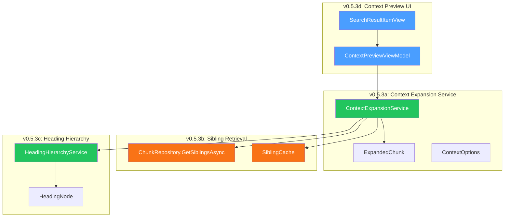
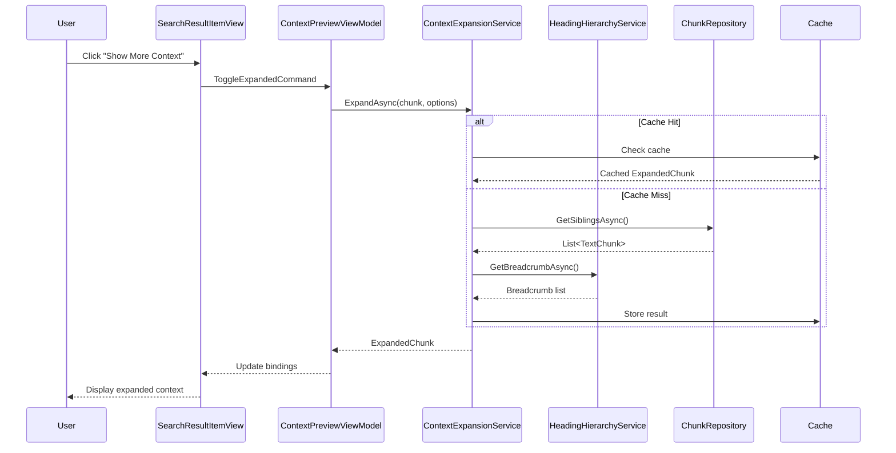

# LCS-DES-053: Design Specification Index — The Context Window

## Document Control

| Field                | Value                                    |
| :------------------- | :--------------------------------------- |
| **Document ID**      | LCS-DES-053-INDEX                        |
| **Feature ID**       | RAG-053                                  |
| **Feature Name**     | The Context Window (Relevance Expansion) |
| **Target Version**   | v0.5.3                                   |
| **Module Scope**     | Lexichord.Modules.RAG                    |
| **Swimlane**         | Memory                                   |
| **License Tier**     | Writer Pro                               |
| **Feature Gate Key** | `FeatureFlags.RAG.ContextWindow`         |
| **Status**           | In Progress                              |
| **Last Updated**     | 2026-02-03                               |

---

## 1. Executive Summary

**v0.5.3** delivers the **Context Window** — intelligent relevance expansion for retrieved search results. This release transforms Lexichord's RAG system from returning isolated text chunks into providing contextually-rich excerpts that include surrounding content and hierarchical navigation.

### 1.1 The Problem

Search results often return isolated text chunks that lack context. Users struggle to understand:

- What comes before and after the matched excerpt
- Where the excerpt fits in the document structure
- Whether the surrounding content provides additional relevant information

### 1.2 The Solution

Implement context expansion that:

- **Retrieves adjacent chunks** (before/after) from the same document
- **Displays heading breadcrumbs** showing document structure hierarchy
- **Provides expandable UI** for inline context preview
- **Caches expansions** for instant repeated access

### 1.3 Business Value

| Value                      | Description                                                |
| :------------------------- | :--------------------------------------------------------- |
| **Enhanced Comprehension** | Users understand search results with surrounding context   |
| **Document Navigation**    | Breadcrumbs help locate excerpts within document structure |
| **Reduced Context Switch** | Preview context inline without opening source document     |
| **Performance**            | Cached expansions enable instant repeated views            |
| **Foundation**             | Enables AI context assembly in v0.6.x                      |

---

## 2. Related Documents

### 2.1 Scope Breakdown Document

The detailed scope breakdown for v0.5.3, including all sub-parts, implementation checklists, user stories, and acceptance criteria:

| Document                            | Description                          |
| :---------------------------------- | :----------------------------------- |
| **[LCS-SBD-053](./LCS-SBD-053.md)** | Scope Breakdown — The Context Window |

### 2.2 Sub-Part Design Specifications

Each sub-part has its own detailed design specification following the LDS-01 template:

| Sub-Part | Document                              | Title                     | Description                             |
| :------- | :------------------------------------ | :------------------------ | :-------------------------------------- |
| v0.5.3a  | **[LCS-DES-053a](./LCS-DES-053a.md)** | Context Expansion Service | IContextExpansionService implementation |
| v0.5.3b  | **[LCS-DES-053b](./LCS-DES-053b.md)** | Sibling Chunk Retrieval   | Adjacent chunk queries with caching     |
| v0.5.3c  | **[LCS-DES-053c](./LCS-DES-053c.md)** | Heading Hierarchy         | Breadcrumb resolution service           |
| v0.5.3d  | **[LCS-DES-053d](./LCS-DES-053d.md)** | Context Preview UI        | Expandable search result component      |

---

## 3. Architecture Overview

### 3.1 Component Diagram



### 3.2 Data Flow



---

## 4. Dependencies

### 4.1 Upstream Dependencies (Required)

| Interface                | Source Version        | Purpose                     |
| :----------------------- | :-------------------- | :-------------------------- |
| `IChunkRepository`       | v0.4.1c               | Chunk storage and retrieval |
| `IDocumentRepository`    | v0.4.1c               | Document metadata           |
| `TextChunk`              | v0.4.3a               | Chunk data structure        |
| `ChunkMetadata`          | v0.4.3a               | Chunk heading context       |
| `ISemanticSearchService` | v0.4.5a               | Search result source        |
| `SearchHit`              | v0.4.5a               | Search result model         |
| `SearchResultItemView`   | v0.4.6b               | UI component to extend      |
| `ICitationService`       | v0.5.2a               | Document path resolution    |
| `ILicenseContext`        | v0.0.4c               | License tier checking       |
| `IMediator`              | v0.0.7a               | Event publishing            |
| `ViewModelBase`          | CommunityToolkit.Mvvm | Observable ViewModel base   |

### 4.2 NuGet Packages

| Package                 | Version | Purpose                |
| :---------------------- | :------ | :--------------------- |
| `CommunityToolkit.Mvvm` | 8.x     | MVVM source generators |
| `MediatR`               | 12.x    | Event publishing       |

### 4.3 Downstream Consumers (Future)

| Version | Feature         | Consumes                                        |
| :------ | :-------------- | :---------------------------------------------- |
| v0.5.4  | Relevance Tuner | `ExpandedChunk` for query context               |
| v0.5.5  | Filter System   | `HeadingNode` for heading-based filtering       |
| v0.6.x  | AI Assistant    | `IContextExpansionService` for context assembly |

---

## 5. License Gating Strategy

The Context Window is a **Writer Pro** feature using a **Soft Gate** strategy.

### 5.1 Behavior by License Tier

| Tier       | Context Button     | Expansion     | Breadcrumb          |
| :--------- | :----------------- | :------------ | :------------------ |
| Core       | Disabled with lock | Not available | Visible (read-only) |
| Writer Pro | Enabled            | Available     | Available           |
| Teams      | Enabled            | Available     | Available           |
| Enterprise | Enabled            | Available     | Available           |

### 5.2 Implementation Pattern

```csharp
if (!_licenseContext.HasFeature(FeatureFlags.RAG.ContextWindow))
{
    // Show upgrade prompt instead of expanding
    await ShowUpgradePromptAsync();
    return;
}

// Proceed with context expansion
var expanded = await _contextService.ExpandAsync(chunk, options);
```

---

## 6. Key Interfaces Summary

| Interface                  | Defined In | Purpose                     |
| :------------------------- | :--------- | :-------------------------- |
| `IContextExpansionService` | v0.5.3a    | Expand chunks with context  |
| `IHeadingHierarchyService` | v0.5.3c    | Resolve heading breadcrumbs |

| Record/DTO       | Defined In | Purpose                        |
| :--------------- | :--------- | :----------------------------- |
| `ContextOptions` | v0.5.3a    | Expansion configuration        |
| `ExpandedChunk`  | v0.5.3a    | Chunk with surrounding context |
| `HeadingNode`    | v0.5.3c    | Heading hierarchy tree node    |

| Event                  | Defined In | Purpose                     |
| :--------------------- | :--------- | :-------------------------- |
| `ContextExpandedEvent` | v0.5.3a    | Context expansion completed |

---

## 7. Implementation Checklist Summary

| Sub-Part    | Tasks                     | Est. Hours   |
| :---------- | :------------------------ | :----------- |
| v0.5.3a     | Context Expansion Service | 6.5          |
| v0.5.3b     | Sibling Chunk Retrieval   | 6.5          |
| v0.5.3c     | Heading Hierarchy         | 6.5          |
| v0.5.3d     | Context Preview UI        | 9            |
| Integration | DI, Events, Tests         | 2.5          |
| **Total**   |                           | **31 hours** |

See [LCS-SBD-053](./LCS-SBD-053.md) Section 4 for the detailed task breakdown.

---

## 8. Success Criteria Summary

| Category        | Criterion                   | Target       |
| :-------------- | :-------------------------- | :----------- |
| **Performance** | Context expansion (cached)  | < 50ms       |
| **Performance** | Context expansion (cold)    | < 200ms      |
| **Accuracy**    | Breadcrumb accuracy         | 95%+ correct |
| **Performance** | Cache hit rate              | 70%+         |
| **UX**          | Animation frame rate        | 60fps+       |
| **Memory**      | Cache overhead (100 chunks) | < 10MB       |

See [LCS-SBD-053](./LCS-SBD-053.md) Section 9 for full success metrics.

---

## 9. Test Coverage Summary

| Sub-Part | Unit Tests                           | Integration Tests    |
| :------- | :----------------------------------- | :------------------- |
| v0.5.3a  | Expansion logic, cache behavior      | Pipeline integration |
| v0.5.3b  | Sibling queries, cache invalidation  | Database queries     |
| v0.5.3c  | Breadcrumb resolution, tree building | Document structure   |
| v0.5.3d  | ViewModel state, license gating      | UI event handling    |

See individual design specs for detailed test scenarios.

---

## 10. What This Enables

| Version | Feature         | Uses From v0.5.3                               |
| :------ | :-------------- | :--------------------------------------------- |
| v0.5.4  | Relevance Tuner | Context for enhanced query understanding       |
| v0.5.5  | Filter System   | Heading hierarchy for section-scoped search    |
| v0.5.6  | Answer Preview  | Heading context for smarter snippet extraction |
| v0.6.x  | AI Assistant    | Context expansion for AI prompt assembly       |

---

## Document History

| Version | Date       | Author         | Changes       |
| :------ | :--------- | :------------- | :------------ |
| 1.0     | 2026-01-27 | Lead Architect | Initial draft |
