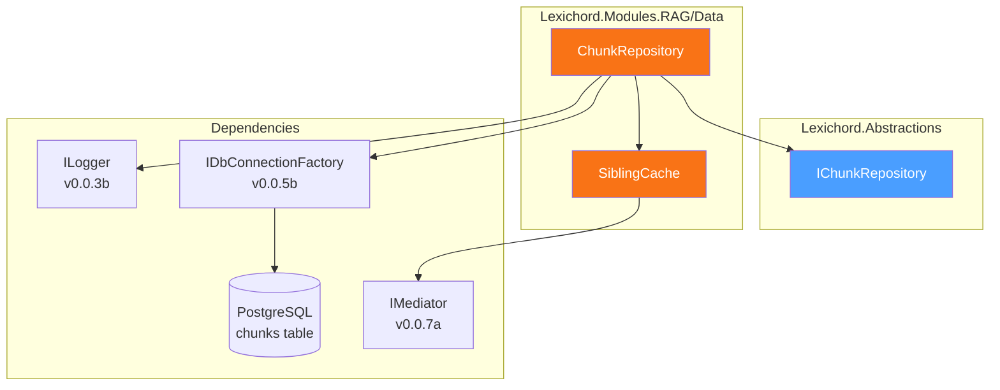

# LCS-DES-053b: Design Specification — Sibling Chunk Retrieval

## 1. Metadata & Categorization

| Field                | Value                            |
| :------------------- | :------------------------------- |
| **Document ID**      | LCS-DES-053b                     |
| **Feature ID**       | RAG-053b                         |
| **Feature Name**     | Sibling Chunk Retrieval          |
| **Parent Feature**   | v0.5.3 — The Context Window      |
| **Module Scope**     | Lexichord.Modules.RAG            |
| **Swimlane**         | Memory                           |
| **License Tier**     | Writer Pro                       |
| **Feature Gate Key** | `FeatureFlags.RAG.ContextWindow` |
| **Status**           | Draft                            |
| **Last Updated**     | 2026-01-27                       |

---

## 2. Executive Summary

### 2.1 Problem Statement

Context expansion requires efficient retrieval of chunks adjacent to a given chunk. The current `IChunkRepository` interface supports vector similarity search but lacks methods for index-based sibling retrieval.

### 2.2 Solution Overview

Extend `IChunkRepository` with `GetSiblingsAsync()` method that:

- Queries chunks by `chunk_index` range within a document
- Uses optimized SQL with index-based filtering
- Implements LRU caching to avoid repeated queries
- Handles document-level cache invalidation

### 2.3 Key Deliverables

| Deliverable                 | Description                                |
| :-------------------------- | :----------------------------------------- |
| `GetSiblingsAsync()` method | Extension to IChunkRepository              |
| Optimized SQL query         | Index-range query with proper ordering     |
| `SiblingCache`              | LRU cache with document-level invalidation |
| Event handlers              | Cache invalidation on document events      |
| Unit tests                  | Coverage for query and cache behavior      |

---

## 3. Architecture & Modular Strategy

### 3.1 Component Diagram



### 3.2 Module Location

```text
src/
├── Lexichord.Abstractions/
│   └── Contracts/
│       └── IChunkRepository.cs             ← Interface extension
│
└── Lexichord.Modules.RAG/
    └── Data/
        ├── ChunkRepository.cs              ← Implementation extension
        └── SiblingCache.cs                 ← Dedicated cache class
```

---

## 4. Data Contract (The API)

### 4.1 IChunkRepository Extension

```csharp
namespace Lexichord.Abstractions.Contracts;

/// <summary>
/// Repository for chunk storage and retrieval with vector similarity search.
/// </summary>
/// <remarks>
/// <para>Implements storage for text chunks with vector embeddings.</para>
/// <para>Extended in v0.5.3b to support sibling chunk retrieval for context expansion.</para>
/// </remarks>
public interface IChunkRepository
{
    // ═══════════════════════════════════════════════════════════════════════════
    // Existing methods from v0.4.1c
    // ═══════════════════════════════════════════════════════════════════════════

    /// <summary>
    /// Inserts a new chunk into the repository.
    /// </summary>
    Task<Guid> InsertAsync(Chunk chunk, CancellationToken cancellationToken = default);

    /// <summary>
    /// Retrieves a chunk by its unique identifier.
    /// </summary>
    Task<Chunk?> GetByIdAsync(Guid id, CancellationToken cancellationToken = default);

    /// <summary>
    /// Performs vector similarity search.
    /// </summary>
    Task<IReadOnlyList<ChunkSearchResult>> SearchSimilarAsync(
        float[] queryVector,
        int topK,
        float minScore,
        CancellationToken cancellationToken = default);

    /// <summary>
    /// Deletes all chunks for a document.
    /// </summary>
    Task DeleteByDocumentIdAsync(Guid documentId, CancellationToken cancellationToken = default);

    // ═══════════════════════════════════════════════════════════════════════════
    // NEW in v0.5.3b: Sibling Chunk Retrieval
    // ═══════════════════════════════════════════════════════════════════════════

    /// <summary>
    /// Retrieves chunks adjacent to a given chunk index within the same document.
    /// </summary>
    /// <param name="documentId">The document containing the chunks.</param>
    /// <param name="centerIndex">The chunk index to center the query around.</param>
    /// <param name="beforeCount">Number of preceding chunks to retrieve (0-5).</param>
    /// <param name="afterCount">Number of following chunks to retrieve (0-5).</param>
    /// <param name="cancellationToken">Cancellation token.</param>
    /// <returns>
    /// List of chunks ordered by chunk_index ascending.
    /// Includes the center chunk and up to beforeCount + afterCount siblings.
    /// </returns>
    /// <remarks>
    /// <para>The returned list includes chunks with indices in range:</para>
    /// <para>[centerIndex - beforeCount, centerIndex + afterCount]</para>
    /// <para>Fewer chunks are returned if near document boundaries.</para>
    /// </remarks>
    /// <example>
    /// <code>
    /// // Get 1 chunk before and 1 chunk after chunk index 5
    /// var siblings = await repo.GetSiblingsAsync(docId, centerIndex: 5, beforeCount: 1, afterCount: 1);
    /// // Returns chunks at indices 4, 5, 6 (if they exist)
    /// </code>
    /// </example>
    Task<IReadOnlyList<TextChunk>> GetSiblingsAsync(
        Guid documentId,
        int centerIndex,
        int beforeCount,
        int afterCount,
        CancellationToken cancellationToken = default);
}
```

---

## 5. Implementation Logic

### 5.1 SQL Query

```sql
-- Optimized sibling chunk query using index range
-- Index: idx_chunks_document_index (document_id, chunk_index)

SELECT
    c.id,
    c.document_id,
    c.chunk_index,
    c.content,
    c.start_offset,
    c.end_offset,
    c.parent_heading_id,
    c.heading,
    c.heading_level,
    c.created_at
FROM chunks c
WHERE c.document_id = @documentId
  AND c.chunk_index >= @minIndex
  AND c.chunk_index <= @maxIndex
ORDER BY c.chunk_index ASC;
```

### 5.2 Index Requirements

```sql
-- Ensure compound index exists for efficient sibling queries
-- This index was created in v0.4.1b migration

CREATE INDEX IF NOT EXISTS idx_chunks_document_index
ON chunks (document_id, chunk_index);
```

### 5.3 ChunkRepository Extension

```csharp
namespace Lexichord.Modules.RAG.Data;

/// <summary>
/// Dapper-based implementation of chunk storage with vector similarity search.
/// Extended for sibling chunk retrieval in v0.5.3b.
/// </summary>
public sealed partial class ChunkRepository : IChunkRepository
{
    private readonly IDbConnectionFactory _connectionFactory;
    private readonly SiblingCache _siblingCache;
    private readonly ILogger<ChunkRepository> _logger;

    private const string GetSiblingsSql = @"
        SELECT
            id,
            document_id,
            chunk_index,
            content,
            start_offset,
            end_offset,
            parent_heading_id,
            heading,
            heading_level,
            created_at
        FROM chunks
        WHERE document_id = @documentId
          AND chunk_index >= @minIndex
          AND chunk_index <= @maxIndex
        ORDER BY chunk_index ASC;";

    /// <summary>
    /// Initializes a new instance of the <see cref="ChunkRepository"/> class.
    /// </summary>
    /// <param name="connectionFactory">Factory for database connections.</param>
    /// <param name="siblingCache">Cache for sibling chunk queries.</param>
    /// <param name="logger">Logger instance.</param>
    public ChunkRepository(
        IDbConnectionFactory connectionFactory,
        SiblingCache siblingCache,
        ILogger<ChunkRepository> logger)
    {
        _connectionFactory = connectionFactory ?? throw new ArgumentNullException(nameof(connectionFactory));
        _siblingCache = siblingCache ?? throw new ArgumentNullException(nameof(siblingCache));
        _logger = logger ?? throw new ArgumentNullException(nameof(logger));
    }

    /// <inheritdoc />
    public async Task<IReadOnlyList<TextChunk>> GetSiblingsAsync(
        Guid documentId,
        int centerIndex,
        int beforeCount,
        int afterCount,
        CancellationToken cancellationToken = default)
    {
        // Validate and clamp counts
        beforeCount = Math.Clamp(beforeCount, 0, 5);
        afterCount = Math.Clamp(afterCount, 0, 5);

        var minIndex = Math.Max(0, centerIndex - beforeCount);
        var maxIndex = centerIndex + afterCount;

        // Create cache key
        var cacheKey = new SiblingCacheKey(documentId, centerIndex, beforeCount, afterCount);

        // Check cache first
        if (_siblingCache.TryGet(cacheKey, out var cached))
        {
            _logger.LogDebug(
                "Cache hit for siblings: doc={DocumentId}, center={CenterIndex}",
                documentId, centerIndex);
            return cached;
        }

        _logger.LogDebug(
            "Querying siblings for doc={DocumentId}, center={CenterIndex}, range=[{MinIndex},{MaxIndex}]",
            documentId, centerIndex, minIndex, maxIndex);

        await using var connection = await _connectionFactory.CreateConnectionAsync(cancellationToken);

        var rows = await connection.QueryAsync<ChunkRow>(
            new CommandDefinition(
                GetSiblingsSql,
                new { documentId, minIndex, maxIndex },
                cancellationToken: cancellationToken));

        var chunks = rows.Select(MapToTextChunk).ToList().AsReadOnly();

        // Cache the result
        _siblingCache.Set(cacheKey, chunks);

        _logger.LogDebug(
            "Retrieved {Count} siblings for doc={DocumentId}, center={CenterIndex}",
            chunks.Count, documentId, centerIndex);

        return chunks;
    }

    /// <summary>
    /// Maps a database row to a TextChunk domain object.
    /// </summary>
    private static TextChunk MapToTextChunk(ChunkRow row) => new(
        Id: row.id,
        DocumentId: row.document_id,
        Content: row.content,
        Metadata: new ChunkMetadata(
            ChunkIndex: row.chunk_index,
            Heading: row.heading,
            HeadingLevel: row.heading_level));

    /// <summary>
    /// Internal row model for Dapper mapping.
    /// </summary>
    private record ChunkRow(
        Guid id,
        Guid document_id,
        int chunk_index,
        string content,
        int start_offset,
        int end_offset,
        Guid? parent_heading_id,
        string? heading,
        int heading_level,
        DateTime created_at);
}
```

### 5.4 SiblingCache Implementation

```csharp
namespace Lexichord.Modules.RAG.Data;

/// <summary>
/// LRU cache for sibling chunk queries with document-level invalidation.
/// </summary>
/// <remarks>
/// <para>Thread-safe via ConcurrentDictionary and lock-free reads.</para>
/// <para>Subscribes to document events for automatic cache invalidation.</para>
/// </remarks>
public sealed class SiblingCache : INotificationHandler<DocumentIndexedEvent>,
                                    INotificationHandler<DocumentRemovedFromIndexEvent>
{
    private readonly ConcurrentDictionary<SiblingCacheKey, CacheEntry> _cache = new();
    private readonly ILogger<SiblingCache> _logger;

    /// <summary>
    /// Maximum number of entries before LRU eviction.
    /// </summary>
    public const int MaxEntries = 500;

    /// <summary>
    /// Number of entries to evict when at capacity.
    /// </summary>
    public const int EvictionBatch = 50;

    /// <summary>
    /// Initializes a new instance of the <see cref="SiblingCache"/> class.
    /// </summary>
    /// <param name="logger">Logger instance.</param>
    public SiblingCache(ILogger<SiblingCache> logger)
    {
        _logger = logger ?? throw new ArgumentNullException(nameof(logger));
    }

    /// <summary>
    /// Attempts to get cached siblings for the given key.
    /// </summary>
    /// <param name="key">The cache key.</param>
    /// <param name="chunks">The cached chunks if found.</param>
    /// <returns>True if cache hit, false otherwise.</returns>
    public bool TryGet(SiblingCacheKey key, out IReadOnlyList<TextChunk> chunks)
    {
        if (_cache.TryGetValue(key, out var entry))
        {
            entry.Touch(); // Update access time for LRU
            chunks = entry.Chunks;
            return true;
        }

        chunks = Array.Empty<TextChunk>();
        return false;
    }

    /// <summary>
    /// Adds or updates a cache entry.
    /// </summary>
    /// <param name="key">The cache key.</param>
    /// <param name="chunks">The chunks to cache.</param>
    public void Set(SiblingCacheKey key, IReadOnlyList<TextChunk> chunks)
    {
        // Evict if at capacity
        if (_cache.Count >= MaxEntries)
        {
            EvictOldest();
        }

        _cache[key] = new CacheEntry(chunks);
    }

    /// <summary>
    /// Invalidates all cache entries for a specific document.
    /// </summary>
    /// <param name="documentId">The document ID to invalidate.</param>
    public void InvalidateDocument(Guid documentId)
    {
        var keysToRemove = _cache.Keys
            .Where(k => k.DocumentId == documentId)
            .ToList();

        foreach (var key in keysToRemove)
        {
            _cache.TryRemove(key, out _);
        }

        if (keysToRemove.Count > 0)
        {
            _logger.LogDebug(
                "Invalidated {Count} sibling cache entries for document {DocumentId}",
                keysToRemove.Count, documentId);
        }
    }

    /// <summary>
    /// Clears the entire cache.
    /// </summary>
    public void Clear()
    {
        var count = _cache.Count;
        _cache.Clear();
        _logger.LogDebug("Sibling cache cleared ({Count} entries)", count);
    }

    /// <summary>
    /// Gets the current number of cached entries.
    /// </summary>
    public int Count => _cache.Count;

    /// <summary>
    /// Handles document indexed events by invalidating stale cache entries.
    /// </summary>
    public Task Handle(DocumentIndexedEvent notification, CancellationToken cancellationToken)
    {
        InvalidateDocument(notification.DocumentId);
        return Task.CompletedTask;
    }

    /// <summary>
    /// Handles document removed events by invalidating cache entries.
    /// </summary>
    public Task Handle(DocumentRemovedFromIndexEvent notification, CancellationToken cancellationToken)
    {
        InvalidateDocument(notification.DocumentId);
        return Task.CompletedTask;
    }

    /// <summary>
    /// Evicts the oldest entries based on last access time.
    /// </summary>
    private void EvictOldest()
    {
        var toEvict = _cache
            .OrderBy(kvp => kvp.Value.LastAccessed)
            .Take(EvictionBatch)
            .Select(kvp => kvp.Key)
            .ToList();

        foreach (var key in toEvict)
        {
            _cache.TryRemove(key, out _);
        }

        _logger.LogDebug("Evicted {Count} oldest sibling cache entries", toEvict.Count);
    }

    /// <summary>
    /// Internal cache entry with access tracking.
    /// </summary>
    private sealed class CacheEntry
    {
        public IReadOnlyList<TextChunk> Chunks { get; }
        public DateTime LastAccessed { get; private set; }

        public CacheEntry(IReadOnlyList<TextChunk> chunks)
        {
            Chunks = chunks;
            LastAccessed = DateTime.UtcNow;
        }

        public void Touch() => LastAccessed = DateTime.UtcNow;
    }
}

/// <summary>
/// Immutable cache key for sibling queries.
/// </summary>
/// <param name="DocumentId">The document containing the chunks.</param>
/// <param name="CenterIndex">The chunk index at the center of the query.</param>
/// <param name="BeforeCount">Number of chunks before center.</param>
/// <param name="AfterCount">Number of chunks after center.</param>
public readonly record struct SiblingCacheKey(
    Guid DocumentId,
    int CenterIndex,
    int BeforeCount,
    int AfterCount);
```

---

## 6. Data Persistence

### 6.1 Existing Database Schema

This sub-part uses the existing `chunks` table from v0.4.1b:

```sql
CREATE TABLE chunks (
    id UUID PRIMARY KEY DEFAULT gen_random_uuid(),
    document_id UUID NOT NULL REFERENCES documents(id) ON DELETE CASCADE,
    chunk_index INT NOT NULL,
    content TEXT NOT NULL,
    start_offset INT NOT NULL,
    end_offset INT NOT NULL,
    embedding VECTOR(1536),
    parent_heading_id UUID,
    heading TEXT,
    heading_level INT NOT NULL DEFAULT 0,
    created_at TIMESTAMPTZ NOT NULL DEFAULT NOW(),

    CONSTRAINT uq_chunks_document_index UNIQUE (document_id, chunk_index)
);

-- Index for sibling queries (already exists from v0.4.1b)
CREATE INDEX idx_chunks_document_index ON chunks (document_id, chunk_index);
```

### 6.2 Index Verification

```sql
-- Verify index exists and is being used
EXPLAIN ANALYZE
SELECT * FROM chunks
WHERE document_id = '00000000-0000-0000-0000-000000000001'
  AND chunk_index BETWEEN 4 AND 6
ORDER BY chunk_index;

-- Expected: Index Scan using idx_chunks_document_index
```

---

## 7. UI/UX Specifications

This sub-part is a data layer component with no direct UI. See [LCS-DES-053d](./LCS-DES-053d.md) for UI specifications.

---

## 8. Observability & Logging

### 8.1 Log Events

| Level | Component       | Event                 | Template                                                                                        |
| :---- | :-------------- | :-------------------- | :---------------------------------------------------------------------------------------------- |
| Debug | ChunkRepository | Cache hit             | `"Cache hit for siblings: doc={DocumentId}, center={CenterIndex}"`                              |
| Debug | ChunkRepository | Query start           | `"Querying siblings for doc={DocumentId}, center={CenterIndex}, range=[{MinIndex},{MaxIndex}]"` |
| Debug | ChunkRepository | Query complete        | `"Retrieved {Count} siblings for doc={DocumentId}, center={CenterIndex}"`                       |
| Debug | SiblingCache    | Document invalidation | `"Invalidated {Count} sibling cache entries for document {DocumentId}"`                         |
| Debug | SiblingCache    | Cache cleared         | `"Sibling cache cleared ({Count} entries)"`                                                     |
| Debug | SiblingCache    | LRU eviction          | `"Evicted {Count} oldest sibling cache entries"`                                                |

### 8.2 Performance Metrics (Future v0.6+)

| Metric                     | Type      | Description               |
| :------------------------- | :-------- | :------------------------ |
| `sibling.query.latency_ms` | Histogram | Database query latency    |
| `sibling.cache.hit`        | Counter   | Cache hit count           |
| `sibling.cache.miss`       | Counter   | Cache miss count          |
| `sibling.cache.size`       | Gauge     | Current cache entry count |
| `sibling.cache.eviction`   | Counter   | LRU eviction count        |

---

## 9. Security & Safety

### 9.1 Input Validation

- `beforeCount` and `afterCount` clamped to [0, 5] range
- `centerIndex` validated as non-negative
- `documentId` validated as non-empty GUID

### 9.2 SQL Injection Prevention

- All parameters passed via Dapper parameterized queries
- No string concatenation in SQL construction

### 9.3 Resource Protection

- Cache size bounded at 500 entries
- LRU eviction prevents unbounded memory growth
- Automatic invalidation on document events

---

## 10. Acceptance Criteria

| #   | Category        | Criterion                                                | Verification     |
| :-- | :-------------- | :------------------------------------------------------- | :--------------- |
| 1   | **Functional**  | `GetSiblingsAsync` returns correct chunks by index range | Unit test        |
| 2   | **Functional**  | Results are ordered by chunk_index ascending             | Unit test        |
| 3   | **Functional**  | First chunk in document has no preceding siblings        | Unit test        |
| 4   | **Functional**  | Last chunk in document has no following siblings         | Unit test        |
| 5   | **Performance** | Query uses idx_chunks_document_index                     | EXPLAIN ANALYZE  |
| 6   | **Performance** | Cache hit returns in < 1ms                               | Performance test |
| 7   | **Caching**     | Second query for same parameters uses cache              | Unit test        |
| 8   | **Caching**     | DocumentIndexedEvent invalidates document cache          | Unit test        |
| 9   | **Caching**     | DocumentRemovedFromIndexEvent invalidates document cache | Unit test        |
| 10  | **Caching**     | LRU eviction triggers at MaxEntries                      | Unit test        |

---

## 11. Code Examples

### 11.1 Basic Usage

```csharp
// Inject via constructor (typically through IContextExpansionService)
public class ContextExpansionService : IContextExpansionService
{
    private readonly IChunkRepository _chunkRepository;

    public async Task<ExpandedChunk> ExpandAsync(TextChunk chunk, ContextOptions options)
    {
        // Query siblings (1 before, 1 after)
        var siblings = await _chunkRepository.GetSiblingsAsync(
            chunk.DocumentId,
            chunk.Metadata.ChunkIndex,
            beforeCount: options.PrecedingChunks,
            afterCount: options.FollowingChunks);

        // Partition results
        var before = siblings.Where(c => c.Metadata.ChunkIndex < chunk.Metadata.ChunkIndex).ToList();
        var after = siblings.Where(c => c.Metadata.ChunkIndex > chunk.Metadata.ChunkIndex).ToList();

        return new ExpandedChunk(chunk, before, after, null, Array.Empty<string>());
    }
}
```

### 11.2 Cache Invalidation on Re-indexing

```csharp
// This is handled automatically by SiblingCache via MediatR
// When DocumentIndexedEvent is published, cache is invalidated

// Example: Re-index triggers invalidation
await _indexingPipeline.IndexDocumentAsync(document);
// publishes DocumentIndexedEvent
// SiblingCache.Handle() is called
// All cache entries for that document are removed
```

---

## 12. Unit Testing Requirements

### 12.1 Test Scenarios

```csharp
[Trait("Category", "Unit")]
[Trait("Feature", "v0.5.3b")]
public class ChunkRepositoryGetSiblingsTests
{
    private readonly Mock<IDbConnectionFactory> _connectionFactoryMock;
    private readonly SiblingCache _siblingCache;
    private readonly Mock<ILogger<ChunkRepository>> _loggerMock;

    [Fact]
    public async Task GetSiblingsAsync_WithValidRange_ReturnsOrderedChunks()
    {
        // Arrange
        var docId = Guid.NewGuid();
        var mockChunks = new[]
        {
            CreateChunkRow(docId, index: 4),
            CreateChunkRow(docId, index: 5),
            CreateChunkRow(docId, index: 6)
        };

        SetupMockConnection(mockChunks);
        var sut = CreateRepository();

        // Act
        var result = await sut.GetSiblingsAsync(docId, centerIndex: 5, beforeCount: 1, afterCount: 1);

        // Assert
        result.Should().HaveCount(3);
        result[0].Metadata.ChunkIndex.Should().Be(4);
        result[1].Metadata.ChunkIndex.Should().Be(5);
        result[2].Metadata.ChunkIndex.Should().Be(6);
    }

    [Fact]
    public async Task GetSiblingsAsync_AtStart_ReturnsNoBeforeSiblings()
    {
        // Arrange
        var docId = Guid.NewGuid();
        var mockChunks = new[]
        {
            CreateChunkRow(docId, index: 0),
            CreateChunkRow(docId, index: 1)
        };

        SetupMockConnection(mockChunks);
        var sut = CreateRepository();

        // Act
        var result = await sut.GetSiblingsAsync(docId, centerIndex: 0, beforeCount: 2, afterCount: 1);

        // Assert
        result.Should().HaveCount(2); // Only index 0 and 1, no negative indices
        result[0].Metadata.ChunkIndex.Should().Be(0);
        result[1].Metadata.ChunkIndex.Should().Be(1);
    }

    [Fact]
    public async Task GetSiblingsAsync_CacheHit_DoesNotQueryDatabase()
    {
        // Arrange
        var docId = Guid.NewGuid();
        SetupMockConnection(Array.Empty<ChunkRow>());
        var sut = CreateRepository();

        // First call populates cache
        await sut.GetSiblingsAsync(docId, centerIndex: 5, beforeCount: 1, afterCount: 1);

        // Act - Second call
        await sut.GetSiblingsAsync(docId, centerIndex: 5, beforeCount: 1, afterCount: 1);

        // Assert - Connection should only be created once
        _connectionFactoryMock.Verify(
            f => f.CreateConnectionAsync(It.IsAny<CancellationToken>()),
            Times.Once);
    }

    [Theory]
    [InlineData(-1)]
    [InlineData(10)]
    public async Task GetSiblingsAsync_ClampsBeforeAndAfterCounts(int invalidCount)
    {
        // Arrange
        var docId = Guid.NewGuid();
        SetupMockConnection(Array.Empty<ChunkRow>());
        var sut = CreateRepository();

        // Act - Should not throw, values are clamped
        var act = () => sut.GetSiblingsAsync(docId, centerIndex: 5, beforeCount: invalidCount, afterCount: invalidCount);

        // Assert
        await act.Should().NotThrowAsync();
    }
}

[Trait("Category", "Unit")]
[Trait("Feature", "v0.5.3b")]
public class SiblingCacheTests
{
    [Fact]
    public void TryGet_AfterSet_ReturnsTrue()
    {
        // Arrange
        var sut = new SiblingCache(Mock.Of<ILogger<SiblingCache>>());
        var key = new SiblingCacheKey(Guid.NewGuid(), 5, 1, 1);
        var chunks = new List<TextChunk> { CreateTestChunk(5) };

        sut.Set(key, chunks);

        // Act
        var found = sut.TryGet(key, out var result);

        // Assert
        found.Should().BeTrue();
        result.Should().BeEquivalentTo(chunks);
    }

    [Fact]
    public void InvalidateDocument_RemovesOnlyMatchingEntries()
    {
        // Arrange
        var sut = new SiblingCache(Mock.Of<ILogger<SiblingCache>>());
        var docId1 = Guid.NewGuid();
        var docId2 = Guid.NewGuid();

        sut.Set(new SiblingCacheKey(docId1, 5, 1, 1), new List<TextChunk>());
        sut.Set(new SiblingCacheKey(docId1, 10, 1, 1), new List<TextChunk>());
        sut.Set(new SiblingCacheKey(docId2, 5, 1, 1), new List<TextChunk>());

        // Act
        sut.InvalidateDocument(docId1);

        // Assert
        sut.Count.Should().Be(1); // Only docId2 entry remains
        sut.TryGet(new SiblingCacheKey(docId2, 5, 1, 1), out _).Should().BeTrue();
    }

    [Fact]
    public void Set_AtMaxCapacity_EvictsOldestEntries()
    {
        // Arrange
        var sut = new SiblingCache(Mock.Of<ILogger<SiblingCache>>());

        // Fill cache to capacity
        for (int i = 0; i < SiblingCache.MaxEntries; i++)
        {
            sut.Set(new SiblingCacheKey(Guid.NewGuid(), i, 1, 1), new List<TextChunk>());
        }

        sut.Count.Should().Be(SiblingCache.MaxEntries);

        // Act - Add one more entry
        sut.Set(new SiblingCacheKey(Guid.NewGuid(), 999, 1, 1), new List<TextChunk>());

        // Assert - Should have evicted oldest batch
        sut.Count.Should().BeLessOrEqualTo(SiblingCache.MaxEntries - SiblingCache.EvictionBatch + 1);
    }

    [Fact]
    public async Task Handle_DocumentIndexedEvent_InvalidatesDocument()
    {
        // Arrange
        var sut = new SiblingCache(Mock.Of<ILogger<SiblingCache>>());
        var docId = Guid.NewGuid();
        sut.Set(new SiblingCacheKey(docId, 5, 1, 1), new List<TextChunk>());

        var @event = new DocumentIndexedEvent(docId, "test.md", DateTime.UtcNow);

        // Act
        await sut.Handle(@event, CancellationToken.None);

        // Assert
        sut.Count.Should().Be(0);
    }
}
```

---

## 13. Deliverable Checklist

| #   | Deliverable                                              | Status |
| :-- | :------------------------------------------------------- | :----- |
| 1   | `GetSiblingsAsync()` method added to `IChunkRepository`  | [ ]    |
| 2   | `GetSiblingsAsync()` implementation in `ChunkRepository` | [ ]    |
| 3   | `SiblingCacheKey` record struct                          | [ ]    |
| 4   | `SiblingCache` class with LRU eviction                   | [ ]    |
| 5   | MediatR handlers for cache invalidation                  | [ ]    |
| 6   | Unit tests for `GetSiblingsAsync()`                      | [ ]    |
| 7   | Unit tests for `SiblingCache`                            | [ ]    |
| 8   | Verify `idx_chunks_document_index` is used               | [ ]    |
| 9   | DI registration for `SiblingCache`                       | [ ]    |

---

## Document History

| Version | Date       | Author         | Changes       |
| :------ | :--------- | :------------- | :------------ |
| 1.0     | 2026-01-27 | Lead Architect | Initial draft |
