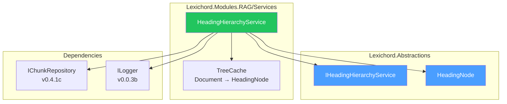
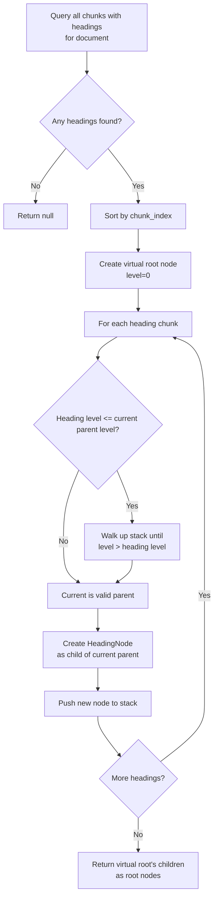
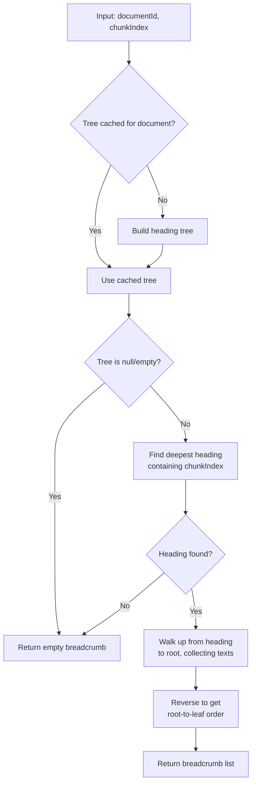

# LCS-DES-053c: Design Specification — Heading Hierarchy

## 1. Metadata & Categorization

| Field                | Value                            |
| :------------------- | :------------------------------- |
| **Document ID**      | LCS-DES-053c                     |
| **Feature ID**       | RAG-053c                         |
| **Feature Name**     | Heading Hierarchy                |
| **Parent Feature**   | v0.5.3 — The Context Window      |
| **Module Scope**     | Lexichord.Modules.RAG            |
| **Swimlane**         | Memory                           |
| **License Tier**     | Writer Pro                       |
| **Feature Gate Key** | `FeatureFlags.RAG.ContextWindow` |
| **Status**           | Draft                            |
| **Last Updated**     | 2026-01-27                       |

---

## 2. Executive Summary

### 2.1 Problem Statement

When users view a search result, they lack awareness of where the excerpt fits within the document's structure. Is it in the introduction? A subsection of authentication? Part of troubleshooting? Without heading context, users must navigate to the source document to understand placement.

### 2.2 Solution Overview

Implement `IHeadingHierarchyService` that resolves heading breadcrumb trails for document chunks:

- **Builds heading trees** from chunk metadata
- **Resolves breadcrumbs** showing path from root to immediate parent heading
- **Caches heading trees** per document for repeated queries
- **Provides structural navigation** for document understanding

### 2.3 Key Deliverables

| Deliverable                | Description                              |
| :------------------------- | :--------------------------------------- |
| `IHeadingHierarchyService` | Interface in Lexichord.Abstractions      |
| `HeadingHierarchyService`  | Implementation in Modules.RAG/Services   |
| `HeadingNode`              | Recursive tree node record               |
| Heading tree builder       | Constructs tree from chunk metadata      |
| Breadcrumb resolver        | Walks tree to generate breadcrumb path   |
| Unit tests                 | Coverage for tree building and traversal |

---

## 3. Architecture & Modular Strategy

### 3.1 Component Diagram



### 3.2 Module Location

```text
src/
├── Lexichord.Abstractions/
│   └── Contracts/
│       ├── IHeadingHierarchyService.cs     ← Interface
│       └── HeadingNode.cs                  ← Tree node record
│
└── Lexichord.Modules.RAG/
    └── Services/
        └── HeadingHierarchyService.cs      ← Implementation
```

---

## 4. Data Contract (The API)

### 4.1 IHeadingHierarchyService Interface

```csharp
namespace Lexichord.Abstractions.Contracts;

/// <summary>
/// Resolves heading hierarchy for document chunks.
/// </summary>
/// <remarks>
/// <para>Builds heading trees from chunk metadata (heading, heading_level).</para>
/// <para>Provides breadcrumb trails for navigation and context display.</para>
/// <para>Caches heading trees per document for efficient repeated queries.</para>
/// </remarks>
/// <example>
/// <code>
/// var breadcrumb = await headingService.GetBreadcrumbAsync(documentId, chunkIndex: 42);
/// // Returns: ["Authentication", "OAuth", "Token Refresh"]
/// </code>
/// </example>
public interface IHeadingHierarchyService
{
    /// <summary>
    /// Gets the heading breadcrumb trail for a chunk at the given index.
    /// </summary>
    /// <param name="documentId">The document ID.</param>
    /// <param name="chunkIndex">The chunk index to find the breadcrumb for.</param>
    /// <param name="cancellationToken">Cancellation token.</param>
    /// <returns>
    /// Ordered list of headings from root to immediate parent.
    /// Example: ["Authentication", "OAuth", "Token Refresh"]
    /// Empty if chunk is not under any heading.
    /// </returns>
    /// <exception cref="ArgumentException">Thrown if chunkIndex is negative.</exception>
    Task<IReadOnlyList<string>> GetBreadcrumbAsync(
        Guid documentId,
        int chunkIndex,
        CancellationToken cancellationToken = default);

    /// <summary>
    /// Builds the full heading tree for a document.
    /// </summary>
    /// <param name="documentId">The document ID.</param>
    /// <param name="cancellationToken">Cancellation token.</param>
    /// <returns>
    /// Root heading node with nested children.
    /// Null if document has no headings.
    /// </returns>
    /// <remarks>
    /// The tree structure reflects Markdown heading hierarchy:
    /// - H1 headings are at root level
    /// - H2 headings are children of preceding H1
    /// - H3 headings are children of preceding H2
    /// etc.
    /// </remarks>
    Task<HeadingNode?> BuildHeadingTreeAsync(
        Guid documentId,
        CancellationToken cancellationToken = default);

    /// <summary>
    /// Clears the heading tree cache for a specific document.
    /// </summary>
    /// <param name="documentId">Document ID to clear from cache.</param>
    void InvalidateCache(Guid documentId);

    /// <summary>
    /// Clears the entire heading tree cache.
    /// </summary>
    void ClearCache();
}
```

### 4.2 HeadingNode Record

```csharp
namespace Lexichord.Abstractions.Contracts;

/// <summary>
/// A node in the heading hierarchy tree.
/// </summary>
/// <param name="Id">Unique identifier for this heading (may be chunk ID).</param>
/// <param name="Text">The heading text, e.g., "Authentication".</param>
/// <param name="Level">Heading level (1-6 for Markdown # through ######).</param>
/// <param name="ChunkIndex">The chunk index where this heading appears.</param>
/// <param name="Children">Child headings nested under this one.</param>
/// <remarks>
/// <para>Level 1 = H1 (# in Markdown), Level 2 = H2 (##), etc.</para>
/// <para>Children are headings with higher level numbers that appear after this
/// heading and before the next heading of equal or lower level.</para>
/// </remarks>
/// <example>
/// <code>
/// // Document structure:
/// // # Authentication (level 1, index 0)
/// //   ## OAuth (level 2, index 5)
/// //     ### Token Refresh (level 3, index 10)
/// //   ## Basic Auth (level 2, index 15)
/// // # Authorization (level 1, index 20)
///
/// var tree = await headingService.BuildHeadingTreeAsync(docId);
/// // tree.Text = "Authentication"
/// // tree.Children[0].Text = "OAuth"
/// // tree.Children[0].Children[0].Text = "Token Refresh"
/// </code>
/// </example>
public record HeadingNode(
    Guid Id,
    string Text,
    int Level,
    int ChunkIndex,
    IReadOnlyList<HeadingNode> Children)
{
    /// <summary>
    /// Creates a new leaf node (no children).
    /// </summary>
    public static HeadingNode Leaf(Guid id, string text, int level, int chunkIndex) =>
        new(id, text, level, chunkIndex, Array.Empty<HeadingNode>());

    /// <summary>
    /// Returns true if this node has child headings.
    /// </summary>
    public bool HasChildren => Children.Count > 0;

    /// <summary>
    /// Finds the deepest heading that contains the given chunk index.
    /// </summary>
    /// <param name="targetIndex">The chunk index to find.</param>
    /// <param name="nextSiblingIndex">The chunk index of the next sibling (or int.MaxValue).</param>
    /// <returns>The heading node if found, null otherwise.</returns>
    public HeadingNode? FindContainingHeading(int targetIndex, int nextSiblingIndex)
    {
        // This heading doesn't contain the target if:
        // - Target is before this heading
        // - Target is at or after the next sibling
        if (targetIndex < ChunkIndex || targetIndex >= nextSiblingIndex)
        {
            return null;
        }

        // Check children first (find deepest match)
        for (int i = 0; i < Children.Count; i++)
        {
            var child = Children[i];
            var childNextSibling = i + 1 < Children.Count
                ? Children[i + 1].ChunkIndex
                : nextSiblingIndex;

            var found = child.FindContainingHeading(targetIndex, childNextSibling);
            if (found != null)
            {
                return found;
            }
        }

        // No child contains it, but this heading does
        return this;
    }
}
```

---

## 5. Implementation Logic

### 5.1 Heading Tree Building Algorithm



### 5.2 Breadcrumb Resolution Algorithm



### 5.3 Decision Tree: Which Heading Contains a Chunk?

```text
For chunk at index N, find containing heading:
│
├── Start at root level of heading tree
│
├── For each root heading at index H:
│   ├── Is H <= N < next_sibling_index?
│   │   ├── YES → This heading might contain N
│   │   │   └── Recursively check children for deeper match
│   │   └── NO → Check next root heading
│
├── Return deepest matching heading
│
└── If no heading matches → Return empty breadcrumb

EXAMPLE:
Document with headings at indices:
  H1 "Auth" at 0
    H2 "OAuth" at 5
      H3 "Tokens" at 10
    H2 "Basic" at 15
  H1 "Authz" at 20

Chunk at index 12:
  - H1 "Auth" (0) contains 12? 0 <= 12 < 20 → YES
    - H2 "OAuth" (5) contains 12? 5 <= 12 < 15 → YES
      - H3 "Tokens" (10) contains 12? 10 <= 12 < 15 → YES (deepest)
  - Return H3 "Tokens"
  - Breadcrumb: ["Auth", "OAuth", "Tokens"]
```

### 5.4 Implementation

```csharp
namespace Lexichord.Modules.RAG.Services;

/// <summary>
/// Resolves heading hierarchy and breadcrumb trails for document chunks.
/// Caches heading trees per document for efficient repeated queries.
/// </summary>
public sealed class HeadingHierarchyService : IHeadingHierarchyService
{
    private readonly IChunkRepository _chunkRepository;
    private readonly ILogger<HeadingHierarchyService> _logger;
    private readonly ConcurrentDictionary<Guid, HeadingTree> _treeCache = new();

    private const int MaxCacheSize = 50;

    /// <summary>
    /// Initializes a new instance of the <see cref="HeadingHierarchyService"/> class.
    /// </summary>
    public HeadingHierarchyService(
        IChunkRepository chunkRepository,
        ILogger<HeadingHierarchyService> logger)
    {
        _chunkRepository = chunkRepository ?? throw new ArgumentNullException(nameof(chunkRepository));
        _logger = logger ?? throw new ArgumentNullException(nameof(logger));
    }

    /// <inheritdoc />
    public async Task<IReadOnlyList<string>> GetBreadcrumbAsync(
        Guid documentId,
        int chunkIndex,
        CancellationToken cancellationToken = default)
    {
        if (chunkIndex < 0)
        {
            throw new ArgumentException("Chunk index must be non-negative", nameof(chunkIndex));
        }

        _logger.LogDebug(
            "Resolving breadcrumb for doc={DocumentId}, chunkIndex={ChunkIndex}",
            documentId, chunkIndex);

        // Get or build heading tree
        var tree = await GetOrBuildTreeAsync(documentId, cancellationToken);

        if (tree == null || tree.RootNodes.Count == 0)
        {
            _logger.LogDebug(
                "No headings found for document {DocumentId}",
                documentId);
            return Array.Empty<string>();
        }

        // Find the deepest heading containing this chunk
        var path = FindHeadingPath(tree.RootNodes, chunkIndex, int.MaxValue);

        if (path.Count == 0)
        {
            _logger.LogDebug(
                "Chunk {ChunkIndex} is not under any heading in document {DocumentId}",
                chunkIndex, documentId);
            return Array.Empty<string>();
        }

        var breadcrumb = path.Select(h => h.Text).ToList().AsReadOnly();

        _logger.LogDebug(
            "Breadcrumb resolved for doc={DocumentId}, chunkIndex={ChunkIndex}: {Breadcrumb}",
            documentId, chunkIndex, string.Join(" > ", breadcrumb));

        return breadcrumb;
    }

    /// <inheritdoc />
    public async Task<HeadingNode?> BuildHeadingTreeAsync(
        Guid documentId,
        CancellationToken cancellationToken = default)
    {
        var tree = await GetOrBuildTreeAsync(documentId, cancellationToken);

        // Return first root node, or null if no headings
        return tree?.RootNodes.FirstOrDefault();
    }

    /// <inheritdoc />
    public void InvalidateCache(Guid documentId)
    {
        if (_treeCache.TryRemove(documentId, out _))
        {
            _logger.LogDebug("Invalidated heading tree cache for document {DocumentId}", documentId);
        }
    }

    /// <inheritdoc />
    public void ClearCache()
    {
        var count = _treeCache.Count;
        _treeCache.Clear();
        _logger.LogDebug("Heading tree cache cleared ({Count} documents)", count);
    }

    /// <summary>
    /// Gets cached tree or builds a new one.
    /// </summary>
    private async Task<HeadingTree?> GetOrBuildTreeAsync(
        Guid documentId,
        CancellationToken cancellationToken)
    {
        if (_treeCache.TryGetValue(documentId, out var cached))
        {
            return cached;
        }

        var tree = await BuildTreeFromDatabaseAsync(documentId, cancellationToken);

        if (tree != null)
        {
            AddToCache(documentId, tree);
        }

        return tree;
    }

    /// <summary>
    /// Builds heading tree from chunk metadata.
    /// </summary>
    private async Task<HeadingTree?> BuildTreeFromDatabaseAsync(
        Guid documentId,
        CancellationToken cancellationToken)
    {
        _logger.LogDebug("Building heading tree for document {DocumentId}", documentId);

        // Query chunks that have headings
        var headingChunks = await _chunkRepository.GetChunksWithHeadingsAsync(
            documentId,
            cancellationToken);

        if (headingChunks.Count == 0)
        {
            return null;
        }

        // Sort by chunk index
        var sortedHeadings = headingChunks
            .Where(c => !string.IsNullOrEmpty(c.Metadata.Heading))
            .OrderBy(c => c.Metadata.ChunkIndex)
            .ToList();

        if (sortedHeadings.Count == 0)
        {
            return null;
        }

        // Build tree using stack-based algorithm
        var rootNodes = new List<HeadingNode>();
        var stack = new Stack<MutableNode>();

        foreach (var chunk in sortedHeadings)
        {
            var newNode = new MutableNode(
                Id: chunk.Id,
                Text: chunk.Metadata.Heading!,
                Level: chunk.Metadata.HeadingLevel,
                ChunkIndex: chunk.Metadata.ChunkIndex);

            // Pop stack until we find a valid parent
            while (stack.Count > 0 && stack.Peek().Level >= newNode.Level)
            {
                stack.Pop();
            }

            if (stack.Count == 0)
            {
                // This is a root-level heading
                rootNodes.Add(newNode.ToImmutable());
                stack.Push(newNode);
            }
            else
            {
                // Add as child of current parent
                var parent = stack.Peek();
                parent.Children.Add(newNode);
                stack.Push(newNode);
            }
        }

        // Convert mutable tree to immutable
        var immutableRoots = rootNodes
            .Select(ConvertToImmutableRecursive)
            .ToList()
            .AsReadOnly();

        _logger.LogDebug(
            "Built heading tree for document {DocumentId}: {RootCount} root headings",
            documentId, immutableRoots.Count);

        return new HeadingTree(immutableRoots);
    }

    /// <summary>
    /// Finds the path from root to the deepest heading containing the chunk index.
    /// </summary>
    private static List<HeadingNode> FindHeadingPath(
        IReadOnlyList<HeadingNode> nodes,
        int targetIndex,
        int maxIndex)
    {
        for (int i = 0; i < nodes.Count; i++)
        {
            var node = nodes[i];
            var nextSiblingIndex = i + 1 < nodes.Count ? nodes[i + 1].ChunkIndex : maxIndex;

            // Does this heading's range contain the target?
            if (node.ChunkIndex <= targetIndex && targetIndex < nextSiblingIndex)
            {
                var path = new List<HeadingNode> { node };

                // Recursively check children for deeper match
                if (node.HasChildren)
                {
                    var childPath = FindHeadingPath(node.Children, targetIndex, nextSiblingIndex);
                    path.AddRange(childPath);
                }

                return path;
            }
        }

        return new List<HeadingNode>();
    }

    /// <summary>
    /// Converts mutable node to immutable recursively.
    /// </summary>
    private static HeadingNode ConvertToImmutableRecursive(object node)
    {
        if (node is MutableNode mutable)
        {
            var children = mutable.Children
                .Select(ConvertToImmutableRecursive)
                .ToList()
                .AsReadOnly();

            return new HeadingNode(
                mutable.Id,
                mutable.Text,
                mutable.Level,
                mutable.ChunkIndex,
                children);
        }

        return (HeadingNode)node;
    }

    /// <summary>
    /// Adds tree to cache with eviction if at capacity.
    /// </summary>
    private void AddToCache(Guid documentId, HeadingTree tree)
    {
        if (_treeCache.Count >= MaxCacheSize)
        {
            // Simple eviction: remove first entry
            var first = _treeCache.Keys.FirstOrDefault();
            if (first != default)
            {
                _treeCache.TryRemove(first, out _);
            }
        }

        _treeCache.TryAdd(documentId, tree);
    }

    /// <summary>
    /// Mutable node for tree construction.
    /// </summary>
    private record MutableNode(Guid Id, string Text, int Level, int ChunkIndex)
    {
        public List<MutableNode> Children { get; } = new();

        public HeadingNode ToImmutable() => new(Id, Text, Level, ChunkIndex, Array.Empty<HeadingNode>());
    }

    /// <summary>
    /// Cached heading tree structure.
    /// </summary>
    private record HeadingTree(IReadOnlyList<HeadingNode> RootNodes);
}
```

---

## 6. Data Persistence

### 6.1 Required Chunk Metadata

This sub-part relies on chunk metadata from v0.4.3:

| Field           | Type   | Description                           |
| :-------------- | :----- | :------------------------------------ |
| `heading`       | `TEXT` | The heading text (null if no heading) |
| `heading_level` | `INT`  | Heading level 1-6 (0 if no heading)   |
| `chunk_index`   | `INT`  | Position of chunk in document         |

### 6.2 Required Repository Method

The implementation requires a new method on `IChunkRepository`:

```csharp
/// <summary>
/// Retrieves all chunks that have headings for a document.
/// </summary>
Task<IReadOnlyList<TextChunk>> GetChunksWithHeadingsAsync(
    Guid documentId,
    CancellationToken cancellationToken = default);
```

SQL Query:

```sql
SELECT id, document_id, chunk_index, content, heading, heading_level
FROM chunks
WHERE document_id = @documentId
  AND heading IS NOT NULL
ORDER BY chunk_index;
```

---

## 7. UI/UX Specifications

This sub-part is a service layer component. See [LCS-DES-053d](./LCS-DES-053d.md) for breadcrumb UI specifications.

### 7.1 Breadcrumb Display Format

| Format    | Example                           | Usage                |
| :-------- | :-------------------------------- | :------------------- |
| Default   | `Authentication > OAuth > Tokens` | Search result header |
| Compact   | `…/OAuth/Tokens`                  | Narrow UI contexts   |
| Full Path | `auth-guide.md / Authentication…` | Tooltips             |

---

## 8. Observability & Logging

### 8.1 Log Events

| Level | Event                   | Template                                                                            |
| :---- | :---------------------- | :---------------------------------------------------------------------------------- |
| Debug | Breadcrumb resolution   | `"Resolving breadcrumb for doc={DocumentId}, chunkIndex={ChunkIndex}"`              |
| Debug | No headings found       | `"No headings found for document {DocumentId}"`                                     |
| Debug | Chunk not under heading | `"Chunk {ChunkIndex} is not under any heading in document {DocumentId}"`            |
| Debug | Breadcrumb resolved     | `"Breadcrumb resolved for doc={DocumentId}, chunkIndex={ChunkIndex}: {Breadcrumb}"` |
| Debug | Tree building started   | `"Building heading tree for document {DocumentId}"`                                 |
| Debug | Tree building complete  | `"Built heading tree for document {DocumentId}: {RootCount} root headings"`         |
| Debug | Cache invalidation      | `"Invalidated heading tree cache for document {DocumentId}"`                        |
| Debug | Cache cleared           | `"Heading tree cache cleared ({Count} documents)"`                                  |

---

## 9. Security & Safety

### 9.1 Input Validation

- `chunkIndex` validated as non-negative
- `documentId` validated as non-empty GUID

### 9.2 Edge Cases

| Edge Case                  | Behavior                         |
| :------------------------- | :------------------------------- |
| Document has no headings   | Return empty breadcrumb          |
| Chunk before first heading | Return empty breadcrumb          |
| Malformed heading levels   | Best-effort tree construction    |
| Empty heading text         | Skip during tree construction    |
| Single H1 document         | Return single-element breadcrumb |

---

## 10. Acceptance Criteria

| #   | Category        | Criterion                                                     | Verification |
| :-- | :-------------- | :------------------------------------------------------------ | :----------- |
| 1   | **Functional**  | `GetBreadcrumbAsync` returns correct path for nested headings | Unit test    |
| 2   | **Functional**  | Breadcrumb is empty for chunks before any heading             | Unit test    |
| 3   | **Functional**  | `BuildHeadingTreeAsync` correctly nests headings by level     | Unit test    |
| 4   | **Functional**  | Tree handles H1 → H3 skip (missing H2)                        | Unit test    |
| 5   | **Performance** | Breadcrumb resolution uses cached tree                        | Unit test    |
| 6   | **Performance** | Tree building queries database once per document              | Unit test    |
| 7   | **Caching**     | Second breadcrumb query for same document uses cache          | Unit test    |
| 8   | **Caching**     | `InvalidateCache` removes specific document tree              | Unit test    |
| 9   | **Edge Case**   | Document with no headings returns null tree                   | Unit test    |
| 10  | **Edge Case**   | Chunk after last heading belongs to that heading              | Unit test    |

---

## 11. Code Examples

### 11.1 Basic Breadcrumb Usage

```csharp
// In ContextExpansionService
public async Task<ExpandedChunk> ExpandAsync(TextChunk chunk, ContextOptions options)
{
    // ... sibling retrieval ...

    IReadOnlyList<string> breadcrumb = Array.Empty<string>();
    string? parentHeading = null;

    if (options.IncludeHeadings)
    {
        breadcrumb = await _headingService.GetBreadcrumbAsync(
            chunk.DocumentId,
            chunk.Metadata.ChunkIndex);

        parentHeading = breadcrumb.LastOrDefault();
    }

    return new ExpandedChunk(chunk, before, after, parentHeading, breadcrumb);
}
```

### 11.2 Building Heading Tree

```csharp
// For document structure visualization
var tree = await _headingService.BuildHeadingTreeAsync(documentId);

if (tree != null)
{
    PrintHeadingTree(tree, indent: 0);
}

void PrintHeadingTree(HeadingNode node, int indent)
{
    Console.WriteLine($"{new string(' ', indent * 2)}{node.Text} (H{node.Level})");
    foreach (var child in node.Children)
    {
        PrintHeadingTree(child, indent + 1);
    }
}

// Output:
// Authentication (H1)
//   OAuth (H2)
//     Token Refresh (H3)
//   Basic Auth (H2)
// Authorization (H1)
```

### 11.3 Cache Invalidation

```csharp
// When document is re-indexed, invalidate heading cache
public class DocumentIndexedHandler : INotificationHandler<DocumentIndexedEvent>
{
    private readonly IHeadingHierarchyService _headingService;

    public Task Handle(DocumentIndexedEvent notification, CancellationToken cancellationToken)
    {
        _headingService.InvalidateCache(notification.DocumentId);
        return Task.CompletedTask;
    }
}
```

---

## 12. Unit Testing Requirements

### 12.1 Test Scenarios

```csharp
[Trait("Category", "Unit")]
[Trait("Feature", "v0.5.3c")]
public class HeadingHierarchyServiceTests
{
    [Fact]
    public async Task GetBreadcrumbAsync_NestedHeadings_ReturnsFullPath()
    {
        // Arrange
        // Document structure:
        // H1 "Auth" at index 0
        //   H2 "OAuth" at index 5
        //     H3 "Tokens" at index 10
        //   H2 "Basic" at index 15
        // H1 "Authz" at index 20

        var chunks = new[]
        {
            CreateHeadingChunk(index: 0, heading: "Auth", level: 1),
            CreateHeadingChunk(index: 5, heading: "OAuth", level: 2),
            CreateHeadingChunk(index: 10, heading: "Tokens", level: 3),
            CreateHeadingChunk(index: 15, heading: "Basic", level: 2),
            CreateHeadingChunk(index: 20, heading: "Authz", level: 1)
        };

        var sut = CreateService(chunks);

        // Act - Chunk at index 12 is under "Tokens"
        var breadcrumb = await sut.GetBreadcrumbAsync(docId, chunkIndex: 12);

        // Assert
        breadcrumb.Should().BeEquivalentTo(
            new[] { "Auth", "OAuth", "Tokens" },
            options => options.WithStrictOrdering());
    }

    [Fact]
    public async Task GetBreadcrumbAsync_ChunkBeforeFirstHeading_ReturnsEmpty()
    {
        // Arrange
        var chunks = new[]
        {
            CreateHeadingChunk(index: 5, heading: "Introduction", level: 1)
        };

        var sut = CreateService(chunks);

        // Act - Chunk at index 2 is before any heading
        var breadcrumb = await sut.GetBreadcrumbAsync(docId, chunkIndex: 2);

        // Assert
        breadcrumb.Should().BeEmpty();
    }

    [Fact]
    public async Task GetBreadcrumbAsync_ChunkAfterLastHeading_BelongsToLastHeading()
    {
        // Arrange
        var chunks = new[]
        {
            CreateHeadingChunk(index: 0, heading: "Introduction", level: 1),
            CreateHeadingChunk(index: 5, heading: "Conclusion", level: 1)
        };

        var sut = CreateService(chunks);

        // Act - Chunk at index 10 is after "Conclusion"
        var breadcrumb = await sut.GetBreadcrumbAsync(docId, chunkIndex: 10);

        // Assert
        breadcrumb.Should().BeEquivalentTo(new[] { "Conclusion" });
    }

    [Fact]
    public async Task GetBreadcrumbAsync_SkippedLevel_HandlesCorrectly()
    {
        // Arrange - H1 followed directly by H3 (skipping H2)
        var chunks = new[]
        {
            CreateHeadingChunk(index: 0, heading: "Top", level: 1),
            CreateHeadingChunk(index: 5, heading: "Deep", level: 3) // Skipped H2
        };

        var sut = CreateService(chunks);

        // Act - Chunk at index 8 is under "Deep"
        var breadcrumb = await sut.GetBreadcrumbAsync(docId, chunkIndex: 8);

        // Assert - Should still work, treating H3 as direct child of H1
        breadcrumb.Should().BeEquivalentTo(new[] { "Top", "Deep" });
    }

    [Fact]
    public async Task BuildHeadingTreeAsync_NoHeadings_ReturnsNull()
    {
        // Arrange
        var sut = CreateService(Array.Empty<TextChunk>());

        // Act
        var tree = await sut.BuildHeadingTreeAsync(docId);

        // Assert
        tree.Should().BeNull();
    }

    [Fact]
    public async Task GetBreadcrumbAsync_CachesTree()
    {
        // Arrange
        var chunks = new[]
        {
            CreateHeadingChunk(index: 0, heading: "Header", level: 1)
        };

        var repoMock = new Mock<IChunkRepository>();
        repoMock
            .Setup(r => r.GetChunksWithHeadingsAsync(It.IsAny<Guid>(), default))
            .ReturnsAsync(chunks);

        var sut = CreateService(repoMock.Object);

        // First call
        await sut.GetBreadcrumbAsync(docId, chunkIndex: 5);

        // Act - Second call should use cache
        await sut.GetBreadcrumbAsync(docId, chunkIndex: 10);

        // Assert - Repository should only be called once
        repoMock.Verify(
            r => r.GetChunksWithHeadingsAsync(It.IsAny<Guid>(), default),
            Times.Once);
    }

    [Fact]
    public void InvalidateCache_RemovesDocumentTree()
    {
        // Arrange
        var chunks = new[]
        {
            CreateHeadingChunk(index: 0, heading: "Header", level: 1)
        };

        var repoMock = new Mock<IChunkRepository>();
        repoMock
            .Setup(r => r.GetChunksWithHeadingsAsync(It.IsAny<Guid>(), default))
            .ReturnsAsync(chunks);

        var sut = CreateService(repoMock.Object);

        // Populate cache
        sut.GetBreadcrumbAsync(docId, chunkIndex: 5).Wait();

        // Act
        sut.InvalidateCache(docId);

        // Query again
        sut.GetBreadcrumbAsync(docId, chunkIndex: 5).Wait();

        // Assert - Repository should be called twice (cache was invalidated)
        repoMock.Verify(
            r => r.GetChunksWithHeadingsAsync(It.IsAny<Guid>(), default),
            Times.Exactly(2));
    }
}
```

---

## 13. Deliverable Checklist

| #   | Deliverable                                          | Status |
| :-- | :--------------------------------------------------- | :----- |
| 1   | `IHeadingHierarchyService` interface in Abstractions | [ ]    |
| 2   | `HeadingNode` record with helper methods             | [ ]    |
| 3   | `HeadingHierarchyService` implementation             | [ ]    |
| 4   | Heading tree building algorithm                      | [ ]    |
| 5   | Breadcrumb resolution algorithm                      | [ ]    |
| 6   | Tree cache with document-level invalidation          | [ ]    |
| 7   | `GetChunksWithHeadingsAsync()` repository method     | [ ]    |
| 8   | Unit tests for tree building                         | [ ]    |
| 9   | Unit tests for breadcrumb resolution                 | [ ]    |
| 10  | Unit tests for edge cases                            | [ ]    |
| 11  | DI registration in RAGModule.cs                      | [ ]    |

---

## Document History

| Version | Date       | Author         | Changes       |
| :------ | :--------- | :------------- | :------------ |
| 1.0     | 2026-01-27 | Lead Architect | Initial draft |
