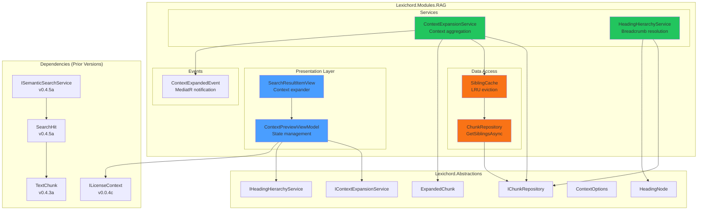
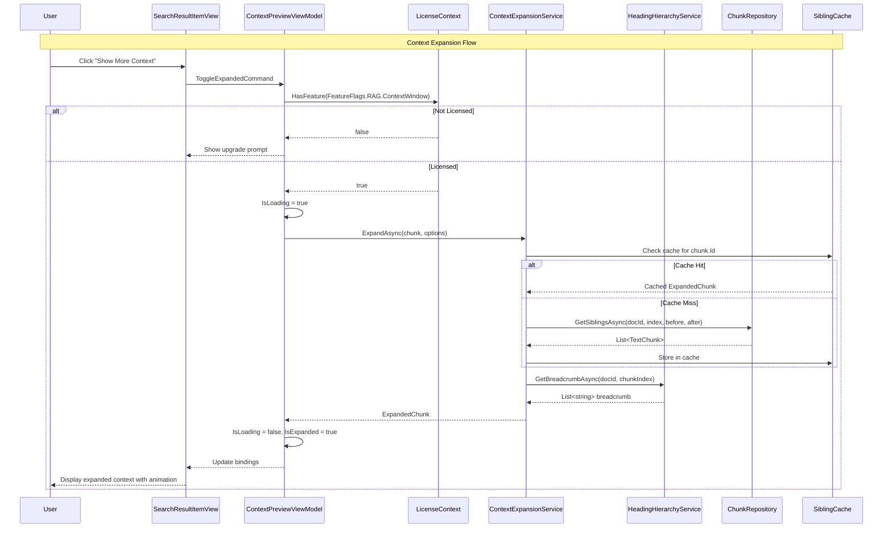

# LCS-SBD-053: Scope Breakdown — The Context Window

## Document Control

| Field            | Value                                                                          |
| :--------------- | :----------------------------------------------------------------------------- |
| **Document ID**  | LCS-SBD-053                                                                    |
| **Version**      | v0.5.3                                                                         |
| **Codename**     | The Context Window (Relevance Expansion)                                       |
| **Status**       | Draft                                                                          |
| **Last Updated** | 2026-01-27                                                                     |
| **Owner**        | Lead Architect                                                                 |
| **Depends On**   | v0.4.1 (Vector Foundation), v0.4.5 (Semantic Search), v0.5.2 (Citation Engine) |

---

## 1. Executive Summary

### 1.1 The Vision

**v0.5.3** delivers the **Context Window** — intelligent relevance expansion for retrieved search results. This release transforms Lexichord's RAG system from returning isolated text chunks into providing contextually-rich excerpts that include surrounding content and hierarchical navigation.

When users retrieve a chunk via semantic or hybrid search, they often need to understand the context around that excerpt. Is it part of a larger procedure? What section does it belong to? What comes before and after? The Context Window answers these questions by expanding search results with adjacent chunks and document structure metadata.

### 1.2 Business Value

- **Enhanced Comprehension:** Users understand retrieved content better when they see its surrounding context.
- **Document Navigation:** Breadcrumb headings help users locate where excerpts fit in document structure.
- **Reduced Context Switching:** Preview context inline without opening the source document.
- **Improved Search Quality:** Better context leads to faster evaluation of search result relevance.
- **Enterprise Ready:** Professionals can quickly assess if a search result contains what they need.
- **Foundation:** Enables AI Assistant context assembly (v0.6.x) with rich, structured retrieval.

### 1.3 Success Criteria

This release succeeds when:

1. Context expansion retrieves adjacent chunks (before/after) within 50ms for cached chunks.
2. Heading hierarchy displays accurate breadcrumb trails for 95%+ of indexed Markdown documents.
3. Context Preview UI expands/collapses smoothly with proper animations.
4. Sibling chunk retrieval correctly orders chunks by `chunk_index`.
5. All UI respects license gating (Writer Pro+ for context expansion).

### 1.4 License Gating

The Context Window is a **Writer Pro** feature. Lower tiers will see:

- Search results without expansion capability
- "Show More Context" button disabled with upgrade tooltip
- Heading breadcrumbs visible but expansion locked
- Context options grayed out in settings

---

## 2. Dependencies on Prior Versions

| Component                | Source Version        | Usage in v0.5.3                            |
| :----------------------- | :-------------------- | :----------------------------------------- |
| `IChunkRepository`       | v0.4.1c               | Query adjacent chunks by index             |
| `IDocumentRepository`    | v0.4.1c               | Retrieve document metadata                 |
| `TextChunk`              | v0.4.3a               | Chunk data structure                       |
| `ChunkMetadata`          | v0.4.3a               | Chunk index and heading context            |
| `ISemanticSearchService` | v0.4.5a               | Search result source                       |
| `SearchHit`              | v0.4.5a               | Search result model                        |
| `SearchResultItemView`   | v0.4.6b               | UI component to extend                     |
| `ICitationService`       | v0.5.2a               | Document path and title retrieval          |
| `ILicenseContext`        | v0.0.4c               | License tier checking                      |
| `LicenseTier`            | v0.0.4c               | Core/WriterPro/Teams/Enterprise enum       |
| `IMediator`              | v0.0.7a               | Event publishing                           |
| `ILogger<T>`             | v0.0.3b               | Structured logging                         |
| `IConfiguration`         | v0.0.3d               | Context expansion preferences              |
| `ViewModelBase`          | CommunityToolkit.Mvvm | Observable ViewModel base (external NuGet) |

---

## 3. Sub-Part Specifications

### 3.1 v0.5.3a: Context Expansion Service

| Field            | Value                     |
| :--------------- | :------------------------ |
| **Sub-Part ID**  | RAG-053a                  |
| **Title**        | Context Expansion Service |
| **Module**       | `Lexichord.Modules.RAG`   |
| **License Tier** | Writer Pro                |

**Goal:** Implement `IContextExpansionService` that expands a retrieved chunk with its surrounding chunks and heading context.

**Key Deliverables:**

- `IContextExpansionService` interface in `Lexichord.Abstractions`
- `ContextExpansionService` implementation in `Modules.RAG/Services`
- `ContextOptions` record for configuration
- `ExpandedChunk` record containing core chunk with before/after context
- Caching layer to avoid repeated DB queries for same chunk
- Unit tests for expansion logic

**Key Interfaces:**

```csharp
namespace Lexichord.Abstractions.Contracts;

/// <summary>
/// Expands a retrieved chunk with surrounding context from the same document.
/// </summary>
/// <remarks>
/// <para>Context expansion retrieves adjacent chunks (before/after) based on chunk_index.</para>
/// <para>The service also resolves the parent heading hierarchy for document structure.</para>
/// <para>Results are cached per-session to minimize database queries.</para>
/// </remarks>
public interface IContextExpansionService
{
    /// <summary>
    /// Expands a chunk with its surrounding context.
    /// </summary>
    /// <param name="chunk">The core chunk to expand.</param>
    /// <param name="options">Expansion configuration options.</param>
    /// <param name="cancellationToken">Cancellation token.</param>
    /// <returns>Expanded chunk with before/after context and heading hierarchy.</returns>
    Task<ExpandedChunk> ExpandAsync(
        TextChunk chunk,
        ContextOptions options,
        CancellationToken cancellationToken = default);

    /// <summary>
    /// Clears the context cache for a specific document.
    /// </summary>
    /// <param name="documentId">Document ID to clear from cache.</param>
    void InvalidateCache(Guid documentId);

    /// <summary>
    /// Clears the entire context cache.
    /// </summary>
    void ClearCache();
}

/// <summary>
/// Configuration options for context expansion.
/// </summary>
/// <param name="PrecedingChunks">Number of chunks to retrieve before the core chunk.</param>
/// <param name="FollowingChunks">Number of chunks to retrieve after the core chunk.</param>
/// <param name="IncludeHeadings">Whether to include heading hierarchy.</param>
public record ContextOptions(
    int PrecedingChunks = 1,
    int FollowingChunks = 1,
    bool IncludeHeadings = true);

/// <summary>
/// A chunk with its expanded context.
/// </summary>
/// <param name="Core">The original retrieved chunk.</param>
/// <param name="Before">Chunks preceding the core chunk, ordered by index.</param>
/// <param name="After">Chunks following the core chunk, ordered by index.</param>
/// <param name="ParentHeading">The immediate parent heading, if available.</param>
/// <param name="HeadingBreadcrumb">Full heading hierarchy as breadcrumb trail.</param>
public record ExpandedChunk(
    TextChunk Core,
    IReadOnlyList<TextChunk> Before,
    IReadOnlyList<TextChunk> After,
    string? ParentHeading,
    IReadOnlyList<string> HeadingBreadcrumb);
```

**Expansion Logic Decision Tree:**

```text
EXPAND chunk with options:
│
├── Check cache for chunk.Id
│   ├── FOUND → Return cached ExpandedChunk
│   └── NOT FOUND → Continue
│
├── Query sibling chunks:
│   └── SELECT * FROM chunks
│       WHERE document_id = @docId
│       AND chunk_index BETWEEN @minIndex AND @maxIndex
│       ORDER BY chunk_index
│
├── Partition results:
│   ├── Before = chunks where index < core.index
│   ├── Core = chunk where index = core.index
│   └── After = chunks where index > core.index
│
├── If options.IncludeHeadings:
│   └── Resolve heading hierarchy from chunk metadata
│
├── Build ExpandedChunk record
│
├── Cache result
│
└── Return ExpandedChunk
```

**Dependencies:**

- v0.4.1c: `IChunkRepository` (chunk retrieval)
- v0.4.3a: `TextChunk`, `ChunkMetadata` (data structures)

---

### 3.2 v0.5.3b: Sibling Chunk Retrieval

| Field            | Value                   |
| :--------------- | :---------------------- |
| **Sub-Part ID**  | RAG-053b                |
| **Title**        | Sibling Chunk Retrieval |
| **Module**       | `Lexichord.Modules.RAG` |
| **License Tier** | Writer Pro              |

**Goal:** Implement efficient database queries to retrieve adjacent chunks by `chunk_index`, with proper caching to avoid repeated queries.

**Key Deliverables:**

- Extension to `IChunkRepository` with `GetSiblingsAsync()` method
- Optimized SQL query using index range
- In-memory cache with document-level invalidation
- Cache invalidation on document re-indexing
- Unit tests for sibling retrieval

**Key Interfaces:**

```csharp
namespace Lexichord.Abstractions.Contracts;

/// <summary>
/// Extended chunk repository methods for context expansion.
/// </summary>
public interface IChunkRepository
{
    // ... existing methods from v0.4.1c ...

    /// <summary>
    /// Retrieves chunks adjacent to a given chunk index within the same document.
    /// </summary>
    /// <param name="documentId">The document containing the chunks.</param>
    /// <param name="centerIndex">The chunk index to center the query around.</param>
    /// <param name="beforeCount">Number of preceding chunks to retrieve.</param>
    /// <param name="afterCount">Number of following chunks to retrieve.</param>
    /// <param name="cancellationToken">Cancellation token.</param>
    /// <returns>List of chunks ordered by chunk_index.</returns>
    Task<IReadOnlyList<TextChunk>> GetSiblingsAsync(
        Guid documentId,
        int centerIndex,
        int beforeCount,
        int afterCount,
        CancellationToken cancellationToken = default);
}
```

**SQL Query:**

```sql
SELECT id, document_id, chunk_index, content, start_offset, end_offset,
       parent_heading_id, heading, heading_level, created_at
FROM chunks
WHERE document_id = @documentId
  AND chunk_index BETWEEN @minIndex AND @maxIndex
ORDER BY chunk_index;
```

**Cache Strategy:**

```text
CACHE STRUCTURE:
  Dictionary<Guid, Dictionary<(int centerIndex, int before, int after), IReadOnlyList<TextChunk>>>
                 │
                 └── Key = documentId, Value = cache of sibling queries

CACHE INVALIDATION TRIGGERS:
  1. DocumentIndexedEvent → Clear cache for that document
  2. DocumentRemovedFromIndexEvent → Remove document from cache
  3. Application shutdown → Full cache clear
  4. LRU eviction when cache exceeds 100 documents
```

**Dependencies:**

- v0.4.1c: `IChunkRepository` (base interface)
- v0.4.1d: `ChunkRepository` (implementation to extend)

---

### 3.3 v0.5.3c: Heading Hierarchy

| Field            | Value                   |
| :--------------- | :---------------------- |
| **Sub-Part ID**  | RAG-053c                |
| **Title**        | Heading Hierarchy       |
| **Module**       | `Lexichord.Modules.RAG` |
| **License Tier** | Writer Pro              |

**Goal:** Implement heading hierarchy resolution to display breadcrumb trails showing where a chunk fits within document structure.

**Key Deliverables:**

- `IHeadingHierarchyService` interface in `Lexichord.Abstractions`
- `HeadingHierarchyService` implementation
- `HeadingNode` record for tree navigation
- Breadcrumb generation from chunk metadata
- Cache heading trees per document
- Unit tests for hierarchy resolution

**Key Interfaces:**

```csharp
namespace Lexichord.Abstractions.Contracts;

/// <summary>
/// Resolves heading hierarchy for document chunks.
/// </summary>
public interface IHeadingHierarchyService
{
    /// <summary>
    /// Gets the heading breadcrumb trail for a chunk.
    /// </summary>
    /// <param name="documentId">The document ID.</param>
    /// <param name="chunkIndex">The chunk index.</param>
    /// <param name="cancellationToken">Cancellation token.</param>
    /// <returns>Ordered list of headings from root to immediate parent.</returns>
    Task<IReadOnlyList<string>> GetBreadcrumbAsync(
        Guid documentId,
        int chunkIndex,
        CancellationToken cancellationToken = default);

    /// <summary>
    /// Builds the full heading tree for a document.
    /// </summary>
    /// <param name="documentId">The document ID.</param>
    /// <param name="cancellationToken">Cancellation token.</param>
    /// <returns>Root heading node with nested children.</returns>
    Task<HeadingNode?> BuildHeadingTreeAsync(
        Guid documentId,
        CancellationToken cancellationToken = default);
}

/// <summary>
/// A node in the heading hierarchy tree.
/// </summary>
/// <param name="Id">Unique identifier for this heading.</param>
/// <param name="Text">The heading text.</param>
/// <param name="Level">Heading level (1-6 for Markdown headers).</param>
/// <param name="ChunkIndex">The chunk index where this heading appears.</param>
/// <param name="Children">Child headings nested under this one.</param>
public record HeadingNode(
    Guid Id,
    string Text,
    int Level,
    int ChunkIndex,
    IReadOnlyList<HeadingNode> Children);
```

**Breadcrumb Resolution Algorithm:**

```text
GET breadcrumb for chunk at index N:
│
├── Load heading tree for document (cached)
│
├── Find the heading that covers index N:
│   └── Heading covers N if:
│       heading.ChunkIndex <= N AND
│       (next_sibling.ChunkIndex > N OR no_next_sibling)
│
├── Walk up the tree to root:
│   └── Collect heading texts from leaf to root
│
├── Reverse to get root-to-leaf order
│
└── Return ["Authentication", "OAuth", "Token Refresh"]
```

**Example Output:**

```text
Document: auth-guide.md
Chunk Index: 42
Chunk Content: "The refresh token is valid for 30 days..."

Breadcrumb: "Authentication > OAuth > Token Refresh"
```

**Dependencies:**

- v0.4.3a: `ChunkMetadata.Heading`, `ChunkMetadata.HeadingLevel`
- v0.4.3d: `MarkdownHeaderChunkingStrategy` (heading extraction during chunking)

---

### 3.4 v0.5.3d: Context Preview UI

| Field            | Value                   |
| :--------------- | :---------------------- |
| **Sub-Part ID**  | RAG-053d                |
| **Title**        | Context Preview UI      |
| **Module**       | `Lexichord.Modules.RAG` |
| **License Tier** | Writer Pro              |

**Goal:** Update `SearchResultItemView` with expandable context preview showing preceding/following chunks and heading breadcrumbs.

**Key Deliverables:**

- Update `SearchResultItemView.axaml` with expander
- `ContextPreviewViewModel` for expansion state
- "Show More Context" button with expand/collapse
- Visual separators between context chunks
- Fade effect at boundaries
- Heading breadcrumb display above chunk
- License gating with upgrade prompt
- Unit tests for ViewModel state

**Key UI Components (Collapsed State):**

```text
┌─────────────────────────────────────────────────────────────────────────────┐
│  📄 auth-guide.md                                              Score: 0.89  │
├─────────────────────────────────────────────────────────────────────────────┤
│  🔖 Authentication > OAuth > Token Refresh                                  │ ← Breadcrumb
├─────────────────────────────────────────────────────────────────────────────┤
│  "The refresh token is valid for 30 days. When expired, the user must      │
│  re-authenticate using their credentials..."                                │
├─────────────────────────────────────────────────────────────────────────────┤
│  [▼ Show More Context]                              [📋 Copy] [→ Navigate]  │
└─────────────────────────────────────────────────────────────────────────────┘
```

**Key UI Components (Expanded State):**

```text
┌─────────────────────────────────────────────────────────────────────────────┐
│  📄 auth-guide.md                                              Score: 0.89  │
├─────────────────────────────────────────────────────────────────────────────┤
│  🔖 Authentication > OAuth > Token Refresh                                  │
├─────────────────────────────────────────────────────────────────────────────┤
│  ┄┄┄┄┄┄┄┄┄┄┄┄┄┄┄┄┄┄┄┄┄┄ PRECEDING CONTEXT ┄┄┄┄┄┄┄┄┄┄┄┄┄┄┄┄┄┄┄┄┄┄           │ ← Fade effect
│  "Access tokens are short-lived and expire after 1 hour. For long-running  │
│  sessions, applications should use refresh tokens..."                       │
│  ───────────────────────────────────────────────────────────────────────    │ ← Visual separator
│  "The refresh token is valid for 30 days. When expired, the user must      │ ← Core chunk (highlighted)
│  re-authenticate using their credentials..."                                │
│  ───────────────────────────────────────────────────────────────────────    │
│  "To refresh an access token, send a POST request to /oauth/token with     │ ← Following context
│  grant_type=refresh_token..."                                               │
│  ┄┄┄┄┄┄┄┄┄┄┄┄┄┄┄┄┄┄┄┄┄┄ FOLLOWING CONTEXT ┄┄┄┄┄┄┄┄┄┄┄┄┄┄┄┄┄┄┄┄┄┄           │
├─────────────────────────────────────────────────────────────────────────────┤
│  [▲ Hide Context]                                   [📋 Copy] [→ Navigate]  │
└─────────────────────────────────────────────────────────────────────────────┘
```

**Key UI Components (Core User - License Gated):**

```text
┌─────────────────────────────────────────────────────────────────────────────┐
│  📄 auth-guide.md                                              Score: 0.89  │
├─────────────────────────────────────────────────────────────────────────────┤
│  "The refresh token is valid for 30 days. When expired, the user must      │
│  re-authenticate using their credentials..."                                │
├─────────────────────────────────────────────────────────────────────────────┤
│  [🔒 Show More Context - Upgrade to Writer Pro]              [→ Navigate]   │
└─────────────────────────────────────────────────────────────────────────────┘
```

**Animation Specifications:**

| Animation           | Duration | Easing       |
| :------------------ | :------- | :----------- |
| Expand              | 250ms    | EaseOutCubic |
| Collapse            | 200ms    | EaseInCubic  |
| Context fade-in     | 150ms    | Linear       |
| Breadcrumb slide-in | 100ms    | EaseOut      |

**ViewModel:**

```csharp
namespace Lexichord.Modules.RAG.ViewModels;

/// <summary>
/// ViewModel for context preview functionality within search results.
/// </summary>
public partial class ContextPreviewViewModel : ViewModelBase
{
    [ObservableProperty]
    private bool _isExpanded;

    [ObservableProperty]
    private bool _isLoading;

    [ObservableProperty]
    private bool _isLicensed;

    [ObservableProperty]
    private ExpandedChunk? _expandedChunk;

    [ObservableProperty]
    private string _breadcrumb = string.Empty;

    public bool HasPrecedingContext => ExpandedChunk?.Before.Count > 0;
    public bool HasFollowingContext => ExpandedChunk?.After.Count > 0;

    [RelayCommand]
    private async Task ToggleExpandedAsync()
    {
        if (!IsLicensed)
        {
            // Show upgrade prompt
            return;
        }

        if (IsExpanded)
        {
            IsExpanded = false;
            return;
        }

        IsLoading = true;
        // Load expanded context...
        IsLoading = false;
        IsExpanded = true;
    }
}
```

**Dependencies:**

- v0.5.3a: `IContextExpansionService` (context retrieval)
- v0.5.3c: `IHeadingHierarchyService` (breadcrumb generation)
- v0.4.6b: `SearchResultItemView` (base component)
- v0.0.4c: `ILicenseContext` (license check)
- CommunityToolkit.Mvvm: `ViewModelBase` (MVVM base class)

---

## 4. Implementation Checklist

| #         | Sub-Part | Task                                              | Est. Hours   |
| :-------- | :------- | :------------------------------------------------ | :----------- |
| 1         | v0.5.3a  | Create `IContextExpansionService` interface       | 0.5          |
| 2         | v0.5.3a  | Create `ContextOptions` record                    | 0.5          |
| 3         | v0.5.3a  | Create `ExpandedChunk` record                     | 0.5          |
| 4         | v0.5.3a  | Implement `ContextExpansionService` with caching  | 3            |
| 5         | v0.5.3a  | Unit tests for expansion logic                    | 2            |
| 6         | v0.5.3b  | Add `GetSiblingsAsync()` to `IChunkRepository`    | 0.5          |
| 7         | v0.5.3b  | Implement sibling query in `ChunkRepository`      | 1.5          |
| 8         | v0.5.3b  | Implement sibling cache with LRU eviction         | 2            |
| 9         | v0.5.3b  | Cache invalidation on document events             | 1            |
| 10        | v0.5.3b  | Unit tests for sibling retrieval                  | 1.5          |
| 11        | v0.5.3c  | Create `IHeadingHierarchyService` interface       | 0.5          |
| 12        | v0.5.3c  | Create `HeadingNode` record                       | 0.5          |
| 13        | v0.5.3c  | Implement heading tree builder                    | 2            |
| 14        | v0.5.3c  | Implement breadcrumb resolution                   | 1.5          |
| 15        | v0.5.3c  | Unit tests for heading hierarchy                  | 2            |
| 16        | v0.5.3d  | Create `ContextPreviewViewModel`                  | 2            |
| 17        | v0.5.3d  | Update `SearchResultItemView.axaml` with expander | 2            |
| 18        | v0.5.3d  | Implement breadcrumb display                      | 1            |
| 19        | v0.5.3d  | Add expand/collapse animations                    | 1.5          |
| 20        | v0.5.3d  | Implement license gating with upgrade prompt      | 1            |
| 21        | v0.5.3d  | Unit tests for ViewModel state transitions        | 1.5          |
| 22        | All      | Integration tests for context expansion pipeline  | 2            |
| 23        | All      | DI registration in `RAGModule.cs`                 | 0.5          |
| **Total** |          |                                                   | **31 hours** |

---

## 5. Dependency Matrix

### 5.1 Required Interfaces (from earlier versions)

| Interface                | Source Version | Purpose                     |
| :----------------------- | :------------- | :-------------------------- |
| `IChunkRepository`       | v0.4.1c        | Chunk storage and retrieval |
| `IDocumentRepository`    | v0.4.1c        | Document metadata           |
| `TextChunk`              | v0.4.3a        | Chunk data structure        |
| `ChunkMetadata`          | v0.4.3a        | Chunk heading context       |
| `ISemanticSearchService` | v0.4.5a        | Search integration          |
| `SearchHit`              | v0.4.5a        | Search result model         |
| `SearchResultItemView`   | v0.4.6b        | UI component base           |
| `ICitationService`       | v0.5.2a        | Document path resolution    |
| `ILicenseContext`        | v0.0.4c        | License tier checking       |
| `IMediator`              | v0.0.7a        | Event publishing            |

### 5.2 New Interfaces (defined in v0.5.3)

| Interface                  | Defined In | Module       | Purpose                       |
| :------------------------- | :--------- | :----------- | :---------------------------- |
| `IContextExpansionService` | v0.5.3a    | Abstractions | Context expansion operations  |
| `IHeadingHierarchyService` | v0.5.3c    | Abstractions | Heading breadcrumb resolution |

### 5.3 New Records/DTOs (defined in v0.5.3)

| Record           | Defined In | Purpose                        |
| :--------------- | :--------- | :----------------------------- |
| `ContextOptions` | v0.5.3a    | Expansion configuration        |
| `ExpandedChunk`  | v0.5.3a    | Chunk with surrounding context |
| `HeadingNode`    | v0.5.3c    | Node in heading hierarchy tree |

### 5.4 New Events (defined in v0.5.3)

| Event                         | Defined In | Purpose                          |
| :---------------------------- | :--------- | :------------------------------- |
| `ContextExpandedEvent`        | v0.5.3a    | Context expansion completed      |
| `ContextExpansionDeniedEvent` | v0.5.3a    | Expansion blocked due to license |

### 5.5 NuGet Packages

| Package                 | Version | Purpose                | New/Existing |
| :---------------------- | :------ | :--------------------- | :----------- |
| `CommunityToolkit.Mvvm` | 8.x     | MVVM source generators | Existing     |
| `MediatR`               | 12.x    | Event publishing       | Existing     |

---

## 6. Architecture Diagram



---

## 7. Data Flow Diagram



---

## 8. Risks & Mitigations

| Risk                                                    | Impact | Probability | Mitigation                                                    |
| :------------------------------------------------------ | :----- | :---------- | :------------------------------------------------------------ |
| Heading metadata incomplete for non-Markdown documents  | Medium | Medium      | Gracefully degrade to chunk-only display if no headings       |
| Cache memory pressure with many expanded chunks         | Medium | Low         | LRU eviction, document-level invalidation, configurable limit |
| UI jank during expansion animation                      | Low    | Medium      | Load context in background, show skeleton while loading       |
| Stale cache after document re-indexing                  | Medium | Low         | Subscribe to DocumentIndexedEvent for cache invalidation      |
| Large documents with hundreds of chunks slow navigation | Medium | Low         | Limit sibling range, lazy-load additional context on scroll   |

---

## 9. Success Metrics

| Metric                          | Target  | Measurement                     |
| :------------------------------ | :------ | :------------------------------ |
| Context expansion time (cached) | < 50ms  | Stopwatch timing                |
| Context expansion time (cold)   | < 200ms | Stopwatch timing                |
| Breadcrumb accuracy             | 95%+    | Test against known document set |
| Cache hit rate                  | 70%+    | Cache statistics                |
| UI expansion animation          | 60fps+  | Frame rate profiler             |
| Memory overhead (100 cached)    | < 10MB  | Memory profiler                 |

---

## 10. What This Enables

After v0.5.3, Lexichord will support:

- **v0.5.4 (Relevance Tuner):** Context helps tune query understanding by providing structural context.
- **v0.5.5 (Filter System):** Filter by heading hierarchy to scope searches to specific sections.
- **v0.5.6 (Answer Preview):** Use heading context for smarter snippet extraction.
- **v0.6.x (AI Assistant):** Rich context assembly for AI prompts with document structure awareness.

---

## 11. Decision Trees

### 11.1 Should Context Be Expanded?

```text
START: "Should context expansion be performed?"
│
├── Is user licensed for Writer Pro or above?
│   ├── NO → Show upgrade prompt, return
│   └── YES → Continue
│
├── Is chunk already expanded in cache?
│   ├── YES → Return cached ExpandedChunk
│   └── NO → Continue
│
├── Is document still indexed (not stale)?
│   ├── NO → Show "document changed" warning, offer re-index
│   └── YES → Continue
│
├── Query sibling chunks
│   ├── SUCCESS → Build ExpandedChunk
│   └── FAILURE → Log error, show "Context unavailable" message
│
└── Cache and return ExpandedChunk
```

### 11.2 How to Build Heading Breadcrumb?

```text
START: "Build breadcrumb for chunk at index N"
│
├── Is heading tree cached for document?
│   ├── YES → Use cached tree
│   └── NO → Build tree from chunk metadata
│
├── Find heading that contains chunk index N
│   ├── Walk tree depth-first
│   ├── Find lowest-level heading where:
│   │   heading.ChunkIndex <= N AND
│   │   (next_sibling.ChunkIndex > N OR no next sibling)
│   └── If no heading found → Return empty breadcrumb
│
├── Walk up tree from found heading to root
│   └── Collect heading texts
│
├── Reverse list (root-to-leaf order)
│
└── Return breadcrumb: ["Section", "Subsection", "Topic"]
```

---

## 12. User Stories

| ID    | Role       | Story                                                                                      | Acceptance Criteria                                 |
| :---- | :--------- | :----------------------------------------------------------------------------------------- | :-------------------------------------------------- |
| US-01 | Writer     | As a writer, I want to see context around a search result so that I understand the excerpt | Context expander shows 1 chunk before/after         |
| US-02 | Writer     | As a writer, I want to see where a chunk fits in the document so I can navigate there      | Breadcrumb shows heading hierarchy                  |
| US-03 | Writer     | As a writer, I want context to load quickly so my workflow isn't interrupted               | Expansion completes in < 200ms                      |
| US-04 | Core User  | As a Core user, I want to understand what context preview offers before upgrading          | Preview button shows lock icon with upgrade tooltip |
| US-05 | Enterprise | As an enterprise user, I want context cached so repeated views are instant                 | Second expansion of same chunk < 50ms               |

---

## 13. Use Cases

### UC-01: Expand Context for Search Result

**Preconditions:**

- User has performed a semantic search
- Search results are displayed in Reference Panel
- User is licensed for Writer Pro

**Flow:**

1. User clicks "Show More Context" on a search result.
2. System checks license authorization.
3. System queries sibling chunks from database or cache.
4. System resolves heading breadcrumb.
5. System animates expansion of context preview.
6. User sees preceding chunk, core chunk (highlighted), and following chunk.
7. User sees breadcrumb trail above the context.

**Postconditions:**

- Context is displayed inline
- Context is cached for future requests
- ContextExpandedEvent is published

---

### UC-02: Navigate via Breadcrumb

**Preconditions:**

- Context is expanded for a search result
- Breadcrumb is displayed

**Flow:**

1. User clicks on a breadcrumb segment (e.g., "OAuth").
2. System navigates to the source document.
3. System scrolls to the heading position.
4. Heading is highlighted briefly.

**Postconditions:**

- Source document is opened in editor
- Editor is scrolled to heading position

---

## 14. Unit Testing Requirements

### 14.1 Context Expansion Service Tests

```csharp
[Trait("Category", "Unit")]
[Trait("Feature", "v0.5.3a")]
public class ContextExpansionServiceTests
{
    private readonly Mock<IChunkRepository> _chunkRepoMock;
    private readonly Mock<IHeadingHierarchyService> _headingServiceMock;
    private readonly ContextExpansionService _sut;

    public ContextExpansionServiceTests()
    {
        _chunkRepoMock = new Mock<IChunkRepository>();
        _headingServiceMock = new Mock<IHeadingHierarchyService>();
        _sut = new ContextExpansionService(_chunkRepoMock.Object, _headingServiceMock.Object);
    }

    [Fact]
    public async Task ExpandAsync_WithSiblings_ReturnsExpandedChunk()
    {
        // Arrange
        var coreChunk = CreateTestChunk(index: 5);
        var siblings = new[] { CreateTestChunk(4), coreChunk, CreateTestChunk(6) };
        var options = new ContextOptions(PrecedingChunks: 1, FollowingChunks: 1);

        _chunkRepoMock
            .Setup(r => r.GetSiblingsAsync(It.IsAny<Guid>(), 5, 1, 1, default))
            .ReturnsAsync(siblings);

        _headingServiceMock
            .Setup(h => h.GetBreadcrumbAsync(It.IsAny<Guid>(), 5, default))
            .ReturnsAsync(new[] { "Section", "Topic" });

        // Act
        var result = await _sut.ExpandAsync(coreChunk, options);

        // Assert
        result.Should().NotBeNull();
        result.Core.Should().Be(coreChunk);
        result.Before.Should().HaveCount(1);
        result.After.Should().HaveCount(1);
        result.HeadingBreadcrumb.Should().BeEquivalentTo(new[] { "Section", "Topic" });
    }

    [Fact]
    public async Task ExpandAsync_CacheHit_DoesNotQueryDatabase()
    {
        // Arrange
        var coreChunk = CreateTestChunk(index: 5);
        var options = new ContextOptions();

        // First call to populate cache
        _chunkRepoMock
            .Setup(r => r.GetSiblingsAsync(It.IsAny<Guid>(), 5, 1, 1, default))
            .ReturnsAsync(new[] { coreChunk });

        await _sut.ExpandAsync(coreChunk, options);

        // Act - Second call should use cache
        await _sut.ExpandAsync(coreChunk, options);

        // Assert
        _chunkRepoMock.Verify(
            r => r.GetSiblingsAsync(It.IsAny<Guid>(), 5, 1, 1, default),
            Times.Once); // Only called once, not twice
    }
}
```

### 14.2 Heading Hierarchy Tests

```csharp
[Trait("Category", "Unit")]
[Trait("Feature", "v0.5.3c")]
public class HeadingHierarchyServiceTests
{
    [Fact]
    public async Task GetBreadcrumbAsync_WithNestedHeadings_ReturnsCorrectPath()
    {
        // Arrange
        var chunks = new[]
        {
            CreateChunkWithHeading(0, "Introduction", level: 1),
            CreateChunkWithHeading(5, "Authentication", level: 1),
            CreateChunkWithHeading(8, "OAuth", level: 2),
            CreateChunkWithHeading(12, "Token Refresh", level: 3),
            CreateChunkWithHeading(15, "Troubleshooting", level: 2),
        };

        var sut = new HeadingHierarchyService(CreateMockRepo(chunks));

        // Act
        var breadcrumb = await sut.GetBreadcrumbAsync(docId, chunkIndex: 13);

        // Assert
        breadcrumb.Should().BeEquivalentTo(new[] { "Authentication", "OAuth", "Token Refresh" });
    }

    [Fact]
    public async Task GetBreadcrumbAsync_NoHeadings_ReturnsEmpty()
    {
        // Arrange
        var chunks = new[]
        {
            CreateChunkWithHeading(0, null, level: 0),
            CreateChunkWithHeading(1, null, level: 0),
        };

        var sut = new HeadingHierarchyService(CreateMockRepo(chunks));

        // Act
        var breadcrumb = await sut.GetBreadcrumbAsync(docId, chunkIndex: 1);

        // Assert
        breadcrumb.Should().BeEmpty();
    }
}
```

---

## 15. Observability & Logging

| Level   | Source                  | Message Template                                                              |
| :------ | :---------------------- | :---------------------------------------------------------------------------- |
| Debug   | ContextExpansionService | `"Expanding context for chunk {ChunkId} with options {Options}"`              |
| Debug   | ContextExpansionService | `"Cache hit for chunk {ChunkId}, returning cached context"`                   |
| Debug   | ChunkRepository         | `"Querying siblings for doc {DocId} around index {Index}"`                    |
| Info    | ContextExpansionService | `"Context expanded: {BeforeCount} before, {AfterCount} after, {ElapsedMs}ms"` |
| Debug   | HeadingHierarchyService | `"Building heading tree for document {DocId}"`                                |
| Debug   | HeadingHierarchyService | `"Breadcrumb resolved: {Breadcrumb}"`                                         |
| Warning | ContextExpansionService | `"Chunk {ChunkId} not found in document, may be stale"`                       |
| Error   | ContextExpansionService | `"Context expansion failed for chunk {ChunkId}: {Error}"`                     |

---

## 16. UI/UX Specifications

### 16.1 Context Preview Layout

```text
┌─────────────────────────────────────────────────────────────────────────────────────┐
│  Header: Document Title and Score                                                   │
├─────────────────────────────────────────────────────────────────────────────────────┤
│  🔖 Breadcrumb display (if available)                                               │
├─────────────────────────────────────────────────────────────────────────────────────┤
│  ┄ Preceding context (faded, muted text color)                                      │
│  ─── Visual separator ───────────────────────────────────────────────────────────── │
│  Core chunk (normal text, highlighted background)                                   │
│  ─── Visual separator ───────────────────────────────────────────────────────────── │
│  ┄ Following context (faded, muted text color)                                      │
├─────────────────────────────────────────────────────────────────────────────────────┤
│  Action bar: [Expand/Collapse] [Copy] [Navigate]                                    │
└─────────────────────────────────────────────────────────────────────────────────────┘
```

### 16.2 Component Styling Requirements

| Component         | Theme Resource             | Notes                               |
| :---------------- | :------------------------- | :---------------------------------- |
| Breadcrumb text   | `Brush.Text.Secondary`     | Smaller font, icon prefix           |
| Preceding context | `Brush.Text.Muted` @ 70%   | Faded to indicate secondary content |
| Core chunk        | `Brush.Surface.Elevated`   | Highlighted background              |
| Following context | `Brush.Text.Muted` @ 70%   | Faded to indicate secondary content |
| Separator line    | `Brush.Border.Subtle`      | Thin horizontal line                |
| Expand button     | `LexButtonSecondary` theme | Toggle icon ▼/▲                     |

---

## 17. Acceptance Criteria (QA)

| #   | Category          | Criterion                                                        |
| :-- | :---------------- | :--------------------------------------------------------------- |
| 1   | **Functional**    | Clicking "Show More Context" expands to show adjacent chunks     |
| 2   | **Functional**    | Breadcrumb displays correct heading hierarchy                    |
| 3   | **Functional**    | Collapse button hides context and restores compact view          |
| 4   | **Functional**    | Context is cached; second expansion is instant                   |
| 5   | **Performance**   | Context expansion completes in < 200ms (cold) or < 50ms (cached) |
| 6   | **License Gate**  | Core users see lock icon and upgrade tooltip                     |
| 7   | **License Gate**  | Writer Pro users see full expansion capability                   |
| 8   | **Edge Case**     | First/last chunks show only available siblings                   |
| 9   | **Edge Case**     | Documents without headings show no breadcrumb                    |
| 10  | **Accessibility** | Expand/collapse is keyboard navigable                            |
| 11  | **Animation**     | Expansion animation is smooth (60fps)                            |

---

## 18. Verification Commands

```bash
# ═══════════════════════════════════════════════════════════════════════════
# v0.5.3 Verification
# ═══════════════════════════════════════════════════════════════════════════

# 1. Build solution
dotnet build

# 2. Run unit tests for v0.5.3 components
dotnet test --filter "Category=Unit&FullyQualifiedName~v0.5.3"

# 3. Run specific component tests
dotnet test --filter "FullyQualifiedName~ContextExpansionServiceTests"
dotnet test --filter "FullyQualifiedName~HeadingHierarchyServiceTests"
dotnet test --filter "FullyQualifiedName~ContextPreviewViewModelTests"

# 4. Run all RAG module tests
dotnet test --filter "Category=Unit&FullyQualifiedName~Modules.RAG"

# 5. Manual verification:
# a) Perform a semantic search
# b) Click "Show More Context" on a result
# c) Verify adjacent chunks display correctly
# d) Verify breadcrumb shows heading hierarchy
# e) Collapse and re-expand to verify cache
# f) Test with Core license - verify upgrade prompt
```

---

## 19. Deliverable Checklist

| #   | Deliverable                                           | Status |
| :-- | :---------------------------------------------------- | :----- |
| 1   | `IContextExpansionService` interface in Abstractions  | [ ]    |
| 2   | `ContextOptions` record                               | [ ]    |
| 3   | `ExpandedChunk` record                                | [ ]    |
| 4   | `ContextExpansionService` implementation with caching | [ ]    |
| 5   | `IChunkRepository.GetSiblingsAsync()` extension       | [ ]    |
| 6   | Sibling cache with LRU eviction                       | [ ]    |
| 7   | `IHeadingHierarchyService` interface                  | [ ]    |
| 8   | `HeadingNode` record                                  | [ ]    |
| 9   | `HeadingHierarchyService` implementation              | [ ]    |
| 10  | `ContextPreviewViewModel` with expansion logic        | [ ]    |
| 11  | `SearchResultItemView.axaml` updated with expander    | [ ]    |
| 12  | Breadcrumb display component                          | [ ]    |
| 13  | Expand/collapse animations                            | [ ]    |
| 14  | License gating with upgrade prompt                    | [ ]    |
| 15  | Unit tests for all services                           | [ ]    |
| 16  | Integration tests for expansion pipeline              | [ ]    |
| 17  | DI registration in RAGModule.cs                       | [ ]    |

---

## 20. Code Examples

### 20.1 ContextExpansionService Implementation

```csharp
namespace Lexichord.Modules.RAG.Services;

/// <summary>
/// Expands retrieved chunks with surrounding context and heading hierarchy.
/// Uses LRU caching to minimize database queries.
/// </summary>
public sealed class ContextExpansionService : IContextExpansionService
{
    private readonly IChunkRepository _chunkRepository;
    private readonly IHeadingHierarchyService _headingService;
    private readonly ILogger<ContextExpansionService> _logger;
    private readonly ConcurrentDictionary<Guid, ExpandedChunk> _cache = new();
    private const int MaxCacheSize = 100;

    public ContextExpansionService(
        IChunkRepository chunkRepository,
        IHeadingHierarchyService headingService,
        ILogger<ContextExpansionService> logger)
    {
        _chunkRepository = chunkRepository;
        _headingService = headingService;
        _logger = logger;
    }

    /// <inheritdoc />
    public async Task<ExpandedChunk> ExpandAsync(
        TextChunk chunk,
        ContextOptions options,
        CancellationToken cancellationToken = default)
    {
        _logger.LogDebug(
            "Expanding context for chunk {ChunkId} with options {Options}",
            chunk.Id, options);

        // Check cache first
        if (_cache.TryGetValue(chunk.Id, out var cached))
        {
            _logger.LogDebug("Cache hit for chunk {ChunkId}", chunk.Id);
            return cached;
        }

        var stopwatch = Stopwatch.StartNew();

        // Query sibling chunks
        var siblings = await _chunkRepository.GetSiblingsAsync(
            chunk.DocumentId,
            chunk.Metadata.ChunkIndex,
            options.PrecedingChunks,
            options.FollowingChunks,
            cancellationToken);

        // Partition into before/after
        var coreIndex = chunk.Metadata.ChunkIndex;
        var before = siblings.Where(c => c.Metadata.ChunkIndex < coreIndex).ToList();
        var after = siblings.Where(c => c.Metadata.ChunkIndex > coreIndex).ToList();

        // Resolve heading breadcrumb if requested
        IReadOnlyList<string> breadcrumb = Array.Empty<string>();
        string? parentHeading = null;

        if (options.IncludeHeadings)
        {
            breadcrumb = await _headingService.GetBreadcrumbAsync(
                chunk.DocumentId,
                coreIndex,
                cancellationToken);

            parentHeading = breadcrumb.LastOrDefault();
        }

        var expanded = new ExpandedChunk(
            Core: chunk,
            Before: before,
            After: after,
            ParentHeading: parentHeading,
            HeadingBreadcrumb: breadcrumb);

        // Cache result (with eviction if over limit)
        if (_cache.Count >= MaxCacheSize)
        {
            // Simple eviction: remove first entry
            var firstKey = _cache.Keys.FirstOrDefault();
            if (firstKey != default)
            {
                _cache.TryRemove(firstKey, out _);
            }
        }

        _cache.TryAdd(chunk.Id, expanded);

        _logger.LogInformation(
            "Context expanded: {BeforeCount} before, {AfterCount} after, {ElapsedMs}ms",
            before.Count, after.Count, stopwatch.ElapsedMilliseconds);

        return expanded;
    }

    /// <inheritdoc />
    public void InvalidateCache(Guid documentId)
    {
        var keysToRemove = _cache
            .Where(kvp => kvp.Value.Core.DocumentId == documentId)
            .Select(kvp => kvp.Key)
            .ToList();

        foreach (var key in keysToRemove)
        {
            _cache.TryRemove(key, out _);
        }

        _logger.LogDebug("Invalidated {Count} cached expansions for document {DocId}",
            keysToRemove.Count, documentId);
    }

    /// <inheritdoc />
    public void ClearCache()
    {
        _cache.Clear();
        _logger.LogDebug("Context expansion cache cleared");
    }
}
```

---

## 21. Deferred Features

| Feature                    | Deferred To | Reason                              |
| :------------------------- | :---------- | :---------------------------------- |
| Cross-document context     | v0.6.x      | Complex cross-referencing scope     |
| Semantic context expansion | v0.6.x      | Requires AI-based relevance scoring |
| Context for code blocks    | v0.5.7      | Different formatting requirements   |
| Export expanded context    | v0.5.7d     | Part of Search Actions feature      |

---

## 22. Changelog Entry

Upon completion of v0.5.3, the following entry will be added to `CHANGELOG.md`:

```markdown
## [0.5.3] - YYYY-MM-DD

### Added

- **Context Expansion Service**: Expand search results with surrounding chunks for improved comprehension
- **Heading Hierarchy**: Display breadcrumb trails showing document structure for each result
- **Context Preview UI**: Expandable context view in search results with animations
- **Sibling Cache**: LRU cache for efficient repeated context expansions

### Changed

- Updated `SearchResultItemView` with context expander and breadcrumb display
- Extended `IChunkRepository` with `GetSiblingsAsync()` for adjacent chunk queries

### Technical

- `IContextExpansionService` abstraction for context aggregation
- `IHeadingHierarchyService` abstraction for breadcrumb resolution
- `ContextOptions` record for expansion configuration
- `ExpandedChunk` record for context aggregation result
- `HeadingNode` record for heading tree navigation
- `ContextExpandedEvent` MediatR notification for analytics
```

---
