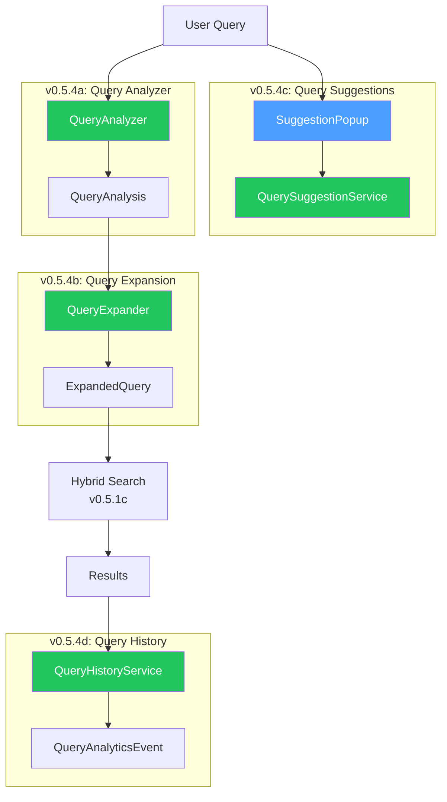
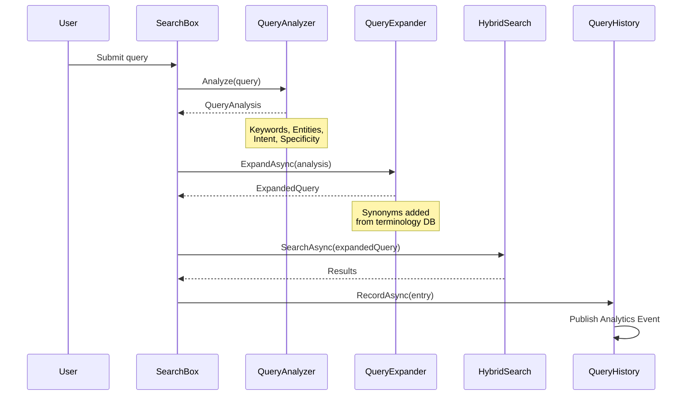

# LCS-DES-054: Design Specification Index — The Relevance Tuner

## Document Control

| Field                | Value                                     |
| :------------------- | :---------------------------------------- |
| **Document ID**      | LCS-DES-054-INDEX                         |
| **Feature ID**       | RAG-054                                   |
| **Feature Name**     | The Relevance Tuner (Query Understanding) |
| **Target Version**   | v0.5.4                                    |
| **Module Scope**     | Lexichord.Modules.RAG                     |
| **Swimlane**         | Memory                                    |
| **License Tier**     | Writer Pro                                |
| **Feature Gate Key** | `FeatureFlags.RAG.RelevanceTuner`         |
| **Status**           | Draft                                     |
| **Last Updated**     | 2026-01-27                                |

---

## 1. Executive Summary

**v0.5.4** delivers the **Relevance Tuner** — intelligent query understanding and enhancement for superior search quality. This release bridges the gap between user intent and indexed content through sophisticated query analysis, synonym expansion, smart autocomplete, and search analytics.

### 1.1 The Problem

Users often struggle to find relevant content because:

- They use different terminology than what's in documents
- Search systems don't understand query intent
- No guidance is provided while typing
- Content gaps are invisible to authors

### 1.2 The Solution

Implement a comprehensive query understanding pipeline that:

- **Analyzes queries** to extract keywords, entities, and intent
- **Expands terms** with synonyms from the terminology database
- **Suggests queries** based on indexed content
- **Tracks patterns** to identify content gaps

### 1.3 Business Value

| Value                    | Description                                        |
| :----------------------- | :------------------------------------------------- |
| **Improved Recall**      | Synonym expansion surfaces more relevant documents |
| **Better Precision**     | Intent-aware ranking matches user expectations     |
| **Faster Discovery**     | Autocomplete reduces search friction               |
| **Content Intelligence** | Analytics reveal what users can't find             |
| **Foundation**           | Enables AI query reformulation in v0.6.x           |

---

## 2. Related Documents

### 2.1 Scope Breakdown Document

| Document                            | Description                           |
| :---------------------------------- | :------------------------------------ |
| **[LCS-SBD-054](./LCS-SBD-054.md)** | Scope Breakdown — The Relevance Tuner |

### 2.2 Sub-Part Design Specifications

| Sub-Part | Document                              | Title                     | Description                            |
| :------- | :------------------------------------ | :------------------------ | :------------------------------------- |
| v0.5.4a  | **[LCS-DES-054a](./LCS-DES-054a.md)** | Query Analyzer            | Keyword, entity, and intent extraction |
| v0.5.4b  | **[LCS-DES-054b](./LCS-DES-054b.md)** | Query Expansion           | Synonym-based query enhancement        |
| v0.5.4c  | **[LCS-DES-054c](./LCS-DES-054c.md)** | Query Suggestions         | Autocomplete from indexed content      |
| v0.5.4d  | **[LCS-DES-054d](./LCS-DES-054d.md)** | Query History & Analytics | Search pattern tracking                |

---

## 3. Architecture Overview

### 3.1 Component Diagram



### 3.2 Query Pipeline Flow



---

## 4. Dependencies

### 4.1 Upstream Dependencies (Required)

| Interface                | Source Version        | Purpose                       |
| :----------------------- | :-------------------- | :---------------------------- |
| `IHybridSearchService`   | v0.5.1c               | Combined search execution     |
| `ITerminologyRepository` | v0.2.2b               | Domain synonyms               |
| `IChunkRepository`       | v0.4.1c               | Content for n-gram extraction |
| `ISettingsService`       | v0.1.6a               | User preferences              |
| `ILicenseContext`        | v0.0.4c               | License tier checking         |
| `IMediator`              | v0.0.7a               | Event publishing              |
| `ViewModelBase`          | CommunityToolkit.Mvvm | Observable ViewModel base     |

### 4.2 Downstream Consumers (Future)

| Version | Feature         | Consumes                                     |
| :------ | :-------------- | :------------------------------------------- |
| v0.5.5  | Filter System   | `QueryAnalysis` for smart filter suggestions |
| v0.5.6  | Answer Preview  | `QueryIntent` for snippet ranking            |
| v0.5.7  | Results Ranking | Query analysis for re-ranking                |
| v0.6.x  | AI Assistant    | Full query pipeline for context assembly     |

---

## 5. License Gating Strategy

The Relevance Tuner is a **Writer Pro** feature using a **Tiered Functionality** strategy.

### 5.1 Behavior by License Tier

| Tier       | Analysis       | Expansion | Suggestions | History    |
| :--------- | :------------- | :-------- | :---------- | :--------- |
| Core       | Basic keywords | Disabled  | Disabled    | Disabled   |
| Writer Pro | Full analysis  | Enabled   | Enabled     | Enabled    |
| Teams      | Full analysis  | Enabled   | Enabled     | Team-wide  |
| Enterprise | Full analysis  | Enabled   | Enabled     | Aggregated |

### 5.2 Implementation Pattern

```csharp
// Core tier gets basic analysis only
if (!_licenseContext.HasFeature(FeatureFlags.RAG.RelevanceTuner))
{
    return new ExpandedQuery(
        analysis,
        new Dictionary<string, IReadOnlyList<Synonym>>(),
        analysis.Keywords,
        analysis.Keywords.Count);
}

// Writer Pro and above get full expansion
return await _expander.ExpandAsync(analysis, options);
```

---

## 6. Key Interfaces Summary

| Interface                 | Defined In | Purpose                            |
| :------------------------ | :--------- | :--------------------------------- |
| `IQueryAnalyzer`          | v0.5.4a    | Analyze query structure and intent |
| `IQueryExpander`          | v0.5.4b    | Expand with synonyms               |
| `IQuerySuggestionService` | v0.5.4c    | Autocomplete suggestions           |
| `IQueryHistoryService`    | v0.5.4d    | Track search patterns              |

| Record/DTO          | Defined In | Purpose                  |
| :------------------ | :--------- | :----------------------- |
| `QueryAnalysis`     | v0.5.4a    | Analysis results         |
| `QueryEntity`       | v0.5.4a    | Recognized entity        |
| `ExpandedQuery`     | v0.5.4b    | Query with synonyms      |
| `Synonym`           | v0.5.4b    | Synonym term with weight |
| `QuerySuggestion`   | v0.5.4c    | Autocomplete suggestion  |
| `QueryHistoryEntry` | v0.5.4d    | Recorded query           |

| Enum               | Defined In | Purpose                    |
| :----------------- | :--------- | :------------------------- |
| `QueryIntent`      | v0.5.4a    | Factual/Procedural/etc.    |
| `EntityType`       | v0.5.4a    | Code/FilePath/Domain/etc.  |
| `SynonymSource`    | v0.5.4b    | Terminology/Algorithmic    |
| `SuggestionSource` | v0.5.4c    | QueryHistory/Heading/Ngram |

| Event                 | Defined In | Purpose          |
| :-------------------- | :--------- | :--------------- |
| `QueryAnalyticsEvent` | v0.5.4d    | Opt-in telemetry |

---

## 7. Database Schema Summary

### 7.1 New Tables

| Table               | Purpose                  | Migration         |
| :------------------ | :----------------------- | :---------------- |
| `query_suggestions` | Autocomplete suggestions | Migration*006*... |
| `query_history`     | Search history tracking  | Migration*006*... |

### 7.2 New Indexes

| Index                        | Table               | Purpose             |
| :--------------------------- | :------------------ | :------------------ |
| `idx_suggestions_prefix`     | `query_suggestions` | Prefix matching     |
| `idx_suggestions_frequency`  | `query_suggestions` | Frequency ranking   |
| `idx_query_history_executed` | `query_history`     | Recent queries      |
| `idx_query_history_results`  | `query_history`     | Zero-result queries |

---

## 8. Implementation Checklist Summary

| Sub-Part    | Tasks                     | Est. Hours     |
| :---------- | :------------------------ | :------------- |
| v0.5.4a     | Query Analyzer            | 7.0            |
| v0.5.4b     | Query Expansion           | 6.0            |
| v0.5.4c     | Query Suggestions         | 8.5            |
| v0.5.4d     | Query History & Analytics | 6.0            |
| Integration | DI, Events, Tests         | 3.0            |
| **Total**   |                           | **30.5 hours** |

See [LCS-SBD-054](./LCS-SBD-054.md) Section 4 for the detailed task breakdown.

---

## 9. Success Criteria Summary

| Category        | Criterion                   | Target            |
| :-------------- | :-------------------------- | :---------------- |
| **Performance** | Query analysis latency      | < 20ms P95        |
| **Performance** | Suggestion lookup latency   | < 50ms            |
| **Quality**     | Synonym expansion coverage  | 80%+ domain terms |
| **UX**          | Suggestion acceptance rate  | 70%+              |
| **Improvement** | Zero-result query reduction | 30%+              |

See [LCS-SBD-054](./LCS-SBD-054.md) Section 9 for full success metrics.

---

## 10. Test Coverage Summary

| Sub-Part | Unit Tests                           | Integration Tests      |
| :------- | :----------------------------------- | :--------------------- |
| v0.5.4a  | Intent detection, entity recognition | Full pipeline          |
| v0.5.4b  | Synonym lookup, weight thresholds    | Search with expansion  |
| v0.5.4c  | Prefix matching, frequency ranking   | Indexing + suggestions |
| v0.5.4d  | Recording, zero-result queries       | Analytics events       |

See individual design specs for detailed test scenarios.

---

## 11. What This Enables

| Version | Feature              | Uses From v0.5.4                      |
| :------ | :------------------- | :------------------------------------ |
| v0.5.5  | Filter System        | Query analysis for filter suggestions |
| v0.5.6  | Answer Preview       | Intent for snippet selection          |
| v0.5.7  | Results Ranking      | Analysis for re-ranking               |
| v0.6.x  | AI Assistant         | Full pipeline for context assembly    |
| v0.7.x  | Personalized Ranking | Query history for user modeling       |

---

## Document History

| Version | Date       | Author         | Changes       |
| :------ | :--------- | :------------- | :------------ |
| 1.0     | 2026-01-27 | Lead Architect | Initial draft |
