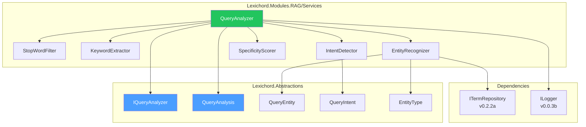
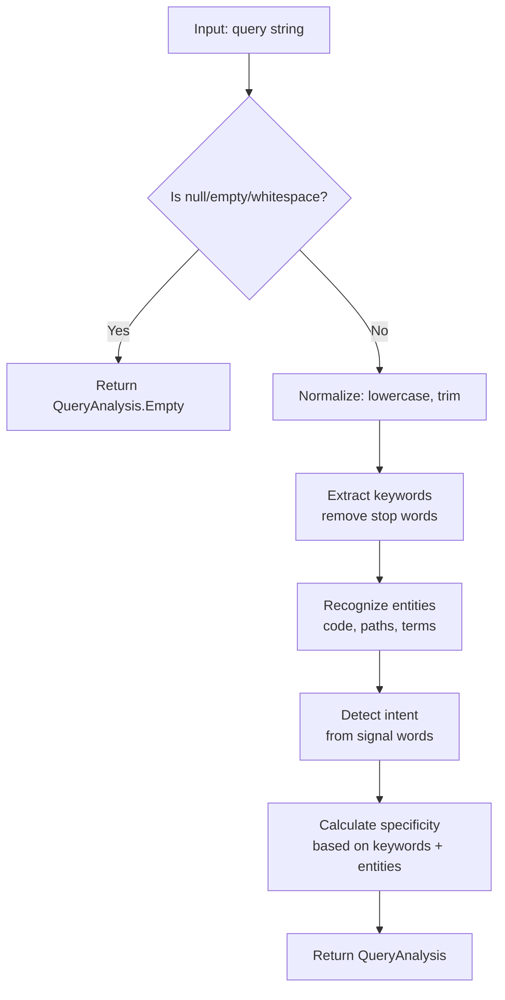

# LCS-DES-054a: Design Specification — Query Analyzer

## 1. Metadata & Categorization

| Field                | Value                             |
| :------------------- | :-------------------------------- |
| **Document ID**      | LCS-DES-054a                      |
| **Feature ID**       | RAG-054a                          |
| **Feature Name**     | Query Analyzer                    |
| **Parent Feature**   | v0.5.4 — The Relevance Tuner      |
| **Module Scope**     | Lexichord.Modules.RAG             |
| **Swimlane**         | Memory                            |
| **License Tier**     | Writer Pro (full analysis)        |
| **Feature Gate Key** | `FeatureFlags.RAG.RelevanceTuner` |
| **Status**           | Draft                             |
| **Last Updated**     | 2026-01-27                        |

---

## 2. Executive Summary

### 2.1 Problem Statement

Search queries are treated as simple strings, missing opportunities to understand user intent and extract meaningful structure. This leads to:

- Generic result ranking that doesn't match what users are looking for
- Missed entity recognition (code identifiers, file paths)
- No differentiation between "how to" and "what is" queries

### 2.2 Solution Overview

Implement `IQueryAnalyzer` that extracts rich metadata from search queries:

- **Keyword extraction** with stop-word filtering
- **Entity recognition** for code patterns, file paths, domain terms
- **Intent detection** (Factual, Procedural, Conceptual, Navigational)
- **Specificity scoring** to gauge query precision

### 2.3 Key Deliverables

| Deliverable      | Description                            |
| :--------------- | :------------------------------------- |
| `IQueryAnalyzer` | Interface in Lexichord.Abstractions    |
| `QueryAnalyzer`  | Implementation in Modules.RAG/Services |
| `QueryAnalysis`  | Result record with analysis metadata   |
| `QueryEntity`    | Entity recognition result              |
| `QueryIntent`    | Intent classification enum             |
| Stop-word list   | English + technical stop words         |
| Unit tests       | 95%+ coverage of analysis logic        |

---

## 3. Architecture & Modular Strategy

### 3.1 Component Diagram



### 3.2 Module Location

```text
src/
├── Lexichord.Abstractions/
│   └── Contracts/
│       └── QueryAnalysisModels.cs          ← Interfaces and records
│
└── Lexichord.Modules.RAG/
    └── Services/
        ├── QueryAnalyzer.cs                ← Main implementation
        └── Analysis/
            ├── StopWordFilter.cs           ← Stop-word filtering
            ├── KeywordExtractor.cs         ← Keyword extraction
            ├── EntityRecognizer.cs         ← Entity recognition
            ├── IntentDetector.cs           ← Intent classification
            └── SpecificityScorer.cs        ← Specificity calculation
```

---

## 4. Data Contract (The API)

### 4.1 IQueryAnalyzer Interface

```csharp
namespace Lexichord.Abstractions.Contracts;

/// <summary>
/// Analyzes search queries to extract structure, intent, and metadata.
/// </summary>
/// <remarks>
/// <para>Query analysis is the first step in the search enhancement pipeline.</para>
/// <para>Results are used for query expansion, result ranking, and analytics.</para>
/// </remarks>
/// <example>
/// <code>
/// var analysis = _queryAnalyzer.Analyze("how to configure OAuth authentication");
/// // analysis.Intent == QueryIntent.Procedural
/// // analysis.Keywords == ["configure", "OAuth", "authentication"]
/// // analysis.Entities contains "OAuth" as DomainTerm
/// </code>
/// </example>
public interface IQueryAnalyzer
{
    /// <summary>
    /// Analyzes a search query to extract keywords, entities, and intent.
    /// </summary>
    /// <param name="query">The raw search query string. May be null or empty.</param>
    /// <returns>
    /// Analysis results including keywords, entities, intent, and specificity.
    /// Returns empty analysis for null/empty queries.
    /// </returns>
    QueryAnalysis Analyze(string query);
}
```

### 4.2 QueryAnalysis Record

```csharp
namespace Lexichord.Abstractions.Contracts;

/// <summary>
/// Results of query analysis.
/// </summary>
/// <param name="OriginalQuery">The original query string as provided.</param>
/// <param name="NormalizedQuery">Lowercase, trimmed query.</param>
/// <param name="Keywords">Extracted meaningful keywords (stop-words removed).</param>
/// <param name="Entities">Recognized entities (code patterns, file paths, domain terms).</param>
/// <param name="Intent">Detected query intent category.</param>
/// <param name="Specificity">Score 0.0 (vague) to 1.0 (highly specific).</param>
/// <example>
/// <code>
/// var analysis = analyzer.Analyze("how to implement IRepository interface");
/// // analysis.OriginalQuery = "how to implement IRepository interface"
/// // analysis.Keywords = ["implement", "IRepository", "interface"]
/// // analysis.Entities = [QueryEntity("IRepository", CodeIdentifier, 19)]
/// // analysis.Intent = QueryIntent.Procedural
/// // analysis.Specificity = 0.8
/// </code>
/// </example>
public record QueryAnalysis(
    string OriginalQuery,
    string NormalizedQuery,
    IReadOnlyList<string> Keywords,
    IReadOnlyList<QueryEntity> Entities,
    QueryIntent Intent,
    float Specificity)
{
    /// <summary>
    /// Creates an empty analysis result.
    /// </summary>
    public static QueryAnalysis Empty { get; } = new(
        OriginalQuery: string.Empty,
        NormalizedQuery: string.Empty,
        Keywords: Array.Empty<string>(),
        Entities: Array.Empty<QueryEntity>(),
        Intent: QueryIntent.Factual,
        Specificity: 0f);

    /// <summary>
    /// Whether this analysis has any extracted keywords.
    /// </summary>
    public bool HasKeywords => Keywords.Count > 0;

    /// <summary>
    /// Whether this analysis has any recognized entities.
    /// </summary>
    public bool HasEntities => Entities.Count > 0;

    /// <summary>
    /// Gets entities of a specific type.
    /// </summary>
    public IEnumerable<QueryEntity> GetEntitiesOfType(EntityType type) =>
        Entities.Where(e => e.Type == type);
}
```

### 4.3 QueryEntity Record

```csharp
namespace Lexichord.Abstractions.Contracts;

/// <summary>
/// An entity recognized within a query.
/// </summary>
/// <param name="Text">The entity text as it appears in the query.</param>
/// <param name="Type">The type of entity recognized.</param>
/// <param name="StartIndex">Start position in the original query string.</param>
/// <param name="Confidence">Confidence score 0.0-1.0 for this recognition.</param>
/// <example>
/// <code>
/// var entity = new QueryEntity("IRepository", EntityType.CodeIdentifier, 19, 0.95f);
/// </code>
/// </example>
public record QueryEntity(
    string Text,
    EntityType Type,
    int StartIndex,
    float Confidence = 1.0f)
{
    /// <summary>
    /// End index in the original query (exclusive).
    /// </summary>
    public int EndIndex => StartIndex + Text.Length;
}

/// <summary>
/// Types of entities that can be recognized in queries.
/// </summary>
public enum EntityType
{
    /// <summary>
    /// Code identifier like function or class name.
    /// Patterns: PascalCase, camelCase, snake_case, SCREAMING_CASE
    /// Examples: IRepository, getUserById, MAX_RETRIES
    /// </summary>
    CodeIdentifier,

    /// <summary>
    /// File path or glob pattern.
    /// Patterns: Contains / or \, ends with extension
    /// Examples: src/Services/*.cs, config.json
    /// </summary>
    FilePath,

    /// <summary>
    /// Domain-specific term from terminology database.
    /// Source: ITermRepository lookup
    /// Examples: OAuth, dependency injection, singleton
    /// </summary>
    DomainTerm,

    /// <summary>
    /// Version number or reference.
    /// Patterns: v1.2.3, version 2.0, v0.5.4
    /// </summary>
    VersionNumber,

    /// <summary>
    /// Error code or status code.
    /// Patterns: ERR-123, HTTP 404, E0001
    /// </summary>
    ErrorCode
}
```

### 4.4 QueryIntent Enum

```csharp
namespace Lexichord.Abstractions.Contracts;

/// <summary>
/// Detected intent category for the query.
/// Used for result ranking and UI customization.
/// </summary>
public enum QueryIntent
{
    /// <summary>
    /// Looking for a specific fact, definition, or answer.
    /// Signals: "what is", "definition of", "meaning of", single nouns
    /// Example: "what is OAuth", "singleton pattern"
    /// </summary>
    Factual,

    /// <summary>
    /// Looking for step-by-step instructions or a tutorial.
    /// Signals: "how to", "steps to", "guide", "tutorial", "implement"
    /// Example: "how to configure authentication", "steps to deploy"
    /// </summary>
    Procedural,

    /// <summary>
    /// Looking to understand a concept, architecture, or rationale.
    /// Signals: "why", "explain", "understand", "difference between"
    /// Example: "why use dependency injection", "explain SOLID principles"
    /// </summary>
    Conceptual,

    /// <summary>
    /// Looking to navigate to a specific location or file.
    /// Signals: "where is", "find", "locate", file paths, "go to"
    /// Example: "where is the config file", "find UserService.cs"
    /// </summary>
    Navigational
}
```

---

## 5. Implementation Logic

### 5.1 Analysis Pipeline



### 5.2 Intent Detection Heuristics

```csharp
/// <summary>
/// Detects query intent based on signal words and patterns.
/// </summary>
internal static class IntentDetector
{
    private static readonly HashSet<string> ProceduralSignals = new(StringComparer.OrdinalIgnoreCase)
    {
        "how", "how to", "steps", "tutorial", "guide", "implement", "create",
        "configure", "setup", "install", "deploy", "build", "make"
    };

    private static readonly HashSet<string> FactualSignals = new(StringComparer.OrdinalIgnoreCase)
    {
        "what", "what is", "definition", "meaning", "describe", "list"
    };

    private static readonly HashSet<string> ConceptualSignals = new(StringComparer.OrdinalIgnoreCase)
    {
        "why", "explain", "understand", "difference", "compare", "versus",
        "pros", "cons", "benefits", "drawbacks", "when to use"
    };

    private static readonly HashSet<string> NavigationalSignals = new(StringComparer.OrdinalIgnoreCase)
    {
        "where", "where is", "find", "locate", "go to", "open", "show me"
    };

    public static QueryIntent Detect(string normalizedQuery, IReadOnlyList<QueryEntity> entities)
    {
        // Check for file path entities first (strong Navigational signal)
        if (entities.Any(e => e.Type == EntityType.FilePath))
        {
            return QueryIntent.Navigational;
        }

        // Check signal words in order of specificity
        var words = normalizedQuery.Split(' ', StringSplitOptions.RemoveEmptyEntries);

        if (words.Length >= 2)
        {
            var twoWordStart = $"{words[0]} {words[1]}";
            if (ProceduralSignals.Contains(twoWordStart)) return QueryIntent.Procedural;
            if (FactualSignals.Contains(twoWordStart)) return QueryIntent.Factual;
            if (ConceptualSignals.Contains(twoWordStart)) return QueryIntent.Conceptual;
            if (NavigationalSignals.Contains(twoWordStart)) return QueryIntent.Navigational;
        }

        if (words.Length >= 1)
        {
            var firstWord = words[0];
            if (ProceduralSignals.Contains(firstWord)) return QueryIntent.Procedural;
            if (FactualSignals.Contains(firstWord)) return QueryIntent.Factual;
            if (ConceptualSignals.Contains(firstWord)) return QueryIntent.Conceptual;
            if (NavigationalSignals.Contains(firstWord)) return QueryIntent.Navigational;
        }

        // Default to Factual for queries without clear signals
        return QueryIntent.Factual;
    }
}
```

### 5.3 Entity Recognition Patterns

```csharp
/// <summary>
/// Recognizes entities (code, paths, terms) within queries.
/// </summary>
internal class EntityRecognizer
{
    private readonly ITermRepository _termRepository;

    // Code identifier pattern: PascalCase, camelCase, snake_case, or contains special chars
    private static readonly Regex CodeIdentifierPattern = new(
        @"\b([A-Z][a-z]+[A-Z][\w]*|[a-z]+[A-Z][\w]*|[A-Z]{2,}[\w]*|I[A-Z][a-z]+[\w]*|\w+_\w+)\b",
        RegexOptions.Compiled);

    // File path pattern: contains / or \, or ends with common extension
    private static readonly Regex FilePathPattern = new(
        @"([\w\-./\\]+\.(cs|md|json|yaml|yml|xml|txt|config|js|ts|py|sql)|[\w\-]+[/\\][\w\-./\\]+)",
        RegexOptions.Compiled | RegexOptions.IgnoreCase);

    // Version pattern: v1.2.3, version 2.0, etc.
    private static readonly Regex VersionPattern = new(
        @"\b(v\d+(\.\d+)*|version\s*\d+(\.\d+)*)\b",
        RegexOptions.Compiled | RegexOptions.IgnoreCase);

    // Error code pattern: ERR-123, HTTP 404, E0001
    private static readonly Regex ErrorCodePattern = new(
        @"\b([A-Z]{2,}\-?\d{2,}|HTTP\s*\d{3}|E\d{4,})\b",
        RegexOptions.Compiled);

    public IReadOnlyList<QueryEntity> Recognize(string query)
    {
        var entities = new List<QueryEntity>();

        // Order matters: more specific patterns first
        AddMatches(entities, query, ErrorCodePattern, EntityType.ErrorCode);
        AddMatches(entities, query, VersionPattern, EntityType.VersionNumber);
        AddMatches(entities, query, FilePathPattern, EntityType.FilePath);
        AddMatches(entities, query, CodeIdentifierPattern, EntityType.CodeIdentifier);

        // Check terminology database for domain terms
        var domainTerms = _termRepository.FindMatchingTerms(query);
        foreach (var term in domainTerms)
        {
            var index = query.IndexOf(term.Name, StringComparison.OrdinalIgnoreCase);
            if (index >= 0 && !entities.Any(e => OverlapsWithExisting(e, index, term.Name.Length)))
            {
                entities.Add(new QueryEntity(term.Name, EntityType.DomainTerm, index, 0.9f));
            }
        }

        return entities.OrderBy(e => e.StartIndex).ToList();
    }

    private static void AddMatches(List<QueryEntity> entities, string query, Regex pattern, EntityType type)
    {
        foreach (Match match in pattern.Matches(query))
        {
            if (!entities.Any(e => OverlapsWithExisting(e, match.Index, match.Length)))
            {
                entities.Add(new QueryEntity(match.Value, type, match.Index));
            }
        }
    }

    private static bool OverlapsWithExisting(QueryEntity existing, int newStart, int newLength)
    {
        var newEnd = newStart + newLength;
        return existing.StartIndex < newEnd && newStart < existing.EndIndex;
    }
}
```

### 5.4 Specificity Scoring

```csharp
/// <summary>
/// Calculates query specificity score.
/// </summary>
internal static class SpecificityScorer
{
    /// <summary>
    /// Calculates specificity from 0.0 (vague) to 1.0 (highly specific).
    /// </summary>
    public static float Calculate(
        IReadOnlyList<string> keywords,
        IReadOnlyList<QueryEntity> entities,
        string normalizedQuery)
    {
        if (string.IsNullOrWhiteSpace(normalizedQuery))
            return 0f;

        var score = 0f;

        // Base score from keyword count (more keywords = more specific)
        // 1 keyword = 0.2, 2 = 0.3, 3+ = 0.4
        score += keywords.Count switch
        {
            0 => 0f,
            1 => 0.2f,
            2 => 0.3f,
            _ => 0.4f
        };

        // Bonus for recognized entities
        // Each entity adds up to 0.15, max 0.45 (3 entities)
        score += Math.Min(entities.Count * 0.15f, 0.45f);

        // Bonus for entity types (some are more specific)
        if (entities.Any(e => e.Type == EntityType.FilePath))
            score += 0.1f;  // File paths are very specific
        if (entities.Any(e => e.Type == EntityType.ErrorCode))
            score += 0.1f;  // Error codes are very specific
        if (entities.Any(e => e.Type == EntityType.VersionNumber))
            score += 0.05f; // Version numbers add specificity

        // Penalty for very short queries
        if (normalizedQuery.Length < 5)
            score *= 0.5f;

        return Math.Clamp(score, 0f, 1f);
    }
}
```

### 5.5 Stop-Word List

```csharp
/// <summary>
/// Filters stop words from queries.
/// </summary>
internal static class StopWordFilter
{
    private static readonly HashSet<string> StopWords = new(StringComparer.OrdinalIgnoreCase)
    {
        // English stop words
        "a", "an", "the", "and", "or", "but", "in", "on", "at", "to", "for",
        "of", "with", "by", "from", "as", "is", "was", "are", "were", "been",
        "be", "have", "has", "had", "do", "does", "did", "will", "would",
        "could", "should", "may", "might", "must", "shall", "can", "need",
        "this", "that", "these", "those", "it", "its",
        "i", "me", "my", "we", "our", "you", "your", "he", "him", "his",
        "she", "her", "they", "them", "their",
        "which", "who", "whom", "what", "when", "where", "why", "how",
        "all", "each", "every", "both", "few", "more", "most", "other",
        "some", "such", "no", "not", "only", "same", "so", "than", "too",
        "very", "just", "also", "now", "here", "there",

        // Technical stop words (common but low information)
        "use", "using", "get", "set", "add", "remove", "update", "delete",
        "new", "old", "first", "last", "next", "previous"
    };

    public static IReadOnlyList<string> Filter(IEnumerable<string> words) =>
        words.Where(w => !StopWords.Contains(w) && w.Length > 1).ToList();
}
```

---

## 6. Data Persistence

This sub-part does not persist data. Query analysis is performed in-memory, synchronously.

---

## 7. UI/UX Specifications

Analysis results are displayed in the search results header:

```text
┌─────────────────────────────────────────────────────────────────────────────────────┐
│  Search Results for: how to configure OAuth authentication                         │
│  ┌──────────────────────────────────────────────────────────────────────────────┐   │
│  │  📊 Intent: Procedural  ·  Keywords: configure, OAuth, authentication        │   │
│  │  🏷️ Entities: OAuth (Domain Term)                                            │   │
│  └──────────────────────────────────────────────────────────────────────────────┘   │
└─────────────────────────────────────────────────────────────────────────────────────┘
```

---

## 8. Observability & Logging

### 8.1 Log Events

| Level | Event                  | Template                                                                                           |
| :---- | :--------------------- | :------------------------------------------------------------------------------------------------- |
| Debug | Analysis started       | `"Analyzing query: '{Query}'"`                                                                     |
| Debug | Keywords extracted     | `"Extracted {Count} keywords: [{Keywords}]"`                                                       |
| Debug | Entities recognized    | `"Recognized {Count} entities: [{Entities}]"`                                                      |
| Debug | Intent detected        | `"Detected intent: {Intent}"`                                                                      |
| Debug | Specificity calculated | `"Specificity score: {Score}"`                                                                     |
| Info  | Analysis complete      | `"Query analyzed: Intent={Intent}, Keywords={Count}, Entities={EntityCount}, Specificity={Score}"` |

---

## 9. Security & Safety

### 9.1 Input Validation

- Null/empty queries return `QueryAnalysis.Empty`
- Very long queries (>500 chars) are truncated before analysis
- Regex patterns have timeouts to prevent ReDoS

### 9.2 Performance Considerations

- Analysis is synchronous and should complete in < 20ms
- Entity recognition uses compiled regex for performance
- Term repository lookup is cached

---

## 10. Acceptance Criteria

| #   | Category        | Criterion                                                 | Verification     |
| :-- | :-------------- | :-------------------------------------------------------- | :--------------- |
| 1   | **Functional**  | Keywords extracted with stop-words removed                | Unit test        |
| 2   | **Functional**  | Code identifiers recognized (PascalCase, camelCase, etc.) | Unit test        |
| 3   | **Functional**  | File paths recognized                                     | Unit test        |
| 4   | **Functional**  | Domain terms recognized from terminology database         | Unit test        |
| 5   | **Functional**  | Procedural intent detected for "how to" queries           | Unit test        |
| 6   | **Functional**  | Navigational intent detected for file path queries        | Unit test        |
| 7   | **Functional**  | Specificity score increases with more keywords/entities   | Unit test        |
| 8   | **Performance** | Analysis completes in < 20ms                              | Performance test |
| 9   | **Edge Case**   | Empty query returns empty analysis                        | Unit test        |
| 10  | **Edge Case**   | Very long query is handled without error                  | Unit test        |

---

## 11. Code Examples

### 11.1 Basic Usage

```csharp
public class SearchOrchestrator
{
    private readonly IQueryAnalyzer _analyzer;

    public async Task<SearchResults> SearchAsync(string query)
    {
        var analysis = _analyzer.Analyze(query);

        _logger.LogDebug(
            "Query analyzed: Intent={Intent}, Keywords=[{Keywords}]",
            analysis.Intent,
            string.Join(", ", analysis.Keywords));

        // Use analysis for search enhancement
        // ...
    }
}
```

### 11.2 Intent-Based Result Ranking

```csharp
// Rank results differently based on intent
var rankedResults = analysis.Intent switch
{
    QueryIntent.Procedural =>
        results.OrderByDescending(r => r.HasStepByStepContent),
    QueryIntent.Navigational =>
        results.OrderByDescending(r => r.PathMatchScore),
    QueryIntent.Conceptual =>
        results.OrderByDescending(r => r.ExplanationDepth),
    _ => results.OrderByDescending(r => r.Score)
};
```

---

## 12. Unit Testing Requirements

### 12.1 Test Scenarios

```csharp
[Trait("Category", "Unit")]
[Trait("Feature", "v0.5.4a")]
public class QueryAnalyzerTests
{
    private readonly IQueryAnalyzer _sut;

    [Theory]
    [InlineData("how to configure authentication", QueryIntent.Procedural)]
    [InlineData("what is OAuth", QueryIntent.Factual)]
    [InlineData("explain dependency injection", QueryIntent.Conceptual)]
    [InlineData("where is config.json", QueryIntent.Navigational)]
    [InlineData("find UserService.cs", QueryIntent.Navigational)]
    [InlineData("token refresh", QueryIntent.Factual)]  // Default
    public void Analyze_DetectsCorrectIntent(string query, QueryIntent expected)
    {
        var result = _sut.Analyze(query);
        result.Intent.Should().Be(expected);
    }

    [Fact]
    public void Analyze_ExtractsKeywords_RemovingStopWords()
    {
        var result = _sut.Analyze("how to use the authentication service");

        result.Keywords.Should().Contain("authentication");
        result.Keywords.Should().Contain("service");
        result.Keywords.Should().NotContain("how");
        result.Keywords.Should().NotContain("to");
        result.Keywords.Should().NotContain("the");
        result.Keywords.Should().NotContain("use");
    }

    [Theory]
    [InlineData("IRepository", EntityType.CodeIdentifier)]
    [InlineData("getUserById", EntityType.CodeIdentifier)]
    [InlineData("MAX_RETRIES", EntityType.CodeIdentifier)]
    [InlineData("user_service", EntityType.CodeIdentifier)]
    public void Analyze_RecognizesCodeIdentifiers(string identifier, EntityType expected)
    {
        var result = _sut.Analyze($"find {identifier} implementation");

        result.Entities.Should().ContainSingle(e =>
            e.Text == identifier && e.Type == expected);
    }

    [Theory]
    [InlineData("src/Services/UserService.cs")]
    [InlineData("config.json")]
    [InlineData("docs/**/*.md")]
    public void Analyze_RecognizesFilePaths(string path)
    {
        var result = _sut.Analyze($"open {path}");

        result.Entities.Should().ContainSingle(e =>
            e.Text == path && e.Type == EntityType.FilePath);
    }

    [Theory]
    [InlineData("v1.2.3", EntityType.VersionNumber)]
    [InlineData("HTTP 404", EntityType.ErrorCode)]
    [InlineData("ERR-1234", EntityType.ErrorCode)]
    public void Analyze_RecognizesSpecialPatterns(string pattern, EntityType expected)
    {
        var result = _sut.Analyze($"fix {pattern} error");

        result.Entities.Should().ContainSingle(e =>
            e.Text.Contains(pattern.Split(' ')[0]) && e.Type == expected);
    }

    [Fact]
    public void Analyze_SpecificityIncreasesWithComplexity()
    {
        var simple = _sut.Analyze("auth");
        var medium = _sut.Analyze("OAuth authentication");
        var complex = _sut.Analyze("how to configure IAuthService for OAuth in v1.2");

        simple.Specificity.Should().BeLessThan(medium.Specificity);
        medium.Specificity.Should().BeLessThan(complex.Specificity);
    }

    [Theory]
    [InlineData(null)]
    [InlineData("")]
    [InlineData("   ")]
    public void Analyze_EmptyInput_ReturnsEmptyAnalysis(string query)
    {
        var result = _sut.Analyze(query);

        result.Should().Be(QueryAnalysis.Empty);
    }

    [Fact]
    public void Analyze_VeryLongQuery_HandlesWithoutError()
    {
        var longQuery = new string('a', 1000) + " authentication guide";

        var act = () => _sut.Analyze(longQuery);

        act.Should().NotThrow();
    }
}
```

---

## 13. Deliverable Checklist

| #   | Deliverable                                          | Status |
| :-- | :--------------------------------------------------- | :----- |
| 1   | `IQueryAnalyzer` interface in Abstractions           | [ ]    |
| 2   | `QueryAnalysis` record with helper properties        | [ ]    |
| 3   | `QueryEntity` record                                 | [ ]    |
| 4   | `QueryIntent` and `EntityType` enums                 | [ ]    |
| 5   | `QueryAnalyzer` implementation                       | [ ]    |
| 6   | `StopWordFilter` with English + technical stop words | [ ]    |
| 7   | `EntityRecognizer` with regex patterns               | [ ]    |
| 8   | `IntentDetector` with heuristics                     | [ ]    |
| 9   | `SpecificityScorer` implementation                   | [ ]    |
| 10  | Unit tests with 95%+ coverage                        | [ ]    |
| 11  | DI registration in RAGModule.cs                      | [ ]    |

---

## Document History

| Version | Date       | Author         | Changes       |
| :------ | :--------- | :------------- | :------------ |
| 1.0     | 2026-01-27 | Lead Architect | Initial draft |
