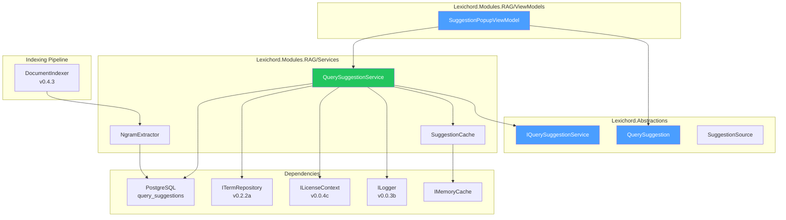
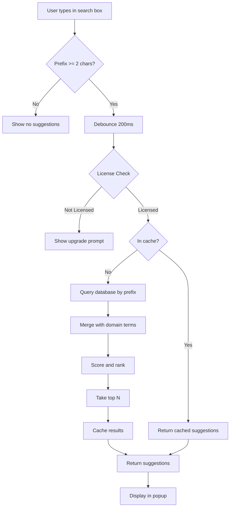

# LCS-DES-054c: Design Specification — Query Suggestions

## 1. Metadata & Categorization

| Field                | Value                             |
| :------------------- | :-------------------------------- |
| **Document ID**      | LCS-DES-054c                      |
| **Feature ID**       | RAG-054c                          |
| **Feature Name**     | Query Suggestions                 |
| **Parent Feature**   | v0.5.4 — The Relevance Tuner      |
| **Module Scope**     | Lexichord.Modules.RAG             |
| **Swimlane**         | Memory                            |
| **License Tier**     | Writer Pro                        |
| **Feature Gate Key** | `FeatureFlags.RAG.RelevanceTuner` |
| **Status**           | Draft                             |
| **Last Updated**     | 2026-01-27                        |

---

## 2. Executive Summary

### 2.1 Problem Statement

Users must type complete queries without guidance, causing:

- Increased search friction and slower discovery
- Missed relevant content due to incomplete queries
- No awareness of what content exists before searching
- Repeated typing of similar queries

### 2.2 Solution Overview

Implement intelligent autocomplete suggestions based on:

- **Document headings** extracted during indexing (highest quality)
- **Common n-grams** from chunk content (frequently used phrases)
- **Previous queries** from search history (user behavior)
- **Domain terms** from terminology database (curated vocabulary)

### 2.3 Key Deliverables

| Deliverable                | Description                              |
| :------------------------- | :--------------------------------------- |
| `IQuerySuggestionService`  | Interface in Lexichord.Abstractions      |
| `QuerySuggestionService`   | Implementation with prefix matching      |
| `query_suggestions` table  | Database table for persisted suggestions |
| `NgramExtractor`           | Extract suggestions during indexing      |
| `SuggestionPopupViewModel` | ViewModel for autocomplete UI            |
| `SuggestionPopup`          | WPF/Avalonia dropdown component          |
| Unit tests                 | 90%+ coverage                            |

---

## 3. Architecture & Modular Strategy

### 3.1 Component Diagram



### 3.2 Module Location

```text
src/
├── Lexichord.Abstractions/
│   └── Contracts/
│       └── QuerySuggestionModels.cs         ← Interface and records
│
└── Lexichord.Modules.RAG/
    ├── Services/
    │   ├── QuerySuggestionService.cs        ← Main implementation
    │   └── Suggestions/
    │       ├── NgramExtractor.cs            ← Extracts n-grams during indexing
    │       └── SuggestionCache.cs           ← In-memory suggestion cache
    │
    ├── ViewModels/
    │   └── SuggestionPopupViewModel.cs      ← Autocomplete ViewModel
    │
    └── Migrations/
        └── Migration_006_QuerySuggestions.cs ← Database migration
```

---

## 4. Data Contract (The API)

### 4.1 IQuerySuggestionService Interface

```csharp
namespace Lexichord.Abstractions.Contracts;

/// <summary>
/// Provides intelligent autocomplete suggestions for search queries.
/// </summary>
/// <remarks>
/// <para>Suggestions come from multiple sources: headings, n-grams, history, and terms.</para>
/// <para>This feature is gated behind Writer Pro license tier.</para>
/// </remarks>
public interface IQuerySuggestionService
{
    /// <summary>
    /// Gets autocomplete suggestions for a query prefix.
    /// </summary>
    /// <param name="prefix">The prefix to match (minimum 2 characters).</param>
    /// <param name="maxResults">Maximum suggestions to return (default 10).</param>
    /// <param name="cancellationToken">Cancellation token.</param>
    /// <returns>Ranked list of suggestions.</returns>
    Task<IReadOnlyList<QuerySuggestion>> GetSuggestionsAsync(
        string prefix,
        int maxResults = 10,
        CancellationToken cancellationToken = default);

    /// <summary>
    /// Records a successfully executed query for suggestion learning.
    /// </summary>
    /// <param name="query">The executed query.</param>
    /// <param name="resultCount">Number of results returned.</param>
    /// <param name="cancellationToken">Cancellation token.</param>
    Task RecordQueryAsync(
        string query,
        int resultCount,
        CancellationToken cancellationToken = default);

    /// <summary>
    /// Extracts suggestions from a document's content during indexing.
    /// </summary>
    /// <param name="documentId">The document being indexed.</param>
    /// <param name="content">Full document content.</param>
    /// <param name="headings">Extracted headings from the document.</param>
    /// <param name="cancellationToken">Cancellation token.</param>
    Task ExtractSuggestionsAsync(
        Guid documentId,
        string content,
        IReadOnlyList<string> headings,
        CancellationToken cancellationToken = default);

    /// <summary>
    /// Removes suggestions associated with a document (for re-indexing).
    /// </summary>
    /// <param name="documentId">The document being re-indexed.</param>
    /// <param name="cancellationToken">Cancellation token.</param>
    Task RemoveSuggestionsForDocumentAsync(
        Guid documentId,
        CancellationToken cancellationToken = default);
}
```

### 4.2 QuerySuggestion Record

```csharp
namespace Lexichord.Abstractions.Contracts;

/// <summary>
/// An autocomplete suggestion with metadata.
/// </summary>
/// <param name="Text">The suggestion text.</param>
/// <param name="Frequency">How often this suggestion appears/is used.</param>
/// <param name="Source">The source of this suggestion.</param>
/// <param name="Score">Ranking score (higher = better match).</param>
public record QuerySuggestion(
    string Text,
    int Frequency,
    SuggestionSource Source,
    float Score)
{
    /// <summary>
    /// Formatted display text with source indicator.
    /// </summary>
    public string DisplayText => Source switch
    {
        SuggestionSource.QueryHistory => $"🕐 {Text}",
        SuggestionSource.DocumentHeading => $"📄 {Text}",
        SuggestionSource.ContentNgram => $"💡 {Text}",
        SuggestionSource.DomainTerm => $"📚 {Text}",
        _ => Text
    };

    /// <summary>
    /// Human-readable source label.
    /// </summary>
    public string SourceLabel => Source switch
    {
        SuggestionSource.QueryHistory => "Recent Query",
        SuggestionSource.DocumentHeading => "Heading",
        SuggestionSource.ContentNgram => "Suggestion",
        SuggestionSource.DomainTerm => "Term",
        _ => "Unknown"
    };
}

/// <summary>
/// Source of a query suggestion.
/// </summary>
public enum SuggestionSource
{
    /// <summary>
    /// From user's previous queries (highest relevance for repeat queries).
    /// </summary>
    QueryHistory,

    /// <summary>
    /// Document heading or title (high quality, navigational).
    /// </summary>
    DocumentHeading,

    /// <summary>
    /// N-gram extracted from document content (frequent phrases).
    /// </summary>
    ContentNgram,

    /// <summary>
    /// Domain term from terminology database (curated vocabulary).
    /// </summary>
    DomainTerm
}
```

---

## 5. Database Schema

### 5.1 query_suggestions Table

```sql
-- Migration_006_QuerySuggestions.sql

CREATE TABLE query_suggestions (
    id UUID PRIMARY KEY DEFAULT gen_random_uuid(),
    text TEXT NOT NULL,
    normalized_text TEXT NOT NULL,          -- Lowercase, trimmed for matching
    source TEXT NOT NULL,                   -- SuggestionSource enum value
    frequency INT NOT NULL DEFAULT 1,       -- Usage/occurrence count
    last_seen_at TIMESTAMPTZ NOT NULL DEFAULT NOW(),
    document_id UUID,                       -- NULL for QueryHistory, populated for others
    created_at TIMESTAMPTZ NOT NULL DEFAULT NOW(),

    CONSTRAINT uq_suggestions_normalized_source
        UNIQUE (normalized_text, source, document_id)
);

-- Index for prefix matching (uses text_pattern_ops for LIKE 'prefix%')
CREATE INDEX idx_suggestions_prefix
    ON query_suggestions (normalized_text text_pattern_ops);

-- Index for frequency-based ranking
CREATE INDEX idx_suggestions_frequency
    ON query_suggestions (frequency DESC);

-- Index for document cleanup during re-indexing
CREATE INDEX idx_suggestions_document
    ON query_suggestions (document_id)
    WHERE document_id IS NOT NULL;

-- Index for recency-based ranking
CREATE INDEX idx_suggestions_last_seen
    ON query_suggestions (last_seen_at DESC);

COMMENT ON TABLE query_suggestions IS
    'Stores autocomplete suggestions from various sources for v0.5.4c';
```

### 5.2 Entity Mapping

```csharp
namespace Lexichord.Modules.RAG.Data.Entities;

public class QuerySuggestionEntity
{
    public Guid Id { get; set; }
    public string Text { get; set; } = string.Empty;
    public string NormalizedText { get; set; } = string.Empty;
    public string Source { get; set; } = string.Empty;
    public int Frequency { get; set; }
    public DateTime LastSeenAt { get; set; }
    public Guid? DocumentId { get; set; }
    public DateTime CreatedAt { get; set; }
}
```

---

## 6. Implementation Logic

### 6.1 Suggestion Retrieval Pipeline



### 6.2 QuerySuggestionService Implementation

```csharp
namespace Lexichord.Modules.RAG.Services;

/// <summary>
/// Provides autocomplete suggestions from multiple sources.
/// </summary>
public class QuerySuggestionService : IQuerySuggestionService
{
    private readonly IDbConnection _connection;
    private readonly ITermRepository _termRepository;
    private readonly ILicenseContext _licenseContext;
    private readonly IMemoryCache _cache;
    private readonly ILogger<QuerySuggestionService> _logger;

    private static readonly TimeSpan CacheDuration = TimeSpan.FromMinutes(5);
    private const int MinPrefixLength = 2;

    public QuerySuggestionService(
        IDbConnection connection,
        ITermRepository termRepository,
        ILicenseContext licenseContext,
        IMemoryCache cache,
        ILogger<QuerySuggestionService> logger)
    {
        _connection = connection;
        _termRepository = termRepository;
        _licenseContext = licenseContext;
        _cache = cache;
        _logger = logger;
    }

    /// <inheritdoc />
    public async Task<IReadOnlyList<QuerySuggestion>> GetSuggestionsAsync(
        string prefix,
        int maxResults = 10,
        CancellationToken cancellationToken = default)
    {
        if (string.IsNullOrWhiteSpace(prefix) || prefix.Length < MinPrefixLength)
            return Array.Empty<QuerySuggestion>();

        // License gate
        if (!_licenseContext.HasFeature(FeatureFlags.RAG.RelevanceTuner))
        {
            _logger.LogDebug("Query suggestions disabled - user not licensed");
            return Array.Empty<QuerySuggestion>();
        }

        var normalizedPrefix = prefix.ToLowerInvariant().Trim();
        var cacheKey = $"suggestions:{normalizedPrefix}:{maxResults}";

        if (_cache.TryGetValue<IReadOnlyList<QuerySuggestion>>(cacheKey, out var cached))
        {
            _logger.LogDebug("Suggestion cache hit for prefix '{Prefix}'", prefix);
            return cached!;
        }

        _logger.LogDebug("Getting suggestions for prefix '{Prefix}'", prefix);

        var suggestions = new List<QuerySuggestion>();

        // Step 1: Query database for stored suggestions
        var dbSuggestions = await GetDatabaseSuggestionsAsync(
            normalizedPrefix, maxResults * 2, cancellationToken);
        suggestions.AddRange(dbSuggestions);

        // Step 2: Add domain terms from terminology database
        var domainTerms = await GetDomainTermSuggestionsAsync(
            normalizedPrefix, maxResults, cancellationToken);
        suggestions.AddRange(domainTerms);

        // Step 3: Score and deduplicate
        var ranked = suggestions
            .GroupBy(s => s.Text.ToLowerInvariant())
            .Select(g => CombineSuggestions(g))
            .OrderByDescending(s => s.Score)
            .ThenByDescending(s => s.Frequency)
            .Take(maxResults)
            .ToList();

        _cache.Set(cacheKey, ranked, CacheDuration);
        _logger.LogDebug("Returned {Count} suggestions for prefix '{Prefix}'", ranked.Count, prefix);

        return ranked;
    }

    /// <inheritdoc />
    public async Task RecordQueryAsync(
        string query,
        int resultCount,
        CancellationToken cancellationToken = default)
    {
        if (string.IsNullOrWhiteSpace(query) || query.Length < MinPrefixLength)
            return;

        // Only record queries that returned results (high-quality suggestions)
        if (resultCount == 0)
        {
            _logger.LogDebug("Skipping zero-result query for suggestions: '{Query}'", query);
            return;
        }

        var normalizedQuery = query.ToLowerInvariant().Trim();

        const string sql = @"
            INSERT INTO query_suggestions (text, normalized_text, source, frequency, last_seen_at)
            VALUES (@Text, @NormalizedText, @Source, 1, NOW())
            ON CONFLICT (normalized_text, source, document_id)
            DO UPDATE SET
                frequency = query_suggestions.frequency + 1,
                last_seen_at = NOW()";

        await _connection.ExecuteAsync(sql, new
        {
            Text = query.Trim(),
            NormalizedText = normalizedQuery,
            Source = SuggestionSource.QueryHistory.ToString()
        });

        // Invalidate cache for this prefix
        InvalidateCacheForPrefix(normalizedQuery);

        _logger.LogDebug("Recorded query for suggestions: '{Query}'", query);
    }

    /// <inheritdoc />
    public async Task ExtractSuggestionsAsync(
        Guid documentId,
        string content,
        IReadOnlyList<string> headings,
        CancellationToken cancellationToken = default)
    {
        _logger.LogDebug(
            "Extracting suggestions from document {DocumentId} with {HeadingCount} headings",
            documentId, headings.Count);

        var suggestions = new List<(string Text, SuggestionSource Source)>();

        // Extract from headings (highest quality)
        foreach (var heading in headings.Where(h => h.Length >= 3 && h.Length <= 100))
        {
            suggestions.Add((heading.Trim(), SuggestionSource.DocumentHeading));
        }

        // Extract common n-grams from content
        var ngrams = NgramExtractor.ExtractSignificantNgrams(content, minCount: 2);
        foreach (var ngram in ngrams.Take(50))
        {
            suggestions.Add((ngram, SuggestionSource.ContentNgram));
        }

        // Batch insert
        const string sql = @"
            INSERT INTO query_suggestions (text, normalized_text, source, frequency, document_id)
            VALUES (@Text, @NormalizedText, @Source, 1, @DocumentId)
            ON CONFLICT (normalized_text, source, document_id)
            DO UPDATE SET
                frequency = query_suggestions.frequency + 1,
                last_seen_at = NOW()";

        foreach (var (text, source) in suggestions)
        {
            cancellationToken.ThrowIfCancellationRequested();

            await _connection.ExecuteAsync(sql, new
            {
                Text = text,
                NormalizedText = text.ToLowerInvariant(),
                Source = source.ToString(),
                DocumentId = documentId
            });
        }

        _logger.LogInformation(
            "Extracted {Count} suggestions from document {DocumentId}",
            suggestions.Count, documentId);
    }

    /// <inheritdoc />
    public async Task RemoveSuggestionsForDocumentAsync(
        Guid documentId,
        CancellationToken cancellationToken = default)
    {
        const string sql = "DELETE FROM query_suggestions WHERE document_id = @DocumentId";
        var deleted = await _connection.ExecuteAsync(sql, new { DocumentId = documentId });

        _logger.LogDebug(
            "Removed {Count} suggestions for document {DocumentId}",
            deleted, documentId);
    }

    private async Task<IReadOnlyList<QuerySuggestion>> GetDatabaseSuggestionsAsync(
        string normalizedPrefix,
        int limit,
        CancellationToken cancellationToken)
    {
        const string sql = @"
            SELECT text, normalized_text, source, frequency, last_seen_at
            FROM query_suggestions
            WHERE normalized_text LIKE @Prefix
            ORDER BY
                CASE source
                    WHEN 'QueryHistory' THEN 1
                    WHEN 'DocumentHeading' THEN 2
                    WHEN 'ContentNgram' THEN 3
                    ELSE 4
                END,
                frequency DESC,
                last_seen_at DESC
            LIMIT @Limit";

        var results = await _connection.QueryAsync<QuerySuggestionEntity>(sql, new
        {
            Prefix = normalizedPrefix + "%",
            Limit = limit
        });

        return results.Select(e => new QuerySuggestion(
            Text: e.Text,
            Frequency: e.Frequency,
            Source: Enum.Parse<SuggestionSource>(e.Source),
            Score: CalculateScore(e, normalizedPrefix)
        )).ToList();
    }

    private async Task<IReadOnlyList<QuerySuggestion>> GetDomainTermSuggestionsAsync(
        string normalizedPrefix,
        int limit,
        CancellationToken cancellationToken)
    {
        var terms = await _termRepository.FindByPrefixAsync(normalizedPrefix, limit, cancellationToken);

        return terms.Select(t => new QuerySuggestion(
            Text: t.Name,
            Frequency: 1,
            Source: SuggestionSource.DomainTerm,
            Score: 0.7f  // Domain terms get moderate base score
        )).ToList();
    }

    private static float CalculateScore(QuerySuggestionEntity entity, string prefix)
    {
        var score = 0f;

        // Source weight
        score += entity.Source switch
        {
            "QueryHistory" => 0.4f,
            "DocumentHeading" => 0.35f,
            "ContentNgram" => 0.25f,
            _ => 0.2f
        };

        // Frequency boost (logarithmic to prevent runaway)
        score += Math.Min(MathF.Log10(entity.Frequency + 1) * 0.1f, 0.3f);

        // Recency boost (within last 24 hours)
        if (entity.LastSeenAt > DateTime.UtcNow.AddHours(-24))
            score += 0.15f;
        else if (entity.LastSeenAt > DateTime.UtcNow.AddDays(-7))
            score += 0.08f;

        // Prefix match quality (exact prefix match = higher score)
        var prefixLen = prefix.Length;
        var textLen = entity.NormalizedText.Length;
        score += (float)prefixLen / textLen * 0.15f;

        return score;
    }

    private static QuerySuggestion CombineSuggestions(IEnumerable<QuerySuggestion> duplicates)
    {
        var list = duplicates.ToList();
        var best = list.MaxBy(s => s.Score)!;

        return best with
        {
            Frequency = list.Sum(s => s.Frequency),
            Score = list.Max(s => s.Score)
        };
    }

    private void InvalidateCacheForPrefix(string normalizedQuery)
    {
        // Invalidate common prefix lengths
        for (var len = MinPrefixLength; len <= Math.Min(normalizedQuery.Length, 10); len++)
        {
            var prefix = normalizedQuery[..len];
            _cache.Remove($"suggestions:{prefix}:10");
        }
    }
}
```

### 6.3 NgramExtractor Implementation

```csharp
namespace Lexichord.Modules.RAG.Services.Suggestions;

/// <summary>
/// Extracts significant n-grams from document content.
/// </summary>
internal static class NgramExtractor
{
    private static readonly HashSet<string> StopWords = new(StringComparer.OrdinalIgnoreCase)
    {
        "the", "a", "an", "and", "or", "but", "in", "on", "at", "to", "for",
        "of", "with", "by", "from", "is", "was", "are", "were", "been", "be",
        "have", "has", "had", "it", "its", "this", "that", "these", "those"
    };

    /// <summary>
    /// Extracts significant n-grams (2-4 words) that appear frequently.
    /// </summary>
    /// <param name="content">Document content.</param>
    /// <param name="minCount">Minimum occurrences to be significant.</param>
    /// <returns>List of significant n-grams.</returns>
    public static IReadOnlyList<string> ExtractSignificantNgrams(string content, int minCount = 2)
    {
        if (string.IsNullOrWhiteSpace(content))
            return Array.Empty<string>();

        // Tokenize into words
        var words = Tokenize(content);
        if (words.Count < 2)
            return Array.Empty<string>();

        var ngramCounts = new Dictionary<string, int>(StringComparer.OrdinalIgnoreCase);

        // Extract 2-grams, 3-grams, and 4-grams
        for (var n = 2; n <= 4; n++)
        {
            for (var i = 0; i <= words.Count - n; i++)
            {
                var ngram = string.Join(" ", words.Skip(i).Take(n));

                // Skip if contains mostly stop words
                var ngramWords = ngram.Split(' ');
                var contentWords = ngramWords.Count(w => !StopWords.Contains(w));
                if (contentWords < n / 2.0)
                    continue;

                // Skip very short or very long
                if (ngram.Length < 5 || ngram.Length > 60)
                    continue;

                ngramCounts.TryGetValue(ngram, out var count);
                ngramCounts[ngram] = count + 1;
            }
        }

        // Filter by minimum count and sort by frequency
        return ngramCounts
            .Where(kvp => kvp.Value >= minCount)
            .OrderByDescending(kvp => kvp.Value)
            .ThenByDescending(kvp => kvp.Key.Length)
            .Select(kvp => ToTitleCase(kvp.Key))
            .ToList();
    }

    private static List<string> Tokenize(string content)
    {
        // Split on whitespace and punctuation, keep alphanumeric
        return Regex.Split(content, @"[\s\p{P}]+")
            .Where(w => w.Length >= 2 && Regex.IsMatch(w, @"^[\w\-]+$"))
            .ToList();
    }

    private static string ToTitleCase(string text)
    {
        var words = text.Split(' ');
        return string.Join(" ", words.Select(w =>
            w.Length > 0 ? char.ToUpper(w[0]) + w[1..].ToLower() : w));
    }
}
```

---

## 7. UI/UX Specifications

### 7.1 Suggestion Dropdown Layout

```text
┌──────────────────────────────────────────────────────────────────────┐
│  token█                                                       🔍     │
├──────────────────────────────────────────────────────────────────────┤
│ ┌────────────────────────────────────────────────────────────────┐   │
│ │  🕐 token refresh                              [Recent Query]  │ ← │
│ │  📄 Token Validation                           [Heading]       │   │
│ │  💡 Token Authentication                       [Suggestion]    │   │
│ │  📚 access token                               [Term]          │   │
│ │  💡 Token Expiration Handling                  [Suggestion]    │   │
│ └────────────────────────────────────────────────────────────────┘   │
│                                                                      │
│  ↑↓ Navigate  Enter Select  Esc Dismiss                             │
└──────────────────────────────────────────────────────────────────────┘
```

### 7.2 Visual Design

| Element           | Specification                                       |
| :---------------- | :-------------------------------------------------- |
| Dropdown width    | Same as search box                                  |
| Max visible items | 8 (scrollable if more)                              |
| Item height       | 36px                                                |
| Icon size         | 16px, left-aligned                                  |
| Source label      | Right-aligned, muted color (60% opacity)            |
| Selected item     | Highlighted background (primary color, 10% opacity) |
| Prefix highlight  | Bold text for the matched prefix portion            |
| Shadow            | Subtle drop shadow (2px blur, 4px offset)           |

### 7.3 Interaction Behavior

| Action           | Behavior                                             |
| :--------------- | :--------------------------------------------------- |
| Type 2+ chars    | Show dropdown after 200ms debounce                   |
| Type more chars  | Filter suggestions, restart 200ms debounce           |
| Arrow Down       | Move selection down (wrap at end)                    |
| Arrow Up         | Move selection up (wrap at start)                    |
| Enter            | Accept selected suggestion, execute search           |
| Tab              | Accept selected suggestion, keep focus in search box |
| Escape           | Dismiss dropdown                                     |
| Click suggestion | Accept and execute search                            |
| Click outside    | Dismiss dropdown                                     |
| Delete all text  | Dismiss dropdown                                     |

### 7.4 SuggestionPopupViewModel

```csharp
namespace Lexichord.Modules.RAG.ViewModels;

/// <summary>
/// ViewModel for the suggestion popup autocomplete.
/// </summary>
public partial class SuggestionPopupViewModel : ViewModelBase
{
    private readonly IQuerySuggestionService _suggestionService;
    private readonly ILogger<SuggestionPopupViewModel> _logger;
    private CancellationTokenSource? _debounceCts;

    private const int DebounceMs = 200;
    private const int MaxVisibleSuggestions = 10;

    [ObservableProperty]
    private string _searchText = string.Empty;

    [ObservableProperty]
    private bool _isDropdownVisible;

    [ObservableProperty]
    private ObservableCollection<QuerySuggestion> _suggestions = new();

    [ObservableProperty]
    private QuerySuggestion? _selectedSuggestion;

    [ObservableProperty]
    private int _selectedIndex = -1;

    public SuggestionPopupViewModel(
        IQuerySuggestionService suggestionService,
        ILogger<SuggestionPopupViewModel> logger)
    {
        _suggestionService = suggestionService;
        _logger = logger;
    }

    partial void OnSearchTextChanged(string value)
    {
        _ = UpdateSuggestionsWithDebounceAsync(value);
    }

    partial void OnSelectedIndexChanged(int value)
    {
        SelectedSuggestion = value >= 0 && value < Suggestions.Count
            ? Suggestions[value]
            : null;
    }

    private async Task UpdateSuggestionsWithDebounceAsync(string prefix)
    {
        // Cancel previous debounce
        _debounceCts?.Cancel();
        _debounceCts = new CancellationTokenSource();
        var token = _debounceCts.Token;

        if (string.IsNullOrWhiteSpace(prefix) || prefix.Length < 2)
        {
            HideDropdown();
            return;
        }

        try
        {
            // Debounce
            await Task.Delay(DebounceMs, token);

            var results = await _suggestionService.GetSuggestionsAsync(
                prefix, MaxVisibleSuggestions, token);

            if (token.IsCancellationRequested) return;

            Suggestions.Clear();
            foreach (var suggestion in results)
            {
                Suggestions.Add(suggestion);
            }

            IsDropdownVisible = Suggestions.Count > 0;
            SelectedIndex = Suggestions.Count > 0 ? 0 : -1;

            _logger.LogDebug(
                "Updated suggestions for '{Prefix}': {Count} results",
                prefix, Suggestions.Count);
        }
        catch (OperationCanceledException)
        {
            // Expected on debounce cancellation
        }
        catch (Exception ex)
        {
            _logger.LogWarning(ex, "Failed to get suggestions for '{Prefix}'", prefix);
            HideDropdown();
        }
    }

    [RelayCommand]
    private void MoveSelectionUp()
    {
        if (Suggestions.Count == 0) return;

        SelectedIndex = SelectedIndex <= 0
            ? Suggestions.Count - 1
            : SelectedIndex - 1;
    }

    [RelayCommand]
    private void MoveSelectionDown()
    {
        if (Suggestions.Count == 0) return;

        SelectedIndex = SelectedIndex >= Suggestions.Count - 1
            ? 0
            : SelectedIndex + 1;
    }

    [RelayCommand]
    private void AcceptSuggestion()
    {
        if (SelectedSuggestion == null) return;

        SearchText = SelectedSuggestion.Text;
        HideDropdown();

        // Trigger search via messenger or event
        WeakReferenceMessenger.Default.Send(new ExecuteSearchMessage(SearchText));
    }

    [RelayCommand]
    private void HideDropdown()
    {
        IsDropdownVisible = false;
        Suggestions.Clear();
        SelectedIndex = -1;
    }

    [RelayCommand]
    private void SelectSuggestion(QuerySuggestion suggestion)
    {
        SearchText = suggestion.Text;
        HideDropdown();
        WeakReferenceMessenger.Default.Send(new ExecuteSearchMessage(SearchText));
    }
}

public record ExecuteSearchMessage(string Query);
```

---

## 8. Observability & Logging

### 8.1 Log Events

| Level | Event                 | Template                                                     |
| :---- | :-------------------- | :----------------------------------------------------------- |
| Debug | Suggestions disabled  | `"Query suggestions disabled - user not licensed"`           |
| Debug | Cache hit             | `"Suggestion cache hit for prefix '{Prefix}'"`               |
| Debug | Suggestions requested | `"Getting suggestions for prefix '{Prefix}'"`                |
| Debug | Suggestions returned  | `"Returned {Count} suggestions for prefix '{Prefix}'"`       |
| Debug | Query recorded        | `"Recorded query for suggestions: '{Query}'"`                |
| Debug | Zero-result skipped   | `"Skipping zero-result query for suggestions: '{Query}'"`    |
| Debug | Document suggestions  | `"Extracting suggestions from document {DocumentId}"`        |
| Info  | Extraction complete   | `"Extracted {Count} suggestions from document {DocumentId}"` |
| Debug | Document cleanup      | `"Removed {Count} suggestions for document {DocumentId}"`    |

### 8.2 Metrics (Future)

| Metric                       | Type      | Labels          |
| :--------------------------- | :-------- | :-------------- |
| `suggestions_requested`      | Counter   | `prefix_length` |
| `suggestions_returned`       | Histogram | `source`        |
| `suggestion_acceptance_rate` | Gauge     |                 |
| `suggestion_cache_hit_rate`  | Gauge     |                 |
| `ngram_extraction_count`     | Counter   | `document_id`   |

---

## 9. Security & Safety

### 9.1 License Enforcement

```csharp
if (!_licenseContext.HasFeature(FeatureFlags.RAG.RelevanceTuner))
{
    _logger.LogDebug("Query suggestions disabled - user not licensed");
    return Array.Empty<QuerySuggestion>();
}
```

### 9.2 Input Validation

- Minimum prefix length: 2 characters
- Maximum prefix length: 100 characters (truncated)
- SQL injection prevented via parameterized queries
- N-gram extraction limited to 50 per document

### 9.3 Resource Protection

- Debounce prevents excessive queries
- Cache reduces database load
- Pagination limits result sets
- CancellationToken propagated throughout

---

## 10. Acceptance Criteria

| #   | Category        | Criterion                                                      | Verification     |
| :-- | :-------------- | :------------------------------------------------------------- | :--------------- |
| 1   | **Functional**  | Suggestions appear within 300ms (200ms debounce + 100ms query) | Performance test |
| 2   | **Functional**  | Suggestions include document headings                          | Unit test        |
| 3   | **Functional**  | Suggestions include query history                              | Unit test        |
| 4   | **Functional**  | Suggestions ranked by frequency and recency                    | Unit test        |
| 5   | **Functional**  | N-grams extracted during document indexing                     | Integration test |
| 6   | **Functional**  | Document suggestions cleaned on re-index                       | Unit test        |
| 7   | **UI**          | Keyboard navigation (up/down/enter/esc) works                  | Manual test      |
| 8   | **UI**          | Source icons displayed correctly                               | Manual test      |
| 9   | **UI**          | Prefix highlighted in suggestion text                          | Manual test      |
| 10  | **License**     | Suggestions disabled for Core tier                             | Integration test |
| 11  | **Performance** | Suggestion lookup < 50ms                                       | Performance test |

---

## 11. Unit Testing Requirements

### 11.1 Test Scenarios

```csharp
[Trait("Category", "Unit")]
[Trait("Feature", "v0.5.4c")]
public class QuerySuggestionServiceTests
{
    private readonly Mock<IDbConnection> _dbMock;
    private readonly Mock<ITermRepository> _termRepoMock;
    private readonly Mock<ILicenseContext> _licenseMock;
    private readonly IQuerySuggestionService _sut;

    [Fact]
    public async Task GetSuggestionsAsync_WhenLicensed_ReturnsSuggestions()
    {
        // Arrange
        SetupLicensed();
        SetupDatabaseSuggestions("token", new[]
        {
            new QuerySuggestionEntity { Text = "token refresh", Source = "QueryHistory", Frequency = 5 },
            new QuerySuggestionEntity { Text = "Token Validation", Source = "DocumentHeading", Frequency = 2 }
        });

        // Act
        var results = await _sut.GetSuggestionsAsync("token");

        // Assert
        results.Should().HaveCount(2);
        results[0].Text.Should().Be("token refresh");
        results[0].Source.Should().Be(SuggestionSource.QueryHistory);
    }

    [Fact]
    public async Task GetSuggestionsAsync_WhenNotLicensed_ReturnsEmpty()
    {
        // Arrange
        _licenseMock.Setup(l => l.HasFeature(It.IsAny<string>())).Returns(false);

        // Act
        var results = await _sut.GetSuggestionsAsync("token");

        // Assert
        results.Should().BeEmpty();
    }

    [Theory]
    [InlineData("")]
    [InlineData("a")]
    [InlineData(null)]
    public async Task GetSuggestionsAsync_ShortPrefix_ReturnsEmpty(string prefix)
    {
        // Arrange
        SetupLicensed();

        // Act
        var results = await _sut.GetSuggestionsAsync(prefix);

        // Assert
        results.Should().BeEmpty();
    }

    [Fact]
    public async Task RecordQueryAsync_WithResults_StoresInDatabase()
    {
        // Arrange
        SetupLicensed();

        // Act
        await _sut.RecordQueryAsync("token refresh", resultCount: 5);

        // Assert
        _dbMock.Verify(d => d.ExecuteAsync(
            It.Is<string>(sql => sql.Contains("INSERT INTO query_suggestions")),
            It.IsAny<object>()),
            Times.Once);
    }

    [Fact]
    public async Task RecordQueryAsync_WithZeroResults_DoesNotStore()
    {
        // Arrange
        SetupLicensed();

        // Act
        await _sut.RecordQueryAsync("nonexistent query", resultCount: 0);

        // Assert
        _dbMock.Verify(d => d.ExecuteAsync(
            It.IsAny<string>(), It.IsAny<object>()),
            Times.Never);
    }

    [Fact]
    public async Task ExtractSuggestionsAsync_ExtractsHeadingsAndNgrams()
    {
        // Arrange
        var documentId = Guid.NewGuid();
        var content = "Token validation is important. Token validation ensures security.";
        var headings = new[] { "Getting Started", "Token Validation" };

        // Act
        await _sut.ExtractSuggestionsAsync(documentId, content, headings);

        // Assert
        // Verify both headings and n-grams were inserted
        _dbMock.Verify(d => d.ExecuteAsync(
            It.Is<string>(sql => sql.Contains("INSERT INTO query_suggestions")),
            It.IsAny<object>()),
            Times.AtLeast(2));  // At least headings
    }

    [Fact]
    public async Task RemoveSuggestionsForDocumentAsync_RemovesFromDatabase()
    {
        // Arrange
        var documentId = Guid.NewGuid();

        // Act
        await _sut.RemoveSuggestionsForDocumentAsync(documentId);

        // Assert
        _dbMock.Verify(d => d.ExecuteAsync(
            It.Is<string>(sql => sql.Contains("DELETE FROM query_suggestions")),
            It.Is<object>(p => p.GetType().GetProperty("DocumentId")!.GetValue(p)!.Equals(documentId))),
            Times.Once);
    }
}

[Trait("Category", "Unit")]
[Trait("Feature", "v0.5.4c")]
public class NgramExtractorTests
{
    [Fact]
    public void ExtractSignificantNgrams_ExtractsFrequentPhrases()
    {
        // Arrange
        var content = @"
            Token validation is important. Token validation ensures security.
            Always perform token validation before processing requests.";

        // Act
        var ngrams = NgramExtractor.ExtractSignificantNgrams(content, minCount: 2);

        // Assert
        ngrams.Should().Contain(n => n.Contains("Token Validation", StringComparison.OrdinalIgnoreCase));
    }

    [Fact]
    public void ExtractSignificantNgrams_FiltersStopWordOnlyPhrases()
    {
        // Arrange
        var content = "The and the or the but the for the of the with";

        // Act
        var ngrams = NgramExtractor.ExtractSignificantNgrams(content, minCount: 1);

        // Assert
        ngrams.Should().BeEmpty();
    }

    [Theory]
    [InlineData("")]
    [InlineData(null)]
    [InlineData("one")]
    public void ExtractSignificantNgrams_HandlesEdgeCases(string content)
    {
        // Act
        var ngrams = NgramExtractor.ExtractSignificantNgrams(content);

        // Assert
        ngrams.Should().BeEmpty();
    }
}
```

---

## 12. Deliverable Checklist

| #   | Deliverable                                         | Status |
| :-- | :-------------------------------------------------- | :----- |
| 1   | `IQuerySuggestionService` interface in Abstractions | [ ]    |
| 2   | `QuerySuggestion` record with display helpers       | [ ]    |
| 3   | `SuggestionSource` enum                             | [ ]    |
| 4   | `QuerySuggestionService` implementation             | [ ]    |
| 5   | `NgramExtractor` for content analysis               | [ ]    |
| 6   | `query_suggestions` table migration                 | [ ]    |
| 7   | Indexing pipeline integration                       | [ ]    |
| 8   | `SuggestionPopupViewModel` with debounce            | [ ]    |
| 9   | `SuggestionPopup` UI component                      | [ ]    |
| 10  | Keyboard navigation support                         | [ ]    |
| 11  | DI registration in RAGModule.cs                     | [ ]    |
| 12  | Unit tests with 90%+ coverage                       | [ ]    |

---

## Document History

| Version | Date       | Author         | Changes       |
| :------ | :--------- | :------------- | :------------ |
| 1.0     | 2026-01-27 | Lead Architect | Initial draft |
