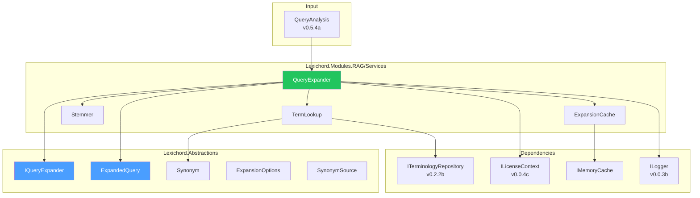
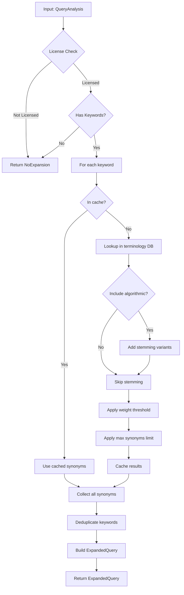

# LCS-DES-054b: Design Specification — Query Expansion

## 1. Metadata & Categorization

| Field                | Value                             |
| :------------------- | :-------------------------------- |
| **Document ID**      | LCS-DES-054b                      |
| **Feature ID**       | RAG-054b                          |
| **Feature Name**     | Query Expansion                   |
| **Parent Feature**   | v0.5.4 — The Relevance Tuner      |
| **Module Scope**     | Lexichord.Modules.RAG             |
| **Swimlane**         | Memory                            |
| **License Tier**     | Writer Pro                        |
| **Feature Gate Key** | `FeatureFlags.RAG.RelevanceTuner` |
| **Status**           | Draft                             |
| **Last Updated**     | 2026-01-27                        |

---

## 2. Executive Summary

### 2.1 Problem Statement

Users searching with domain-specific terminology often miss relevant content because:

- Documents may use different words for the same concept ("auth" vs "authentication")
- Abbreviations and full forms are treated as unrelated terms
- Technical jargon varies between authors and contexts
- Morphological variants are not recognized ("implement" vs "implementation")

### 2.2 Solution Overview

Implement `IQueryExpander` to enrich queries with synonyms and related terms:

- **Terminology database integration** for curated domain-specific synonyms
- **Algorithmic expansion** via stemming for morphological variants
- **Weighted synonyms** for ranked relevance (original terms weighted higher)
- **Configurable limits** to prevent over-expansion and query dilution
- **Caching layer** for frequently expanded terms

### 2.3 Key Deliverables

| Deliverable        | Description                            |
| :----------------- | :------------------------------------- |
| `IQueryExpander`   | Interface in Lexichord.Abstractions    |
| `QueryExpander`    | Implementation in Modules.RAG/Services |
| `ExpandedQuery`    | Result record with expansion map       |
| `Synonym`          | Synonym record with weight and source  |
| `ExpansionOptions` | Configuration record with presets      |
| `Stemmer`          | Algorithmic variant generator          |
| Expansion cache    | IMemoryCache integration               |
| Unit tests         | 90%+ coverage                          |

---

## 3. Architecture & Modular Strategy

### 3.1 Component Diagram



### 3.2 Module Location

```text
src/
├── Lexichord.Abstractions/
│   └── Contracts/
│       └── QueryExpansionModels.cs         ← Interfaces and records
│
└── Lexichord.Modules.RAG/
    └── Services/
        ├── QueryExpander.cs                ← Main implementation
        └── Expansion/
            ├── TermLookup.cs               ← Terminology database lookup
            ├── Stemmer.cs                  ← Algorithmic stemming
            └── ExpansionCache.cs           ← Caching layer
```

---

## 4. Data Contract (The API)

### 4.1 IQueryExpander Interface

```csharp
namespace Lexichord.Abstractions.Contracts;

/// <summary>
/// Expands queries with synonyms and related terms to improve search recall.
/// </summary>
/// <remarks>
/// <para>Query expansion is the second step in the search enhancement pipeline,
/// following query analysis (v0.5.4a).</para>
/// <para>Uses the terminology database from v0.2.2 for domain-specific synonyms.</para>
/// <para>This feature is gated behind Writer Pro license tier.</para>
/// </remarks>
public interface IQueryExpander
{
    /// <summary>
    /// Expands a query analysis with synonyms and related terms.
    /// </summary>
    /// <param name="analysis">The analyzed query to expand.</param>
    /// <param name="options">Expansion configuration. Uses defaults if null.</param>
    /// <param name="cancellationToken">Cancellation token.</param>
    /// <returns>Expanded query with original and additional terms.</returns>
    Task<ExpandedQuery> ExpandAsync(
        QueryAnalysis analysis,
        ExpansionOptions? options = null,
        CancellationToken cancellationToken = default);

    /// <summary>
    /// Gets synonyms for a single term (for preview/debugging).
    /// </summary>
    /// <param name="term">The term to look up.</param>
    /// <param name="cancellationToken">Cancellation token.</param>
    /// <returns>List of synonyms for the term.</returns>
    Task<IReadOnlyList<Synonym>> GetSynonymsAsync(
        string term,
        CancellationToken cancellationToken = default);
}
```

### 4.2 ExpandedQuery Record

```csharp
namespace Lexichord.Abstractions.Contracts;

/// <summary>
/// Query with expanded terms for broader search coverage.
/// </summary>
/// <param name="Original">The original query analysis.</param>
/// <param name="Expansions">Map of original term → expanded synonyms.</param>
/// <param name="ExpandedKeywords">All keywords including expansions (deduplicated).</param>
/// <param name="TotalTermCount">Total number of search terms after expansion.</param>
public record ExpandedQuery(
    QueryAnalysis Original,
    IReadOnlyDictionary<string, IReadOnlyList<Synonym>> Expansions,
    IReadOnlyList<string> ExpandedKeywords,
    int TotalTermCount)
{
    /// <summary>
    /// Creates a non-expanded query (pass-through for unlicensed users).
    /// </summary>
    public static ExpandedQuery NoExpansion(QueryAnalysis analysis) => new(
        Original: analysis,
        Expansions: new Dictionary<string, IReadOnlyList<Synonym>>(),
        ExpandedKeywords: analysis.Keywords,
        TotalTermCount: analysis.Keywords.Count);

    /// <summary>
    /// Whether any expansion occurred.
    /// </summary>
    public bool HasExpansions => Expansions.Count > 0;

    /// <summary>
    /// Number of synonyms added beyond original keywords.
    /// </summary>
    public int AddedTermCount => TotalTermCount - Original.Keywords.Count;

    /// <summary>
    /// Gets the weight for a specific term.
    /// Returns 1.0 for original terms, synonym weight for expanded terms.
    /// </summary>
    /// <param name="term">The term to get weight for.</param>
    /// <returns>Weight (0.0-1.0) or 0 if term not found.</returns>
    public float GetTermWeight(string term)
    {
        // Original keywords have full weight
        if (Original.Keywords.Contains(term, StringComparer.OrdinalIgnoreCase))
            return 1.0f;

        // Look up synonym weight
        foreach (var (_, synonyms) in Expansions)
        {
            var match = synonyms.FirstOrDefault(s =>
                s.Term.Equals(term, StringComparison.OrdinalIgnoreCase));
            if (match != null)
                return match.Weight;
        }

        return 0f;
    }

    /// <summary>
    /// Formats the expansion for display in UI.
    /// </summary>
    /// <param name="originalTerm">The original term that was expanded.</param>
    /// <returns>Formatted string like "auth → authentication, authorization".</returns>
    public string FormatExpansion(string originalTerm)
    {
        if (!Expansions.TryGetValue(originalTerm, out var synonyms) || synonyms.Count == 0)
            return string.Empty;

        var terms = string.Join(", ", synonyms.Select(s => s.Term));
        return $"{originalTerm} → {terms}";
    }

    /// <summary>
    /// Formats all expansions for display.
    /// </summary>
    /// <returns>Formatted string with all expansions.</returns>
    public string FormatAllExpansions()
    {
        if (!HasExpansions) return string.Empty;

        return string.Join(" | ", Expansions.Keys.Select(FormatExpansion));
    }
}
```

### 4.3 Synonym Record

```csharp
namespace Lexichord.Abstractions.Contracts;

/// <summary>
/// A synonym or related term with relevance weight.
/// </summary>
/// <param name="Term">The synonym text.</param>
/// <param name="Weight">Relevance weight (0.0-1.0). Lower = less related.</param>
/// <param name="Source">Source of the synonym.</param>
public record Synonym(string Term, float Weight, SynonymSource Source)
{
    /// <summary>
    /// Whether this is a high-confidence synonym (>= 0.8 weight).
    /// </summary>
    public bool IsHighConfidence => Weight >= 0.8f;

    /// <summary>
    /// Whether this is a low-confidence synonym (&lt; 0.5 weight).
    /// </summary>
    public bool IsLowConfidence => Weight < 0.5f;
}

/// <summary>
/// Source of a synonym.
/// </summary>
public enum SynonymSource
{
    /// <summary>
    /// From user-defined terminology database (v0.2.2).
    /// Highest quality, curated synonyms.
    /// </summary>
    TerminologyDatabase,

    /// <summary>
    /// Algorithmically derived (stemming, morphology).
    /// Examples: "authenticate" → "authenticating", "authentication"
    /// </summary>
    Algorithmic,

    /// <summary>
    /// Derived from usage patterns in indexed content.
    /// Co-occurring terms appearing in similar contexts.
    /// </summary>
    ContentDerived
}
```

### 4.4 ExpansionOptions Record

```csharp
namespace Lexichord.Abstractions.Contracts;

/// <summary>
/// Configuration for query expansion behavior.
/// </summary>
/// <param name="MaxSynonymsPerTerm">Maximum synonyms per keyword (default 3).</param>
/// <param name="MinSynonymWeight">Minimum weight for inclusion (default 0.3).</param>
/// <param name="IncludeAlgorithmic">Include stemming/morphological variants.</param>
/// <param name="IncludeContentDerived">Include co-occurrence derived terms.</param>
public record ExpansionOptions(
    int MaxSynonymsPerTerm = 3,
    float MinSynonymWeight = 0.3f,
    bool IncludeAlgorithmic = true,
    bool IncludeContentDerived = false)
{
    /// <summary>
    /// Default expansion options.
    /// </summary>
    public static ExpansionOptions Default { get; } = new();

    /// <summary>
    /// Conservative options for precision-focused search.
    /// Only high-confidence database synonyms.
    /// </summary>
    public static ExpansionOptions Conservative { get; } = new(
        MaxSynonymsPerTerm: 2,
        MinSynonymWeight: 0.8f,
        IncludeAlgorithmic: false);

    /// <summary>
    /// Aggressive options for recall-focused search.
    /// Includes all synonym types with lower thresholds.
    /// </summary>
    public static ExpansionOptions Aggressive { get; } = new(
        MaxSynonymsPerTerm: 5,
        MinSynonymWeight: 0.3f,
        IncludeAlgorithmic: true,
        IncludeContentDerived: true);
}
```

---

## 5. Implementation Logic

### 5.1 Expansion Pipeline



### 5.2 QueryExpander Implementation

```csharp
namespace Lexichord.Modules.RAG.Services;

/// <summary>
/// Expands queries with synonyms from terminology database and stemming.
/// </summary>
public class QueryExpander : IQueryExpander
{
    private readonly ITerminologyRepository _termRepository;
    private readonly ILicenseContext _licenseContext;
    private readonly IMemoryCache _cache;
    private readonly ILogger<QueryExpander> _logger;

    private static readonly TimeSpan CacheDuration = TimeSpan.FromMinutes(30);

    public QueryExpander(
        ITerminologyRepository termRepository,
        ILicenseContext licenseContext,
        IMemoryCache cache,
        ILogger<QueryExpander> logger)
    {
        _termRepository = termRepository ?? throw new ArgumentNullException(nameof(termRepository));
        _licenseContext = licenseContext ?? throw new ArgumentNullException(nameof(licenseContext));
        _cache = cache ?? throw new ArgumentNullException(nameof(cache));
        _logger = logger ?? throw new ArgumentNullException(nameof(logger));
    }

    /// <inheritdoc />
    public async Task<ExpandedQuery> ExpandAsync(
        QueryAnalysis analysis,
        ExpansionOptions? options = null,
        CancellationToken cancellationToken = default)
    {
        ArgumentNullException.ThrowIfNull(analysis);

        // License gate: Core tier gets no expansion
        if (!_licenseContext.HasFeature(FeatureFlags.RAG.RelevanceTuner))
        {
            _logger.LogDebug("Query expansion skipped - user not licensed for RelevanceTuner");
            return ExpandedQuery.NoExpansion(analysis);
        }

        if (!analysis.HasKeywords)
        {
            _logger.LogDebug("Query expansion skipped - no keywords to expand in query");
            return ExpandedQuery.NoExpansion(analysis);
        }

        options ??= ExpansionOptions.Default;
        _logger.LogDebug(
            "Expanding query with {KeywordCount} keywords (MaxPerTerm={Max}, MinWeight={Min})",
            analysis.Keywords.Count, options.MaxSynonymsPerTerm, options.MinSynonymWeight);

        var expansions = new Dictionary<string, IReadOnlyList<Synonym>>();
        var allKeywords = new List<string>(analysis.Keywords);

        foreach (var keyword in analysis.Keywords)
        {
            cancellationToken.ThrowIfCancellationRequested();

            var synonyms = await GetSynonymsWithCacheAsync(keyword, options, cancellationToken);

            if (synonyms.Count > 0)
            {
                expansions[keyword] = synonyms;
                allKeywords.AddRange(synonyms.Select(s => s.Term));

                _logger.LogDebug(
                    "Expanded '{Keyword}' to {SynonymCount} synonyms: [{Synonyms}]",
                    keyword,
                    synonyms.Count,
                    string.Join(", ", synonyms.Select(s => $"{s.Term}({s.Weight:F2})")));
            }
        }

        // Deduplicate while preserving order
        var deduplicatedKeywords = allKeywords
            .Distinct(StringComparer.OrdinalIgnoreCase)
            .ToList();

        var result = new ExpandedQuery(
            Original: analysis,
            Expansions: expansions,
            ExpandedKeywords: deduplicatedKeywords,
            TotalTermCount: deduplicatedKeywords.Count);

        _logger.LogInformation(
            "Query expansion complete: {OriginalCount} → {TotalCount} terms ({AddedCount} added from {ExpansionCount} keywords)",
            analysis.Keywords.Count,
            result.TotalTermCount,
            result.AddedTermCount,
            expansions.Count);

        return result;
    }

    /// <inheritdoc />
    public async Task<IReadOnlyList<Synonym>> GetSynonymsAsync(
        string term,
        CancellationToken cancellationToken = default)
    {
        if (string.IsNullOrWhiteSpace(term))
            return Array.Empty<Synonym>();

        return await GetSynonymsWithCacheAsync(term, ExpansionOptions.Default, cancellationToken);
    }

    private async Task<IReadOnlyList<Synonym>> GetSynonymsWithCacheAsync(
        string term,
        ExpansionOptions options,
        CancellationToken cancellationToken)
    {
        var normalizedTerm = term.ToLowerInvariant().Trim();
        var cacheKey = $"synonyms:{normalizedTerm}:{options.MaxSynonymsPerTerm}:{options.MinSynonymWeight}:{options.IncludeAlgorithmic}";

        if (_cache.TryGetValue<IReadOnlyList<Synonym>>(cacheKey, out var cached))
        {
            _logger.LogDebug("Synonym cache hit for '{Term}'", term);
            return cached!;
        }

        var synonyms = await BuildSynonymsAsync(normalizedTerm, options, cancellationToken);

        _cache.Set(cacheKey, synonyms, CacheDuration);
        _logger.LogDebug("Cached {Count} synonyms for '{Term}'", synonyms.Count, term);

        return synonyms;
    }

    private async Task<IReadOnlyList<Synonym>> BuildSynonymsAsync(
        string term,
        ExpansionOptions options,
        CancellationToken cancellationToken)
    {
        var synonyms = new List<Synonym>();

        // Step 1: Terminology database lookup (highest quality)
        var dbSynonyms = await _termRepository.GetSynonymsAsync(term, cancellationToken);
        foreach (var dbSynonym in dbSynonyms)
        {
            if (!dbSynonym.Name.Equals(term, StringComparison.OrdinalIgnoreCase))
            {
                synonyms.Add(new Synonym(
                    Term: dbSynonym.Name,
                    Weight: dbSynonym.Similarity,
                    Source: SynonymSource.TerminologyDatabase));
            }
        }

        // Step 2: Algorithmic expansion (stemming)
        if (options.IncludeAlgorithmic)
        {
            var stemmedVariants = Stemmer.GetVariants(term);
            foreach (var variant in stemmedVariants)
            {
                // Don't add if already in list or same as original
                if (!variant.Equals(term, StringComparison.OrdinalIgnoreCase) &&
                    !synonyms.Any(s => s.Term.Equals(variant, StringComparison.OrdinalIgnoreCase)))
                {
                    synonyms.Add(new Synonym(
                        Term: variant,
                        Weight: 0.7f,  // Lower weight for algorithmic
                        Source: SynonymSource.Algorithmic));
                }
            }
        }

        // Step 3: Apply filters and limits
        var filtered = synonyms
            .Where(s => s.Weight >= options.MinSynonymWeight)
            .OrderByDescending(s => s.Weight)
            .ThenBy(s => s.Source) // Prefer TerminologyDatabase over Algorithmic
            .Take(options.MaxSynonymsPerTerm)
            .ToList();

        return filtered;
    }
}
```

### 5.3 Stemmer Implementation

```csharp
namespace Lexichord.Modules.RAG.Services.Expansion;

/// <summary>
/// Simple stemmer for generating morphological word variants.
/// Based on simplified Porter stemmer rules.
/// </summary>
internal static class Stemmer
{
    private static readonly (string Suffix, string Replacement, int MinStemLen)[] SuffixRules =
    {
        ("ational", "ate", 3),
        ("tional", "tion", 3),
        ("ization", "ize", 3),
        ("ation", "ate", 3),
        ("ator", "ate", 3),
        ("iveness", "ive", 3),
        ("fulness", "ful", 3),
        ("ousness", "ous", 3),
        ("alism", "al", 3),
        ("ement", "", 4),
        ("ment", "", 4),
        ("ness", "", 3),
        ("ing", "", 3),
        ("ion", "", 4),
        ("ed", "", 3),
        ("er", "", 3),
        ("ly", "", 3),
        ("ity", "", 3),
        ("ies", "y", 2),
        ("es", "", 3),
        ("s", "", 3)
    };

    private static readonly string[] CommonInflectionSuffixes = { "s", "ed", "ing", "tion", "ation" };

    /// <summary>
    /// Gets morphological variants of a word.
    /// </summary>
    /// <param name="word">The word to generate variants for.</param>
    /// <returns>List of variants (excluding original).</returns>
    public static IReadOnlyList<string> GetVariants(string word)
    {
        if (string.IsNullOrWhiteSpace(word) || word.Length < 4)
            return Array.Empty<string>();

        var variants = new HashSet<string>(StringComparer.OrdinalIgnoreCase);
        var lowerWord = word.ToLowerInvariant();

        // Generate stem
        var stem = GetStem(lowerWord);
        if (!string.IsNullOrEmpty(stem) && stem.Length >= 3 && !stem.Equals(lowerWord))
        {
            variants.Add(stem);
        }

        // Generate common inflections from stem
        var baseStem = stem.Length >= 3 ? stem : lowerWord;
        foreach (var suffix in CommonInflectionSuffixes)
        {
            var inflected = baseStem + suffix;
            if (!inflected.Equals(lowerWord, StringComparison.OrdinalIgnoreCase))
            {
                variants.Add(inflected);
            }
        }

        // Remove the original word if accidentally included
        variants.Remove(word);
        variants.Remove(lowerWord);

        // Return limited set to avoid over-expansion
        return variants.Take(4).ToList();
    }

    /// <summary>
    /// Gets the stem of a word by removing common suffixes.
    /// </summary>
    private static string GetStem(string word)
    {
        foreach (var (suffix, replacement, minStemLen) in SuffixRules)
        {
            if (word.EndsWith(suffix, StringComparison.OrdinalIgnoreCase))
            {
                var stem = word[..^suffix.Length] + replacement;
                if (stem.Length >= minStemLen)
                {
                    return stem;
                }
            }
        }
        return word;
    }
}
```

---

## 6. Data Persistence

This sub-part uses the terminology database from v0.2.2b for synonym lookup. No new persistence is introduced.

### 6.1 Terminology Database Schema (Reference from v0.2.2b)

```sql
CREATE TABLE style_terms (
    id UUID PRIMARY KEY,
    name TEXT NOT NULL,
    definition TEXT,
    category TEXT,
    synonyms TEXT[],          -- Array of synonym strings
    similarity REAL DEFAULT 1.0,  -- Similarity score 0.0-1.0
    created_at TIMESTAMPTZ NOT NULL DEFAULT NOW()
);

CREATE INDEX idx_style_terms_name ON style_terms (LOWER(name));
CREATE INDEX idx_style_terms_synonyms ON style_terms USING GIN (synonyms);
```

### 6.2 ITerminologyRepository Extension

```csharp
// Extension method needed for v0.5.4b
public interface ITerminologyRepository
{
    // Existing methods...

    /// <summary>
    /// Gets synonyms for a term from the terminology database.
    /// </summary>
    /// <param name="term">The term to look up.</param>
    /// <param name="cancellationToken">Cancellation token.</param>
    /// <returns>List of synonyms with similarity scores.</returns>
    Task<IReadOnlyList<TermSynonym>> GetSynonymsAsync(
        string term,
        CancellationToken cancellationToken = default);
}

public record TermSynonym(string Name, float Similarity);
```

---

## 7. UI/UX Specifications

### 7.1 Expansion Indicator in Search Results

```text
┌─────────────────────────────────────────────────────────────────────────────────────┐
│  Search Results for: api auth                                                       │
│  ┌──────────────────────────────────────────────────────────────────────────────┐   │
│  │  📊 Query expanded:                                                          │   │
│  │     • auth → authentication (0.95), authorization (0.85), login (0.70)       │   │
│  │                                                                              │   │
│  │  [✓ Use expanded query]  [Show original only]                                │   │
│  └──────────────────────────────────────────────────────────────────────────────┘   │
│                                                                                     │
│  15 results found                                                                   │
│  ├─ 10 matched original terms                                                      │
│  └─ 5 matched expanded terms (highlighted below)                                   │
└─────────────────────────────────────────────────────────────────────────────────────┘
```

### 7.2 Search Options Panel

```text
┌──────────────────────────────────────────────────────────────────┐
│  🔧 Search Options                                               │
│  ┌────────────────────────────────────────────────────────────┐  │
│  │  Query Expansion                                           │  │
│  │  ┌──────────────────────────────────────────────────────┐  │  │
│  │  │  ☑ Expand with synonyms                              │  │  │
│  │  │  ☐ Include stemming variants                         │  │  │
│  │  │                                                      │  │  │
│  │  │  Expansion Mode:                                     │  │  │
│  │  │  ○ Conservative (high-quality only)                  │  │  │
│  │  │  ● Balanced (default)                                │  │  │
│  │  │  ○ Aggressive (maximum recall)                       │  │  │
│  │  └──────────────────────────────────────────────────────┘  │  │
│  └────────────────────────────────────────────────────────────┘  │
└──────────────────────────────────────────────────────────────────┘
```

### 7.3 Result Item Highlighting

Results from expanded terms are shown with visual differentiation:

```text
┌─────────────────────────────────────────────────────────────────────────────────────┐
│  📄 auth-guide.md                                                      Score: 0.92 │
│  ┌──────────────────────────────────────────────────────────────────────────────┐   │
│  │  "...configure [authentication] using OAuth 2.0. The [authorization]        │   │
│  │  server validates tokens and grants access to protected resources..."        │   │
│  │                                                                              │   │
│  │  💡 Matched via expansion: authentication, authorization                     │   │
│  └──────────────────────────────────────────────────────────────────────────────┘   │
└─────────────────────────────────────────────────────────────────────────────────────┘
```

---

## 8. Observability & Logging

### 8.1 Log Events

| Level | Event                       | Template                                                                                                               |
| :---- | :-------------------------- | :--------------------------------------------------------------------------------------------------------------------- |
| Debug | Expansion skipped (license) | `"Query expansion skipped - user not licensed for RelevanceTuner"`                                                     |
| Debug | Expansion skipped (empty)   | `"Query expansion skipped - no keywords to expand in query"`                                                           |
| Debug | Expansion started           | `"Expanding query with {KeywordCount} keywords (MaxPerTerm={Max}, MinWeight={Min})"`                                   |
| Debug | Single term expanded        | `"Expanded '{Keyword}' to {SynonymCount} synonyms: [{Synonyms}]"`                                                      |
| Debug | Cache hit                   | `"Synonym cache hit for '{Term}'"`                                                                                     |
| Debug | Cache stored                | `"Cached {Count} synonyms for '{Term}'"`                                                                               |
| Info  | Expansion complete          | `"Query expansion complete: {OriginalCount} → {TotalCount} terms ({AddedCount} added from {ExpansionCount} keywords)"` |

### 8.2 Metrics (Future)

| Metric                     | Type      | Labels                     |
| :------------------------- | :-------- | :------------------------- |
| `query_expansion_count`    | Counter   | `source` (db, algorithmic) |
| `synonyms_per_term`        | Histogram | `source`                   |
| `expansion_cache_hit_rate` | Gauge     |                            |
| `expansion_duration_ms`    | Histogram |                            |

---

## 9. Security & Safety

### 9.1 License Enforcement

```csharp
if (!_licenseContext.HasFeature(FeatureFlags.RAG.RelevanceTuner))
{
    _logger.LogDebug("Query expansion skipped - user not licensed");
    return ExpandedQuery.NoExpansion(analysis);
}
```

### 9.2 Resource Protection

- MaxSynonymsPerTerm prevents unbounded expansion
- Cache prevents repeated database lookups
- CancellationToken respected throughout
- No user input directly in SQL (parameterized queries)

### 9.3 Performance Considerations

- Target: < 50ms for expansion operation
- Cache duration: 30 minutes
- Terminology DB has indexed lookups
- Stemmer is pure CPU (no I/O)

---

## 10. Acceptance Criteria

| #   | Category        | Criterion                                              | Verification     |
| :-- | :-------------- | :----------------------------------------------------- | :--------------- |
| 1   | **Functional**  | Keywords expanded with terminology database synonyms   | Unit test        |
| 2   | **Functional**  | Algorithmic stemming generates valid variants          | Unit test        |
| 3   | **Functional**  | MinSynonymWeight threshold is respected                | Unit test        |
| 4   | **Functional**  | MaxSynonymsPerTerm limit is enforced                   | Unit test        |
| 5   | **Functional**  | Synonyms are weighted (original = 1.0, synonyms < 1.0) | Unit test        |
| 6   | **Functional**  | GetTermWeight returns correct values                   | Unit test        |
| 7   | **Functional**  | FormatExpansion produces readable output               | Unit test        |
| 8   | **License**     | License gating prevents expansion for Core tier        | Integration test |
| 9   | **Performance** | Expansion completes in < 50ms                          | Performance test |
| 10  | **Caching**     | Repeated lookups use cache                             | Unit test        |
| 11  | **Display**     | Expansion indicator shows in search UI                 | Manual test      |

---

## 11. Unit Testing Requirements

### 11.1 Test Scenarios

```csharp
[Trait("Category", "Unit")]
[Trait("Feature", "v0.5.4b")]
public class QueryExpanderTests
{
    private readonly Mock<ITerminologyRepository> _termRepoMock;
    private readonly Mock<ILicenseContext> _licenseMock;
    private readonly Mock<IMemoryCache> _cacheMock;
    private readonly IQueryExpander _sut;

    [Fact]
    public async Task ExpandAsync_WhenLicensed_ExpandsWithSynonyms()
    {
        // Arrange
        SetupLicensed();
        _termRepoMock.Setup(r => r.GetSynonymsAsync("auth", It.IsAny<CancellationToken>()))
            .ReturnsAsync(new List<TermSynonym>
            {
                new("authentication", 0.95f),
                new("authorization", 0.85f)
            });

        var analysis = CreateAnalysis(keywords: new[] { "api", "auth" });

        // Act
        var result = await _sut.ExpandAsync(analysis);

        // Assert
        result.HasExpansions.Should().BeTrue();
        result.ExpandedKeywords.Should().Contain("authentication");
        result.ExpandedKeywords.Should().Contain("authorization");
        result.AddedTermCount.Should().Be(2);
    }

    [Fact]
    public async Task ExpandAsync_WhenNotLicensed_ReturnsNoExpansion()
    {
        // Arrange
        _licenseMock.Setup(l => l.HasFeature(It.IsAny<string>())).Returns(false);
        var analysis = CreateAnalysis(keywords: new[] { "api", "auth" });

        // Act
        var result = await _sut.ExpandAsync(analysis);

        // Assert
        result.HasExpansions.Should().BeFalse();
        result.ExpandedKeywords.Should().BeEquivalentTo(analysis.Keywords);
    }

    [Fact]
    public async Task ExpandAsync_RespectsMaxSynonymsPerTerm()
    {
        // Arrange
        SetupLicensed();
        _termRepoMock.Setup(r => r.GetSynonymsAsync("auth", It.IsAny<CancellationToken>()))
            .ReturnsAsync(Enumerable.Range(1, 10)
                .Select(i => new TermSynonym($"synonym{i}", 0.9f - (i * 0.05f)))
                .ToList());

        var analysis = CreateAnalysis(keywords: new[] { "auth" });
        var options = new ExpansionOptions(MaxSynonymsPerTerm: 2);

        // Act
        var result = await _sut.ExpandAsync(analysis, options);

        // Assert
        result.Expansions["auth"].Should().HaveCount(2);
    }

    [Fact]
    public async Task ExpandAsync_RespectsMinSynonymWeight()
    {
        // Arrange
        SetupLicensed();
        _termRepoMock.Setup(r => r.GetSynonymsAsync("auth", It.IsAny<CancellationToken>()))
            .ReturnsAsync(new List<TermSynonym>
            {
                new("authentication", 0.95f),
                new("login", 0.4f),
                new("password", 0.2f)  // Below threshold
            });

        var analysis = CreateAnalysis(keywords: new[] { "auth" });
        var options = new ExpansionOptions(MinSynonymWeight: 0.3f);

        // Act
        var result = await _sut.ExpandAsync(analysis, options);

        // Assert
        result.Expansions["auth"].Should().NotContain(s => s.Term == "password");
        result.Expansions["auth"].Should().Contain(s => s.Term == "login");
    }

    [Theory]
    [InlineData("authenticate", true, new[] { "authentication", "authenticating" })]
    [InlineData("authenticate", false, new string[0])]
    public async Task ExpandAsync_AlgorithmicExpansion_RespectsOption(
        string keyword, bool includeAlgorithmic, string[] expectedVariants)
    {
        // Arrange
        SetupLicensed();
        _termRepoMock.Setup(r => r.GetSynonymsAsync(It.IsAny<string>(), It.IsAny<CancellationToken>()))
            .ReturnsAsync(new List<TermSynonym>());

        var analysis = CreateAnalysis(keywords: new[] { keyword });
        var options = new ExpansionOptions(IncludeAlgorithmic: includeAlgorithmic);

        // Act
        var result = await _sut.ExpandAsync(analysis, options);

        // Assert
        if (includeAlgorithmic && expectedVariants.Length > 0)
        {
            result.HasExpansions.Should().BeTrue();
        }
    }

    [Fact]
    public void GetTermWeight_ReturnsCorrectWeights()
    {
        // Arrange
        var analysis = CreateAnalysis(keywords: new[] { "auth" });
        var expansions = new Dictionary<string, IReadOnlyList<Synonym>>
        {
            ["auth"] = new List<Synonym>
            {
                new("authentication", 0.95f, SynonymSource.TerminologyDatabase)
            }
        };
        var expanded = new ExpandedQuery(analysis, expansions,
            new[] { "auth", "authentication" }, 2);

        // Assert
        expanded.GetTermWeight("auth").Should().Be(1.0f);              // Original
        expanded.GetTermWeight("authentication").Should().Be(0.95f);   // Synonym
        expanded.GetTermWeight("unknown").Should().Be(0f);             // Not found
    }

    [Fact]
    public void FormatExpansion_ReturnsFormattedString()
    {
        // Arrange
        var analysis = CreateAnalysis(keywords: new[] { "auth" });
        var expansions = new Dictionary<string, IReadOnlyList<Synonym>>
        {
            ["auth"] = new List<Synonym>
            {
                new("authentication", 0.95f, SynonymSource.TerminologyDatabase),
                new("authorization", 0.85f, SynonymSource.TerminologyDatabase)
            }
        };
        var expanded = new ExpandedQuery(analysis, expansions,
            new[] { "auth", "authentication", "authorization" }, 3);

        // Assert
        expanded.FormatExpansion("auth").Should().Be("auth → authentication, authorization");
    }

    private void SetupLicensed() =>
        _licenseMock.Setup(l => l.HasFeature(It.IsAny<string>())).Returns(true);

    private static QueryAnalysis CreateAnalysis(string[] keywords) =>
        new(
            OriginalQuery: string.Join(" ", keywords),
            NormalizedQuery: string.Join(" ", keywords).ToLower(),
            Keywords: keywords,
            Entities: Array.Empty<QueryEntity>(),
            Intent: QueryIntent.Factual,
            Specificity: 0.5f);
}
```

---

## 12. Code Examples

### 12.1 Integration with Search Pipeline

```csharp
public class SearchOrchestrator
{
    private readonly IQueryAnalyzer _analyzer;
    private readonly IQueryExpander _expander;
    private readonly IHybridSearchService _searchService;
    private readonly ILicenseContext _licenseContext;

    public async Task<SearchResults> SearchAsync(string query, CancellationToken ct)
    {
        // Step 1: Analyze
        var analysis = _analyzer.Analyze(query);

        // Step 2: Expand (license checked internally)
        var expanded = await _expander.ExpandAsync(analysis, cancellationToken: ct);

        // Step 3: Search with expanded keywords
        var hits = await _searchService.SearchAsync(
            keywords: expanded.ExpandedKeywords,
            topK: 20,
            cancellationToken: ct);

        // Step 4: Apply term weights to boost original term matches
        var rankedHits = hits
            .Select(hit => new RankedHit(
                Original: hit,
                AdjustedScore: hit.Score * CalculateTermBoost(hit, expanded)))
            .OrderByDescending(h => h.AdjustedScore)
            .ToList();

        return new SearchResults(analysis, expanded, rankedHits);
    }

    private float CalculateTermBoost(SearchHit hit, ExpandedQuery expanded)
    {
        // Boost results that match original terms over expansion terms
        var matchedTerms = hit.MatchedTerms;
        if (matchedTerms.Count == 0) return 1.0f;

        var weights = matchedTerms.Select(t => expanded.GetTermWeight(t));
        return weights.Average();
    }
}
```

---

## 13. Deliverable Checklist

| #   | Deliverable                                  | Status |
| :-- | :------------------------------------------- | :----- |
| 1   | `IQueryExpander` interface in Abstractions   | [ ]    |
| 2   | `ExpandedQuery` record with helper methods   | [ ]    |
| 3   | `Synonym` record with weight and source      | [ ]    |
| 4   | `SynonymSource` enum                         | [ ]    |
| 5   | `ExpansionOptions` record with presets       | [ ]    |
| 6   | `QueryExpander` implementation               | [ ]    |
| 7   | `Stemmer` for algorithmic variants           | [ ]    |
| 8   | Expansion cache with IMemoryCache            | [ ]    |
| 9   | `ITerminologyRepository.GetSynonymsAsync` extension | [ ]    |
| 10  | DI registration in RAGModule.cs              | [ ]    |
| 11  | Unit tests with 90%+ coverage                | [ ]    |
| 12  | Search result UI with expansion indicator    | [ ]    |

---

## Document History

| Version | Date       | Author         | Changes       |
| :------ | :--------- | :------------- | :------------ |
| 1.0     | 2026-01-27 | Lead Architect | Initial draft |
