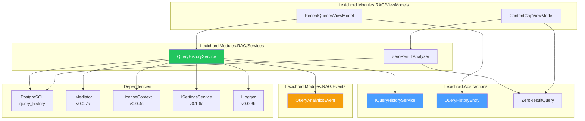
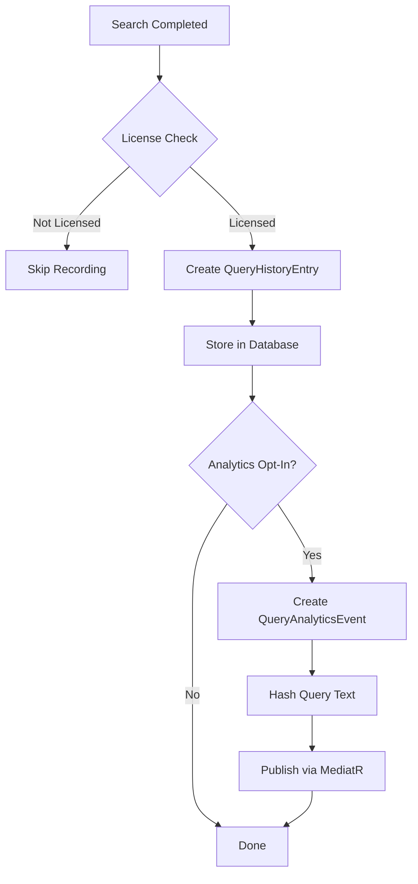

# LCS-DES-054d: Design Specification — Query History & Analytics

## 1. Metadata & Categorization

| Field                | Value                             |
| :------------------- | :-------------------------------- |
| **Document ID**      | LCS-DES-054d                      |
| **Feature ID**       | RAG-054d                          |
| **Feature Name**     | Query History & Analytics         |
| **Parent Feature**   | v0.5.4 — The Relevance Tuner      |
| **Module Scope**     | Lexichord.Modules.RAG             |
| **Swimlane**         | Memory                            |
| **License Tier**     | Writer Pro                        |
| **Feature Gate Key** | `FeatureFlags.RAG.RelevanceTuner` |
| **Status**           | Draft                             |
| **Last Updated**     | 2026-01-27                        |

---

## 2. Executive Summary

### 2.1 Problem Statement

Without tracking search patterns, users and content authors face several challenges:

- No quick access to previously executed queries
- Content gaps remain invisible (nobody knows what users can't find)
- No data for improving search relevance over time
- Repeated typing of similar queries across sessions

### 2.2 Solution Overview

Implement comprehensive query history tracking to:

- **Record all executed queries** with timing, results, and intent
- **Identify zero-result queries** for content gap analysis
- **Provide recent queries** for quick re-access
- **Publish analytics events** (opt-in) for aggregate telemetry
- **Surface content gaps** to guide documentation improvements

### 2.3 Key Deliverables

| Deliverable            | Description                             |
| :--------------------- | :-------------------------------------- |
| `IQueryHistoryService` | Interface in Lexichord.Abstractions     |
| `QueryHistoryService`  | Implementation with local storage       |
| `query_history` table  | Database table for history              |
| `QueryAnalyticsEvent`  | MediatR notification (opt-in telemetry) |
| `ZeroResultQuery`      | Record for content gap tracking         |
| Recent queries UI      | Quick-access panel in search            |
| Content gap report     | Analytics view for authors              |
| Unit tests             | 85%+ coverage                           |

---

## 3. Architecture & Modular Strategy

### 3.1 Component Diagram



### 3.2 Module Location

```text
src/
├── Lexichord.Abstractions/
│   └── Contracts/
│       └── QueryHistoryModels.cs            ← Interface and records
│
└── Lexichord.Modules.RAG/
    ├── Services/
    │   ├── QueryHistoryService.cs           ← Main implementation
    │   └── Analytics/
    │       └── ZeroResultAnalyzer.cs        ← Content gap analysis
    │
    ├── Events/
    │   └── QueryAnalyticsEvent.cs           ← MediatR notification
    │
    ├── ViewModels/
    │   ├── RecentQueriesViewModel.cs        ← Recent queries panel
    │   └── ContentGapViewModel.cs           ← Content gap report
    │
    └── Migrations/
        └── Migration_006_QueryHistory.cs    ← Database migration
```

---

## 4. Data Contract (The API)

### 4.1 IQueryHistoryService Interface

```csharp
namespace Lexichord.Abstractions.Contracts;

/// <summary>
/// Tracks search query history for analytics and quick re-access.
/// </summary>
/// <remarks>
/// <para>All history is stored locally. No query text is sent externally.</para>
/// <para>Analytics events use hashed query text for anonymization.</para>
/// <para>This feature is gated behind Writer Pro license tier.</para>
/// </remarks>
public interface IQueryHistoryService
{
    /// <summary>
    /// Records an executed query with its results.
    /// </summary>
    /// <param name="entry">The query entry to record.</param>
    /// <param name="cancellationToken">Cancellation token.</param>
    Task RecordAsync(
        QueryHistoryEntry entry,
        CancellationToken cancellationToken = default);

    /// <summary>
    /// Gets recently executed queries for quick re-access.
    /// </summary>
    /// <param name="limit">Maximum entries to return (default 10).</param>
    /// <param name="cancellationToken">Cancellation token.</param>
    /// <returns>Recent queries, most recent first.</returns>
    Task<IReadOnlyList<QueryHistoryEntry>> GetRecentAsync(
        int limit = 10,
        CancellationToken cancellationToken = default);

    /// <summary>
    /// Gets queries that returned zero results (content gaps).
    /// </summary>
    /// <param name="since">Only include queries since this date.</param>
    /// <param name="cancellationToken">Cancellation token.</param>
    /// <returns>Zero-result queries with occurrence counts.</returns>
    Task<IReadOnlyList<ZeroResultQuery>> GetZeroResultQueriesAsync(
        DateTime since,
        CancellationToken cancellationToken = default);

    /// <summary>
    /// Gets search statistics for the specified period.
    /// </summary>
    /// <param name="since">Start of the period.</param>
    /// <param name="until">End of the period (default: now).</param>
    /// <param name="cancellationToken">Cancellation token.</param>
    /// <returns>Aggregate search statistics.</returns>
    Task<SearchStatistics> GetStatisticsAsync(
        DateTime since,
        DateTime? until = null,
        CancellationToken cancellationToken = default);

    /// <summary>
    /// Clears query history.
    /// </summary>
    /// <param name="olderThan">If specified, only clear entries older than this.</param>
    /// <param name="cancellationToken">Cancellation token.</param>
    Task ClearAsync(
        DateTime? olderThan = null,
        CancellationToken cancellationToken = default);
}
```

### 4.2 QueryHistoryEntry Record

```csharp
namespace Lexichord.Abstractions.Contracts;

/// <summary>
/// A recorded search query with metadata.
/// </summary>
/// <param name="Id">Unique identifier for this entry.</param>
/// <param name="Query">The original query text.</param>
/// <param name="Intent">Detected query intent from v0.5.4a.</param>
/// <param name="ResultCount">Number of results returned.</param>
/// <param name="TopResultScore">Score of the top result (null if no results).</param>
/// <param name="ExecutedAt">When the query was executed.</param>
/// <param name="DurationMs">Query execution time in milliseconds.</param>
public record QueryHistoryEntry(
    Guid Id,
    string Query,
    QueryIntent Intent,
    int ResultCount,
    float? TopResultScore,
    DateTime ExecutedAt,
    long DurationMs)
{
    /// <summary>
    /// Whether this query returned no results.
    /// </summary>
    public bool IsZeroResult => ResultCount == 0;

    /// <summary>
    /// Whether this was a fast query (&lt; 100ms).
    /// </summary>
    public bool IsFast => DurationMs < 100;

    /// <summary>
    /// Creates a new entry for the current time.
    /// </summary>
    public static QueryHistoryEntry Create(
        string query,
        QueryIntent intent,
        int resultCount,
        float? topResultScore,
        long durationMs) => new(
            Id: Guid.NewGuid(),
            Query: query,
            Intent: intent,
            ResultCount: resultCount,
            TopResultScore: topResultScore,
            ExecutedAt: DateTime.UtcNow,
            DurationMs: durationMs);

    /// <summary>
    /// Human-readable relative time.
    /// </summary>
    public string RelativeTime => ExecutedAt.ToRelativeTimeString();

    /// <summary>
    /// Formatted result count.
    /// </summary>
    public string FormattedResults => ResultCount switch
    {
        0 => "0 results ⚠️",
        1 => "1 result",
        _ => $"{ResultCount} results"
    };
}
```

### 4.3 ZeroResultQuery Record

```csharp
namespace Lexichord.Abstractions.Contracts;

/// <summary>
/// A query that returned no results, representing a content gap.
/// </summary>
/// <param name="Query">The query text that returned no results.</param>
/// <param name="OccurrenceCount">Number of times this query was executed.</param>
/// <param name="LastSearchedAt">When this query was last executed.</param>
/// <param name="SuggestedContent">Optional suggestion for content to create.</param>
public record ZeroResultQuery(
    string Query,
    int OccurrenceCount,
    DateTime LastSearchedAt,
    string? SuggestedContent)
{
    /// <summary>
    /// Whether this is a high-priority gap (searched 3+ times).
    /// </summary>
    public bool IsHighPriority => OccurrenceCount >= 3;

    /// <summary>
    /// Human-readable relative time.
    /// </summary>
    public string RelativeTime => LastSearchedAt.ToRelativeTimeString();

    /// <summary>
    /// Priority indicator for display.
    /// </summary>
    public string PriorityIndicator => OccurrenceCount switch
    {
        >= 10 => "🔴",  // Critical
        >= 5 => "🟠",   // High
        >= 3 => "🟡",   // Medium
        _ => "⚪"       // Low
    };
}
```

### 4.4 SearchStatistics Record

```csharp
namespace Lexichord.Abstractions.Contracts;

/// <summary>
/// Aggregate search statistics for a time period.
/// </summary>
/// <param name="TotalQueries">Total number of queries executed.</param>
/// <param name="UniqueQueries">Number of unique query strings.</param>
/// <param name="ZeroResultCount">Number of queries with no results.</param>
/// <param name="AverageResultCount">Average results per query.</param>
/// <param name="AverageDurationMs">Average query duration.</param>
/// <param name="IntentDistribution">Count of queries by intent.</param>
public record SearchStatistics(
    int TotalQueries,
    int UniqueQueries,
    int ZeroResultCount,
    float AverageResultCount,
    float AverageDurationMs,
    IReadOnlyDictionary<QueryIntent, int> IntentDistribution)
{
    /// <summary>
    /// Percentage of queries that returned no results.
    /// </summary>
    public float ZeroResultPercentage => TotalQueries > 0
        ? (float)ZeroResultCount / TotalQueries * 100
        : 0f;

    /// <summary>
    /// Most common intent type.
    /// </summary>
    public QueryIntent? MostCommonIntent => IntentDistribution.Count > 0
        ? IntentDistribution.MaxBy(kvp => kvp.Value).Key
        : null;
}
```

### 4.5 QueryAnalyticsEvent (MediatR Notification)

```csharp
namespace Lexichord.Modules.RAG.Events;

/// <summary>
/// MediatR notification for opt-in query telemetry.
/// Published after each search when analytics is enabled.
/// </summary>
/// <remarks>
/// <para>Query text is SHA256 hashed for privacy.</para>
/// <para>Only published if user has opted in via settings.</para>
/// </remarks>
public record QueryAnalyticsEvent(
    string QueryHash,       // SHA256 of query text
    QueryIntent Intent,
    int ResultCount,
    long DurationMs,
    DateTime Timestamp) : INotification
{
    /// <summary>
    /// Creates an analytics event with hashed query.
    /// </summary>
    public static QueryAnalyticsEvent Create(
        string query,
        QueryIntent intent,
        int resultCount,
        long durationMs)
    {
        using var sha256 = SHA256.Create();
        var bytes = Encoding.UTF8.GetBytes(query.ToLowerInvariant().Trim());
        var hash = Convert.ToHexString(sha256.ComputeHash(bytes));

        return new QueryAnalyticsEvent(
            QueryHash: hash,
            Intent: intent,
            ResultCount: resultCount,
            DurationMs: durationMs,
            Timestamp: DateTime.UtcNow);
    }

    /// <summary>
    /// Whether this was a zero-result query.
    /// </summary>
    public bool IsZeroResult => ResultCount == 0;
}
```

---

## 5. Database Schema

### 5.1 query_history Table

```sql
-- Migration_006_QueryHistory.sql

CREATE TABLE query_history (
    id UUID PRIMARY KEY DEFAULT gen_random_uuid(),
    query TEXT NOT NULL,
    query_hash TEXT NOT NULL,               -- SHA256 for deduplication
    intent TEXT NOT NULL,                   -- QueryIntent enum value
    result_count INT NOT NULL,
    top_result_score REAL,                  -- NULL if no results
    executed_at TIMESTAMPTZ NOT NULL DEFAULT NOW(),
    duration_ms BIGINT NOT NULL,
    created_at TIMESTAMPTZ NOT NULL DEFAULT NOW()
);

-- Index for recent queries (most common access pattern)
CREATE INDEX idx_query_history_executed_at
    ON query_history (executed_at DESC);

-- Index for zero-result query analysis
CREATE INDEX idx_query_history_zero_results
    ON query_history (result_count, executed_at DESC)
    WHERE result_count = 0;

-- Index for query deduplication and counting
CREATE INDEX idx_query_history_hash
    ON query_history (query_hash);

-- Index for intent-based analytics
CREATE INDEX idx_query_history_intent
    ON query_history (intent, executed_at DESC);

COMMENT ON TABLE query_history IS
    'Stores search query history for analytics and quick re-access (v0.5.4d)';
```

### 5.2 Entity Mapping

```csharp
namespace Lexichord.Modules.RAG.Data.Entities;

public class QueryHistoryEntity
{
    public Guid Id { get; set; }
    public string Query { get; set; } = string.Empty;
    public string QueryHash { get; set; } = string.Empty;
    public string Intent { get; set; } = string.Empty;
    public int ResultCount { get; set; }
    public float? TopResultScore { get; set; }
    public DateTime ExecutedAt { get; set; }
    public long DurationMs { get; set; }
    public DateTime CreatedAt { get; set; }
}
```

---

## 6. Implementation Logic

### 6.1 Query Recording Pipeline



### 6.2 QueryHistoryService Implementation

```csharp
namespace Lexichord.Modules.RAG.Services;

/// <summary>
/// Tracks query history for analytics and quick re-access.
/// </summary>
public class QueryHistoryService : IQueryHistoryService
{
    private readonly IDbConnection _connection;
    private readonly IMediator _mediator;
    private readonly ILicenseContext _licenseContext;
    private readonly ISettingsService _settingsService;
    private readonly ILogger<QueryHistoryService> _logger;

    private const int MaxHistoryEntries = 1000;  // Prevent unbounded growth
    private const int MaxQueryLength = 500;      // Truncate very long queries

    public QueryHistoryService(
        IDbConnection connection,
        IMediator mediator,
        ILicenseContext licenseContext,
        ISettingsService settingsService,
        ILogger<QueryHistoryService> logger)
    {
        _connection = connection;
        _mediator = mediator;
        _licenseContext = licenseContext;
        _settingsService = settingsService;
        _logger = logger;
    }

    /// <inheritdoc />
    public async Task RecordAsync(
        QueryHistoryEntry entry,
        CancellationToken cancellationToken = default)
    {
        ArgumentNullException.ThrowIfNull(entry);

        // License gate
        if (!_licenseContext.HasFeature(FeatureFlags.RAG.RelevanceTuner))
        {
            _logger.LogDebug("Query history disabled - user not licensed");
            return;
        }

        // Sanitize query
        var sanitizedQuery = entry.Query.Length > MaxQueryLength
            ? entry.Query[..MaxQueryLength]
            : entry.Query;

        var queryHash = ComputeHash(sanitizedQuery);

        _logger.LogDebug(
            "Recording query: '{Query}' with {ResultCount} results in {DurationMs}ms",
            sanitizedQuery, entry.ResultCount, entry.DurationMs);

        const string sql = @"
            INSERT INTO query_history
                (id, query, query_hash, intent, result_count, top_result_score, executed_at, duration_ms)
            VALUES
                (@Id, @Query, @QueryHash, @Intent, @ResultCount, @TopResultScore, @ExecutedAt, @DurationMs)";

        await _connection.ExecuteAsync(sql, new
        {
            entry.Id,
            Query = sanitizedQuery,
            QueryHash = queryHash,
            Intent = entry.Intent.ToString(),
            entry.ResultCount,
            entry.TopResultScore,
            entry.ExecutedAt,
            entry.DurationMs
        });

        if (entry.IsZeroResult)
        {
            _logger.LogInformation("Zero-result query recorded: '{Query}'", sanitizedQuery);
        }

        // Publish analytics event if opted in
        await PublishAnalyticsEventIfEnabledAsync(entry, cancellationToken);

        // Cleanup old entries periodically
        await CleanupOldEntriesAsync(cancellationToken);
    }

    /// <inheritdoc />
    public async Task<IReadOnlyList<QueryHistoryEntry>> GetRecentAsync(
        int limit = 10,
        CancellationToken cancellationToken = default)
    {
        if (!_licenseContext.HasFeature(FeatureFlags.RAG.RelevanceTuner))
        {
            return Array.Empty<QueryHistoryEntry>();
        }

        const string sql = @"
            SELECT DISTINCT ON (query_hash)
                id, query, intent, result_count, top_result_score, executed_at, duration_ms
            FROM query_history
            ORDER BY query_hash, executed_at DESC
            LIMIT @Limit";

        var results = await _connection.QueryAsync<QueryHistoryEntity>(sql, new { Limit = limit });

        return results
            .OrderByDescending(e => e.ExecutedAt)
            .Select(e => new QueryHistoryEntry(
                Id: e.Id,
                Query: e.Query,
                Intent: Enum.Parse<QueryIntent>(e.Intent),
                ResultCount: e.ResultCount,
                TopResultScore: e.TopResultScore,
                ExecutedAt: e.ExecutedAt,
                DurationMs: e.DurationMs))
            .ToList();
    }

    /// <inheritdoc />
    public async Task<IReadOnlyList<ZeroResultQuery>> GetZeroResultQueriesAsync(
        DateTime since,
        CancellationToken cancellationToken = default)
    {
        if (!_licenseContext.HasFeature(FeatureFlags.RAG.RelevanceTuner))
        {
            return Array.Empty<ZeroResultQuery>();
        }

        const string sql = @"
            SELECT
                query,
                COUNT(*) as occurrence_count,
                MAX(executed_at) as last_searched_at
            FROM query_history
            WHERE result_count = 0 AND executed_at >= @Since
            GROUP BY query_hash, query
            ORDER BY occurrence_count DESC, last_searched_at DESC
            LIMIT 50";

        var results = await _connection.QueryAsync<ZeroResultQueryEntity>(sql, new { Since = since });

        return results.Select(e => new ZeroResultQuery(
            Query: e.Query,
            OccurrenceCount: e.OccurrenceCount,
            LastSearchedAt: e.LastSearchedAt,
            SuggestedContent: GenerateContentSuggestion(e.Query)
        )).ToList();
    }

    /// <inheritdoc />
    public async Task<SearchStatistics> GetStatisticsAsync(
        DateTime since,
        DateTime? until = null,
        CancellationToken cancellationToken = default)
    {
        until ??= DateTime.UtcNow;

        const string sql = @"
            SELECT
                COUNT(*) as total_queries,
                COUNT(DISTINCT query_hash) as unique_queries,
                SUM(CASE WHEN result_count = 0 THEN 1 ELSE 0 END) as zero_result_count,
                AVG(result_count) as avg_result_count,
                AVG(duration_ms) as avg_duration_ms
            FROM query_history
            WHERE executed_at >= @Since AND executed_at <= @Until";

        var stats = await _connection.QuerySingleAsync<StatsEntity>(sql, new { Since = since, Until = until });

        // Get intent distribution
        const string intentSql = @"
            SELECT intent, COUNT(*) as count
            FROM query_history
            WHERE executed_at >= @Since AND executed_at <= @Until
            GROUP BY intent";

        var intents = await _connection.QueryAsync<IntentCountEntity>(intentSql, new { Since = since, Until = until });

        var intentDistribution = intents.ToDictionary(
            i => Enum.Parse<QueryIntent>(i.Intent),
            i => i.Count);

        return new SearchStatistics(
            TotalQueries: stats.TotalQueries,
            UniqueQueries: stats.UniqueQueries,
            ZeroResultCount: stats.ZeroResultCount,
            AverageResultCount: stats.AvgResultCount,
            AverageDurationMs: stats.AvgDurationMs,
            IntentDistribution: intentDistribution);
    }

    /// <inheritdoc />
    public async Task ClearAsync(
        DateTime? olderThan = null,
        CancellationToken cancellationToken = default)
    {
        string sql;
        object parameters;

        if (olderThan.HasValue)
        {
            sql = "DELETE FROM query_history WHERE executed_at < @OlderThan";
            parameters = new { OlderThan = olderThan.Value };
        }
        else
        {
            sql = "DELETE FROM query_history";
            parameters = new { };
        }

        var deleted = await _connection.ExecuteAsync(sql, parameters);
        _logger.LogInformation("Cleared {Count} query history entries", deleted);
    }

    private async Task PublishAnalyticsEventIfEnabledAsync(
        QueryHistoryEntry entry,
        CancellationToken cancellationToken)
    {
        // Check opt-in setting
        var analyticsEnabled = await _settingsService.GetAsync<bool>(
            SettingKeys.AnalyticsEnabled, cancellationToken);

        if (!analyticsEnabled)
        {
            _logger.LogDebug("Analytics disabled - skipping event publish");
            return;
        }

        var analyticsEvent = QueryAnalyticsEvent.Create(
            query: entry.Query,
            intent: entry.Intent,
            resultCount: entry.ResultCount,
            durationMs: entry.DurationMs);

        await _mediator.Publish(analyticsEvent, cancellationToken);
        _logger.LogDebug("Published QueryAnalyticsEvent (hash: {Hash})", analyticsEvent.QueryHash[..8]);
    }

    private async Task CleanupOldEntriesAsync(CancellationToken cancellationToken)
    {
        // Only cleanup periodically (every 100 inserts based on random check)
        if (Random.Shared.Next(100) != 0) return;

        const string sql = @"
            DELETE FROM query_history
            WHERE id IN (
                SELECT id FROM query_history
                ORDER BY executed_at DESC
                OFFSET @MaxEntries
            )";

        var deleted = await _connection.ExecuteAsync(sql, new { MaxEntries = MaxHistoryEntries });

        if (deleted > 0)
        {
            _logger.LogDebug("Cleaned up {Count} old query history entries", deleted);
        }
    }

    private static string ComputeHash(string query)
    {
        using var sha256 = SHA256.Create();
        var bytes = Encoding.UTF8.GetBytes(query.ToLowerInvariant().Trim());
        return Convert.ToHexString(sha256.ComputeHash(bytes));
    }

    private static string? GenerateContentSuggestion(string query)
    {
        // Simple heuristic for content suggestions
        var words = query.Split(' ', StringSplitOptions.RemoveEmptyEntries);
        if (words.Length < 2) return null;

        return $"Consider documenting: {string.Join(" ", words.Select(w =>
            char.ToUpper(w[0]) + w[1..].ToLower()))}";
    }

    // Helper entities for Dapper
    private record ZeroResultQueryEntity(string Query, int OccurrenceCount, DateTime LastSearchedAt);
    private record StatsEntity(int TotalQueries, int UniqueQueries, int ZeroResultCount, float AvgResultCount, float AvgDurationMs);
    private record IntentCountEntity(string Intent, int Count);
}
```

---

## 7. UI/UX Specifications

### 7.1 Recent Queries Panel

```text
┌─────────────────────────────────────────────────────────────────┐
│  Recent Searches                                    [Clear All] │
├─────────────────────────────────────────────────────────────────┤
│ ┌─────────────────────────────────────────────────────────────┐ │
│ │  🔍 token refresh                                           │ │
│ │     12 results · 2 min ago · Procedural                     │ │
│ ├─────────────────────────────────────────────────────────────┤ │
│ │  🔍 oauth implementation                                    │ │
│ │     8 results · 15 min ago · Conceptual                     │ │
│ ├─────────────────────────────────────────────────────────────┤ │
│ │  🔍 config settings                                         │ │
│ │     ⚠️ 0 results · 1 hour ago · Navigational                │ │
│ └─────────────────────────────────────────────────────────────┘ │
│                                                                 │
│  [Show More]                                                    │
└─────────────────────────────────────────────────────────────────┘
```

### 7.2 Content Gap Report

```text
┌─────────────────────────────────────────────────────────────────────────────────────┐
│  📊 Content Gap Analysis                                           [Last 30 days]  │
├─────────────────────────────────────────────────────────────────────────────────────┤
│                                                                                     │
│  Zero-result Queries: 23 of 156 (14.7%)                                            │
│                                                                                     │
│  ┌───────────────────────────────────────────────────────────────────────────────┐  │
│  │  Priority  Query                              Count    Last Searched          │  │
│  ├───────────────────────────────────────────────────────────────────────────────┤  │
│  │  🔴        api timeout                        12       2 hours ago            │  │
│  │            💡 Consider documenting: API Timeout                               │  │
│  ├───────────────────────────────────────────────────────────────────────────────┤  │
│  │  🟠        websocket reconnection             7        yesterday              │  │
│  │            💡 Consider documenting: WebSocket Reconnection                    │  │
│  ├───────────────────────────────────────────────────────────────────────────────┤  │
│  │  🟡        custom authenticator               3        3 days ago             │  │
│  │            💡 Consider documenting: Custom Authenticator                      │  │
│  └───────────────────────────────────────────────────────────────────────────────┘  │
│                                                                                     │
│  [Export Report]  [Create Documentation]                                            │
└─────────────────────────────────────────────────────────────────────────────────────┘
```

### 7.3 RecentQueriesViewModel

```csharp
namespace Lexichord.Modules.RAG.ViewModels;

/// <summary>
/// ViewModel for the recent queries panel.
/// </summary>
public partial class RecentQueriesViewModel : ViewModelBase
{
    private readonly IQueryHistoryService _historyService;
    private readonly ILogger<RecentQueriesViewModel> _logger;

    [ObservableProperty]
    private ObservableCollection<QueryHistoryEntry> _recentQueries = new();

    [ObservableProperty]
    private bool _isLoading;

    [ObservableProperty]
    private bool _hasQueries;

    public RecentQueriesViewModel(
        IQueryHistoryService historyService,
        ILogger<RecentQueriesViewModel> logger)
    {
        _historyService = historyService;
        _logger = logger;
    }

    [RelayCommand]
    public async Task LoadRecentQueriesAsync()
    {
        IsLoading = true;

        try
        {
            var queries = await _historyService.GetRecentAsync(10);

            RecentQueries.Clear();
            foreach (var query in queries)
            {
                RecentQueries.Add(query);
            }

            HasQueries = RecentQueries.Count > 0;
            _logger.LogDebug("Loaded {Count} recent queries", RecentQueries.Count);
        }
        catch (Exception ex)
        {
            _logger.LogWarning(ex, "Failed to load recent queries");
        }
        finally
        {
            IsLoading = false;
        }
    }

    [RelayCommand]
    private void ExecuteQuery(QueryHistoryEntry entry)
    {
        WeakReferenceMessenger.Default.Send(new ExecuteSearchMessage(entry.Query));
    }

    [RelayCommand]
    private async Task ClearHistoryAsync()
    {
        await _historyService.ClearAsync();
        RecentQueries.Clear();
        HasQueries = false;
        _logger.LogInformation("Query history cleared by user");
    }
}
```

### 7.4 ContentGapViewModel

```csharp
namespace Lexichord.Modules.RAG.ViewModels;

/// <summary>
/// ViewModel for the content gap analysis report.
/// </summary>
public partial class ContentGapViewModel : ViewModelBase
{
    private readonly IQueryHistoryService _historyService;
    private readonly ILogger<ContentGapViewModel> _logger;

    [ObservableProperty]
    private ObservableCollection<ZeroResultQuery> _zeroResultQueries = new();

    [ObservableProperty]
    private SearchStatistics? _statistics;

    [ObservableProperty]
    private DateTime _since = DateTime.UtcNow.AddDays(-30);

    [ObservableProperty]
    private bool _isLoading;

    public ContentGapViewModel(
        IQueryHistoryService historyService,
        ILogger<ContentGapViewModel> logger)
    {
        _historyService = historyService;
        _logger = logger;
    }

    [RelayCommand]
    public async Task LoadAnalysisAsync()
    {
        IsLoading = true;

        try
        {
            var gaps = await _historyService.GetZeroResultQueriesAsync(Since);
            var stats = await _historyService.GetStatisticsAsync(Since);

            ZeroResultQueries.Clear();
            foreach (var gap in gaps)
            {
                ZeroResultQueries.Add(gap);
            }

            Statistics = stats;

            _logger.LogDebug(
                "Loaded content gap analysis: {GapCount} gaps, {ZeroPercent:F1}% zero-result rate",
                ZeroResultQueries.Count, stats.ZeroResultPercentage);
        }
        catch (Exception ex)
        {
            _logger.LogWarning(ex, "Failed to load content gap analysis");
        }
        finally
        {
            IsLoading = false;
        }
    }

    [RelayCommand]
    private void ExportReport()
    {
        // Export to CSV or markdown
        var content = GenerateReportMarkdown();
        var path = Path.Combine(Environment.GetFolderPath(Environment.SpecialFolder.Desktop),
            $"content-gaps-{DateTime.Now:yyyy-MM-dd}.md");
        File.WriteAllText(path, content);

        _logger.LogInformation("Exported content gap report to {Path}", path);
    }

    private string GenerateReportMarkdown()
    {
        var sb = new StringBuilder();
        sb.AppendLine("# Content Gap Analysis Report");
        sb.AppendLine($"Generated: {DateTime.Now:yyyy-MM-dd HH:mm}");
        sb.AppendLine();
        sb.AppendLine($"## Summary");
        sb.AppendLine($"- Total Queries: {Statistics?.TotalQueries ?? 0}");
        sb.AppendLine($"- Zero-Result Queries: {Statistics?.ZeroResultCount ?? 0} ({Statistics?.ZeroResultPercentage:F1}%)");
        sb.AppendLine();
        sb.AppendLine("## Top Content Gaps");
        sb.AppendLine();
        sb.AppendLine("| Priority | Query | Searches | Last Searched |");
        sb.AppendLine("|----------|-------|----------|---------------|");

        foreach (var gap in ZeroResultQueries.Take(20))
        {
            sb.AppendLine($"| {gap.PriorityIndicator} | {gap.Query} | {gap.OccurrenceCount} | {gap.RelativeTime} |");
        }

        return sb.ToString();
    }
}
```

---

## 8. Observability & Logging

### 8.1 Log Events

| Level | Event                 | Template                                                                          |
| :---- | :-------------------- | :-------------------------------------------------------------------------------- |
| Debug | History disabled      | `"Query history disabled - user not licensed"`                                    |
| Debug | Query recorded        | `"Recording query: '{Query}' with {ResultCount} results in {DurationMs}ms"`       |
| Info  | Zero-result recorded  | `"Zero-result query recorded: '{Query}'"`                                         |
| Debug | Recent queries loaded | `"Loaded {Count} recent queries"`                                                 |
| Debug | Analytics skipped     | `"Analytics disabled - skipping event publish"`                                   |
| Debug | Analytics published   | `"Published QueryAnalyticsEvent (hash: {Hash})"`                                  |
| Debug | Cleanup performed     | `"Cleaned up {Count} old query history entries"`                                  |
| Info  | History cleared       | `"Cleared {Count} query history entries"`                                         |
| Debug | Gap analysis loaded   | `"Loaded content gap analysis: {GapCount} gaps, {ZeroPercent}% zero-result rate"` |
| Info  | Report exported       | `"Exported content gap report to {Path}"`                                         |

### 8.2 Metrics (Future)

| Metric                       | Type      | Labels                  |
| :--------------------------- | :-------- | :---------------------- |
| `queries_recorded`           | Counter   | `intent`, `has_results` |
| `query_duration_ms`          | Histogram | `intent`                |
| `zero_result_rate`           | Gauge     |                         |
| `history_entries`            | Gauge     |                         |
| `analytics_events_published` | Counter   |                         |

---

## 9. Security & Safety

### 9.1 License Enforcement

```csharp
if (!_licenseContext.HasFeature(FeatureFlags.RAG.RelevanceTuner))
{
    _logger.LogDebug("Query history disabled - user not licensed");
    return;
}
```

### 9.2 Privacy Protections

| Concern          | Protection                              |
| :--------------- | :-------------------------------------- |
| Query storage    | Stored locally only, never transmitted  |
| Analytics events | Query text hashed (SHA256), no raw text |
| Telemetry        | Opt-in only via user settings           |
| Data retention   | Auto-cleanup after 1000 entries         |
| User control     | Clear history action available          |

### 9.3 Input Validation

- Query length capped at 500 characters
- SQL injection prevented via parameterized queries
- Limit on max entries prevents storage exhaustion

---

## 10. Acceptance Criteria

| #   | Category        | Criterion                                          | Verification     |
| :-- | :-------------- | :------------------------------------------------- | :--------------- |
| 1   | **Functional**  | All executed searches are recorded                 | Integration test |
| 2   | **Functional**  | Zero-result queries are identifiable               | Unit test        |
| 3   | **Functional**  | Recent queries panel shows last 10 unique searches | Manual test      |
| 4   | **Functional**  | Statistics are calculated correctly                | Unit test        |
| 5   | **Functional**  | Clear history removes all/older entries            | Unit test        |
| 6   | **Privacy**     | Analytics events use hashed queries                | Code review      |
| 7   | **Privacy**     | Analytics only published when opted in             | Unit test        |
| 8   | **Privacy**     | Query history stored locally only                  | Code review      |
| 9   | **UI**          | Content gap report shows priority indicators       | Manual test      |
| 10  | **UI**          | Export report generates valid markdown             | Manual test      |
| 11  | **License**     | History disabled for Core tier                     | Integration test |
| 12  | **Performance** | Recording completes in < 50ms                      | Performance test |

---

## 11. Unit Testing Requirements

### 11.1 Test Scenarios

```csharp
[Trait("Category", "Unit")]
[Trait("Feature", "v0.5.4d")]
public class QueryHistoryServiceTests
{
    private readonly Mock<IDbConnection> _dbMock;
    private readonly Mock<IMediator> _mediatorMock;
    private readonly Mock<ILicenseContext> _licenseMock;
    private readonly Mock<ISettingsService> _settingsMock;
    private readonly IQueryHistoryService _sut;

    [Fact]
    public async Task RecordAsync_WhenLicensed_StoresInDatabase()
    {
        // Arrange
        SetupLicensed();
        var entry = QueryHistoryEntry.Create("token refresh", QueryIntent.Procedural, 12, 0.95f, 45);

        // Act
        await _sut.RecordAsync(entry);

        // Assert
        _dbMock.Verify(d => d.ExecuteAsync(
            It.Is<string>(sql => sql.Contains("INSERT INTO query_history")),
            It.IsAny<object>()),
            Times.Once);
    }

    [Fact]
    public async Task RecordAsync_WhenNotLicensed_DoesNotStore()
    {
        // Arrange
        _licenseMock.Setup(l => l.HasFeature(It.IsAny<string>())).Returns(false);
        var entry = QueryHistoryEntry.Create("token refresh", QueryIntent.Procedural, 12, 0.95f, 45);

        // Act
        await _sut.RecordAsync(entry);

        // Assert
        _dbMock.Verify(d => d.ExecuteAsync(
            It.IsAny<string>(), It.IsAny<object>()),
            Times.Never);
    }

    [Fact]
    public async Task RecordAsync_WhenAnalyticsEnabled_PublishesEvent()
    {
        // Arrange
        SetupLicensed();
        _settingsMock.Setup(s => s.GetAsync<bool>(SettingKeys.AnalyticsEnabled, It.IsAny<CancellationToken>()))
            .ReturnsAsync(true);

        var entry = QueryHistoryEntry.Create("token refresh", QueryIntent.Procedural, 12, 0.95f, 45);

        // Act
        await _sut.RecordAsync(entry);

        // Assert
        _mediatorMock.Verify(m => m.Publish(
            It.Is<QueryAnalyticsEvent>(e => e.ResultCount == 12),
            It.IsAny<CancellationToken>()),
            Times.Once);
    }

    [Fact]
    public async Task RecordAsync_WhenAnalyticsDisabled_DoesNotPublishEvent()
    {
        // Arrange
        SetupLicensed();
        _settingsMock.Setup(s => s.GetAsync<bool>(SettingKeys.AnalyticsEnabled, It.IsAny<CancellationToken>()))
            .ReturnsAsync(false);

        var entry = QueryHistoryEntry.Create("token refresh", QueryIntent.Procedural, 12, 0.95f, 45);

        // Act
        await _sut.RecordAsync(entry);

        // Assert
        _mediatorMock.Verify(m => m.Publish(
            It.IsAny<QueryAnalyticsEvent>(),
            It.IsAny<CancellationToken>()),
            Times.Never);
    }

    [Fact]
    public async Task GetZeroResultQueriesAsync_ReturnsAggregatedGaps()
    {
        // Arrange
        SetupLicensed();
        SetupZeroResultQueries(new[]
        {
            ("api timeout", 5, DateTime.UtcNow.AddHours(-2)),
            ("websocket error", 3, DateTime.UtcNow.AddDays(-1))
        });

        // Act
        var results = await _sut.GetZeroResultQueriesAsync(DateTime.UtcNow.AddDays(-7));

        // Assert
        results.Should().HaveCount(2);
        results[0].Query.Should().Be("api timeout");
        results[0].OccurrenceCount.Should().Be(5);
        results[0].IsHighPriority.Should().BeTrue();
    }

    [Fact]
    public async Task GetStatisticsAsync_CalculatesCorrectly()
    {
        // Arrange
        SetupLicensed();
        SetupStatistics(totalQueries: 100, uniqueQueries: 75, zeroResultCount: 10);

        // Act
        var stats = await _sut.GetStatisticsAsync(DateTime.UtcNow.AddDays(-7));

        // Assert
        stats.TotalQueries.Should().Be(100);
        stats.UniqueQueries.Should().Be(75);
        stats.ZeroResultCount.Should().Be(10);
        stats.ZeroResultPercentage.Should().BeApproximately(10f, 0.1f);
    }

    [Fact]
    public async Task ClearAsync_WithOlderThan_OnlyDeletesOlderEntries()
    {
        // Arrange
        SetupLicensed();
        var cutoff = DateTime.UtcNow.AddDays(-7);

        // Act
        await _sut.ClearAsync(olderThan: cutoff);

        // Assert
        _dbMock.Verify(d => d.ExecuteAsync(
            It.Is<string>(sql => sql.Contains("executed_at < @OlderThan")),
            It.IsAny<object>()),
            Times.Once);
    }

    [Fact]
    public void QueryHistoryEntry_IsZeroResult_ReturnsCorrectly()
    {
        var zeroResult = QueryHistoryEntry.Create("test", QueryIntent.Factual, 0, null, 50);
        var hasResults = QueryHistoryEntry.Create("test", QueryIntent.Factual, 5, 0.9f, 50);

        zeroResult.IsZeroResult.Should().BeTrue();
        hasResults.IsZeroResult.Should().BeFalse();
    }

    [Fact]
    public void ZeroResultQuery_IsHighPriority_Threshold()
    {
        var lowPriority = new ZeroResultQuery("test", 2, DateTime.UtcNow, null);
        var highPriority = new ZeroResultQuery("test", 3, DateTime.UtcNow, null);

        lowPriority.IsHighPriority.Should().BeFalse();
        highPriority.IsHighPriority.Should().BeTrue();
    }

    [Fact]
    public void QueryAnalyticsEvent_Create_HashesQuery()
    {
        var event1 = QueryAnalyticsEvent.Create("token refresh", QueryIntent.Procedural, 5, 50);
        var event2 = QueryAnalyticsEvent.Create("TOKEN REFRESH", QueryIntent.Procedural, 5, 50);
        var event3 = QueryAnalyticsEvent.Create("different query", QueryIntent.Procedural, 5, 50);

        // Same query (case-insensitive) = same hash
        event1.QueryHash.Should().Be(event2.QueryHash);

        // Different query = different hash
        event1.QueryHash.Should().NotBe(event3.QueryHash);

        // Hash is 64 characters (SHA256 hex)
        event1.QueryHash.Should().HaveLength(64);
    }
}
```

---

## 12. Deliverable Checklist

| #   | Deliverable                                          | Status |
| :-- | :--------------------------------------------------- | :----- |
| 1   | `IQueryHistoryService` interface in Abstractions     | [ ]    |
| 2   | `QueryHistoryEntry` record with helper properties    | [ ]    |
| 3   | `ZeroResultQuery` record with priority indicators    | [ ]    |
| 4   | `SearchStatistics` record                            | [ ]    |
| 5   | `QueryHistoryService` implementation                 | [ ]    |
| 6   | `query_history` table migration                      | [ ]    |
| 7   | `QueryAnalyticsEvent` MediatR notification           | [ ]    |
| 8   | Analytics opt-in integration with `ISettingsService` | [ ]    |
| 9   | `RecentQueriesViewModel` for recent queries panel    | [ ]    |
| 10  | `ContentGapViewModel` for gap analysis               | [ ]    |
| 11  | Recent queries UI panel                              | [ ]    |
| 12  | Content gap report UI                                | [ ]    |
| 13  | Report export functionality                          | [ ]    |
| 14  | DI registration in RAGModule.cs                      | [ ]    |
| 15  | Unit tests with 85%+ coverage                        | [ ]    |

---

## Document History

| Version | Date       | Author         | Changes       |
| :------ | :--------- | :------------- | :------------ |
| 1.0     | 2026-01-27 | Lead Architect | Initial draft |
