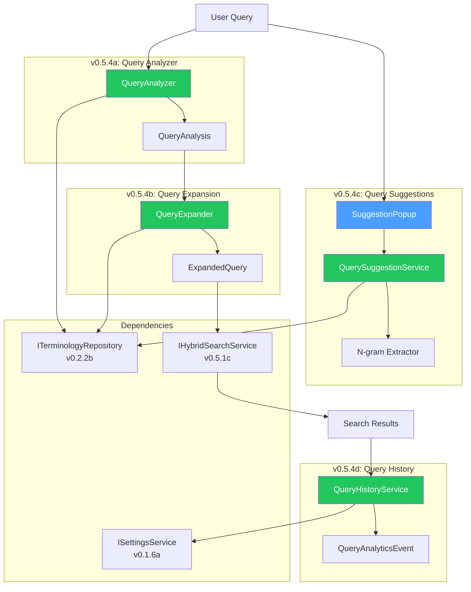
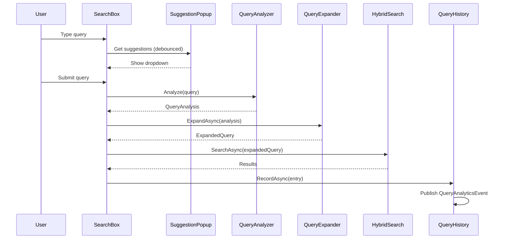

# LCS-SBD-054: Scope Breakdown — The Relevance Tuner

## Document Control

| Field                | Value                                     |
| :------------------- | :---------------------------------------- |
| **Document ID**      | LCS-SBD-054                               |
| **Feature ID**       | RAG-054                                   |
| **Feature Name**     | The Relevance Tuner (Query Understanding) |
| **Target Version**   | v0.5.4                                    |
| **Module Scope**     | Lexichord.Modules.RAG                     |
| **Swimlane**         | Memory                                    |
| **License Tier**     | Writer Pro                                |
| **Feature Gate Key** | `FeatureFlags.RAG.RelevanceTuner`         |
| **Parent Roadmap**   | [roadmap-v0.5.x.md](../roadmap-v0.5.x.md) |
| **Status**           | Draft                                     |
| **Last Updated**     | 2026-01-27                                |

---

## 1. Executive Summary

### 1.1 The Vision

**v0.5.4** delivers the **Relevance Tuner** — intelligent query understanding and enhancement for improved search quality. This release transforms Lexichord's search from a simple query-in/results-out system into a sophisticated retrieval engine that understands user intent, expands queries with synonyms, provides intelligent suggestions, and tracks search patterns for continuous improvement.

### 1.2 Business Value

| Value                    | Description                                                    |
| :----------------------- | :------------------------------------------------------------- |
| **Improved Recall**      | Query expansion surfaces documents using different terminology |
| **Better Precision**     | Intent detection tailors result ranking to query type          |
| **Faster Discovery**     | Autocomplete suggestions reduce keystrokes and guide users     |
| **Content Intelligence** | Analytics identify content gaps from zero-result queries       |
| **Writer Experience**    | Understanding what users search for informs content strategy   |

### 1.3 Success Criteria

| Criterion                   | Target               | Measurement                   |
| :-------------------------- | :------------------- | :---------------------------- |
| Query analysis latency      | < 20ms               | P95 latency measurement       |
| Synonym expansion coverage  | 80%+ domain terms    | Term database coverage audit  |
| Suggestion relevance        | 70%+ acceptance rate | Click-through tracking        |
| Zero-result query reduction | 30%+ reduction       | Before/after comparison       |
| Autocomplete responsiveness | < 50ms               | UI responsiveness measurement |

### 1.4 License Gating Strategy

The Relevance Tuner features are gated at the **Writer Pro** tier using a **Soft Gate** strategy:

| Tier       | Query Analysis | Expansion | Suggestions | Analytics  |
| :--------- | :------------- | :-------- | :---------- | :--------- |
| Core       | Basic only     | Disabled  | Disabled    | Disabled   |
| Writer Pro | Full analysis  | Enabled   | Enabled     | Enabled    |
| Teams      | Full analysis  | Enabled   | Enabled     | Team-wide  |
| Enterprise | Full analysis  | Enabled   | Enabled     | Aggregated |

---

## 2. Dependencies

### 2.1 Upstream Dependencies

| Interface/Class          | Source Version        | Required For                     |
| :----------------------- | :-------------------- | :------------------------------- |
| `ISemanticSearchService` | v0.4.5a               | Base search to enhance           |
| `IHybridSearchService`   | v0.5.1c               | Combined search execution        |
| `IChunkRepository`       | v0.4.1c               | Content analysis for suggestions |
| `ITerminologyRepository` | v0.2.2b               | Domain synonym database          |
| `ISettingsService`       | v0.1.6a               | User preference storage          |
| `ILicenseContext`        | v0.0.4c               | License tier checking            |
| `IMediator`              | v0.0.7a               | Event publishing                 |
| `ILogger<T>`             | v0.0.3b               | Structured logging               |
| `ViewModelBase`          | CommunityToolkit.Mvvm | Observable ViewModel base        |

### 2.2 NuGet Packages

| Package                 | Version | Purpose                 |
| :---------------------- | :------ | :---------------------- |
| `CommunityToolkit.Mvvm` | 8.x     | MVVM source generators  |
| `MediatR`               | 12.x    | Event publishing        |
| `Npgsql`                | 8.x     | PostgreSQL connectivity |
| `Dapper`                | 2.x     | Micro-ORM for queries   |

### 2.3 Downstream Consumers

| Version | Feature         | Consumes                                     |
| :------ | :-------------- | :------------------------------------------- |
| v0.5.5  | Filter System   | `QueryAnalysis` for smart filter suggestions |
| v0.5.6  | Answer Preview  | `QueryIntent` for snippet ranking            |
| v0.5.7  | Results Ranking | Query analysis for re-ranking                |
| v0.6.x  | AI Assistant    | Query expansion for context assembly         |

---

## 3. Sub-Part Specifications

### 3.1 v0.5.4a: Query Analyzer

| Field                | Value                          |
| :------------------- | :----------------------------- |
| **Sub-Part ID**      | RAG-054a                       |
| **Title**            | Query Analyzer                 |
| **Estimated Effort** | 7 hours                        |
| **Risk Level**       | Medium (NLP heuristics)        |
| **License Tier**     | Writer Pro (advanced analysis) |

**Goal:** Implement `IQueryAnalyzer` to extract keywords, entities, intent, and specificity from search queries.

**Key Deliverables:**

- `IQueryAnalyzer` interface in Lexichord.Abstractions
- `QueryAnalyzer` implementation in Modules.RAG/Services
- `QueryAnalysis` result record with rich query metadata
- `QueryIntent` enum (Factual, Procedural, Conceptual, Navigational)
- Keyword extraction using stop-word filtering
- Entity recognition for code patterns, file paths, and domain terms
- Specificity scoring (0.0 = vague, 1.0 = highly specific)
- Unit tests with 90%+ coverage

**Key Interfaces:**

```csharp
namespace Lexichord.Abstractions.Contracts;

/// <summary>
/// Analyzes search queries to extract structure, intent, and metadata.
/// </summary>
public interface IQueryAnalyzer
{
    /// <summary>
    /// Analyzes a search query to extract keywords, entities, and intent.
    /// </summary>
    /// <param name="query">The raw search query string.</param>
    /// <returns>Analysis results including keywords, entities, intent, and specificity.</returns>
    QueryAnalysis Analyze(string query);
}

/// <summary>
/// Results of query analysis.
/// </summary>
/// <param name="OriginalQuery">The original query string.</param>
/// <param name="Keywords">Extracted meaningful keywords (stop-words removed).</param>
/// <param name="Entities">Recognized entities (code patterns, file paths, domain terms).</param>
/// <param name="Intent">Detected query intent category.</param>
/// <param name="Specificity">Score 0.0 (vague) to 1.0 (highly specific).</param>
public record QueryAnalysis(
    string OriginalQuery,
    IReadOnlyList<string> Keywords,
    IReadOnlyList<QueryEntity> Entities,
    QueryIntent Intent,
    float Specificity);

/// <summary>
/// An entity recognized within a query.
/// </summary>
/// <param name="Text">The entity text as it appears in the query.</param>
/// <param name="Type">The type of entity.</param>
/// <param name="StartIndex">Start position in original query.</param>
public record QueryEntity(string Text, EntityType Type, int StartIndex);

/// <summary>
/// Types of entities that can be recognized in queries.
/// </summary>
public enum EntityType
{
    /// <summary>Code identifier like function or class name.</summary>
    CodeIdentifier,
    /// <summary>File path or glob pattern.</summary>
    FilePath,
    /// <summary>Domain-specific term from terminology database.</summary>
    DomainTerm,
    /// <summary>Version number or reference.</summary>
    VersionNumber,
    /// <summary>Error code or status code.</summary>
    ErrorCode
}

/// <summary>
/// Detected intent category for the query.
/// </summary>
public enum QueryIntent
{
    /// <summary>Looking for a specific fact or definition.</summary>
    Factual,
    /// <summary>Looking for step-by-step instructions.</summary>
    Procedural,
    /// <summary>Looking to understand a concept or architecture.</summary>
    Conceptual,
    /// <summary>Looking to navigate to a specific location.</summary>
    Navigational
}
```

**Intent Detection Heuristics:**

| Signal                              | Intent       | Example                           |
| :---------------------------------- | :----------- | :-------------------------------- |
| "what is", "definition", "meaning"  | Factual      | "what is OAuth"                   |
| "how to", "steps", "tutorial"       | Procedural   | "how to configure authentication" |
| "why", "explain", "understand"      | Conceptual   | "why use dependency injection"    |
| "where is", "find", "locate", paths | Navigational | "where is the config file"        |
| Default (no strong signal)          | Factual      | "token refresh"                   |

**Dependencies:**

- `ITerminologyRepository` (v0.2.2b) for domain term recognition
- Stop-word list (English, technical terms)

---

### 3.2 v0.5.4b: Query Expansion

| Field                | Value           |
| :------------------- | :-------------- |
| **Sub-Part ID**      | RAG-054b        |
| **Title**            | Query Expansion |
| **Estimated Effort** | 6 hours         |
| **Risk Level**       | Low             |
| **License Tier**     | Writer Pro      |

**Goal:** Expand queries with synonyms and related terms from the terminology database to improve recall.

**Key Deliverables:**

- `IQueryExpander` interface in Lexichord.Abstractions
- `QueryExpander` implementation using terminology database
- `ExpandedQuery` record with original and expanded terms
- Configurable expansion limit (default: 3 synonyms per term)
- Expansion weight factors for ranking adjustment
- Cache for frequently expanded terms
- Unit tests with coverage of edge cases

**Key Interfaces:**

```csharp
namespace Lexichord.Abstractions.Contracts;

/// <summary>
/// Expands queries with synonyms and related terms.
/// </summary>
public interface IQueryExpander
{
    /// <summary>
    /// Expands a query analysis with synonyms and related terms.
    /// </summary>
    /// <param name="analysis">The analyzed query to expand.</param>
    /// <param name="options">Expansion configuration options.</param>
    /// <param name="cancellationToken">Cancellation token.</param>
    /// <returns>Expanded query with original and additional terms.</returns>
    Task<ExpandedQuery> ExpandAsync(
        QueryAnalysis analysis,
        ExpansionOptions? options = null,
        CancellationToken cancellationToken = default);
}

/// <summary>
/// Query with expanded terms for broader search.
/// </summary>
/// <param name="Original">The original query analysis.</param>
/// <param name="Expansions">Map of original term to expanded synonyms.</param>
/// <param name="ExpandedKeywords">All keywords including expansions.</param>
/// <param name="TotalTermCount">Total number of search terms after expansion.</param>
public record ExpandedQuery(
    QueryAnalysis Original,
    IReadOnlyDictionary<string, IReadOnlyList<Synonym>> Expansions,
    IReadOnlyList<string> ExpandedKeywords,
    int TotalTermCount);

/// <summary>
/// A synonym or related term.
/// </summary>
/// <param name="Term">The synonym text.</param>
/// <param name="Weight">Relevance weight (0.0-1.0), lower for less related terms.</param>
/// <param name="Source">Source of the synonym.</param>
public record Synonym(string Term, float Weight, SynonymSource Source);

/// <summary>
/// Source of a synonym.
/// </summary>
public enum SynonymSource
{
    /// <summary>From user-defined terminology database.</summary>
    TerminologyDatabase,
    /// <summary>Algorithmically derived (stemming, morphology).</summary>
    Algorithmic,
    /// <summary>From usage patterns in indexed content.</summary>
    ContentDerived
}

/// <summary>
/// Configuration for query expansion.
/// </summary>
/// <param name="MaxSynonymsPerTerm">Maximum synonyms to add per keyword (default 3).</param>
/// <param name="MinSynonymWeight">Minimum weight threshold for inclusion (default 0.3).</param>
/// <param name="IncludeAlgorithmic">Whether to include stemming/morphological variants.</param>
public record ExpansionOptions(
    int MaxSynonymsPerTerm = 3,
    float MinSynonymWeight = 0.3f,
    bool IncludeAlgorithmic = true);
```

**Expansion Examples:**

| Original Term | Expanded Terms                       | Source              |
| :------------ | :----------------------------------- | :------------------ |
| "auth"        | authentication, authorization, login | TerminologyDatabase |
| "config"      | configuration, settings, preferences | TerminologyDatabase |
| "implement"   | implementing, implementation         | Algorithmic         |
| "API"         | endpoint, interface, service         | TerminologyDatabase |

**Dependencies:**

- `ITerminologyRepository` (v0.2.2b) for synonym lookup
- `QueryAnalysis` (v0.5.4a) for keywords to expand

---

### 3.3 v0.5.4c: Query Suggestions

| Field                | Value                          |
| :------------------- | :----------------------------- |
| **Sub-Part ID**      | RAG-054c                       |
| **Title**            | Query Suggestions              |
| **Estimated Effort** | 8 hours                        |
| **Risk Level**       | Medium (n-gram extraction, UI) |
| **License Tier**     | Writer Pro                     |

**Goal:** Provide intelligent autocomplete suggestions based on indexed content.

**Key Deliverables:**

- `IQuerySuggestionService` interface in Lexichord.Abstractions
- `QuerySuggestionService` implementation with n-gram matching
- `query_suggestions` database table with frequency counts
- N-gram extraction during document indexing
- Debounced suggestion lookup (200ms)
- Suggestion ranking by frequency and recency
- `SuggestionPopup` UI component
- Unit tests and integration tests

**Key Interfaces:**

```csharp
namespace Lexichord.Abstractions.Contracts;

/// <summary>
/// Provides query autocomplete suggestions based on indexed content.
/// </summary>
public interface IQuerySuggestionService
{
    /// <summary>
    /// Gets suggestions for a partial query.
    /// </summary>
    /// <param name="prefix">The partial query typed so far.</param>
    /// <param name="maxResults">Maximum suggestions to return (default 10).</param>
    /// <param name="cancellationToken">Cancellation token.</param>
    /// <returns>Ranked list of suggestions.</returns>
    Task<IReadOnlyList<QuerySuggestion>> GetSuggestionsAsync(
        string prefix,
        int maxResults = 10,
        CancellationToken cancellationToken = default);

    /// <summary>
    /// Records a query that was executed (for frequency tracking).
    /// </summary>
    /// <param name="query">The executed query.</param>
    /// <param name="resultCount">Number of results returned.</param>
    /// <param name="cancellationToken">Cancellation token.</param>
    Task RecordQueryAsync(
        string query,
        int resultCount,
        CancellationToken cancellationToken = default);

    /// <summary>
    /// Extracts and stores suggestions from document content during indexing.
    /// </summary>
    /// <param name="documentId">The document being indexed.</param>
    /// <param name="content">The document content.</param>
    /// <param name="cancellationToken">Cancellation token.</param>
    Task ExtractSuggestionsAsync(
        Guid documentId,
        string content,
        CancellationToken cancellationToken = default);
}

/// <summary>
/// A query autocomplete suggestion.
/// </summary>
/// <param name="Text">The suggested query text.</param>
/// <param name="Frequency">How often this suggestion has been used/seen.</param>
/// <param name="Source">Source of the suggestion.</param>
/// <param name="Score">Relevance score for ranking.</param>
public record QuerySuggestion(
    string Text,
    int Frequency,
    SuggestionSource Source,
    float Score);

/// <summary>
/// Source of a query suggestion.
/// </summary>
public enum SuggestionSource
{
    /// <summary>Previously executed query.</summary>
    QueryHistory,
    /// <summary>Extracted from document headings.</summary>
    DocumentHeading,
    /// <summary>Extracted from content n-grams.</summary>
    ContentNgram,
    /// <summary>Domain term from terminology database.</summary>
    DomainTerm
}
```

**Database Schema:**

```sql
CREATE TABLE query_suggestions (
    id UUID PRIMARY KEY DEFAULT gen_random_uuid(),
    text TEXT NOT NULL,
    normalized_text TEXT NOT NULL,  -- Lowercase, trimmed
    source TEXT NOT NULL,           -- 'query_history', 'heading', 'ngram', 'term'
    frequency INT NOT NULL DEFAULT 1,
    last_seen_at TIMESTAMPTZ NOT NULL DEFAULT NOW(),
    document_id UUID,               -- Source document (if from content)
    created_at TIMESTAMPTZ NOT NULL DEFAULT NOW(),

    CONSTRAINT uq_suggestions_normalized_source UNIQUE (normalized_text, source)
);

CREATE INDEX idx_suggestions_prefix ON query_suggestions (normalized_text text_pattern_ops);
CREATE INDEX idx_suggestions_frequency ON query_suggestions (frequency DESC);
```

**N-gram Extraction Rules:**

| Source            | N-gram Size | Example                   |
| :---------------- | :---------- | :------------------------ |
| Document headings | 1-5 words   | "Token Refresh", "OAuth"  |
| Code blocks       | Identifiers | "IQueryAnalyzer", "async" |
| Bold/italic text  | 1-3 words   | "important concept"       |
| High-frequency    | 2-4 words   | Common phrases            |

**UI Specifications:**

- Dropdown appears after 2+ characters typed
- Debounce: 200ms after last keystroke
- Max 10 suggestions visible
- Keyboard navigation (↑↓ Enter Esc)
- Prefix highlighting in suggestions

**Dependencies:**

- Document indexing pipeline (v0.4.3) for n-gram extraction
- `ITerminologyRepository` (v0.2.2b) for domain terms

---

### 3.4 v0.5.4d: Query History & Analytics

| Field                | Value                     |
| :------------------- | :------------------------ |
| **Sub-Part ID**      | RAG-054d                  |
| **Title**            | Query History & Analytics |
| **Estimated Effort** | 6 hours                   |
| **Risk Level**       | Low                       |
| **License Tier**     | Writer Pro                |

**Goal:** Track search patterns to identify content gaps and improve search quality.

**Key Deliverables:**

- `IQueryHistoryService` interface in Lexichord.Abstractions
- `QueryHistoryService` implementation with SQLite storage
- `query_history` database table
- Zero-result query identification
- `QueryAnalyticsEvent` MediatR notification (opt-in telemetry)
- Query history UI section in search panel
- Recent queries quick-access
- Unit tests for storage and analytics

**Key Interfaces:**

```csharp
namespace Lexichord.Abstractions.Contracts;

/// <summary>
/// Tracks query history and provides search analytics.
/// </summary>
public interface IQueryHistoryService
{
    /// <summary>
    /// Records an executed query with its results.
    /// </summary>
    /// <param name="entry">The query history entry to record.</param>
    /// <param name="cancellationToken">Cancellation token.</param>
    Task RecordAsync(QueryHistoryEntry entry, CancellationToken cancellationToken = default);

    /// <summary>
    /// Gets recent queries for quick access.
    /// </summary>
    /// <param name="limit">Maximum entries to return.</param>
    /// <param name="cancellationToken">Cancellation token.</param>
    Task<IReadOnlyList<QueryHistoryEntry>> GetRecentAsync(
        int limit = 10,
        CancellationToken cancellationToken = default);

    /// <summary>
    /// Gets queries that returned zero results (content gaps).
    /// </summary>
    /// <param name="since">Start date for analysis.</param>
    /// <param name="cancellationToken">Cancellation token.</param>
    Task<IReadOnlyList<ZeroResultQuery>> GetZeroResultQueriesAsync(
        DateTime since,
        CancellationToken cancellationToken = default);

    /// <summary>
    /// Clears query history.
    /// </summary>
    /// <param name="olderThan">Optional: only clear entries older than this date.</param>
    /// <param name="cancellationToken">Cancellation token.</param>
    Task ClearAsync(DateTime? olderThan = null, CancellationToken cancellationToken = default);
}

/// <summary>
/// A recorded query with execution details.
/// </summary>
/// <param name="Id">Unique identifier.</param>
/// <param name="Query">The search query text.</param>
/// <param name="Intent">Detected query intent.</param>
/// <param name="ResultCount">Number of results returned.</param>
/// <param name="TopResultScore">Score of the best result (if any).</param>
/// <param name="ExecutedAt">When the query was executed.</param>
/// <param name="DurationMs">Execution time in milliseconds.</param>
public record QueryHistoryEntry(
    Guid Id,
    string Query,
    QueryIntent Intent,
    int ResultCount,
    float? TopResultScore,
    DateTime ExecutedAt,
    long DurationMs);

/// <summary>
/// A query that returned no results (potential content gap).
/// </summary>
/// <param name="Query">The query text.</param>
/// <param name="OccurrenceCount">How many times this was searched.</param>
/// <param name="LastSearchedAt">Most recent search attempt.</param>
/// <param name="SuggestedContent">AI-suggested content to create (future).</param>
public record ZeroResultQuery(
    string Query,
    int OccurrenceCount,
    DateTime LastSearchedAt,
    string? SuggestedContent);
```

**MediatR Event:**

```csharp
namespace Lexichord.Modules.RAG.Events;

/// <summary>
/// Published when a query is executed (opt-in telemetry).
/// </summary>
/// <param name="QueryHash">SHA256 hash of query (anonymized).</param>
/// <param name="Intent">Detected intent category.</param>
/// <param name="ResultCount">Number of results.</param>
/// <param name="DurationMs">Execution duration.</param>
/// <param name="Timestamp">When the query was executed.</param>
public record QueryAnalyticsEvent(
    string QueryHash,
    QueryIntent Intent,
    int ResultCount,
    long DurationMs,
    DateTime Timestamp) : INotification;
```

**Database Schema:**

```sql
CREATE TABLE query_history (
    id UUID PRIMARY KEY DEFAULT gen_random_uuid(),
    query TEXT NOT NULL,
    query_hash TEXT NOT NULL,           -- For deduplication
    intent TEXT NOT NULL,
    result_count INT NOT NULL,
    top_result_score REAL,
    executed_at TIMESTAMPTZ NOT NULL DEFAULT NOW(),
    duration_ms BIGINT NOT NULL
);

CREATE INDEX idx_query_history_executed_at ON query_history (executed_at DESC);
CREATE INDEX idx_query_history_result_count ON query_history (result_count);
CREATE INDEX idx_query_history_hash ON query_history (query_hash);
```

**Privacy Considerations:**

- Query history stored locally only
- `QueryAnalyticsEvent` uses hashed query text
- Telemetry is opt-in via settings
- Clear history action available

**Dependencies:**

- `QueryAnalysis` (v0.5.4a) for intent tracking
- `ISettingsService` (v0.1.6a) for telemetry opt-in preference

---

## 4. Implementation Checklist

### 4.1 v0.5.4a — Query Analyzer

| Step | Task                                                 | Est. Hours |
| :--- | :--------------------------------------------------- | :--------- |
| 1    | Define `IQueryAnalyzer` interface                    | 0.5        |
| 2    | Define `QueryAnalysis`, `QueryEntity`, `QueryIntent` | 0.5        |
| 3    | Implement stop-word filtering                        | 1.0        |
| 4    | Implement keyword extraction                         | 1.0        |
| 5    | Implement entity recognition patterns                | 1.5        |
| 6    | Implement intent detection heuristics                | 1.0        |
| 7    | Implement specificity scoring                        | 0.5        |
| 8    | Write unit tests (90%+ coverage)                     | 1.0        |
|      | **Subtotal**                                         | **7.0**    |

### 4.2 v0.5.4b — Query Expansion

| Step | Task                                                  | Est. Hours |
| :--- | :---------------------------------------------------- | :--------- |
| 1    | Define `IQueryExpander` interface                     | 0.5        |
| 2    | Define `ExpandedQuery`, `Synonym`, `ExpansionOptions` | 0.5        |
| 3    | Implement terminology database lookup                 | 1.5        |
| 4    | Implement algorithmic expansion (stemming)            | 1.0        |
| 5    | Implement expansion caching                           | 1.0        |
| 6    | Integrate with search pipeline                        | 0.5        |
| 7    | Write unit tests                                      | 1.0        |
|      | **Subtotal**                                          | **6.0**    |

### 4.3 v0.5.4c — Query Suggestions

| Step | Task                                             | Est. Hours |
| :--- | :----------------------------------------------- | :--------- |
| 1    | Define `IQuerySuggestionService` interface       | 0.5        |
| 2    | Create `query_suggestions` migration             | 0.5        |
| 3    | Implement suggestion lookup with prefix matching | 1.5        |
| 4    | Implement n-gram extraction during indexing      | 2.0        |
| 5    | Implement frequency tracking and ranking         | 1.0        |
| 6    | Create `SuggestionPopup` UI component            | 1.5        |
| 7    | Implement debounced input handling               | 0.5        |
| 8    | Write unit and integration tests                 | 1.0        |
|      | **Subtotal**                                     | **8.5**    |

### 4.4 v0.5.4d — Query History & Analytics

| Step | Task                                       | Est. Hours |
| :--- | :----------------------------------------- | :--------- |
| 1    | Define `IQueryHistoryService` interface    | 0.5        |
| 2    | Create `query_history` migration           | 0.5        |
| 3    | Implement history recording                | 1.0        |
| 4    | Implement recent queries retrieval         | 0.5        |
| 5    | Implement zero-result query analysis       | 1.0        |
| 6    | Implement `QueryAnalyticsEvent` publishing | 0.5        |
| 7    | Create recent queries UI section           | 1.0        |
| 8    | Write unit tests                           | 1.0        |
|      | **Subtotal**                               | **6.0**    |

### 4.5 Integration & Testing

| Step | Task                                       | Est. Hours |
| :--- | :----------------------------------------- | :--------- |
| 1    | DI registration in RAGModule.cs            | 0.5        |
| 2    | Integration tests for full query pipeline  | 1.5        |
| 3    | Performance testing (latency verification) | 1.0        |
|      | **Subtotal**                               | **3.0**    |

**Total Estimated Effort: 30.5 hours**

---

## 5. Dependency Matrix

| Component                | Depends On                                          |
| :----------------------- | :-------------------------------------------------- |
| `QueryAnalyzer`          | `ITerminologyRepository` (v0.2.2b)                  |
| `QueryExpander`          | `QueryAnalysis`, `ITerminologyRepository` (v0.2.2b) |
| `QuerySuggestionService` | `IChunkRepository` (v0.4.1c), indexing pipeline     |
| `QueryHistoryService`    | `QueryAnalysis`, `ISettingsService` (v0.1.6a)       |
| `SuggestionPopup`        | `IQuerySuggestionService`, `ViewModelBase`          |

---

## 6. Architecture Diagram



---

## 7. Data Flow Diagram



---

## 8. Risks and Mitigations

| Risk                          | Probability | Impact | Mitigation                                   |
| :---------------------------- | :---------- | :----- | :------------------------------------------- |
| Intent detection inaccuracy   | Medium      | Medium | Conservative heuristics, fallback to Factual |
| Query expansion noise         | Medium      | Medium | Weight thresholds, limit expansions per term |
| N-gram extraction performance | Medium      | Low    | Background processing, incremental updates   |
| Suggestion latency            | Low         | High   | Aggressive caching, prefix index             |
| Privacy concerns with history | Low         | High   | Local-only storage, clear action, opt-in     |

---

## 9. Success Metrics

| Metric                   | Baseline     | Target          | Measurement               |
| :----------------------- | :----------- | :-------------- | :------------------------ |
| Query analysis latency   | N/A          | < 20ms P95      | Performance profiling     |
| Suggestion click-through | N/A          | 70%+ acceptance | Click tracking            |
| Zero-result queries      | Current rate | -30%            | Before/after comparison   |
| Search result relevance  | Current MRR  | +15% MRR        | User feedback, click data |
| Expansion coverage       | 0%           | 80%+ terms      | Term database audit       |

---

## 10. User Stories

### US-054-1: Query Analysis

> **As a** writer searching my documentation,
> **I want** the search system to understand my intent,
> **So that** results are ranked appropriately for what I'm looking for.

**Acceptance Criteria:**

- Queries with "how to" are recognized as Procedural intent
- Queries with file paths are recognized as Navigational intent
- Intent is displayed in search result header

### US-054-2: Query Expansion

> **As a** writer using domain-specific terminology,
> **I want** search to find documents using different words for the same concept,
> **So that** I don't miss relevant content due to terminology differences.

**Acceptance Criteria:**

- Searching "auth" returns results containing "authentication"
- Expansion terms are shown in search UI
- Expansion can be disabled per-search

### US-054-3: Query Suggestions

> **As a** writer searching my documentation,
> **I want** autocomplete suggestions as I type,
> **So that** I can search faster and discover content I didn't know existed.

**Acceptance Criteria:**

- Suggestions appear after 2+ characters
- Suggestions include document headings
- Pressing Enter on suggestion executes search

### US-054-4: Search Analytics

> **As a** documentation author,
> **I want** to see what users searched for but couldn't find,
> **So that** I can identify and fill content gaps.

**Acceptance Criteria:**

- Zero-result queries are tracked
- Analytics dashboard shows common failed searches
- I can clear my search history

---

## 11. Use Cases

### UC-054-1: Expanded Search

**Actors:** Writer (Writer Pro tier)

**Preconditions:**

- User is authenticated with Writer Pro license
- Documents are indexed

**Main Flow:**

1. User types "api auth" in search box
2. System analyzes query: `Keywords: ["api", "auth"]`, `Intent: Factual`
3. System expands "auth" → ["authentication", "authorization", "login"]
4. System executes hybrid search with expanded terms
5. Results show matches for any expanded term
6. UI indicates which terms were expanded

**Postconditions:**

- Search results include documents with synonym matches
- Query is recorded in history

### UC-054-2: Autocomplete Suggestion

**Actors:** Writer (Writer Pro tier)

**Preconditions:**

- User is in search interface
- Suggestions have been extracted from indexed content

**Main Flow:**

1. User types "token" in search box
2. After 200ms debounce, system queries suggestions
3. System shows dropdown: "token refresh", "token validation", "access token"
4. User presses ↓ to select "token refresh"
5. User presses Enter
6. Search executes with "token refresh"

**Postconditions:**

- Search results displayed
- Suggestion frequency incremented

---

## 12. Unit Testing Requirements

### Test Coverage Targets

| Component                | Target Coverage | Critical Paths                       |
| :----------------------- | :-------------- | :----------------------------------- |
| `QueryAnalyzer`          | 95%             | Intent detection, entity recognition |
| `QueryExpander`          | 90%             | Synonym lookup, weight thresholds    |
| `QuerySuggestionService` | 90%             | Prefix matching, frequency ranking   |
| `QueryHistoryService`    | 85%             | Recording, zero-result queries       |

### Key Test Scenarios

```csharp
// QueryAnalyzer tests
[Theory]
[InlineData("how to configure authentication", QueryIntent.Procedural)]
[InlineData("what is OAuth", QueryIntent.Factual)]
[InlineData("explain dependency injection", QueryIntent.Conceptual)]
[InlineData("where is config.json", QueryIntent.Navigational)]
public void Analyze_DetectsCorrectIntent(string query, QueryIntent expected);

[Fact]
public void Analyze_ExtractsKeywords_RemovingStopWords();

[Fact]
public void Analyze_RecognizesCodeIdentifiers();

// QueryExpander tests
[Fact]
public async Task ExpandAsync_ExpandsKnownTerms();

[Fact]
public async Task ExpandAsync_RespectsMaxSynonymsLimit();

[Fact]
public async Task ExpandAsync_AppliesWeightThreshold();

// QuerySuggestionService tests
[Fact]
public async Task GetSuggestionsAsync_MatchesByPrefix();

[Fact]
public async Task GetSuggestionsAsync_RanksByFrequency();

[Fact]
public async Task ExtractSuggestionsAsync_ExtractsHeadings();

// QueryHistoryService tests
[Fact]
public async Task RecordAsync_StoresEntry();

[Fact]
public async Task GetZeroResultQueriesAsync_ReturnsOnlyZeroResults();

[Fact]
public async Task ClearAsync_RemovesOldEntries();
```

---

## 13. Logging Specifications

### Log Events by Component

| Component     | Level | Event                 | Template                                                                         |
| :------------ | :---- | :-------------------- | :------------------------------------------------------------------------------- |
| QueryAnalyzer | Debug | Analysis complete     | `"Query analyzed: Intent={Intent}, Keywords={Count}, Specificity={Specificity}"` |
| QueryAnalyzer | Debug | Entity recognized     | `"Entity recognized: {Text} ({Type})"`                                           |
| QueryExpander | Debug | Expansion started     | `"Expanding query with {KeywordCount} keywords"`                                 |
| QueryExpander | Debug | Term expanded         | `"Expanded '{Term}' to {SynonymCount} synonyms"`                                 |
| QueryExpander | Info  | Expansion complete    | `"Query expanded: {OriginalCount} → {TotalCount} terms"`                         |
| Suggestions   | Debug | Suggestions requested | `"Getting suggestions for prefix '{Prefix}'"`                                    |
| Suggestions   | Debug | Suggestions returned  | `"Returned {Count} suggestions"`                                                 |
| Suggestions   | Info  | N-grams extracted     | `"Extracted {Count} suggestions from document {DocumentId}"`                     |
| QueryHistory  | Debug | Query recorded        | `"Recorded query: {ResultCount} results, {DurationMs}ms"`                        |
| QueryHistory  | Info  | Zero-result query     | `"Zero-result query recorded: '{Query}'"`                                        |

---

## 14. UI/UX Specifications

### 14.1 Suggestion Dropdown

```text
┌─────────────────────────────────────────────────────────────────────────────────────┐
│  Search                                                                             │
│  ┌──────────────────────────────────────────────────────────────────────────────┐   │
│  │  token█                                                              🔍      │   │
│  └──────────────────────────────────────────────────────────────────────────────┘   │
│  ┌──────────────────────────────────────────────────────────────────────────────┐   │
│  │  🕐 token refresh                                          [Recent Query]    │   │
│  │  📄 Token Validation                                       [Document Heading]│   │
│  │  💡 token authentication                                   [Suggestion]      │   │
│  │  💡 access token expiration                                [Suggestion]      │   │
│  └──────────────────────────────────────────────────────────────────────────────┘   │
└─────────────────────────────────────────────────────────────────────────────────────┘
```

### 14.2 Expanded Query Indicator

```text
┌─────────────────────────────────────────────────────────────────────────────────────┐
│  Search Results for: api auth                                                       │
│  ┌──────────────────────────────────────────────────────────────────────────────┐   │
│  │  📊 Query expanded: auth → authentication, authorization, login               │   │
│  │     [Show original only]                                                      │   │
│  └──────────────────────────────────────────────────────────────────────────────┘   │
│                                                                                     │
│  12 results found (Intent: Factual)                                                 │
└─────────────────────────────────────────────────────────────────────────────────────┘
```

### 14.3 Recent Queries Section

```text
┌─────────────────────────────────────────────────────────────────────────────────────┐
│  Recent Searches                                                     [Clear All]    │
│  ┌──────────────────────────────────────────────────────────────────────────────┐   │
│  │  🕐 token refresh          12 results · 2 min ago                            │   │
│  │  🕐 oauth implementation    8 results · 15 min ago                           │   │
│  │  🕐 config settings         0 results · 1 hour ago  ⚠️                       │   │
│  └──────────────────────────────────────────────────────────────────────────────┘   │
└─────────────────────────────────────────────────────────────────────────────────────┘
```

---

## 15. Acceptance Criteria

| #   | Category        | Criterion                                              | Verification     |
| :-- | :-------------- | :----------------------------------------------------- | :--------------- |
| 1   | **Functional**  | Query analyzer extracts keywords, entities, and intent | Unit test        |
| 2   | **Functional**  | Query expander adds synonyms from terminology database | Unit test        |
| 3   | **Functional**  | Suggestions appear within 50ms of final keystroke      | Performance test |
| 4   | **Functional**  | Query history records all executed searches            | Integration test |
| 5   | **Functional**  | Zero-result queries are identifiable in analytics      | Unit test        |
| 6   | **Performance** | Query analysis completes in < 20ms                     | Performance test |
| 7   | **Performance** | Suggestion lookup completes in < 50ms                  | Performance test |
| 8   | **UX**          | Suggestion dropdown has keyboard navigation            | Manual test      |
| 9   | **UX**          | Expanded terms are visible in search UI                | Manual test      |
| 10  | **Privacy**     | Query history is stored locally only                   | Code review      |
| 11  | **Privacy**     | Analytics events use hashed queries                    | Code review      |
| 12  | **License**     | Core tier has basic analysis only                      | Integration test |

---

## 16. Verification Commands

```bash
# Run unit tests for v0.5.4 components
dotnet test --filter "Feature=v0.5.4"

# Run specific sub-part tests
dotnet test --filter "Feature=v0.5.4a"  # Query Analyzer
dotnet test --filter "Feature=v0.5.4b"  # Query Expansion
dotnet test --filter "Feature=v0.5.4c"  # Query Suggestions
dotnet test --filter "Feature=v0.5.4d"  # Query History

# Verify database migrations
dotnet ef migrations list --project src/Lexichord.Modules.RAG

# Performance profiling
dotnet run --project src/Lexichord.App -- --benchmark query-analysis
```

---

## 17. Deliverable Checklist

| #   | Deliverable                                                 | Status |
| :-- | :---------------------------------------------------------- | :----- |
| 1   | `IQueryAnalyzer` interface and implementation               | [ ]    |
| 2   | `QueryAnalysis`, `QueryEntity`, `QueryIntent` records/enums | [ ]    |
| 3   | `IQueryExpander` interface and implementation               | [ ]    |
| 4   | `ExpandedQuery`, `Synonym`, `ExpansionOptions` records      | [ ]    |
| 5   | `IQuerySuggestionService` interface and implementation      | [ ]    |
| 6   | `query_suggestions` database migration                      | [ ]    |
| 7   | N-gram extraction in indexing pipeline                      | [ ]    |
| 8   | `SuggestionPopup` UI component                              | [ ]    |
| 9   | `IQueryHistoryService` interface and implementation         | [ ]    |
| 10  | `query_history` database migration                          | [ ]    |
| 11  | `QueryAnalyticsEvent` MediatR notification                  | [ ]    |
| 12  | Recent queries UI section                                   | [ ]    |
| 13  | DI registration in RAGModule.cs                             | [ ]    |
| 14  | Unit tests for all components (90%+ coverage)               | [ ]    |
| 15  | Integration tests for query pipeline                        | [ ]    |

---

## 18. Code Examples

### 18.1 Full Query Pipeline

```csharp
public class SearchOrchestrator
{
    private readonly IQueryAnalyzer _analyzer;
    private readonly IQueryExpander _expander;
    private readonly IHybridSearchService _searchService;
    private readonly IQueryHistoryService _historyService;
    private readonly ILicenseContext _licenseContext;
    private readonly Stopwatch _stopwatch = new();

    public async Task<SearchResults> SearchAsync(string query, CancellationToken ct = default)
    {
        _stopwatch.Restart();

        // Step 1: Analyze query
        var analysis = _analyzer.Analyze(query);

        // Step 2: Expand query (if licensed)
        var expandedQuery = _licenseContext.HasFeature(FeatureFlags.RAG.RelevanceTuner)
            ? await _expander.ExpandAsync(analysis, cancellationToken: ct)
            : new ExpandedQuery(analysis, new Dictionary<string, IReadOnlyList<Synonym>>(),
                                analysis.Keywords, analysis.Keywords.Count);

        // Step 3: Execute search
        var results = await _searchService.SearchAsync(
            expandedQuery.ExpandedKeywords,
            topK: 20,
            ct);

        _stopwatch.Stop();

        // Step 4: Record history
        await _historyService.RecordAsync(new QueryHistoryEntry(
            Id: Guid.NewGuid(),
            Query: query,
            Intent: analysis.Intent,
            ResultCount: results.Count,
            TopResultScore: results.FirstOrDefault()?.Score,
            ExecutedAt: DateTime.UtcNow,
            DurationMs: _stopwatch.ElapsedMilliseconds), ct);

        return new SearchResults(analysis, expandedQuery, results.ToList());
    }
}
```

---

## 19. Deferred Features

The following features are explicitly **out of scope** for v0.5.4:

| Feature                         | Reason                          | Target Version |
| :------------------------------ | :------------------------------ | :------------- |
| AI-powered query understanding  | Requires AI integration         | v0.6.x         |
| Cross-document entity linking   | Complex dependency graph        | v0.7.x         |
| Natural language to SQL         | Requires advanced NLP           | v0.8.x         |
| Personalized ranking            | Requires user behavior modeling | v0.7.x         |
| Query reformulation suggestions | Requires result feedback loop   | v0.5.7         |

---

## 20. Changelog Entry

```markdown
## [0.5.4] - The Relevance Tuner

### Added

- **Query Analyzer** (v0.5.4a): Intelligent parsing of search queries
    - Keyword extraction with stop-word filtering
    - Entity recognition (code, paths, domain terms)
    - Intent detection (Factual, Procedural, Conceptual, Navigational)
    - Specificity scoring for result ranking

- **Query Expansion** (v0.5.4b): Synonym-based query enhancement
    - Integration with terminology database for domain synonyms
    - Algorithmic expansion via stemming
    - Configurable expansion limits and weight thresholds
    - Expansion indicator in search results UI

- **Query Suggestions** (v0.5.4c): Intelligent autocomplete
    - N-gram extraction from indexed documents
    - Prefix-based suggestion matching
    - Frequency and recency ranking
    - Debounced dropdown with keyboard navigation

- **Query History & Analytics** (v0.5.4d): Search pattern tracking
    - Local query history storage
    - Zero-result query identification for content gaps
    - Recent queries quick-access panel
    - Opt-in anonymized analytics events

### Changed

- Search pipeline now includes analysis and expansion stages
- Indexing pipeline extracts n-grams for suggestions

### Dependencies

- Requires v0.5.1 (Hybrid Engine) for search execution
- Uses ITerminologyRepository from v0.2.2 for synonyms
```

---

## Document History

| Version | Date       | Author         | Changes       |
| :------ | :--------- | :------------- | :------------ |
| 1.0     | 2026-01-27 | Lead Architect | Initial draft |
