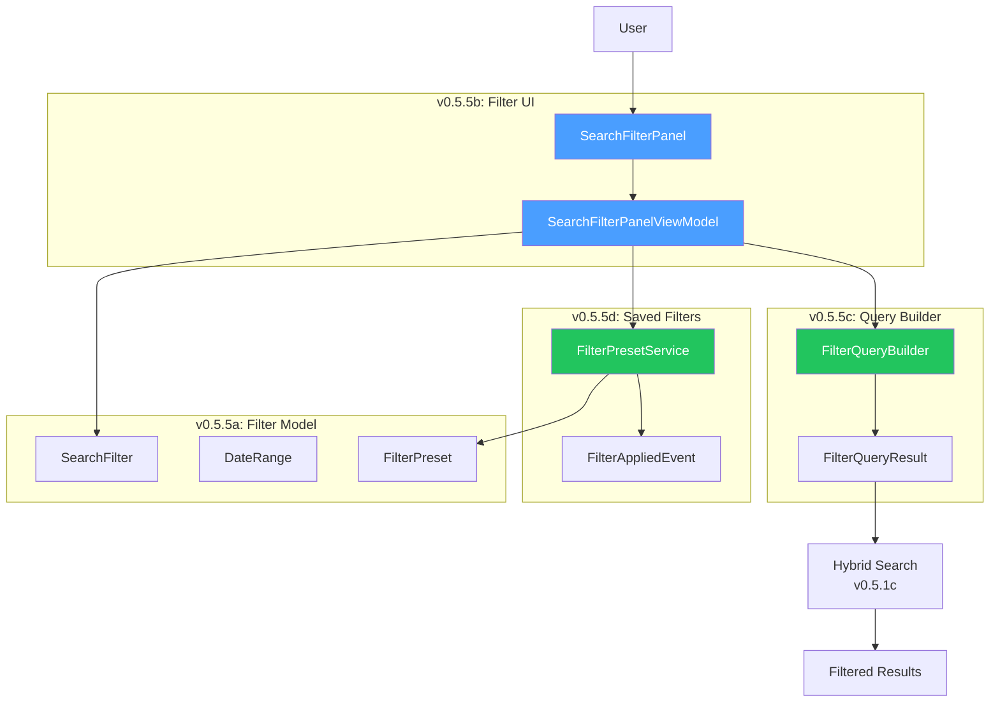
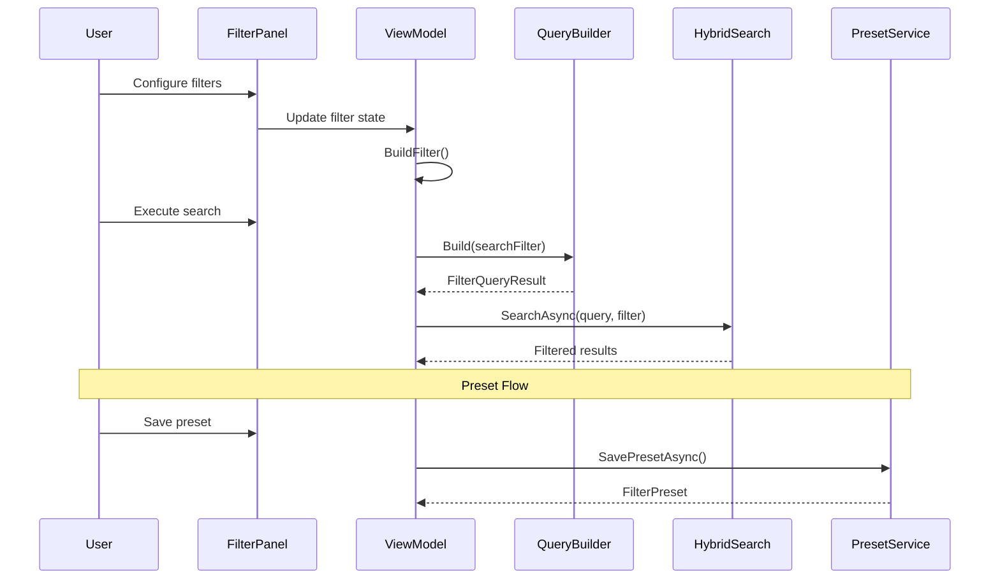

# LCS-DES-055: Design Specification Index — The Filter System

## Document Control

| Field                | Value                             |
| :------------------- | :-------------------------------- |
| **Document ID**      | LCS-DES-055-INDEX                 |
| **Feature ID**       | RAG-055                           |
| **Feature Name**     | The Filter System (Scoped Search) |
| **Target Version**   | v0.5.5                            |
| **Module Scope**     | Lexichord.Modules.RAG             |
| **Swimlane**         | Memory                            |
| **License Tier**     | Core (basic) / Writer Pro (full)  |
| **Feature Gate Key** | `FeatureFlags.RAG.FilterSystem`   |
| **Status**           | Draft                             |
| **Last Updated**     | 2026-01-27                        |

---

## 1. Executive Summary

**v0.5.5** delivers the **Filter System** — scoped search that allows users to narrow results to specific documents, folders, file types, or metadata criteria. This release transforms Lexichord's search from corpus-wide to precision-scoped.

### 1.1 The Problem

Users struggle with search noise because:

- Large documentation projects return too many results
- No way to focus on specific project areas (API docs, guides, release notes)
- Recently modified documents are buried among stale content
- Frequently-used scoping must be manually reconfigured

### 1.2 The Solution

Implement a comprehensive filtering system that:

- **Defines flexible criteria** for path, extension, date, and metadata filtering
- **Provides intuitive UI** with folder tree, extension toggles, and date pickers
- **Generates efficient queries** that preserve HNSW index performance
- **Saves presets** for quick reuse of common filter combinations

### 1.3 Business Value

| Value                 | Description                                      |
| :-------------------- | :----------------------------------------------- |
| **Precision**         | Narrow results to exactly what users need        |
| **Workflow**          | Filters respect natural project structure        |
| **Efficiency**        | Saved presets eliminate repetitive configuration |
| **Team Productivity** | Shared presets standardize team search practices |
| **Foundation**        | Enables AI-suggested filtering in v0.6.x         |

---

## 2. Related Documents

### 2.1 Scope Breakdown Document

| Document                            | Description                         |
| :---------------------------------- | :---------------------------------- |
| **[LCS-SBD-055](./LCS-SBD-055.md)** | Scope Breakdown — The Filter System |

### 2.2 Sub-Part Design Specifications

| Sub-Part | Document                              | Title                | Description                         |
| :------- | :------------------------------------ | :------------------- | :---------------------------------- |
| v0.5.5a  | **[LCS-DES-055a](./LCS-DES-055a.md)** | Filter Model         | Data structures for filter criteria |
| v0.5.5b  | **[LCS-DES-055b](./LCS-DES-055b.md)** | Filter UI Component  | Panel with folder tree and toggles  |
| v0.5.5c  | **[LCS-DES-055c](./LCS-DES-055c.md)** | Filter Query Builder | SQL generation from filter criteria |
| v0.5.5d  | **[LCS-DES-055d](./LCS-DES-055d.md)** | Saved Filters        | Preset persistence and management   |

---

## 3. Architecture Overview

### 3.1 Component Diagram



### 3.2 Filter Pipeline Flow



---

## 4. Dependencies

### 4.1 Upstream Dependencies (Required)

| Interface              | Source Version        | Purpose                    |
| :--------------------- | :-------------------- | :------------------------- |
| `IHybridSearchService` | v0.5.1c               | Search with filter support |
| `IChunkRepository`     | v0.4.1c               | Filtered chunk queries     |
| `IDocumentRepository`  | v0.4.1c               | Document metadata access   |
| `IQueryAnalyzer`       | v0.5.4a               | Smart filter suggestions   |
| `ReferenceView`        | v0.4.6a               | Parent panel container     |
| `ISettingsService`     | v0.1.6a               | Preset persistence         |
| `IWorkspaceService`    | v0.1.2a               | Workspace root for paths   |
| `ILicenseContext`      | v0.0.4c               | License tier checking      |
| `IMediator`            | v0.0.7a               | Event publishing           |
| `ViewModelBase`        | CommunityToolkit.Mvvm | Observable base            |

### 4.2 Downstream Consumers (Future)

| Version | Feature        | Consumes                               |
| :------ | :------------- | :------------------------------------- |
| v0.5.6  | Answer Preview | Filter by type for snippet formatting  |
| v0.5.7  | Reference Dock | Active filter display in unified bar   |
| v0.5.8  | Hardening      | Performance testing with filters       |
| v0.6.x  | AI Assistant   | AI-suggested filters from query intent |

---

## 5. License Gating Strategy

The Filter System uses a **Tiered Functionality** strategy.

### 5.1 Behavior by License Tier

| Tier       | Path Filter | Extension | Date Range | Presets    |
| :--------- | :---------- | :-------- | :--------- | :--------- |
| Core       | ✓           | ✓         | Disabled   | Disabled   |
| Writer Pro | ✓           | ✓         | ✓          | ✓          |
| Teams      | ✓           | ✓         | ✓          | ✓ + Shared |
| Enterprise | ✓           | ✓         | ✓          | ✓ + Shared |

### 5.2 Implementation Pattern

```csharp
// Core tier gets basic path and extension filtering
var filter = new SearchFilter(
    PathPatterns: userSelectedPaths,
    FileExtensions: userSelectedExtensions);

// Date range only for Writer Pro+
if (_licenseContext.HasFeature(FeatureFlags.RAG.DateRangeFilter))
{
    filter = filter with { ModifiedRange = dateRange };
}

// Presets only for Writer Pro+
if (!_licenseContext.HasFeature(FeatureFlags.RAG.SavedPresets))
{
    ShowUpgradePrompt("Filter Presets");
    return;
}
```

---

## 6. Key Interfaces Summary

| Interface              | Defined In | Purpose                   |
| :--------------------- | :--------- | :------------------------ |
| `IFilterQueryBuilder`  | v0.5.5c    | Generate SQL from filters |
| `IFilterPresetService` | v0.5.5d    | Manage saved presets      |
| `IFilterValidator`     | v0.5.5a    | Validate filter criteria  |

| Record/DTO          | Defined In | Purpose                   |
| :------------------ | :--------- | :------------------------ |
| `SearchFilter`      | v0.5.5a    | Filter criteria container |
| `DateRange`         | v0.5.5a    | Temporal bounds           |
| `FilterPreset`      | v0.5.5a    | Saved configuration       |
| `FilterQueryResult` | v0.5.5c    | SQL clauses + parameters  |

| Event                | Defined In | Purpose               |
| :------------------- | :--------- | :-------------------- |
| `FilterAppliedEvent` | v0.5.5d    | Filter config changed |

---

## 7. Database Schema Summary

### 7.1 Query Patterns

No new tables are required. Filters generate WHERE clauses against existing tables:

| Table       | Columns Used                                 |
| :---------- | :------------------------------------------- |
| `documents` | `file_path`, `file_extension`, `modified_at` |
| `chunks`    | `document_id`, `heading`                     |

### 7.2 Query Strategy

Filters are applied via CTE to ensure HNSW index is still used for vector similarity:

```sql
WITH filtered_docs AS (
    SELECT id FROM documents
    WHERE file_path LIKE @pattern
      AND file_extension = ANY(@extensions)
      AND modified_at >= @start
)
SELECT c.*, c.embedding <=> @vector AS distance
FROM chunks c
WHERE c.document_id IN (SELECT id FROM filtered_docs)
ORDER BY c.embedding <=> @vector
LIMIT @topK;
```

---

## 8. Implementation Checklist Summary

| Sub-Part    | Tasks                | Est. Hours   |
| :---------- | :------------------- | :----------- |
| v0.5.5a     | Filter Model         | 5.0          |
| v0.5.5b     | Filter UI Component  | 11.0         |
| v0.5.5c     | Filter Query Builder | 7.5          |
| v0.5.5d     | Saved Filters        | 7.5          |
| Integration | DI, Events, Tests    | 2.5          |
| **Total**   |                      | **36 hours** |

See [LCS-SBD-055](./LCS-SBD-055.md) Section 4 for the detailed task breakdown.

---

## 9. Success Criteria Summary

| Category        | Criterion                   | Target           |
| :-------------- | :-------------------------- | :--------------- |
| **Performance** | Filter application overhead | < 50ms           |
| **Performance** | Folder tree load time       | < 200ms          |
| **Quality**     | Glob pattern accuracy       | 100%             |
| **UX**          | Preset save/load latency    | < 50ms           |
| **Improvement** | Search result precision     | 30%+ improvement |

See [LCS-SBD-055](./LCS-SBD-055.md) Section 9 for full success metrics.

---

## 10. Test Coverage Summary

| Sub-Part | Unit Tests                           | Integration Tests       |
| :------- | :----------------------------------- | :---------------------- |
| v0.5.5a  | Filter criteria, DateRange factories | Full pipeline           |
| v0.5.5b  | ViewModel state, folder tree logic   | UI interaction          |
| v0.5.5c  | SQL generation, glob conversion      | Search with filters     |
| v0.5.5d  | Preset CRUD, persistence             | Preset load/apply cycle |

See individual design specs for detailed test scenarios.

---

## 11. What This Enables

| Version | Feature        | Uses From v0.5.5                         |
| :------ | :------------- | :--------------------------------------- |
| v0.5.6  | Answer Preview | Filter by doc type for snippets          |
| v0.5.7  | Reference Dock | Display active filters in search bar     |
| v0.5.8  | Hardening      | Performance testing with complex filters |
| v0.6.x  | AI Assistant   | AI-suggested filters from intent         |
| v0.7.x  | Smart Filters  | ML-based filter recommendations          |

---

## Document History

| Version | Date       | Author         | Changes       |
| :------ | :--------- | :------------- | :------------ |
| 1.0     | 2026-01-27 | Lead Architect | Initial draft |
