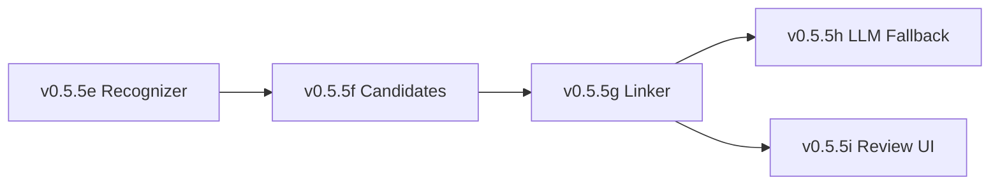

# LCS-DES-055-KG Index: Entity Linking Design Specifications

## Document Control

| Field | Value |
| :--- | :--- |
| **System Breakdown** | LCS-SBD-055-KG |
| **Version** | v0.5.5 |
| **Codename** | Entity Linking (CKVS Phase 2a) |
| **Total Sub-Parts** | 5 |
| **Total Estimated Hours** | 30 hours |
| **Status** | Draft |
| **Last Updated** | 2026-01-31 |

---

## Sub-Part Overview

| ID | Document | Title | Hours | Description |
| :- | :------- | :---- | :---- | :---------- |
| v0.5.5e | [LCS-DES-055-KG-e](LCS-DES-055-KG-e.md) | Entity Recognizer | 8 | NER with SpaCy + custom rules |
| v0.5.5f | [LCS-DES-055-KG-f](LCS-DES-055-KG-f.md) | Candidate Generator | 5 | Generate graph entity candidates |
| v0.5.5g | [LCS-DES-055-KG-g](LCS-DES-055-KG-g.md) | Entity Linker | 8 | Score and rank candidates |
| v0.5.5h | [LCS-DES-055-KG-h](LCS-DES-055-KG-h.md) | LLM Fallback | 4 | LLM disambiguation for low confidence |
| v0.5.5i | [LCS-DES-055-KG-i](LCS-DES-055-KG-i.md) | Linking Review UI | 5 | Human review of uncertain links |

---

## Architecture Summary

```
┌─────────────────────────────────────────────────────────────────┐
│                  v0.5.5-KG Entity Linking                        │
├─────────────────────────────────────────────────────────────────┤
│                                                                  │
│  ┌─────────────────────────────────────────────────────────────┐│
│  │                    NLU Pipeline                              ││
│  │                                                              ││
│  │  ┌─────────────────┐    ┌─────────────────┐                 ││
│  │  │   v0.5.5e       │    │   v0.5.5f       │                 ││
│  │  │   Entity        │───►│   Candidate     │                 ││
│  │  │   Recognizer    │    │   Generator     │                 ││
│  │  │   ───────────   │    │   ───────────   │                 ││
│  │  │   SpaCy NER     │    │   Index Lookup  │                 ││
│  │  │   Custom Rules  │    │   Fuzzy Match   │                 ││
│  │  └─────────────────┘    └────────┬────────┘                 ││
│  │                                  │                           ││
│  │                                  ▼                           ││
│  │                         ┌─────────────────┐                 ││
│  │                         │   v0.5.5g       │                 ││
│  │                         │   Entity        │                 ││
│  │                         │   Linker        │                 ││
│  │                         │   ───────────   │                 ││
│  │                         │   Multi-factor  │                 ││
│  │                         │   Scoring       │                 ││
│  │                         └────────┬────────┘                 ││
│  │                                  │                           ││
│  │                    ┌─────────────┼─────────────┐            ││
│  │                    │             │             │             ││
│  │                    ▼             ▼             ▼             ││
│  │             High Conf      Med Conf       Low Conf          ││
│  │               (>0.8)      (0.5-0.8)        (<0.5)           ││
│  │                 │             │               │              ││
│  │                 │             ▼               │              ││
│  │                 │    ┌─────────────────┐     │              ││
│  │                 │    │   v0.5.5h       │     │              ││
│  │                 │    │   LLM Fallback  │     │              ││
│  │                 │    │   ───────────   │     │              ││
│  │                 │    │   Claude API    │     │              ││
│  │                 │    │   Disambiguation│     │              ││
│  │                 │    └────────┬────────┘     │              ││
│  │                 │             │              │               ││
│  │                 └──────┬──────┘              │              ││
│  │                        │                     │               ││
│  │                        ▼                     ▼               ││
│  │                 ┌─────────────────────────────────┐         ││
│  │                 │         Linked Entities         │         ││
│  │                 └─────────────────────────────────┘         ││
│  │                                  │                           ││
│  │                                  │ (needs review)            ││
│  │                                  ▼                           ││
│  │                         ┌─────────────────┐                 ││
│  │                         │   v0.5.5i       │                 ││
│  │                         │   Linking       │                 ││
│  │                         │   Review UI     │                 ││
│  │                         │   ───────────   │                 ││
│  │                         │   Human Review  │                 ││
│  │                         │   Accept/Reject │                 ││
│  │                         └─────────────────┘                 ││
│  │                                                              ││
│  └─────────────────────────────────────────────────────────────┘│
│                                                                  │
└─────────────────────────────────────────────────────────────────┘
```

---

## Key Interfaces

| Interface | Module | Purpose |
| :-------- | :----- | :------ |
| `IEntityRecognizer` | v0.5.5e | Recognize entity mentions in text |
| `ICandidateGenerator` | v0.5.5f | Generate candidate entities from graph |
| `IEntityLinkingService` | v0.5.5g | Score, rank, and link mentions to entities |
| `ILLMFallback` | v0.5.5h | LLM-based disambiguation |
| `ILinkingReviewService` | v0.5.5i | Human review queue management |

---

## Dependencies

### Upstream (Required)

| Component | Version | Usage |
| :-------- | :------ | :---- |
| Entity Extraction | v0.4.5g | Source mentions for recognition |
| Graph Repository | v0.4.5e | Entity candidate queries |
| Schema Registry | v0.4.5f | Type metadata for scoring |
| LLM Gateway | v0.6.1 | LLM API access for disambiguation |
| SpaCy (Python) | 3.5+ | NER model via interop |

### Downstream (Consumers)

| Component | Version | Usage |
| :-------- | :------ | :---- |
| Claim Extraction | v0.5.6-KG | Linked entities as claim subjects |
| Validation Engine | v0.6.5-KG | Validate claims against entities |
| Entity-Aware Search | v0.5.5 | Search by linked entities |

---

## License Gating

| Tier | Recognizer | Candidates | Linker | LLM | Review UI |
| :--- | :--------- | :--------- | :----- | :-- | :-------- |
| Core | ✗ | ✗ | ✗ | ✗ | ✗ |
| WriterPro | Rules only | Exact match | Name + Type | ✗ | View only |
| Teams | Full | Full | Full scoring | ✓ | Full |
| Enterprise | Custom models | Full | Full | ✓ | Full + bulk |

---

## Scoring Algorithm

```
ALGORITHM: Entity Linking Score

INPUT: EntityMention mention, LinkCandidate candidate, LinkingContext context
OUTPUT: float final_score (0.0 - 1.0)

WEIGHTS (configurable):
  w_name = 0.30      # Name similarity
  w_type = 0.20      # Type compatibility
  w_context = 0.25   # Context relevance
  w_cooccur = 0.15   # Co-occurrence
  w_popular = 0.10   # Popularity

COMPUTE SCORES:
  name_score = JaroWinkler(mention.value, candidate.name)
  type_score = mention.type == candidate.type ? 1.0 : 0.3
  context_score = Jaccard(context_words, property_words)
  cooccur_score = |linked_entities ∩ related_entities| / |related_entities|
  popular_score = candidate.popularity_score

COMBINE:
  final_score = w_name * name_score
              + w_type * type_score
              + w_context * context_score
              + w_cooccur * cooccur_score
              + w_popular * popular_score

THRESHOLDS:
  if final_score >= 0.8: ACCEPT (high confidence)
  if final_score >= 0.5: LLM_FALLBACK or REVIEW
  if final_score < 0.5:  UNLINKED
```

---

## Performance Targets

| Metric | Target | Measurement |
| :----- | :----- | :---------- |
| Recognition precision | >80% | Test corpus |
| Recognition recall | >80% | Test corpus |
| Linking accuracy | >75% | Human evaluation |
| Processing speed | <30s / 100 pages | Benchmark |
| LLM fallback rate | <20% | Telemetry |
| Single mention latency | <100ms | Real-time |

---

## Implementation Order



1. **v0.5.5e**: Entity Recognizer first (input to pipeline)
2. **v0.5.5f**: Candidate Generator (needs recognizer output)
3. **v0.5.5g**: Entity Linker (core logic, needs candidates)
4. **v0.5.5h**: LLM Fallback (optional enhancement)
5. **v0.5.5i**: Review UI (can parallel with LLM fallback)

---

## Testing Strategy

| Sub-Part | Unit Tests | Integration Tests |
| :------- | :--------- | :---------------- |
| v0.5.5e | Pattern matching, SpaCy mock | Full NER pipeline |
| v0.5.5f | Index lookup, fuzzy matching | Graph queries |
| v0.5.5g | All scorers, combination | End-to-end linking |
| v0.5.5h | Prompt building, parsing | LLM API (mocked) |
| v0.5.5i | ViewModel commands | Review service flow |

---

## Changelog

| Version | Date | Author | Changes |
| :------ | :--- | :----- | :------ |
| 1.0 | 2026-01-31 | Lead Architect | Initial creation |

---
