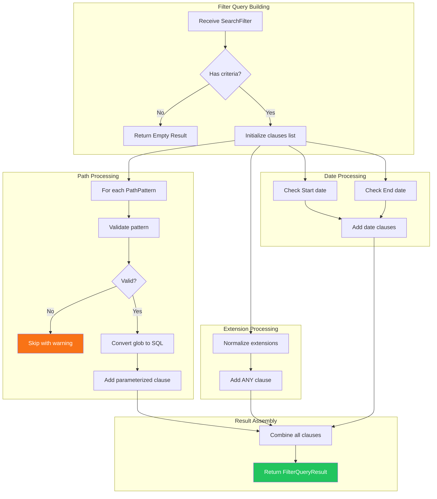

# LCS-DES-055c: Design Specification — Filter Query Builder

## Metadata & Categorization

| Field            | Value                           |
| :--------------- | :------------------------------ |
| **Document ID**  | LCS-DES-055c                    |
| **Sub-Part ID**  | RAG-055c                        |
| **Title**        | Filter Query Builder            |
| **Version**      | v0.5.5c                         |
| **Module**       | `Lexichord.Modules.RAG`         |
| **Depends On**   | v0.5.5a (Filter Model), v0.4.1c |
| **Required By**  | v0.5.1c (HybridSearchService)   |
| **License Tier** | Core                            |
| **Status**       | Draft                           |
| **Last Updated** | 2026-01-27                      |

---

## 1. Executive Summary

This sub-part implements the translation layer between filter UI criteria and SQL query components. The `FilterQueryBuilder` generates parameterized WHERE clauses that integrate with vector search while preserving HNSW index performance.

### 1.1 Objectives

1. Translate `SearchFilter` criteria into efficient SQL WHERE clauses
2. Preserve HNSW vector index utilization with CTE-based filtering
3. Convert glob patterns to SQL LIKE patterns safely
4. Generate parameterized queries to prevent SQL injection
5. Support extension with future filter criteria (tags, metadata)

### 1.2 Key Deliverables

- `IFilterQueryBuilder` interface in Abstractions
- `FilterQueryBuilder` implementation
- `FilterQueryResult` record for query components
- Glob-to-SQL pattern conversion utility
- Unit tests for all query generation scenarios

---

## 2. Architecture & Modular Strategy

### 2.1 Dependencies

| Dependency          | Source  | Purpose                 |
| :------------------ | :------ | :---------------------- |
| `SearchFilter`      | v0.5.5a | Filter criteria input   |
| `DateRange`         | v0.5.5a | Temporal filter bounds  |
| `IChunkRepository`  | v0.4.1c | Query execution context |
| `DynamicParameters` | Dapper  | Query parameterization  |

### 2.2 Licensing Behavior

The query builder itself has no license restrictions. License gating occurs at the UI layer (v0.5.5b) before filters reach the query builder.

---

## 3. Data Contract (API)

### 3.1 IFilterQueryBuilder Interface

```csharp
namespace Lexichord.Abstractions.Contracts;

/// <summary>
/// Builds SQL query components from search filter criteria.
/// </summary>
/// <remarks>
/// <para>The builder generates parameterized queries to prevent SQL injection.</para>
/// <para>Filter criteria are combined with AND logic.</para>
/// <para>The resulting clauses integrate with vector search via CTE.</para>
/// </remarks>
public interface IFilterQueryBuilder
{
    /// <summary>
    /// Builds SQL WHERE clause components from the filter.
    /// </summary>
    /// <param name="filter">The search filter criteria.</param>
    /// <returns>SQL clauses and parameters ready for query execution.</returns>
    FilterQueryResult Build(SearchFilter filter);

    /// <summary>
    /// Converts a glob pattern to SQL LIKE pattern.
    /// </summary>
    /// <param name="glob">The glob pattern (e.g., "docs/**/*.md").</param>
    /// <returns>The equivalent SQL LIKE pattern.</returns>
    string ConvertGlobToSql(string glob);
}
```

### 3.2 FilterQueryResult Record

```csharp
namespace Lexichord.Abstractions.Contracts;

/// <summary>
/// The result of building a filter query, containing SQL clauses and parameters.
/// </summary>
/// <remarks>
/// <para>WhereClauses are combined with AND to form the full condition.</para>
/// <para>If RequiresDocumentJoin is true, the query must join with documents table.</para>
/// </remarks>
/// <param name="WhereClauses">List of WHERE clause conditions.</param>
/// <param name="Parameters">Dynamic parameters for the query.</param>
/// <param name="RequiresDocumentJoin">Whether the query needs to join with documents table.</param>
public record FilterQueryResult(
    IReadOnlyList<string> WhereClauses,
    DynamicParameters Parameters,
    bool RequiresDocumentJoin)
{
    /// <summary>
    /// Gets whether any filter clauses were generated.
    /// </summary>
    public bool HasClauses => WhereClauses.Count > 0;

    /// <summary>
    /// Combines all WHERE clauses with AND.
    /// </summary>
    /// <returns>A single WHERE clause string, or empty if no clauses.</returns>
    public string ToWhereClause()
    {
        if (WhereClauses.Count == 0)
            return string.Empty;

        return string.Join(" AND ", WhereClauses);
    }

    /// <summary>
    /// Returns an empty result with no clauses.
    /// </summary>
    public static FilterQueryResult Empty => new(
        Array.Empty<string>(),
        new DynamicParameters(),
        RequiresDocumentJoin: false);
}
```

### 3.3 FilterQueryBuilder Implementation

```csharp
namespace Lexichord.Modules.RAG.Services;

/// <summary>
/// Builds SQL filter clauses from SearchFilter criteria.
/// Generates parameterized queries that combine with vector search.
/// </summary>
public sealed class FilterQueryBuilder : IFilterQueryBuilder
{
    private readonly ILogger<FilterQueryBuilder> _logger;

    /// <summary>
    /// Characters that need escaping in SQL LIKE patterns.
    /// </summary>
    private static readonly char[] SqlLikeSpecialChars = { '%', '_', '[', ']' };

    public FilterQueryBuilder(ILogger<FilterQueryBuilder> logger)
    {
        _logger = logger;
    }

    /// <inheritdoc />
    public FilterQueryResult Build(SearchFilter filter)
    {
        _logger.LogDebug(
            "Building filter query: {PathCount} paths, {ExtCount} extensions",
            filter.PathPatterns?.Count ?? 0,
            filter.FileExtensions?.Count ?? 0);

        if (!filter.HasCriteria)
        {
            return FilterQueryResult.Empty;
        }

        var clauses = new List<string>();
        var parameters = new DynamicParameters();
        var requiresDocJoin = false;

        // Build path pattern clauses
        BuildPathClauses(filter, clauses, parameters, ref requiresDocJoin);

        // Build extension clauses
        BuildExtensionClauses(filter, clauses, parameters, ref requiresDocJoin);

        // Build date range clauses
        BuildDateRangeClauses(filter, clauses, parameters, ref requiresDocJoin);

        // Build heading filter clause
        BuildHeadingClause(filter, clauses);

        _logger.LogDebug("Generated SQL clauses: {ClauseCount}", clauses.Count);

        return new FilterQueryResult(clauses, parameters, requiresDocJoin);
    }

    /// <inheritdoc />
    public string ConvertGlobToSql(string glob)
    {
        if (string.IsNullOrEmpty(glob))
            return "%";

        var sb = new StringBuilder();

        // Escape SQL LIKE special characters first
        foreach (var ch in glob)
        {
            if (SqlLikeSpecialChars.Contains(ch))
            {
                sb.Append('[').Append(ch).Append(']');
            }
            else
            {
                sb.Append(ch);
            }
        }

        var escaped = sb.ToString();

        // Convert glob patterns to SQL LIKE
        // ** → % (any path depth)
        // * → % (any characters within segment)
        // ? → _ (single character)
        return escaped
            .Replace("**", "†")  // Temporary placeholder
            .Replace("*", "%")   // * → %
            .Replace("?", "_")   // ? → _
            .Replace("†", "%");  // ** → %
    }

    private void BuildPathClauses(
        SearchFilter filter,
        List<string> clauses,
        DynamicParameters parameters,
        ref bool requiresDocJoin)
    {
        if (filter.PathPatterns is null || filter.PathPatterns.Count == 0)
            return;

        var pathConditions = new List<string>();

        for (int i = 0; i < filter.PathPatterns.Count; i++)
        {
            var pattern = filter.PathPatterns[i];

            if (!IsValidPattern(pattern))
            {
                _logger.LogWarning("Skipping invalid glob pattern: {Pattern}", pattern);
                continue;
            }

            var paramName = $"pathPattern{i}";
            var sqlPattern = ConvertGlobToSql(pattern);

            parameters.Add(paramName, sqlPattern);
            pathConditions.Add($"d.file_path LIKE @{paramName}");

            _logger.LogDebug(
                "Pattern conversion: {Glob} → {Sql}",
                pattern, sqlPattern);
        }

        if (pathConditions.Count > 0)
        {
            // Multiple paths are OR'd together, then the group is AND'd with other filters
            clauses.Add($"({string.Join(" OR ", pathConditions)})");
            requiresDocJoin = true;
        }
    }

    private void BuildExtensionClauses(
        SearchFilter filter,
        List<string> clauses,
        DynamicParameters parameters,
        ref bool requiresDocJoin)
    {
        if (filter.FileExtensions is null || filter.FileExtensions.Count == 0)
            return;

        // Normalize extensions: ensure they start with a dot
        var extensions = filter.FileExtensions
            .Select(e => e.StartsWith('.') ? e.ToLowerInvariant() : $".{e.ToLowerInvariant()}")
            .Distinct()
            .ToArray();

        parameters.Add("extensions", extensions);
        clauses.Add("LOWER(d.file_extension) = ANY(@extensions)");
        requiresDocJoin = true;
    }

    private void BuildDateRangeClauses(
        SearchFilter filter,
        List<string> clauses,
        DynamicParameters parameters,
        ref bool requiresDocJoin)
    {
        if (filter.ModifiedRange is null)
            return;

        if (filter.ModifiedRange.Start.HasValue)
        {
            parameters.Add("modifiedStart", filter.ModifiedRange.Start.Value);
            clauses.Add("d.modified_at >= @modifiedStart");
            requiresDocJoin = true;
        }

        if (filter.ModifiedRange.End.HasValue)
        {
            parameters.Add("modifiedEnd", filter.ModifiedRange.End.Value);
            clauses.Add("d.modified_at <= @modifiedEnd");
            requiresDocJoin = true;
        }
    }

    private static void BuildHeadingClause(SearchFilter filter, List<string> clauses)
    {
        if (filter.HasHeadings == true)
        {
            clauses.Add("c.heading IS NOT NULL");
        }
    }

    private static bool IsValidPattern(string pattern)
    {
        // Reject empty, null bytes, and path traversal
        return !string.IsNullOrWhiteSpace(pattern) &&
               !pattern.Contains('\0') &&
               !pattern.Contains("..");
    }
}
```

---

## 4. Implementation Logic

### 4.1 Flow Diagram



### 4.2 Glob to SQL Conversion Algorithm

```text
CONVERT glob pattern to SQL LIKE:
│
├── Handle empty pattern
│   └── Return "%" (match all)
│
├── Escape SQL special characters:
│   ├── % → [%]
│   ├── _ → [_]
│   ├── [ → [[]
│   └── ] → []]
│
├── Convert glob wildcards:
│   ├── ** → % (multi-segment wildcard)
│   ├── * → % (single-segment wildcard)
│   └── ? → _ (single character)
│
└── Return converted pattern

EXAMPLES:
  "docs/**/*.md"    → "docs/%/%.md"
  "docs/*.txt"      → "docs/%.txt"
  "src/?.c"         → "src/_.c"
  "file[1].txt"     → "file[[]1].txt"
```

### 4.3 Query Integration with Vector Search

```sql
-- CTE approach: filter first, then vector search
WITH filtered_docs AS (
    SELECT d.id
    FROM documents d
    WHERE d.file_path LIKE 'docs/%'           -- PathPattern filter
      AND LOWER(d.file_extension) = ANY(ARRAY['.md', '.txt'])  -- Extension filter
      AND d.modified_at >= '2026-01-01'       -- Date range filter
),
vector_search AS (
    SELECT
        c.id,
        c.document_id,
        c.content,
        c.heading,
        c.embedding <=> @queryVector AS distance
    FROM chunks c
    WHERE c.document_id IN (SELECT id FROM filtered_docs)
      AND c.heading IS NOT NULL               -- Heading filter
    ORDER BY c.embedding <=> @queryVector
    LIMIT @topK
)
SELECT * FROM vector_search;
```

**Performance Note:** By using a CTE to pre-filter documents before the vector search, the HNSW index can still be utilized for approximate nearest neighbor search within the filtered subset. This is more efficient than applying filters as post-processing on all K nearest neighbors.

---

## 5. Data Persistence

N/A — This sub-part generates queries but does not persist data.

---

## 6. UI/UX Specifications

N/A — This sub-part is a backend service. UI is specified in v0.5.5b.

---

## 7. Observability & Logging

| Level   | Source             | Message Template                                                    |
| :------ | :----------------- | :------------------------------------------------------------------ |
| Debug   | FilterQueryBuilder | `"Building filter query: {PathCount} paths, {ExtCount} extensions"` |
| Debug   | FilterQueryBuilder | `"Pattern conversion: {Glob} → {Sql}"`                              |
| Debug   | FilterQueryBuilder | `"Generated SQL clauses: {ClauseCount}"`                            |
| Warning | FilterQueryBuilder | `"Skipping invalid glob pattern: {Pattern}"`                        |
| Error   | FilterQueryBuilder | `"Query building failed: {Error}"`                                  |

---

## 8. Security & Safety

| Concern             | Mitigation                                       |
| :------------------ | :----------------------------------------------- |
| SQL injection       | All values are parameterized, never interpolated |
| Path traversal      | Reject patterns containing ".."                  |
| Null byte injection | Reject patterns containing null bytes            |
| Denial of service   | Limit pattern complexity (max 10 patterns)       |
| Case sensitivity    | Normalize extensions to lowercase                |

---

## 9. Acceptance Criteria (QA)

| #   | Category        | Criterion                                |
| :-- | :-------------- | :--------------------------------------- |
| 1   | **Functional**  | Empty filter returns empty result        |
| 2   | **Functional**  | Path patterns generate LIKE clauses      |
| 3   | **Functional**  | Multiple paths are OR'd together         |
| 4   | **Functional**  | Extensions generate ANY clause           |
| 5   | **Functional**  | Date range generates >= and <= clauses   |
| 6   | **Functional**  | HasHeadings generates IS NOT NULL clause |
| 7   | **Conversion**  | Glob \*\* converts to SQL %              |
| 8   | **Conversion**  | Glob \* converts to SQL %                |
| 9   | **Conversion**  | Glob ? converts to SQL \_                |
| 10  | **Security**    | SQL special chars are escaped            |
| 11  | **Security**    | Path traversal patterns are rejected     |
| 12  | **Performance** | Query generation completes in < 5ms      |

---

## 10. Unit Tests

```csharp
[Trait("Category", "Unit")]
[Trait("Feature", "v0.5.5c")]
public class FilterQueryBuilderTests
{
    private readonly FilterQueryBuilder _sut;

    public FilterQueryBuilderTests()
    {
        _sut = new FilterQueryBuilder(Mock.Of<ILogger<FilterQueryBuilder>>());
    }

    [Fact]
    public void Build_EmptyFilter_ReturnsEmptyResult()
    {
        // Arrange
        var filter = SearchFilter.Empty;

        // Act
        var result = _sut.Build(filter);

        // Assert
        result.HasClauses.Should().BeFalse();
        result.RequiresDocumentJoin.Should().BeFalse();
    }

    [Fact]
    public void Build_SinglePathPattern_GeneratesLikeClause()
    {
        // Arrange
        var filter = new SearchFilter(PathPatterns: new[] { "docs/**" });

        // Act
        var result = _sut.Build(filter);

        // Assert
        result.WhereClauses.Should().ContainSingle()
            .Which.Should().Contain("LIKE");
        result.RequiresDocumentJoin.Should().BeTrue();
    }

    [Fact]
    public void Build_MultiplePaths_ORsClauses()
    {
        // Arrange
        var filter = new SearchFilter(PathPatterns: new[] { "docs/**", "specs/**" });

        // Act
        var result = _sut.Build(filter);

        // Assert
        result.WhereClauses.Should().ContainSingle()
            .Which.Should().Contain(" OR ");
    }

    [Fact]
    public void Build_MultipleExtensions_GeneratesAnyClause()
    {
        // Arrange
        var filter = new SearchFilter(FileExtensions: new[] { "md", "txt", "rst" });

        // Act
        var result = _sut.Build(filter);

        // Assert
        result.WhereClauses.Should().ContainSingle()
            .Which.Should().Contain("ANY(@extensions)");
        result.RequiresDocumentJoin.Should().BeTrue();
    }

    [Fact]
    public void Build_DateRangeStart_GeneratesGreaterThanClause()
    {
        // Arrange
        var filter = new SearchFilter(
            ModifiedRange: new DateRange(DateTime.UtcNow.AddDays(-7), null));

        // Act
        var result = _sut.Build(filter);

        // Assert
        result.WhereClauses.Should().ContainSingle()
            .Which.Should().Contain(">= @modifiedStart");
    }

    [Fact]
    public void Build_HasHeadingsTrue_GeneratesNotNullClause()
    {
        // Arrange
        var filter = new SearchFilter(HasHeadings: true);

        // Act
        var result = _sut.Build(filter);

        // Assert
        result.WhereClauses.Should().ContainSingle()
            .Which.Should().Be("c.heading IS NOT NULL");
        result.RequiresDocumentJoin.Should().BeFalse();
    }

    [Fact]
    public void Build_MultipleCriteria_CombinesWithAnd()
    {
        // Arrange
        var filter = new SearchFilter(
            PathPatterns: new[] { "docs/**" },
            FileExtensions: new[] { "md" },
            HasHeadings: true);

        // Act
        var result = _sut.Build(filter);

        // Assert
        result.WhereClauses.Should().HaveCount(3);
        var combined = result.ToWhereClause();
        combined.Should().Contain(" AND ");
    }

    [Theory]
    [InlineData("docs/**", "docs/%")]
    [InlineData("docs/*", "docs/%")]
    [InlineData("src/*.c", "src/%.c")]
    [InlineData("file?.txt", "file_.txt")]
    [InlineData("**/*.md", "%/%.md")]
    public void ConvertGlobToSql_ConvertsCorrectly(string glob, string expected)
    {
        // Act
        var result = _sut.ConvertGlobToSql(glob);

        // Assert
        result.Should().Be(expected);
    }

    [Fact]
    public void ConvertGlobToSql_EscapesSqlSpecialChars()
    {
        // Arrange
        var glob = "file[1]%.txt";

        // Act
        var result = _sut.ConvertGlobToSql(glob);

        // Assert
        result.Should().Contain("[[]");
        result.Should().Contain("[%]");
    }

    [Fact]
    public void Build_PathTraversalPattern_IsSkipped()
    {
        // Arrange
        var filter = new SearchFilter(PathPatterns: new[] { "docs/../secrets" });

        // Act
        var result = _sut.Build(filter);

        // Assert
        result.WhereClauses.Should().BeEmpty();
    }

    [Fact]
    public void Build_ExtensionsNormalizedToLowercase()
    {
        // Arrange
        var filter = new SearchFilter(FileExtensions: new[] { "MD", "TXT" });

        // Act
        var result = _sut.Build(filter);

        // Assert
        result.Parameters.Get<string[]>("extensions")
            .Should().AllSatisfy(e => e.Should().Be(e.ToLowerInvariant()));
    }
}

[Trait("Category", "Unit")]
[Trait("Feature", "v0.5.5c")]
public class FilterQueryResultTests
{
    [Fact]
    public void ToWhereClause_NoClauses_ReturnsEmpty()
    {
        // Arrange
        var result = FilterQueryResult.Empty;

        // Act
        var clause = result.ToWhereClause();

        // Assert
        clause.Should().BeEmpty();
    }

    [Fact]
    public void ToWhereClause_MultipleClauses_JoinsWithAnd()
    {
        // Arrange
        var result = new FilterQueryResult(
            new[] { "a = 1", "b = 2", "c = 3" },
            new DynamicParameters(),
            RequiresDocumentJoin: true);

        // Act
        var clause = result.ToWhereClause();

        // Assert
        clause.Should().Be("a = 1 AND b = 2 AND c = 3");
    }
}
```

---

## 11. Integration Example

### 11.1 Using FilterQueryBuilder with HybridSearchService

```csharp
namespace Lexichord.Modules.RAG.Services;

public sealed class HybridSearchService : IHybridSearchService
{
    private readonly IChunkRepository _chunkRepository;
    private readonly IFilterQueryBuilder _filterQueryBuilder;
    private readonly IEmbeddingService _embeddingService;

    public async Task<IReadOnlyList<SearchResult>> SearchAsync(
        string query,
        SearchFilter? filter = null,
        int topK = 10,
        CancellationToken ct = default)
    {
        // Generate embedding for query
        var queryVector = await _embeddingService.EmbedAsync(query, ct);

        // Build filter query components
        var filterResult = filter is not null
            ? _filterQueryBuilder.Build(filter)
            : FilterQueryResult.Empty;

        // Execute filtered vector search
        if (filterResult.RequiresDocumentJoin)
        {
            return await ExecuteFilteredSearchAsync(
                queryVector,
                filterResult,
                topK,
                ct);
        }

        // No document-level filters, use standard vector search
        return await ExecuteVectorSearchAsync(
            queryVector,
            filterResult,
            topK,
            ct);
    }

    private async Task<IReadOnlyList<SearchResult>> ExecuteFilteredSearchAsync(
        float[] queryVector,
        FilterQueryResult filterResult,
        int topK,
        CancellationToken ct)
    {
        const string sql = """
            WITH filtered_docs AS (
                SELECT d.id
                FROM documents d
                WHERE {0}
            ),
            vector_results AS (
                SELECT
                    c.id,
                    c.document_id,
                    c.content,
                    c.heading,
                    c.embedding <=> @queryVector AS distance
                FROM chunks c
                WHERE c.document_id IN (SELECT id FROM filtered_docs)
                    {1}
                ORDER BY c.embedding <=> @queryVector
                LIMIT @topK
            )
            SELECT * FROM vector_results;
            """;

        // Separate document-level and chunk-level clauses
        var docClauses = filterResult.WhereClauses
            .Where(c => c.StartsWith("d."))
            .ToList();

        var chunkClauses = filterResult.WhereClauses
            .Where(c => c.StartsWith("c."))
            .Select(c => $"AND {c}")
            .ToList();

        var finalSql = string.Format(
            sql,
            string.Join(" AND ", docClauses),
            string.Join(" ", chunkClauses));

        filterResult.Parameters.Add("queryVector", queryVector);
        filterResult.Parameters.Add("topK", topK);

        return await _chunkRepository.QueryAsync<SearchResult>(
            finalSql,
            filterResult.Parameters,
            ct);
    }
}
```

---

## Document History

| Version | Date       | Author         | Changes       |
| :------ | :--------- | :------------- | :------------ |
| 1.0     | 2026-01-27 | Lead Architect | Initial draft |
