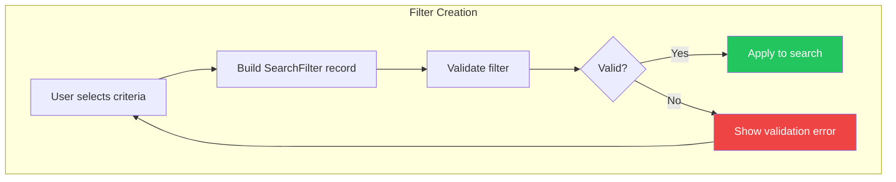

# LCS-DES-055a: Design Specification — Filter Model

## Metadata & Categorization

| Field            | Value                     |
| :--------------- | :------------------------ |
| **Document ID**  | LCS-DES-055a              |
| **Sub-Part ID**  | RAG-055a                  |
| **Title**        | Filter Model              |
| **Version**      | v0.5.5a                   |
| **Module**       | `Lexichord.Abstractions`  |
| **Depends On**   | None (foundational)       |
| **Required By**  | v0.5.5b, v0.5.5c, v0.5.5d |
| **License Tier** | Core                      |
| **Status**       | Draft                     |
| **Last Updated** | 2026-01-27                |

---

## 1. Executive Summary

This sub-part defines the core data structures for search filtering in Lexichord. It establishes `SearchFilter` as the primary container for all filter criteria, `DateRange` for temporal filtering, and `FilterPreset` for saved configurations.

### 1.1 Objectives

1. Define immutable record types for filter criteria
2. Provide convenience factory methods for common date ranges
3. Support future extension with tags and metadata filters
4. Ensure validation logic for filter correctness

### 1.2 Key Deliverables

- `SearchFilter` record with path, extension, date, and heading filters
- `DateRange` record with `LastDays()` and `LastHours()` factories
- `FilterPreset` record for saved filter configurations
- `IFilterValidator` interface for filter validation
- `FilterValidator` implementation

---

## 2. Architecture & Modular Strategy

### 2.1 Dependencies

| Dependency | Source | Purpose                  |
| :--------- | :----- | :----------------------- |
| None       | —      | No external dependencies |

This sub-part is foundational and has no dependencies on other Lexichord components.

### 2.2 Licensing Behavior

The filter model itself is license-agnostic. License gating occurs at the UI and service layers (v0.5.5b, v0.5.5d).

---

## 3. Data Contract (API)

### 3.1 SearchFilter Record

```csharp
namespace Lexichord.Abstractions.Contracts;

/// <summary>
/// Defines search filtering criteria to narrow results to specific documents or metadata.
/// </summary>
/// <remarks>
/// <para>All filter properties are optional; null values indicate no filtering.</para>
/// <para>Multiple criteria are combined with AND logic.</para>
/// <para>This record is immutable; use the <c>with</c> expression to modify.</para>
/// </remarks>
/// <param name="PathPatterns">
/// Glob patterns for path matching (e.g., "docs/**/*.md").
/// Supports standard glob syntax: ** (any path), * (any characters), ? (single character).
/// </param>
/// <param name="FileExtensions">
/// File extensions to include, without leading dot (e.g., "md", "txt").
/// Case-insensitive matching is applied.
/// </param>
/// <param name="ModifiedRange">
/// Date range for file modification time filtering.
/// Null indicates no temporal restriction.
/// </param>
/// <param name="Tags">
/// Document tags to filter by (future feature, currently unused).
/// </param>
/// <param name="HasHeadings">
/// When true, only include chunks that have heading context.
/// When false or null, no heading restriction is applied.
/// </param>
public record SearchFilter(
    IReadOnlyList<string>? PathPatterns = null,
    IReadOnlyList<string>? FileExtensions = null,
    DateRange? ModifiedRange = null,
    IReadOnlyList<string>? Tags = null,
    bool? HasHeadings = null)
{
    /// <summary>
    /// Gets whether any filter criteria are applied.
    /// </summary>
    /// <remarks>
    /// Returns true if at least one filter criterion is specified.
    /// An empty filter returns all results.
    /// </remarks>
    public bool HasCriteria =>
        PathPatterns?.Count > 0 ||
        FileExtensions?.Count > 0 ||
        ModifiedRange is not null ||
        Tags?.Count > 0 ||
        HasHeadings.HasValue;

    /// <summary>
    /// Gets the total number of distinct criteria applied.
    /// </summary>
    public int CriteriaCount
    {
        get
        {
            var count = 0;
            if (PathPatterns?.Count > 0) count++;
            if (FileExtensions?.Count > 0) count++;
            if (ModifiedRange is not null) count++;
            if (Tags?.Count > 0) count++;
            if (HasHeadings.HasValue) count++;
            return count;
        }
    }

    /// <summary>
    /// Returns an empty filter with no criteria.
    /// </summary>
    public static SearchFilter Empty => new();

    /// <summary>
    /// Creates a filter for a single path pattern.
    /// </summary>
    /// <param name="pattern">The glob pattern (e.g., "docs/**").</param>
    /// <returns>A SearchFilter with the path pattern applied.</returns>
    public static SearchFilter ForPath(string pattern) =>
        new(PathPatterns: new[] { pattern });

    /// <summary>
    /// Creates a filter for specific file extensions.
    /// </summary>
    /// <param name="extensions">Extensions without dots (e.g., "md", "txt").</param>
    /// <returns>A SearchFilter with the extensions applied.</returns>
    public static SearchFilter ForExtensions(params string[] extensions) =>
        new(FileExtensions: extensions);

    /// <summary>
    /// Creates a filter for recently modified documents.
    /// </summary>
    /// <param name="days">Number of days in the past.</param>
    /// <returns>A SearchFilter with the date range applied.</returns>
    public static SearchFilter RecentlyModified(int days) =>
        new(ModifiedRange: DateRange.LastDays(days));
}
```

### 3.2 DateRange Record

```csharp
namespace Lexichord.Abstractions.Contracts;

/// <summary>
/// Defines a date range for temporal filtering.
/// </summary>
/// <remarks>
/// <para>Either bound can be null to indicate an open-ended range.</para>
/// <para>Both bounds being null represents "any time" (no restriction).</para>
/// </remarks>
/// <param name="Start">Inclusive start date (null = no lower bound).</param>
/// <param name="End">Inclusive end date (null = no upper bound).</param>
public record DateRange(DateTime? Start, DateTime? End)
{
    /// <summary>
    /// Gets whether this is an open-ended range (at least one bound is null).
    /// </summary>
    public bool IsOpenEnded => Start is null || End is null;

    /// <summary>
    /// Gets whether this range has any bounds specified.
    /// </summary>
    public bool HasBounds => Start is not null || End is not null;

    /// <summary>
    /// Validates that Start is not after End.
    /// </summary>
    /// <returns>True if the range is valid; false if Start > End.</returns>
    public bool IsValid =>
        Start is null || End is null || Start <= End;

    /// <summary>
    /// Creates a "last N days" date range.
    /// </summary>
    /// <param name="days">Number of days to look back.</param>
    /// <returns>A DateRange from N days ago until now (no upper bound).</returns>
    public static DateRange LastDays(int days) =>
        new(DateTime.UtcNow.AddDays(-days), null);

    /// <summary>
    /// Creates a "last N hours" date range.
    /// </summary>
    /// <param name="hours">Number of hours to look back.</param>
    /// <returns>A DateRange from N hours ago until now (no upper bound).</returns>
    public static DateRange LastHours(int hours) =>
        new(DateTime.UtcNow.AddHours(-hours), null);

    /// <summary>
    /// Creates a date range for today only.
    /// </summary>
    /// <returns>A DateRange covering the current day.</returns>
    public static DateRange Today()
    {
        var today = DateTime.UtcNow.Date;
        return new(today, today.AddDays(1).AddTicks(-1));
    }

    /// <summary>
    /// Creates a date range for a specific month.
    /// </summary>
    /// <param name="year">The year.</param>
    /// <param name="month">The month (1-12).</param>
    /// <returns>A DateRange covering the specified month.</returns>
    public static DateRange ForMonth(int year, int month)
    {
        var start = new DateTime(year, month, 1, 0, 0, 0, DateTimeKind.Utc);
        var end = start.AddMonths(1).AddTicks(-1);
        return new(start, end);
    }
}
```

### 3.3 FilterPreset Record

```csharp
namespace Lexichord.Abstractions.Contracts;

/// <summary>
/// A saved filter configuration that can be reused.
/// </summary>
/// <remarks>
/// <para>Presets are stored as JSON in user settings.</para>
/// <para>Team presets (Teams+ tier) include <c>IsShared = true</c>.</para>
/// </remarks>
/// <param name="Id">Unique identifier for the preset.</param>
/// <param name="Name">User-defined display name.</param>
/// <param name="Filter">The filter criteria to apply.</param>
/// <param name="CreatedAt">When the preset was created (UTC).</param>
/// <param name="IsShared">Whether this preset is shared with team members.</param>
public record FilterPreset(
    Guid Id,
    string Name,
    SearchFilter Filter,
    DateTime CreatedAt,
    bool IsShared = false)
{
    /// <summary>
    /// Creates a new preset with a generated ID.
    /// </summary>
    /// <param name="name">The preset name.</param>
    /// <param name="filter">The filter criteria.</param>
    /// <returns>A new FilterPreset instance.</returns>
    public static FilterPreset Create(string name, SearchFilter filter) =>
        new(Guid.NewGuid(), name, filter, DateTime.UtcNow);

    /// <summary>
    /// Creates a copy of this preset with a new name.
    /// </summary>
    /// <param name="newName">The new preset name.</param>
    /// <returns>A new FilterPreset with the updated name.</returns>
    public FilterPreset Rename(string newName) =>
        this with { Name = newName };

    /// <summary>
    /// Creates a copy of this preset with updated filter criteria.
    /// </summary>
    /// <param name="newFilter">The updated filter criteria.</param>
    /// <returns>A new FilterPreset with the updated filter.</returns>
    public FilterPreset UpdateFilter(SearchFilter newFilter) =>
        this with { Filter = newFilter };
}
```

### 3.4 IFilterValidator Interface

```csharp
namespace Lexichord.Abstractions.Contracts;

/// <summary>
/// Validates search filter criteria for correctness.
/// </summary>
public interface IFilterValidator
{
    /// <summary>
    /// Validates a SearchFilter and returns any validation errors.
    /// </summary>
    /// <param name="filter">The filter to validate.</param>
    /// <returns>A list of validation errors, or empty if valid.</returns>
    IReadOnlyList<FilterValidationError> Validate(SearchFilter filter);

    /// <summary>
    /// Validates a single glob pattern.
    /// </summary>
    /// <param name="pattern">The pattern to validate.</param>
    /// <returns>A validation error if invalid, or null if valid.</returns>
    FilterValidationError? ValidatePattern(string pattern);
}

/// <summary>
/// Represents a filter validation error.
/// </summary>
/// <param name="Code">Error code for programmatic handling.</param>
/// <param name="Message">Human-readable error message.</param>
/// <param name="Property">The property that failed validation.</param>
public record FilterValidationError(
    string Code,
    string Message,
    string Property);
```

---

## 4. Implementation Logic

### 4.1 Flow Diagram



### 4.2 Filter Validation Logic

```text
VALIDATE SearchFilter:
│
├── Validate PathPatterns (if present):
│   ├── Each pattern must be non-empty
│   ├── No null bytes allowed
│   ├── No ".." path traversal
│   ├── Pattern must be valid glob syntax
│   └── Return error if any validation fails
│
├── Validate FileExtensions (if present):
│   ├── Each extension must be non-empty
│   ├── No path separators allowed
│   ├── Strip leading dots if present
│   └── Return error if any validation fails
│
├── Validate ModifiedRange (if present):
│   ├── If both Start and End provided:
│   │   └── Start must be <= End
│   └── Return error if Start > End
│
└── Return empty list if all valid
```

### 4.3 FilterValidator Implementation

```csharp
namespace Lexichord.Abstractions.Services;

/// <summary>
/// Validates search filter criteria for correctness.
/// </summary>
public sealed class FilterValidator : IFilterValidator
{
    /// <inheritdoc />
    public IReadOnlyList<FilterValidationError> Validate(SearchFilter filter)
    {
        var errors = new List<FilterValidationError>();

        // Validate path patterns
        if (filter.PathPatterns is not null)
        {
            for (int i = 0; i < filter.PathPatterns.Count; i++)
            {
                var error = ValidatePattern(filter.PathPatterns[i]);
                if (error is not null)
                {
                    errors.Add(error with { Property = $"PathPatterns[{i}]" });
                }
            }
        }

        // Validate extensions
        if (filter.FileExtensions is not null)
        {
            foreach (var ext in filter.FileExtensions)
            {
                if (string.IsNullOrWhiteSpace(ext))
                {
                    errors.Add(new FilterValidationError(
                        "ExtensionEmpty",
                        "File extension cannot be empty.",
                        "FileExtensions"));
                }
                else if (ext.Contains('/') || ext.Contains('\\'))
                {
                    errors.Add(new FilterValidationError(
                        "ExtensionInvalid",
                        $"File extension '{ext}' contains path separators.",
                        "FileExtensions"));
                }
            }
        }

        // Validate date range
        if (filter.ModifiedRange is not null && !filter.ModifiedRange.IsValid)
        {
            errors.Add(new FilterValidationError(
                "DateRangeInvalid",
                "Start date cannot be after end date.",
                "ModifiedRange"));
        }

        return errors;
    }

    /// <inheritdoc />
    public FilterValidationError? ValidatePattern(string pattern)
    {
        if (string.IsNullOrWhiteSpace(pattern))
        {
            return new FilterValidationError(
                "PatternEmpty",
                "Path pattern cannot be empty.",
                "PathPatterns");
        }

        if (pattern.Contains('\0'))
        {
            return new FilterValidationError(
                "PatternNullByte",
                "Path pattern contains null byte.",
                "PathPatterns");
        }

        if (pattern.Contains(".."))
        {
            return new FilterValidationError(
                "PatternTraversal",
                "Path pattern cannot contain '..' for path traversal.",
                "PathPatterns");
        }

        // Additional glob syntax validation could go here
        return null;
    }
}
```

---

## 5. Data Persistence

This sub-part defines data structures only. Persistence is handled by:

- **v0.5.5d (FilterPresetService):** Saves `FilterPreset` to JSON files
- **v0.5.5b (ViewModel):** Holds transient filter state during session

---

## 6. UI/UX Specifications

N/A — This sub-part defines data structures only. UI is specified in v0.5.5b.

---

## 7. Observability & Logging

| Level | Source          | Message Template                                    |
| :---- | :-------------- | :-------------------------------------------------- |
| Debug | FilterValidator | `"Validating filter with {CriteriaCount} criteria"` |
| Debug | FilterValidator | `"Path pattern validation: {Pattern} -> {Result}"`  |
| Warn  | FilterValidator | `"Invalid filter: {ErrorCode} - {Message}"`         |

---

## 8. Security & Safety

| Concern         | Mitigation                            |
| :-------------- | :------------------------------------ |
| Path traversal  | Reject patterns containing ".."       |
| Null injection  | Reject patterns containing null bytes |
| Extension abuse | Strip path separators from extensions |
| Date tampering  | Use UTC dates consistently            |

---

## 9. Acceptance Criteria (QA)

| #   | Category         | Criterion                                          |
| :-- | :--------------- | :------------------------------------------------- |
| 1   | **Functional**   | `SearchFilter.Empty` has `HasCriteria = false`     |
| 2   | **Functional**   | `SearchFilter.ForPath()` creates valid path filter |
| 3   | **Functional**   | `DateRange.LastDays(7)` creates correct range      |
| 4   | **Validation**   | Empty path patterns are rejected                   |
| 5   | **Validation**   | Path traversal patterns ("..") are rejected        |
| 6   | **Validation**   | Invalid date ranges (start > end) are rejected     |
| 7   | **Immutability** | Record `with` expressions create new instances     |
| 8   | **Nullability**  | All optional properties handle null correctly      |

---

## 10. Unit Tests

```csharp
[Trait("Category", "Unit")]
[Trait("Feature", "v0.5.5a")]
public class SearchFilterTests
{
    [Fact]
    public void Empty_HasNoCriteria()
    {
        // Act
        var filter = SearchFilter.Empty;

        // Assert
        filter.HasCriteria.Should().BeFalse();
        filter.CriteriaCount.Should().Be(0);
    }

    [Fact]
    public void ForPath_CreatesSinglePathFilter()
    {
        // Act
        var filter = SearchFilter.ForPath("docs/**");

        // Assert
        filter.HasCriteria.Should().BeTrue();
        filter.PathPatterns.Should().ContainSingle().Which.Should().Be("docs/**");
    }

    [Fact]
    public void ForExtensions_CreatesExtensionFilter()
    {
        // Act
        var filter = SearchFilter.ForExtensions("md", "txt");

        // Assert
        filter.HasCriteria.Should().BeTrue();
        filter.FileExtensions.Should().HaveCount(2);
    }

    [Fact]
    public void RecentlyModified_CreatesDateRangeFilter()
    {
        // Act
        var filter = SearchFilter.RecentlyModified(7);

        // Assert
        filter.HasCriteria.Should().BeTrue();
        filter.ModifiedRange.Should().NotBeNull();
        filter.ModifiedRange!.Start.Should().BeCloseTo(
            DateTime.UtcNow.AddDays(-7),
            TimeSpan.FromSeconds(1));
    }

    [Fact]
    public void CriteriaCount_CountsAllCriteria()
    {
        // Arrange
        var filter = new SearchFilter(
            PathPatterns: new[] { "docs/**" },
            FileExtensions: new[] { "md" },
            ModifiedRange: DateRange.LastDays(7),
            HasHeadings: true);

        // Assert
        filter.CriteriaCount.Should().Be(4);
    }
}

[Trait("Category", "Unit")]
[Trait("Feature", "v0.5.5a")]
public class DateRangeTests
{
    [Fact]
    public void LastDays_CreatesOpenEndedRange()
    {
        // Act
        var range = DateRange.LastDays(7);

        // Assert
        range.Start.Should().NotBeNull();
        range.End.Should().BeNull();
        range.IsOpenEnded.Should().BeTrue();
    }

    [Fact]
    public void IsValid_ReturnsFalse_WhenStartAfterEnd()
    {
        // Arrange
        var range = new DateRange(
            DateTime.UtcNow,
            DateTime.UtcNow.AddDays(-1));

        // Assert
        range.IsValid.Should().BeFalse();
    }

    [Fact]
    public void Today_CoversCurrentDay()
    {
        // Act
        var range = DateRange.Today();

        // Assert
        range.Start.Should().Be(DateTime.UtcNow.Date);
        range.End.Should().BeCloseTo(
            DateTime.UtcNow.Date.AddDays(1).AddTicks(-1),
            TimeSpan.FromMilliseconds(1));
    }
}

[Trait("Category", "Unit")]
[Trait("Feature", "v0.5.5a")]
public class FilterValidatorTests
{
    private readonly FilterValidator _sut = new();

    [Fact]
    public void Validate_EmptyFilter_ReturnsNoErrors()
    {
        // Act
        var errors = _sut.Validate(SearchFilter.Empty);

        // Assert
        errors.Should().BeEmpty();
    }

    [Fact]
    public void Validate_PathTraversal_ReturnsError()
    {
        // Arrange
        var filter = new SearchFilter(PathPatterns: new[] { "docs/../secrets" });

        // Act
        var errors = _sut.Validate(filter);

        // Assert
        errors.Should().ContainSingle()
            .Which.Code.Should().Be("PatternTraversal");
    }

    [Fact]
    public void Validate_InvalidDateRange_ReturnsError()
    {
        // Arrange
        var filter = new SearchFilter(
            ModifiedRange: new DateRange(DateTime.UtcNow, DateTime.UtcNow.AddDays(-1)));

        // Act
        var errors = _sut.Validate(filter);

        // Assert
        errors.Should().ContainSingle()
            .Which.Code.Should().Be("DateRangeInvalid");
    }
}
```

---

## Document History

| Version | Date       | Author         | Changes       |
| :------ | :--------- | :------------- | :------------ |
| 1.0     | 2026-01-27 | Lead Architect | Initial draft |
