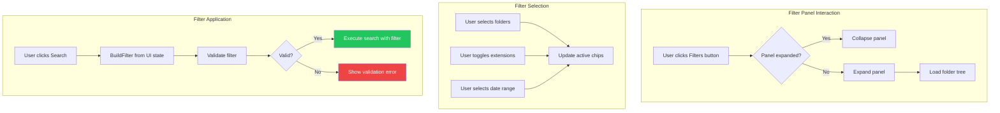

# LCS-DES-055b: Design Specification — Filter UI Component

## Metadata & Categorization

| Field            | Value                            |
| :--------------- | :------------------------------- |
| **Document ID**  | LCS-DES-055b                     |
| **Sub-Part ID**  | RAG-055b                         |
| **Title**        | Filter UI Component              |
| **Version**      | v0.5.5b                          |
| **Module**       | `Lexichord.Modules.RAG`          |
| **Depends On**   | v0.5.5a (Filter Model), v0.4.6a  |
| **Required By**  | v0.5.5c, v0.5.5d                 |
| **License Tier** | Core (basic) / Writer Pro (full) |
| **Status**       | Draft                            |
| **Last Updated** | 2026-01-27                       |

---

## 1. Executive Summary

This sub-part implements the visual filter panel UI for the search interface. It provides an intuitive, collapsible panel with folder tree selection, extension toggles, date range pickers, and saved preset management.

### 1.1 Objectives

1. Create a collapsible filter panel within the Reference Panel
2. Implement folder tree with checkboxes for path selection
3. Provide extension toggle buttons for common file types
4. Add date range picker with presets (Writer Pro)
5. Display active filters as dismissible chips
6. Support saved filter presets (Writer Pro)

### 1.2 Key Deliverables

- `SearchFilterPanel.axaml` — Main filter panel view
- `SearchFilterPanelViewModel` — Filter state management
- `FolderNodeViewModel` — Tree node representation
- `ExtensionToggleViewModel` — Extension toggle state
- `FilterChipViewModel` — Active filter chip display

---

## 2. Architecture & Modular Strategy

### 2.1 Dependencies

| Dependency          | Source                | Purpose                   |
| :------------------ | :-------------------- | :------------------------ |
| `SearchFilter`      | v0.5.5a               | Filter criteria container |
| `DateRange`         | v0.5.5a               | Temporal filtering        |
| `FilterPreset`      | v0.5.5a               | Saved configurations      |
| `IFilterValidator`  | v0.5.5a               | Criteria validation       |
| `ReferenceView`     | v0.4.6a               | Parent panel container    |
| `IWorkspaceService` | v0.1.2a               | Workspace root for paths  |
| `ILicenseContext`   | v0.0.4c               | License tier checking     |
| `ViewModelBase`     | CommunityToolkit.Mvvm | Observable base           |

### 2.2 Licensing Behavior

| Feature                | Core | Writer Pro+ |
| :--------------------- | :--- | :---------- |
| Path filtering (tree)  | ✓    | ✓           |
| Extension toggles      | ✓    | ✓           |
| Date range picker      | 🔒   | ✓           |
| Saved presets dropdown | 🔒   | ✓           |

---

## 3. Data Contract (API)

### 3.1 SearchFilterPanelViewModel

```csharp
namespace Lexichord.Modules.RAG.ViewModels;

/// <summary>
/// ViewModel for the search filter panel with folder tree, extension toggles,
/// date range picker, and saved presets.
/// </summary>
public partial class SearchFilterPanelViewModel : ViewModelBase
{
    private readonly IWorkspaceService _workspaceService;
    private readonly IFilterValidator _filterValidator;
    private readonly ILicenseContext _licenseContext;
    private readonly ILogger<SearchFilterPanelViewModel> _logger;

    /// <summary>
    /// Gets or sets whether the filter panel is expanded.
    /// </summary>
    [ObservableProperty]
    private bool _isExpanded;

    /// <summary>
    /// Gets the folder tree for path selection.
    /// </summary>
    [ObservableProperty]
    private ObservableCollection<FolderNodeViewModel> _folderTree = new();

    /// <summary>
    /// Gets the extension toggle buttons.
    /// </summary>
    [ObservableProperty]
    private ObservableCollection<ExtensionToggleViewModel> _extensionToggles = new();

    /// <summary>
    /// Gets the currently selected date range option.
    /// </summary>
    [ObservableProperty]
    private DateRangeOption _selectedDateRange = DateRangeOption.AnyTime;

    /// <summary>
    /// Gets or sets the custom start date for date range filtering.
    /// </summary>
    [ObservableProperty]
    private DateTime? _customStartDate;

    /// <summary>
    /// Gets or sets the custom end date for date range filtering.
    /// </summary>
    [ObservableProperty]
    private DateTime? _customEndDate;

    /// <summary>
    /// Gets the list of saved filter presets.
    /// </summary>
    [ObservableProperty]
    private ObservableCollection<FilterPresetViewModel> _savedPresets = new();

    /// <summary>
    /// Gets the active filter chips for display.
    /// </summary>
    [ObservableProperty]
    private ObservableCollection<FilterChipViewModel> _activeChips = new();

    /// <summary>
    /// Gets whether the date range feature is available (Writer Pro+).
    /// </summary>
    [ObservableProperty]
    private bool _canUseDateFilter;

    /// <summary>
    /// Gets whether saved presets are available (Writer Pro+).
    /// </summary>
    [ObservableProperty]
    private bool _canUseSavedPresets;

    /// <summary>
    /// Gets whether any filters are currently active.
    /// </summary>
    public bool HasActiveFilters => ActiveChips.Count > 0;

    /// <summary>
    /// Builds the current SearchFilter from UI state.
    /// </summary>
    public SearchFilter CurrentFilter => BuildFilter();

    public SearchFilterPanelViewModel(
        IWorkspaceService workspaceService,
        IFilterValidator filterValidator,
        ILicenseContext licenseContext,
        ILogger<SearchFilterPanelViewModel> logger)
    {
        _workspaceService = workspaceService;
        _filterValidator = filterValidator;
        _licenseContext = licenseContext;
        _logger = logger;

        InitializeLicenseFeatures();
        InitializeExtensionToggles();
    }

    /// <summary>
    /// Initializes the folder tree from workspace.
    /// </summary>
    [RelayCommand]
    public async Task LoadFolderTreeAsync()
    {
        var root = _workspaceService.GetWorkspaceRoot();
        if (root is null) return;

        FolderTree.Clear();
        var rootNode = await BuildFolderTreeAsync(root, maxDepth: 3);
        FolderTree.Add(rootNode);
    }

    /// <summary>
    /// Clears all active filters.
    /// </summary>
    [RelayCommand]
    public void ClearFilters()
    {
        foreach (var folder in GetAllFolderNodes())
            folder.IsSelected = false;

        foreach (var toggle in ExtensionToggles)
            toggle.IsSelected = false;

        SelectedDateRange = DateRangeOption.AnyTime;
        CustomStartDate = null;
        CustomEndDate = null;

        UpdateActiveChips();
        _logger.LogDebug("All filters cleared");
    }

    /// <summary>
    /// Removes a specific filter chip.
    /// </summary>
    [RelayCommand]
    public void RemoveChip(FilterChipViewModel chip)
    {
        switch (chip.Type)
        {
            case FilterChipType.Path:
                var folder = GetAllFolderNodes()
                    .FirstOrDefault(f => f.Path == chip.Value);
                if (folder is not null)
                    folder.IsSelected = false;
                break;

            case FilterChipType.Extension:
                var toggle = ExtensionToggles
                    .FirstOrDefault(t => t.Extension == chip.Value);
                if (toggle is not null)
                    toggle.IsSelected = false;
                break;

            case FilterChipType.DateRange:
                SelectedDateRange = DateRangeOption.AnyTime;
                break;
        }

        UpdateActiveChips();
    }

    /// <summary>
    /// Applies a saved preset.
    /// </summary>
    [RelayCommand]
    public void ApplyPreset(FilterPresetViewModel preset)
    {
        ClearFilters();

        // Apply path patterns
        if (preset.Filter.PathPatterns?.Count > 0)
        {
            foreach (var pattern in preset.Filter.PathPatterns)
            {
                var folder = GetAllFolderNodes()
                    .FirstOrDefault(f => MatchesPattern(f.Path, pattern));
                if (folder is not null)
                    folder.IsSelected = true;
            }
        }

        // Apply extensions
        if (preset.Filter.FileExtensions?.Count > 0)
        {
            foreach (var ext in preset.Filter.FileExtensions)
            {
                var toggle = ExtensionToggles
                    .FirstOrDefault(t => t.Extension.Equals(ext, StringComparison.OrdinalIgnoreCase));
                if (toggle is not null)
                    toggle.IsSelected = true;
            }
        }

        // Apply date range
        if (preset.Filter.ModifiedRange is not null)
        {
            SelectedDateRange = DateRangeOption.Custom;
            CustomStartDate = preset.Filter.ModifiedRange.Start;
            CustomEndDate = preset.Filter.ModifiedRange.End;
        }

        UpdateActiveChips();
        _logger.LogDebug("Applied preset: {PresetName}", preset.Name);
    }

    private SearchFilter BuildFilter()
    {
        var pathPatterns = GetSelectedPaths().ToList();
        var extensions = GetSelectedExtensions().ToList();
        var dateRange = BuildDateRange();

        return new SearchFilter(
            PathPatterns: pathPatterns.Count > 0 ? pathPatterns : null,
            FileExtensions: extensions.Count > 0 ? extensions : null,
            ModifiedRange: dateRange);
    }

    private DateRange? BuildDateRange()
    {
        if (!CanUseDateFilter)
            return null;

        return SelectedDateRange switch
        {
            DateRangeOption.AnyTime => null,
            DateRangeOption.LastDay => DateRange.LastDays(1),
            DateRangeOption.Last7Days => DateRange.LastDays(7),
            DateRangeOption.Last30Days => DateRange.LastDays(30),
            DateRangeOption.Custom => new DateRange(CustomStartDate, CustomEndDate),
            _ => null
        };
    }

    private void InitializeLicenseFeatures()
    {
        CanUseDateFilter = _licenseContext.HasFeature(FeatureFlags.RAG.DateRangeFilter);
        CanUseSavedPresets = _licenseContext.HasFeature(FeatureFlags.RAG.SavedPresets);
    }

    private void InitializeExtensionToggles()
    {
        ExtensionToggles = new ObservableCollection<ExtensionToggleViewModel>
        {
            new("md", "Markdown", "📝"),
            new("txt", "Text", "📄"),
            new("json", "JSON", "{}"),
            new("yaml", "YAML", "📋"),
            new("rst", "RST", "📑")
        };

        foreach (var toggle in ExtensionToggles)
        {
            toggle.PropertyChanged += (_, args) =>
            {
                if (args.PropertyName == nameof(ExtensionToggleViewModel.IsSelected))
                    UpdateActiveChips();
            };
        }
    }

    private void UpdateActiveChips()
    {
        ActiveChips.Clear();

        // Add path chips
        foreach (var path in GetSelectedPaths())
        {
            ActiveChips.Add(new FilterChipViewModel(
                FilterChipType.Path,
                $"📁 {Path.GetFileName(path.TrimEnd('/', '*'))}",
                path));
        }

        // Add extension chips
        foreach (var ext in GetSelectedExtensions())
        {
            ActiveChips.Add(new FilterChipViewModel(
                FilterChipType.Extension,
                $".{ext}",
                ext));
        }

        // Add date range chip
        if (CanUseDateFilter && SelectedDateRange != DateRangeOption.AnyTime)
        {
            var dateLabel = SelectedDateRange switch
            {
                DateRangeOption.LastDay => "Last 24 hours",
                DateRangeOption.Last7Days => "Last 7 days",
                DateRangeOption.Last30Days => "Last 30 days",
                DateRangeOption.Custom => "Custom range",
                _ => "Date filter"
            };

            ActiveChips.Add(new FilterChipViewModel(
                FilterChipType.DateRange,
                $"📅 {dateLabel}",
                SelectedDateRange.ToString()));
        }

        OnPropertyChanged(nameof(HasActiveFilters));
    }
}

/// <summary>
/// Date range filter options.
/// </summary>
public enum DateRangeOption
{
    AnyTime,
    LastDay,
    Last7Days,
    Last30Days,
    Custom
}
```

### 3.2 FolderNodeViewModel

```csharp
namespace Lexichord.Modules.RAG.ViewModels;

/// <summary>
/// ViewModel for a folder node in the filter tree.
/// </summary>
public partial class FolderNodeViewModel : ViewModelBase
{
    /// <summary>
    /// Gets the folder name for display.
    /// </summary>
    public string Name { get; }

    /// <summary>
    /// Gets the full path to the folder.
    /// </summary>
    public string Path { get; }

    /// <summary>
    /// Gets or sets whether this folder is selected for filtering.
    /// </summary>
    [ObservableProperty]
    [NotifyPropertyChangedFor(nameof(IsPartiallySelected))]
    private bool _isSelected;

    /// <summary>
    /// Gets or sets whether this folder node is expanded in the tree.
    /// </summary>
    [ObservableProperty]
    private bool _isExpanded = true;

    /// <summary>
    /// Gets the child folder nodes.
    /// </summary>
    [ObservableProperty]
    private ObservableCollection<FolderNodeViewModel> _children = new();

    /// <summary>
    /// Gets whether some but not all children are selected.
    /// </summary>
    public bool IsPartiallySelected
    {
        get
        {
            if (Children.Count == 0) return false;
            var selectedCount = Children.Count(c => c.IsSelected);
            return selectedCount > 0 && selectedCount < Children.Count;
        }
    }

    public FolderNodeViewModel(string name, string path)
    {
        Name = name;
        Path = path;
    }

    partial void OnIsSelectedChanged(bool value)
    {
        // Propagate selection to all children
        foreach (var child in Children)
        {
            child.IsSelected = value;
        }
    }

    /// <summary>
    /// Gets the glob pattern for this folder.
    /// </summary>
    public string GetGlobPattern() => $"{Path}/**";
}
```

### 3.3 ExtensionToggleViewModel

```csharp
namespace Lexichord.Modules.RAG.ViewModels;

/// <summary>
/// ViewModel for a file extension toggle button.
/// </summary>
public partial class ExtensionToggleViewModel : ViewModelBase
{
    /// <summary>
    /// Gets the file extension (without dot).
    /// </summary>
    public string Extension { get; }

    /// <summary>
    /// Gets the display name for the extension.
    /// </summary>
    public string DisplayName { get; }

    /// <summary>
    /// Gets the icon for this extension.
    /// </summary>
    public string Icon { get; }

    /// <summary>
    /// Gets or sets whether this extension is selected.
    /// </summary>
    [ObservableProperty]
    private bool _isSelected;

    public ExtensionToggleViewModel(string extension, string displayName, string icon)
    {
        Extension = extension;
        DisplayName = displayName;
        Icon = icon;
    }
}
```

### 3.4 FilterChipViewModel

```csharp
namespace Lexichord.Modules.RAG.ViewModels;

/// <summary>
/// ViewModel for an active filter chip.
/// </summary>
public record FilterChipViewModel(
    FilterChipType Type,
    string DisplayText,
    string Value);

/// <summary>
/// Types of filter chips.
/// </summary>
public enum FilterChipType
{
    Path,
    Extension,
    DateRange,
    Tag
}
```

---

## 4. Implementation Logic

### 4.1 Flow Diagram



### 4.2 Folder Tree Loading

```text
LOAD folder tree from workspace:
│
├── Get workspace root path
│   └── If null → Return empty tree
│
├── Create root FolderNodeViewModel
│
├── Recursively load children (max depth 3):
│   ├── Get subdirectories
│   ├── Filter hidden folders (starting with .)
│   ├── Create FolderNodeViewModel for each
│   └── Recurse if depth < max
│
├── Sort children alphabetically
│
└── Return complete tree
```

---

## 5. Data Persistence

Filter UI state is transient and held in ViewModel. Saved presets are persisted by v0.5.5d.

---

## 6. UI/UX Specifications

### 6.1 Filter Panel Layout (Collapsed)

```text
┌─────────────────────────────────────────────────────────────────────────────────────┐
│  🔍 [Search query...]                                        [🔎 Search]            │
├─────────────────────────────────────────────────────────────────────────────────────┤
│  [▼ Filters]  [📁 docs/] [.md] [.txt] [📅 Last 7 days]                   [✕ Clear] │
└─────────────────────────────────────────────────────────────────────────────────────┘
```

### 6.2 Filter Panel Layout (Expanded)

```text
┌─────────────────────────────────────────────────────────────────────────────────────┐
│  🔍 [Search query...]                                        [🔎 Search]            │
├─────────────────────────────────────────────────────────────────────────────────────┤
│  [▲ Filters]                                                             [✕ Clear] │
├─────────────────────────────────────────────────────────────────────────────────────┤
│                                                                                      │
│  📁 FOLDERS                                                        [Expand All ▾]   │
│  ┌────────────────────────────────────────────────────────────────────────────────┐ │
│  │ ▼ [☑] workspace/                                                                │ │
│  │   ├── ▼ [☑] docs/                                                               │ │
│  │   │   ├── [☑] specs/                                                            │ │
│  │   │   ├── [☐] guides/                                                           │ │
│  │   │   └── [☑] api/                                                              │ │
│  │   ├── [☐] src/                                                                  │ │
│  │   └── [☐] tests/                                                                │ │
│  └────────────────────────────────────────────────────────────────────────────────┘ │
│                                                                                      │
│  📄 FILE TYPES                                                                       │
│  ┌────────────────────────────────────────────────────────────────────────────────┐ │
│  │  [■ Markdown] [■ Text] [□ JSON] [□ YAML] [□ RST]                                │ │
│  └────────────────────────────────────────────────────────────────────────────────┘ │
│                                                                                      │
│  📅 MODIFIED                                                        [🔒 Upgrade]    │
│  ┌────────────────────────────────────────────────────────────────────────────────┐ │
│  │  ( ) Any time   (●) Last 7 days   ( ) Last 30 days   ( ) Custom...              │ │
│  └────────────────────────────────────────────────────────────────────────────────┘ │
│                                                                                      │
│  💾 SAVED FILTERS                                                   [🔒 Upgrade]    │
│  ┌────────────────────────────────────────────────────────────────────────────────┐ │
│  │  [API Docs ▾] [Release Notes ▾]                       [+ Save Current Filter]   │ │
│  └────────────────────────────────────────────────────────────────────────────────┘ │
│                                                                                      │
└─────────────────────────────────────────────────────────────────────────────────────┘
```

### 6.3 Component Styling

| Component          | Theme Resource           | Notes                     |
| :----------------- | :----------------------- | :------------------------ |
| Panel container    | `Brush.Surface.Elevated` | Elevated surface          |
| Section headers    | `Brush.Text.Secondary`   | All caps, 11pt, bold      |
| Folder tree        | `TreeView` theme         | Custom checkbox style     |
| Extension toggles  | `LexToggleButton`        | Pill shape, primary color |
| Date radio buttons | `RadioButton` theme      | Standard radio group      |
| Filter chips       | `LexChip`                | Dismissible with ✕        |
| Lock icon          | `Material.Icons.Lock`    | Opacity 0.5, tooltip      |
| Upgrade button     | `LexButtonGhost`         | Opens upgrade dialog      |

### 6.4 Accessibility

| Requirement         | Implementation                      |
| :------------------ | :---------------------------------- |
| Keyboard navigation | Tab through all filter controls     |
| Screen reader       | Labels on all interactive elements  |
| Focus indicators    | Visible focus rings on all controls |
| Expand/collapse     | Announced via ARIA live regions     |
| Color contrast      | All text meets WCAG AA standard     |

---

## 7. Observability & Logging

| Level | Source              | Message Template                                    |
| :---- | :------------------ | :-------------------------------------------------- |
| Debug | SearchFilterPanelVM | `"Loading folder tree from workspace"`              |
| Debug | SearchFilterPanelVM | `"Folder tree loaded: {NodeCount} nodes"`           |
| Debug | SearchFilterPanelVM | `"Filter applied: {Filter}"`                        |
| Debug | SearchFilterPanelVM | `"Preset applied: {PresetName}"`                    |
| Debug | SearchFilterPanelVM | `"All filters cleared"`                             |
| Info  | SearchFilterPanelVM | `"Search executed with {ChipCount} active filters"` |

---

## 8. Security & Safety

| Concern             | Mitigation                                    |
| :------------------ | :-------------------------------------------- |
| Path injection      | Only allow selection from workspace tree      |
| Unauthorized access | License check before showing premium features |
| State corruption    | Immutable filter record prevents mutation     |

---

## 9. Acceptance Criteria (QA)

| #   | Category          | Criterion                                      |
| :-- | :---------------- | :--------------------------------------------- |
| 1   | **Functional**    | Filter panel expands/collapses on button click |
| 2   | **Functional**    | Folder tree shows workspace structure          |
| 3   | **Functional**    | Folder checkboxes update child selection       |
| 4   | **Functional**    | Extension toggles update filter state          |
| 5   | **Functional**    | Filter chips appear for active filters         |
| 6   | **Functional**    | Clicking chip ✕ removes that filter            |
| 7   | **Functional**    | Clear All removes all filter criteria          |
| 8   | **License**       | Date range shows lock icon for Core users      |
| 9   | **License**       | Saved presets shows lock icon for Core users   |
| 10  | **Performance**   | Folder tree loads in < 200ms                   |
| 11  | **Accessibility** | All controls are keyboard navigable            |
| 12  | **Animation**     | Panel expand/collapse animates smoothly        |

---

## 10. Unit Tests

```csharp
[Trait("Category", "Unit")]
[Trait("Feature", "v0.5.5b")]
public class SearchFilterPanelViewModelTests
{
    private readonly Mock<IWorkspaceService> _workspaceMock;
    private readonly Mock<IFilterValidator> _validatorMock;
    private readonly Mock<ILicenseContext> _licenseMock;
    private readonly SearchFilterPanelViewModel _sut;

    public SearchFilterPanelViewModelTests()
    {
        _workspaceMock = new Mock<IWorkspaceService>();
        _validatorMock = new Mock<IFilterValidator>();
        _licenseMock = new Mock<ILicenseContext>();

        _licenseMock.Setup(l => l.HasFeature(It.IsAny<string>())).Returns(true);

        _sut = new SearchFilterPanelViewModel(
            _workspaceMock.Object,
            _validatorMock.Object,
            _licenseMock.Object,
            Mock.Of<ILogger<SearchFilterPanelViewModel>>());
    }

    [Fact]
    public void InitialState_NoActiveFilters()
    {
        // Assert
        _sut.HasActiveFilters.Should().BeFalse();
        _sut.ActiveChips.Should().BeEmpty();
    }

    [Fact]
    public void SelectExtension_AddsActiveChip()
    {
        // Act
        _sut.ExtensionToggles[0].IsSelected = true;

        // Assert
        _sut.HasActiveFilters.Should().BeTrue();
        _sut.ActiveChips.Should().ContainSingle()
            .Which.Type.Should().Be(FilterChipType.Extension);
    }

    [Fact]
    public void ClearFilters_RemovesAllChips()
    {
        // Arrange
        _sut.ExtensionToggles[0].IsSelected = true;
        _sut.SelectedDateRange = DateRangeOption.Last7Days;

        // Act
        _sut.ClearFiltersCommand.Execute(null);

        // Assert
        _sut.HasActiveFilters.Should().BeFalse();
        _sut.ExtensionToggles[0].IsSelected.Should().BeFalse();
        _sut.SelectedDateRange.Should().Be(DateRangeOption.AnyTime);
    }

    [Fact]
    public void RemoveChip_DeselectsExtension()
    {
        // Arrange
        _sut.ExtensionToggles[0].IsSelected = true;
        var chip = _sut.ActiveChips.First();

        // Act
        _sut.RemoveChipCommand.Execute(chip);

        // Assert
        _sut.ExtensionToggles[0].IsSelected.Should().BeFalse();
    }

    [Fact]
    public void CurrentFilter_IncludesSelectedExtensions()
    {
        // Arrange
        _sut.ExtensionToggles[0].IsSelected = true; // md
        _sut.ExtensionToggles[1].IsSelected = true; // txt

        // Act
        var filter = _sut.CurrentFilter;

        // Assert
        filter.FileExtensions.Should().HaveCount(2);
        filter.FileExtensions.Should().Contain("md");
        filter.FileExtensions.Should().Contain("txt");
    }

    [Fact]
    public void DateFilter_RequiresWriterProLicense()
    {
        // Arrange
        _licenseMock.Setup(l => l.HasFeature(FeatureFlags.RAG.DateRangeFilter)).Returns(false);

        var sut = new SearchFilterPanelViewModel(
            _workspaceMock.Object,
            _validatorMock.Object,
            _licenseMock.Object,
            Mock.Of<ILogger<SearchFilterPanelViewModel>>());

        // Assert
        sut.CanUseDateFilter.Should().BeFalse();
    }
}

[Trait("Category", "Unit")]
[Trait("Feature", "v0.5.5b")]
public class FolderNodeViewModelTests
{
    [Fact]
    public void SelectFolder_PropagesToChildren()
    {
        // Arrange
        var parent = new FolderNodeViewModel("docs", "/workspace/docs");
        parent.Children.Add(new FolderNodeViewModel("specs", "/workspace/docs/specs"));
        parent.Children.Add(new FolderNodeViewModel("guides", "/workspace/docs/guides"));

        // Act
        parent.IsSelected = true;

        // Assert
        parent.Children.Should().AllSatisfy(c => c.IsSelected.Should().BeTrue());
    }

    [Fact]
    public void GetGlobPattern_ReturnsCorrectPattern()
    {
        // Arrange
        var node = new FolderNodeViewModel("docs", "/workspace/docs");

        // Act
        var pattern = node.GetGlobPattern();

        // Assert
        pattern.Should().Be("/workspace/docs/**");
    }
}
```

---

## Document History

| Version | Date       | Author         | Changes       |
| :------ | :--------- | :------------- | :------------ |
| 1.0     | 2026-01-27 | Lead Architect | Initial draft |
