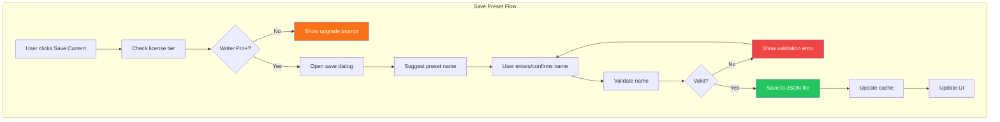

# LCS-DES-055d: Design Specification — Saved Filters

## Metadata & Categorization

| Field            | Value                           |
| :--------------- | :------------------------------ |
| **Document ID**  | LCS-DES-055d                    |
| **Sub-Part ID**  | RAG-055d                        |
| **Title**        | Saved Filters                   |
| **Version**      | v0.5.5d                         |
| **Module**       | `Lexichord.Modules.RAG`         |
| **Depends On**   | v0.5.5a (Filter Model), v0.1.6a |
| **Required By**  | v0.5.5b (Filter UI)             |
| **License Tier** | Writer Pro                      |
| **Status**       | Draft                           |
| **Last Updated** | 2026-01-27                      |

---

## 1. Executive Summary

This sub-part implements persistence and management of saved filter presets. Users can save frequently-used filter combinations, give them meaningful names, and quickly apply them in future searches.

### 1.1 Objectives

1. Persist filter presets to JSON files in user settings directory
2. Provide CRUD operations for preset management
3. Generate intelligent preset name suggestions
4. Publish events when filters are applied
5. Support team-shared presets (Teams+ tier, foundation only)

### 1.2 Key Deliverables

- `IFilterPresetService` interface in Abstractions
- `FilterPresetService` implementation with JSON persistence
- `FilterAppliedEvent` MediatR notification
- Preset name suggestion algorithm
- Unit tests for all operations

---

## 2. Architecture & Modular Strategy

### 2.1 Dependencies

| Dependency         | Source  | Purpose                 |
| :----------------- | :------ | :---------------------- |
| `SearchFilter`     | v0.5.5a | Filter criteria         |
| `FilterPreset`     | v0.5.5a | Preset container        |
| `ISettingsService` | v0.1.6a | Settings directory path |
| `ILicenseContext`  | v0.0.4c | License tier checking   |
| `IMediator`        | v0.0.7a | Event publishing        |

### 2.2 Licensing Behavior

| Feature        | Core | Writer Pro | Teams | Enterprise |
| :------------- | :--- | :--------- | :---- | :--------- |
| Save presets   | 🔒   | ✓          | ✓     | ✓          |
| Load presets   | 🔒   | ✓          | ✓     | ✓          |
| Delete presets | 🔒   | ✓          | ✓     | ✓          |
| Shared presets | 🔒   | 🔒         | ✓     | ✓          |

---

## 3. Data Contract (API)

### 3.1 IFilterPresetService Interface

```csharp
namespace Lexichord.Abstractions.Contracts;

/// <summary>
/// Manages saved search filter presets with JSON persistence.
/// </summary>
/// <remarks>
/// <para>Presets are stored per-user in the settings directory.</para>
/// <para>Team presets (Teams+) are stored in a shared location.</para>
/// <para>All operations require Writer Pro or higher license.</para>
/// </remarks>
public interface IFilterPresetService
{
    /// <summary>
    /// Gets all saved presets for the current user.
    /// </summary>
    /// <param name="includeShared">Whether to include team-shared presets.</param>
    /// <param name="ct">Cancellation token.</param>
    /// <returns>A list of available filter presets.</returns>
    Task<IReadOnlyList<FilterPreset>> GetPresetsAsync(
        bool includeShared = true,
        CancellationToken ct = default);

    /// <summary>
    /// Saves a new preset.
    /// </summary>
    /// <param name="name">The preset name.</param>
    /// <param name="filter">The filter criteria to save.</param>
    /// <param name="ct">Cancellation token.</param>
    /// <returns>The created preset.</returns>
    Task<FilterPreset> SavePresetAsync(
        string name,
        SearchFilter filter,
        CancellationToken ct = default);

    /// <summary>
    /// Updates an existing preset.
    /// </summary>
    /// <param name="id">The preset ID to update.</param>
    /// <param name="name">The new preset name.</param>
    /// <param name="filter">The new filter criteria.</param>
    /// <param name="ct">Cancellation token.</param>
    /// <returns>The updated preset, or null if not found.</returns>
    Task<FilterPreset?> UpdatePresetAsync(
        Guid id,
        string name,
        SearchFilter filter,
        CancellationToken ct = default);

    /// <summary>
    /// Deletes a preset.
    /// </summary>
    /// <param name="id">The preset ID to delete.</param>
    /// <param name="ct">Cancellation token.</param>
    /// <returns>True if deleted, false if not found.</returns>
    Task<bool> DeletePresetAsync(Guid id, CancellationToken ct = default);

    /// <summary>
    /// Gets a preset by ID.
    /// </summary>
    /// <param name="id">The preset ID.</param>
    /// <param name="ct">Cancellation token.</param>
    /// <returns>The preset, or null if not found.</returns>
    Task<FilterPreset?> GetPresetAsync(Guid id, CancellationToken ct = default);

    /// <summary>
    /// Suggests a descriptive name for a filter based on its criteria.
    /// </summary>
    /// <param name="filter">The filter to suggest a name for.</param>
    /// <returns>A suggested preset name.</returns>
    string SuggestPresetName(SearchFilter filter);

    /// <summary>
    /// Validates a preset name.
    /// </summary>
    /// <param name="name">The name to validate.</param>
    /// <returns>True if valid, false otherwise.</returns>
    bool IsValidPresetName(string name);
}
```

### 3.2 FilterAppliedEvent

```csharp
namespace Lexichord.Modules.RAG.Events;

/// <summary>
/// Published when a search filter is applied.
/// </summary>
/// <remarks>
/// <para>Used for analytics and state synchronization.</para>
/// <para>Published regardless of whether a preset was used.</para>
/// </remarks>
/// <param name="Filter">The filter criteria that was applied.</param>
/// <param name="PresetId">The preset ID if a saved preset was used.</param>
/// <param name="PresetName">The preset name if a saved preset was used.</param>
/// <param name="IsFromPreset">Whether the filter came from a saved preset.</param>
/// <param name="Timestamp">When the filter was applied.</param>
public record FilterAppliedEvent(
    SearchFilter Filter,
    Guid? PresetId,
    string? PresetName,
    bool IsFromPreset,
    DateTime Timestamp) : INotification
{
    /// <summary>
    /// Creates an event for a manually configured filter.
    /// </summary>
    public static FilterAppliedEvent FromManualFilter(SearchFilter filter) =>
        new(filter, null, null, IsFromPreset: false, DateTime.UtcNow);

    /// <summary>
    /// Creates an event for a preset-based filter.
    /// </summary>
    public static FilterAppliedEvent FromPreset(FilterPreset preset) =>
        new(preset.Filter, preset.Id, preset.Name, IsFromPreset: true, DateTime.UtcNow);
}
```

### 3.3 FilterPresetService Implementation

```csharp
namespace Lexichord.Modules.RAG.Services;

/// <summary>
/// Manages saved search filter presets with JSON persistence.
/// </summary>
public sealed class FilterPresetService : IFilterPresetService
{
    private readonly ISettingsService _settingsService;
    private readonly ILicenseContext _licenseContext;
    private readonly IMediator _mediator;
    private readonly ILogger<FilterPresetService> _logger;
    private readonly SemaphoreSlim _lock = new(1, 1);

    private readonly string _presetFilePath;
    private List<FilterPreset>? _cachedPresets;

    private const int MaxPresetCount = 50;
    private const int MaxPresetNameLength = 100;

    public FilterPresetService(
        ISettingsService settingsService,
        ILicenseContext licenseContext,
        IMediator mediator,
        ILogger<FilterPresetService> logger)
    {
        _settingsService = settingsService;
        _licenseContext = licenseContext;
        _mediator = mediator;
        _logger = logger;

        _presetFilePath = Path.Combine(
            _settingsService.SettingsDirectory,
            "filter-presets.json");
    }

    /// <inheritdoc />
    public async Task<IReadOnlyList<FilterPreset>> GetPresetsAsync(
        bool includeShared = true,
        CancellationToken ct = default)
    {
        await _lock.WaitAsync(ct);
        try
        {
            if (_cachedPresets is not null)
                return _cachedPresets;

            _logger.LogDebug("Loading filter presets from {Path}", _presetFilePath);

            if (!File.Exists(_presetFilePath))
            {
                _cachedPresets = new List<FilterPreset>();
                return _cachedPresets;
            }

            var json = await File.ReadAllTextAsync(_presetFilePath, ct);
            _cachedPresets = JsonSerializer.Deserialize<List<FilterPreset>>(json,
                new JsonSerializerOptions { PropertyNameCaseInsensitive = true })
                ?? new List<FilterPreset>();

            _logger.LogDebug("Loaded {Count} filter presets", _cachedPresets.Count);
            return _cachedPresets;
        }
        catch (Exception ex)
        {
            _logger.LogError(ex, "Failed to load filter presets from {Path}", _presetFilePath);
            _cachedPresets = new List<FilterPreset>();
            return _cachedPresets;
        }
        finally
        {
            _lock.Release();
        }
    }

    /// <inheritdoc />
    public async Task<FilterPreset> SavePresetAsync(
        string name,
        SearchFilter filter,
        CancellationToken ct = default)
    {
        ArgumentException.ThrowIfNullOrWhiteSpace(name);

        if (!IsValidPresetName(name))
            throw new ArgumentException("Invalid preset name.", nameof(name));

        await _lock.WaitAsync(ct);
        try
        {
            var presets = (await GetPresetsInternalAsync(ct)).ToList();

            if (presets.Count >= MaxPresetCount)
            {
                throw new InvalidOperationException(
                    $"Maximum preset count ({MaxPresetCount}) reached. Delete some presets first.");
            }

            var preset = new FilterPreset(
                Id: Guid.NewGuid(),
                Name: name.Trim(),
                Filter: filter,
                CreatedAt: DateTime.UtcNow);

            presets.Add(preset);
            await SavePresetsAsync(presets, ct);

            _logger.LogInformation(
                "Saved filter preset: {Name} with {CriteriaCount} criteria",
                preset.Name,
                filter.CriteriaCount);

            return preset;
        }
        finally
        {
            _lock.Release();
        }
    }

    /// <inheritdoc />
    public async Task<FilterPreset?> UpdatePresetAsync(
        Guid id,
        string name,
        SearchFilter filter,
        CancellationToken ct = default)
    {
        ArgumentException.ThrowIfNullOrWhiteSpace(name);

        await _lock.WaitAsync(ct);
        try
        {
            var presets = (await GetPresetsInternalAsync(ct)).ToList();
            var existingIndex = presets.FindIndex(p => p.Id == id);

            if (existingIndex == -1)
            {
                _logger.LogWarning("Preset not found for update: {PresetId}", id);
                return null;
            }

            var updated = new FilterPreset(
                Id: id,
                Name: name.Trim(),
                Filter: filter,
                CreatedAt: presets[existingIndex].CreatedAt);

            presets[existingIndex] = updated;
            await SavePresetsAsync(presets, ct);

            _logger.LogInformation("Updated filter preset: {Name}", updated.Name);
            return updated;
        }
        finally
        {
            _lock.Release();
        }
    }

    /// <inheritdoc />
    public async Task<bool> DeletePresetAsync(Guid id, CancellationToken ct = default)
    {
        await _lock.WaitAsync(ct);
        try
        {
            var presets = (await GetPresetsInternalAsync(ct)).ToList();
            var removed = presets.RemoveAll(p => p.Id == id);

            if (removed == 0)
            {
                _logger.LogWarning("Preset not found for deletion: {PresetId}", id);
                return false;
            }

            await SavePresetsAsync(presets, ct);
            _logger.LogInformation("Deleted filter preset: {PresetId}", id);
            return true;
        }
        finally
        {
            _lock.Release();
        }
    }

    /// <inheritdoc />
    public async Task<FilterPreset?> GetPresetAsync(Guid id, CancellationToken ct = default)
    {
        var presets = await GetPresetsAsync(ct: ct);
        return presets.FirstOrDefault(p => p.Id == id);
    }

    /// <inheritdoc />
    public string SuggestPresetName(SearchFilter filter)
    {
        var parts = new List<string>();

        // Add path-based component
        if (filter.PathPatterns?.Count > 0)
        {
            var firstPath = filter.PathPatterns[0];
            var folderName = ExtractFolderName(firstPath);
            if (!string.IsNullOrEmpty(folderName))
            {
                parts.Add(FormatFolderName(folderName));
            }
        }

        // Add extension component
        if (filter.FileExtensions?.Count == 1)
        {
            parts.Add(filter.FileExtensions[0].ToUpperInvariant());
        }
        else if (filter.FileExtensions?.Count > 1)
        {
            parts.Add($"{filter.FileExtensions.Count} types");
        }

        // Add date component
        if (filter.ModifiedRange is not null)
        {
            if (filter.ModifiedRange.Start.HasValue && !filter.ModifiedRange.End.HasValue)
            {
                var daysAgo = (DateTime.UtcNow - filter.ModifiedRange.Start.Value).Days;
                parts.Add(daysAgo switch
                {
                    <= 1 => "Today",
                    <= 7 => "This Week",
                    <= 30 => "This Month",
                    _ => "Recent"
                });
            }
        }

        // Add heading component
        if (filter.HasHeadings == true)
        {
            parts.Add("With Headings");
        }

        return parts.Count > 0
            ? string.Join(" ", parts)
            : "Custom Filter";
    }

    /// <inheritdoc />
    public bool IsValidPresetName(string name)
    {
        if (string.IsNullOrWhiteSpace(name))
            return false;

        if (name.Length > MaxPresetNameLength)
            return false;

        // Reject control characters
        if (name.Any(char.IsControl))
            return false;

        return true;
    }

    private async Task<List<FilterPreset>> GetPresetsInternalAsync(CancellationToken ct)
    {
        // Called within lock, directly access cache or load
        if (_cachedPresets is not null)
            return _cachedPresets;

        if (!File.Exists(_presetFilePath))
        {
            _cachedPresets = new List<FilterPreset>();
            return _cachedPresets;
        }

        var json = await File.ReadAllTextAsync(_presetFilePath, ct);
        _cachedPresets = JsonSerializer.Deserialize<List<FilterPreset>>(json,
            new JsonSerializerOptions { PropertyNameCaseInsensitive = true })
            ?? new List<FilterPreset>();

        return _cachedPresets;
    }

    private async Task SavePresetsAsync(List<FilterPreset> presets, CancellationToken ct)
    {
        var directory = Path.GetDirectoryName(_presetFilePath);
        if (!string.IsNullOrEmpty(directory) && !Directory.Exists(directory))
        {
            Directory.CreateDirectory(directory);
        }

        var json = JsonSerializer.Serialize(presets, new JsonSerializerOptions
        {
            WriteIndented = true,
            PropertyNamingPolicy = JsonNamingPolicy.CamelCase
        });

        // Write to temp file then rename for atomic update
        var tempPath = $"{_presetFilePath}.tmp";
        await File.WriteAllTextAsync(tempPath, json, ct);
        File.Move(tempPath, _presetFilePath, overwrite: true);

        _cachedPresets = presets;
    }

    private static string ExtractFolderName(string pattern)
    {
        // Remove glob wildcards and extract last meaningful folder segment
        var cleaned = pattern
            .TrimEnd('/', '*')
            .Split('/')
            .LastOrDefault(s => !string.IsNullOrEmpty(s) && s != "**");

        return cleaned ?? string.Empty;
    }

    private static string FormatFolderName(string name)
    {
        // Title-case the folder name
        if (string.IsNullOrEmpty(name))
            return name;

        return char.ToUpperInvariant(name[0]) + name[1..];
    }
}
```

---

## 4. Implementation Logic

### 4.1 Flow Diagram



### 4.2 Preset Name Suggestion Algorithm

```text
SUGGEST preset name from filter:
│
├── Initialize parts list
│
├── Extract path component:
│   ├── Take first pattern
│   ├── Remove trailing "/**" and "/*"
│   ├── Extract last folder segment
│   └── Title-case the name → Add to parts
│
├── Extract extension component:
│   ├── Single extension → Use uppercase (e.g., "MD")
│   └── Multiple → Use count (e.g., "3 types")
│
├── Extract date component:
│   ├── Last 24 hours → "Today"
│   ├── Last 7 days → "This Week"
│   ├── Last 30 days → "This Month"
│   └── Other → "Recent"
│
├── Extract heading component:
│   └── HasHeadings = true → "With Headings"
│
├── Combine parts with spaces
│
└── If empty → Return "Custom Filter"

EXAMPLES:
  PathPatterns: ["docs/**"] → "Docs"
  PathPatterns: ["docs/**"], Extensions: ["md"] → "Docs MD"
  PathPatterns: ["api/**"], ModifiedRange: Last7Days → "Api This Week"
  Extensions: ["md", "txt"], HasHeadings: true → "2 types With Headings"
```

### 4.3 File Persistence Strategy

```text
SAVE presets to file:
│
├── Serialize presets to JSON with:
│   ├── WriteIndented = true (human readable)
│   └── CamelCase property naming
│
├── Write to temp file first:
│   └── {presetFilePath}.tmp
│
├── Atomic rename:
│   └── Move temp → final (overwrite)
│
└── Update in-memory cache

BENEFITS:
  - Atomic updates prevent corruption
  - No data loss on crash during write
  - Human-readable format for debugging
```

---

## 5. Data Persistence

### 5.1 Storage Location

| Platform | Path                                                                   |
| :------- | :--------------------------------------------------------------------- |
| Windows  | `%APPDATA%/Lexichord/settings/filter-presets.json`                     |
| macOS    | `~/Library/Application Support/Lexichord/settings/filter-presets.json` |
| Linux    | `~/.config/Lexichord/settings/filter-presets.json`                     |

### 5.2 JSON Schema

```json
[
    {
        "id": "550e8400-e29b-41d4-a716-446655440000",
        "name": "API Documentation",
        "filter": {
            "pathPatterns": ["api/**", "docs/api/**"],
            "fileExtensions": ["md", "yaml"],
            "modifiedRange": {
                "start": "2026-01-01T00:00:00Z",
                "end": null
            },
            "tags": null,
            "hasHeadings": true
        },
        "createdAt": "2026-01-27T10:30:00Z",
        "isShared": false
    }
]
```

---

## 6. UI/UX Specifications

### 6.1 Save Preset Dialog

```text
┌─────────────────────────────────────────────────────────────────┐
│  💾 Save Filter Preset                                      [✕] │
├─────────────────────────────────────────────────────────────────┤
│                                                                  │
│  Name:                                                           │
│  ┌─────────────────────────────────────────────────────────────┐│
│  │ Docs MD This Week                                           ││
│  └─────────────────────────────────────────────────────────────┘│
│  ↑ Suggested based on filter criteria                           │
│                                                                  │
│  Current Filter:                                                 │
│  • 📁 docs/**                                                    │
│  • 📄 .md                                                        │
│  • 📅 Last 7 days                                                │
│                                                                  │
│  ┌─────────────────────────────────────────────────────────────┐│
│  │            [Cancel]              [Save Preset]              ││
│  └─────────────────────────────────────────────────────────────┘│
└─────────────────────────────────────────────────────────────────┘
```

### 6.2 Preset Dropdown

```text
┌─────────────────────────────────────────────────────┐
│  💾 SAVED FILTERS                      [+ Save]     │
├─────────────────────────────────────────────────────┤
│  ┌─────────────────────────────────────────────────┐│
│  │ API Documentation                         [✕]   ││
│  │ Release Notes                             [✕]   ││
│  │ Specs MD                                  [✕]   ││
│  │ Recent Markdown                           [✕]   ││
│  └─────────────────────────────────────────────────┘│
└─────────────────────────────────────────────────────┘
```

---

## 7. Observability & Logging

| Level   | Source              | Message Template                                              |
| :------ | :------------------ | :------------------------------------------------------------ |
| Debug   | FilterPresetService | `"Loading filter presets from {Path}"`                        |
| Debug   | FilterPresetService | `"Loaded {Count} filter presets"`                             |
| Info    | FilterPresetService | `"Saved filter preset: {Name} with {CriteriaCount} criteria"` |
| Info    | FilterPresetService | `"Updated filter preset: {Name}"`                             |
| Info    | FilterPresetService | `"Deleted filter preset: {PresetId}"`                         |
| Warning | FilterPresetService | `"Preset not found for update: {PresetId}"`                   |
| Warning | FilterPresetService | `"Preset not found for deletion: {PresetId}"`                 |
| Error   | FilterPresetService | `"Failed to load filter presets from {Path}: {Error}"`        |
| Error   | FilterPresetService | `"Failed to save filter presets: {Error}"`                    |

---

## 8. Security & Safety

| Concern           | Mitigation                                        |
| :---------------- | :------------------------------------------------ |
| File corruption   | Atomic write via temp file then rename            |
| Concurrent access | SemaphoreSlim for thread safety                   |
| Data loss         | Cache in memory, reload on error                  |
| Name validation   | Reject control characters, enforce length limit   |
| Path injection    | Filter criteria are validated by IFilterValidator |

---

## 9. Acceptance Criteria (QA)

| #   | Category        | Criterion                               |
| :-- | :-------------- | :-------------------------------------- |
| 1   | **Functional**  | Saving preset creates JSON file         |
| 2   | **Functional**  | Loading presets returns saved items     |
| 3   | **Functional**  | Updating preset modifies file correctly |
| 4   | **Functional**  | Deleting preset removes from file       |
| 5   | **Functional**  | Preset name suggestion is meaningful    |
| 6   | **Functional**  | Applying preset restores filter state   |
| 7   | **License**     | Core users cannot save presets          |
| 8   | **Persistence** | Presets survive application restart     |
| 9   | **Validation**  | Empty names are rejected                |
| 10  | **Validation**  | Very long names are rejected            |
| 11  | **Performance** | Save operation completes in < 100ms     |
| 12  | **Concurrency** | Parallel access doesn't corrupt file    |

---

## 10. Unit Tests

```csharp
[Trait("Category", "Unit")]
[Trait("Feature", "v0.5.5d")]
public class FilterPresetServiceTests
{
    private readonly Mock<ISettingsService> _settingsMock;
    private readonly Mock<ILicenseContext> _licenseMock;
    private readonly Mock<IMediator> _mediatorMock;
    private readonly FilterPresetService _sut;
    private readonly string _tempDir;

    public FilterPresetServiceTests()
    {
        _tempDir = Path.Combine(Path.GetTempPath(), Guid.NewGuid().ToString());
        Directory.CreateDirectory(_tempDir);

        _settingsMock = new Mock<ISettingsService>();
        _settingsMock.Setup(s => s.SettingsDirectory).Returns(_tempDir);

        _licenseMock = new Mock<ILicenseContext>();
        _licenseMock.Setup(l => l.HasFeature(It.IsAny<string>())).Returns(true);

        _mediatorMock = new Mock<IMediator>();

        _sut = new FilterPresetService(
            _settingsMock.Object,
            _licenseMock.Object,
            _mediatorMock.Object,
            Mock.Of<ILogger<FilterPresetService>>());
    }

    [Fact]
    public async Task GetPresetsAsync_NoFile_ReturnsEmpty()
    {
        // Act
        var presets = await _sut.GetPresetsAsync();

        // Assert
        presets.Should().BeEmpty();
    }

    [Fact]
    public async Task SavePresetAsync_CreatesPreset()
    {
        // Arrange
        var filter = SearchFilter.ForPath("docs/**");

        // Act
        var preset = await _sut.SavePresetAsync("Test Preset", filter);

        // Assert
        preset.Should().NotBeNull();
        preset.Name.Should().Be("Test Preset");
        preset.Filter.Should().Be(filter);
        preset.Id.Should().NotBeEmpty();
    }

    [Fact]
    public async Task SavePresetAsync_PersistsToFile()
    {
        // Arrange
        var filter = SearchFilter.ForPath("docs/**");
        await _sut.SavePresetAsync("Test Preset", filter);

        // Act - Create new service to test persistence
        var newService = new FilterPresetService(
            _settingsMock.Object,
            _licenseMock.Object,
            _mediatorMock.Object,
            Mock.Of<ILogger<FilterPresetService>>());

        var presets = await newService.GetPresetsAsync();

        // Assert
        presets.Should().ContainSingle();
        presets[0].Name.Should().Be("Test Preset");
    }

    [Fact]
    public async Task UpdatePresetAsync_ModifiesExisting()
    {
        // Arrange
        var filter = SearchFilter.ForPath("docs/**");
        var preset = await _sut.SavePresetAsync("Original", filter);
        var newFilter = SearchFilter.ForPath("specs/**");

        // Act
        var updated = await _sut.UpdatePresetAsync(preset.Id, "Updated", newFilter);

        // Assert
        updated.Should().NotBeNull();
        updated!.Name.Should().Be("Updated");
        updated.Filter.PathPatterns.Should().ContainSingle().Which.Should().Be("specs/**");
    }

    [Fact]
    public async Task DeletePresetAsync_RemovesPreset()
    {
        // Arrange
        var filter = SearchFilter.ForPath("docs/**");
        var preset = await _sut.SavePresetAsync("To Delete", filter);

        // Act
        var deleted = await _sut.DeletePresetAsync(preset.Id);
        var presets = await _sut.GetPresetsAsync();

        // Assert
        deleted.Should().BeTrue();
        presets.Should().BeEmpty();
    }

    [Fact]
    public async Task DeletePresetAsync_NotFound_ReturnsFalse()
    {
        // Act
        var deleted = await _sut.DeletePresetAsync(Guid.NewGuid());

        // Assert
        deleted.Should().BeFalse();
    }

    [Fact]
    public async Task SavePresetAsync_EmptyName_Throws()
    {
        // Arrange
        var filter = SearchFilter.ForPath("docs/**");

        // Act
        var act = () => _sut.SavePresetAsync("", filter);

        // Assert
        await act.Should().ThrowAsync<ArgumentException>();
    }

    [Theory]
    [InlineData("docs/**", "", "Docs")]
    [InlineData("docs/**", "md", "Docs MD")]
    [InlineData("api/**", "yaml", "Api YAML")]
    public void SuggestPresetName_GeneratesMeaningfulName(
        string path,
        string extension,
        string expected)
    {
        // Arrange
        var filter = new SearchFilter(
            PathPatterns: new[] { path },
            FileExtensions: string.IsNullOrEmpty(extension) ? null : new[] { extension });

        // Act
        var suggestion = _sut.SuggestPresetName(filter);

        // Assert
        suggestion.Should().Be(expected);
    }

    [Fact]
    public void SuggestPresetName_EmptyFilter_ReturnsCustomFilter()
    {
        // Act
        var suggestion = _sut.SuggestPresetName(SearchFilter.Empty);

        // Assert
        suggestion.Should().Be("Custom Filter");
    }

    [Theory]
    [InlineData("Valid Name", true)]
    [InlineData("", false)]
    [InlineData("   ", false)]
    [InlineData(null, false)]
    public void IsValidPresetName_ValidatesCorrectly(string name, bool expected)
    {
        // Act
        var result = _sut.IsValidPresetName(name);

        // Assert
        result.Should().Be(expected);
    }

    public void Dispose()
    {
        if (Directory.Exists(_tempDir))
            Directory.Delete(_tempDir, recursive: true);
    }
}

[Trait("Category", "Unit")]
[Trait("Feature", "v0.5.5d")]
public class FilterAppliedEventTests
{
    [Fact]
    public void FromManualFilter_SetsIsFromPresetFalse()
    {
        // Arrange
        var filter = SearchFilter.ForPath("docs/**");

        // Act
        var evt = FilterAppliedEvent.FromManualFilter(filter);

        // Assert
        evt.IsFromPreset.Should().BeFalse();
        evt.PresetId.Should().BeNull();
        evt.PresetName.Should().BeNull();
    }

    [Fact]
    public void FromPreset_SetsIsFromPresetTrue()
    {
        // Arrange
        var preset = FilterPreset.Create("Test", SearchFilter.ForPath("docs/**"));

        // Act
        var evt = FilterAppliedEvent.FromPreset(preset);

        // Assert
        evt.IsFromPreset.Should().BeTrue();
        evt.PresetId.Should().Be(preset.Id);
        evt.PresetName.Should().Be("Test");
    }
}
```

---

## Document History

| Version | Date       | Author         | Changes       |
| :------ | :--------- | :------------- | :------------ |
| 1.0     | 2026-01-27 | Lead Architect | Initial draft |
