# LCS-SBD-055-KG: Scope Overview — Entity Linking

## Document Control

| Field            | Value                                                        |
| :--------------- | :----------------------------------------------------------- |
| **Document ID**  | LCS-SBD-055-KG                                               |
| **Version**      | v0.5.5                                                       |
| **Codename**     | Entity Linking (CKVS Phase 2a)                               |
| **Status**       | Draft                                                        |
| **Last Updated** | 2026-01-31                                                   |
| **Owner**        | Lead Architect                                               |
| **Depends On**   | v0.4.5-KG (Foundation), v0.5.4 (Query Understanding)         |

---

## 1. Executive Summary

### 1.1 The Vision

**v0.5.5-KG** delivers **Entity Linking** — the NLU pipeline that connects entity mentions in text to canonical entities in the Knowledge Graph. While v0.4.5g extracts mentions, Entity Linking resolves *which* graph entity each mention refers to.

This enables:
- "The users endpoint..." → links to `GET /users` entity
- "Specify the limit parameter..." → links to `limit` (Parameter) entity
- Disambiguation: "API" in context → correct Product entity

### 1.2 Business Value

- **Canonical Resolution:** All mentions link to single source of truth.
- **Cross-Document Consistency:** Same entity recognized across documents.
- **Search Enhancement:** Entity-aware search results.
- **Relationship Discovery:** Implicit relationships from co-occurrence.
- **Foundation for Claims:** Claims require linked entities as subjects/objects.

### 1.3 Success Criteria

1. Entity recognizer achieves >80% precision/recall on test corpus.
2. Entity linker resolves mentions to graph entities with >75% accuracy.
3. Disambiguation handles multiple candidates via context scoring.
4. Processing speed: 100-page document linked in <30 seconds.
5. Human review UI for low-confidence links.
6. Feedback loop improves linking over time.

---

## 2. Relationship to Existing v0.5.5

The existing v0.5.5 spec covers the **Filter System** for search results. Entity Linking integrates by:

- **Entity-Aware Filters:** Filter search by linked entity.
- **Shared NLU Pipeline:** Query Understanding (v0.5.4) provides NER foundation.
- **Enhanced Search:** "Show me content about [Entity]" resolves correctly.

---

## 3. Key Deliverables

### 3.1 Sub-Parts

| Sub-Part | Title | Description | Est. Hours |
|:---------|:------|:------------|:-----------|
| v0.5.5e | Entity Recognizer | NER with SpaCy + custom rules | 8 |
| v0.5.5f | Candidate Generator | Generate graph entity candidates | 5 |
| v0.5.5g | Entity Linker | Score and rank candidates | 8 |
| v0.5.5h | LLM Fallback | Use LLM for low-confidence disambiguation | 4 |
| v0.5.5i | Linking Review UI | Human review of uncertain links | 5 |
| **Total** | | | **30 hours** |

### 3.2 Key Interfaces

```csharp
/// <summary>
/// Service for linking entity mentions to canonical graph entities.
/// </summary>
public interface IEntityLinkingService
{
    /// <summary>
    /// Links entity mentions in text to graph entities.
    /// </summary>
    /// <param name="mentions">Extracted entity mentions.</param>
    /// <param name="context">Linking context with document info.</param>
    /// <param name="ct">Cancellation token.</param>
    /// <returns>Linked entities with confidence scores.</returns>
    Task<LinkingResult> LinkEntitiesAsync(
        IReadOnlyList<EntityMention> mentions,
        LinkingContext context,
        CancellationToken ct = default);
}

/// <summary>
/// A mention linked to a graph entity.
/// </summary>
public record LinkedEntity
{
    /// <summary>Original mention.</summary>
    public required EntityMention Mention { get; init; }

    /// <summary>Resolved graph entity ID.</summary>
    public Guid? ResolvedEntityId { get; init; }

    /// <summary>Resolved entity (null if unlinked).</summary>
    public KnowledgeEntity? ResolvedEntity { get; init; }

    /// <summary>Linking confidence (0.0-1.0).</summary>
    public float Confidence { get; init; }

    /// <summary>Alternative candidates considered.</summary>
    public IReadOnlyList<LinkCandidate>? Candidates { get; init; }

    /// <summary>Linking method used.</summary>
    public LinkingMethod Method { get; init; }

    /// <summary>Whether human review is recommended.</summary>
    public bool NeedsReview => Confidence < 0.7f && ResolvedEntityId.HasValue;
}

public enum LinkingMethod
{
    ExactMatch,       // Name exact match
    FuzzyMatch,       // Fuzzy string similarity
    ContextualMatch,  // Surrounding context analysis
    LLMDisambiguation // LLM-based disambiguation
}
```

### 3.3 NLU Pipeline Architecture

```mermaid
graph LR
    subgraph "Input"
        DOC[Document Text]
    end

    subgraph "Entity Recognition"
        TOK[Tokenizer]
        NER[NER Model<br/>SpaCy + Rules]
        MEN[Mention Extractor]
    end

    subgraph "Candidate Generation"
        IDX[Entity Index<br/>Fuzzy Search]
        CAN[Candidate<br/>Generator]
    end

    subgraph "Entity Linking"
        CTX[Context Scorer]
        SEM[Semantic Scorer]
        LLM[LLM Fallback]
        RAN[Candidate Ranker]
    end

    subgraph "Output"
        LNK[Linked Entities]
    end

    DOC --> TOK --> NER --> MEN
    MEN --> CAN
    CAN --> IDX
    IDX --> CTX
    CTX --> SEM
    SEM --> RAN
    SEM -.->|Low confidence| LLM
    LLM --> RAN
    RAN --> LNK

    style NER fill:#3b82f6
    style CAN fill:#3b82f6
    style CTX fill:#3b82f6
    style SEM fill:#3b82f6
    style RAN fill:#3b82f6
```



---

## 4. Linking Algorithm

```
ALGORITHM: Entity Linking

INPUT: EntityMention mention, KnowledgeGraph graph
OUTPUT: LinkedEntity with resolved entity or null

1. CANDIDATE GENERATION
   a. Exact match: Search graph for entities with name = mention.value
   b. Fuzzy match: Search with Levenshtein distance < 3
   c. Type-filtered: Only candidates matching mention.entityType

2. CANDIDATE SCORING
   For each candidate:
   a. Name similarity score (0-1): Jaro-Winkler distance
   b. Type match score (0 or 1): Types match
   c. Context score (0-1): Surrounding words match entity properties
   d. Co-occurrence score (0-1): Other linked entities in same doc

   final_score = 0.3 * name + 0.2 * type + 0.3 * context + 0.2 * cooccurrence

3. DISAMBIGUATION
   If top candidate score > 0.8: RETURN linked entity
   If score between 0.5-0.8: Use LLM for disambiguation
   If score < 0.5: RETURN unlinked (needs human review)

4. LLM DISAMBIGUATION
   Prompt: "Given context '{surrounding_text}', which of these entities
            does '{mention}' refer to? Options: {candidates}"
   Parse LLM response → selected candidate
```

---

## 5. Dependencies

| Component | Source | Usage |
|:----------|:-------|:------|
| `IEntityExtractionPipeline` | v0.4.5g | Source mentions to link |
| `IGraphRepository` | v0.4.5e | Query candidate entities |
| `ISemanticSearchService` | v0.4.5 | Semantic similarity for context |
| `ILLMGateway` | v0.6.1 | LLM disambiguation (optional) |
| SpaCy (via Python interop) | NuGet | NER model |

---

## 6. License Gating

| Tier | Entity Linking Access |
|:-----|:----------------------|
| Core | Not available |
| WriterPro | Basic linking (exact/fuzzy match only) |
| Teams | Full linking with LLM disambiguation |
| Enterprise | Full + custom NER model training |

---

## 7. Performance Targets

| Metric | Target | Measurement |
|:-------|:-------|:------------|
| Recognition precision | >80% | Test corpus |
| Recognition recall | >80% | Test corpus |
| Linking accuracy | >75% | Human evaluation |
| Processing speed | <30s / 100 pages | Benchmark |
| LLM fallback rate | <20% | Telemetry |

---

## 8. Risks & Mitigations

| Risk | Mitigation |
|:-----|:-----------|
| SpaCy model quality | Custom training on tech docs corpus |
| LLM cost for disambiguation | Batch requests, confidence thresholds |
| Ambiguous mentions | Human review queue, feedback loop |
| Performance at scale | Async processing, caching |

---

## 9. What This Enables

- **v0.5.6 Claim Extraction:** Claims need linked entity subjects/objects.
- **v0.6.5 Validation:** Validate claims against linked entities.
- **Entity-Aware Search:** Search for content about specific entities.
- **Cross-Reference Detection:** Find all docs mentioning same entity.

---
