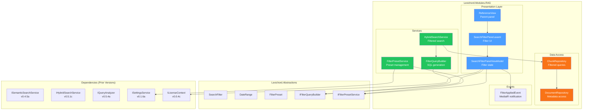
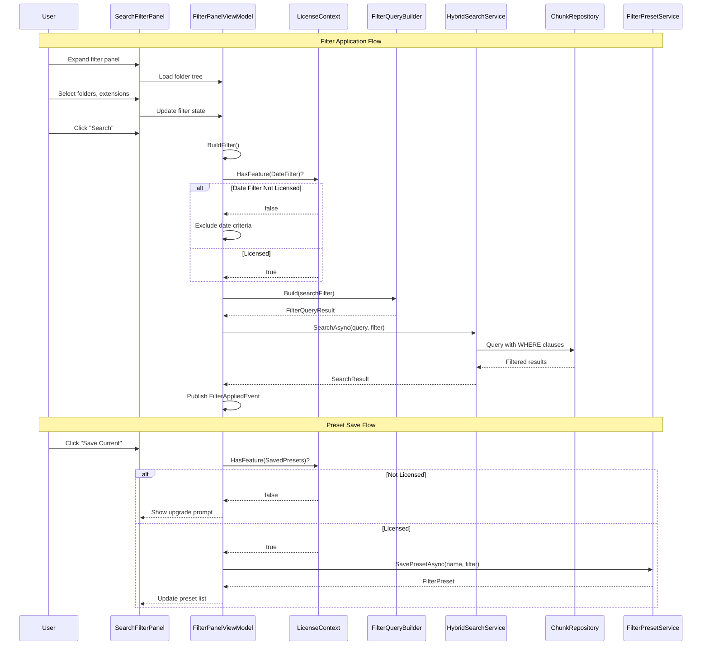

# LCS-SBD-055: Scope Breakdown — The Filter System

## Document Control

| Field            | Value                                                                      |
| :--------------- | :------------------------------------------------------------------------- |
| **Document ID**  | LCS-SBD-055                                                                |
| **Version**      | v0.5.5                                                                     |
| **Codename**     | The Filter System (Scoped Search)                                          |
| **Status**       | Draft                                                                      |
| **Last Updated** | 2026-01-27                                                                 |
| **Owner**        | Lead Architect                                                             |
| **Depends On**   | v0.4.5 (Semantic Search), v0.5.1 (Hybrid Engine), v0.5.4 (Relevance Tuner) |

---

## 1. Executive Summary

### 1.1 The Vision

**v0.5.5** delivers the **Filter System** — scoped search that allows users to narrow results to specific documents, folders, file types, or metadata criteria. This release transforms Lexichord's RAG system from searching the entire index into a precision instrument that respects project boundaries and document organization.

When users work on large documentation projects, they need to focus searches on relevant subsets—API docs, release notes, or files modified recently. The Filter System provides intuitive filtering that combines with hybrid search (v0.5.1) to deliver highly targeted results.

### 1.2 Business Value

- **Precision Search:** Users find exactly what they need by scoping to specific folders or file types.
- **Workflow Integration:** Filters respect natural project organization (docs/, specs/, guides/).
- **Time Savings:** Reduced noise means faster evaluation of search results.
- **Enterprise Ready:** Large teams can scope searches to their domain areas.
- **Saved Presets:** Frequently-used filter combinations can be saved and reused.
- **Foundation:** Enables AI-assisted filtering suggestions in v0.6.x.

### 1.3 Success Criteria

This release succeeds when:

1. Users can filter by path patterns (glob syntax) with <50ms filter application overhead.
2. Extension toggles correctly limit results to selected file types.
3. Date range filters accurately scope to recently modified documents.
4. Saved filter presets persist across sessions and load instantly.
5. All UI respects license gating (Writer Pro+ for saved presets).

### 1.4 License Gating

The Filter System uses a **Tiered Functionality** strategy:

| Feature              | Core | Writer Pro | Teams | Enterprise |
| :------------------- | :--- | :--------- | :---- | :--------- |
| Basic path filtering | ✓    | ✓          | ✓     | ✓          |
| Extension filtering  | ✓    | ✓          | ✓     | ✓          |
| Date range filtering | —    | ✓          | ✓     | ✓          |
| Saved filter presets | —    | ✓          | ✓     | ✓          |
| Team-shared presets  | —    | —          | ✓     | ✓          |
| Filter analytics     | —    | —          | —     | ✓          |

---

## 2. Dependencies on Prior Versions

| Component                | Source Version        | Usage in v0.5.5                            |
| :----------------------- | :-------------------- | :----------------------------------------- |
| `ISemanticSearchService` | v0.4.5a               | Base search to apply filters on            |
| `IHybridSearchService`   | v0.5.1c               | Hybrid search with filter integration      |
| `IChunkRepository`       | v0.4.1c               | Query with WHERE clauses                   |
| `IDocumentRepository`    | v0.4.1c               | Document metadata for filtering            |
| `IQueryAnalyzer`         | v0.5.4a               | Query understanding for smart suggestions  |
| `ReferenceView`          | v0.4.6a               | UI foundation for filter panel             |
| `ISettingsService`       | v0.1.6a               | Persist saved filter presets               |
| `IWorkspaceService`      | v0.1.2a               | Workspace root for relative paths          |
| `ILicenseContext`        | v0.0.4c               | License tier checking                      |
| `LicenseTier`            | v0.0.4c               | Core/WriterPro/Teams/Enterprise enum       |
| `IMediator`              | v0.0.7a               | Event publishing                           |
| `ILogger<T>`             | v0.0.3b               | Structured logging                         |
| `IConfiguration`         | v0.0.3d               | Filter preferences                         |
| `ViewModelBase`          | CommunityToolkit.Mvvm | Observable ViewModel base (external NuGet) |

---

## 3. Sub-Part Specifications

### 3.1 v0.5.5a: Filter Model

| Field            | Value                   |
| :--------------- | :---------------------- |
| **Sub-Part ID**  | RAG-055a                |
| **Title**        | Filter Model            |
| **Module**       | `Lexichord.Modules.RAG` |
| **License Tier** | Core                    |

**Goal:** Define comprehensive filter data structures that support path patterns, extensions, date ranges, and future metadata filtering.

**Key Deliverables:**

- `SearchFilter` record in `Lexichord.Abstractions`
- `DateRange` record for temporal filtering
- `FilterPreset` record for saved configurations
- `IFilterValidator` interface for filter validation
- Unit tests for filter model validation

**Key Interfaces:**

```csharp
namespace Lexichord.Abstractions.Contracts;

/// <summary>
/// Defines search filtering criteria to narrow results to specific documents or metadata.
/// </summary>
/// <remarks>
/// <para>All filter properties are optional; null values indicate no filtering.</para>
/// <para>Multiple criteria are combined with AND logic.</para>
/// </remarks>
/// <param name="PathPatterns">Glob patterns for path matching (e.g., "docs/**/*.md").</param>
/// <param name="FileExtensions">File extensions to include (without dot, e.g., "md", "txt").</param>
/// <param name="ModifiedRange">Date range for file modification time.</param>
/// <param name="Tags">Document tags (future feature).</param>
/// <param name="HasHeadings">Only include chunks with heading context.</param>
public record SearchFilter(
    IReadOnlyList<string>? PathPatterns = null,
    IReadOnlyList<string>? FileExtensions = null,
    DateRange? ModifiedRange = null,
    IReadOnlyList<string>? Tags = null,
    bool? HasHeadings = null)
{
    /// <summary>
    /// Gets whether any filter criteria are applied.
    /// </summary>
    public bool HasCriteria =>
        PathPatterns?.Count > 0 ||
        FileExtensions?.Count > 0 ||
        ModifiedRange is not null ||
        Tags?.Count > 0 ||
        HasHeadings.HasValue;

    /// <summary>
    /// Returns an empty filter with no criteria.
    /// </summary>
    public static SearchFilter Empty => new();
}

/// <summary>
/// Defines a date range for temporal filtering.
/// </summary>
/// <param name="Start">Inclusive start date (null = no lower bound).</param>
/// <param name="End">Inclusive end date (null = no upper bound).</param>
public record DateRange(DateTime? Start, DateTime? End)
{
    /// <summary>
    /// Creates a "last N days" date range.
    /// </summary>
    public static DateRange LastDays(int days) =>
        new(DateTime.UtcNow.AddDays(-days), null);

    /// <summary>
    /// Creates a "last N hours" date range.
    /// </summary>
    public static DateRange LastHours(int hours) =>
        new(DateTime.UtcNow.AddHours(-hours), null);
}

/// <summary>
/// A saved filter configuration that can be reused.
/// </summary>
/// <param name="Id">Unique identifier.</param>
/// <param name="Name">User-defined name.</param>
/// <param name="Filter">The filter criteria.</param>
/// <param name="CreatedAt">When the preset was created.</param>
/// <param name="IsShared">Whether this preset is shared with team (Teams+ only).</param>
public record FilterPreset(
    Guid Id,
    string Name,
    SearchFilter Filter,
    DateTime CreatedAt,
    bool IsShared = false);
```

**Filter Logic:**

```text
APPLY filter to search:
│
├── PathPatterns provided?
│   └── YES → WHERE document_path MATCHES ANY pattern
│
├── FileExtensions provided?
│   └── YES → WHERE file_extension IN (@extensions)
│
├── ModifiedRange provided?
│   ├── Start provided → WHERE modified_at >= @start
│   └── End provided → WHERE modified_at <= @end
│
├── HasHeadings = true?
│   └── YES → WHERE heading IS NOT NULL
│
└── Combine all conditions with AND
```

**Dependencies:**

- None (foundational data structures)

---

### 3.2 v0.5.5b: Filter UI Component

| Field            | Value                   |
| :--------------- | :---------------------- |
| **Sub-Part ID**  | RAG-055b                |
| **Title**        | Filter UI Component     |
| **Module**       | `Lexichord.Modules.RAG` |
| **License Tier** | Core                    |

**Goal:** Create an intuitive filter panel UI with folder tree, extension toggles, and date range picker.

**Key Deliverables:**

- `SearchFilterPanel.axaml` with collapsible sections
- `SearchFilterPanelViewModel` with filter state management
- Folder tree with checkboxes for path selection
- Extension toggle buttons (Markdown, Text, JSON, YAML)
- Date range picker component
- Filter chips display for active filters
- Unit tests for ViewModel state

**Key UI Components (Collapsed):**

```text
┌─────────────────────────────────────────────────────────────────────────────┐
│  🔍 [Search query here...]                                                   │
├─────────────────────────────────────────────────────────────────────────────┤
│  [▼ Filters] [📁 docs/] [.md] [.txt] [Last 7 days]              [✕ Clear]  │ ← Filter chips
└─────────────────────────────────────────────────────────────────────────────┘
```

**Key UI Components (Expanded):**

```text
┌─────────────────────────────────────────────────────────────────────────────┐
│  🔍 [Search query here...]                                                   │
├─────────────────────────────────────────────────────────────────────────────┤
│  [▲ Filters]                                                      [✕ Clear] │
├─────────────────────────────────────────────────────────────────────────────┤
│  📁 FOLDERS                                                                  │
│  ├── [☑] docs/                                                               │
│  │   ├── [☑] specs/                                                          │
│  │   ├── [☐] guides/                                                         │
│  │   └── [☑] api/                                                            │
│  ├── [☐] src/                                                                │
│  └── [☐] tests/                                                              │
├─────────────────────────────────────────────────────────────────────────────┤
│  📄 FILE TYPES                                                               │
│  [✓ .md] [✓ .txt] [○ .json] [○ .yaml] [○ .rst]                              │
├─────────────────────────────────────────────────────────────────────────────┤
│  📅 MODIFIED                                          [🔒 Writer Pro]        │
│  [○ Any time] [● Last 7 days] [○ Last 30 days] [○ Custom...]                │
├─────────────────────────────────────────────────────────────────────────────┤
│  💾 SAVED FILTERS                                     [🔒 Writer Pro]        │
│  [API Docs ▾] [Release Notes ▾] [+ Save Current]                            │
└─────────────────────────────────────────────────────────────────────────────┘
```

**ViewModel:**

```csharp
namespace Lexichord.Modules.RAG.ViewModels;

/// <summary>
/// ViewModel for the search filter panel.
/// </summary>
public partial class SearchFilterPanelViewModel : ViewModelBase
{
    [ObservableProperty]
    private bool _isExpanded;

    [ObservableProperty]
    private ObservableCollection<FolderNodeViewModel> _folderTree = new();

    [ObservableProperty]
    private ObservableCollection<ExtensionToggleViewModel> _extensionToggles = new();

    [ObservableProperty]
    private DateRangeOption _selectedDateRange = DateRangeOption.AnyTime;

    [ObservableProperty]
    private DateTime? _customStartDate;

    [ObservableProperty]
    private DateTime? _customEndDate;

    [ObservableProperty]
    private ObservableCollection<FilterPresetViewModel> _savedPresets = new();

    [ObservableProperty]
    private bool _canUseDateFilter;

    [ObservableProperty]
    private bool _canUseSavedPresets;

    public SearchFilter CurrentFilter => BuildFilter();

    [RelayCommand]
    private void ClearFilters()
    {
        // Reset all filter state
    }

    [RelayCommand]
    private async Task SaveCurrentPresetAsync()
    {
        // Save current filter as preset
    }
}

public enum DateRangeOption
{
    AnyTime,
    LastDay,
    Last7Days,
    Last30Days,
    Custom
}
```

**Dependencies:**

- v0.5.5a: `SearchFilter`, `DateRange` (data structures)
- v0.4.6a: `ReferenceView` (parent panel)

---

### 3.3 v0.5.5c: Filter Query Builder

| Field            | Value                   |
| :--------------- | :---------------------- |
| **Sub-Part ID**  | RAG-055c                |
| **Title**        | Filter Query Builder    |
| **Module**       | `Lexichord.Modules.RAG` |
| **License Tier** | Core                    |

**Goal:** Translate filter criteria into efficient SQL WHERE clauses that combine with vector search while preserving HNSW index utilization.

**Key Deliverables:**

- `IFilterQueryBuilder` interface in `Lexichord.Abstractions`
- `FilterQueryBuilder` implementation with parameterized SQL
- CTE-based filter integration with vector search
- Glob pattern to SQL translation
- Unit tests for query generation

**Key Interfaces:**

```csharp
namespace Lexichord.Abstractions.Contracts;

/// <summary>
/// Builds SQL query components from search filter criteria.
/// </summary>
public interface IFilterQueryBuilder
{
    /// <summary>
    /// Builds a SQL WHERE clause and parameters from the filter.
    /// </summary>
    /// <param name="filter">The search filter criteria.</param>
    /// <returns>SQL clause and dynamic parameters.</returns>
    FilterQueryResult Build(SearchFilter filter);
}

/// <summary>
/// The result of building a filter query.
/// </summary>
/// <param name="WhereClauses">List of WHERE clause conditions.</param>
/// <param name="Parameters">Dynamic parameters for the query.</param>
/// <param name="RequiresDocumentJoin">Whether the query needs to join with documents table.</param>
public record FilterQueryResult(
    IReadOnlyList<string> WhereClauses,
    DynamicParameters Parameters,
    bool RequiresDocumentJoin);
```

**SQL Generation Strategy:**

```csharp
namespace Lexichord.Modules.RAG.Services;

/// <summary>
/// Builds SQL filter clauses from SearchFilter criteria.
/// </summary>
public sealed class FilterQueryBuilder : IFilterQueryBuilder
{
    /// <inheritdoc />
    public FilterQueryResult Build(SearchFilter filter)
    {
        var clauses = new List<string>();
        var parameters = new DynamicParameters();
        var requiresDocJoin = false;

        // Path pattern filtering (uses LIKE with glob conversion)
        if (filter.PathPatterns?.Count > 0)
        {
            var pathConditions = new List<string>();
            for (int i = 0; i < filter.PathPatterns.Count; i++)
            {
                var paramName = $"@pathPattern{i}";
                var sqlPattern = ConvertGlobToSql(filter.PathPatterns[i]);
                parameters.Add(paramName, sqlPattern);
                pathConditions.Add($"d.file_path LIKE {paramName}");
            }
            clauses.Add($"({string.Join(" OR ", pathConditions)})");
            requiresDocJoin = true;
        }

        // Extension filtering
        if (filter.FileExtensions?.Count > 0)
        {
            parameters.Add("@extensions", filter.FileExtensions.ToArray());
            clauses.Add("d.file_extension = ANY(@extensions)");
            requiresDocJoin = true;
        }

        // Date range filtering
        if (filter.ModifiedRange is not null)
        {
            if (filter.ModifiedRange.Start.HasValue)
            {
                parameters.Add("@modifiedStart", filter.ModifiedRange.Start.Value);
                clauses.Add("d.modified_at >= @modifiedStart");
                requiresDocJoin = true;
            }
            if (filter.ModifiedRange.End.HasValue)
            {
                parameters.Add("@modifiedEnd", filter.ModifiedRange.End.Value);
                clauses.Add("d.modified_at <= @modifiedEnd");
                requiresDocJoin = true;
            }
        }

        // Heading filter
        if (filter.HasHeadings == true)
        {
            clauses.Add("c.heading IS NOT NULL");
        }

        return new FilterQueryResult(clauses, parameters, requiresDocJoin);
    }

    private static string ConvertGlobToSql(string glob)
    {
        // Convert glob patterns to SQL LIKE patterns
        // ** → % (any path)
        // * → % (any characters)
        // ? → _ (single character)
        return glob
            .Replace("**", "†") // Temporary placeholder
            .Replace("*", "%")
            .Replace("?", "_")
            .Replace("†", "%");
    }
}
```

**Combined Query with Vector Search:**

```sql
WITH filtered_docs AS (
    SELECT d.id
    FROM documents d
    WHERE d.file_path LIKE @pathPattern0
      AND d.file_extension = ANY(@extensions)
      AND d.modified_at >= @modifiedStart
),
vector_results AS (
    SELECT c.id, c.document_id, c.content,
           c.embedding <=> @queryVector AS distance
    FROM chunks c
    WHERE c.document_id IN (SELECT id FROM filtered_docs)
    ORDER BY c.embedding <=> @queryVector
    LIMIT @topK
)
SELECT * FROM vector_results;
```

**Dependencies:**

- v0.5.5a: `SearchFilter` (filter criteria)
- v0.4.1c: `IChunkRepository` (query execution)

---

### 3.4 v0.5.5d: Saved Filters

| Field            | Value                   |
| :--------------- | :---------------------- |
| **Sub-Part ID**  | RAG-055d                |
| **Title**        | Saved Filters           |
| **Module**       | `Lexichord.Modules.RAG` |
| **License Tier** | Writer Pro              |

**Goal:** Allow users to save, name, and quickly apply filter presets.

**Key Deliverables:**

- `IFilterPresetService` interface in `Lexichord.Abstractions`
- `FilterPresetService` implementation with settings persistence
- Quick-access dropdown for saved presets
- Create/edit/delete preset dialogs
- `FilterAppliedEvent` MediatR notification
- Unit tests for preset management

**Key Interfaces:**

```csharp
namespace Lexichord.Abstractions.Contracts;

/// <summary>
/// Manages saved search filter presets.
/// </summary>
public interface IFilterPresetService
{
    /// <summary>
    /// Gets all saved presets for the current user.
    /// </summary>
    Task<IReadOnlyList<FilterPreset>> GetPresetsAsync(CancellationToken ct = default);

    /// <summary>
    /// Saves a new preset.
    /// </summary>
    Task<FilterPreset> SavePresetAsync(string name, SearchFilter filter, CancellationToken ct = default);

    /// <summary>
    /// Updates an existing preset.
    /// </summary>
    Task<FilterPreset> UpdatePresetAsync(Guid id, string name, SearchFilter filter, CancellationToken ct = default);

    /// <summary>
    /// Deletes a preset.
    /// </summary>
    Task DeletePresetAsync(Guid id, CancellationToken ct = default);

    /// <summary>
    /// Gets suggested preset names based on filter content.
    /// </summary>
    string SuggestPresetName(SearchFilter filter);
}
```

**Storage Location:**

- Windows: `%APPDATA%/Lexichord/settings/filter-presets.json`
- macOS: `~/Library/Application Support/Lexichord/settings/filter-presets.json`
- Linux: `~/.config/Lexichord/settings/filter-presets.json`

**Event:**

```csharp
namespace Lexichord.Modules.RAG.Events;

/// <summary>
/// Published when a search filter is applied.
/// </summary>
public record FilterAppliedEvent(
    SearchFilter Filter,
    Guid? PresetId,
    bool IsPreset) : INotification;
```

**Dependencies:**

- v0.5.5a: `SearchFilter`, `FilterPreset` (data structures)
- v0.1.6a: `ISettingsService` (persistence)
- v0.0.4c: `ILicenseContext` (license check)

---

## 4. Implementation Checklist

| #         | Sub-Part | Task                                           | Est. Hours   |
| :-------- | :------- | :--------------------------------------------- | :----------- |
| 1         | v0.5.5a  | Create `SearchFilter` record                   | 0.5          |
| 2         | v0.5.5a  | Create `DateRange` record with factory methods | 0.5          |
| 3         | v0.5.5a  | Create `FilterPreset` record                   | 0.5          |
| 4         | v0.5.5a  | Create `IFilterValidator` interface            | 0.5          |
| 5         | v0.5.5a  | Implement filter validation logic              | 1.5          |
| 6         | v0.5.5a  | Unit tests for filter model                    | 1.5          |
| 7         | v0.5.5b  | Create `FolderNodeViewModel` for tree          | 1            |
| 8         | v0.5.5b  | Create `ExtensionToggleViewModel`              | 0.5          |
| 9         | v0.5.5b  | Create `SearchFilterPanelViewModel`            | 2            |
| 10        | v0.5.5b  | Create `SearchFilterPanel.axaml`               | 3            |
| 11        | v0.5.5b  | Implement folder tree with checkboxes          | 2            |
| 12        | v0.5.5b  | Implement extension toggles                    | 1            |
| 13        | v0.5.5b  | Implement date range picker                    | 1.5          |
| 14        | v0.5.5b  | Implement filter chips display                 | 1            |
| 15        | v0.5.5b  | Unit tests for ViewModel                       | 2            |
| 16        | v0.5.5c  | Create `IFilterQueryBuilder` interface         | 0.5          |
| 17        | v0.5.5c  | Implement `FilterQueryBuilder`                 | 2            |
| 18        | v0.5.5c  | Implement glob-to-SQL pattern conversion       | 1            |
| 19        | v0.5.5c  | Integrate filters with vector search           | 2            |
| 20        | v0.5.5c  | Unit tests for query builder                   | 2            |
| 21        | v0.5.5d  | Create `IFilterPresetService` interface        | 0.5          |
| 22        | v0.5.5d  | Implement `FilterPresetService`                | 2            |
| 23        | v0.5.5d  | Implement preset name suggestion               | 1            |
| 24        | v0.5.5d  | Create preset management UI                    | 2            |
| 25        | v0.5.5d  | Implement `FilterAppliedEvent`                 | 0.5          |
| 26        | v0.5.5d  | Unit tests for preset service                  | 1.5          |
| 27        | All      | Integration tests for filter pipeline          | 2            |
| 28        | All      | DI registration in `RAGModule.cs`              | 0.5          |
| **Total** |          |                                                | **36 hours** |

---

## 5. Dependency Matrix

### 5.1 Required Interfaces (from earlier versions)

| Interface                | Source Version | Purpose                   |
| :----------------------- | :------------- | :------------------------ |
| `ISemanticSearchService` | v0.4.5a        | Base search service       |
| `IHybridSearchService`   | v0.5.1c        | Combined search execution |
| `IChunkRepository`       | v0.4.1c        | Query with filter WHERE   |
| `IDocumentRepository`    | v0.4.1c        | Document metadata         |
| `IQueryAnalyzer`         | v0.5.4a        | Smart filter suggestions  |
| `ReferenceView`          | v0.4.6a        | Parent panel              |
| `ISettingsService`       | v0.1.6a        | Preset persistence        |
| `IWorkspaceService`      | v0.1.2a        | Workspace root path       |
| `ILicenseContext`        | v0.0.4c        | License tier checking     |
| `IMediator`              | v0.0.7a        | Event publishing          |

### 5.2 New Interfaces (defined in v0.5.5)

| Interface              | Defined In | Module       | Purpose                    |
| :--------------------- | :--------- | :----------- | :------------------------- |
| `IFilterQueryBuilder`  | v0.5.5c    | Abstractions | SQL filter generation      |
| `IFilterPresetService` | v0.5.5d    | Abstractions | Preset management          |
| `IFilterValidator`     | v0.5.5a    | Abstractions | Filter criteria validation |

### 5.3 New Records/DTOs (defined in v0.5.5)

| Record              | Defined In | Purpose                    |
| :------------------ | :--------- | :------------------------- |
| `SearchFilter`      | v0.5.5a    | Filter criteria container  |
| `DateRange`         | v0.5.5a    | Temporal filter bounds     |
| `FilterPreset`      | v0.5.5a    | Saved filter configuration |
| `FilterQueryResult` | v0.5.5c    | SQL clause and parameters  |

### 5.4 New Events (defined in v0.5.5)

| Event                | Defined In | Purpose                      |
| :------------------- | :--------- | :--------------------------- |
| `FilterAppliedEvent` | v0.5.5d    | Filter configuration changed |

### 5.5 NuGet Packages

| Package                 | Version | Purpose                | New/Existing |
| :---------------------- | :------ | :--------------------- | :----------- |
| `CommunityToolkit.Mvvm` | 8.x     | MVVM source generators | Existing     |
| `MediatR`               | 12.x    | Event publishing       | Existing     |
| `Dapper`                | 2.1.x   | Query parameterization | Existing     |

---

## 6. Architecture Diagram



---

## 7. Data Flow Diagram



---

## 8. Risks & Mitigations

| Risk                                           | Impact | Probability | Mitigation                                               |
| :--------------------------------------------- | :----- | :---------- | :------------------------------------------------------- |
| Complex glob patterns impact query performance | Medium | Medium      | Limit pattern complexity, use HNSW-compatible CTEs       |
| Folder tree slow to load for large workspaces  | Medium | Low         | Lazy-load tree, cache structure, virtual scrolling       |
| Filter state lost on panel collapse            | Low    | Low         | Persist filter state in ViewModel, restore on expand     |
| Preset JSON corruption                         | Medium | Low         | Validate on load, backup before write, graceful fallback |
| HNSW index bypass with complex filters         | High   | Low         | Use CTE pre-filter, ensure index scan for vectors        |

---

## 9. Success Metrics

| Metric                      | Target  | Measurement                |
| :-------------------------- | :------ | :------------------------- |
| Filter application overhead | < 50ms  | Stopwatch timing           |
| Folder tree load time       | < 200ms | 100+ folder workspace      |
| Preset load time            | < 50ms  | 10 presets                 |
| Filtered search accuracy    | 95%+    | Test against known results |
| Memory overhead (filter UI) | < 5MB   | Memory profiler            |
| Glob pattern match accuracy | 100%    | Unit test suite            |

---

## 10. What This Enables

After v0.5.5, Lexichord will support:

- **v0.5.6 (Answer Preview):** Filter by document type for specialized snippet formatting.
- **v0.5.7 (Reference Dock):** Display active filters in unified search bar.
- **v0.5.8 (Hardening):** Performance testing with filters.
- **v0.6.x (AI Assistant):** AI-suggested filters based on query intent.

---

## 11. Decision Trees

### 11.1 Should Date Range Filter Be Available?

```text
START: "Can user apply date range filter?"
│
├── Is user licensed for Writer Pro or above?
│   ├── NO → Disable date range controls, show upgrade tooltip
│   └── YES → Continue
│
├── Is date range in filter?
│   ├── NO → Apply no date restriction
│   └── YES → Continue
│
├── Validate date range
│   ├── Start > End → Show validation error
│   └── Valid → Apply to query
│
└── Include date clause in FilterQueryResult
```

### 11.2 How to Build Filter Query?

```text
START: "Build SQL from SearchFilter"
│
├── Initialize empty clause list
│
├── PathPatterns provided?
│   ├── NO → Skip
│   └── YES → Convert globs to LIKE patterns
│         → Add OR condition for each pattern
│         → Mark requiresDocJoin = true
│
├── FileExtensions provided?
│   ├── NO → Skip
│   └── YES → Add ANY(@extensions) condition
│         → Mark requiresDocJoin = true
│
├── ModifiedRange provided?
│   ├── NO → Skip
│   └── YES → Add >= @start and/or <= @end
│         → Mark requiresDocJoin = true
│
├── HasHeadings = true?
│   ├── NO → Skip
│   └── YES → Add heading IS NOT NULL
│
├── Build DynamicParameters with all values
│
└── Return FilterQueryResult
```

---

## 12. User Stories

| ID    | Role       | Story                                                                                | Acceptance Criteria               |
| :---- | :--------- | :----------------------------------------------------------------------------------- | :-------------------------------- |
| US-01 | Writer     | As a writer, I want to search only in docs/ folder so I don't see unrelated code     | Folder filter limits results      |
| US-02 | Writer     | As a writer, I want to filter by file type so I only see Markdown documents          | Extension toggle works correctly  |
| US-03 | Writer Pro | As a Writer Pro user, I want to find recently modified docs so I see current content | Date range filter narrows results |
| US-04 | Writer Pro | As a Writer Pro user, I want to save my "API Docs" filter so I can reuse it quickly  | Preset saves and applies          |
| US-05 | Core User  | As a Core user, I want to understand premium filter features before upgrading        | Lock icons with tooltips visible  |
| US-06 | Team Lead  | As a team lead, I want to share filter presets with my team                          | Team presets visible (Teams tier) |

---

## 13. Use Cases

### UC-01: Apply Path Filter

**Preconditions:**

- User has opened Reference Panel
- Workspace contains multiple folders

**Flow:**

1. User clicks "Filters" to expand panel.
2. User sees folder tree with checkboxes.
3. User checks "docs/" and "specs/" folders.
4. User enters search query.
5. System applies path filter to search.
6. Results only include chunks from docs/ and specs/.

**Postconditions:**

- Filter chips show selected paths
- Search results are scoped to selected folders

---

### UC-02: Save Filter Preset

**Preconditions:**

- User is licensed for Writer Pro
- User has applied filters

**Flow:**

1. User clicks "Save Current" button.
2. System suggests preset name based on filter content.
3. User modifies name to "API Documentation".
4. User confirms save.
5. System persists preset to settings.
6. Preset appears in saved filters list.

**Postconditions:**

- FilterPreset is saved
- Preset is available for quick application

---

## 14. Unit Testing Requirements

### 14.1 Filter Model Tests

```csharp
[Trait("Category", "Unit")]
[Trait("Feature", "v0.5.5a")]
public class SearchFilterTests
{
    [Fact]
    public void HasCriteria_EmptyFilter_ReturnsFalse()
    {
        // Arrange
        var filter = SearchFilter.Empty;

        // Act & Assert
        filter.HasCriteria.Should().BeFalse();
    }

    [Fact]
    public void HasCriteria_WithPathPatterns_ReturnsTrue()
    {
        // Arrange
        var filter = new SearchFilter(PathPatterns: new[] { "docs/**" });

        // Act & Assert
        filter.HasCriteria.Should().BeTrue();
    }

    [Theory]
    [InlineData(7)]
    [InlineData(30)]
    [InlineData(90)]
    public void DateRange_LastDays_CreatesCorrectRange(int days)
    {
        // Arrange & Act
        var range = DateRange.LastDays(days);

        // Assert
        range.Start.Should().BeCloseTo(DateTime.UtcNow.AddDays(-days), TimeSpan.FromSeconds(1));
        range.End.Should().BeNull();
    }
}
```

### 14.2 Filter Query Builder Tests

```csharp
[Trait("Category", "Unit")]
[Trait("Feature", "v0.5.5c")]
public class FilterQueryBuilderTests
{
    private readonly FilterQueryBuilder _sut = new();

    [Fact]
    public void Build_WithPathPattern_GeneratesLikeClause()
    {
        // Arrange
        var filter = new SearchFilter(PathPatterns: new[] { "docs/**/*.md" });

        // Act
        var result = _sut.Build(filter);

        // Assert
        result.WhereClauses.Should().ContainSingle()
            .Which.Should().Contain("LIKE");
        result.RequiresDocumentJoin.Should().BeTrue();
    }

    [Fact]
    public void Build_WithMultipleExtensions_GeneratesAnyClause()
    {
        // Arrange
        var filter = new SearchFilter(FileExtensions: new[] { "md", "txt", "rst" });

        // Act
        var result = _sut.Build(filter);

        // Assert
        result.WhereClauses.Should().ContainSingle()
            .Which.Should().Contain("ANY(@extensions)");
    }

    [Fact]
    public void Build_EmptyFilter_ReturnsEmptyClauses()
    {
        // Arrange
        var filter = SearchFilter.Empty;

        // Act
        var result = _sut.Build(filter);

        // Assert
        result.WhereClauses.Should().BeEmpty();
        result.RequiresDocumentJoin.Should().BeFalse();
    }
}
```

---

## 15. Observability & Logging

| Level   | Source              | Message Template                                                    |
| :------ | :------------------ | :------------------------------------------------------------------ |
| Debug   | FilterQueryBuilder  | `"Building filter query: {PathCount} paths, {ExtCount} extensions"` |
| Debug   | FilterQueryBuilder  | `"Generated SQL clauses: {ClauseCount}"`                            |
| Debug   | FilterPresetService | `"Loading filter presets from {Path}"`                              |
| Info    | FilterPresetService | `"Saved filter preset: {Name} with {CriteriaCount} criteria"`       |
| Debug   | SearchFilterPanelVM | `"Filter applied: {Filter}"`                                        |
| Warning | FilterQueryBuilder  | `"Invalid glob pattern: {Pattern}"`                                 |
| Error   | FilterPresetService | `"Failed to save preset: {Error}"`                                  |

---

## 16. UI/UX Specifications

### 16.1 Filter Panel Layout

```text
┌─────────────────────────────────────────────────────────────────────────────────────┐
│  FILTER PANEL                                                                        │
├─────────────────────────────────────────────────────────────────────────────────────┤
│  📁 FOLDERS                                                           [Expand All]   │
│  ├── [☑] docs/                                                                       │
│  │   ├── [☑] specs/                                                                  │
│  │   └── [☐] guides/                                                                 │
│  └── [☐] src/                                                                        │
├─────────────────────────────────────────────────────────────────────────────────────┤
│  📄 FILE TYPES                                                                       │
│  [■ Markdown] [■ Text] [□ JSON] [□ YAML] [□ RST]                                    │
├─────────────────────────────────────────────────────────────────────────────────────┤
│  📅 MODIFIED                                                    [🔒 Upgrade]         │
│  ( ) Any time  (●) Last 7 days  ( ) Last 30 days  ( ) Custom...                     │
├─────────────────────────────────────────────────────────────────────────────────────┤
│  💾 PRESETS                                                     [🔒 Upgrade]         │
│  [API Docs ▼] [Release Notes ▼]                                [+ Save Current]      │
└─────────────────────────────────────────────────────────────────────────────────────┘
```

### 16.2 Component Styling Requirements

| Component         | Theme Resource           | Notes                     |
| :---------------- | :----------------------- | :------------------------ |
| Panel background  | `Brush.Surface.Elevated` | Slightly raised           |
| Section headers   | `Brush.Text.Secondary`   | All caps, smaller font    |
| Folder tree       | `TreeView` default theme | Checkbox style            |
| Extension toggles | `LexToggleButton` theme  | Pill-shaped buttons       |
| Date range radio  | `RadioButton` default    | Standard radio group      |
| Preset dropdown   | `ComboBox` default theme | With selection callback   |
| Lock icon         | `Material.Icons.Lock`    | Opacity 0.6, with tooltip |

---

## 17. Acceptance Criteria (QA)

| #   | Category          | Criterion                                               |
| :-- | :---------------- | :------------------------------------------------------ |
| 1   | **Functional**    | Selecting folders limits search results to those paths  |
| 2   | **Functional**    | Extension toggles correctly filter by file type         |
| 3   | **Functional**    | Date range filter (Writer Pro) narrows by modified date |
| 4   | **Functional**    | Saved presets persist across application restarts       |
| 5   | **Functional**    | Preset applies all saved filter criteria                |
| 6   | **Performance**   | Filter application adds < 50ms overhead to search       |
| 7   | **License Gate**  | Core users see lock icons on premium features           |
| 8   | **License Gate**  | Writer Pro users have full filter access                |
| 9   | **Edge Case**     | Empty filter returns unfiltered results                 |
| 10  | **Edge Case**     | Invalid glob patterns show validation error             |
| 11  | **Accessibility** | All filter controls are keyboard navigable              |
| 12  | **Animation**     | Panel expand/collapse animates smoothly                 |

---

## 18. Verification Commands

```bash
# ═══════════════════════════════════════════════════════════════════════════
# v0.5.5 Verification
# ═══════════════════════════════════════════════════════════════════════════

# 1. Build solution
dotnet build

# 2. Run unit tests for v0.5.5 components
dotnet test --filter "Category=Unit&FullyQualifiedName~v0.5.5"

# 3. Run specific component tests
dotnet test --filter "FullyQualifiedName~SearchFilterTests"
dotnet test --filter "FullyQualifiedName~FilterQueryBuilderTests"
dotnet test --filter "FullyQualifiedName~FilterPresetServiceTests"

# 4. Run all RAG module tests
dotnet test --filter "Category=Unit&FullyQualifiedName~Modules.RAG"

# 5. Manual verification:
# a) Open Reference Panel and expand Filters
# b) Select specific folders and file extensions
# c) Execute search and verify results are filtered
# d) Save a filter preset (Writer Pro)
# e) Clear filters, apply preset, verify it restores
# f) Test with Core license - verify upgrade prompts
```

---

## 19. Deliverable Checklist

| #   | Deliverable                                    | Status |
| :-- | :--------------------------------------------- | :----- |
| 1   | `SearchFilter` record in Abstractions          | [x]    |
| 2   | `DateRange` record with factory methods        | [x]    |
| 3   | `FilterPreset` record                          | [x]    |
| 4   | `IFilterValidator` interface                   | [x]    |
| 4a  | `FilterValidationError` record                 | [x]    |
| 4b  | `FilterValidator` implementation               | [x]    |
| 5   | `SearchFilterPanel.axaml` with all sections    | [x]    |
| 6   | `SearchFilterPanelViewModel` with filter state | [x]    |
| 7   | Folder tree with checkboxes                    | [x]    |
| 8   | Extension toggle buttons                       | [x]    |
| 9   | Date range picker (Writer Pro gated)           | [x]    |
| 10  | `IFilterQueryBuilder` interface                | [ ]    |
| 11  | `FilterQueryBuilder` implementation            | [ ]    |
| 12  | Glob-to-SQL pattern conversion                 | [ ]    |
| 13  | `IFilterPresetService` interface               | [ ]    |
| 14  | `FilterPresetService` implementation           | [ ]    |
| 15  | Preset management UI                           | [ ]    |
| 16  | `FilterAppliedEvent` MediatR notification      | [ ]    |
| 17  | Unit tests for all components                  | [ ]    |
| 18  | Integration tests for filter pipeline          | [ ]    |
| 19  | DI registration in RAGModule.cs                | [ ]    |

---

## 20. Code Examples

### 20.1 FilterQueryBuilder Implementation

```csharp
namespace Lexichord.Modules.RAG.Services;

/// <summary>
/// Builds SQL filter clauses from SearchFilter criteria.
/// Generates parameterized queries that combine with vector search.
/// </summary>
public sealed class FilterQueryBuilder : IFilterQueryBuilder
{
    private readonly ILogger<FilterQueryBuilder> _logger;

    public FilterQueryBuilder(ILogger<FilterQueryBuilder> logger)
    {
        _logger = logger;
    }

    /// <inheritdoc />
    public FilterQueryResult Build(SearchFilter filter)
    {
        _logger.LogDebug(
            "Building filter query: {PathCount} paths, {ExtCount} extensions",
            filter.PathPatterns?.Count ?? 0,
            filter.FileExtensions?.Count ?? 0);

        if (!filter.HasCriteria)
        {
            return new FilterQueryResult(
                Array.Empty<string>(),
                new DynamicParameters(),
                RequiresDocumentJoin: false);
        }

        var clauses = new List<string>();
        var parameters = new DynamicParameters();
        var requiresDocJoin = false;

        // Path pattern filtering
        if (filter.PathPatterns?.Count > 0)
        {
            var pathConditions = new List<string>();
            for (int i = 0; i < filter.PathPatterns.Count; i++)
            {
                var paramName = $"pathPattern{i}";
                var pattern = filter.PathPatterns[i];

                if (!IsValidGlobPattern(pattern))
                {
                    _logger.LogWarning("Invalid glob pattern: {Pattern}", pattern);
                    continue;
                }

                var sqlPattern = ConvertGlobToSql(pattern);
                parameters.Add(paramName, sqlPattern);
                pathConditions.Add($"d.file_path LIKE @{paramName}");
            }

            if (pathConditions.Count > 0)
            {
                clauses.Add($"({string.Join(" OR ", pathConditions)})");
                requiresDocJoin = true;
            }
        }

        // Extension filtering
        if (filter.FileExtensions?.Count > 0)
        {
            var extensions = filter.FileExtensions
                .Select(e => e.StartsWith('.') ? e : $".{e}")
                .ToArray();

            parameters.Add("extensions", extensions);
            clauses.Add("d.file_extension = ANY(@extensions)");
            requiresDocJoin = true;
        }

        // Date range filtering
        if (filter.ModifiedRange is not null)
        {
            if (filter.ModifiedRange.Start.HasValue)
            {
                parameters.Add("modifiedStart", filter.ModifiedRange.Start.Value);
                clauses.Add("d.modified_at >= @modifiedStart");
                requiresDocJoin = true;
            }
            if (filter.ModifiedRange.End.HasValue)
            {
                parameters.Add("modifiedEnd", filter.ModifiedRange.End.Value);
                clauses.Add("d.modified_at <= @modifiedEnd");
                requiresDocJoin = true;
            }
        }

        // Heading filter
        if (filter.HasHeadings == true)
        {
            clauses.Add("c.heading IS NOT NULL");
        }

        _logger.LogDebug("Generated SQL clauses: {ClauseCount}", clauses.Count);

        return new FilterQueryResult(clauses, parameters, requiresDocJoin);
    }

    private static bool IsValidGlobPattern(string pattern)
    {
        // Basic validation - no empty patterns, no dangerous characters
        return !string.IsNullOrWhiteSpace(pattern) &&
               !pattern.Contains("..") &&
               !pattern.Contains('\0');
    }

    private static string ConvertGlobToSql(string glob)
    {
        // Escape SQL special characters first
        var escaped = glob
            .Replace("%", "[%]")
            .Replace("_", "[_]");

        // Convert glob patterns to SQL LIKE patterns
        return escaped
            .Replace("**", "†")  // Temporary placeholder for **
            .Replace("*", "%")   // * → %
            .Replace("?", "_")   // ? → _
            .Replace("†", "%");  // ** → %
    }
}
```

### 20.2 FilterPresetService Implementation

```csharp
namespace Lexichord.Modules.RAG.Services;

/// <summary>
/// Manages saved search filter presets with JSON persistence.
/// </summary>
public sealed class FilterPresetService : IFilterPresetService
{
    private readonly ISettingsService _settingsService;
    private readonly ILicenseContext _licenseContext;
    private readonly IMediator _mediator;
    private readonly ILogger<FilterPresetService> _logger;
    private readonly string _presetFilePath;

    private List<FilterPreset>? _cachedPresets;

    public FilterPresetService(
        ISettingsService settingsService,
        ILicenseContext licenseContext,
        IMediator mediator,
        ILogger<FilterPresetService> logger)
    {
        _settingsService = settingsService;
        _licenseContext = licenseContext;
        _mediator = mediator;
        _logger = logger;
        _presetFilePath = Path.Combine(
            _settingsService.SettingsDirectory,
            "filter-presets.json");
    }

    /// <inheritdoc />
    public async Task<IReadOnlyList<FilterPreset>> GetPresetsAsync(
        CancellationToken ct = default)
    {
        if (_cachedPresets is not null)
            return _cachedPresets;

        _logger.LogDebug("Loading filter presets from {Path}", _presetFilePath);

        if (!File.Exists(_presetFilePath))
            return Array.Empty<FilterPreset>();

        try
        {
            var json = await File.ReadAllTextAsync(_presetFilePath, ct);
            _cachedPresets = JsonSerializer.Deserialize<List<FilterPreset>>(json)
                ?? new List<FilterPreset>();
            return _cachedPresets;
        }
        catch (Exception ex)
        {
            _logger.LogError(ex, "Failed to load filter presets");
            return Array.Empty<FilterPreset>();
        }
    }

    /// <inheritdoc />
    public async Task<FilterPreset> SavePresetAsync(
        string name,
        SearchFilter filter,
        CancellationToken ct = default)
    {
        var preset = new FilterPreset(
            Id: Guid.NewGuid(),
            Name: name,
            Filter: filter,
            CreatedAt: DateTime.UtcNow);

        var presets = (await GetPresetsAsync(ct)).ToList();
        presets.Add(preset);

        await SavePresetsAsync(presets, ct);

        _logger.LogInformation(
            "Saved filter preset: {Name} with {CriteriaCount} criteria",
            name,
            CountCriteria(filter));

        return preset;
    }

    /// <inheritdoc />
    public string SuggestPresetName(SearchFilter filter)
    {
        var parts = new List<string>();

        if (filter.PathPatterns?.Count > 0)
        {
            var firstPath = filter.PathPatterns[0];
            var folderName = Path.GetFileName(firstPath.TrimEnd('/', '*'));
            if (!string.IsNullOrEmpty(folderName))
                parts.Add(folderName);
        }

        if (filter.FileExtensions?.Count == 1)
            parts.Add(filter.FileExtensions[0].ToUpperInvariant());

        if (filter.ModifiedRange is not null)
            parts.Add("Recent");

        return parts.Count > 0
            ? string.Join(" ", parts)
            : "Custom Filter";
    }

    private async Task SavePresetsAsync(List<FilterPreset> presets, CancellationToken ct)
    {
        var json = JsonSerializer.Serialize(presets, new JsonSerializerOptions
        {
            WriteIndented = true
        });

        await File.WriteAllTextAsync(_presetFilePath, json, ct);
        _cachedPresets = presets;
    }

    private static int CountCriteria(SearchFilter filter)
    {
        var count = 0;
        if (filter.PathPatterns?.Count > 0) count++;
        if (filter.FileExtensions?.Count > 0) count++;
        if (filter.ModifiedRange is not null) count++;
        if (filter.HasHeadings == true) count++;
        return count;
    }
}
```

---

## 21. Deferred Features

| Feature              | Deferred To | Reason                              |
| :------------------- | :---------- | :---------------------------------- |
| Tag-based filtering  | v0.6.x      | Requires document tagging system    |
| AI-suggested filters | v0.6.x      | Requires AI Assistant integration   |
| Team-shared presets  | v0.5.7      | Requires team synchronization infra |
| Filter analytics     | v0.5.8      | Part of hardening analytics         |
| Regex path patterns  | Future      | Glob sufficient for most use cases  |

---

## 22. Changelog Entry

Upon completion of v0.5.5, the following entry will be added to `CHANGELOG.md`:

```markdown
## [0.5.5] - YYYY-MM-DD

### Added

- **Filter System**: Scope searches to specific folders, file types, and date ranges
- **Path Filtering**: Glob pattern support for folder-based scoping
- **Extension Filtering**: Quick toggles for common file types (Markdown, Text, JSON, YAML)
- **Date Range Filtering**: Search recently modified documents (Writer Pro)
- **Saved Filter Presets**: Save and reuse filter combinations (Writer Pro)
- **Filter Chips**: Visual display of active filter criteria

### Changed

- Updated `ReferenceView` with integrated filter panel
- Extended `IHybridSearchService` to accept filter criteria

### Technical

- `SearchFilter` record for filter criteria container
- `DateRange` record for temporal filtering
- `FilterPreset` record for saved configurations
- `IFilterQueryBuilder` abstraction for SQL generation
- `IFilterPresetService` abstraction for preset management
- `FilterAppliedEvent` MediatR notification for filter changes
```

---
