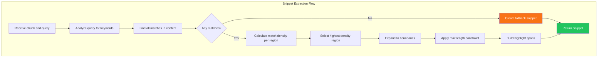

# LCS-DES-056a: Design Specification — Snippet Extraction

## Metadata & Categorization

| Field            | Value                                         |
| :--------------- | :-------------------------------------------- |
| **Document ID**  | LCS-DES-056a                                  |
| **Sub-Part ID**  | RAG-056a                                      |
| **Title**        | Snippet Extraction                            |
| **Version**      | v0.5.6a                                       |
| **Module**       | `Lexichord.Abstractions`                      |
| **Depends On**   | v0.4.3a (TextChunk), v0.5.4a (IQueryAnalyzer) |
| **Required By**  | v0.5.6b, v0.5.6c, v0.5.6d                     |
| **License Tier** | Core                                          |
| **Status**       | Draft                                         |
| **Last Updated** | 2026-01-27                                    |

---

## 1. Executive Summary

This sub-part defines the core snippet extraction service and data structures. It establishes `ISnippetService` as the primary interface for extracting contextual snippets from chunks, along with supporting records for snippets, highlights, and configuration.

### 1.1 Objectives

1. Define `ISnippetService` interface for snippet extraction
2. Create immutable record types for snippet data
3. Support configurable extraction options
4. Enable both single and multi-snippet extraction

### 1.2 Key Deliverables

- `ISnippetService` interface
- `Snippet` record with text, highlights, and truncation info
- `HighlightSpan` record for match positions
- `HighlightType` enum for match classification
- `SnippetOptions` record for configuration
- `SnippetService` implementation

---

## 2. Architecture & Modular Strategy

### 2.1 Dependencies

| Dependency           | Source  | Purpose                     |
| :------------------- | :------ | :-------------------------- |
| `TextChunk`          | v0.4.3a | Content source for snippets |
| `IQueryAnalyzer`     | v0.5.4a | Query keyword extraction    |
| `IBM25SearchService` | v0.5.1b | Matched terms list          |
| `ILogger<T>`         | v0.0.3b | Structured logging          |

### 2.2 Licensing Behavior

Snippet extraction is available to all license tiers. Configurable snippet length is gated to Writer Pro+.

---

## 3. Data Contract (API)

### 3.1 ISnippetService Interface

```csharp
namespace Lexichord.Abstractions.Contracts;

/// <summary>
/// Extracts contextual snippets from text chunks based on query terms.
/// </summary>
/// <remarks>
/// <para>Snippets are centered on regions with the highest query match density.</para>
/// <para>Highlights identify exact and fuzzy matches within the snippet.</para>
/// </remarks>
public interface ISnippetService
{
    /// <summary>
    /// Extracts a single snippet from a chunk centered on query matches.
    /// </summary>
    /// <param name="chunk">The text chunk to extract from.</param>
    /// <param name="query">The search query for match highlighting.</param>
    /// <param name="options">Extraction configuration options.</param>
    /// <returns>A Snippet containing the extracted text and highlights.</returns>
    Snippet ExtractSnippet(TextChunk chunk, string query, SnippetOptions options);

    /// <summary>
    /// Extracts multiple snippets when a chunk has several match regions.
    /// </summary>
    /// <param name="chunk">The text chunk to extract from.</param>
    /// <param name="query">The search query for match highlighting.</param>
    /// <param name="options">Extraction configuration options.</param>
    /// <param name="maxSnippets">Maximum number of snippets to extract.</param>
    /// <returns>A list of non-overlapping snippets, ordered by relevance.</returns>
    IReadOnlyList<Snippet> ExtractMultipleSnippets(
        TextChunk chunk,
        string query,
        SnippetOptions options,
        int maxSnippets = 3);

    /// <summary>
    /// Extracts snippets for multiple chunks in batch.
    /// </summary>
    /// <param name="chunks">The chunks to process.</param>
    /// <param name="query">The search query.</param>
    /// <param name="options">Extraction configuration.</param>
    /// <returns>Dictionary mapping chunk ID to extracted snippet.</returns>
    IDictionary<Guid, Snippet> ExtractBatch(
        IEnumerable<TextChunk> chunks,
        string query,
        SnippetOptions options);
}
```

### 3.2 Snippet Record

```csharp
namespace Lexichord.Abstractions.Contracts;

/// <summary>
/// A contextual text snippet extracted from a chunk with highlighted matches.
/// </summary>
/// <remarks>
/// <para>The Text property contains the extracted content, possibly with ellipsis.</para>
/// <para>Highlight positions are relative to the Text property, not the original chunk.</para>
/// </remarks>
/// <param name="Text">The extracted snippet text, may include "..." for truncation.</param>
/// <param name="Highlights">Highlight spans within the text, positions are relative to Text.</param>
/// <param name="StartOffset">Position in original chunk where this snippet starts.</param>
/// <param name="IsTruncatedStart">True if snippet was truncated at the beginning.</param>
/// <param name="IsTruncatedEnd">True if snippet was truncated at the end.</param>
public record Snippet(
    string Text,
    IReadOnlyList<HighlightSpan> Highlights,
    int StartOffset,
    bool IsTruncatedStart,
    bool IsTruncatedEnd)
{
    /// <summary>
    /// Gets the snippet length in characters.
    /// </summary>
    public int Length => Text.Length;

    /// <summary>
    /// Gets whether this snippet has any highlighted regions.
    /// </summary>
    public bool HasHighlights => Highlights.Count > 0;

    /// <summary>
    /// Gets whether this snippet was truncated at either end.
    /// </summary>
    public bool IsTruncated => IsTruncatedStart || IsTruncatedEnd;

    /// <summary>
    /// Creates an empty snippet (no content, no highlights).
    /// </summary>
    public static Snippet Empty => new(string.Empty, Array.Empty<HighlightSpan>(), 0, false, false);

    /// <summary>
    /// Creates a snippet from plain text without highlights.
    /// </summary>
    public static Snippet FromPlainText(string text) =>
        new(text, Array.Empty<HighlightSpan>(), 0, false, false);
}
```

### 3.3 HighlightSpan Record

```csharp
namespace Lexichord.Abstractions.Contracts;

/// <summary>
/// A highlighted span within a snippet, marking a matched region.
/// </summary>
/// <remarks>
/// <para>Positions are relative to the snippet Text, not the original chunk.</para>
/// <para>Overlapping spans should be merged before rendering.</para>
/// </remarks>
/// <param name="Start">Start position within the snippet text (0-based).</param>
/// <param name="Length">Length of the highlighted region.</param>
/// <param name="Type">The type of match this represents.</param>
public record HighlightSpan(int Start, int Length, HighlightType Type)
{
    /// <summary>
    /// Gets the end position (exclusive) of this span.
    /// </summary>
    public int End => Start + Length;

    /// <summary>
    /// Checks if this span overlaps with another.
    /// </summary>
    public bool Overlaps(HighlightSpan other) =>
        Start < other.End && other.Start < End;

    /// <summary>
    /// Merges this span with another overlapping span.
    /// </summary>
    /// <param name="other">The span to merge with.</param>
    /// <returns>A new span covering both regions.</returns>
    public HighlightSpan Merge(HighlightSpan other)
    {
        var newStart = Math.Min(Start, other.Start);
        var newEnd = Math.Max(End, other.End);
        // Prefer more specific type (QueryMatch > FuzzyMatch)
        var newType = Type < other.Type ? Type : other.Type;
        return new HighlightSpan(newStart, newEnd - newStart, newType);
    }
}
```

### 3.4 HighlightType Enum

```csharp
namespace Lexichord.Abstractions.Contracts;

/// <summary>
/// Types of highlighting for matched content.
/// </summary>
/// <remarks>
/// Ordered by specificity (lower value = more specific match).
/// </remarks>
public enum HighlightType
{
    /// <summary>
    /// Exact match of query term.
    /// </summary>
    QueryMatch = 0,

    /// <summary>
    /// Fuzzy/approximate match of query term.
    /// </summary>
    FuzzyMatch = 1,

    /// <summary>
    /// Key phrase identified by NLP (future).
    /// </summary>
    KeyPhrase = 2,

    /// <summary>
    /// Named entity (future).
    /// </summary>
    Entity = 3
}
```

### 3.5 SnippetOptions Record

```csharp
namespace Lexichord.Abstractions.Contracts;

/// <summary>
/// Configuration options for snippet extraction.
/// </summary>
/// <param name="MaxLength">Maximum snippet length in characters (default: 200).</param>
/// <param name="ContextPadding">Characters to include before/after matches (default: 50).</param>
/// <param name="RespectSentenceBoundaries">Whether to snap to sentence boundaries (default: true).</param>
/// <param name="IncludeFuzzyMatches">Whether to highlight fuzzy matches (default: true).</param>
/// <param name="MinMatchLength">Minimum term length to consider for matching (default: 3).</param>
public record SnippetOptions(
    int MaxLength = 200,
    int ContextPadding = 50,
    bool RespectSentenceBoundaries = true,
    bool IncludeFuzzyMatches = true,
    int MinMatchLength = 3)
{
    /// <summary>
    /// Default options for general use.
    /// </summary>
    public static SnippetOptions Default => new();

    /// <summary>
    /// Compact options for condensed displays.
    /// </summary>
    public static SnippetOptions Compact => new(MaxLength: 100, ContextPadding: 25);

    /// <summary>
    /// Extended options for detailed previews.
    /// </summary>
    public static SnippetOptions Extended => new(MaxLength: 300, ContextPadding: 75);
}
```

---

## 4. Implementation Logic

### 4.1 Flow Diagram



### 4.2 Match Finding Algorithm

```text
FIND matches in content:
│
├── Get keywords from query analyzer
│
├── For each keyword:
│   ├── Find all exact matches (case-insensitive)
│   │   └── Record position and type = QueryMatch
│   │
│   └── If IncludeFuzzyMatches:
│       ├── Find fuzzy matches (edit distance ≤ 2)
│       └── Record position and type = FuzzyMatch
│
├── Sort matches by position
│
├── Merge overlapping matches
│   └── Prefer more specific type
│
└── Return sorted match list
```

### 4.3 Density Calculation Logic

```text
CALCULATE density for region:
│
├── Define window size (100 characters)
│
├── Slide window across content:
│   ├── For each position:
│   │   ├── Count matches in window
│   │   ├── Weight by match type (exact=2, fuzzy=1)
│   │   └── Store (position, score)
│   │
│   └── Step = 10 characters
│
├── Find position with highest score
│
└── Return (center position, density score)
```

### 4.4 SnippetService Implementation

```csharp
namespace Lexichord.Modules.RAG.Services;

/// <summary>
/// Extracts contextual snippets from chunks with query highlighting.
/// </summary>
public sealed class SnippetService : ISnippetService
{
    private readonly IQueryAnalyzer _queryAnalyzer;
    private readonly ISentenceBoundaryDetector _sentenceDetector;
    private readonly ILogger<SnippetService> _logger;

    public SnippetService(
        IQueryAnalyzer queryAnalyzer,
        ISentenceBoundaryDetector sentenceDetector,
        ILogger<SnippetService> logger)
    {
        _queryAnalyzer = queryAnalyzer;
        _sentenceDetector = sentenceDetector;
        _logger = logger;
    }

    /// <inheritdoc />
    public Snippet ExtractSnippet(TextChunk chunk, string query, SnippetOptions options)
    {
        var content = chunk.Content;

        if (string.IsNullOrWhiteSpace(content))
        {
            return Snippet.Empty;
        }

        var keywords = _queryAnalyzer.Analyze(query).Keywords;
        var matches = FindMatches(content, keywords, options);

        _logger.LogDebug(
            "Extracting snippet: {MatchCount} matches found",
            matches.Count);

        if (matches.Count == 0)
        {
            return CreateFallbackSnippet(content, options);
        }

        // Find highest density region
        var (centerPos, _) = FindHighestDensityPosition(content, matches);

        // Calculate initial bounds
        var halfLength = options.MaxLength / 2;
        var start = Math.Max(0, centerPos - halfLength);
        var end = Math.Min(content.Length, centerPos + halfLength);

        // Expand to sentence boundaries if requested
        if (options.RespectSentenceBoundaries)
        {
            start = _sentenceDetector.FindSentenceStart(content, start);
            end = _sentenceDetector.FindSentenceEnd(content, end);
        }

        // Apply max length constraint
        var (finalStart, finalEnd, truncStart, truncEnd) =
            ApplyMaxLength(content, start, end, centerPos, options.MaxLength);

        // Build the snippet
        var text = BuildSnippetText(content, finalStart, finalEnd, truncStart, truncEnd);
        var highlights = BuildHighlights(matches, finalStart, text.Length, truncStart);

        _logger.LogDebug(
            "Snippet bounds: {Start}-{End}, truncated: {TruncStart}/{TruncEnd}",
            finalStart, finalEnd, truncStart, truncEnd);

        return new Snippet(text, highlights, finalStart, truncStart, truncEnd);
    }

    /// <inheritdoc />
    public IReadOnlyList<Snippet> ExtractMultipleSnippets(
        TextChunk chunk,
        string query,
        SnippetOptions options,
        int maxSnippets = 3)
    {
        var content = chunk.Content;
        var keywords = _queryAnalyzer.Analyze(query).Keywords;
        var matches = FindMatches(content, keywords, options);

        if (matches.Count == 0)
        {
            return new[] { CreateFallbackSnippet(content, options) };
        }

        // Cluster matches by proximity
        var clusters = ClusterMatches(matches, clusterThreshold: 100);
        var snippets = new List<Snippet>();
        var usedRanges = new List<(int Start, int End)>();

        foreach (var cluster in clusters
            .OrderByDescending(c => c.Matches.Count)
            .Take(maxSnippets))
        {
            var centerPos = cluster.CenterPosition;
            var snippet = ExtractSnippetAtPosition(content, centerPos, matches, options);

            // Check for overlap with existing snippets
            var range = (snippet.StartOffset, snippet.StartOffset + snippet.Length);
            if (!usedRanges.Any(r => Overlaps(r, range)))
            {
                snippets.Add(snippet);
                usedRanges.Add(range);
            }
        }

        return snippets;
    }

    /// <inheritdoc />
    public IDictionary<Guid, Snippet> ExtractBatch(
        IEnumerable<TextChunk> chunks,
        string query,
        SnippetOptions options)
    {
        var keywords = _queryAnalyzer.Analyze(query).Keywords;
        var result = new Dictionary<Guid, Snippet>();

        foreach (var chunk in chunks)
        {
            var matches = FindMatches(chunk.Content, keywords, options);
            var snippet = matches.Count > 0
                ? ExtractSnippetFromMatches(chunk.Content, matches, options)
                : CreateFallbackSnippet(chunk.Content, options);

            result[chunk.Id] = snippet;
        }

        return result;
    }

    private List<MatchInfo> FindMatches(
        string content,
        IReadOnlyList<string> keywords,
        SnippetOptions options)
    {
        var matches = new List<MatchInfo>();

        foreach (var keyword in keywords.Where(k => k.Length >= options.MinMatchLength))
        {
            // Find exact matches
            var index = 0;
            while ((index = content.IndexOf(keyword, index, StringComparison.OrdinalIgnoreCase)) >= 0)
            {
                matches.Add(new MatchInfo(index, keyword.Length, HighlightType.QueryMatch));
                index += keyword.Length;
            }

            // Find fuzzy matches if enabled
            if (options.IncludeFuzzyMatches)
            {
                matches.AddRange(FindFuzzyMatches(content, keyword));
            }
        }

        return MergeOverlappingMatches(matches.OrderBy(m => m.Position).ToList());
    }

    private Snippet CreateFallbackSnippet(string content, SnippetOptions options)
    {
        var length = Math.Min(content.Length, options.MaxLength);
        var text = content[..length];
        var truncated = length < content.Length;

        _logger.LogWarning("No matches found in chunk, using fallback");

        return new Snippet(
            truncated ? text + "..." : text,
            Array.Empty<HighlightSpan>(),
            StartOffset: 0,
            IsTruncatedStart: false,
            IsTruncatedEnd: truncated);
    }

    private static bool Overlaps((int Start, int End) a, (int Start, int End) b) =>
        a.Start < b.End && b.Start < a.End;

    private record MatchInfo(int Position, int Length, HighlightType Type);
    private record MatchCluster(List<MatchInfo> Matches, int CenterPosition);
}
```

---

## 5. Data Persistence

This sub-part defines data structures and services only. No persistence is required.

---

## 6. UI/UX Specifications

N/A — This sub-part defines services and data structures. UI is specified in v0.5.6b.

---

## 7. Observability & Logging

| Level   | Source         | Message Template                                      |
| :------ | :------------- | :---------------------------------------------------- |
| Debug   | SnippetService | `"Extracting snippet: {MatchCount} matches found"`    |
| Debug   | SnippetService | `"Snippet bounds: {Start}-{End}, truncated: {Flags}"` |
| Debug   | SnippetService | `"Batch extraction: {ChunkCount} chunks processed"`   |
| Warning | SnippetService | `"No matches found in chunk, using fallback"`         |
| Error   | SnippetService | `"Snippet extraction failed: {Error}"`                |

---

## 8. Security & Safety

| Concern        | Mitigation                                |
| :------------- | :---------------------------------------- |
| Large content  | Limit scan range to MaxLength \* 10       |
| Infinite loops | Timeout on fuzzy matching (100ms max)     |
| Memory         | Reuse StringBuilder, limit match count    |
| Null content   | Return Snippet.Empty for null/empty input |

---

## 9. Acceptance Criteria (QA)

| #   | Category        | Criterion                                        |
| :-- | :-------------- | :----------------------------------------------- |
| 1   | **Functional**  | Single snippet extraction returns valid Snippet  |
| 2   | **Functional**  | Multi-snippet extraction returns non-overlapping |
| 3   | **Functional**  | Batch extraction processes all chunks            |
| 4   | **Functional**  | Empty query returns first N characters           |
| 5   | **Performance** | Single extraction completes in < 10ms            |
| 6   | **Highlights**  | Highlight positions are relative to snippet text |
| 7   | **Highlights**  | Overlapping matches are merged correctly         |
| 8   | **Edge Case**   | Empty content returns Snippet.Empty              |

---

## 10. Unit Tests

```csharp
[Trait("Category", "Unit")]
[Trait("Feature", "v0.5.6a")]
public class SnippetServiceTests
{
    private readonly Mock<IQueryAnalyzer> _queryAnalyzerMock;
    private readonly Mock<ISentenceBoundaryDetector> _sentenceDetectorMock;
    private readonly SnippetService _sut;

    public SnippetServiceTests()
    {
        _queryAnalyzerMock = new Mock<IQueryAnalyzer>();
        _sentenceDetectorMock = new Mock<ISentenceBoundaryDetector>();
        _sut = new SnippetService(
            _queryAnalyzerMock.Object,
            _sentenceDetectorMock.Object,
            NullLogger<SnippetService>.Instance);
    }

    [Fact]
    public void ExtractSnippet_CentersOnQueryMatch()
    {
        // Arrange
        var content = "Start text. The authentication flow requires tokens. End text.";
        var chunk = CreateChunk(content);
        _queryAnalyzerMock
            .Setup(x => x.Analyze("authentication"))
            .Returns(new QueryAnalysis(new[] { "authentication" }));
        _sentenceDetectorMock
            .Setup(x => x.FindSentenceStart(content, It.IsAny<int>()))
            .Returns<string, int>((_, p) => Math.Max(0, p));
        _sentenceDetectorMock
            .Setup(x => x.FindSentenceEnd(content, It.IsAny<int>()))
            .Returns<string, int>((t, p) => Math.Min(t.Length, p));

        // Act
        var snippet = _sut.ExtractSnippet(chunk, "authentication", SnippetOptions.Default);

        // Assert
        snippet.Text.Should().Contain("authentication");
        snippet.HasHighlights.Should().BeTrue();
    }

    [Fact]
    public void ExtractSnippet_RespectsMaxLength()
    {
        // Arrange
        var content = new string('x', 1000);
        var chunk = CreateChunk(content);
        _queryAnalyzerMock
            .Setup(x => x.Analyze(It.IsAny<string>()))
            .Returns(new QueryAnalysis(Array.Empty<string>()));

        // Act
        var snippet = _sut.ExtractSnippet(chunk, "query", new SnippetOptions(MaxLength: 200));

        // Assert
        snippet.Text.Length.Should().BeLessOrEqualTo(203); // +3 for "..."
    }

    [Fact]
    public void ExtractSnippet_EmptyContent_ReturnsEmpty()
    {
        // Arrange
        var chunk = CreateChunk(string.Empty);

        // Act
        var snippet = _sut.ExtractSnippet(chunk, "query", SnippetOptions.Default);

        // Assert
        snippet.Should().Be(Snippet.Empty);
    }

    [Fact]
    public void ExtractSnippet_NoMatches_ReturnsFallback()
    {
        // Arrange
        var content = "Some content without the search term.";
        var chunk = CreateChunk(content);
        _queryAnalyzerMock
            .Setup(x => x.Analyze("different"))
            .Returns(new QueryAnalysis(new[] { "different" }));

        // Act
        var snippet = _sut.ExtractSnippet(chunk, "different", SnippetOptions.Default);

        // Assert
        snippet.HasHighlights.Should().BeFalse();
        snippet.Text.Should().StartWith("Some content");
    }

    [Fact]
    public void ExtractMultipleSnippets_ReturnsNonOverlapping()
    {
        // Arrange
        var content = "First auth here. Middle content. Second auth here.";
        var chunk = CreateChunk(content);
        _queryAnalyzerMock
            .Setup(x => x.Analyze("auth"))
            .Returns(new QueryAnalysis(new[] { "auth" }));

        // Act
        var snippets = _sut.ExtractMultipleSnippets(
            chunk, "auth", new SnippetOptions(MaxLength: 20), maxSnippets: 3);

        // Assert
        snippets.Should().AllSatisfy(s => s.HasHighlights.Should().BeTrue());
        // Verify no overlaps
        for (int i = 0; i < snippets.Count; i++)
        {
            for (int j = i + 1; j < snippets.Count; j++)
            {
                var s1End = snippets[i].StartOffset + snippets[i].Length;
                var s2Start = snippets[j].StartOffset;
                (s1End <= s2Start || snippets[j].StartOffset + snippets[j].Length <= snippets[i].StartOffset)
                    .Should().BeTrue();
            }
        }
    }

    private static TextChunk CreateChunk(string content) =>
        new(Guid.NewGuid(), Guid.NewGuid(), content, 0, null, DateTime.UtcNow);
}

[Trait("Category", "Unit")]
[Trait("Feature", "v0.5.6a")]
public class SnippetTests
{
    [Fact]
    public void Empty_HasNoContent()
    {
        var snippet = Snippet.Empty;

        snippet.Text.Should().BeEmpty();
        snippet.HasHighlights.Should().BeFalse();
        snippet.IsTruncated.Should().BeFalse();
    }

    [Fact]
    public void FromPlainText_CreatesSnippetWithoutHighlights()
    {
        var snippet = Snippet.FromPlainText("Test content");

        snippet.Text.Should().Be("Test content");
        snippet.HasHighlights.Should().BeFalse();
    }
}

[Trait("Category", "Unit")]
[Trait("Feature", "v0.5.6a")]
public class HighlightSpanTests
{
    [Fact]
    public void Overlaps_DetectsOverlap()
    {
        var span1 = new HighlightSpan(0, 10, HighlightType.QueryMatch);
        var span2 = new HighlightSpan(5, 10, HighlightType.FuzzyMatch);

        span1.Overlaps(span2).Should().BeTrue();
    }

    [Fact]
    public void Overlaps_DetectsNoOverlap()
    {
        var span1 = new HighlightSpan(0, 5, HighlightType.QueryMatch);
        var span2 = new HighlightSpan(10, 5, HighlightType.FuzzyMatch);

        span1.Overlaps(span2).Should().BeFalse();
    }

    [Fact]
    public void Merge_CombinesOverlappingSpans()
    {
        var span1 = new HighlightSpan(0, 10, HighlightType.FuzzyMatch);
        var span2 = new HighlightSpan(5, 10, HighlightType.QueryMatch);

        var merged = span1.Merge(span2);

        merged.Start.Should().Be(0);
        merged.Length.Should().Be(15);
        merged.Type.Should().Be(HighlightType.QueryMatch); // More specific
    }
}
```

---

## Document History

| Version | Date       | Author         | Changes       |
| :------ | :--------- | :------------- | :------------ |
| 1.0     | 2026-01-27 | Lead Architect | Initial draft |
