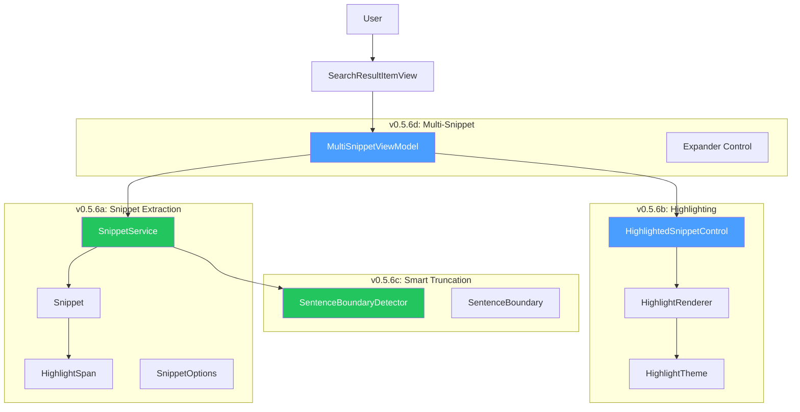
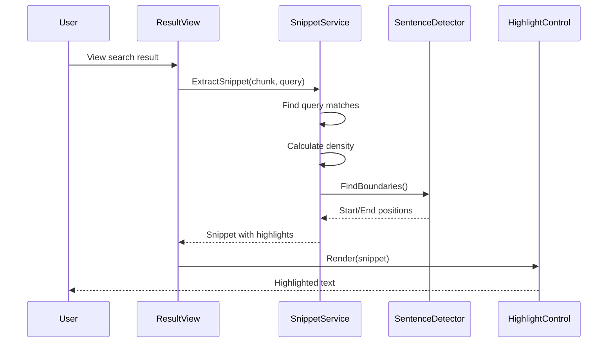

# LCS-DES-056: Design Specification Index — The Answer Preview

## Document Control

| Field                | Value                                   |
| :------------------- | :-------------------------------------- |
| **Document ID**      | LCS-DES-056-INDEX                       |
| **Feature ID**       | RAG-056                                 |
| **Feature Name**     | The Answer Preview (Snippet Generation) |
| **Target Version**   | v0.5.6                                  |
| **Module Scope**     | Lexichord.Modules.RAG                   |
| **Swimlane**         | Memory                                  |
| **License Tier**     | Core (basic) / Writer Pro (config)      |
| **Feature Gate Key** | `FeatureFlags.RAG.AnswerPreview`        |
| **Status**           | In Progress (a,b,c ✅)                  |
| **Last Updated**     | 2026-02-03                              |

---

## 1. Executive Summary

**v0.5.6** delivers the **Answer Preview** — intelligent snippet generation that extracts and highlights the most relevant portions of search results. This release transforms raw chunks into polished, contextual snippets.

### 1.1 The Problem

Users struggle to evaluate search results because:

- Full chunk displays require reading excessive text
- Query terms are not visually distinguished
- Truncation cuts mid-sentence, reducing readability
- Multiple relevant regions in a document are hidden

### 1.2 The Solution

Implement a comprehensive snippet system that:

- **Extracts contextual snippets** centered on query match regions
- **Highlights query terms** with visual distinction for exact vs. fuzzy
- **Respects sentence boundaries** for natural reading flow
- **Supports multiple snippets** when documents contain several relevant regions

### 1.3 Business Value

| Value            | Description                                        |
| :--------------- | :------------------------------------------------- |
| **Speed**        | Users scan snippets instead of reading full chunks |
| **Precision**    | Highlighted terms show exactly what matched        |
| **Readability**  | Sentence-aware truncation maintains context        |
| **Completeness** | Multi-snippet shows all relevant document regions  |
| **Foundation**   | Enables AI-generated summaries in v0.6.x           |

---

## 2. Related Documents

### 2.1 Scope Breakdown Document

| Document                            | Description                          |
| :---------------------------------- | :----------------------------------- |
| **[LCS-SBD-056](./LCS-SBD-056.md)** | Scope Breakdown — The Answer Preview |

### 2.2 Sub-Part Design Specifications

| Sub-Part | Document                              | Title                   | Description                         | Status         |
| :------- | :------------------------------------ | :---------------------- | :---------------------------------- | :------------- |
| v0.5.6a  | **[LCS-DES-056a](./LCS-DES-056a.md)** | Snippet Extraction      | Core extraction service and records | ✅ Implemented |
| v0.5.6b  | **[LCS-DES-056b](./LCS-DES-056b.md)** | Query Term Highlighting | Highlight rendering and styling     | ✅ Implemented |
| v0.5.6c  | **[LCS-DES-056c](./LCS-DES-056c.md)** | Smart Truncation        | Sentence boundary detection         | ✅ Implemented |
| v0.5.6d  | **[LCS-DES-056d](./LCS-DES-v0.5.6d.md)** | Multi-Snippet Results   | Expandable multi-region display     | ✅ Implemented |

---

## 3. Architecture Overview

### 3.1 Component Diagram



### 3.2 Snippet Pipeline Flow



---

## 4. Dependencies

### 4.1 Upstream Dependencies (Required)

| Interface              | Source Version        | Purpose                        |
| :--------------------- | :-------------------- | :----------------------------- |
| `IHybridSearchService` | v0.5.1c               | Search with BM25 terms         |
| `IBM25SearchService`   | v0.5.1b               | Matched terms for highlighting |
| `IQueryAnalyzer`       | v0.5.4a               | Query keyword extraction       |
| `TextChunk`            | v0.4.3a               | Content source                 |
| `SearchHit`            | v0.4.5a               | Result container               |
| `SearchResultItemView` | v0.4.6b               | Parent UI control              |
| `ISettingsService`     | v0.1.6a               | Snippet length preference      |
| `ViewModelBase`        | CommunityToolkit.Mvvm | Observable base                |

### 4.2 Downstream Consumers (Future)

| Version | Feature        | Consumes                          |
| :------ | :------------- | :-------------------------------- |
| v0.5.7  | Reference Dock | Snippets in polished result cards |
| v0.5.8  | Hardening      | Performance testing with snippets |
| v0.6.x  | AI Assistant   | AI-generated answer summaries     |

---

## 5. License Gating Strategy

The Answer Preview uses a **Universal Availability** strategy with optional configuration.

### 5.1 Behavior by License Tier

| Tier       | Snippets | Highlighting | Truncation | Multi-Snippet | Config Length |
| :--------- | :------- | :----------- | :--------- | :------------ | :------------ |
| Core       | ✓        | ✓            | ✓          | ✓             | Default only  |
| Writer Pro | ✓        | ✓            | ✓          | ✓             | ✓             |
| Teams      | ✓        | ✓            | ✓          | ✓             | ✓             |
| Enterprise | ✓        | ✓            | ✓          | ✓             | ✓             |

### 5.2 Implementation Pattern

```csharp
// All users get snippet generation
var snippet = _snippetService.ExtractSnippet(chunk, query, options);

// Configurable length only for Writer Pro+
var maxLength = _licenseContext.HasFeature(FeatureFlags.RAG.ConfigurableSnippetLength)
    ? _settingsService.GetSnippetLength()
    : 200; // Default for Core
```

---

## 6. Key Interfaces Summary

| Interface                   | Defined In | Purpose                     |
| :-------------------------- | :--------- | :-------------------------- |
| `ISnippetService`           | v0.5.6a    | Snippet extraction          |
| `IHighlightRenderer`        | v0.5.6b    | Platform-agnostic rendering |
| `ISentenceBoundaryDetector` | v0.5.6c    | Sentence boundary detection |

| Record/DTO         | Defined In | Purpose                   |
| :----------------- | :--------- | :------------------------ |
| `Snippet`          | v0.5.6a    | Extracted snippet content |
| `HighlightSpan`    | v0.5.6a    | Match position and type   |
| `SnippetOptions`   | v0.5.6a    | Extraction configuration  |
| `HighlightTheme`   | v0.5.6b    | Highlight colors          |
| `SentenceBoundary` | v0.5.6c    | Sentence position         |

| Enum            | Defined In | Purpose            |
| :-------------- | :--------- | :----------------- |
| `HighlightType` | v0.5.6a    | Match type styling |

---

## 7. Implementation Checklist Summary

| Sub-Part    | Tasks                   | Est. Hours   |
| :---------- | :---------------------- | :----------- |
| v0.5.6a     | Snippet Extraction      | 8.5          |
| v0.5.6b     | Query Term Highlighting | 6.5          |
| v0.5.6c     | Smart Truncation        | 7.0          |
| v0.5.6d     | Multi-Snippet Results   | 8.0          |
| Integration | DI, Events, Tests       | 2.5          |
| **Total**   |                         | **32 hours** |

See [LCS-SBD-056](./LCS-SBD-056.md) Section 4 for the detailed task breakdown.

---

## 8. Success Criteria Summary

| Category        | Criterion                   | Target            |
| :-------------- | :-------------------------- | :---------------- |
| **Performance** | Snippet extraction time     | < 10ms            |
| **Performance** | No lag when scrolling       | Smooth 60fps      |
| **Quality**     | Sentence boundary accuracy  | 95%+              |
| **Quality**     | Highlight position accuracy | 100%              |
| **UX**          | Scan time improvement       | 40%+ vs full text |

See [LCS-SBD-056](./LCS-SBD-056.md) Section 9 for full success metrics.

---

## 9. Test Coverage Summary

| Sub-Part | Unit Tests                          | Integration Tests   |
| :------- | :---------------------------------- | :------------------ |
| v0.5.6a  | Extraction, match detection         | Full pipeline       |
| v0.5.6b  | Highlight positioning, styling      | UI rendering        |
| v0.5.6c  | Sentence detection, density scoring | Truncation accuracy |
| v0.5.6d  | Clustering, deduplication           | Expand/collapse     |

See individual design specs for detailed test scenarios.

---

## 10. What This Enables

| Version | Feature        | Uses From v0.5.6                  |
| :------ | :------------- | :-------------------------------- |
| v0.5.7  | Reference Dock | Snippet display in result cards   |
| v0.5.8  | Hardening      | Performance testing with snippets |
| v0.6.x  | AI Assistant   | AI-generated answer summaries     |
| v0.7.x  | Smart Preview  | Document preview hover cards      |

---

## Document History

| Version | Date       | Author         | Changes       |
| :------ | :--------- | :------------- | :------------ |
| 1.0     | 2026-01-27 | Lead Architect | Initial draft |
