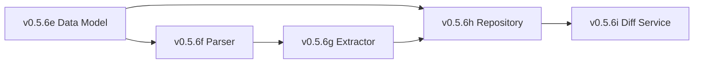

# LCS-DES-056-KG Index: Claim Extraction Design Specifications

## Document Control

| Field | Value |
| :--- | :--- |
| **System Breakdown** | LCS-SBD-056-KG |
| **Version** | v0.5.6 |
| **Codename** | Claim Extraction (CKVS Phase 2b) |
| **Total Sub-Parts** | 5 |
| **Total Estimated Hours** | 28 hours |
| **Status** | Implemented |
| **Last Updated** | 2026-01-31 |

---

## Sub-Part Overview

| ID | Document | Title | Hours | Description |
| :- | :------- | :---- | :---- | :---------- |
| v0.5.6e | [LCS-DES-056-KG-e](LCS-DES-056-KG-e.md) | Claim Data Model | 4 | ✅ Core data types: `Claim`, `ClaimEntity`, `ClaimObject`, `ClaimEvidence` |
| v0.5.6f | [LCS-DES-056-KG-f](LCS-DES-056-KG-f.md) | Sentence Parser | 6 | Dependency parsing for claim structure |
| v0.5.6g | [LCS-DES-056-KG-g](LCS-DES-056-KG-g.md) | Claim Extractor | 8 | Extract claims from parsed sentences |
| v0.5.6h | [LCS-DES-056-KG-h](LCS-DES-056-KG-h.md) | Claim Repository | 5 | PostgreSQL storage with search |
| v0.5.6i | [LCS-DES-056-KG-i](LCS-DES-056-KG-i.md) | Claim Diff Service | 5 | Compare claims between doc versions |

---

## Architecture Summary

```
┌─────────────────────────────────────────────────────────────────┐
│                  v0.5.6-KG Claim Extraction                      │
├─────────────────────────────────────────────────────────────────┤
│                                                                  │
│  ┌─────────────────────────────────────────────────────────────┐│
│  │                    NLU Pipeline                              ││
│  │                                                              ││
│  │  ┌─────────────────┐    ┌─────────────────┐                 ││
│  │  │   v0.5.6f       │    │   v0.5.6g       │                 ││
│  │  │   Sentence      │───►│   Claim         │                 ││
│  │  │   Parser        │    │   Extractor     │                 ││
│  │  │   ───────────   │    │   ───────────   │                 ││
│  │  │   SpaCy Deps    │    │   Patterns      │                 ││
│  │  │   POS Tagging   │    │   Dependency    │                 ││
│  │  │   SRL           │    │   Extraction    │                 ││
│  │  └─────────────────┘    └────────┬────────┘                 ││
│  │                                  │                           ││
│  │                                  ▼                           ││
│  │                         ┌─────────────────┐                 ││
│  │                         │   v0.5.6e       │                 ││
│  │                         │   Claim         │                 ││
│  │                         │   Data Model    │                 ││
│  │                         │   ───────────   │                 ││
│  │                         │   Subject       │                 ││
│  │                         │   Predicate     │                 ││
│  │                         │   Object        │                 ││
│  │                         │   Evidence      │                 ││
│  │                         └────────┬────────┘                 ││
│  │                                  │                           ││
│  │          ┌───────────────────────┼───────────────────────┐  ││
│  │          │                       │                       │   ││
│  │          ▼                       ▼                       ▼   ││
│  │  ┌─────────────────┐    ┌─────────────────┐    ┌───────────┐││
│  │  │   v0.5.6h       │    │   v0.5.6i       │    │ Validation│││
│  │  │   Claim         │    │   Claim Diff    │    │ (v0.6.5)  │││
│  │  │   Repository    │    │   Service       │    │           │││
│  │  │   ───────────   │    │   ───────────   │    └───────────┘││
│  │  │   PostgreSQL    │    │   Version Diff  │                 ││
│  │  │   Full-text     │    │   Contradictions│                 ││
│  │  │   Search        │    │   History       │                 ││
│  │  └─────────────────┘    └─────────────────┘                 ││
│  │                                                              ││
│  └─────────────────────────────────────────────────────────────┘│
│                                                                  │
└─────────────────────────────────────────────────────────────────┘
```

---

## Key Interfaces

| Interface | Module | Purpose |
| :-------- | :----- | :------ |
| `Claim` | v0.5.6e | Subject-predicate-object assertion |
| `ISentenceParser` | v0.5.6f | Parse text into linguistic structures |
| `IClaimExtractionService` | v0.5.6g | Extract claims from parsed sentences |
| `IClaimRepository` | v0.5.6h | Persist and query claims |
| `IClaimDiffService` | v0.5.6i | Compare claims between versions |

---

## Claim Triple Structure

```
┌─────────────────────────────────────────────────────────────────┐
│                         CLAIM                                    │
├─────────────────────────────────────────────────────────────────┤
│                                                                  │
│   ┌───────────────┐         ┌───────────────┐                   │
│   │   SUBJECT     │         │   PREDICATE   │                   │
│   │   ─────────── │         │   ─────────── │                   │
│   │   EntityId    │────────►│   ACCEPTS     │                   │
│   │   EntityType  │         │   RETURNS     │                   │
│   │   SurfaceForm │         │   REQUIRES    │                   │
│   │               │         │   HAS_PROPERTY│                   │
│   │   "GET /users"│         │   IS_DEPRECATED                   │
│   └───────────────┘         └───────┬───────┘                   │
│                                     │                            │
│                                     ▼                            │
│                             ┌───────────────┐                   │
│                             │    OBJECT     │                   │
│                             │   ─────────── │                   │
│                             │   Entity OR   │                   │
│                             │   Literal     │                   │
│                             │               │                   │
│                             │ "limit param" │                   │
│                             │    OR 100     │                   │
│                             └───────────────┘                   │
│                                                                  │
│   ┌─────────────────────────────────────────────────────────┐   │
│   │                       EVIDENCE                           │   │
│   │   ─────────────────────────────────────────────────────  │   │
│   │   Sentence: "The GET /users endpoint accepts a limit..." │   │
│   │   StartOffset: 100  EndOffset: 145                       │   │
│   │   ExtractionMethod: PatternRule                          │   │
│   └─────────────────────────────────────────────────────────┘   │
│                                                                  │
└─────────────────────────────────────────────────────────────────┘
```

---

## Standard Predicates

| Predicate | Subject | Object | Example |
| :-------- | :------ | :----- | :------ |
| `ACCEPTS` | Endpoint | Parameter | "/users ACCEPTS limit" |
| `RETURNS` | Endpoint | Response | "/users RETURNS 200 OK" |
| `REQUIRES` | Entity | Entity | "/orders REQUIRES auth" |
| `HAS_PROPERTY` | Entity | Literal | "limit HAS_PROPERTY default=10" |
| `HAS_VALUE` | Concept | Literal | "rate limiting HAS_VALUE 100/min" |
| `IS_DEPRECATED` | Entity | Boolean | "/v1/users IS_DEPRECATED true" |
| `CONTAINS` | Entity | Entity | "API CONTAINS Auth Module" |
| `IMPLEMENTS` | Entity | Entity | "Service IMPLEMENTS Interface" |
| `DEPENDS_ON` | Entity | Entity | "Module DEPENDS_ON Library" |

---

## Dependencies

### Upstream (Required)

| Component | Version | Usage |
| :-------- | :------ | :---- |
| Entity Linking | v0.5.5-KG | Link claim subjects/objects |
| Axiom Store | v0.4.6-KG | Validate claims against axioms |
| Graph Repository | v0.4.5e | Entity resolution |
| DB Connection | v0.0.5b | PostgreSQL claim storage |
| SpaCy (Python) | 3.5+ | Dependency parsing |

### Downstream (Consumers)

| Component | Version | Usage |
| :-------- | :------ | :---- |
| Validation Engine | v0.6.5-KG | Validate claims against axioms |
| Contradiction Detection | v0.6.5 | Cross-document validation |
| Change Tracking | v0.7.x | Track claim changes |

---

## License Gating

| Tier | Data Model | Parser | Extractor | Repository | Diff |
| :--- | :--------- | :----- | :-------- | :--------- | :--- |
| Core | Types only | ✗ | ✗ | ✗ | ✗ |
| WriterPro | ✓ | ✗ | Read-only | Read-only | View |
| Teams | ✓ | ✓ | ✓ | Full | Full |
| Enterprise | ✓ | ✓ | Custom patterns | Full | Full |

---

## Performance Targets

| Metric | Target | Measurement |
| :----- | :----- | :---------- |
| Claim precision | >70% | Human evaluation |
| Claim recall | >60% | Human evaluation |
| Processing speed | <30s / 100 pages | Benchmark |
| Storage efficiency | <1KB / claim | Database metrics |
| Search latency | <100ms | Query benchmark |
| Diff performance | <1s / 1000 claims | Benchmark |

---

## Implementation Order



1. **v0.5.6e**: Data model first (no dependencies)
2. **v0.5.6f**: Sentence parser (depends on data model)
3. **v0.5.6h**: Repository (depends on data model)
4. **v0.5.6g**: Extractor (depends on parser + repository)
5. **v0.5.6i**: Diff service (depends on repository)

---

## Extraction Pipeline

```
TEXT INPUT
    │
    ▼
┌─────────────────────────────────────────────────────────────┐
│ 1. SENTENCE SEGMENTATION                                     │
│    Split text into sentences                                 │
└──────────────────────────┬──────────────────────────────────┘
                           │
                           ▼
┌─────────────────────────────────────────────────────────────┐
│ 2. TOKENIZATION + POS                                        │
│    [The DET] [endpoint NOUN] [accepts VERB] [limit NOUN]     │
└──────────────────────────┬──────────────────────────────────┘
                           │
                           ▼
┌─────────────────────────────────────────────────────────────┐
│ 3. DEPENDENCY PARSING                                        │
│              accepts                                         │
│              /    \                                          │
│          nsubj   dobj                                        │
│            |       |                                         │
│        endpoint  limit                                       │
└──────────────────────────┬──────────────────────────────────┘
                           │
                           ▼
┌─────────────────────────────────────────────────────────────┐
│ 4. CLAIM EXTRACTION                                          │
│    Pattern: "{ENDPOINT} accepts {PARAMETER}"                 │
│    Match: endpoint=subject, limit=object                     │
│    Predicate: ACCEPTS                                        │
└──────────────────────────┬──────────────────────────────────┘
                           │
                           ▼
┌─────────────────────────────────────────────────────────────┐
│ 5. ENTITY LINKING                                            │
│    endpoint → GET /users (EntityId: abc123)                  │
│    limit → limit parameter (EntityId: def456)                │
└──────────────────────────┬──────────────────────────────────┘
                           │
                           ▼
┌─────────────────────────────────────────────────────────────┐
│ OUTPUT: Claim(GET /users, ACCEPTS, limit)                    │
│         Confidence: 0.85                                     │
│         Evidence: "The endpoint accepts a limit parameter."  │
└─────────────────────────────────────────────────────────────┘
```

---

## Testing Strategy

| Sub-Part | Unit Tests | Integration Tests |
| :------- | :--------- | :---------------- |
| v0.5.6e | Record creation, factory methods | — |
| v0.5.6f | Tokenization, dependencies, SRL | SpaCy integration |
| v0.5.6g | Pattern matching, extraction | Full pipeline |
| v0.5.6h | CRUD operations, search | PostgreSQL persistence |
| v0.5.6i | Diff logic, semantic matching | History tracking |

---

## Changelog

| Version | Date | Author | Changes |
| :------ | :--- | :----- | :------ |
| 1.0 | 2026-01-31 | Lead Architect | Initial creation |

---
