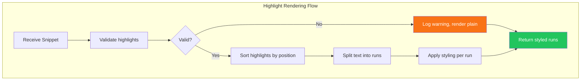

# LCS-DES-056b: Design Specification — Query Term Highlighting

## Metadata & Categorization

| Field            | Value                                                            |
| :--------------- | :--------------------------------------------------------------- |
| **Document ID**  | LCS-DES-056b                                                     |
| **Sub-Part ID**  | RAG-056b                                                         |
| **Title**        | Query Term Highlighting                                          |
| **Version**      | v0.5.6b                                                          |
| **Module**       | `Lexichord.Modules.RAG`                                          |
| **Depends On**   | v0.5.6a (Snippet, HighlightSpan), v0.4.6b (SearchResultItemView) |
| **Required By**  | v0.5.6d                                                          |
| **License Tier** | Core                                                             |
| **Status**       | Draft                                                            |
| **Last Updated** | 2026-01-27                                                       |

---

## 1. Executive Summary

This sub-part implements the visual rendering of highlighted query matches within snippets. It creates a custom control that applies distinct styling for exact vs. fuzzy matches and integrates with the theme system.

### 1.1 Objectives

1. Create `HighlightedSnippetControl` for styled text rendering
2. Implement `IHighlightRenderer` for platform-agnostic highlight generation
3. Define `HighlightTheme` for customizable colors
4. Support keyboard navigation and accessibility

### 1.2 Key Deliverables

- `IHighlightRenderer` interface
- `HighlightRenderer` implementation
- `HighlightedSnippetControl.axaml` custom control
- `HighlightTheme` record for colors
- Visual distinction for exact vs. fuzzy matches
- Unit tests for highlight positioning

---

## 2. Architecture & Modular Strategy

### 2.1 Dependencies

| Dependency             | Source                | Purpose                   |
| :--------------------- | :-------------------- | :------------------------ |
| `Snippet`              | v0.5.6a               | Data source for rendering |
| `HighlightSpan`        | v0.5.6a               | Match position info       |
| `HighlightType`        | v0.5.6a               | Match type for styling    |
| `SearchResultItemView` | v0.4.6b               | Parent control            |
| `ViewModelBase`        | CommunityToolkit.Mvvm | Observable base           |

### 2.2 Licensing Behavior

Highlight rendering is available to all license tiers. Custom theme colors may be gated to Writer Pro+ in future versions.

---

## 3. Data Contract (API)

### 3.1 IHighlightRenderer Interface

```csharp
namespace Lexichord.Modules.RAG.Rendering;

/// <summary>
/// Renders highlighted text for display in search results.
/// </summary>
/// <remarks>
/// Platform-agnostic interface to support unit testing without UI dependencies.
/// </remarks>
public interface IHighlightRenderer
{
    /// <summary>
    /// Renders a snippet with highlights into a collection of styled runs.
    /// </summary>
    /// <param name="snippet">The snippet to render.</param>
    /// <param name="theme">The highlight theme to apply.</param>
    /// <returns>A collection of text runs with styling information.</returns>
    IReadOnlyList<StyledTextRun> Render(Snippet snippet, HighlightTheme theme);

    /// <summary>
    /// Validates that highlight spans are within text bounds.
    /// </summary>
    /// <param name="snippet">The snippet to validate.</param>
    /// <returns>True if all highlights are valid; false otherwise.</returns>
    bool ValidateHighlights(Snippet snippet);
}

/// <summary>
/// A styled portion of text for rendering.
/// </summary>
/// <param name="Text">The text content of this run.</param>
/// <param name="Style">The style to apply.</param>
public record StyledTextRun(string Text, TextStyle Style);

/// <summary>
/// Styling information for a text run.
/// </summary>
/// <param name="IsBold">Whether the text is bold.</param>
/// <param name="IsItalic">Whether the text is italic.</param>
/// <param name="ForegroundColor">Text color (hex format).</param>
/// <param name="BackgroundColor">Background color (hex format), null for none.</param>
public record TextStyle(
    bool IsBold = false,
    bool IsItalic = false,
    string? ForegroundColor = null,
    string? BackgroundColor = null)
{
    /// <summary>
    /// Default text style (no formatting).
    /// </summary>
    public static TextStyle Default => new();

    /// <summary>
    /// Bold text style for exact matches.
    /// </summary>
    public static TextStyle ExactMatch => new(IsBold: true);

    /// <summary>
    /// Italic text style for fuzzy matches.
    /// </summary>
    public static TextStyle FuzzyMatch => new(IsItalic: true);
}
```

### 3.2 HighlightTheme Record

```csharp
namespace Lexichord.Modules.RAG.Rendering;

/// <summary>
/// Theme configuration for highlight colors.
/// </summary>
/// <param name="ExactMatchForeground">Text color for exact matches.</param>
/// <param name="ExactMatchBackground">Background color for exact matches.</param>
/// <param name="FuzzyMatchForeground">Text color for fuzzy matches.</param>
/// <param name="FuzzyMatchBackground">Background color for fuzzy matches.</param>
/// <param name="KeyPhraseForeground">Text color for key phrases.</param>
/// <param name="EllipsisColor">Color for truncation ellipsis.</param>
public record HighlightTheme(
    string ExactMatchForeground,
    string? ExactMatchBackground,
    string FuzzyMatchForeground,
    string? FuzzyMatchBackground,
    string? KeyPhraseForeground,
    string EllipsisColor)
{
    /// <summary>
    /// Default light theme.
    /// </summary>
    public static HighlightTheme Light => new(
        ExactMatchForeground: "#1a56db",      // Blue
        ExactMatchBackground: "#dbeafe",       // Light blue
        FuzzyMatchForeground: "#7c3aed",       // Purple
        FuzzyMatchBackground: "#ede9fe",       // Light purple
        KeyPhraseForeground: "#059669",        // Green
        EllipsisColor: "#9ca3af");             // Gray

    /// <summary>
    /// Default dark theme.
    /// </summary>
    public static HighlightTheme Dark => new(
        ExactMatchForeground: "#60a5fa",       // Light blue
        ExactMatchBackground: "#1e3a5f",       // Dark blue
        FuzzyMatchForeground: "#a78bfa",       // Light purple
        FuzzyMatchBackground: "#3b2d5e",       // Dark purple
        KeyPhraseForeground: "#34d399",        // Light green
        EllipsisColor: "#6b7280");             // Gray
}
```

---

## 4. Implementation Logic

### 4.1 Flow Diagram



### 4.2 Text Splitting Algorithm

```text
SPLIT text into styled runs:
│
├── Initialize current position = 0
├── Initialize runs list
│
├── For each highlight (sorted by Start):
│   │
│   ├── If position < highlight.Start:
│   │   └── Add plain run from position to highlight.Start
│   │
│   ├── Add highlighted run from highlight.Start to highlight.End
│   │   └── Apply style based on highlight.Type
│   │
│   └── Update position = highlight.End
│
├── If position < text.Length:
│   └── Add final plain run from position to end
│
└── Return runs list
```

### 4.3 HighlightRenderer Implementation

```csharp
namespace Lexichord.Modules.RAG.Rendering;

/// <summary>
/// Renders highlighted snippets into styled text runs.
/// </summary>
public sealed class HighlightRenderer : IHighlightRenderer
{
    private readonly ILogger<HighlightRenderer> _logger;

    public HighlightRenderer(ILogger<HighlightRenderer> logger)
    {
        _logger = logger;
    }

    /// <inheritdoc />
    public IReadOnlyList<StyledTextRun> Render(Snippet snippet, HighlightTheme theme)
    {
        if (string.IsNullOrEmpty(snippet.Text))
        {
            return Array.Empty<StyledTextRun>();
        }

        if (!ValidateHighlights(snippet))
        {
            _logger.LogWarning("Invalid highlights in snippet, rendering as plain text");
            return new[] { new StyledTextRun(snippet.Text, TextStyle.Default) };
        }

        var text = snippet.Text;
        var runs = new List<StyledTextRun>();
        var position = 0;

        // Handle starting ellipsis
        if (snippet.IsTruncatedStart && text.StartsWith("..."))
        {
            runs.Add(new StyledTextRun("...", CreateEllipsisStyle(theme)));
            position = 3;
        }

        // Adjust highlight positions for starting ellipsis
        var highlights = snippet.Highlights
            .OrderBy(h => h.Start)
            .ToList();

        _logger.LogDebug("Rendering {SpanCount} highlight spans", highlights.Count);

        foreach (var highlight in highlights)
        {
            // Add plain text before this highlight
            if (position < highlight.Start)
            {
                var plainText = text[position..highlight.Start];
                runs.Add(new StyledTextRun(plainText, TextStyle.Default));
            }

            // Add highlighted text
            var highlightEnd = Math.Min(highlight.End, text.Length);
            var highlightText = text[highlight.Start..highlightEnd];
            var style = GetStyleForType(highlight.Type, theme);
            runs.Add(new StyledTextRun(highlightText, style));

            position = highlightEnd;
        }

        // Add remaining plain text
        var endingEllipsisStart = snippet.IsTruncatedEnd && text.EndsWith("...")
            ? text.Length - 3
            : text.Length;

        if (position < endingEllipsisStart)
        {
            var remainingText = text[position..endingEllipsisStart];
            runs.Add(new StyledTextRun(remainingText, TextStyle.Default));
        }

        // Handle ending ellipsis
        if (snippet.IsTruncatedEnd && text.EndsWith("..."))
        {
            runs.Add(new StyledTextRun("...", CreateEllipsisStyle(theme)));
        }

        return runs;
    }

    /// <inheritdoc />
    public bool ValidateHighlights(Snippet snippet)
    {
        if (snippet.Highlights.Count == 0)
        {
            return true;
        }

        foreach (var highlight in snippet.Highlights)
        {
            if (highlight.Start < 0 || highlight.End > snippet.Text.Length)
            {
                return false;
            }

            if (highlight.Length <= 0)
            {
                return false;
            }
        }

        return true;
    }

    private static TextStyle GetStyleForType(HighlightType type, HighlightTheme theme)
    {
        return type switch
        {
            HighlightType.QueryMatch => new TextStyle(
                IsBold: true,
                ForegroundColor: theme.ExactMatchForeground,
                BackgroundColor: theme.ExactMatchBackground),
            HighlightType.FuzzyMatch => new TextStyle(
                IsItalic: true,
                ForegroundColor: theme.FuzzyMatchForeground,
                BackgroundColor: theme.FuzzyMatchBackground),
            HighlightType.KeyPhrase => new TextStyle(
                ForegroundColor: theme.KeyPhraseForeground),
            _ => TextStyle.Default
        };
    }

    private static TextStyle CreateEllipsisStyle(HighlightTheme theme) =>
        new(ForegroundColor: theme.EllipsisColor);
}
```

---

## 5. UI/UX Specifications

### 5.1 HighlightedSnippetControl XAML

```xml
<!-- HighlightedSnippetControl.axaml -->
<UserControl xmlns="https://github.com/avaloniaui"
             xmlns:x="http://schemas.microsoft.com/winfx/2006/xaml"
             xmlns:vm="using:Lexichord.Modules.RAG.ViewModels"
             x:Class="Lexichord.Modules.RAG.Views.HighlightedSnippetControl"
             x:DataType="vm:HighlightedSnippetViewModel">

    <UserControl.Styles>
        <Style Selector="TextBlock.snippet">
            <Setter Property="FontFamily" Value="{DynamicResource ContentFontFamily}"/>
            <Setter Property="FontSize" Value="13"/>
            <Setter Property="LineHeight" Value="20"/>
            <Setter Property="TextWrapping" Value="Wrap"/>
        </Style>

        <Style Selector="Run.exact-match">
            <Setter Property="FontWeight" Value="SemiBold"/>
            <Setter Property="Foreground" Value="{DynamicResource HighlightExactForeground}"/>
        </Style>

        <Style Selector="Run.fuzzy-match">
            <Setter Property="FontStyle" Value="Italic"/>
            <Setter Property="Foreground" Value="{DynamicResource HighlightFuzzyForeground}"/>
        </Style>

        <Style Selector="Run.ellipsis">
            <Setter Property="Foreground" Value="{DynamicResource TextTertiary}"/>
        </Style>
    </UserControl.Styles>

    <SelectableTextBlock Classes="snippet"
                         Inlines="{Binding FormattedInlines}"
                         IsTabStop="True"
                         Focusable="True"/>
</UserControl>
```

### 5.2 Visual Design Layout

```text
┌─────────────────────────────────────────────────────────────────────────────┐
│  📄 document-name.md                                                        │
├─────────────────────────────────────────────────────────────────────────────┤
│                                                                             │
│  ...token expires, the **authentication** flow requires a refresh. The     │
│  system validates *credentials* against the identity provider and          │
│  returns a new **token**...                                                 │
│                      ↑ bold + blue bg    ↑ italic + purple    ↑ bold       │
│                      (exact match)       (fuzzy match)        (exact)      │
│                                                                             │
└─────────────────────────────────────────────────────────────────────────────┘
```

### 5.3 Component Styling Requirements

| Component        | Theme Resource                   | Notes                 |
| :--------------- | :------------------------------- | :-------------------- |
| Base text        | `Brush.Text.Primary`             | Default snippet color |
| Exact match text | `Brush.Highlight.Primary`        | Bold, saturated blue  |
| Exact match bg   | `Brush.Highlight.PrimaryLight`   | Subtle background     |
| Fuzzy match text | `Brush.Highlight.Secondary`      | Italic, muted purple  |
| Fuzzy match bg   | `Brush.Highlight.SecondaryLight` | Subtle background     |
| Ellipsis         | `Brush.Text.Tertiary`            | Muted gray            |

### 5.4 Accessibility Requirements

| Requirement         | Implementation                            |
| :------------------ | :---------------------------------------- |
| Keyboard navigation | SelectableTextBlock with IsTabStop="True" |
| Screen reader       | Announce "X matches highlighted"          |
| Color contrast      | All colors meet WCAG 2.1 AA (4.5:1)       |
| Focus indicator     | Standard focus ring on snippet            |

---

## 6. Observability & Logging

| Level   | Source            | Message Template                                           |
| :------ | :---------------- | :--------------------------------------------------------- |
| Debug   | HighlightRenderer | `"Rendering {SpanCount} highlight spans"`                  |
| Warning | HighlightRenderer | `"Invalid highlights in snippet, rendering as plain text"` |
| Debug   | SnippetControl    | `"Snippet control loaded with {RunCount} text runs"`       |

---

## 7. Security & Safety

| Concern         | Mitigation                                      |
| :-------------- | :---------------------------------------------- |
| XSS in snippet  | Text rendered via TextBlock, not HTML           |
| Theme injection | Theme colors validated as hex format            |
| Memory leaks    | Inline collection cleared on DataContext change |

---

## 8. Acceptance Criteria (QA)

| #   | Category          | Criterion                                        |
| :-- | :---------------- | :----------------------------------------------- |
| 1   | **Functional**    | Exact matches render as bold with blue color     |
| 2   | **Functional**    | Fuzzy matches render as italic with purple color |
| 3   | **Functional**    | Ellipsis renders in muted gray                   |
| 4   | **Functional**    | Multiple highlights render correctly             |
| 5   | **Performance**   | No visible lag when rendering snippets           |
| 6   | **Accessibility** | Snippet is keyboard navigable                    |
| 7   | **Accessibility** | Colors meet contrast requirements                |
| 8   | **Theme**         | Light and dark themes display correctly          |

---

## 9. Unit Tests

```csharp
[Trait("Category", "Unit")]
[Trait("Feature", "v0.5.6b")]
public class HighlightRendererTests
{
    private readonly HighlightRenderer _sut = new(NullLogger<HighlightRenderer>.Instance);

    [Fact]
    public void Render_NoHighlights_ReturnsSingleRun()
    {
        // Arrange
        var snippet = Snippet.FromPlainText("Plain text without matches");

        // Act
        var runs = _sut.Render(snippet, HighlightTheme.Light);

        // Assert
        runs.Should().ContainSingle()
            .Which.Text.Should().Be("Plain text without matches");
    }

    [Fact]
    public void Render_SingleHighlight_ReturnsThreeRuns()
    {
        // Arrange
        var snippet = new Snippet(
            "Before match After",
            new[] { new HighlightSpan(7, 5, HighlightType.QueryMatch) },
            0, false, false);

        // Act
        var runs = _sut.Render(snippet, HighlightTheme.Light);

        // Assert
        runs.Should().HaveCount(3);
        runs[0].Text.Should().Be("Before ");
        runs[1].Text.Should().Be("match");
        runs[1].Style.IsBold.Should().BeTrue();
        runs[2].Text.Should().Be(" After");
    }

    [Fact]
    public void Render_ExactMatch_AppliesBoldStyle()
    {
        // Arrange
        var snippet = new Snippet(
            "test",
            new[] { new HighlightSpan(0, 4, HighlightType.QueryMatch) },
            0, false, false);

        // Act
        var runs = _sut.Render(snippet, HighlightTheme.Light);

        // Assert
        runs.Should().ContainSingle()
            .Which.Style.IsBold.Should().BeTrue();
    }

    [Fact]
    public void Render_FuzzyMatch_AppliesItalicStyle()
    {
        // Arrange
        var snippet = new Snippet(
            "test",
            new[] { new HighlightSpan(0, 4, HighlightType.FuzzyMatch) },
            0, false, false);

        // Act
        var runs = _sut.Render(snippet, HighlightTheme.Light);

        // Assert
        runs.Should().ContainSingle()
            .Which.Style.IsItalic.Should().BeTrue();
    }

    [Fact]
    public void Render_WithEllipsis_RendersEllipsisWithStyle()
    {
        // Arrange
        var snippet = new Snippet(
            "...truncated text...",
            Array.Empty<HighlightSpan>(),
            50, true, true);

        // Act
        var runs = _sut.Render(snippet, HighlightTheme.Light);

        // Assert
        runs.First().Text.Should().Be("...");
        runs.First().Style.ForegroundColor.Should().Be(HighlightTheme.Light.EllipsisColor);
        runs.Last().Text.Should().Be("...");
    }

    [Fact]
    public void ValidateHighlights_OutOfBounds_ReturnsFalse()
    {
        // Arrange
        var snippet = new Snippet(
            "short",
            new[] { new HighlightSpan(0, 100, HighlightType.QueryMatch) }, // Exceeds length
            0, false, false);

        // Act
        var isValid = _sut.ValidateHighlights(snippet);

        // Assert
        isValid.Should().BeFalse();
    }

    [Fact]
    public void ValidateHighlights_ValidSpans_ReturnsTrue()
    {
        // Arrange
        var snippet = new Snippet(
            "valid text",
            new[] { new HighlightSpan(0, 5, HighlightType.QueryMatch) },
            0, false, false);

        // Act
        var isValid = _sut.ValidateHighlights(snippet);

        // Assert
        isValid.Should().BeTrue();
    }
}

[Trait("Category", "Unit")]
[Trait("Feature", "v0.5.6b")]
public class HighlightThemeTests
{
    [Fact]
    public void Light_HasValidColors()
    {
        var theme = HighlightTheme.Light;

        theme.ExactMatchForeground.Should().StartWith("#");
        theme.FuzzyMatchForeground.Should().StartWith("#");
        theme.EllipsisColor.Should().StartWith("#");
    }

    [Fact]
    public void Dark_HasValidColors()
    {
        var theme = HighlightTheme.Dark;

        theme.ExactMatchForeground.Should().StartWith("#");
        theme.FuzzyMatchForeground.Should().StartWith("#");
        theme.EllipsisColor.Should().StartWith("#");
    }
}
```

---

## Document History

| Version | Date       | Author         | Changes       |
| :------ | :--------- | :------------- | :------------ |
| 1.0     | 2026-01-27 | Lead Architect | Initial draft |
