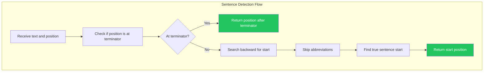

# LCS-DES-056c: Design Specification — Smart Truncation

## Metadata & Categorization

| Field            | Value                    |
| :--------------- | :----------------------- |
| **Document ID**  | LCS-DES-056c             |
| **Sub-Part ID**  | RAG-056c                 |
| **Title**        | Smart Truncation         |
| **Version**      | v0.5.6c                  |
| **Module**       | `Lexichord.Abstractions` |
| **Depends On**   | v0.5.6a (SnippetOptions) |
| **Required By**  | v0.5.6a (SnippetService) |
| **License Tier** | Core                     |
| **Status**       | Draft                    |
| **Last Updated** | 2026-01-27               |

---

## 1. Executive Summary

This sub-part implements intelligent snippet boundary detection that respects sentence structure. It provides `ISentenceBoundaryDetector` to find natural break points in text, ensuring snippets don't cut mid-sentence.

### 1.1 Objectives

1. Define `ISentenceBoundaryDetector` interface for boundary detection
2. Implement sentence detection with abbreviation awareness
3. Create match density scoring for optimal snippet centering
4. Support fallback to word boundaries when sentence detection fails

### 1.2 Key Deliverables

- `ISentenceBoundaryDetector` interface
- `SentenceBoundaryDetector` implementation
- `SentenceBoundary` record for positions
- Match density scoring algorithm
- Boundary snapping logic
- Unit tests with edge cases

---

## 2. Architecture & Modular Strategy

### 2.1 Dependencies

| Dependency       | Source  | Purpose                |
| :--------------- | :------ | :--------------------- |
| `SnippetOptions` | v0.5.6a | Configuration settings |
| `ILogger<T>`     | v0.0.3b | Structured logging     |

### 2.2 Licensing Behavior

Sentence boundary detection is available to all license tiers as it's a core part of snippet generation.

---

## 3. Data Contract (API)

### 3.1 ISentenceBoundaryDetector Interface

```csharp
namespace Lexichord.Abstractions.Contracts;

/// <summary>
/// Detects sentence boundaries in text for intelligent truncation.
/// </summary>
/// <remarks>
/// <para>Handles common abbreviations (Dr., Mr., etc.) that contain periods.</para>
/// <para>Supports multiple sentence terminators: . ! ? and combinations.</para>
/// </remarks>
public interface ISentenceBoundaryDetector
{
    /// <summary>
    /// Finds the nearest sentence start before or at the given position.
    /// </summary>
    /// <param name="text">The text to search.</param>
    /// <param name="position">The starting position.</param>
    /// <returns>Position of the sentence start (0 if at document start).</returns>
    int FindSentenceStart(string text, int position);

    /// <summary>
    /// Finds the nearest sentence end after or at the given position.
    /// </summary>
    /// <param name="text">The text to search.</param>
    /// <param name="position">The starting position.</param>
    /// <returns>Position after the sentence terminator (text.Length if at document end).</returns>
    int FindSentenceEnd(string text, int position);

    /// <summary>
    /// Gets all sentence boundaries in the text.
    /// </summary>
    /// <param name="text">The text to analyze.</param>
    /// <returns>List of sentence boundaries.</returns>
    IReadOnlyList<SentenceBoundary> GetBoundaries(string text);

    /// <summary>
    /// Finds the nearest word boundary before or at the given position.
    /// </summary>
    /// <param name="text">The text to search.</param>
    /// <param name="position">The starting position.</param>
    /// <returns>Position of the word start.</returns>
    int FindWordStart(string text, int position);

    /// <summary>
    /// Finds the nearest word boundary after or at the given position.
    /// </summary>
    /// <param name="text">The text to search.</param>
    /// <param name="position">The starting position.</param>
    /// <returns>Position after the word end.</returns>
    int FindWordEnd(string text, int position);
}
```

### 3.2 SentenceBoundary Record

```csharp
namespace Lexichord.Abstractions.Contracts;

/// <summary>
/// Represents a sentence's position within text.
/// </summary>
/// <param name="Start">Start position of the sentence (inclusive).</param>
/// <param name="End">End position of the sentence (exclusive, after terminator).</param>
public record SentenceBoundary(int Start, int End)
{
    /// <summary>
    /// Gets the length of this sentence.
    /// </summary>
    public int Length => End - Start;

    /// <summary>
    /// Checks if a position falls within this sentence.
    /// </summary>
    /// <param name="position">The position to check.</param>
    /// <returns>True if position is within [Start, End).</returns>
    public bool Contains(int position) =>
        position >= Start && position < End;

    /// <summary>
    /// Checks if this sentence overlaps with a range.
    /// </summary>
    public bool OverlapsWith(int rangeStart, int rangeEnd) =>
        Start < rangeEnd && rangeStart < End;
}
```

---

## 4. Implementation Logic

### 4.1 Flow Diagram



### 4.2 Abbreviation Detection

```text
COMMON ABBREVIATIONS (period does NOT end sentence):
│
├── Titles: Dr. Mr. Mrs. Ms. Prof. Rev. Sr. Jr.
├── Academic: Ph.D. M.D. B.A. M.A. B.S. M.S.
├── Time: a.m. p.m. A.M. P.M.
├── Address: St. Ave. Blvd. Rd. Dr.
├── Location: U.S. U.K. E.U.
├── Misc: e.g. i.e. vs. etc. approx. incl.
│
└── Detection logic:
    ├── Check if word before period is in abbreviation list
    ├── Check if next character is lowercase (likely continuation)
    └── Check for common patterns (single letter + period)
```

### 4.3 SentenceBoundaryDetector Implementation

```csharp
namespace Lexichord.Modules.RAG.Services;

/// <summary>
/// Detects sentence boundaries with abbreviation awareness.
/// </summary>
public sealed class SentenceBoundaryDetector : ISentenceBoundaryDetector
{
    private readonly ILogger<SentenceBoundaryDetector> _logger;

    private static readonly HashSet<string> Abbreviations = new(StringComparer.OrdinalIgnoreCase)
    {
        // Titles
        "dr", "mr", "mrs", "ms", "prof", "rev", "sr", "jr",
        // Academic
        "ph", "m", "b", "d",  // For Ph.D., M.D., B.A., etc.
        // Time
        "a", "p",  // For a.m., p.m.
        // Address
        "st", "ave", "blvd", "rd",
        // Countries
        "u",  // For U.S., U.K.
        // Latin
        "e", "i", "vs", "etc", "approx", "incl", "no", "fig"
    };

    private static readonly char[] SentenceTerminators = { '.', '!', '?' };

    public SentenceBoundaryDetector(ILogger<SentenceBoundaryDetector> logger)
    {
        _logger = logger;
    }

    /// <inheritdoc />
    public int FindSentenceStart(string text, int position)
    {
        if (string.IsNullOrEmpty(text) || position <= 0)
        {
            return 0;
        }

        position = Math.Min(position, text.Length - 1);

        // Search backward for a sentence terminator
        for (int i = position - 1; i >= 0; i--)
        {
            if (IsSentenceTerminator(text, i))
            {
                // Skip whitespace after terminator
                var sentenceStart = i + 1;
                while (sentenceStart < position && char.IsWhiteSpace(text[sentenceStart]))
                {
                    sentenceStart++;
                }
                return sentenceStart;
            }
        }

        return 0;
    }

    /// <inheritdoc />
    public int FindSentenceEnd(string text, int position)
    {
        if (string.IsNullOrEmpty(text))
        {
            return 0;
        }

        position = Math.Max(0, position);

        // Search forward for a sentence terminator
        for (int i = position; i < text.Length; i++)
        {
            if (IsSentenceTerminator(text, i))
            {
                // Include any trailing punctuation (?!, !!, etc.)
                var sentenceEnd = i + 1;
                while (sentenceEnd < text.Length &&
                       SentenceTerminators.Contains(text[sentenceEnd]))
                {
                    sentenceEnd++;
                }
                return sentenceEnd;
            }
        }

        return text.Length;
    }

    /// <inheritdoc />
    public IReadOnlyList<SentenceBoundary> GetBoundaries(string text)
    {
        if (string.IsNullOrEmpty(text))
        {
            return Array.Empty<SentenceBoundary>();
        }

        var boundaries = new List<SentenceBoundary>();
        var sentenceStart = 0;

        for (int i = 0; i < text.Length; i++)
        {
            if (IsSentenceTerminator(text, i))
            {
                // Include trailing punctuation
                var sentenceEnd = i + 1;
                while (sentenceEnd < text.Length &&
                       SentenceTerminators.Contains(text[sentenceEnd]))
                {
                    sentenceEnd++;
                }

                boundaries.Add(new SentenceBoundary(sentenceStart, sentenceEnd));

                // Skip whitespace for next sentence
                sentenceStart = sentenceEnd;
                while (sentenceStart < text.Length &&
                       char.IsWhiteSpace(text[sentenceStart]))
                {
                    sentenceStart++;
                }
                i = sentenceStart - 1;
            }
        }

        // Add final partial sentence if any
        if (sentenceStart < text.Length)
        {
            boundaries.Add(new SentenceBoundary(sentenceStart, text.Length));
        }

        _logger.LogDebug("Detected {Count} sentence boundaries", boundaries.Count);
        return boundaries;
    }

    /// <inheritdoc />
    public int FindWordStart(string text, int position)
    {
        if (string.IsNullOrEmpty(text) || position <= 0)
        {
            return 0;
        }

        position = Math.Min(position, text.Length - 1);

        // Skip any whitespace backward
        while (position > 0 && char.IsWhiteSpace(text[position]))
        {
            position--;
        }

        // Find start of word
        while (position > 0 && !char.IsWhiteSpace(text[position - 1]))
        {
            position--;
        }

        return position;
    }

    /// <inheritdoc />
    public int FindWordEnd(string text, int position)
    {
        if (string.IsNullOrEmpty(text))
        {
            return 0;
        }

        position = Math.Max(0, position);

        // Skip any whitespace forward
        while (position < text.Length && char.IsWhiteSpace(text[position]))
        {
            position++;
        }

        // Find end of word
        while (position < text.Length && !char.IsWhiteSpace(text[position]))
        {
            position++;
        }

        return position;
    }

    private bool IsSentenceTerminator(string text, int position)
    {
        var ch = text[position];

        // Check for exclamation and question marks (always terminate)
        if (ch == '!' || ch == '?')
        {
            return true;
        }

        // Period requires additional checks
        if (ch == '.')
        {
            // Not a terminator if followed by lowercase (abbreviation)
            if (position + 1 < text.Length)
            {
                var next = text[position + 1];
                if (char.IsLower(next))
                {
                    return false;
                }
            }

            // Check for known abbreviations
            if (IsAbbreviation(text, position))
            {
                return false;
            }

            // Check for decimal numbers (e.g., "3.14")
            if (IsDecimalNumber(text, position))
            {
                return false;
            }

            return true;
        }

        return false;
    }

    private bool IsAbbreviation(string text, int periodPosition)
    {
        // Find the word before the period
        var wordEnd = periodPosition;
        var wordStart = wordEnd;

        while (wordStart > 0 && char.IsLetter(text[wordStart - 1]))
        {
            wordStart--;
        }

        if (wordStart >= wordEnd)
        {
            return false;
        }

        var word = text[wordStart..wordEnd];

        // Single letter followed by period is usually abbreviation
        if (word.Length == 1)
        {
            return true;
        }

        return Abbreviations.Contains(word);
    }

    private static bool IsDecimalNumber(string text, int periodPosition)
    {
        // Check if there's a digit before and after
        var hasBefore = periodPosition > 0 && char.IsDigit(text[periodPosition - 1]);
        var hasAfter = periodPosition + 1 < text.Length && char.IsDigit(text[periodPosition + 1]);

        return hasBefore && hasAfter;
    }
}
```

### 4.4 Match Density Scoring

```csharp
namespace Lexichord.Modules.RAG.Services;

/// <summary>
/// Calculates match density to find optimal snippet center.
/// </summary>
public static class MatchDensityCalculator
{
    /// <summary>
    /// Finds the position with highest match density.
    /// </summary>
    /// <param name="contentLength">Length of the content.</param>
    /// <param name="matches">List of match positions.</param>
    /// <param name="windowSize">Size of the density window.</param>
    /// <param name="stepSize">Step size for sliding window.</param>
    /// <returns>Tuple of (center position, density score).</returns>
    public static (int Position, double Score) FindHighestDensityPosition(
        int contentLength,
        IReadOnlyList<(int Position, int Length, double Weight)> matches,
        int windowSize = 100,
        int stepSize = 10)
    {
        if (matches.Count == 0)
        {
            return (0, 0);
        }

        if (matches.Count == 1)
        {
            return (matches[0].Position, matches[0].Weight);
        }

        var bestPosition = 0;
        var bestScore = 0.0;

        for (int windowStart = 0; windowStart < contentLength - windowSize; windowStart += stepSize)
        {
            var windowEnd = windowStart + windowSize;
            var score = 0.0;

            foreach (var match in matches)
            {
                // Check if match overlaps with window
                var matchEnd = match.Position + match.Length;
                if (match.Position < windowEnd && matchEnd > windowStart)
                {
                    score += match.Weight;
                }
            }

            if (score > bestScore)
            {
                bestScore = score;
                bestPosition = windowStart + windowSize / 2; // Center of window
            }
        }

        return (bestPosition, bestScore);
    }

    /// <summary>
    /// Calculates weights for matches based on type.
    /// </summary>
    public static double GetMatchWeight(HighlightType type) => type switch
    {
        HighlightType.QueryMatch => 2.0,
        HighlightType.FuzzyMatch => 1.0,
        HighlightType.KeyPhrase => 0.5,
        HighlightType.Entity => 0.5,
        _ => 1.0
    };
}
```

---

## 5. Data Persistence

This sub-part defines algorithms only. No persistence is required.

---

## 6. UI/UX Specifications

N/A — This sub-part defines detection algorithms. UI is specified in v0.5.6b.

---

## 7. Observability & Logging

| Level   | Source                   | Message Template                                     |
| :------ | :----------------------- | :--------------------------------------------------- |
| Debug   | SentenceBoundaryDetector | `"Detected {Count} sentence boundaries"`             |
| Debug   | MatchDensityCalculator   | `"Best density {Score} at position {Pos}"`           |
| Warning | SentenceBoundaryDetector | `"Sentence detection failed, using word boundaries"` |

---

## 8. Security & Safety

| Concern        | Mitigation                      |
| :------------- | :------------------------------ |
| Infinite loop  | Limit iterations to text length |
| Large text     | Use efficient position tracking |
| Malformed text | Fallback to word boundaries     |

---

## 9. Acceptance Criteria (QA)

| #   | Category        | Criterion                                         |
| :-- | :-------------- | :------------------------------------------------ |
| 1   | **Functional**  | FindSentenceStart returns correct position        |
| 2   | **Functional**  | FindSentenceEnd returns position after terminator |
| 3   | **Functional**  | Abbreviations don't trigger false positives       |
| 4   | **Functional**  | Decimal numbers don't trigger false positives     |
| 5   | **Functional**  | GetBoundaries returns all sentences               |
| 6   | **Edge Case**   | Empty text returns 0 or empty list                |
| 7   | **Edge Case**   | Text without terminators returns full range       |
| 8   | **Performance** | Detection completes in < 5ms for 10KB text        |

---

## 10. Unit Tests

```csharp
[Trait("Category", "Unit")]
[Trait("Feature", "v0.5.6c")]
public class SentenceBoundaryDetectorTests
{
    private readonly SentenceBoundaryDetector _sut = new(NullLogger<SentenceBoundaryDetector>.Instance);

    // FindSentenceStart Tests
    [Theory]
    [InlineData("First sentence. Second sentence.", 20, 16)]  // "Second" starts at 16
    [InlineData("Hello world.", 5, 0)]                         // In first sentence
    [InlineData("", 0, 0)]                                     // Empty text
    public void FindSentenceStart_ReturnsCorrectPosition(
        string text, int position, int expected)
    {
        var result = _sut.FindSentenceStart(text, position);
        result.Should().Be(expected);
    }

    // FindSentenceEnd Tests
    [Theory]
    [InlineData("First sentence. Second sentence.", 0, 15)]   // After first "."
    [InlineData("Hello world. More text.", 0, 12)]            // After "."
    [InlineData("No terminator", 0, 13)]                      // End of text
    public void FindSentenceEnd_ReturnsCorrectPosition(
        string text, int position, int expected)
    {
        var result = _sut.FindSentenceEnd(text, position);
        result.Should().Be(expected);
    }

    // Abbreviation Tests
    [Theory]
    [InlineData("Dr. Smith said hello. Next sentence.", 0, 21)]  // After "hello."
    [InlineData("Mr. Jones arrived. Welcome.", 0, 18)]            // After "arrived."
    [InlineData("Visit U.S.A. for vacation. Return home.", 0, 26)] // After "vacation."
    public void FindSentenceEnd_SkipsAbbreviations(
        string text, int position, int expected)
    {
        var result = _sut.FindSentenceEnd(text, position);
        result.Should().Be(expected);
    }

    [Fact]
    public void FindSentenceEnd_SkipsDecimalNumbers()
    {
        var text = "The value is 3.14 approximately. Next sentence.";

        var result = _sut.FindSentenceEnd(text, 0);

        result.Should().Be(32); // After "approximately."
    }

    // GetBoundaries Tests
    [Fact]
    public void GetBoundaries_DetectsAllSentences()
    {
        var text = "First sentence. Second sentence. Third sentence.";

        var boundaries = _sut.GetBoundaries(text);

        boundaries.Should().HaveCount(3);
        boundaries[0].Should().Be(new SentenceBoundary(0, 15));
        boundaries[1].Should().Be(new SentenceBoundary(16, 32));
        boundaries[2].Should().Be(new SentenceBoundary(33, 48));
    }

    [Fact]
    public void GetBoundaries_HandlesMixedTerminators()
    {
        var text = "Question? Exclamation! Statement.";

        var boundaries = _sut.GetBoundaries(text);

        boundaries.Should().HaveCount(3);
    }

    [Fact]
    public void GetBoundaries_HandlesEmptyText()
    {
        var boundaries = _sut.GetBoundaries("");

        boundaries.Should().BeEmpty();
    }

    [Fact]
    public void GetBoundaries_HandlesNoTerminators()
    {
        var text = "Text without any sentence terminators";

        var boundaries = _sut.GetBoundaries(text);

        boundaries.Should().ContainSingle()
            .Which.Should().Be(new SentenceBoundary(0, text.Length));
    }

    // Word Boundary Tests
    [Theory]
    [InlineData("Hello world test", 8, 6)]   // "world" starts at 6
    [InlineData("Hello world test", 0, 0)]   // Already at start
    [InlineData("   word", 3, 3)]            // "word" starts at 3
    public void FindWordStart_ReturnsCorrectPosition(
        string text, int position, int expected)
    {
        var result = _sut.FindWordStart(text, position);
        result.Should().Be(expected);
    }

    [Theory]
    [InlineData("Hello world test", 6, 11)]  // "world" ends at 11
    [InlineData("Hello world test", 12, 16)] // "test" ends at 16
    public void FindWordEnd_ReturnsCorrectPosition(
        string text, int position, int expected)
    {
        var result = _sut.FindWordEnd(text, position);
        result.Should().Be(expected);
    }
}

[Trait("Category", "Unit")]
[Trait("Feature", "v0.5.6c")]
public class MatchDensityCalculatorTests
{
    [Fact]
    public void FindHighestDensityPosition_SingleMatch_ReturnsMatchPosition()
    {
        var matches = new List<(int, int, double)> { (50, 10, 2.0) };

        var (position, score) = MatchDensityCalculator.FindHighestDensityPosition(
            200, matches, windowSize: 100);

        position.Should().Be(50);
        score.Should().Be(2.0);
    }

    [Fact]
    public void FindHighestDensityPosition_ClusteredMatches_ReturnsCenterOfCluster()
    {
        var matches = new List<(int, int, double)>
        {
            (50, 5, 2.0),
            (60, 5, 2.0),
            (70, 5, 2.0),
            (200, 5, 2.0)  // Isolated match
        };

        var (position, score) = MatchDensityCalculator.FindHighestDensityPosition(
            300, matches, windowSize: 50);

        // Should prefer the cluster at 50-70
        position.Should().BeInRange(40, 80);
        score.Should().BeGreaterThan(4.0); // At least 3 matches
    }

    [Fact]
    public void FindHighestDensityPosition_NoMatches_ReturnsZero()
    {
        var matches = new List<(int, int, double)>();

        var (position, score) = MatchDensityCalculator.FindHighestDensityPosition(
            200, matches);

        position.Should().Be(0);
        score.Should().Be(0);
    }

    [Theory]
    [InlineData(HighlightType.QueryMatch, 2.0)]
    [InlineData(HighlightType.FuzzyMatch, 1.0)]
    [InlineData(HighlightType.KeyPhrase, 0.5)]
    public void GetMatchWeight_ReturnsCorrectWeights(HighlightType type, double expected)
    {
        var weight = MatchDensityCalculator.GetMatchWeight(type);
        weight.Should().Be(expected);
    }
}

[Trait("Category", "Unit")]
[Trait("Feature", "v0.5.6c")]
public class SentenceBoundaryTests
{
    [Fact]
    public void Contains_PositionInRange_ReturnsTrue()
    {
        var boundary = new SentenceBoundary(10, 20);

        boundary.Contains(15).Should().BeTrue();
        boundary.Contains(10).Should().BeTrue();
    }

    [Fact]
    public void Contains_PositionOutOfRange_ReturnsFalse()
    {
        var boundary = new SentenceBoundary(10, 20);

        boundary.Contains(5).Should().BeFalse();
        boundary.Contains(20).Should().BeFalse(); // End is exclusive
        boundary.Contains(25).Should().BeFalse();
    }

    [Fact]
    public void OverlapsWith_Overlapping_ReturnsTrue()
    {
        var boundary = new SentenceBoundary(10, 20);

        boundary.OverlapsWith(15, 25).Should().BeTrue();
        boundary.OverlapsWith(5, 15).Should().BeTrue();
        boundary.OverlapsWith(12, 18).Should().BeTrue();
    }

    [Fact]
    public void OverlapsWith_NonOverlapping_ReturnsFalse()
    {
        var boundary = new SentenceBoundary(10, 20);

        boundary.OverlapsWith(0, 10).Should().BeFalse();
        boundary.OverlapsWith(20, 30).Should().BeFalse();
    }
}
```

---

## Document History

| Version | Date       | Author         | Changes       |
| :------ | :--------- | :------------- | :------------ |
| 1.0     | 2026-01-27 | Lead Architect | Initial draft |
