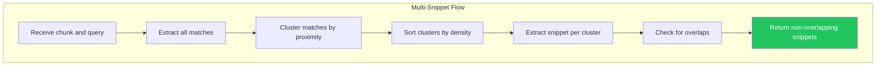

# LCS-DES-056d: Design Specification — Multi-Snippet Results

## Metadata & Categorization

| Field            | Value                                                                                          |
| :--------------- | :--------------------------------------------------------------------------------------------- |
| **Document ID**  | LCS-DES-056d                                                                                   |
| **Sub-Part ID**  | RAG-056d                                                                                       |
| **Title**        | Multi-Snippet Results                                                                          |
| **Version**      | v0.5.6d                                                                                        |
| **Module**       | `Lexichord.Modules.RAG`                                                                        |
| **Depends On**   | v0.5.6a (ISnippetService), v0.5.6b (HighlightedSnippetControl), v0.4.6b (SearchResultItemView) |
| **Required By**  | v0.5.7 (Reference Dock)                                                                        |
| **License Tier** | Core                                                                                           |
| **Status**       | Draft                                                                                          |
| **Last Updated** | 2026-01-27                                                                                     |

---

## 1. Executive Summary

This sub-part implements support for displaying multiple snippets per search result when a chunk contains several relevant regions. It provides an expandable UI with region clustering and deduplication.

### 1.1 Objectives

1. Create `MultiSnippetViewModel` for expandable multi-snippet display
2. Implement region clustering algorithm
3. Add snippet deduplication logic
4. Create expandable/collapsible UI component

### 1.2 Key Deliverables

- `MultiSnippetViewModel` ViewModel
- Region clustering algorithm
- Snippet deduplication logic
- Expandable multi-snippet UI panel
- Match count indicator
- Unit tests for clustering and deduplication

---

## 2. Architecture & Modular Strategy

### 2.1 Dependencies

| Dependency                  | Source                | Purpose                  |
| :-------------------------- | :-------------------- | :----------------------- |
| `ISnippetService`           | v0.5.6a               | Multi-snippet extraction |
| `Snippet`                   | v0.5.6a               | Snippet data             |
| `HighlightedSnippetControl` | v0.5.6b               | Snippet rendering        |
| `SearchResultItemView`      | v0.4.6b               | Parent result container  |
| `ViewModelBase`             | CommunityToolkit.Mvvm | Observable base          |
| `ILogger<T>`                | v0.0.3b               | Structured logging       |

### 2.2 Licensing Behavior

Multi-snippet results are available to all license tiers as a core feature of the Answer Preview system.

---

## 3. Data Contract (API)

### 3.1 MultiSnippetViewModel

```csharp
namespace Lexichord.Modules.RAG.ViewModels;

/// <summary>
/// ViewModel for displaying multiple snippets from a single chunk.
/// </summary>
/// <remarks>
/// <para>Initially shows one snippet; expands to show additional matches.</para>
/// <para>Manages expand/collapse state and snippet visibility.</para>
/// </remarks>
public partial class MultiSnippetViewModel : ViewModelBase
{
    private readonly ISnippetService _snippetService;
    private readonly TextChunk _chunk;
    private readonly string _query;
    private readonly SnippetOptions _options;

    /// <summary>
    /// The primary snippet (always visible).
    /// </summary>
    [ObservableProperty]
    private Snippet _primarySnippet = Snippet.Empty;

    /// <summary>
    /// Additional snippets (visible when expanded).
    /// </summary>
    [ObservableProperty]
    private ObservableCollection<Snippet> _additionalSnippets = new();

    /// <summary>
    /// Whether the additional snippets are visible.
    /// </summary>
    [ObservableProperty]
    private bool _isExpanded;

    /// <summary>
    /// Total number of match regions in the chunk.
    /// </summary>
    [ObservableProperty]
    private int _totalMatchCount;

    /// <summary>
    /// Whether there are additional snippets to show.
    /// </summary>
    public bool HasAdditionalSnippets => AdditionalSnippets.Count > 0;

    /// <summary>
    /// Count of hidden snippets.
    /// </summary>
    public int HiddenSnippetCount => AdditionalSnippets.Count;

    /// <summary>
    /// Display text for expander button.
    /// </summary>
    public string ExpanderText => IsExpanded
        ? "Hide additional matches"
        : $"Show {HiddenSnippetCount} more {(HiddenSnippetCount == 1 ? "match" : "matches")}";

    /// <summary>
    /// Creates a new MultiSnippetViewModel.
    /// </summary>
    public MultiSnippetViewModel(
        ISnippetService snippetService,
        TextChunk chunk,
        string query,
        SnippetOptions options)
    {
        _snippetService = snippetService;
        _chunk = chunk;
        _query = query;
        _options = options;
    }

    /// <summary>
    /// Initializes the view model by extracting snippets.
    /// </summary>
    public void Initialize()
    {
        var snippets = _snippetService.ExtractMultipleSnippets(
            _chunk, _query, _options, maxSnippets: 3);

        if (snippets.Count > 0)
        {
            PrimarySnippet = snippets[0];

            for (int i = 1; i < snippets.Count; i++)
            {
                AdditionalSnippets.Add(snippets[i]);
            }
        }

        TotalMatchCount = snippets.Sum(s => s.Highlights.Count);
        OnPropertyChanged(nameof(HasAdditionalSnippets));
        OnPropertyChanged(nameof(HiddenSnippetCount));
        OnPropertyChanged(nameof(ExpanderText));
    }

    /// <summary>
    /// Toggles the expanded state.
    /// </summary>
    [RelayCommand]
    private void ToggleExpanded()
    {
        IsExpanded = !IsExpanded;
        OnPropertyChanged(nameof(ExpanderText));
    }

    /// <summary>
    /// Collapses the additional snippets.
    /// </summary>
    [RelayCommand]
    private void Collapse()
    {
        IsExpanded = false;
        OnPropertyChanged(nameof(ExpanderText));
    }
}
```

### 3.2 MatchCluster Record

```csharp
namespace Lexichord.Modules.RAG.Services;

/// <summary>
/// A cluster of nearby matches for multi-snippet extraction.
/// </summary>
/// <param name="Matches">The matches in this cluster.</param>
/// <param name="StartPosition">Start of the cluster region.</param>
/// <param name="EndPosition">End of the cluster region.</param>
internal record MatchCluster(
    IReadOnlyList<MatchInfo> Matches,
    int StartPosition,
    int EndPosition)
{
    /// <summary>
    /// Gets the center position of this cluster.
    /// </summary>
    public int CenterPosition => StartPosition + (EndPosition - StartPosition) / 2;

    /// <summary>
    /// Gets the total weight of matches in this cluster.
    /// </summary>
    public double TotalWeight => Matches.Sum(m =>
        MatchDensityCalculator.GetMatchWeight(m.Type));

    /// <summary>
    /// Gets the span of this cluster.
    /// </summary>
    public int Span => EndPosition - StartPosition;
}

/// <summary>
/// Information about a single match.
/// </summary>
internal record MatchInfo(int Position, int Length, HighlightType Type);
```

---

## 4. Implementation Logic

### 4.1 Flow Diagram



### 4.2 Clustering Algorithm

```text
CLUSTER matches by proximity:
│
├── Input: sorted list of matches
├── Threshold: 100 characters
│
├── Initialize first cluster with first match
│
├── For each subsequent match:
│   ├── If match is within threshold of current cluster end:
│   │   └── Add to current cluster, extend end position
│   └── Else:
│       ├── Finalize current cluster
│       └── Start new cluster with this match
│
├── Finalize last cluster
│
└── Return list of clusters with:
    ├── All matches in cluster
    ├── Start position (first match start)
    ├── End position (last match end)
    └── Total weight
```

### 4.3 Clustering Implementation

```csharp
namespace Lexichord.Modules.RAG.Services;

/// <summary>
/// Clusters matches for multi-snippet extraction.
/// </summary>
public static class MatchClusteringService
{
    /// <summary>
    /// Clusters matches by proximity.
    /// </summary>
    /// <param name="matches">Sorted list of matches.</param>
    /// <param name="threshold">Maximum distance between matches in same cluster.</param>
    /// <returns>List of match clusters.</returns>
    public static IReadOnlyList<MatchCluster> ClusterMatches(
        IReadOnlyList<MatchInfo> matches,
        int threshold = 100)
    {
        if (matches.Count == 0)
        {
            return Array.Empty<MatchCluster>();
        }

        if (matches.Count == 1)
        {
            return new[]
            {
                new MatchCluster(
                    matches,
                    matches[0].Position,
                    matches[0].Position + matches[0].Length)
            };
        }

        var clusters = new List<MatchCluster>();
        var currentMatches = new List<MatchInfo> { matches[0] };
        var clusterStart = matches[0].Position;
        var clusterEnd = matches[0].Position + matches[0].Length;

        for (int i = 1; i < matches.Count; i++)
        {
            var match = matches[i];
            var matchStart = match.Position;

            if (matchStart - clusterEnd <= threshold)
            {
                // Extend current cluster
                currentMatches.Add(match);
                clusterEnd = Math.Max(clusterEnd, matchStart + match.Length);
            }
            else
            {
                // Finalize current cluster and start new one
                clusters.Add(new MatchCluster(
                    currentMatches.ToList(),
                    clusterStart,
                    clusterEnd));

                currentMatches = new List<MatchInfo> { match };
                clusterStart = matchStart;
                clusterEnd = matchStart + match.Length;
            }
        }

        // Finalize last cluster
        clusters.Add(new MatchCluster(
            currentMatches.ToList(),
            clusterStart,
            clusterEnd));

        return clusters;
    }

    /// <summary>
    /// Removes duplicate or overlapping snippets.
    /// </summary>
    /// <param name="snippets">Candidate snippets.</param>
    /// <param name="overlapThreshold">Percentage overlap to consider duplicate.</param>
    /// <returns>Deduplicated list of snippets.</returns>
    public static IReadOnlyList<Snippet> DeduplicateSnippets(
        IReadOnlyList<Snippet> snippets,
        double overlapThreshold = 0.5)
    {
        if (snippets.Count <= 1)
        {
            return snippets;
        }

        var result = new List<Snippet> { snippets[0] };

        for (int i = 1; i < snippets.Count; i++)
        {
            var candidate = snippets[i];
            var isDuplicate = false;

            foreach (var existing in result)
            {
                var overlap = CalculateOverlap(existing, candidate);
                if (overlap >= overlapThreshold)
                {
                    isDuplicate = true;
                    break;
                }
            }

            if (!isDuplicate)
            {
                result.Add(candidate);
            }
        }

        return result;
    }

    private static double CalculateOverlap(Snippet a, Snippet b)
    {
        var aStart = a.StartOffset;
        var aEnd = a.StartOffset + a.Text.Length;
        var bStart = b.StartOffset;
        var bEnd = b.StartOffset + b.Text.Length;

        var overlapStart = Math.Max(aStart, bStart);
        var overlapEnd = Math.Min(aEnd, bEnd);

        if (overlapStart >= overlapEnd)
        {
            return 0;
        }

        var overlapLength = overlapEnd - overlapStart;
        var minLength = Math.Min(a.Text.Length, b.Text.Length);

        return (double)overlapLength / minLength;
    }
}
```

---

## 5. UI/UX Specifications

### 5.1 Multi-Snippet Panel XAML

```xml
<!-- MultiSnippetPanel.axaml -->
<UserControl xmlns="https://github.com/avaloniaui"
             xmlns:x="http://schemas.microsoft.com/winfx/2006/xaml"
             xmlns:vm="using:Lexichord.Modules.RAG.ViewModels"
             xmlns:views="using:Lexichord.Modules.RAG.Views"
             x:Class="Lexichord.Modules.RAG.Views.MultiSnippetPanel"
             x:DataType="vm:MultiSnippetViewModel">

    <UserControl.Styles>
        <Style Selector="Border.snippet-container">
            <Setter Property="BorderBrush" Value="{DynamicResource BorderSubtle}"/>
            <Setter Property="BorderThickness" Value="0,0,0,1"/>
            <Setter Property="Padding" Value="12,8"/>
        </Style>

        <Style Selector="Button.expander-button">
            <Setter Property="Background" Value="Transparent"/>
            <Setter Property="Foreground" Value="{DynamicResource TextSecondary}"/>
            <Setter Property="FontSize" Value="12"/>
            <Setter Property="Padding" Value="8,4"/>
            <Setter Property="Cursor" Value="Hand"/>
        </Style>

        <Style Selector="Button.expander-button:pointerover">
            <Setter Property="Foreground" Value="{DynamicResource TextPrimary}"/>
        </Style>
    </UserControl.Styles>

    <StackPanel Spacing="0">
        <!-- Primary Snippet (always visible) -->
        <Border Classes="snippet-container">
            <views:HighlightedSnippetControl
                DataContext="{Binding PrimarySnippet}"/>
        </Border>

        <!-- Expander Button -->
        <Button Classes="expander-button"
                Command="{Binding ToggleExpandedCommand}"
                IsVisible="{Binding HasAdditionalSnippets}"
                HorizontalAlignment="Left"
                Margin="12,4">
            <StackPanel Orientation="Horizontal" Spacing="4">
                <PathIcon Data="{Binding IsExpanded,
                    Converter={StaticResource ExpanderIconConverter}}"
                    Width="12" Height="12"/>
                <TextBlock Text="{Binding ExpanderText}"/>
            </StackPanel>
        </Button>

        <!-- Additional Snippets (visible when expanded) -->
        <ItemsControl ItemsSource="{Binding AdditionalSnippets}"
                      IsVisible="{Binding IsExpanded}">
            <ItemsControl.ItemTemplate>
                <DataTemplate>
                    <Border Classes="snippet-container">
                        <views:HighlightedSnippetControl/>
                    </Border>
                </DataTemplate>
            </ItemsControl.ItemTemplate>
        </ItemsControl>
    </StackPanel>
</UserControl>
```

### 5.2 Visual Design Layout

```text
Collapsed State:
┌─────────────────────────────────────────────────────────────────────────────┐
│  📄 security-overview.md                                    [3 matches]     │
├─────────────────────────────────────────────────────────────────────────────┤
│  ...implements **OAuth 2.0** for secure **authentication**...               │
│  ─────────────────────────────────────────────────────────────              │
│  [▼ Show 2 more matches]                                                    │
└─────────────────────────────────────────────────────────────────────────────┘

Expanded State:
┌─────────────────────────────────────────────────────────────────────────────┐
│  📄 security-overview.md                                    [3 matches]     │
├─────────────────────────────────────────────────────────────────────────────┤
│  ...implements **OAuth 2.0** for secure **authentication**...               │
│  ─────────────────────────────────────────────────────────────              │
│  [▲ Hide additional matches]                                                │
├─────────────────────────────────────────────────────────────────────────────┤
│  ...the **authentication** tokens are stored encrypted in...                │
│  ─────────────────────────────────────────────────────────────              │
│  ...single sign-on **authentication** via SAML 2.0 enables...               │
└─────────────────────────────────────────────────────────────────────────────┘
```

### 5.3 Component Styling Requirements

| Component         | Theme Resource                  | Notes                           |
| :---------------- | :------------------------------ | :------------------------------ |
| Snippet container | `Brush.Surface.Default`         | Subtle border between           |
| Divider           | `Brush.Border.Subtle`           | Light separator line            |
| Expander button   | `Brush.Text.Secondary`          | Muted, becomes primary on hover |
| Expander icon     | `Material.Icons.ChevronDown/Up` | Rotates on expand               |
| Match count badge | `Brush.Text.Tertiary`           | Small, right-aligned            |

### 5.4 Animation Specifications

| Animation       | Duration | Easing         |
| :-------------- | :------- | :------------- |
| Expand/collapse | 200ms    | CubicEaseOut   |
| Icon rotation   | 150ms    | CubicEaseInOut |
| Snippet fade-in | 150ms    | Linear         |

---

## 6. Observability & Logging

| Level | Source                 | Message Template                                                |
| :---- | :--------------------- | :-------------------------------------------------------------- |
| Debug | MultiSnippetViewModel  | `"Initialized with {Count} snippets"`                           |
| Debug | MatchClusteringService | `"Clustered {MatchCount} matches into {ClusterCount} clusters"` |
| Debug | MultiSnippetViewModel  | `"Expanded state changed to {IsExpanded}"`                      |

---

## 7. Security & Safety

| Concern                  | Mitigation                         |
| :----------------------- | :--------------------------------- |
| Memory with many matches | Limit to maxSnippets (default 3)   |
| Slow rendering           | Virtualize if more than 5 snippets |
| Race conditions          | Initialize on UI thread only       |

---

## 8. Acceptance Criteria (QA)

| #   | Category          | Criterion                                         |
| :-- | :---------------- | :------------------------------------------------ |
| 1   | **Functional**    | Primary snippet always visible                    |
| 2   | **Functional**    | "Show more" appears only when additional exist    |
| 3   | **Functional**    | Clicking expander shows/hides additional snippets |
| 4   | **Functional**    | Match count badge shows total matches             |
| 5   | **Performance**   | Expand/collapse animates smoothly                 |
| 6   | **Clustering**    | Nearby matches are grouped together               |
| 7   | **Deduplication** | Overlapping snippets are removed                  |
| 8   | **Accessibility** | Expander is keyboard accessible                   |

---

## 9. Unit Tests

```csharp
[Trait("Category", "Unit")]
[Trait("Feature", "v0.5.6d")]
public class MatchClusteringServiceTests
{
    [Fact]
    public void ClusterMatches_SingleMatch_ReturnsSingleCluster()
    {
        var matches = new List<MatchInfo>
        {
            new(50, 10, HighlightType.QueryMatch)
        };

        var clusters = MatchClusteringService.ClusterMatches(matches);

        clusters.Should().ContainSingle();
        clusters[0].Matches.Should().ContainSingle();
    }

    [Fact]
    public void ClusterMatches_NearbyMatches_ClustersTogethe()
    {
        var matches = new List<MatchInfo>
        {
            new(50, 10, HighlightType.QueryMatch),
            new(70, 10, HighlightType.QueryMatch),  // Within 100 chars
            new(90, 10, HighlightType.QueryMatch)   // Within 100 chars
        };

        var clusters = MatchClusteringService.ClusterMatches(matches, threshold: 100);

        clusters.Should().ContainSingle();
        clusters[0].Matches.Should().HaveCount(3);
    }

    [Fact]
    public void ClusterMatches_DistantMatches_CreatesSeparateClusters()
    {
        var matches = new List<MatchInfo>
        {
            new(50, 10, HighlightType.QueryMatch),
            new(300, 10, HighlightType.QueryMatch)  // Beyond threshold
        };

        var clusters = MatchClusteringService.ClusterMatches(matches, threshold: 100);

        clusters.Should().HaveCount(2);
    }

    [Fact]
    public void ClusterMatches_EmptyInput_ReturnsEmpty()
    {
        var clusters = MatchClusteringService.ClusterMatches(
            Array.Empty<MatchInfo>());

        clusters.Should().BeEmpty();
    }

    [Fact]
    public void DeduplicateSnippets_NoOverlap_ReturnsAll()
    {
        var snippets = new List<Snippet>
        {
            new("First snippet", Array.Empty<HighlightSpan>(), 0, false, false),
            new("Second snippet", Array.Empty<HighlightSpan>(), 100, false, false)
        };

        var result = MatchClusteringService.DeduplicateSnippets(snippets);

        result.Should().HaveCount(2);
    }

    [Fact]
    public void DeduplicateSnippets_SignificantOverlap_RemovesDuplicate()
    {
        var snippets = new List<Snippet>
        {
            new("First snippet text here", Array.Empty<HighlightSpan>(), 0, false, false),
            new("snippet text here yes", Array.Empty<HighlightSpan>(), 6, false, false)  // ~75% overlap
        };

        var result = MatchClusteringService.DeduplicateSnippets(snippets, overlapThreshold: 0.5);

        result.Should().ContainSingle();
    }
}

[Trait("Category", "Unit")]
[Trait("Feature", "v0.5.6d")]
public class MultiSnippetViewModelTests
{
    private readonly Mock<ISnippetService> _snippetServiceMock;
    private readonly MultiSnippetViewModel _sut;

    public MultiSnippetViewModelTests()
    {
        _snippetServiceMock = new Mock<ISnippetService>();
        var chunk = new TextChunk(Guid.NewGuid(), Guid.NewGuid(), "Content", 0, null, DateTime.UtcNow);
        _sut = new MultiSnippetViewModel(
            _snippetServiceMock.Object,
            chunk,
            "query",
            SnippetOptions.Default);
    }

    [Fact]
    public void Initialize_WithMultipleSnippets_SetsPrimaryAndAdditional()
    {
        var snippets = new List<Snippet>
        {
            new("Primary", new[] { new HighlightSpan(0, 5, HighlightType.QueryMatch) }, 0, false, false),
            new("Second", new[] { new HighlightSpan(0, 5, HighlightType.QueryMatch) }, 100, false, false),
            new("Third", new[] { new HighlightSpan(0, 5, HighlightType.QueryMatch) }, 200, false, false)
        };
        _snippetServiceMock
            .Setup(x => x.ExtractMultipleSnippets(It.IsAny<TextChunk>(), It.IsAny<string>(), It.IsAny<SnippetOptions>(), 3))
            .Returns(snippets);

        _sut.Initialize();

        _sut.PrimarySnippet.Text.Should().Be("Primary");
        _sut.AdditionalSnippets.Should().HaveCount(2);
        _sut.HasAdditionalSnippets.Should().BeTrue();
    }

    [Fact]
    public void Initialize_WithSingleSnippet_HasNoAdditional()
    {
        var snippets = new List<Snippet>
        {
            new("Only one", Array.Empty<HighlightSpan>(), 0, false, false)
        };
        _snippetServiceMock
            .Setup(x => x.ExtractMultipleSnippets(It.IsAny<TextChunk>(), It.IsAny<string>(), It.IsAny<SnippetOptions>(), 3))
            .Returns(snippets);

        _sut.Initialize();

        _sut.PrimarySnippet.Text.Should().Be("Only one");
        _sut.AdditionalSnippets.Should().BeEmpty();
        _sut.HasAdditionalSnippets.Should().BeFalse();
    }

    [Fact]
    public void ToggleExpanded_TogglesState()
    {
        _sut.IsExpanded.Should().BeFalse();

        _sut.ToggleExpandedCommand.Execute(null);

        _sut.IsExpanded.Should().BeTrue();

        _sut.ToggleExpandedCommand.Execute(null);

        _sut.IsExpanded.Should().BeFalse();
    }

    [Fact]
    public void ExpanderText_ReflectsState()
    {
        _snippetServiceMock
            .Setup(x => x.ExtractMultipleSnippets(It.IsAny<TextChunk>(), It.IsAny<string>(), It.IsAny<SnippetOptions>(), 3))
            .Returns(new List<Snippet>
            {
                new("Primary", Array.Empty<HighlightSpan>(), 0, false, false),
                new("Second", Array.Empty<HighlightSpan>(), 100, false, false)
            });
        _sut.Initialize();

        _sut.ExpanderText.Should().Contain("1 more match");

        _sut.ToggleExpandedCommand.Execute(null);

        _sut.ExpanderText.Should().Contain("Hide");
    }

    [Fact]
    public void ExpanderText_PluralForMultiple()
    {
        _snippetServiceMock
            .Setup(x => x.ExtractMultipleSnippets(It.IsAny<TextChunk>(), It.IsAny<string>(), It.IsAny<SnippetOptions>(), 3))
            .Returns(new List<Snippet>
            {
                new("Primary", Array.Empty<HighlightSpan>(), 0, false, false),
                new("Second", Array.Empty<HighlightSpan>(), 100, false, false),
                new("Third", Array.Empty<HighlightSpan>(), 200, false, false)
            });
        _sut.Initialize();

        _sut.ExpanderText.Should().Contain("2 more matches");
    }
}

[Trait("Category", "Unit")]
[Trait("Feature", "v0.5.6d")]
public class MatchClusterTests
{
    [Fact]
    public void CenterPosition_CalculatesCorrectly()
    {
        var cluster = new MatchCluster(
            Array.Empty<MatchInfo>(),
            StartPosition: 100,
            EndPosition: 200);

        cluster.CenterPosition.Should().Be(150);
    }

    [Fact]
    public void TotalWeight_SumsMatchWeights()
    {
        var matches = new List<MatchInfo>
        {
            new(0, 5, HighlightType.QueryMatch),  // Weight 2.0
            new(10, 5, HighlightType.FuzzyMatch)  // Weight 1.0
        };
        var cluster = new MatchCluster(matches, 0, 20);

        cluster.TotalWeight.Should().Be(3.0);
    }

    [Fact]
    public void Span_CalculatesCorrectly()
    {
        var cluster = new MatchCluster(
            Array.Empty<MatchInfo>(),
            StartPosition: 50,
            EndPosition: 150);

        cluster.Span.Should().Be(100);
    }
}
```

---

## Document History

| Version | Date       | Author         | Changes       |
| :------ | :--------- | :------------- | :------------ |
| 1.0     | 2026-01-27 | Lead Architect | Initial draft |
