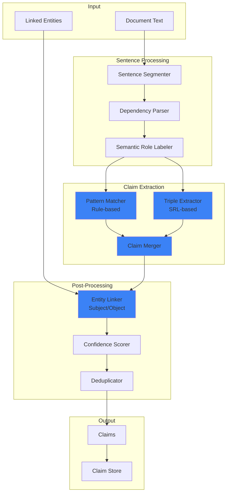

# LCS-SBD-056-KG: Scope Overview — Claim Extraction

## Document Control

| Field            | Value                                                        |
| :--------------- | :----------------------------------------------------------- |
| **Document ID**  | LCS-SBD-056-KG                                               |
| **Version**      | v0.5.6                                                       |
| **Codename**     | Claim Extraction (CKVS Phase 2b)                             |
| **Status**       | Draft                                                        |
| **Last Updated** | 2026-01-31                                                   |
| **Owner**        | Lead Architect                                               |
| **Depends On**   | v0.5.5-KG (Entity Linking), v0.4.6-KG (Axiom Store)          |

---

## 1. Executive Summary

### 1.1 The Vision

**v0.5.6-KG** delivers **Claim Extraction** — the NLU pipeline that parses prose into formal claims (propositions) about entities. A claim is a machine-readable assertion that can be validated against the Knowledge Graph and Axiom Store.

Example transformations:
- "The /users endpoint accepts a limit parameter" → `Claim(Endpoint:/users, ACCEPTS, Parameter:limit)`
- "Rate limiting is set to 100 requests per minute" → `Claim(Concept:RateLimiting, HAS_VALUE, 100 req/min)`
- "This endpoint requires authentication" → `Claim(Endpoint:/orders, REQUIRES, Concept:Authentication)`

### 1.2 Business Value

- **Prose to Structure:** Convert natural language to formal assertions.
- **Validation Foundation:** Claims are what get validated against axioms.
- **Contradiction Detection:** Find conflicting claims across documents.
- **Knowledge Graph Update:** Claims can update/extend the graph.
- **Change Tracking:** Detect when claims change between document versions.

### 1.3 Success Criteria

1. Claim extractor parses sentences into subject-predicate-object triples.
2. Claims linked to source document positions for traceability.
3. Claim confidence scoring for human review.
4. Processing speed: 100-page document in <30 seconds.
5. Claim storage in PostgreSQL with full-text search.
6. Claim diff view for document changes.

---

## 2. Relationship to Existing v0.5.6

The existing v0.5.6 spec covers **Snippet Generation** for search results. Claim Extraction integrates by:

- **Claim-Enhanced Snippets:** Snippets can highlight extracted claims.
- **Claim Search:** Search for documents containing specific claims.
- **Shared NLU:** Builds on Entity Linking pipeline.

---

## 3. Key Deliverables

### 3.1 Sub-Parts

| Sub-Part | Title | Description | Est. Hours |
|:---------|:------|:------------|:-----------|
| v0.5.6e | Claim Data Model | `Claim`, `ClaimTriple`, `ClaimEvidence` records | 4 |
| v0.5.6f | Sentence Parser | Dependency parsing for claim structure | 6 |
| v0.5.6g | Claim Extractor | Extract claims from parsed sentences | 8 |
| v0.5.6h | Claim Repository | PostgreSQL storage with search | 5 |
| v0.5.6i | Claim Diff Service | Compare claims between doc versions | 5 |
| **Total** | | | **28 hours** |

### 3.2 Key Interfaces

```csharp
/// <summary>
/// Service for extracting claims from text.
/// </summary>
public interface IClaimExtractionService
{
    /// <summary>
    /// Extracts claims from document text.
    /// </summary>
    /// <param name="text">Document text.</param>
    /// <param name="linkedEntities">Pre-linked entities in text.</param>
    /// <param name="context">Extraction context.</param>
    /// <param name="ct">Cancellation token.</param>
    /// <returns>Extracted claims.</returns>
    Task<ClaimExtractionResult> ExtractClaimsAsync(
        string text,
        IReadOnlyList<LinkedEntity> linkedEntities,
        ClaimExtractionContext context,
        CancellationToken ct = default);
}

/// <summary>
/// A claim (assertion) extracted from text.
/// </summary>
public record Claim
{
    /// <summary>Unique claim identifier.</summary>
    public Guid Id { get; init; } = Guid.NewGuid();

    /// <summary>The subject entity (who/what the claim is about).</summary>
    public required ClaimEntity Subject { get; init; }

    /// <summary>The predicate (relationship type).</summary>
    public required string Predicate { get; init; }

    /// <summary>The object (value, entity, or literal).</summary>
    public required ClaimObject Object { get; init; }

    /// <summary>Confidence score (0.0-1.0).</summary>
    public float Confidence { get; init; }

    /// <summary>Source document ID.</summary>
    public Guid DocumentId { get; init; }

    /// <summary>Source sentence/paragraph.</summary>
    public required ClaimEvidence Evidence { get; init; }

    /// <summary>Whether this claim has been validated.</summary>
    public ClaimValidationStatus ValidationStatus { get; init; }

    /// <summary>When the claim was extracted.</summary>
    public DateTimeOffset ExtractedAt { get; init; } = DateTimeOffset.UtcNow;
}

/// <summary>
/// Subject or object entity reference in a claim.
/// </summary>
public record ClaimEntity
{
    /// <summary>Linked graph entity ID (if resolved).</summary>
    public Guid? EntityId { get; init; }

    /// <summary>Entity type.</summary>
    public required string EntityType { get; init; }

    /// <summary>Surface form (as appeared in text).</summary>
    public required string SurfaceForm { get; init; }
}

/// <summary>
/// Object of a claim (can be entity or literal value).
/// </summary>
public record ClaimObject
{
    /// <summary>Whether object is an entity or literal.</summary>
    public ClaimObjectType Type { get; init; }

    /// <summary>Entity reference (if Type is Entity).</summary>
    public ClaimEntity? Entity { get; init; }

    /// <summary>Literal value (if Type is Literal).</summary>
    public object? LiteralValue { get; init; }

    /// <summary>Literal data type.</summary>
    public string? LiteralType { get; init; }
}

public enum ClaimObjectType { Entity, Literal }
public enum ClaimValidationStatus { Pending, Valid, Invalid, Conflict }

/// <summary>
/// Evidence linking claim to source text.
/// </summary>
public record ClaimEvidence
{
    /// <summary>Source sentence text.</summary>
    public required string Sentence { get; init; }

    /// <summary>Character offset in document.</summary>
    public int StartOffset { get; init; }

    /// <summary>End character offset.</summary>
    public int EndOffset { get; init; }

    /// <summary>Chunk ID containing this evidence.</summary>
    public Guid? ChunkId { get; init; }
}
```

### 3.3 Claim Extraction Pipeline



---

## 4. Claim Predicate Types

| Predicate | Subject | Object | Example |
|:----------|:--------|:-------|:--------|
| `ACCEPTS` | Endpoint | Parameter | "/users ACCEPTS limit" |
| `RETURNS` | Endpoint | Response | "/users RETURNS 200 OK" |
| `CONTAINS` | Product | Component | "API CONTAINS Auth Module" |
| `REQUIRES` | Entity | Entity | "/orders REQUIRES authentication" |
| `HAS_PROPERTY` | Entity | Literal | "limit HAS_PROPERTY default=10" |
| `IS_DEPRECATED` | Entity | Boolean | "/v1/users IS_DEPRECATED true" |
| `RELATED_TO` | Concept | Concept | "OAuth RELATED_TO Security" |

---

## 5. Extraction Patterns

### 5.1 Rule-Based Patterns

```yaml
# Claim extraction patterns
patterns:
  - name: "accepts_parameter"
    pattern: "{ENDPOINT} accepts {PARAMETER}"
    predicate: ACCEPTS
    subject_type: Endpoint
    object_type: Parameter

  - name: "returns_response"
    pattern: "{ENDPOINT} returns {RESPONSE}"
    predicate: RETURNS
    subject_type: Endpoint
    object_type: Response

  - name: "requires_entity"
    pattern: "{ENTITY} requires {ENTITY}"
    predicate: REQUIRES

  - name: "has_default"
    pattern: "{PARAMETER} defaults to {VALUE}"
    predicate: HAS_PROPERTY
    property: default_value
```

### 5.2 SRL-Based Extraction

```
Sentence: "The authentication endpoint requires a valid API key."

Dependency Parse:
  endpoint (NOUN) ← nsubj ← requires (VERB)
  requires (VERB) → dobj → key (NOUN)
  key (NOUN) ← amod ← API (NOUN)
  key (NOUN) ← amod ← valid (ADJ)

Semantic Roles:
  ARG0 (Agent): "The authentication endpoint"
  PRED: "requires"
  ARG1 (Patient): "a valid API key"

Extracted Claim:
  Subject: Endpoint("authentication endpoint")
  Predicate: REQUIRES
  Object: Concept("API key")
```

---

## 6. Dependencies

| Component | Source | Usage |
|:----------|:-------|:------|
| `IEntityLinkingService` | v0.5.5-KG | Link claim subjects/objects |
| `IAxiomStore` | v0.4.6-KG | Validate claims against axioms |
| `IDbConnectionFactory` | v0.0.5b | PostgreSQL claim storage |
| SpaCy dependency parser | Python | Sentence parsing |

---

## 7. License Gating

| Tier | Claim Extraction Access |
|:-----|:------------------------|
| Core | Not available |
| WriterPro | View extracted claims (read-only) |
| Teams | Full extraction + claim search |
| Enterprise | Full + custom claim patterns |

---

## 8. Performance Targets

| Metric | Target | Measurement |
|:-------|:-------|:------------|
| Claim precision | >70% | Human evaluation |
| Claim recall | >60% | Human evaluation |
| Processing speed | <30s / 100 pages | Benchmark |
| Storage efficiency | <1KB / claim | Database metrics |

---

## 9. Risks & Mitigations

| Risk | Mitigation |
|:-----|:-----------|
| Complex sentence structures | Multiple extraction strategies |
| Implicit claims (not stated directly) | LLM-based inference (future) |
| Claim duplication | Semantic deduplication |
| False positive claims | Confidence thresholds, human review |

---

## 10. What This Enables

- **v0.6.5 Validation:** Validate claims against axioms and graph.
- **Contradiction Detection:** Find conflicting claims across documents.
- **Change Tracking:** Diff claims between document versions.
- **Knowledge Graph Updates:** Claims can propose graph modifications.

---
