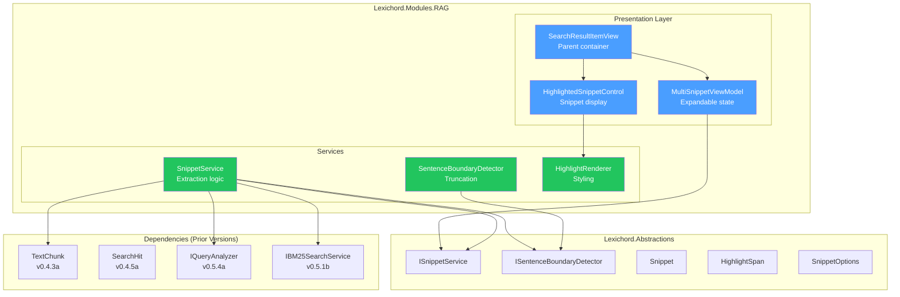
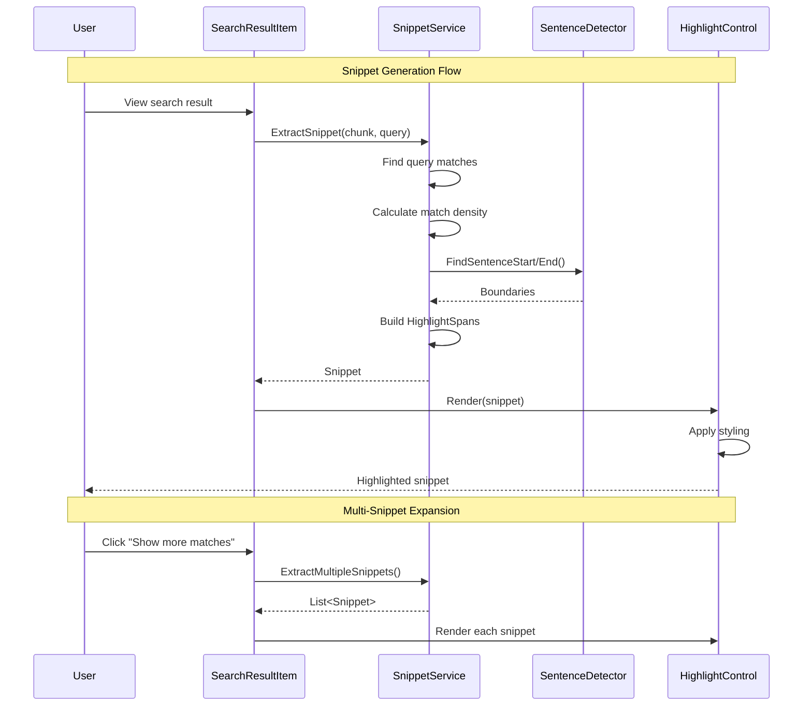

# LCS-SBD-056: Scope Breakdown — The Answer Preview

## Document Control

| Field            | Value                                                              |
| :--------------- | :----------------------------------------------------------------- |
| **Document ID**  | LCS-SBD-056                                                        |
| **Version**      | v0.5.6                                                             |
| **Codename**     | The Answer Preview (Snippet Generation)                            |
| **Status**       | In Progress (a,b,c ✅)                                             |
| **Last Updated** | 2026-02-03                                                         |
| **Owner**        | Lead Architect                                                     |
| **Depends On**   | v0.4.5 (Semantic Search), v0.5.1 (Hybrid Engine), v0.5.5 (Filters) |

---

## 1. Executive Summary

### 1.1 The Vision

**v0.5.6** delivers the **Answer Preview** — intelligent snippet generation that extracts and highlights the most relevant portions of search results. This release transforms raw chunk displays into polished, contextual snippets that directly answer user queries.

When users search their documentation, they need to quickly evaluate results without reading entire chunks. The Answer Preview system generates highlighted snippets centered on query matches, respects sentence boundaries, and supports multiple relevant regions per chunk.

### 1.2 Business Value

- **Faster Evaluation:** Users scan highlighted snippets instead of reading full chunks.
- **Query Visibility:** Exact and fuzzy matches are visually distinguished.
- **Smart Truncation:** Snippets respect sentence boundaries for readability.
- **Multi-Match Support:** Chunks with multiple relevant regions show expandable snippets.
- **Customization:** Configurable snippet length for different use cases.
- **Foundation:** Enables AI-generated answer summaries in v0.6.x.

### 1.3 Success Criteria

This release succeeds when:

1. Snippets center on query term regions with <10ms extraction time.
2. Highlight spans correctly identify exact and fuzzy matches.
3. Truncation respects sentence boundaries (no mid-sentence cuts).
4. Multi-snippet results expand to show all matches in a chunk.
5. Snippet length is configurable via user settings (150-300 chars).

### 1.4 License Gating

The Answer Preview uses a **Universal Availability** strategy:

| Feature                  | Core | Writer Pro | Teams | Enterprise |
| :----------------------- | :--- | :--------- | :---- | :--------- |
| Basic snippet extraction | ✓    | ✓          | ✓     | ✓          |
| Query term highlighting  | ✓    | ✓          | ✓     | ✓          |
| Smart truncation         | ✓    | ✓          | ✓     | ✓          |
| Multi-snippet results    | ✓    | ✓          | ✓     | ✓          |
| Configurable length      | —    | ✓          | ✓     | ✓          |

---

## 2. Dependencies on Prior Versions

| Component                | Source Version        | Usage in v0.5.6                  |
| :----------------------- | :-------------------- | :------------------------------- |
| `ISemanticSearchService` | v0.4.5a               | Base search results              |
| `IHybridSearchService`   | v0.5.1c               | Combined search with BM25 terms  |
| `IBM25SearchService`     | v0.5.1b               | Matched terms for highlighting   |
| `SearchHit`              | v0.4.5a               | Search result to extract snippet |
| `TextChunk`              | v0.4.3a               | Chunk content source             |
| `SearchResultItemView`   | v0.4.6b               | UI to display snippets           |
| `IQueryAnalyzer`         | v0.5.4a               | Query keywords for highlighting  |
| `ISettingsService`       | v0.1.6a               | Snippet length preference        |
| `ILicenseContext`        | v0.0.4c               | License tier checking            |
| `ILogger<T>`             | v0.0.3b               | Structured logging               |
| `ViewModelBase`          | CommunityToolkit.Mvvm | Observable ViewModel (external)  |

---

## 3. Sub-Part Specifications

### 3.1 v0.5.6a: Snippet Extraction

| Field            | Value                   |
| :--------------- | :---------------------- |
| **Sub-Part ID**  | RAG-056a                |
| **Title**        | Snippet Extraction      |
| **Module**       | `Lexichord.Modules.RAG` |
| **License Tier** | Core                    |

**Goal:** Implement `ISnippetService` to extract contextual snippets from chunks based on query terms.

**Key Deliverables:**

- `ISnippetService` interface in `Lexichord.Abstractions`
- `Snippet` record with text, highlights, and truncation info
- `HighlightSpan` record for match positions
- `HighlightType` enum (QueryMatch, KeyPhrase, Entity)
- `SnippetOptions` record for extraction configuration
- `SnippetService` implementation
- Unit tests for snippet extraction

**Key Interfaces:**

```csharp
namespace Lexichord.Abstractions.Contracts;

/// <summary>
/// Extracts contextual snippets from text chunks based on query terms.
/// </summary>
public interface ISnippetService
{
    /// <summary>
    /// Extracts a snippet from a chunk centered on query matches.
    /// </summary>
    Snippet ExtractSnippet(TextChunk chunk, string query, SnippetOptions options);

    /// <summary>
    /// Extracts multiple snippets when chunk has several match regions.
    /// </summary>
    IReadOnlyList<Snippet> ExtractMultipleSnippets(
        TextChunk chunk,
        string query,
        SnippetOptions options,
        int maxSnippets = 3);
}

/// <summary>
/// A contextual text snippet with highlighted matches.
/// </summary>
public record Snippet(
    string Text,
    IReadOnlyList<HighlightSpan> Highlights,
    int StartOffset,
    bool IsTruncatedStart,
    bool IsTruncatedEnd);

/// <summary>
/// A highlighted span within a snippet.
/// </summary>
public record HighlightSpan(int Start, int Length, HighlightType Type);

/// <summary>
/// Types of highlighting for matched content.
/// </summary>
public enum HighlightType { QueryMatch, FuzzyMatch, KeyPhrase, Entity }

/// <summary>
/// Configuration for snippet extraction.
/// </summary>
public record SnippetOptions(
    int MaxLength = 200,
    int ContextPadding = 50,
    bool RespectSentenceBoundaries = true);
```

**Dependencies:**

- v0.4.3a: `TextChunk` (content source)
- v0.5.4a: `IQueryAnalyzer` (query keywords)

---

### 3.2 v0.5.6b: Query Term Highlighting

| Field            | Value                   |
| :--------------- | :---------------------- |
| **Sub-Part ID**  | RAG-056b                |
| **Title**        | Query Term Highlighting |
| **Module**       | `Lexichord.Modules.RAG` |
| **License Tier** | Core                    |

**Goal:** Highlight matching terms in snippets with visual distinction for exact vs. fuzzy matches.

**Key Deliverables:**

- `IHighlightRenderer` interface for platform-agnostic rendering
- `HighlightedSnippetControl.axaml` custom control
- Exact matches: bold styling
- Fuzzy matches: italic styling with distinct color
- `HighlightTheme` record for colors
- Unit tests for highlight positioning

**Key UI Components:**

```text
┌─────────────────────────────────────────────────────────────────────────────┐
│  📄 auth-guide.md                                                           │
├─────────────────────────────────────────────────────────────────────────────┤
│  ...token expires, the **authentication** flow requires a refresh. The     │
│  *authentcation* process validates credentials against...                   │
│                   ↑ fuzzy match (italic)    ↑ exact match (bold)           │
└─────────────────────────────────────────────────────────────────────────────┘
```

**Dependencies:**

- v0.5.6a: `Snippet`, `HighlightSpan` (data structures)
- v0.4.6b: `SearchResultItemView` (parent control)

---

### 3.3 v0.5.6c: Smart Truncation ✅

| Field            | Value                   |
| :--------------- | :---------------------- |
| **Sub-Part ID**  | RAG-056c                |
| **Title**        | Smart Truncation        |
| **Module**       | `Lexichord.Modules.RAG` |
| **License Tier** | Core                    |
| **Status**       | ✅ Implemented          |

**Goal:** Implement intelligent snippet boundaries that center on match regions and respect sentence structure.

**Key Deliverables:**

- `ISentenceBoundaryDetector` interface
- `SentenceBoundaryDetector` implementation
- Match density scoring algorithm
- Ellipsis display at truncation points ("...")
- Boundary snapping logic
- Unit tests for boundary detection

**Key Interfaces:**

```csharp
namespace Lexichord.Abstractions.Contracts;

/// <summary>
/// Detects sentence boundaries in text for smart truncation.
/// </summary>
public interface ISentenceBoundaryDetector
{
    /// <summary>
    /// Finds the nearest sentence start before or at the given position.
    /// </summary>
    int FindSentenceStart(string text, int position);

    /// <summary>
    /// Finds the nearest sentence end after or at the given position.
    /// </summary>
    int FindSentenceEnd(string text, int position);

    /// <summary>
    /// Gets all sentence boundaries in the text.
    /// </summary>
    IReadOnlyList<SentenceBoundary> GetBoundaries(string text);
}

/// <summary>
/// A sentence boundary position.
/// </summary>
public record SentenceBoundary(int Start, int End);
```

**Truncation Logic:**

```text
CENTER snippet around highest-density match region:
│
├── Calculate match density score for each 100-char window
│
├── Select window with highest score
│
├── Expand to sentence boundaries:
│   ├── Find sentence start before window
│   └── Find sentence end after window
│
├── If expanded length > MaxLength:
│   ├── Keep centered on highest match
│   └── Truncate at word boundaries
│
└── Add "..." at truncation points
```

**Dependencies:**

- v0.5.6a: `SnippetOptions` (configuration)

---

### 3.4 v0.5.6d: Multi-Snippet Results

| Field            | Value                   |
| :--------------- | :---------------------- |
| **Sub-Part ID**  | RAG-056d                |
| **Title**        | Multi-Snippet Results   |
| **Module**       | `Lexichord.Modules.RAG` |
| **License Tier** | Core                    |

**Goal:** Support multiple snippets per chunk when content contains several relevant regions.

**Key Deliverables:**

- `MultiSnippetViewModel` for expandable display
- "Show all matches" expander in search results
- Region clustering algorithm
- Snippet deduplication logic
- Up to 3 snippets per chunk (configurable)
- Unit tests for multi-region extraction

**Key UI Components:**

```text
┌─────────────────────────────────────────────────────────────────────────────┐
│  📄 security-overview.md                                    [3 matches]     │
├─────────────────────────────────────────────────────────────────────────────┤
│  ...implements **OAuth 2.0** for secure **authentication**...               │
│  ─────────────────────────────────────────────────────────────              │
│  [▼ Show 2 more matches]                                                    │
├─────────────────────────────────────────────────────────────────────────────┤
│  ...the **authentication** tokens are stored encrypted...                   │
│  ─────────────────────────────────────────────────────────────              │
│  ...single sign-on **authentication** via SAML 2.0...                       │
└─────────────────────────────────────────────────────────────────────────────┘
```

**Dependencies:**

- v0.5.6a: `ISnippetService.ExtractMultipleSnippets()` (extraction)
- v0.5.6b: `HighlightedSnippetControl` (rendering)
- v0.4.6b: `SearchResultItemView` (parent)

---

## 4. Implementation Checklist

| #         | Sub-Part | Task                                         | Est. Hours   |
| :-------- | :------- | :------------------------------------------- | :----------- |
| 1         | v0.5.6a  | Create `ISnippetService` interface           | 0.5          |
| 2         | v0.5.6a  | Create `Snippet` and `HighlightSpan` records | 0.5          |
| 3         | v0.5.6a  | Create `SnippetOptions` record               | 0.5          |
| 4         | v0.5.6a  | Implement `SnippetService`                   | 3            |
| 5         | v0.5.6a  | Implement match region detection             | 2            |
| 6         | v0.5.6a  | Unit tests for snippet extraction            | 2            |
| 7         | v0.5.6b  | Create `IHighlightRenderer` interface        | 0.5          |
| 8         | v0.5.6b  | Create `HighlightedSnippetControl.axaml`     | 2            |
| 9         | v0.5.6b  | Implement exact match highlighting           | 1            |
| 10        | v0.5.6b  | Implement fuzzy match highlighting           | 1            |
| 11        | v0.5.6b  | Create `HighlightTheme` configuration        | 0.5          |
| 12        | v0.5.6b  | Unit tests for highlight rendering           | 1.5          |
| 13        | v0.5.6c  | Create `ISentenceBoundaryDetector` interface | 0.5          |
| 14        | v0.5.6c  | Implement `SentenceBoundaryDetector`         | 2            |
| 15        | v0.5.6c  | Implement match density scoring              | 1.5          |
| 16        | v0.5.6c  | Implement boundary snapping                  | 1            |
| 17        | v0.5.6c  | Unit tests for truncation logic              | 2            |
| 18        | v0.5.6d  | Create `MultiSnippetViewModel`               | 1.5          |
| 19        | v0.5.6d  | Implement region clustering                  | 2            |
| 20        | v0.5.6d  | Implement snippet deduplication              | 1            |
| 21        | v0.5.6d  | Create expandable UI for multi-snippets      | 2            |
| 22        | v0.5.6d  | Unit tests for multi-snippet extraction      | 1.5          |
| 23        | All      | Integration tests for snippet pipeline       | 2            |
| 24        | All      | DI registration in `RAGModule.cs`            | 0.5          |
| **Total** |          |                                              | **32 hours** |

---

## 5. Dependency Matrix

### 5.1 Required Interfaces (from earlier versions)

| Interface              | Source Version | Purpose                   |
| :--------------------- | :------------- | :------------------------ |
| `IHybridSearchService` | v0.5.1c        | Search with BM25 terms    |
| `IBM25SearchService`   | v0.5.1b        | Matched terms list        |
| `IQueryAnalyzer`       | v0.5.4a        | Query keyword extraction  |
| `TextChunk`            | v0.4.3a        | Content source            |
| `SearchHit`            | v0.4.5a        | Result container          |
| `SearchResultItemView` | v0.4.6b        | Parent UI control         |
| `ISettingsService`     | v0.1.6a        | Snippet length preference |

### 5.2 New Interfaces (defined in v0.5.6)

| Interface                   | Defined In | Module       | Purpose                     |
| :-------------------------- | :--------- | :----------- | :-------------------------- |
| `ISnippetService`           | v0.5.6a    | Abstractions | Snippet extraction          |
| `IHighlightRenderer`        | v0.5.6b    | Modules.RAG  | Platform rendering          |
| `ISentenceBoundaryDetector` | v0.5.6c    | Abstractions | Sentence boundary detection |

### 5.3 New Records/DTOs (defined in v0.5.6)

| Record             | Defined In | Purpose                   |
| :----------------- | :--------- | :------------------------ |
| `Snippet`          | v0.5.6a    | Extracted snippet content |
| `HighlightSpan`    | v0.5.6a    | Match position and type   |
| `SnippetOptions`   | v0.5.6a    | Extraction configuration  |
| `HighlightTheme`   | v0.5.6b    | Highlight colors          |
| `SentenceBoundary` | v0.5.6c    | Sentence position         |

### 5.4 New Enums (defined in v0.5.6)

| Enum            | Defined In | Purpose            |
| :-------------- | :--------- | :----------------- |
| `HighlightType` | v0.5.6a    | Match type styling |

### 5.5 NuGet Packages

| Package                 | Version | Purpose                | New/Existing |
| :---------------------- | :------ | :--------------------- | :----------- |
| `CommunityToolkit.Mvvm` | 8.x     | MVVM source generators | Existing     |

---

## 6. Architecture Diagram



---

## 7. Data Flow Diagram



---

## 8. Risks & Mitigations

| Risk                                       | Impact | Probability | Mitigation                                  |
| :----------------------------------------- | :----- | :---------- | :------------------------------------------ |
| Sentence detection fails on malformed text | Medium | Medium      | Fallback to word boundary truncation        |
| Performance with long chunks               | Medium | Low         | Limit scan range, cache results             |
| Highlight positions off after truncation   | High   | Low         | Calculate offsets relative to snippet start |
| Multiple overlapping matches               | Low    | Medium      | Merge adjacent highlights                   |
| Non-English sentence detection             | Medium | Medium      | Use Unicode sentence break rules            |

---

## 9. Success Metrics

| Metric                      | Target | Measurement            |
| :-------------------------- | :----- | :--------------------- |
| Snippet extraction time     | < 10ms | Stopwatch timing       |
| Sentence boundary accuracy  | 95%+   | Test corpus validation |
| Highlight position accuracy | 100%   | Unit test suite        |
| Memory per snippet          | < 1KB  | Memory profiler        |
| User scan time improvement  | 40%+   | A/B testing (future)   |

---

## 10. What This Enables

After v0.5.6, Lexichord will support:

- **v0.5.7 (Reference Dock):** Display snippets in polished result cards.
- **v0.5.8 (Hardening):** Performance testing with snippet generation.
- **v0.6.x (AI Assistant):** AI-generated answer summaries using snippets.
- **Future:** Snippet-based document preview hover cards.

---

## 11. Decision Trees

### 11.1 How to Center Snippet on Matches?

```text
START: "Determine optimal snippet center"
│
├── Find all query matches in chunk
│   └── No matches? → Return first N characters
│
├── Calculate density score for each 100-char window
│   └── Score = count of matches in window
│
├── Select window with highest density
│
├── Expand to sentence boundaries
│   ├── Find sentence start before window
│   └── Find sentence end after window
│
├── Check expanded length
│   ├── <= MaxLength → Use expanded bounds
│   └── > MaxLength → Truncate at word boundaries
│
└── Return snippet with truncation flags
```

### 11.2 How to Handle Multiple Match Regions?

```text
START: "Extract multiple snippets from chunk"
│
├── Find all query matches
│
├── Cluster matches by proximity (100-char threshold)
│
├── For each cluster:
│   ├── Calculate density score
│   └── Add to candidate list
│
├── Sort clusters by density (descending)
│
├── For top N clusters:
│   ├── Extract snippet around cluster center
│   ├── Check for overlap with existing snippets
│   │   └── Overlaps? → Skip this cluster
│   └── Add to result list
│
└── Return list of non-overlapping snippets
```

---

## 12. User Stories

| ID    | Role   | Story                                                                            | Acceptance Criteria               |
| :---- | :----- | :------------------------------------------------------------------------------- | :-------------------------------- |
| US-01 | Writer | As a writer, I want highlighted snippets so I can quickly find relevant content  | Query terms visually highlighted  |
| US-02 | Writer | As a writer, I want snippets that don't cut mid-sentence for better readability  | Truncation at sentence boundaries |
| US-03 | Writer | As a writer, I want to see all matches when a doc has multiple relevant sections | Expandable multi-snippet results  |
| US-04 | User   | As a user, I want fuzzy matches distinguished from exact matches                 | Different styling for match types |
| US-05 | Pro    | As a Writer Pro user, I want to configure snippet length for my preferences      | Setting persists and applies      |

---

## 13. Use Cases

### UC-01: View Highlighted Snippet

**Preconditions:**

- User has executed a search query
- Results include matching chunks

**Flow:**

1. Search returns results with chunk content.
2. System extracts snippet from each chunk.
3. SnippetService finds query matches.
4. SentenceDetector determines boundaries.
5. HighlightControl renders with styling.
6. User sees highlighted snippet in results.

**Postconditions:**

- Query terms are visually highlighted
- Snippet is readable and contextual

---

### UC-02: Expand Multi-Snippet Result

**Preconditions:**

- Search result has multiple match regions
- Initial display shows one snippet

**Flow:**

1. User sees "[N more matches]" indicator.
2. User clicks "Show all matches".
3. System calls `ExtractMultipleSnippets()`.
4. Additional snippets render below first.
5. User can collapse back to single view.

**Postconditions:**

- All relevant regions are visible
- Each snippet is independently highlighted

---

## 14. Unit Testing Requirements

### 14.1 Snippet Extraction Tests

```csharp
[Trait("Category", "Unit")]
[Trait("Feature", "v0.5.6a")]
public class SnippetServiceTests
{
    private readonly SnippetService _sut;

    [Fact]
    public void ExtractSnippet_CentersOnQueryMatch()
    {
        // Arrange
        var chunk = new TextChunk("Start text. The authentication flow requires tokens. End text.", ...);
        var query = "authentication";
        var options = new SnippetOptions(MaxLength: 50);

        // Act
        var snippet = _sut.ExtractSnippet(chunk, query, options);

        // Assert
        snippet.Text.Should().Contain("authentication");
        snippet.Highlights.Should().ContainSingle();
    }

    [Fact]
    public void ExtractSnippet_RespectsMaxLength()
    {
        // Arrange
        var longText = new string('x', 1000);
        var chunk = new TextChunk(longText, ...);
        var options = new SnippetOptions(MaxLength: 200);

        // Act
        var snippet = _sut.ExtractSnippet(chunk, "query", options);

        // Assert
        snippet.Text.Length.Should().BeLessOrEqualTo(200 + 3); // +3 for "..."
    }

    [Theory]
    [InlineData("authentication", HighlightType.QueryMatch)]
    [InlineData("authentcation", HighlightType.FuzzyMatch)]
    public void ExtractSnippet_IdentifiesMatchType(string term, HighlightType expected)
    {
        // Test implementation for match type detection
    }
}
```

### 14.2 Sentence Boundary Tests

```csharp
[Trait("Category", "Unit")]
[Trait("Feature", "v0.5.6c")]
public class SentenceBoundaryDetectorTests
{
    private readonly SentenceBoundaryDetector _sut = new();

    [Theory]
    [InlineData("Hello world. This is a test.", 15, 13)]
    [InlineData("Dr. Smith said hello. Test.", 5, 0)]
    public void FindSentenceStart_ReturnsCorrectPosition(
        string text, int position, int expected)
    {
        // Act
        var result = _sut.FindSentenceStart(text, position);

        // Assert
        result.Should().Be(expected);
    }

    [Fact]
    public void GetBoundaries_DetectsAllSentences()
    {
        // Arrange
        var text = "First sentence. Second sentence. Third sentence.";

        // Act
        var boundaries = _sut.GetBoundaries(text);

        // Assert
        boundaries.Should().HaveCount(3);
    }
}
```

---

## 15. Observability & Logging

| Level   | Source                   | Message Template                                      |
| :------ | :----------------------- | :---------------------------------------------------- |
| Debug   | SnippetService           | `"Extracting snippet: {MatchCount} matches found"`    |
| Debug   | SnippetService           | `"Snippet bounds: {Start}-{End}, truncated: {Flags}"` |
| Debug   | SentenceBoundaryDetector | `"Detected {Count} sentence boundaries"`              |
| Debug   | HighlightRenderer        | `"Rendering {SpanCount} highlight spans"`             |
| Warning | SnippetService           | `"No matches found in chunk, using fallback"`         |
| Warning | SentenceBoundaryDetector | `"Sentence detection failed, using word boundaries"`  |

---

## 16. UI/UX Specifications

### 16.1 Snippet Display Layout

```text
┌─────────────────────────────────────────────────────────────────────────────┐
│  📄 document-name.md                                  Relevance: 92%        │
├─────────────────────────────────────────────────────────────────────────────┤
│  ...token expires, the **authentication** flow requires a refresh. The     │
│  system validates *credentials* against the identity provider...           │
│                      ↑ exact (bold)              ↑ fuzzy (italic)          │
├─────────────────────────────────────────────────────────────────────────────┤
│  [▼ Show 2 more matches]                                                    │
└─────────────────────────────────────────────────────────────────────────────┘
```

### 16.2 Component Styling Requirements

| Component       | Theme Resource              | Notes                       |
| :-------------- | :-------------------------- | :-------------------------- |
| Snippet text    | `Brush.Text.Primary`        | Default text color          |
| Exact match     | `Brush.Highlight.Primary`   | Bold, saturated color       |
| Fuzzy match     | `Brush.Highlight.Secondary` | Italic, muted color         |
| Ellipsis        | `Brush.Text.Tertiary`       | Subtle truncation indicator |
| Expander button | `LexButtonTertiary`         | Minimal visual weight       |

---

## 17. Acceptance Criteria (QA)

| #   | Category          | Criterion                                             |
| :-- | :---------------- | :---------------------------------------------------- |
| 1   | **Functional**    | Snippets contain query terms when present in chunk    |
| 2   | **Functional**    | Exact matches are bold, fuzzy matches are italic      |
| 3   | **Functional**    | Truncation respects sentence boundaries when possible |
| 4   | **Functional**    | Multi-snippet expansion shows additional matches      |
| 5   | **Performance**   | Snippet extraction completes in < 10ms                |
| 6   | **Performance**   | No visible lag when scrolling through results         |
| 7   | **Edge Case**     | No matches returns first N characters of chunk        |
| 8   | **Edge Case**     | Very long sentences truncate at word boundaries       |
| 9   | **Edge Case**     | Overlapping matches are merged correctly              |
| 10  | **Accessibility** | Highlights have sufficient contrast ratio             |

---

## 18. Verification Commands

```bash
# ═══════════════════════════════════════════════════════════════════════════
# v0.5.6 Verification
# ═══════════════════════════════════════════════════════════════════════════

# 1. Build solution
dotnet build

# 2. Run unit tests for v0.5.6 components
dotnet test --filter "Category=Unit&FullyQualifiedName~v0.5.6"

# 3. Run specific component tests
dotnet test --filter "FullyQualifiedName~SnippetServiceTests"
dotnet test --filter "FullyQualifiedName~SentenceBoundaryDetectorTests"
dotnet test --filter "FullyQualifiedName~HighlightRendererTests"

# 4. Run all RAG module tests
dotnet test --filter "Category=Unit&FullyQualifiedName~Modules.RAG"

# 5. Manual verification:
# a) Execute search with known matching terms
# b) Verify query terms are highlighted in snippets
# c) Verify snippets don't cut mid-sentence
# d) Test multi-snippet expansion
# e) Check different highlight styles for exact/fuzzy
```

---

## 19. Deliverable Checklist

| #   | Deliverable                                 | Status |
| :-- | :------------------------------------------ | :----- |
| 1   | `ISnippetService` interface in Abstractions | [ ]    |
| 2   | `Snippet` and `HighlightSpan` records       | [ ]    |
| 3   | `SnippetOptions` record                     | [ ]    |
| 4   | `HighlightType` enum                        | [ ]    |
| 5   | `SnippetService` implementation             | [ ]    |
| 6   | `IHighlightRenderer` interface              | [ ]    |
| 7   | `HighlightedSnippetControl.axaml`           | [ ]    |
| 8   | `HighlightTheme` configuration              | [ ]    |
| 9   | `ISentenceBoundaryDetector` interface       | [ ]    |
| 10  | `SentenceBoundaryDetector` implementation   | [ ]    |
| 11  | Match density scoring algorithm             | [ ]    |
| 12  | `MultiSnippetViewModel`                     | [ ]    |
| 13  | Region clustering algorithm                 | [ ]    |
| 14  | Expandable multi-snippet UI                 | [ ]    |
| 15  | Unit tests for all components               | [ ]    |
| 16  | Integration tests for snippet pipeline      | [ ]    |
| 17  | DI registration in RAGModule.cs             | [ ]    |

---

## 20. Code Examples

### 20.1 SnippetService Implementation

```csharp
namespace Lexichord.Modules.RAG.Services;

/// <summary>
/// Extracts contextual snippets from chunks with query highlighting.
/// </summary>
public sealed class SnippetService : ISnippetService
{
    private readonly IQueryAnalyzer _queryAnalyzer;
    private readonly ISentenceBoundaryDetector _sentenceDetector;
    private readonly ILogger<SnippetService> _logger;

    public SnippetService(
        IQueryAnalyzer queryAnalyzer,
        ISentenceBoundaryDetector sentenceDetector,
        ILogger<SnippetService> logger)
    {
        _queryAnalyzer = queryAnalyzer;
        _sentenceDetector = sentenceDetector;
        _logger = logger;
    }

    /// <inheritdoc />
    public Snippet ExtractSnippet(TextChunk chunk, string query, SnippetOptions options)
    {
        var content = chunk.Content;
        var analysis = _queryAnalyzer.Analyze(query);
        var matches = FindMatches(content, analysis.Keywords);

        _logger.LogDebug("Extracting snippet: {MatchCount} matches found", matches.Count);

        if (matches.Count == 0)
        {
            return CreateFallbackSnippet(content, options);
        }

        // Find highest density region
        var (start, end) = FindHighestDensityRegion(content, matches, options);

        // Expand to sentence boundaries
        if (options.RespectSentenceBoundaries)
        {
            start = _sentenceDetector.FindSentenceStart(content, start);
            end = _sentenceDetector.FindSentenceEnd(content, end);
        }

        // Apply max length constraint
        var (finalStart, finalEnd, truncStart, truncEnd) =
            ApplyMaxLength(content, start, end, matches, options.MaxLength);

        var text = BuildSnippetText(content, finalStart, finalEnd, truncStart, truncEnd);
        var highlights = BuildHighlights(content, matches, finalStart);

        _logger.LogDebug("Snippet bounds: {Start}-{End}, truncated: {TruncStart}/{TruncEnd}",
            finalStart, finalEnd, truncStart, truncEnd);

        return new Snippet(text, highlights, finalStart, truncStart, truncEnd);
    }

    /// <inheritdoc />
    public IReadOnlyList<Snippet> ExtractMultipleSnippets(
        TextChunk chunk,
        string query,
        SnippetOptions options,
        int maxSnippets = 3)
    {
        var content = chunk.Content;
        var analysis = _queryAnalyzer.Analyze(query);
        var matches = FindMatches(content, analysis.Keywords);

        if (matches.Count == 0)
        {
            return new[] { CreateFallbackSnippet(content, options) };
        }

        var clusters = ClusterMatches(matches, threshold: 100);
        var snippets = new List<Snippet>();
        var usedRanges = new List<(int Start, int End)>();

        foreach (var cluster in clusters.OrderByDescending(c => c.Density).Take(maxSnippets))
        {
            var snippet = ExtractSnippetForCluster(content, cluster, options);

            // Check for overlap with existing snippets
            if (!OverlapsAny(snippet, usedRanges))
            {
                snippets.Add(snippet);
                usedRanges.Add((snippet.StartOffset, snippet.StartOffset + snippet.Text.Length));
            }
        }

        return snippets;
    }

    private Snippet CreateFallbackSnippet(string content, SnippetOptions options)
    {
        var length = Math.Min(content.Length, options.MaxLength);
        var text = content[..length];
        var truncated = length < content.Length;

        return new Snippet(
            truncated ? text + "..." : text,
            Array.Empty<HighlightSpan>(),
            0,
            false,
            truncated);
    }
}
```

---

## 21. Deferred Features

| Feature                 | Deferred To | Reason                            |
| :---------------------- | :---------- | :-------------------------------- |
| AI-generated summaries  | v0.6.x      | Requires AI Assistant integration |
| Entity highlighting     | v0.6.x      | Requires NER pipeline             |
| Snippet caching         | v0.5.8      | Part of hardening phase           |
| Custom highlight colors | Future      | Low priority customization        |
| PDF snippet extraction  | Future      | Requires PDF parsing enhancements |

---

## 22. Changelog Entry

Upon completion of v0.5.6, the following entry will be added to `CHANGELOG.md`:

```markdown
## [0.5.6] - YYYY-MM-DD

### Added

- **Answer Preview**: Intelligent snippet generation from search results
- **Query Highlighting**: Visual distinction for exact and fuzzy matches
- **Smart Truncation**: Sentence-aware snippet boundaries
- **Multi-Snippet Results**: Expandable display for chunks with multiple matches
- **Configurable Length**: User setting for snippet length (Writer Pro)

### Changed

- Updated `SearchResultItemView` to use `HighlightedSnippetControl`
- Enhanced result display with contextual snippets

### Technical

- `ISnippetService` abstraction for snippet extraction
- `Snippet`, `HighlightSpan` records for snippet data
- `ISentenceBoundaryDetector` for smart truncation
- `HighlightedSnippetControl` for rich text rendering
```

---
