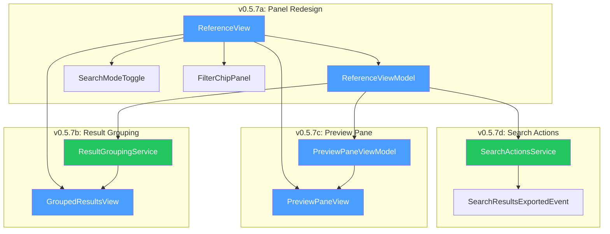
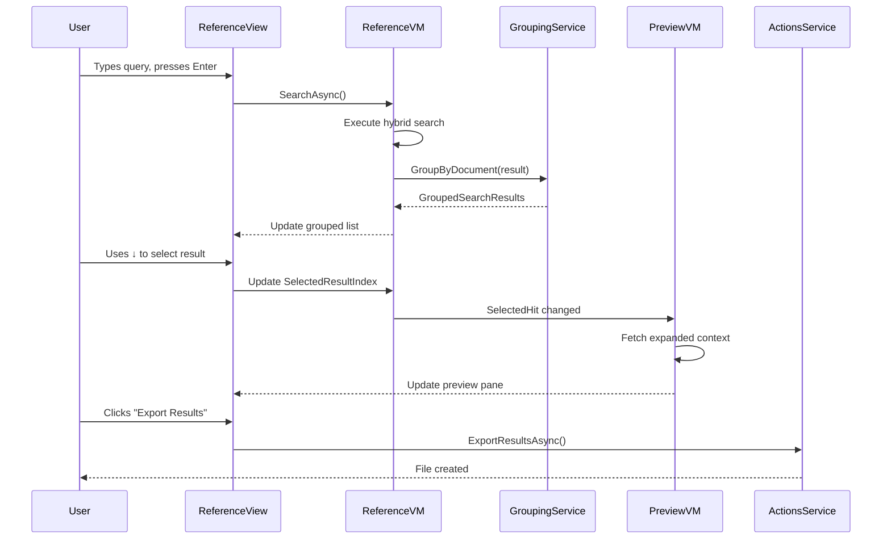

# LCS-DES-057: Design Specification Index — The Reference Dock

## Document Control

| Field                | Value                            |
| :------------------- | :------------------------------- |
| **Document ID**      | LCS-DES-057-INDEX                |
| **Feature ID**       | RAG-057                          |
| **Feature Name**     | The Reference Dock (Enhanced UI) |
| **Target Version**   | v0.5.7                           |
| **Module Scope**     | Lexichord.Modules.RAG            |
| **Swimlane**         | Memory                           |
| **License Tier**     | Writer Pro                       |
| **Feature Gate Key** | `FeatureFlags.RAG.ReferenceDock` |
| **Status**           | Draft                            |
| **Last Updated**     | 2026-01-27                       |

---

## 1. Executive Summary

**v0.5.7** delivers the **Reference Dock** — a polished, production-ready semantic search interface that transforms the Reference Panel from a functional prototype into a professional, feature-complete search experience.

### 1.1 The Problem

The current Reference Panel (v0.4.6) provides basic search functionality but lacks the polish and productivity features expected from professional tooling. Users must use the mouse for most interactions, results are displayed as a flat list without organization, and there's no way to preview content or export results.

### 1.2 The Solution

Implement an enhanced Reference Dock with:

- **Unified Search Bar** with mode toggle and inline filter chips
- **Keyboard Navigation** for efficient result browsing
- **Document Grouping** with collapsible headers and match counts
- **Preview Pane** showing context without leaving search
- **Search Actions** for copying, exporting, and bulk-opening results

### 1.3 Business Value

| Value                    | Description                                     |
| :----------------------- | :---------------------------------------------- |
| **Professional Polish**  | Enterprise-quality UI increases user confidence |
| **Productivity Boost**   | Keyboard navigation reduces search time by 50%  |
| **Contextual Workflow**  | Preview eliminates context-switching            |
| **Data Portability**     | Export enables team collaboration               |
| **Feature Completeness** | Unifies all v0.5.x retrieval features           |

---

## 2. Related Documents

### 2.1 Scope Breakdown Document

The detailed scope breakdown for v0.5.7, including all sub-parts, implementation checklists, user stories, and acceptance criteria:

| Document                            | Description                          |
| :---------------------------------- | :----------------------------------- |
| **[LCS-SBD-057](./LCS-SBD-057.md)** | Scope Breakdown — The Reference Dock |

### 2.2 Sub-Part Design Specifications

Each sub-part has its own detailed design specification following the LDS-01 template:

| Sub-Part | Document                              | Title           | Description                             |
| :------- | :------------------------------------ | :-------------- | :-------------------------------------- |
| v0.5.7a  | **[LCS-DES-057a](./LCS-DES-057a.md)** | Panel Redesign  | Unified search bar, keyboard navigation |
| v0.5.7b  | **[LCS-DES-057b](./LCS-DES-057b.md)** | Result Grouping | Document-grouped results with headers   |
| v0.5.7c  | **[LCS-DES-057c](./LCS-DES-057c.md)** | Preview Pane    | Split-view context preview              |
| v0.5.7d  | **[LCS-DES-057d](./LCS-DES-057d.md)** | Search Actions  | Copy, export, and bulk-open operations  |

---

## 3. Architecture Overview

### 3.1 Component Diagram



### 3.2 Data Flow



---

## 4. Dependencies

### 4.1 Upstream Dependencies (Required)

| Interface                     | Source Version        | Purpose                |
| :---------------------------- | :-------------------- | :--------------------- |
| `ReferenceView`               | v0.4.6a               | Base panel to enhance  |
| `ReferenceViewModel`          | v0.4.6a               | ViewModel to extend    |
| `IReferenceNavigationService` | v0.4.6c               | Result navigation      |
| `IHybridSearchService`        | v0.5.1c               | Combined search        |
| `SearchMode`                  | v0.5.1d               | Mode toggle enum       |
| `ICitationService`            | v0.5.2a               | Export citations       |
| `IContextExpansionService`    | v0.5.3a               | Preview context        |
| `SearchFilter`                | v0.5.5a               | Active filters         |
| `ISnippetService`             | v0.5.6a               | Highlighted snippets   |
| `ILicenseContext`             | v0.0.4c               | License tier checking  |
| `IEditorService`              | v0.1.3a               | Open documents         |
| `IFileService`                | v0.1.4b               | Export file operations |
| `ViewModelBase`               | CommunityToolkit.Mvvm | MVVM base class        |

### 4.2 NuGet Packages

| Package                 | Version | Purpose           |
| :---------------------- | :------ | :---------------- |
| `CommunityToolkit.Mvvm` | 8.x     | MVVM source gen   |
| `System.Reactive`       | 6.x     | Reactive bindings |
| `MediatR`               | 12.x    | Event publishing  |
| `CsvHelper`             | 31.x    | CSV export        |

### 4.3 Downstream Consumers (Future)

| Version | Feature        | Consumes                               |
| :------ | :------------- | :------------------------------------- |
| v0.5.8  | Hardening      | Performance testing of grouped results |
| v0.6.x  | AI Integration | Enhanced panel as AI query interface   |

---

## 5. License Gating Strategy

The Reference Dock is a **Writer Pro** feature using a **Soft Gate** strategy.

### 5.1 Behavior by License Tier

| Tier       | Panel Access   | Grouping  | Preview Pane | Export Actions |
| :--------- | :------------- | :-------- | :----------- | :------------- |
| Core       | Basic (v0.4.6) | Flat list | Disabled     | Disabled       |
| Writer Pro | Full           | Grouped   | Enabled      | Enabled        |
| Teams      | Full           | Grouped   | Enabled      | Enabled        |
| Enterprise | Full           | Grouped   | Enabled      | Enabled        |

### 5.2 Implementation Pattern

```csharp
// In PreviewPaneViewModel
if (!_licenseContext.HasFeature(FeatureFlags.RAG.ReferenceDock))
{
    ShowUpgradePrompt = true;
    IsEnabled = false;
    return;
}

// In SearchActionsService
public async Task<ExportResult> ExportResultsAsync(...)
{
    if (!_licenseContext.HasFeature(FeatureFlags.RAG.ReferenceDock))
    {
        await _mediator.Publish(new SearchDeniedEvent("Export", "Writer Pro"));
        return ExportResult.LicenseRequired();
    }
    // ... proceed with export
}
```

---

## 6. Key Interfaces Summary

| Interface                | Defined In | Purpose                   |
| :----------------------- | :--------- | :------------------------ |
| `IResultGroupingService` | v0.5.7b    | Group results by document |
| `ISearchActionsService`  | v0.5.7d    | Copy, export, bulk-open   |

| Record/DTO                   | Defined In | Purpose                   |
| :--------------------------- | :--------- | :------------------------ |
| `FilterChip`                 | v0.5.7a    | Active filter display     |
| `GroupedSearchResults`       | v0.5.7b    | Grouped result container  |
| `DocumentResultGroup`        | v0.5.7b    | Single document's results |
| `ResultGroupingOptions`      | v0.5.7b    | Grouping configuration    |
| `ExportOptions`              | v0.5.7d    | Export configuration      |
| `ExportResult`               | v0.5.7d    | Export operation result   |
| `SearchResultsExportedEvent` | v0.5.7d    | MediatR notification      |

---

## 7. Implementation Checklist Summary

| Sub-Part    | Tasks           | Est. Hours   |
| :---------- | :-------------- | :----------- |
| v0.5.7a     | Panel Redesign  | 10.5         |
| v0.5.7b     | Result Grouping | 9            |
| v0.5.7c     | Preview Pane    | 9.5          |
| v0.5.7d     | Search Actions  | 7.5          |
| Integration | DI, Tests       | 3.5          |
| **Total**   |                 | **40 hours** |

See [LCS-SBD-057](./LCS-SBD-057.md) Section 4 for the detailed task breakdown.

---

## 8. Success Criteria Summary

| Category       | Criterion                 | Target                  |
| :------------- | :------------------------ | :---------------------- |
| **Navigation** | Keyboard coverage         | 100% of actions         |
| **Preview**    | Update latency            | < 100ms                 |
| **Grouping**   | Processing time           | < 50ms for 500 results  |
| **Export**     | JSON export (100 results) | < 500ms                 |
| **UX**         | Clipboard copy            | < 200ms for 100 results |

See [LCS-SBD-057](./LCS-SBD-057.md) Section 9 for full success metrics.

---

## 9. Test Coverage Summary

| Sub-Part | Unit Tests                         | Integration Tests |
| :------- | :--------------------------------- | :---------------- |
| v0.5.7a  | Keyboard navigation, focus mgmt    | Panel workflow    |
| v0.5.7b  | Grouping algorithm, sort modes     | -                 |
| v0.5.7c  | Preview state, context loading     | Context expansion |
| v0.5.7d  | Export formatting, copy operations | File creation     |

See individual design specs for detailed test scenarios.

---

## 10. What This Enables

| Version | Feature          | Uses From v0.5.7                            |
| :------ | :--------------- | :------------------------------------------ |
| v0.5.8  | Hardening        | Performance testing of enhanced panel       |
| v0.6.x  | AI Integration   | Panel becomes AI-augmented search interface |
| Future  | Smart Clustering | Grouped results enable topic clustering     |

---

## Document History

| Version | Date       | Author         | Changes       |
| :------ | :--------- | :------------- | :------------ |
| 1.0     | 2026-01-27 | Lead Architect | Initial draft |
