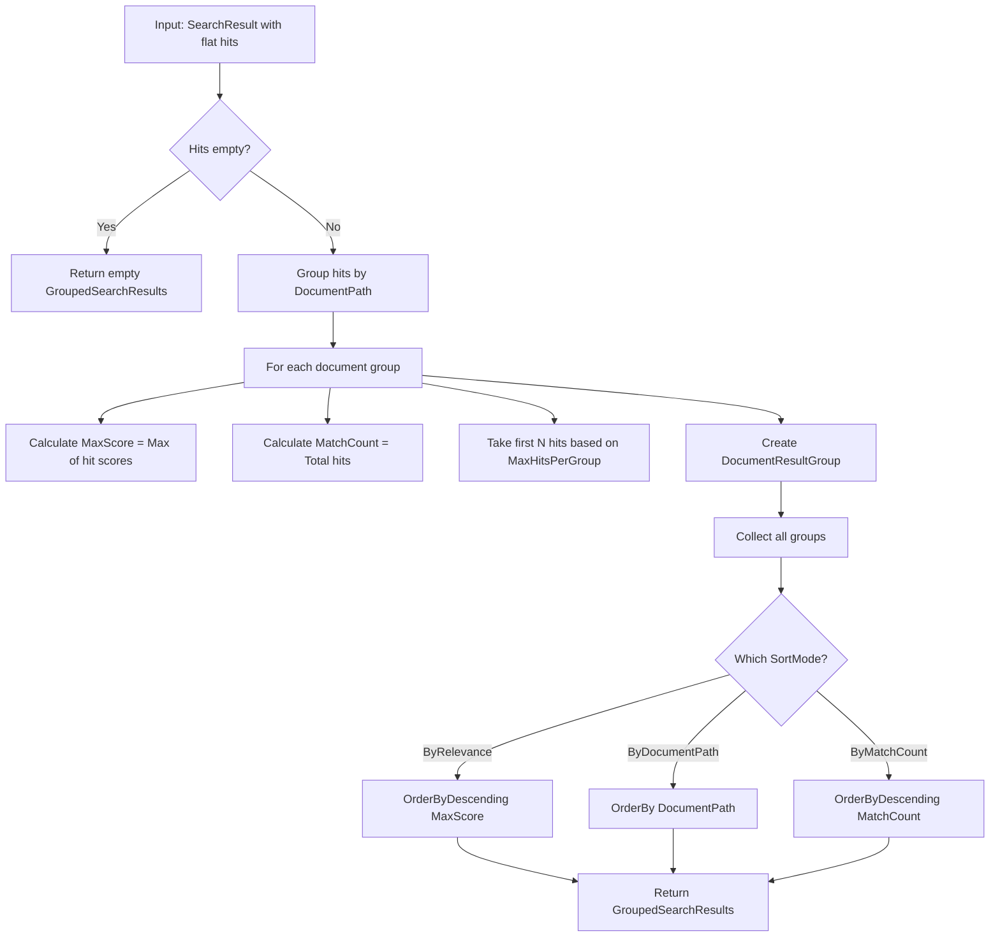

# LCS-DES-057b: Design Specification — Result Grouping

## 1. Metadata & Categorization

| Field                | Value                                                         | Description                  |
| :------------------- | :------------------------------------------------------------ | :--------------------------- |
| **Feature ID**       | `RAG-057b`                                                    | Sub-part of RAG-057          |
| **Feature Name**     | `Document-Grouped Results`                                    | Collapsible document headers |
| **Target Version**   | `v0.5.7b`                                                     | Second sub-part of v0.5.7    |
| **Module Scope**     | `Lexichord.Modules.RAG`                                       | RAG module                   |
| **Swimlane**         | `Memory`                                                      | Retrieval swimlane           |
| **License Tier**     | `Writer Pro`                                                  | Paid feature                 |
| **Feature Gate Key** | `FeatureFlags.RAG.ReferenceDock`                              | Soft gate                    |
| **Author**           | Lead Architect                                                |                              |
| **Status**           | `Draft`                                                       |                              |
| **Last Updated**     | `2026-01-27`                                                  |                              |
| **Parent Document**  | [LCS-DES-057-INDEX](./LCS-DES-057-INDEX.md)                   |                              |
| **Scope Breakdown**  | [LCS-SBD-057 §3.2](./LCS-SBD-057.md#32-v057b-result-grouping) |                              |

---

## 2. Executive Summary

### 2.1 The Requirement

When searching across a large document corpus, flat result lists become overwhelming. Users struggle to:

- **Identify document context:** Which document does each result belong to?
- **Assess coverage:** How many matches exist per document?
- **Navigate efficiently:** Jumping between unrelated documents is disorienting

> **Problem:** A search returning 50 results from 8 documents displays as 50 individual items. Users cannot quickly identify which documents are most relevant.

### 2.2 The Proposed Solution

Implement a `IResultGroupingService` that:

1. Groups search hits by their source document
2. Displays documents as collapsible headers with match counts
3. Shows maximum relevance score per document group
4. Provides sort options: By Relevance, By Document Path, By Match Count
5. Supports "Expand All" / "Collapse All" toggle functionality

---

## 3. Architecture & Modular Strategy

### 3.1 Dependencies

#### 3.1.1 Upstream Dependencies

| Interface            | Source Version        | Purpose                     |
| :------------------- | :-------------------- | :-------------------------- |
| `SearchResult`       | v0.4.5a               | Raw search result container |
| `SearchHit`          | v0.4.5a               | Individual search hit       |
| `ReferenceViewModel` | v0.5.7a               | Parent ViewModel            |
| `ILicenseContext`    | v0.0.4c               | License gating              |
| `ViewModelBase`      | CommunityToolkit.Mvvm | MVVM base class             |

#### 3.1.2 NuGet Packages

| Package                 | Version | Purpose         |
| :---------------------- | :------ | :-------------- |
| `CommunityToolkit.Mvvm` | 8.x     | MVVM source gen |

### 3.2 Licensing Behavior

Inherits from parent feature. Core tier users see flat result list (v0.4.6 behavior). Writer Pro+ users see grouped results with collapsible headers.

---

## 4. Data Contract (The API)

### 4.1 IResultGroupingService Interface

```csharp
namespace Lexichord.Modules.RAG.Contracts;

/// <summary>
/// Groups search results by source document for organized display.
/// </summary>
/// <remarks>
/// <para>The grouping service transforms a flat list of search hits into
/// a hierarchical structure organized by document.</para>
/// <para>Each document group contains metadata (path, title, match count)
/// and a subset of the most relevant hits from that document.</para>
/// </remarks>
/// <example>
/// <code>
/// var result = searchService.Search("authentication");
/// var grouped = groupingService.GroupByDocument(result, new ResultGroupingOptions());
/// // grouped.Groups[0].DocumentPath = "auth-guide.md"
/// // grouped.Groups[0].MatchCount = 5
/// // grouped.Groups[0].Hits = [top 5 hits from auth-guide.md]
/// </code>
/// </example>
public interface IResultGroupingService
{
    /// <summary>
    /// Groups search hits by their source document.
    /// </summary>
    /// <param name="result">The raw search result containing flat hit list.</param>
    /// <param name="options">Configuration for grouping behavior.</param>
    /// <returns>A grouped result structure organized by document.</returns>
    GroupedSearchResults GroupByDocument(SearchResult result, ResultGroupingOptions options);
}
```

### 4.2 ResultGroupingOptions Record

```csharp
namespace Lexichord.Modules.RAG.Models;

/// <summary>
/// Configuration options for result grouping behavior.
/// </summary>
/// <param name="SortMode">How to order the document groups.</param>
/// <param name="CollapseByDefault">Whether groups start collapsed.</param>
/// <param name="MaxHitsPerGroup">Maximum hits to include per document group.</param>
public record ResultGroupingOptions
{
    /// <summary>
    /// How to order the document groups.
    /// </summary>
    /// <value>Default is <see cref="ResultSortMode.ByRelevance"/>.</value>
    public ResultSortMode SortMode { get; init; } = ResultSortMode.ByRelevance;

    /// <summary>
    /// Whether groups start in collapsed state.
    /// </summary>
    /// <value>Default is false (groups start expanded).</value>
    public bool CollapseByDefault { get; init; } = false;

    /// <summary>
    /// Maximum number of hits to include per document group.
    /// </summary>
    /// <value>Default is 10. Set to int.MaxValue for no limit.</value>
    public int MaxHitsPerGroup { get; init; } = 10;
}

/// <summary>
/// Sort mode for document groups.
/// </summary>
public enum ResultSortMode
{
    /// <summary>Sort by maximum relevance score (highest first).</summary>
    ByRelevance,

    /// <summary>Sort alphabetically by document path.</summary>
    ByDocumentPath,

    /// <summary>Sort by number of matches (most first).</summary>
    ByMatchCount
}
```

### 4.3 GroupedSearchResults Record

```csharp
namespace Lexichord.Modules.RAG.Models;

/// <summary>
/// Container for document-grouped search results.
/// </summary>
/// <param name="Groups">Ordered list of document groups.</param>
/// <param name="TotalHits">Total number of hits across all documents.</param>
/// <param name="TotalDocuments">Number of unique documents with matches.</param>
/// <param name="Query">The original search query (for display/export).</param>
/// <param name="SearchDuration">Time taken for the search operation.</param>
public record GroupedSearchResults(
    IReadOnlyList<DocumentResultGroup> Groups,
    int TotalHits,
    int TotalDocuments,
    string? Query = null,
    TimeSpan SearchDuration = default)
{
    /// <summary>
    /// Gets all hits across all groups in relevance order.
    /// </summary>
    public IEnumerable<SearchHit> AllHits =>
        Groups.SelectMany(g => g.Hits).OrderByDescending(h => h.Score);
}
```

### 4.4 DocumentResultGroup Record

```csharp
namespace Lexichord.Modules.RAG.Models;

/// <summary>
/// A single document's grouped search results.
/// </summary>
/// <param name="DocumentPath">Full path to the source document.</param>
/// <param name="DocumentTitle">Display title (from metadata or filename).</param>
/// <param name="MatchCount">Total number of matches in this document.</param>
/// <param name="MaxScore">Highest relevance score among hits in this group.</param>
/// <param name="Hits">The individual search hits (may be limited by MaxHitsPerGroup).</param>
/// <param name="IsExpanded">Current expansion state for UI binding.</param>
public record DocumentResultGroup(
    string DocumentPath,
    string DocumentTitle,
    int MatchCount,
    float MaxScore,
    IReadOnlyList<SearchHit> Hits,
    bool IsExpanded)
{
    /// <summary>
    /// Gets the filename portion of the document path.
    /// </summary>
    public string FileName => Path.GetFileName(DocumentPath);

    /// <summary>
    /// Gets whether there are more hits than displayed.
    /// </summary>
    public bool HasMoreHits => MatchCount > Hits.Count;

    /// <summary>
    /// Gets the number of hidden hits.
    /// </summary>
    public int HiddenHitCount => MatchCount - Hits.Count;
}
```

---

## 5. Implementation Logic

### 5.1 Grouping Algorithm Flow Diagram



### 5.2 Grouping Decision Tree

```text
INPUT: SearchResult result, ResultGroupingOptions options
OUTPUT: GroupedSearchResults

ALGORITHM:
┌─ Is result.Hits empty or null?
│   └─ YES → Return GroupedSearchResults([], 0, 0)
│
├─ Group hits by document path:
│   dictionary = result.Hits.GroupBy(h => h.Document.FilePath)
│
├─ For each (path, hits) in dictionary:
│   ├─ documentTitle = hits[0].Document.Title ?? Path.GetFileName(path)
│   ├─ matchCount = hits.Count
│   ├─ maxScore = hits.Max(h => h.Score)
│   ├─ limitedHits = hits.OrderByDescending(h => h.Score)
│   │                     .Take(options.MaxHitsPerGroup)
│   │                     .ToList()
│   └─ Create DocumentResultGroup(path, title, count, score, hits, !options.CollapseByDefault)
│
├─ Sort groups based on options.SortMode:
│   ├─ ByRelevance    → OrderByDescending(g => g.MaxScore)
│   ├─ ByDocumentPath → OrderBy(g => g.DocumentPath, StringComparer.OrdinalIgnoreCase)
│   └─ ByMatchCount   → OrderByDescending(g => g.MatchCount)
│                             .ThenByDescending(g => g.MaxScore)
│
└─ Return GroupedSearchResults(sortedGroups, totalHits, groupCount)
```

### 5.3 Service Implementation

```csharp
namespace Lexichord.Modules.RAG.Services;

/// <summary>
/// Groups search results by source document.
/// </summary>
public sealed class ResultGroupingService : IResultGroupingService
{
    private readonly ILogger<ResultGroupingService> _logger;

    public ResultGroupingService(ILogger<ResultGroupingService> logger)
    {
        _logger = logger;
    }

    /// <inheritdoc />
    public GroupedSearchResults GroupByDocument(SearchResult result, ResultGroupingOptions options)
    {
        if (result.Hits is null || result.Hits.Count == 0)
        {
            _logger.LogDebug("Grouping skipped: no hits to group");
            return new GroupedSearchResults(
                Groups: Array.Empty<DocumentResultGroup>(),
                TotalHits: 0,
                TotalDocuments: 0);
        }

        // Group hits by document path
        var groupedByDocument = result.Hits
            .GroupBy(h => h.Document.FilePath, StringComparer.OrdinalIgnoreCase)
            .Select(g => CreateDocumentGroup(g, options))
            .ToList();

        // Sort based on mode
        var sorted = SortGroups(groupedByDocument, options.SortMode);

        _logger.LogDebug("Grouped {HitCount} hits into {GroupCount} documents",
            result.TotalHits, sorted.Count);

        return new GroupedSearchResults(
            Groups: sorted,
            TotalHits: result.TotalHits,
            TotalDocuments: sorted.Count,
            Query: result.Query,
            SearchDuration: result.SearchDuration);
    }

    private DocumentResultGroup CreateDocumentGroup(
        IGrouping<string, SearchHit> group,
        ResultGroupingOptions options)
    {
        var hits = group.OrderByDescending(h => h.Score).ToList();
        var limitedHits = hits.Take(options.MaxHitsPerGroup).ToList();

        return new DocumentResultGroup(
            DocumentPath: group.Key,
            DocumentTitle: hits[0].Document.Title ?? Path.GetFileName(group.Key),
            MatchCount: hits.Count,
            MaxScore: hits.Max(h => h.Score),
            Hits: limitedHits,
            IsExpanded: !options.CollapseByDefault);
    }

    private static IReadOnlyList<DocumentResultGroup> SortGroups(
        List<DocumentResultGroup> groups,
        ResultSortMode sortMode)
    {
        return sortMode switch
        {
            ResultSortMode.ByRelevance => groups
                .OrderByDescending(g => g.MaxScore)
                .ToList(),

            ResultSortMode.ByDocumentPath => groups
                .OrderBy(g => g.DocumentPath, StringComparer.OrdinalIgnoreCase)
                .ToList(),

            ResultSortMode.ByMatchCount => groups
                .OrderByDescending(g => g.MatchCount)
                .ThenByDescending(g => g.MaxScore)
                .ToList(),

            _ => groups
        };
    }
}
```

---

## 6. Data Persistence

**None required.** Group expansion state is transient UI state. If persistence is desired in the future (remembering collapsed groups), it would be stored in user preferences.

---

## 7. UI/UX Specifications

### 7.1 Grouped Results Layout

```text
┌────────────────────────────────────────────────────────────┐
│ [⊕ Expand All] [⊖ Collapse All]   Sort: [Relevance ▾]     │ ← Group controls
├────────────────────────────────────────────────────────────┤
│                                                            │
│ ▼ auth-guide.md (5 matches)                          0.92 │ ← Expanded header
│   ├─────────────────────────────────────────────────────  │
│   │ 📄 OAuth token refresh mechanism...              0.92 │
│   ├─────────────────────────────────────────────────────  │
│   │ 📄 Authentication flow for SPA...                0.88 │
│   ├─────────────────────────────────────────────────────  │
│   │ 📄 Session management best practices...          0.85 │
│   ├─────────────────────────────────────────────────────  │
│   │ 📄 Multi-factor authentication setup...           0.82 │
│   ├─────────────────────────────────────────────────────  │
│   │ 📄 Password reset workflow...                     0.78 │
│   └─────────────────────────────────────────────────────  │
│                                                            │
│ ► api-reference.md (3 matches)                       0.88 │ ← Collapsed header
│                                                            │
│ ▼ getting-started.md (2 matches)                     0.75 │ ← Expanded header
│   ├─────────────────────────────────────────────────────  │
│   │ 📄 Quick start authentication...                  0.75 │
│   ├─────────────────────────────────────────────────────  │
│   │ 📄 Initial setup for auth module...              0.70 │
│   └─────────────────────────────────────────────────────  │
│                                                            │
└────────────────────────────────────────────────────────────┘
```

### 7.2 Document Header Styling

| Element       | Style                                    | Description                |
| :------------ | :--------------------------------------- | :------------------------- |
| Chevron       | `▼` expanded, `►` collapsed              | Toggles on click           |
| Document icon | 📁 or document type icon                 | Visual document indicator  |
| Title         | `Semibold 14px`                          | Document title or filename |
| Match count   | `(N matches)` in Muted color             | Total hits in document     |
| Score badge   | Right-aligned, `0.XX` format             | Maximum relevance score    |
| Background    | `Surface-50` normal, `Surface-100` hover | Subtle highlight           |

### 7.3 Animation Specifications

| Animation      | Property        | Duration | Easing         |
| :------------- | :-------------- | :------- | :------------- |
| Expand group   | Height          | 200ms    | CubicEaseOut   |
| Collapse group | Height          | 150ms    | CubicEaseIn    |
| Chevron rotate | RotateTransform | 150ms    | CubicEaseInOut |

---

## 8. Observability & Logging

| Level | Source                  | Message Template                                        |
| :---- | :---------------------- | :------------------------------------------------------ |
| Debug | ResultGroupingService   | `"Grouping skipped: no hits to group"`                  |
| Debug | ResultGroupingService   | `"Grouped {HitCount} hits into {GroupCount} documents"` |
| Debug | GroupedResultsViewModel | `"Sort mode changed to {Mode}"`                         |
| Debug | GroupedResultsViewModel | `"Group toggled: {Path} expanded={Expanded}"`           |
| Debug | GroupedResultsViewModel | `"All groups expanded"`                                 |
| Debug | GroupedResultsViewModel | `"All groups collapsed"`                                |

---

## 9. Security & Safety

| Risk                      | Level | Mitigation                                  |
| :------------------------ | :---- | :------------------------------------------ |
| Memory with large results | Low   | MaxHitsPerGroup limits items per group      |
| UI freeze during grouping | Low   | Grouping is O(n) and fast for typical sizes |

---

## 10. Acceptance Criteria

### 10.1 Functional Criteria

| #   | Given                                       | When                       | Then                               |
| :-- | :------------------------------------------ | :------------------------- | :--------------------------------- |
| 1   | Search returns hits from 3 documents        | Results displayed          | 3 document headers shown           |
| 2   | Document has 5 matches                      | Header displayed           | Shows "(5 matches)" in header      |
| 3   | Document group is expanded                  | User clicks header         | Group collapses, chevron rotates   |
| 4   | Document group is collapsed                 | User clicks header         | Group expands, chevron rotates     |
| 5   | Multiple groups displayed                   | User clicks "Collapse All" | All groups collapse                |
| 6   | Multiple groups collapsed                   | User clicks "Expand All"   | All groups expand                  |
| 7   | Sort set to "Relevance"                     | Groups displayed           | Highest score document first       |
| 8   | Sort set to "Document Path"                 | Groups displayed           | Alphabetical by path               |
| 9   | Sort set to "Match Count"                   | Groups displayed           | Most matches first                 |
| 10  | Document has 15 matches, MaxHitsPerGroup=10 | Group displayed            | Shows 10 hits + "5 more" indicator |

### 10.2 Performance Criteria

| #   | Given                        | When      | Then                   |
| :-- | :--------------------------- | :-------- | :--------------------- |
| 11  | 500 hits from 50 documents   | Grouped   | Completes in < 50ms    |
| 12  | 1000 hits from 100 documents | Grouped   | Completes in < 100ms   |
| 13  | Group expanded/collapsed     | Animation | Smooth 60fps animation |

---

## 11. Test Scenarios

### 11.1 Unit Tests

```csharp
[Trait("Category", "Unit")]
[Trait("Feature", "v0.5.7b")]
public class ResultGroupingServiceTests
{
    private readonly ResultGroupingService _sut;

    public ResultGroupingServiceTests()
    {
        _sut = new ResultGroupingService(Mock.Of<ILogger<ResultGroupingService>>());
    }

    [Fact]
    public void GroupByDocument_EmptyHits_ReturnsEmptyResult()
    {
        // Arrange
        var result = new SearchResult(Array.Empty<SearchHit>(), 0, TimeSpan.Zero);

        // Act
        var grouped = _sut.GroupByDocument(result, new ResultGroupingOptions());

        // Assert
        grouped.TotalHits.Should().Be(0);
        grouped.TotalDocuments.Should().Be(0);
        grouped.Groups.Should().BeEmpty();
    }

    [Fact]
    public void GroupByDocument_SingleDocument_CreatesSingleGroup()
    {
        // Arrange
        var hits = new[]
        {
            CreateHit("doc1.md", 0.9f),
            CreateHit("doc1.md", 0.8f),
            CreateHit("doc1.md", 0.7f)
        };
        var result = new SearchResult(hits, 3, TimeSpan.Zero);

        // Act
        var grouped = _sut.GroupByDocument(result, new ResultGroupingOptions());

        // Assert
        grouped.TotalDocuments.Should().Be(1);
        grouped.Groups.Should().HaveCount(1);
        grouped.Groups[0].MatchCount.Should().Be(3);
        grouped.Groups[0].MaxScore.Should().Be(0.9f);
    }

    [Fact]
    public void GroupByDocument_MultipleDocuments_CreatesMultipleGroups()
    {
        // Arrange
        var hits = new[]
        {
            CreateHit("doc1.md", 0.9f),
            CreateHit("doc2.md", 0.8f),
            CreateHit("doc1.md", 0.85f),
            CreateHit("doc3.md", 0.7f),
            CreateHit("doc1.md", 0.75f)
        };
        var result = new SearchResult(hits, 5, TimeSpan.Zero);

        // Act
        var grouped = _sut.GroupByDocument(result, new ResultGroupingOptions());

        // Assert
        grouped.TotalDocuments.Should().Be(3);
        grouped.TotalHits.Should().Be(5);
        grouped.Groups.First(g => g.DocumentPath == "doc1.md").MatchCount.Should().Be(3);
        grouped.Groups.First(g => g.DocumentPath == "doc2.md").MatchCount.Should().Be(1);
    }

    [Theory]
    [InlineData(ResultSortMode.ByRelevance, "doc1.md")]   // 0.9 > 0.85 > 0.7
    [InlineData(ResultSortMode.ByMatchCount, "doc1.md")]  // 3 > 1 > 1
    public void GroupByDocument_SortMode_OrdersCorrectly(ResultSortMode mode, string expectedFirst)
    {
        // Arrange
        var hits = new[]
        {
            CreateHit("doc1.md", 0.9f),
            CreateHit("doc1.md", 0.8f),
            CreateHit("doc1.md", 0.7f),
            CreateHit("doc2.md", 0.85f),
            CreateHit("doc3.md", 0.7f)
        };
        var result = new SearchResult(hits, 5, TimeSpan.Zero);
        var options = new ResultGroupingOptions { SortMode = mode };

        // Act
        var grouped = _sut.GroupByDocument(result, options);

        // Assert
        grouped.Groups[0].DocumentPath.Should().Be(expectedFirst);
    }

    [Fact]
    public void GroupByDocument_ByDocumentPath_SortsAlphabetically()
    {
        // Arrange
        var hits = new[]
        {
            CreateHit("zebra.md", 0.9f),
            CreateHit("apple.md", 0.8f),
            CreateHit("mango.md", 0.7f)
        };
        var result = new SearchResult(hits, 3, TimeSpan.Zero);
        var options = new ResultGroupingOptions { SortMode = ResultSortMode.ByDocumentPath };

        // Act
        var grouped = _sut.GroupByDocument(result, options);

        // Assert
        grouped.Groups[0].DocumentPath.Should().Be("apple.md");
        grouped.Groups[1].DocumentPath.Should().Be("mango.md");
        grouped.Groups[2].DocumentPath.Should().Be("zebra.md");
    }

    [Fact]
    public void GroupByDocument_MaxHitsPerGroup_LimitsResults()
    {
        // Arrange
        var hits = Enumerable.Range(0, 20)
            .Select(i => CreateHit("doc.md", 0.9f - i * 0.01f))
            .ToArray();
        var result = new SearchResult(hits, 20, TimeSpan.Zero);
        var options = new ResultGroupingOptions { MaxHitsPerGroup = 5 };

        // Act
        var grouped = _sut.GroupByDocument(result, options);

        // Assert
        grouped.Groups[0].Hits.Should().HaveCount(5);
        grouped.Groups[0].MatchCount.Should().Be(20);
        grouped.Groups[0].HasMoreHits.Should().BeTrue();
        grouped.Groups[0].HiddenHitCount.Should().Be(15);
    }

    [Fact]
    public void GroupByDocument_CollapseByDefault_SetsExpansionState()
    {
        // Arrange
        var hits = new[] { CreateHit("doc.md", 0.9f) };
        var result = new SearchResult(hits, 1, TimeSpan.Zero);
        var options = new ResultGroupingOptions { CollapseByDefault = true };

        // Act
        var grouped = _sut.GroupByDocument(result, options);

        // Assert
        grouped.Groups[0].IsExpanded.Should().BeFalse();
    }

    [Fact]
    public void GroupByDocument_HitsOrderedByScoreWithinGroup()
    {
        // Arrange
        var hits = new[]
        {
            CreateHit("doc.md", 0.5f),
            CreateHit("doc.md", 0.9f),
            CreateHit("doc.md", 0.7f)
        };
        var result = new SearchResult(hits, 3, TimeSpan.Zero);

        // Act
        var grouped = _sut.GroupByDocument(result, new ResultGroupingOptions());

        // Assert
        var groupHits = grouped.Groups[0].Hits;
        groupHits[0].Score.Should().Be(0.9f);
        groupHits[1].Score.Should().Be(0.7f);
        groupHits[2].Score.Should().Be(0.5f);
    }

    private static SearchHit CreateHit(string path, float score)
    {
        var doc = new Document { FilePath = path, Title = Path.GetFileNameWithoutExtension(path) };
        var chunk = new Chunk { Content = $"Content for {path}" };
        return new SearchHit(doc, chunk, score);
    }
}

[Trait("Category", "Unit")]
[Trait("Feature", "v0.5.7b")]
public class GroupedResultsViewModelTests
{
    [Fact]
    public void ExpandAll_SetsAllGroupsExpanded()
    {
        // Arrange
        var vm = CreateViewModel();
        vm.Results = CreateGroupedResults(collapsed: true);

        // Act
        vm.ExpandAllCommand.Execute(null);

        // Assert
        vm.Results.Groups.Should().AllSatisfy(g => g.IsExpanded.Should().BeTrue());
        vm.AllExpanded.Should().BeTrue();
    }

    [Fact]
    public void CollapseAll_SetsAllGroupsCollapsed()
    {
        // Arrange
        var vm = CreateViewModel();
        vm.Results = CreateGroupedResults(collapsed: false);

        // Act
        vm.CollapseAllCommand.Execute(null);

        // Assert
        vm.Results.Groups.Should().AllSatisfy(g => g.IsExpanded.Should().BeFalse());
        vm.AllExpanded.Should().BeFalse();
    }

    [Fact]
    public void ToggleGroup_TogglesExpansionState()
    {
        // Arrange
        var vm = CreateViewModel();
        vm.Results = CreateGroupedResults(collapsed: false);
        var group = vm.Results.Groups[0];
        var originalState = group.IsExpanded;

        // Act
        vm.ToggleGroupCommand.Execute(group);

        // Assert
        // Note: Due to records being immutable, verify the command updates the collection
    }

    [Theory]
    [InlineData(ResultSortMode.ByRelevance)]
    [InlineData(ResultSortMode.ByDocumentPath)]
    [InlineData(ResultSortMode.ByMatchCount)]
    public void ChangeSortMode_UpdatesSortMode(ResultSortMode mode)
    {
        // Arrange
        var vm = CreateViewModel();
        vm.SortMode = ResultSortMode.ByRelevance;

        // Act
        vm.ChangeSortModeCommand.Execute(mode);

        // Assert
        vm.SortMode.Should().Be(mode);
    }
}
```

---

## 12. ViewModel for Group State

```csharp
namespace Lexichord.Modules.RAG.ViewModels;

/// <summary>
/// ViewModel for grouped search results with expansion state management.
/// </summary>
public partial class GroupedResultsViewModel : ViewModelBase
{
    private readonly IResultGroupingService _groupingService;
    private readonly ILogger<GroupedResultsViewModel> _logger;
    private SearchResult? _rawResult;

    [ObservableProperty]
    private GroupedSearchResults? _results;

    [ObservableProperty]
    private ResultSortMode _sortMode = ResultSortMode.ByRelevance;

    [ObservableProperty]
    private bool _allExpanded = true;

    public GroupedResultsViewModel(
        IResultGroupingService groupingService,
        ILogger<GroupedResultsViewModel> logger)
    {
        _groupingService = groupingService;
        _logger = logger;
    }

    /// <summary>
    /// Updates the grouped results from a raw search result.
    /// </summary>
    public void UpdateFromSearchResult(SearchResult result)
    {
        _rawResult = result;
        ReapplyGrouping();
    }

    /// <summary>
    /// Expands all document groups.
    /// </summary>
    [RelayCommand]
    private void ExpandAll()
    {
        if (Results is null) return;

        var expanded = Results.Groups
            .Select(g => g with { IsExpanded = true })
            .ToList();

        Results = Results with { Groups = expanded };
        AllExpanded = true;

        _logger.LogDebug("All groups expanded");
    }

    /// <summary>
    /// Collapses all document groups.
    /// </summary>
    [RelayCommand]
    private void CollapseAll()
    {
        if (Results is null) return;

        var collapsed = Results.Groups
            .Select(g => g with { IsExpanded = false })
            .ToList();

        Results = Results with { Groups = collapsed };
        AllExpanded = false;

        _logger.LogDebug("All groups collapsed");
    }

    /// <summary>
    /// Toggles the expansion state of a single group.
    /// </summary>
    [RelayCommand]
    private void ToggleGroup(DocumentResultGroup group)
    {
        if (Results is null) return;

        var updated = Results.Groups
            .Select(g => g.DocumentPath == group.DocumentPath
                ? g with { IsExpanded = !g.IsExpanded }
                : g)
            .ToList();

        Results = Results with { Groups = updated };
        AllExpanded = updated.All(g => g.IsExpanded);

        _logger.LogDebug("Group toggled: {Path} expanded={Expanded}",
            group.DocumentPath, !group.IsExpanded);
    }

    /// <summary>
    /// Changes the sort mode and re-groups results.
    /// </summary>
    [RelayCommand]
    private void ChangeSortMode(ResultSortMode mode)
    {
        SortMode = mode;
        _logger.LogDebug("Sort mode changed to {Mode}", mode);
        ReapplyGrouping();
    }

    private void ReapplyGrouping()
    {
        if (_rawResult is null) return;

        var options = new ResultGroupingOptions
        {
            SortMode = SortMode,
            CollapseByDefault = !AllExpanded
        };

        Results = _groupingService.GroupByDocument(_rawResult, options);
    }
}
```

---

## 13. DI Registration

```csharp
// In RAGModule.cs ConfigureServices method
services.AddSingleton<IResultGroupingService, ResultGroupingService>();
services.AddTransient<GroupedResultsViewModel>();
```

---

## 14. Implementation Checklist

| #         | Task                                      | Est. Hours | Status |
| :-------- | :---------------------------------------- | :--------- | :----- |
| 1         | Create `IResultGroupingService` interface | 0.5        | [ ]    |
| 2         | Create `ResultGroupingOptions` record     | 0.5        | [ ]    |
| 3         | Create `GroupedSearchResults` record      | 0.5        | [ ]    |
| 4         | Create `DocumentResultGroup` record       | 0.5        | [ ]    |
| 5         | Implement `ResultGroupingService`         | 2          | [ ]    |
| 6         | Create `GroupedResultsView.axaml`         | 3          | [ ]    |
| 7         | Create `GroupedResultsViewModel`          | 1.5        | [ ]    |
| 8         | Implement expand/collapse animations      | 1          | [ ]    |
| 9         | Add sort mode toggle dropdown             | 1          | [ ]    |
| 10        | Add "Expand All" / "Collapse All" buttons | 0.5        | [ ]    |
| 11        | Unit tests for `ResultGroupingService`    | 2          | [ ]    |
| 12        | Unit tests for `GroupedResultsViewModel`  | 1          | [ ]    |
| **Total** |                                           | **14**     |        |

---

## 15. Verification Commands

```bash
# ═══════════════════════════════════════════════════════════════════════════
# v0.5.7b Verification
# ═══════════════════════════════════════════════════════════════════════════

# 1. Build solution
dotnet build

# 2. Run unit tests for v0.5.7b
dotnet test --filter "Category=Unit&FullyQualifiedName~v0.5.7b"

# 3. Run ResultGroupingService tests
dotnet test --filter "Category=Unit&FullyQualifiedName~ResultGroupingServiceTests"

# 4. Manual verification checklist:
# a) Execute search that matches multiple documents
# b) Verify results grouped by document with headers
# c) Verify match count displayed in each header
# d) Verify max score displayed for each group
# e) Click header → Verify group collapses/expands
# f) Click "Collapse All" → Verify all groups collapse
# g) Click "Expand All" → Verify all groups expand
# h) Change sort to "Document Path" → Verify alphabetical order
# i) Change sort to "Match Count" → Verify most matches first
# j) Verify smooth animation on expand/collapse
```

---

## Document History

| Version | Date       | Author         | Changes                             |
| :------ | :--------- | :------------- | :---------------------------------- |
| 1.0     | 2026-01-27 | Lead Architect | Initial draft                       |
| 1.1     | 2026-01-27 | Lead Architect | Expanded to match project standards |
