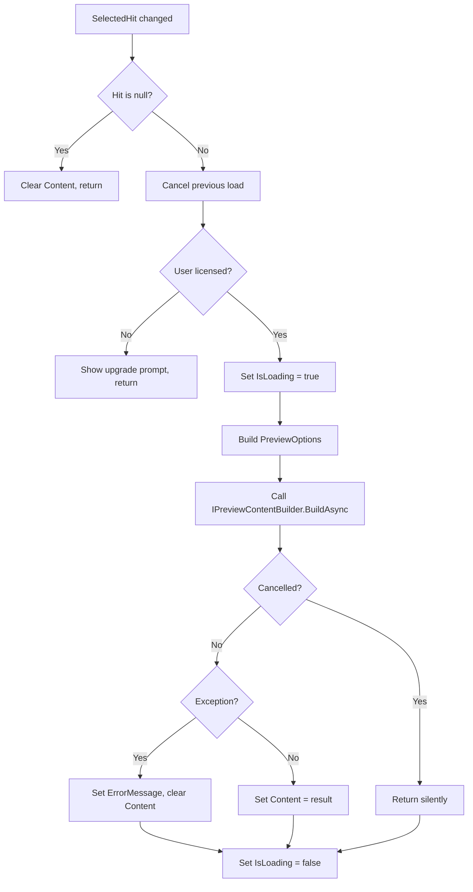

# LCS-DES-057c: Design Specification — Preview Pane

## 1. Metadata & Categorization

| Field                | Value                                                      | Description                  |
| :------------------- | :--------------------------------------------------------- | :--------------------------- |
| **Feature ID**       | `RAG-057c`                                                 | Sub-part of RAG-057          |
| **Feature Name**     | `Split-View Preview Pane`                                  | Context-aware result preview |
| **Target Version**   | `v0.5.7c`                                                  | Third sub-part of v0.5.7     |
| **Module Scope**     | `Lexichord.Modules.RAG`                                    | RAG module                   |
| **Swimlane**         | `Memory`                                                   | Retrieval swimlane           |
| **License Tier**     | `Writer Pro`                                               | Paid feature                 |
| **Feature Gate Key** | `FeatureFlags.RAG.ReferenceDock`                           | Soft gate                    |
| **Author**           | Lead Architect                                             |                              |
| **Status**           | `Draft`                                                    |                              |
| **Last Updated**     | `2026-01-27`                                               |                              |
| **Parent Document**  | [LCS-DES-057-INDEX](./LCS-DES-057-INDEX.md)                |                              |
| **Scope Breakdown**  | [LCS-SBD-057 §3.3](./LCS-SBD-057.md#33-v057c-preview-pane) |                              |

---

## 2. Executive Summary

### 2.1 The Requirement

Clicking a search result to view its content requires opening the full document, losing the search context. Users must:

- **Leave the search panel:** Opening a document dismisses the search view
- **Lose their place:** The result list scroll position is lost
- **Context switch:** Jumping between search and editor is disorienting
- **No context:** The result snippet doesn't show surrounding content

> **Problem:** Users cannot preview search results without abandoning their search workflow. This creates friction when comparing multiple results.

### 2.2 The Proposed Solution

Implement a `PreviewPaneView` that:

1. Shows selected result content in a split-view adjacent to the result list
2. Fetches expanded context using `IContextExpansionService` (preceding + following lines)
3. Highlights matched content with visual distinction from context
4. Supports toggling between "Preview" mode and "Full Width Results" mode
5. Provides quick actions: "Open in Editor", "Copy Content"

---

## 3. Architecture & Modular Strategy

### 3.1 Dependencies

#### 3.1.1 Upstream Dependencies

| Interface                  | Source Version        | Purpose                       |
| :------------------------- | :-------------------- | :---------------------------- |
| `IContextExpansionService` | v0.5.3a               | Retrieves surrounding context |
| `ExpandedChunk`            | v0.5.3b               | Result of context expansion   |
| `ContextOptions`           | v0.5.3a               | Configuration for expansion   |
| `ISnippetService`          | v0.5.6a               | Highlight spans for matches   |
| `IEditorService`           | v0.1.3a               | Open documents in editor      |
| `ReferenceViewModel`       | v0.5.7a               | Parent panel ViewModel        |
| `SearchHit`                | v0.4.5a               | Selected search result        |
| `ILicenseContext`          | v0.0.4c               | License gating                |
| `ViewModelBase`            | CommunityToolkit.Mvvm | MVVM base class               |

#### 3.1.2 NuGet Packages

| Package                 | Version | Purpose             |
| :---------------------- | :------ | :------------------ |
| `CommunityToolkit.Mvvm` | 8.x     | MVVM source gen     |
| `AvaloniaEdit`          | 11.x    | Syntax highlighting |

### 3.2 Licensing Behavior

The preview pane uses a **Soft Gate** strategy:

- **Core tier:** Preview pane not shown; clicking a result opens it directly in editor
- **Writer Pro+:** Full preview pane with context expansion, copy actions

```csharp
public bool IsPreviewEnabled =>
    _licenseContext.HasFeature(FeatureFlags.RAG.ReferenceDock);
```

---

## 4. Data Contract (The API)

### 4.1 PreviewContent Record

```csharp
namespace Lexichord.Modules.RAG.Models;

/// <summary>
/// Content to display in the preview pane, including surrounding context.
/// </summary>
/// <remarks>
/// <para>The preview content is divided into three sections:</para>
/// <list type="number">
///   <item>Preceding context: Lines before the matched content</item>
///   <item>Matched content: The actual search hit (highlighted)</item>
///   <item>Following context: Lines after the matched content</item>
/// </list>
/// </remarks>
/// <param name="DocumentPath">Full path to the source document.</param>
/// <param name="DocumentTitle">Display title for the preview header.</param>
/// <param name="Breadcrumb">Heading hierarchy path (e.g., "API > Auth > Tokens").</param>
/// <param name="PrecedingContext">Lines before the matched content.</param>
/// <param name="MatchedContent">The highlighted matched content.</param>
/// <param name="FollowingContext">Lines after the matched content.</param>
/// <param name="LineNumber">Line number in source document.</param>
/// <param name="HighlightSpans">Character ranges to highlight within MatchedContent.</param>
public record PreviewContent(
    string DocumentPath,
    string DocumentTitle,
    string? Breadcrumb,
    string PrecedingContext,
    string MatchedContent,
    string FollowingContext,
    int LineNumber,
    IReadOnlyList<HighlightSpan> HighlightSpans)
{
    /// <summary>
    /// Creates an empty preview for placeholder display.
    /// </summary>
    public static PreviewContent Empty => new(
        string.Empty, string.Empty, null,
        string.Empty, string.Empty, string.Empty,
        0, Array.Empty<HighlightSpan>());

    /// <summary>
    /// Gets whether this preview has actual content.
    /// </summary>
    public bool HasContent => !string.IsNullOrWhiteSpace(MatchedContent);
}

/// <summary>
/// A character range to highlight within text.
/// </summary>
/// <param name="Start">Start character index (0-based).</param>
/// <param name="Length">Number of characters to highlight.</param>
public record HighlightSpan(int Start, int Length);
```

### 4.2 IPreviewContentBuilder Interface

```csharp
namespace Lexichord.Modules.RAG.Contracts;

/// <summary>
/// Builds preview content from a search hit using context expansion.
/// </summary>
/// <remarks>
/// <para>This service coordinates between the context expansion service
/// and the snippet service to produce complete preview content.</para>
/// </remarks>
public interface IPreviewContentBuilder
{
    /// <summary>
    /// Builds preview content for a search hit.
    /// </summary>
    /// <param name="hit">The search hit to build preview for.</param>
    /// <param name="options">Configuration for context expansion.</param>
    /// <param name="ct">Cancellation token.</param>
    /// <returns>Complete preview content with context and highlights.</returns>
    Task<PreviewContent> BuildAsync(
        SearchHit hit,
        PreviewOptions options,
        CancellationToken ct = default);
}

/// <summary>
/// Configuration for preview content building.
/// </summary>
public record PreviewOptions
{
    /// <summary>Number of lines to show before matched content.</summary>
    public int LinesBefore { get; init; } = 5;

    /// <summary>Number of lines to show after matched content.</summary>
    public int LinesAfter { get; init; } = 5;

    /// <summary>Whether to include heading breadcrumb.</summary>
    public bool IncludeBreadcrumb { get; init; } = true;
}
```

### 4.3 PreviewPaneViewModel

```csharp
namespace Lexichord.Modules.RAG.ViewModels;

/// <summary>
/// ViewModel for the split-view preview pane.
/// </summary>
/// <remarks>
/// <para>The preview pane displays expanded context for the currently
/// selected search result. Selection changes are observed via property binding.</para>
/// <para>Loading is performed asynchronously with cancellation support
/// for rapid selection changes.</para>
/// </remarks>
public partial class PreviewPaneViewModel : ViewModelBase, IDisposable
{
    private readonly IPreviewContentBuilder _contentBuilder;
    private readonly IEditorService _editorService;
    private readonly ILicenseContext _licenseContext;
    private readonly ILogger<PreviewPaneViewModel> _logger;
    private CancellationTokenSource? _loadingCts;

    // ========================================================================
    // State Properties
    // ========================================================================

    /// <summary>
    /// The currently selected search hit (bound from parent ViewModel).
    /// </summary>
    [ObservableProperty]
    private SearchHit? _selectedHit;

    /// <summary>
    /// The preview content to display.
    /// </summary>
    [ObservableProperty]
    private PreviewContent? _content;

    /// <summary>
    /// Whether the preview is currently loading.
    /// </summary>
    [ObservableProperty]
    private bool _isLoading;

    /// <summary>
    /// Whether the preview pane is visible.
    /// </summary>
    [ObservableProperty]
    private bool _isVisible = true;

    /// <summary>
    /// Error message if preview loading failed.
    /// </summary>
    [ObservableProperty]
    private string? _errorMessage;

    /// <summary>
    /// Whether to show the upgrade prompt for unlicensed users.
    /// </summary>
    [ObservableProperty]
    private bool _showUpgradePrompt;

    // ========================================================================
    // Computed Properties
    // ========================================================================

    /// <summary>
    /// Width of the preview pane column for GridSplitter binding.
    /// </summary>
    public GridLength PreviewWidth => IsVisible
        ? new GridLength(1, GridUnitType.Star)
        : new GridLength(0);

    /// <summary>
    /// Whether the preview pane should show placeholder content.
    /// </summary>
    public bool ShowPlaceholder =>
        !IsLoading && Content?.HasContent != true && !ShowUpgradePrompt;

    // ========================================================================
    // Lifecycle
    // ========================================================================

    public PreviewPaneViewModel(
        IPreviewContentBuilder contentBuilder,
        IEditorService editorService,
        ILicenseContext licenseContext,
        ILogger<PreviewPaneViewModel> logger)
    {
        _contentBuilder = contentBuilder;
        _editorService = editorService;
        _licenseContext = licenseContext;
        _logger = logger;
    }

    /// <summary>
    /// Handles selection changes to update preview content.
    /// </summary>
    partial void OnSelectedHitChanged(SearchHit? value)
    {
        _ = LoadPreviewAsync(value);
    }

    partial void OnIsVisibleChanged(bool value)
    {
        OnPropertyChanged(nameof(PreviewWidth));
    }

    // ========================================================================
    // Commands
    // ========================================================================

    /// <summary>
    /// Toggles the visibility of the preview pane.
    /// </summary>
    [RelayCommand]
    private void TogglePreview()
    {
        IsVisible = !IsVisible;
        _logger.LogDebug("Preview toggled: visible={IsVisible}", IsVisible);
    }

    /// <summary>
    /// Opens the current result in the main editor.
    /// </summary>
    [RelayCommand(CanExecute = nameof(CanOpenInEditor))]
    private async Task OpenInEditorAsync()
    {
        if (SelectedHit is null) return;

        var path = SelectedHit.Document.FilePath;
        var line = SelectedHit.Chunk.LineNumber;

        _logger.LogDebug("Opening in editor: {Path} at line {Line}", path, line);

        await _editorService.OpenFileAsync(path, line);
    }

    private bool CanOpenInEditor() => SelectedHit is not null;

    /// <summary>
    /// Copies the matched content to clipboard.
    /// </summary>
    [RelayCommand(CanExecute = nameof(CanCopyContent))]
    private async Task CopyContentAsync()
    {
        if (Content is null) return;

        await ClipboardService.SetTextAsync(Content.MatchedContent);
        _logger.LogDebug("Copied preview content to clipboard");
    }

    private bool CanCopyContent() => Content?.HasContent == true;

    /// <summary>
    /// Copies all content (context + match) to clipboard.
    /// </summary>
    [RelayCommand(CanExecute = nameof(CanCopyContent))]
    private async Task CopyAllAsync()
    {
        if (Content is null) return;

        var full = string.Join("\n",
            Content.PrecedingContext,
            Content.MatchedContent,
            Content.FollowingContext);

        await ClipboardService.SetTextAsync(full.Trim());
        _logger.LogDebug("Copied full preview content to clipboard");
    }

    // ========================================================================
    // Private Methods
    // ========================================================================

    private async Task LoadPreviewAsync(SearchHit? hit)
    {
        // Cancel any in-progress load
        _loadingCts?.Cancel();
        _loadingCts = new CancellationTokenSource();
        var ct = _loadingCts.Token;

        // Clear state
        ErrorMessage = null;
        ShowUpgradePrompt = false;

        if (hit is null)
        {
            Content = null;
            return;
        }

        // Check license
        if (!_licenseContext.HasFeature(FeatureFlags.RAG.ReferenceDock))
        {
            ShowUpgradePrompt = true;
            Content = null;
            return;
        }

        IsLoading = true;
        var sw = Stopwatch.StartNew();

        try
        {
            var options = new PreviewOptions
            {
                LinesBefore = 5,
                LinesAfter = 5,
                IncludeBreadcrumb = true
            };

            var content = await _contentBuilder.BuildAsync(hit, options, ct);

            if (ct.IsCancellationRequested) return;

            Content = content;

            sw.Stop();
            _logger.LogDebug("Preview updated for chunk {ChunkId} in {ElapsedMs}ms",
                hit.Chunk.Id, sw.ElapsedMilliseconds);
        }
        catch (OperationCanceledException)
        {
            // Ignore - new selection started
        }
        catch (Exception ex)
        {
            _logger.LogWarning(ex, "Failed to load preview for {Path}", hit.Document.FilePath);
            ErrorMessage = "Failed to load preview";
            Content = null;
        }
        finally
        {
            IsLoading = false;
        }
    }

    public void Dispose()
    {
        _loadingCts?.Cancel();
        _loadingCts?.Dispose();
    }
}
```

---

## 5. Implementation Logic

### 5.1 Preview Content Builder Implementation

```csharp
namespace Lexichord.Modules.RAG.Services;

/// <summary>
/// Builds preview content from search hits using context expansion.
/// </summary>
public sealed class PreviewContentBuilder : IPreviewContentBuilder
{
    private readonly IContextExpansionService _contextService;
    private readonly ISnippetService _snippetService;
    private readonly ILogger<PreviewContentBuilder> _logger;

    public PreviewContentBuilder(
        IContextExpansionService contextService,
        ISnippetService snippetService,
        ILogger<PreviewContentBuilder> logger)
    {
        _contextService = contextService;
        _snippetService = snippetService;
        _logger = logger;
    }

    /// <inheritdoc />
    public async Task<PreviewContent> BuildAsync(
        SearchHit hit,
        PreviewOptions options,
        CancellationToken ct = default)
    {
        ArgumentNullException.ThrowIfNull(hit);

        // Expand context
        var contextOptions = new ContextOptions
        {
            LinesBefore = options.LinesBefore,
            LinesAfter = options.LinesAfter
        };

        var expanded = await _contextService.ExpandAsync(hit.Chunk, contextOptions, ct);

        // Get highlight spans from snippet service
        var highlights = _snippetService.GetHighlightSpans(hit);

        // Format breadcrumb
        var breadcrumb = options.IncludeBreadcrumb
            ? FormatBreadcrumb(hit.Chunk.Metadata?.Heading)
            : null;

        return new PreviewContent(
            DocumentPath: hit.Document.FilePath,
            DocumentTitle: hit.Document.Title ?? Path.GetFileName(hit.Document.FilePath),
            Breadcrumb: breadcrumb,
            PrecedingContext: expanded.PrecedingContent,
            MatchedContent: expanded.MatchedContent,
            FollowingContext: expanded.FollowingContent,
            LineNumber: hit.Chunk.LineNumber,
            HighlightSpans: highlights);
    }

    private static string? FormatBreadcrumb(string? heading)
    {
        if (string.IsNullOrWhiteSpace(heading))
            return null;

        // Replace markdown heading separator with nice arrow
        return heading
            .Replace(" > ", " › ")
            .Replace(" / ", " › ");
    }
}
```

### 5.2 Preview Update Flow Diagram



### 5.3 Preview Update Decision Tree

```text
INPUT: SearchHit hit (may be null)
OUTPUT: Update to Content, IsLoading, ErrorMessage, ShowUpgradePrompt

ALGORITHM:
┌─ Cancel any in-progress load operation
│   └─ _loadingCts?.Cancel()
│
├─ Clear error state:
│   ├─ ErrorMessage = null
│   └─ ShowUpgradePrompt = false
│
├─ Is hit null?
│   └─ YES → Content = null, return
│
├─ Is user licensed for ReferenceDock?
│   └─ NO → ShowUpgradePrompt = true, Content = null, return
│
├─ Set IsLoading = true
│
├─ Build preview options:
│   ├─ LinesBefore = 5
│   ├─ LinesAfter = 5
│   └─ IncludeBreadcrumb = true
│
├─ Try:
│   ├─ content = await _contentBuilder.BuildAsync(hit, options, ct)
│   ├─ If cancelled → return silently
│   └─ Content = content
│
├─ Catch OperationCanceledException:
│   └─ Ignore (new selection started)
│
├─ Catch Exception ex:
│   ├─ Log warning
│   ├─ ErrorMessage = "Failed to load preview"
│   └─ Content = null
│
└─ Finally:
    └─ IsLoading = false
```

---

## 6. Data Persistence

**None required.** Preview pane visibility state could optionally be persisted in user preferences, but is not required for v0.5.7c.

---

## 7. UI/UX Specifications

### 7.1 Preview Pane Layout

```text
┌────────────────────────────────────────────────────────────────────────┐
│  Preview: auth-guide.md                                    [⤢] [📋] [×] │ ← Header
├──────────────────────────────────┬─────────────────────────────────────┤
│  📁 Authentication > OAuth > Tokens                            Ln 42  │ ← Breadcrumb
├──────────────────────────────────┴─────────────────────────────────────┤
│                                                                        │
│  ┌─ Context (dimmed) ────────────────────────────────────────────────┐ │
│  │ The OAuth 2.0 specification defines several grant types for       │ │
│  │ different use cases. For server applications, the authorization   │ │
│  │ code flow is recommended. This provides secure token exchange.    │ │
│  └───────────────────────────────────────────────────────────────────┘ │
│                                                                        │
│  ┌─ Matched Content (highlighted) ───────────────────────────────────┐ │
│  │ █████████████████████████████████████████████████████████████████ │ │
│  │ █ **Token refresh** occurs when the access token expires. The   █ │ │
│  │ █ client uses the refresh token to obtain a new access token    █ │ │
│  │ █ without requiring user re-authentication.                     █ │ │
│  │ █████████████████████████████████████████████████████████████████ │ │
│  └───────────────────────────────────────────────────────────────────┘ │
│                                                                        │
│  ┌─ Context (dimmed) ────────────────────────────────────────────────┐ │
│  │ Best practices for token storage include using secure HTTP-only   │ │
│  │ cookies and avoiding localStorage for sensitive tokens.          │ │
│  └───────────────────────────────────────────────────────────────────┘ │
│                                                                        │
├────────────────────────────────────────────────────────────────────────┤
│  [Open in Editor]                                        [Copy Match]  │ ← Actions
└────────────────────────────────────────────────────────────────────────┘
```

### 7.2 Styling Specifications

| Element           | Style                                  | Purpose                |
| :---------------- | :------------------------------------- | :--------------------- |
| Header background | `Surface-100`                          | Visual separation      |
| Document title    | `Semibold 14px`, `Foreground`          | Primary identification |
| Action buttons    | Icon buttons with hover states         | Quick actions          |
| Breadcrumb        | `Regular 12px`, `Muted`                | Heading context        |
| Line number       | `Mono 12px`, `Muted`, right-aligned    | Source reference       |
| Context sections  | `Regular 14px`, `Muted`, `Opacity 0.7` | De-emphasized          |
| Matched content   | `Regular 14px`, `Foreground`           | Primary focus          |
| Highlight         | `Primary-100` background               | Search term emphasis   |
| Error message     | `Regular 12px`, `Error`                | Failure information    |

### 7.3 States

| State          | Appearance                                      |
| :------------- | :---------------------------------------------- |
| No selection   | Placeholder: "Select a result to preview"       |
| Loading        | Skeleton animation or spinner                   |
| Content loaded | Full preview with context and highlights        |
| Error          | Error icon with message and retry button        |
| Upgrade prompt | "Upgrade to Writer Pro" message with CTA button |
| Pane hidden    | GridColumn width = 0, icon button to restore    |

### 7.4 Animation Specifications

| Animation        | Property | Duration | Easing         |
| :--------------- | :------- | :------- | :------------- |
| Content fade-in  | Opacity  | 150ms    | CubicEaseOut   |
| Loading skeleton | Opacity  | 1000ms   | Linear loop    |
| Pane show/hide   | Width    | 200ms    | CubicEaseInOut |

---

## 8. Observability & Logging

| Level   | Source                | Message Template                                         |
| :------ | :-------------------- | :------------------------------------------------------- |
| Debug   | PreviewPaneViewModel  | `"Preview toggled: visible={IsVisible}"`                 |
| Debug   | PreviewPaneViewModel  | `"Opening in editor: {Path} at line {Line}"`             |
| Debug   | PreviewPaneViewModel  | `"Copied preview content to clipboard"`                  |
| Debug   | PreviewPaneViewModel  | `"Copied full preview content to clipboard"`             |
| Debug   | PreviewPaneViewModel  | `"Preview updated for chunk {ChunkId} in {ElapsedMs}ms"` |
| Warning | PreviewPaneViewModel  | `"Failed to load preview for {Path}"`                    |
| Debug   | PreviewContentBuilder | `"Building preview for {Path}"`                          |

---

## 9. Security & Safety

| Risk                        | Level | Mitigation                                |
| :-------------------------- | :---- | :---------------------------------------- |
| Large file load             | Low   | Context expansion limits lines fetched    |
| XSS in content              | Low   | Content is text-rendered, not HTML        |
| Memory with rapid selection | Low   | Cancellation token cancels previous loads |

---

## 10. Acceptance Criteria

### 10.1 Functional Criteria

| #   | Given                                   | When                    | Then                                |
| :-- | :-------------------------------------- | :---------------------- | :---------------------------------- |
| 1   | Search results displayed, none selected | Preview pane shows      | Placeholder text displayed          |
| 2   | User selects a search result            | Selection changes       | Preview loads and displays content  |
| 3   | Preview loading                         | User sees preview pane  | Loading indicator shown             |
| 4   | Preview loaded                          | Content displayed       | Matched content highlighted         |
| 5   | Preview loaded                          | Content displayed       | Context lines shown above and below |
| 6   | Preview loaded with heading metadata    | Content displayed       | Breadcrumb shows heading hierarchy  |
| 7   | User clicks "Open in Editor"            | Action executed         | Document opens at correct line      |
| 8   | User clicks "Copy Match"                | Action executed         | Matched content copied to clipboard |
| 9   | Preview pane visible                    | User clicks hide button | Pane hides, results fill width      |
| 10  | Preview pane hidden                     | User clicks show button | Pane shows again                    |
| 11  | Unlicensed user selects result          | Preview pane updates    | Upgrade prompt shown instead        |
| 12  | User rapidly changes selection          | Multiple selections     | Only final selection loads          |

### 10.2 Performance Criteria

| #   | Given                          | When          | Then                     |
| :-- | :----------------------------- | :------------ | :----------------------- |
| 13  | User selects a result          | Preview loads | Content shows in < 100ms |
| 14  | Context fetched from file      | DB query      | Completes in < 50ms      |
| 15  | User rapidly changes selection | Cancellation  | Previous loads cancelled |
| 16  | Pane show/hide                 | Animation     | Smooth 60fps animation   |

---

## 11. Test Scenarios

### 11.1 Unit Tests

```csharp
[Trait("Category", "Unit")]
[Trait("Feature", "v0.5.7c")]
public class PreviewPaneViewModelTests
{
    private readonly Mock<IPreviewContentBuilder> _builderMock;
    private readonly Mock<IEditorService> _editorMock;
    private readonly Mock<ILicenseContext> _licenseMock;
    private readonly Mock<ILogger<PreviewPaneViewModel>> _loggerMock;
    private readonly PreviewPaneViewModel _sut;

    public PreviewPaneViewModelTests()
    {
        _builderMock = new Mock<IPreviewContentBuilder>();
        _editorMock = new Mock<IEditorService>();
        _licenseMock = new Mock<ILicenseContext>();
        _licenseMock.Setup(l => l.HasFeature(It.IsAny<string>())).Returns(true);
        _loggerMock = new Mock<ILogger<PreviewPaneViewModel>>();

        _sut = new PreviewPaneViewModel(
            _builderMock.Object,
            _editorMock.Object,
            _licenseMock.Object,
            _loggerMock.Object);
    }

    [Fact]
    public async Task OnSelectedHitChanged_WithHit_LoadsPreview()
    {
        // Arrange
        var hit = CreateTestHit();
        var content = CreateTestContent();
        _builderMock
            .Setup(b => b.BuildAsync(hit, It.IsAny<PreviewOptions>(), It.IsAny<CancellationToken>()))
            .ReturnsAsync(content);

        // Act
        _sut.SelectedHit = hit;
        await Task.Delay(50); // Allow async operation

        // Assert
        _sut.Content.Should().Be(content);
        _sut.IsLoading.Should().BeFalse();
        _sut.ErrorMessage.Should().BeNull();
    }

    [Fact]
    public void OnSelectedHitChanged_WithNull_ClearsContent()
    {
        // Arrange
        _sut.Content = CreateTestContent();

        // Act
        _sut.SelectedHit = null;

        // Assert
        _sut.Content.Should().BeNull();
    }

    [Fact]
    public async Task OnSelectedHitChanged_WhenUnlicensed_ShowsUpgradePrompt()
    {
        // Arrange
        _licenseMock.Setup(l => l.HasFeature(It.IsAny<string>())).Returns(false);
        var hit = CreateTestHit();

        // Act
        _sut.SelectedHit = hit;
        await Task.Delay(50);

        // Assert
        _sut.ShowUpgradePrompt.Should().BeTrue();
        _sut.Content.Should().BeNull();
        _builderMock.Verify(
            b => b.BuildAsync(It.IsAny<SearchHit>(), It.IsAny<PreviewOptions>(), It.IsAny<CancellationToken>()),
            Times.Never);
    }

    [Fact]
    public async Task OnSelectedHitChanged_WhenBuildFails_ShowsError()
    {
        // Arrange
        var hit = CreateTestHit();
        _builderMock
            .Setup(b => b.BuildAsync(hit, It.IsAny<PreviewOptions>(), It.IsAny<CancellationToken>()))
            .ThrowsAsync(new IOException("File not found"));

        // Act
        _sut.SelectedHit = hit;
        await Task.Delay(50);

        // Assert
        _sut.ErrorMessage.Should().NotBeNullOrEmpty();
        _sut.Content.Should().BeNull();
    }

    [Fact]
    public void TogglePreview_TogglesVisibility()
    {
        // Arrange
        _sut.IsVisible = true;

        // Act
        _sut.TogglePreviewCommand.Execute(null);

        // Assert
        _sut.IsVisible.Should().BeFalse();
        _sut.PreviewWidth.Value.Should().Be(0);
    }

    [Fact]
    public async Task OpenInEditorAsync_OpensDocumentAtLine()
    {
        // Arrange
        var hit = CreateTestHit();
        _sut.SelectedHit = hit;

        // Act
        await _sut.OpenInEditorCommand.ExecuteAsync(null);

        // Assert
        _editorMock.Verify(
            e => e.OpenFileAsync(hit.Document.FilePath, hit.Chunk.LineNumber),
            Times.Once);
    }

    [Fact]
    public async Task CopyContentAsync_CopiesToClipboard()
    {
        // Arrange
        var content = CreateTestContent();
        _sut.Content = content;

        // Act
        await _sut.CopyContentCommand.ExecuteAsync(null);

        // Assert
        // Verify clipboard contains matched content
    }

    [Fact]
    public void ShowPlaceholder_WhenNoContent_ReturnsTrue()
    {
        // Arrange
        _sut.Content = null;
        _sut.IsLoading = false;
        _sut.ShowUpgradePrompt = false;

        // Assert
        _sut.ShowPlaceholder.Should().BeTrue();
    }

    [Fact]
    public void ShowPlaceholder_WhenLoading_ReturnsFalse()
    {
        // Arrange
        _sut.Content = null;
        _sut.IsLoading = true;

        // Assert
        _sut.ShowPlaceholder.Should().BeFalse();
    }

    private static SearchHit CreateTestHit() =>
        new(
            new Document { FilePath = "/path/to/doc.md", Title = "Test Doc" },
            new Chunk { Id = "chunk1", Content = "Test content", LineNumber = 42 },
            0.95f);

    private static PreviewContent CreateTestContent() =>
        new(
            "/path/to/doc.md", "Test Doc", "API › Auth",
            "Preceding context", "Matched content", "Following context",
            42, new[] { new HighlightSpan(0, 7) });
}

[Trait("Category", "Unit")]
[Trait("Feature", "v0.5.7c")]
public class PreviewContentBuilderTests
{
    [Fact]
    public async Task BuildAsync_ReturnsCorrectContent()
    {
        // Arrange
        var contextMock = new Mock<IContextExpansionService>();
        contextMock
            .Setup(c => c.ExpandAsync(It.IsAny<Chunk>(), It.IsAny<ContextOptions>(), It.IsAny<CancellationToken>()))
            .ReturnsAsync(new ExpandedChunk("before", "match", "after"));

        var snippetMock = new Mock<ISnippetService>();
        snippetMock
            .Setup(s => s.GetHighlightSpans(It.IsAny<SearchHit>()))
            .Returns(new[] { new HighlightSpan(0, 5) });

        var sut = new PreviewContentBuilder(
            contextMock.Object,
            snippetMock.Object,
            Mock.Of<ILogger<PreviewContentBuilder>>());

        var hit = CreateTestHit();

        // Act
        var result = await sut.BuildAsync(hit, new PreviewOptions());

        // Assert
        result.PrecedingContext.Should().Be("before");
        result.MatchedContent.Should().Be("match");
        result.FollowingContext.Should().Be("after");
        result.HighlightSpans.Should().HaveCount(1);
    }

    [Fact]
    public async Task BuildAsync_FormatsBreadcrumb()
    {
        // Arrange
        var contextMock = new Mock<IContextExpansionService>();
        contextMock
            .Setup(c => c.ExpandAsync(It.IsAny<Chunk>(), It.IsAny<ContextOptions>(), It.IsAny<CancellationToken>()))
            .ReturnsAsync(new ExpandedChunk("", "match", ""));

        var hit = new SearchHit(
            new Document { FilePath = "/doc.md" },
            new Chunk { Metadata = new ChunkMetadata { Heading = "API > Auth > Tokens" } },
            0.9f);

        var sut = new PreviewContentBuilder(
            contextMock.Object,
            Mock.Of<ISnippetService>(),
            Mock.Of<ILogger<PreviewContentBuilder>>());

        // Act
        var result = await sut.BuildAsync(hit, new PreviewOptions { IncludeBreadcrumb = true });

        // Assert
        result.Breadcrumb.Should().Be("API › Auth › Tokens");
    }
}
```

---

## 12. DI Registration

```csharp
// In RAGModule.cs ConfigureServices method
services.AddSingleton<IPreviewContentBuilder, PreviewContentBuilder>();
services.AddTransient<PreviewPaneViewModel>();
```

---

## 13. Implementation Checklist

| #         | Task                                        | Est. Hours | Status |
| :-------- | :------------------------------------------ | :--------- | :----- |
| 1         | Create `PreviewContent` record              | 0.5        | [ ]    |
| 2         | Create `IPreviewContentBuilder` interface   | 0.5        | [ ]    |
| 3         | Implement `PreviewContentBuilder`           | 1.5        | [ ]    |
| 4         | Create `PreviewPaneViewModel`               | 2          | [ ]    |
| 5         | Create `PreviewPaneView.axaml`              | 3          | [ ]    |
| 6         | Style context sections (before/match/after) | 1          | [ ]    |
| 7         | Implement highlight rendering               | 1          | [ ]    |
| 8         | Add loading state and skeleton animation    | 0.5        | [ ]    |
| 9         | Add placeholder state                       | 0.5        | [ ]    |
| 10        | Add error state with retry                  | 0.5        | [ ]    |
| 11        | Implement toggle visibility with animation  | 1          | [ ]    |
| 12        | Add "Open in Editor" action                 | 0.5        | [ ]    |
| 13        | Add "Copy" actions                          | 0.5        | [ ]    |
| 14        | Unit tests for `PreviewPaneViewModel`       | 1.5        | [ ]    |
| 15        | Unit tests for `PreviewContentBuilder`      | 1          | [ ]    |
| **Total** |                                             | **15.5**   |        |

---

## 14. Verification Commands

```bash
# ═══════════════════════════════════════════════════════════════════════════
# v0.5.7c Verification
# ═══════════════════════════════════════════════════════════════════════════

# 1. Build solution
dotnet build

# 2. Run unit tests for v0.5.7c
dotnet test --filter "Category=Unit&FullyQualifiedName~v0.5.7c"

# 3. Run PreviewPaneViewModel tests
dotnet test --filter "Category=Unit&FullyQualifiedName~PreviewPaneViewModelTests"

# 4. Manual verification checklist:
# a) Execute search with results
# b) Click result → Verify preview updates within 100ms
# c) Verify matched content is highlighted
# d) Verify preceding and following context shown
# e) Verify breadcrumb shows heading path (if available)
# f) Click "Open in Editor" → Verify document opens at correct line
# g) Click "Copy Match" → Paste in editor, verify content
# h) Click hide button → Verify pane hides with animation
# i) Click show button → Verify pane shows again
# j) Rapidly change selections → Verify only final selection loads
# k) Test with unlicensed user → Verify upgrade prompt
```

---

## Document History

| Version | Date       | Author         | Changes                             |
| :------ | :--------- | :------------- | :---------------------------------- |
| 1.0     | 2026-01-27 | Lead Architect | Initial draft                       |
| 1.1     | 2026-01-27 | Lead Architect | Expanded to match project standards |
