# LCS-DES-057a: Design Specification — Panel Redesign

## 1. Metadata & Categorization

| Field                | Value                                                        | Description                     |
| :------------------- | :----------------------------------------------------------- | :------------------------------ |
| **Feature ID**       | `RAG-057a`                                                   | Sub-part of RAG-057             |
| **Feature Name**     | `Reference Panel Redesign`                                   | Unified search bar and keyboard |
| **Target Version**   | `v0.5.7a`                                                    | First sub-part of v0.5.7        |
| **Module Scope**     | `Lexichord.Modules.RAG`                                      | RAG module                      |
| **Swimlane**         | `Memory`                                                     | Retrieval swimlane              |
| **License Tier**     | `Writer Pro`                                                 | Paid feature                    |
| **Feature Gate Key** | `FeatureFlags.RAG.ReferenceDock`                             | Soft gate                       |
| **Author**           | Lead Architect                                               |                                 |
| **Status**           | `Draft`                                                      |                                 |
| **Last Updated**     | `2026-01-27`                                                 |                                 |
| **Parent Document**  | [LCS-DES-057-INDEX](./LCS-DES-057-INDEX.md)                  |                                 |
| **Scope Breakdown**  | [LCS-SBD-057 §3.1](./LCS-SBD-057.md#31-v057a-panel-redesign) |                                 |

---

## 2. Executive Summary

### 2.1 The Requirement

The Reference Panel (v0.4.6) provides basic search functionality but lacks the polish expected from professional tooling. Current pain points:

- **Mouse-dependent workflow:** Users cannot navigate results via keyboard
- **Hidden search mode:** Mode toggle buried in settings, not visible at a glance
- **Invisible filters:** Active filters require opening a dialog to view
- **No status feedback:** Users don't know search duration or when search is in progress

> **Problem:** Power users expect keyboard-driven workflows. Requiring mouse clicks for every result slows productivity by 50%+.

### 2.2 The Proposed Solution

Implement an enhanced `ReferenceView` that:

1. Provides a unified search bar with visible mode toggle and filter access
2. Displays active filters as dismissible chips below the search bar
3. Shows search duration and result count in status area
4. Enables full keyboard navigation: ↑↓ to select, Enter to open, Esc to clear
5. Manages focus properly between search input and result list

---

## 3. Architecture & Modular Strategy

### 3.1 Dependencies

#### 3.1.1 Upstream Dependencies

| Interface              | Source Version        | Purpose                   |
| :--------------------- | :-------------------- | :------------------------ |
| `ReferenceView`        | v0.4.6a               | Base panel being enhanced |
| `ReferenceViewModel`   | v0.4.6a               | ViewModel being extended  |
| `SearchMode`           | v0.5.1d               | Mode enum for toggle      |
| `SearchFilter`         | v0.5.5a               | Filter data for chips     |
| `IHybridSearchService` | v0.5.1c               | Search execution          |
| `ILicenseContext`      | v0.0.4c               | License gating            |
| `ViewModelBase`        | CommunityToolkit.Mvvm | MVVM base class           |
| `IMediator`            | v0.0.7a               | Event publishing          |
| `ILogger<T>`           | v0.0.3b               | Structured logging        |

#### 3.1.2 NuGet Packages

| Package                 | Version | Purpose         |
| :---------------------- | :------ | :-------------- |
| `CommunityToolkit.Mvvm` | 8.x     | MVVM source gen |
| `Avalonia.Controls`     | 11.x    | UI controls     |

### 3.2 Licensing Behavior

The enhanced panel uses a **Soft Gate** strategy. Core tier users see the basic panel (v0.4.6). Writer Pro+ users see the full Reference Dock with keyboard navigation, filter chips, and export features.

```csharp
// In ReferenceViewModel
public bool IsEnhancedUiEnabled =>
    _licenseContext.HasFeature(FeatureFlags.RAG.ReferenceDock);
```

---

## 4. Data Contract (The API)

### 4.1 FilterChip Record

```csharp
namespace Lexichord.Modules.RAG.Models;

/// <summary>
/// Represents an active filter displayed as a dismissible chip in the Reference Panel.
/// </summary>
/// <remarks>
/// <para>Filter chips provide visual feedback for active search constraints.</para>
/// <para>Each chip type uses distinct styling for quick visual identification.</para>
/// <para>Clicking the dismiss button removes the filter and re-executes the search.</para>
/// </remarks>
/// <param name="Label">Display text for the chip (e.g., "docs/**", ".md", "Last 7 days").</param>
/// <param name="Type">Category of filter for styling purposes.</param>
/// <param name="Value">The actual filter value used in search queries.</param>
/// <example>
/// <code>
/// var pathChip = FilterChip.ForPath("docs/**");
/// var extChip = FilterChip.ForExtension(".md");
/// var dateChip = FilterChip.ForDateRange(new DateRange(DateTime.Today.AddDays(-7), DateTime.Today));
/// </code>
/// </example>
public record FilterChip(
    string Label,
    FilterChipType Type,
    object Value)
{
    /// <summary>
    /// Creates a path filter chip from a glob pattern.
    /// </summary>
    /// <param name="pattern">The glob pattern (e.g., "docs/**", "src/*.cs").</param>
    /// <returns>A new FilterChip with Path type.</returns>
    public static FilterChip ForPath(string pattern) =>
        new(pattern, FilterChipType.Path, pattern);

    /// <summary>
    /// Creates an extension filter chip.
    /// </summary>
    /// <param name="ext">The file extension with or without leading dot.</param>
    /// <returns>A new FilterChip with Extension type.</returns>
    public static FilterChip ForExtension(string ext) =>
        new(ext.StartsWith('.') ? ext : $".{ext}", FilterChipType.Extension, ext);

    /// <summary>
    /// Creates a date range filter chip with human-readable label.
    /// </summary>
    /// <param name="range">The date range constraint.</param>
    /// <returns>A new FilterChip with DateRange type.</returns>
    public static FilterChip ForDateRange(DateRange range) =>
        new(FormatDateRange(range), FilterChipType.DateRange, range);

    /// <summary>
    /// Creates a search mode indicator chip.
    /// </summary>
    /// <param name="mode">The active search mode.</param>
    /// <returns>A new FilterChip with SearchMode type.</returns>
    public static FilterChip ForSearchMode(SearchMode mode) =>
        new(mode.ToString(), FilterChipType.SearchMode, mode);

    private static string FormatDateRange(DateRange range) =>
        (range.Start, range.End) switch
        {
            ({ } s, { } e) when (e - s).TotalDays <= 7 => "Last 7 days",
            ({ } s, { } e) when (e - s).TotalDays <= 30 => "Last 30 days",
            ({ } s, { } e) when (e - s).TotalDays <= 90 => "Last 90 days",
            ({ } s, { } e) => $"{s:MMM d} - {e:MMM d}",
            (null, { } e) => $"Before {e:MMM d}",
            ({ } s, null) => $"After {s:MMM d}",
            _ => "Any time"
        };
}

/// <summary>
/// Type of filter for chip styling.
/// </summary>
public enum FilterChipType
{
    /// <summary>Path glob pattern filter (blue styling).</summary>
    Path,

    /// <summary>File extension filter (green styling).</summary>
    Extension,

    /// <summary>Date range filter (orange styling).</summary>
    DateRange,

    /// <summary>Search mode indicator (purple styling).</summary>
    SearchMode
}
```

### 4.2 ReferenceViewModel Extensions

```csharp
namespace Lexichord.Modules.RAG.ViewModels;

/// <summary>
/// Enhanced ViewModel for the Reference Dock panel with keyboard navigation support.
/// </summary>
/// <remarks>
/// <para>This ViewModel extends the v0.4.6 base with:</para>
/// <list type="bullet">
///   <item>Keyboard navigation commands (MoveSelectionUp, MoveSelectionDown)</item>
///   <item>Filter chip management (ActiveFilterChips, RemoveFilterChip)</item>
///   <item>Search mode toggle (CurrentSearchMode, CycleSearchMode)</item>
///   <item>Search status display (SearchDuration, ResultCount, IsSearching)</item>
/// </list>
/// </remarks>
public partial class ReferenceViewModel : ViewModelBase
{
    private readonly IHybridSearchService _searchService;
    private readonly IReferenceNavigationService _navigationService;
    private readonly ILicenseContext _licenseContext;
    private readonly IMediator _mediator;
    private readonly ILogger<ReferenceViewModel> _logger;

    // ========================================================================
    // Search State Properties
    // ========================================================================

    /// <summary>
    /// The current search query text.
    /// </summary>
    [ObservableProperty]
    [NotifyCanExecuteChangedFor(nameof(SearchCommand))]
    private string _searchQuery = string.Empty;

    /// <summary>
    /// The active search mode (Semantic, Keyword, or Hybrid).
    /// </summary>
    [ObservableProperty]
    private SearchMode _currentSearchMode = SearchMode.Hybrid;

    /// <summary>
    /// Indicates whether a search is currently in progress.
    /// </summary>
    [ObservableProperty]
    private bool _isSearching;

    /// <summary>
    /// The number of results from the last search.
    /// </summary>
    [ObservableProperty]
    private int _resultCount;

    /// <summary>
    /// The duration of the last search operation.
    /// </summary>
    [ObservableProperty]
    private TimeSpan _searchDuration;

    // ========================================================================
    // Navigation State Properties
    // ========================================================================

    /// <summary>
    /// The currently selected result index (-1 if no selection).
    /// </summary>
    [ObservableProperty]
    [NotifyCanExecuteChangedFor(nameof(OpenSelectedResultCommand))]
    private int _selectedResultIndex = -1;

    /// <summary>
    /// The currently selected search hit (derived from SelectedResultIndex).
    /// </summary>
    [ObservableProperty]
    private SearchHit? _selectedHit;

    // ========================================================================
    // Filter State Properties
    // ========================================================================

    /// <summary>
    /// The list of active filter chips displayed below the search bar.
    /// </summary>
    [ObservableProperty]
    private IReadOnlyList<FilterChip> _activeFilterChips = Array.Empty<FilterChip>();

    // ========================================================================
    // License State
    // ========================================================================

    /// <summary>
    /// Whether the enhanced UI features are enabled for the current license.
    /// </summary>
    public bool IsEnhancedUiEnabled =>
        _licenseContext.HasFeature(FeatureFlags.RAG.ReferenceDock);

    // ========================================================================
    // Search Commands
    // ========================================================================

    /// <summary>
    /// Executes a search with the current query, mode, and filters.
    /// </summary>
    [RelayCommand(CanExecute = nameof(CanSearch))]
    private async Task SearchAsync(CancellationToken ct = default)
    {
        if (string.IsNullOrWhiteSpace(SearchQuery))
            return;

        _logger.LogDebug("Executing search: {Query} mode={Mode}", SearchQuery, CurrentSearchMode);

        IsSearching = true;
        var sw = Stopwatch.StartNew();

        try
        {
            var filter = BuildSearchFilter();
            var result = await _searchService.SearchAsync(SearchQuery, CurrentSearchMode, filter, ct);

            sw.Stop();
            SearchDuration = sw.Elapsed;
            ResultCount = result.TotalHits;

            await UpdateResultsAsync(result);

            _logger.LogDebug("Search completed: {Count} results in {Duration}ms",
                ResultCount, SearchDuration.TotalMilliseconds);
        }
        catch (OperationCanceledException)
        {
            _logger.LogDebug("Search cancelled");
        }
        finally
        {
            IsSearching = false;
        }
    }

    private bool CanSearch() => !string.IsNullOrWhiteSpace(SearchQuery);

    // ========================================================================
    // Navigation Commands
    // ========================================================================

    /// <summary>
    /// Moves the selection up by one item in the result list.
    /// </summary>
    [RelayCommand]
    private void MoveSelectionUp()
    {
        if (SelectedResultIndex > 0)
        {
            SelectedResultIndex--;
            _logger.LogDebug("Keyboard navigation: Up index={Index}", SelectedResultIndex);
        }
    }

    /// <summary>
    /// Moves the selection down by one item in the result list.
    /// </summary>
    [RelayCommand]
    private void MoveSelectionDown()
    {
        if (SelectedResultIndex < ResultCount - 1)
        {
            SelectedResultIndex++;
            _logger.LogDebug("Keyboard navigation: Down index={Index}", SelectedResultIndex);
        }
    }

    /// <summary>
    /// Opens the currently selected result in the editor.
    /// </summary>
    [RelayCommand(CanExecute = nameof(CanOpenSelected))]
    private async Task OpenSelectedResultAsync()
    {
        if (SelectedHit is null)
            return;

        _logger.LogDebug("Opening result: {Path} at line {Line}",
            SelectedHit.Document.FilePath, SelectedHit.Chunk.LineNumber);

        await _navigationService.NavigateToResultAsync(SelectedHit);
    }

    private bool CanOpenSelected() => SelectedResultIndex >= 0 && SelectedHit is not null;

    /// <summary>
    /// Clears the search query and resets selection state.
    /// </summary>
    [RelayCommand]
    private void ClearSearch()
    {
        SearchQuery = string.Empty;
        SelectedResultIndex = -1;
        SelectedHit = null;
        ResultCount = 0;
        SearchDuration = TimeSpan.Zero;

        _logger.LogDebug("Search cleared");
    }

    // ========================================================================
    // Filter Commands
    // ========================================================================

    /// <summary>
    /// Removes a filter chip and re-executes the search.
    /// </summary>
    [RelayCommand]
    private void RemoveFilterChip(FilterChip chip)
    {
        var updated = ActiveFilterChips.Where(c => c != chip).ToList();
        ActiveFilterChips = updated;

        _logger.LogDebug("Filter removed: {Label}", chip.Label);

        if (!string.IsNullOrWhiteSpace(SearchQuery))
        {
            SearchCommand.Execute(null);
        }
    }

    /// <summary>
    /// Removes all active filter chips and re-executes the search.
    /// </summary>
    [RelayCommand]
    private void ClearAllFilters()
    {
        ActiveFilterChips = Array.Empty<FilterChip>();
        _logger.LogDebug("All filters cleared");

        if (!string.IsNullOrWhiteSpace(SearchQuery))
        {
            SearchCommand.Execute(null);
        }
    }

    // ========================================================================
    // Mode Commands
    // ========================================================================

    /// <summary>
    /// Cycles through search modes: Semantic → Keyword → Hybrid → Semantic.
    /// </summary>
    [RelayCommand]
    private void CycleSearchMode()
    {
        CurrentSearchMode = CurrentSearchMode switch
        {
            SearchMode.Semantic => SearchMode.Keyword,
            SearchMode.Keyword => SearchMode.Hybrid,
            SearchMode.Hybrid => SearchMode.Semantic,
            _ => SearchMode.Hybrid
        };

        _logger.LogDebug("Search mode changed to {Mode}", CurrentSearchMode);
    }

    /// <summary>
    /// Sets the search mode directly.
    /// </summary>
    [RelayCommand]
    private void SetSearchMode(SearchMode mode)
    {
        CurrentSearchMode = mode;
        _logger.LogDebug("Search mode set to {Mode}", CurrentSearchMode);
    }

    // ========================================================================
    // Helpers
    // ========================================================================

    private SearchFilter BuildSearchFilter()
    {
        var builder = new SearchFilterBuilder();

        foreach (var chip in ActiveFilterChips)
        {
            switch (chip.Type)
            {
                case FilterChipType.Path when chip.Value is string pattern:
                    builder.WithPathPattern(pattern);
                    break;
                case FilterChipType.Extension when chip.Value is string ext:
                    builder.WithExtension(ext);
                    break;
                case FilterChipType.DateRange when chip.Value is DateRange range:
                    builder.WithDateRange(range.Start, range.End);
                    break;
            }
        }

        return builder.Build();
    }

    partial void OnSelectedResultIndexChanged(int value)
    {
        SelectedHit = GetHitAtIndex(value);
    }
}
```

---

## 5. Implementation Logic

### 5.1 UI Layout Diagram

```text
┌─────────────────────────────────────────────────────────────────────────────┐
│  REFERENCE DOCK                                                    [_][□][×]│
├─────────────────────────────────────────────────────────────────────────────┤
│                                                                             │
│  ┌────────────────────────────────────────────────────┐ ┌────────┐ ┌──────┐ │
│  │ 🔍 Search references...                            │ │Hybrid▾ │ │⚙️    │ │
│  └────────────────────────────────────────────────────┘ └────────┘ └──────┘ │
│                        ↑ SearchInputBox                  ↑ Mode    ↑ Filter │
├─────────────────────────────────────────────────────────────────────────────┤
│  [docs/**][×]  [.md][×]  [Last 7 days][×]              [Clear All Filters] │
│        ↑ FilterChipPanel (ItemsControl with WrapPanel)                      │
├─────────────────────────────────────────────────────────────────────────────┤
│                                                                             │
│  ┌─ Results ────────────────────────┬─ Preview ─────────────────────────────┤
│  │ 47 results in 0.23s              │  (Covered in v0.5.7c)                 │
│  │    ↑ Status bar                  │                                       │
│  │ [Grouped results here]           │                                       │
│  │ (Covered in v0.5.7b)             │                                       │
│  │                                  │                                       │
│  └──────────────────────────────────┴───────────────────────────────────────┤
├─────────────────────────────────────────────────────────────────────────────┤
│  ↑↓ Navigate  │  ↵ Open  │  Esc Clear  │  Ctrl+E Export  │  F5 Refresh     │
│                        ↑ KeyboardHintBar                                    │
└─────────────────────────────────────────────────────────────────────────────┘
```

### 5.2 Component Hierarchy

```text
ReferenceView (UserControl)
├── HeaderPanel (Grid)
│   ├── SearchInputBox (TextBox)
│   │   ├── Prefix: SearchIcon
│   │   ├── Content: SearchQuery binding
│   │   └── Suffix: ClearButton (when has text)
│   ├── SearchModeToggleButton (custom control)
│   │   ├── SelectedMode binding
│   │   └── Flyout with mode options
│   └── FilterSettingsButton (Button)
│       └── Opens FilterDialog (v0.5.5b)
├── FilterChipPanel (ItemsControl)
│   ├── ItemsSource: ActiveFilterChips
│   ├── ItemsPanel: WrapPanel
│   ├── ItemTemplate: ChipTemplate
│   └── ClearAllButton
├── ContentGrid (Grid with GridSplitter)
│   ├── ResultsPanel (v0.5.7b GroupedResultsView)
│   │   └── StatusBar: ResultCount + SearchDuration
│   └── PreviewPanel (v0.5.7c PreviewPaneView)
└── KeyboardHintBar (StackPanel)
    └── HintItems: ↑↓ Navigate │ ↵ Open │ Esc Clear │ ...
```

### 5.3 Keyboard Navigation Algorithm

```mermaid
flowchart TD
    A[KeyDown event received] --> B{Which key?}

    B -->|↓ Down| C{Focus location?}
    C -->|SearchInputBox| D{Results exist?}
    D -->|Yes| E[Focus ResultsList, select index 0]
    D -->|No| F[Do nothing]
    C -->|ResultsList| G{At last item?}
    G -->|No| H[MoveSelectionDown]
    G -->|Yes| I[Stay at current]

    B -->|↑ Up| J{Focus location?}
    J -->|SearchInputBox| K[Do nothing]
    J -->|ResultsList| L{At first item?}
    L -->|Yes| M[Focus SearchInputBox]
    L -->|No| N[MoveSelectionUp]

    B -->|Enter| O{Focus location?}
    O -->|SearchInputBox| P[Execute SearchCommand]
    O -->|ResultsList| Q[Execute OpenSelectedResultCommand]

    B -->|Escape| R{Focus location?}
    R -->|SearchInputBox| S{Has text?}
    S -->|Yes| T[ClearSearchCommand]
    S -->|No| U[Do nothing]
    R -->|ResultsList| V[Clear selection, focus SearchInputBox]

    B -->|Ctrl+E| W[Open export menu - v0.5.7d]
    B -->|F5| X[Re-execute SearchCommand]
```



### 5.4 Keyboard Navigation Decision Tree

```text
INPUT: KeyDown event with Key, KeyModifiers, FocusedElement
OUTPUT: Action to take, whether to mark Handled

DECISION TREE:
┌─ Is key = Down Arrow?
│   ├─ Focus in SearchInputBox?
│   │   └─ ResultCount > 0?
│   │       ├─ YES → Focus ResultsList, SelectedResultIndex = 0, Handled = true
│   │       └─ NO  → Do nothing, Handled = false
│   └─ Focus in ResultsList?
│       └─ SelectedResultIndex < ResultCount - 1?
│           ├─ YES → MoveSelectionDown(), Handled = true
│           └─ NO  → Stay at last, Handled = true
│
├─ Is key = Up Arrow?
│   ├─ Focus in SearchInputBox?
│   │   └─ Do nothing, Handled = false
│   └─ Focus in ResultsList?
│       └─ SelectedResultIndex > 0?
│           ├─ YES → MoveSelectionUp(), Handled = true
│           └─ NO  → Focus SearchInputBox, Handled = true
│
├─ Is key = Enter?
│   ├─ Focus in SearchInputBox?
│   │   └─ Execute SearchCommand, Handled = true
│   └─ Focus in ResultsList?
│       └─ SelectedResultIndex >= 0?
│           ├─ YES → OpenSelectedResult(), Handled = true
│           └─ NO  → Do nothing, Handled = false
│
├─ Is key = Escape?
│   ├─ Focus in SearchInputBox?
│   │   └─ SearchQuery not empty?
│   │       ├─ YES → ClearSearch(), Handled = true
│   │       └─ NO  → Do nothing, Handled = false
│   └─ Focus in ResultsList?
│       └─ Clear selection, Focus SearchInputBox, Handled = true
│
├─ Is key = E with Ctrl modifier?
│   └─ Open export menu (v0.5.7d), Handled = true
│
├─ Is key = F5?
│   └─ Execute SearchCommand, Handled = true
│
└─ DEFAULT: Do nothing, Handled = false
```

---

## 6. Data Persistence

**None required.** Filter chips are transient UI state derived from the `SearchFilter` model. No persistence is needed for this sub-part.

---

## 7. UI/UX Specifications

### 7.1 SearchModeToggleButton Styling

| Mode     | Icon | Label    | Tooltip                                                 |
| :------- | :--- | :------- | :------------------------------------------------------ |
| Semantic | 🧠   | Semantic | Uses AI embeddings to find conceptually similar content |
| Keyword  | 📝   | Keyword  | Traditional text matching with BM25 scoring             |
| Hybrid   | ⚡   | Hybrid   | Combines semantic and keyword search for best results   |

### 7.2 FilterChip Styling

| Chip Type  | Color Scheme          | Icon |
| :--------- | :-------------------- | :--- |
| Path       | Blue-500/Blue-100     | 📁   |
| Extension  | Green-500/Green-100   | 📄   |
| DateRange  | Orange-500/Amber-100  | 📅   |
| SearchMode | Purple-500/Purple-100 | ⚡   |

### 7.3 Keyboard Hint Bar

```text
┌─────────────────────────────────────────────────────────────────────────────┐
│  ↑↓ Navigate  │  ↵ Open  │  Esc Clear  │  Ctrl+E Export  │  F5 Refresh     │
└─────────────────────────────────────────────────────────────────────────────┘
```

- Font: `Inter Semibold 11px`
- Background: `Surface-100`
- Separator: `│` with `Muted` color
- Key hints: `Kbd` styled as keyboard key

---

## 8. Observability & Logging

| Level | Source             | Message Template                                      |
| :---- | :----------------- | :---------------------------------------------------- |
| Debug | ReferenceViewModel | `"Executing search: {Query} mode={Mode}"`             |
| Debug | ReferenceViewModel | `"Search completed: {Count} results in {Duration}ms"` |
| Debug | ReferenceViewModel | `"Search cancelled"`                                  |
| Debug | ReferenceViewModel | `"Keyboard navigation: {Direction} index={Index}"`    |
| Debug | ReferenceViewModel | `"Opening result: {Path} at line {Line}"`             |
| Debug | ReferenceViewModel | `"Search cleared"`                                    |
| Debug | ReferenceViewModel | `"Filter removed: {Label}"`                           |
| Debug | ReferenceViewModel | `"All filters cleared"`                               |
| Debug | ReferenceViewModel | `"Search mode changed to {Mode}"`                     |
| Debug | ReferenceViewModel | `"Search mode set to {Mode}"`                         |

---

## 9. Security & Safety

| Risk                     | Level | Mitigation                              |
| :----------------------- | :---- | :-------------------------------------- |
| XSS in search query      | Low   | Query is not rendered as HTML           |
| Filter injection         | Low   | Filters validated before use in queries |
| DoS via rapid keypresses | Low   | Debounce search execution               |

---

## 10. Acceptance Criteria

### 10.1 Functional Criteria

| #   | Given                                   | When                                 | Then                                    |
| :-- | :-------------------------------------- | :----------------------------------- | :-------------------------------------- |
| 1   | Focus in search input with query "test" | User presses Enter                   | Search executes                         |
| 2   | Focus in search input, results exist    | User presses ↓                       | Focus moves to results, first selected  |
| 3   | Focus in results list, not at first     | User presses ↑                       | Selection moves up one item             |
| 4   | Focus in results list, at first item    | User presses ↑                       | Focus moves to search input             |
| 5   | Focus in results list, not at last      | User presses ↓                       | Selection moves down one item           |
| 6   | Focus in results list, at last item     | User presses ↓                       | Selection stays at last item            |
| 7   | Focus in results list with selection    | User presses Enter                   | Selected result opens in editor         |
| 8   | Focus in search input with query        | User presses Escape                  | Query is cleared                        |
| 9   | Focus in results list                   | User presses Escape                  | Selection cleared, focus to search      |
| 10  | Active filter chips displayed           | User clicks × on chip                | Filter removed, search re-executes      |
| 11  | Multiple filter chips displayed         | User clicks "Clear All"              | All filters removed, search re-executes |
| 12  | Mode toggle shows "Hybrid"              | User clicks toggle, selects Semantic | Mode changes to Semantic                |

### 10.2 Performance Criteria

| #   | Given                | When               | Then                            |
| :-- | :------------------- | :----------------- | :------------------------------ |
| 13  | 100 results in list  | User presses ↑/↓   | UI responds in < 16ms           |
| 14  | Search query entered | User presses Enter | Loading state shows immediately |

---

## 11. Test Scenarios

### 11.1 Unit Tests

```csharp
[Trait("Category", "Unit")]
[Trait("Feature", "v0.5.7a")]
public class ReferenceViewModelKeyboardTests
{
    private readonly Mock<IHybridSearchService> _searchServiceMock;
    private readonly Mock<ILicenseContext> _licenseContextMock;
    private readonly Mock<ILogger<ReferenceViewModel>> _loggerMock;
    private readonly ReferenceViewModel _sut;

    public ReferenceViewModelKeyboardTests()
    {
        _searchServiceMock = new Mock<IHybridSearchService>();
        _licenseContextMock = new Mock<ILicenseContext>();
        _licenseContextMock.Setup(l => l.HasFeature(It.IsAny<string>())).Returns(true);
        _loggerMock = new Mock<ILogger<ReferenceViewModel>>();

        _sut = new ReferenceViewModel(
            _searchServiceMock.Object,
            Mock.Of<IReferenceNavigationService>(),
            _licenseContextMock.Object,
            Mock.Of<IMediator>(),
            _loggerMock.Object);
    }

    [Fact]
    public void MoveSelectionDown_FromMinusOne_SelectsFirst()
    {
        // Arrange
        SetupWithResults(5);
        _sut.SelectedResultIndex = -1;

        // Act
        _sut.MoveSelectionDownCommand.Execute(null);

        // Assert
        _sut.SelectedResultIndex.Should().Be(0);
    }

    [Fact]
    public void MoveSelectionDown_AtMiddle_MovesToNext()
    {
        // Arrange
        SetupWithResults(5);
        _sut.SelectedResultIndex = 2;

        // Act
        _sut.MoveSelectionDownCommand.Execute(null);

        // Assert
        _sut.SelectedResultIndex.Should().Be(3);
    }

    [Fact]
    public void MoveSelectionDown_AtLast_StaysAtLast()
    {
        // Arrange
        SetupWithResults(5);
        _sut.SelectedResultIndex = 4;

        // Act
        _sut.MoveSelectionDownCommand.Execute(null);

        // Assert
        _sut.SelectedResultIndex.Should().Be(4);
    }

    [Fact]
    public void MoveSelectionUp_AtMiddle_MovesToPrevious()
    {
        // Arrange
        SetupWithResults(5);
        _sut.SelectedResultIndex = 2;

        // Act
        _sut.MoveSelectionUpCommand.Execute(null);

        // Assert
        _sut.SelectedResultIndex.Should().Be(1);
    }

    [Fact]
    public void MoveSelectionUp_AtFirst_StaysAtFirst()
    {
        // Arrange
        SetupWithResults(5);
        _sut.SelectedResultIndex = 0;

        // Act
        _sut.MoveSelectionUpCommand.Execute(null);

        // Assert
        _sut.SelectedResultIndex.Should().Be(0);
    }

    [Fact]
    public void ClearSearch_ResetsAllSearchState()
    {
        // Arrange
        SetupWithResults(5);
        _sut.SearchQuery = "test query";
        _sut.SelectedResultIndex = 2;

        // Act
        _sut.ClearSearchCommand.Execute(null);

        // Assert
        _sut.SearchQuery.Should().BeEmpty();
        _sut.SelectedResultIndex.Should().Be(-1);
        _sut.SelectedHit.Should().BeNull();
        _sut.ResultCount.Should().Be(0);
        _sut.SearchDuration.Should().Be(TimeSpan.Zero);
    }

    [Theory]
    [InlineData(SearchMode.Semantic, SearchMode.Keyword)]
    [InlineData(SearchMode.Keyword, SearchMode.Hybrid)]
    [InlineData(SearchMode.Hybrid, SearchMode.Semantic)]
    public void CycleSearchMode_CyclesThroughModes(SearchMode current, SearchMode expected)
    {
        // Arrange
        _sut.CurrentSearchMode = current;

        // Act
        _sut.CycleSearchModeCommand.Execute(null);

        // Assert
        _sut.CurrentSearchMode.Should().Be(expected);
    }

    [Fact]
    public async Task SearchAsync_SetsSearchDuration()
    {
        // Arrange
        _sut.SearchQuery = "test";
        _searchServiceMock
            .Setup(s => s.SearchAsync(It.IsAny<string>(), It.IsAny<SearchMode>(),
                It.IsAny<SearchFilter>(), It.IsAny<CancellationToken>()))
            .ReturnsAsync(new SearchResult(Array.Empty<SearchHit>(), 0, TimeSpan.Zero));

        // Act
        await _sut.SearchCommand.ExecuteAsync(null);

        // Assert
        _sut.SearchDuration.Should().BeGreaterThan(TimeSpan.Zero);
        _sut.IsSearching.Should().BeFalse();
    }

    [Fact]
    public void CanSearch_WithEmptyQuery_ReturnsFalse()
    {
        _sut.SearchQuery = "";
        _sut.SearchCommand.CanExecute(null).Should().BeFalse();
    }

    [Fact]
    public void CanSearch_WithQuery_ReturnsTrue()
    {
        _sut.SearchQuery = "test";
        _sut.SearchCommand.CanExecute(null).Should().BeTrue();
    }

    private void SetupWithResults(int count)
    {
        _sut.ResultCount = count;
    }
}

[Trait("Category", "Unit")]
[Trait("Feature", "v0.5.7a")]
public class FilterChipTests
{
    [Theory]
    [InlineData("docs/**", "docs/**")]
    [InlineData("src/*.cs", "src/*.cs")]
    [InlineData("**/*.md", "**/*.md")]
    public void ForPath_CreatesCorrectChip(string pattern, string expectedLabel)
    {
        var chip = FilterChip.ForPath(pattern);

        chip.Type.Should().Be(FilterChipType.Path);
        chip.Label.Should().Be(expectedLabel);
        chip.Value.Should().Be(pattern);
    }

    [Theory]
    [InlineData("md", ".md")]
    [InlineData(".cs", ".cs")]
    [InlineData("txt", ".txt")]
    public void ForExtension_NormalizesExtension(string input, string expectedLabel)
    {
        var chip = FilterChip.ForExtension(input);

        chip.Type.Should().Be(FilterChipType.Extension);
        chip.Label.Should().Be(expectedLabel);
    }

    [Fact]
    public void ForDateRange_Last7Days_FormatsNicely()
    {
        var range = new DateRange(DateTime.Today.AddDays(-7), DateTime.Today);
        var chip = FilterChip.ForDateRange(range);

        chip.Label.Should().Be("Last 7 days");
        chip.Type.Should().Be(FilterChipType.DateRange);
    }

    [Fact]
    public void ForDateRange_Last30Days_FormatsNicely()
    {
        var range = new DateRange(DateTime.Today.AddDays(-30), DateTime.Today);
        var chip = FilterChip.ForDateRange(range);

        chip.Label.Should().Be("Last 30 days");
    }

    [Fact]
    public void ForDateRange_CustomRange_ShowsDates()
    {
        var start = new DateTime(2026, 1, 1);
        var end = new DateTime(2026, 6, 15);
        var range = new DateRange(start, end);
        var chip = FilterChip.ForDateRange(range);

        chip.Label.Should().Be("Jan 1 - Jun 15");
    }
}

[Trait("Category", "Unit")]
[Trait("Feature", "v0.5.7a")]
public class ReferenceViewModelFilterTests
{
    [Fact]
    public void RemoveFilterChip_RemovesFromList()
    {
        // Arrange
        var vm = CreateViewModel();
        var chips = new List<FilterChip>
        {
            FilterChip.ForPath("docs/**"),
            FilterChip.ForExtension(".md"),
            FilterChip.ForDateRange(new DateRange(null, DateTime.Today))
        };
        vm.ActiveFilterChips = chips;
        var chipToRemove = chips[1];

        // Act
        vm.RemoveFilterChipCommand.Execute(chipToRemove);

        // Assert
        vm.ActiveFilterChips.Should().HaveCount(2);
        vm.ActiveFilterChips.Should().NotContain(chipToRemove);
    }

    [Fact]
    public void ClearAllFilters_RemovesAllChips()
    {
        // Arrange
        var vm = CreateViewModel();
        vm.ActiveFilterChips = new List<FilterChip>
        {
            FilterChip.ForPath("docs/**"),
            FilterChip.ForExtension(".md")
        };

        // Act
        vm.ClearAllFiltersCommand.Execute(null);

        // Assert
        vm.ActiveFilterChips.Should().BeEmpty();
    }
}
```

---

## 12. Code-Behind (Focus Management)

```csharp
namespace Lexichord.Modules.RAG.Views;

/// <summary>
/// Code-behind for ReferenceView handling keyboard navigation and focus management.
/// </summary>
public partial class ReferenceView : UserControl
{
    private readonly CompositeDisposable _disposables = new();

    public ReferenceView()
    {
        InitializeComponent();
        SetupKeyboardNavigation();
    }

    private void SetupKeyboardNavigation()
    {
        // Use tunneling to intercept keys before controls handle them
        this.AddHandler(KeyDownEvent, OnKeyDown, RoutingStrategies.Tunnel);
    }

    private void OnKeyDown(object? sender, KeyEventArgs e)
    {
        if (DataContext is not ReferenceViewModel vm)
            return;

        switch (e.Key)
        {
            // Down arrow: Move from search to results, or within results
            case Key.Down when SearchInputBox.IsFocused && vm.ResultCount > 0:
                e.Handled = true;
                ResultsList.Focus();
                vm.SelectedResultIndex = 0;
                break;

            case Key.Down when ResultsList.IsFocused:
                e.Handled = true;
                vm.MoveSelectionDownCommand.Execute(null);
                break;

            // Up arrow: Move within results, or from results to search
            case Key.Up when ResultsList.IsFocused && vm.SelectedResultIndex == 0:
                e.Handled = true;
                vm.SelectedResultIndex = -1;
                SearchInputBox.Focus();
                break;

            case Key.Up when ResultsList.IsFocused:
                e.Handled = true;
                vm.MoveSelectionUpCommand.Execute(null);
                break;

            // Enter: Execute search or open result
            case Key.Enter when SearchInputBox.IsFocused:
                e.Handled = true;
                vm.SearchCommand.Execute(null);
                break;

            case Key.Enter when ResultsList.IsFocused:
                e.Handled = true;
                vm.OpenSelectedResultCommand.Execute(null);
                break;

            // Escape: Clear search or selection
            case Key.Escape when SearchInputBox.IsFocused && !string.IsNullOrEmpty(vm.SearchQuery):
                e.Handled = true;
                vm.ClearSearchCommand.Execute(null);
                break;

            case Key.Escape when ResultsList.IsFocused:
                e.Handled = true;
                vm.SelectedResultIndex = -1;
                SearchInputBox.Focus();
                break;

            // Ctrl+E: Export (handled by v0.5.7d)
            case Key.E when e.KeyModifiers == KeyModifiers.Control:
                e.Handled = true;
                // Export command will be added in v0.5.7d
                break;

            // F5: Refresh search
            case Key.F5:
                e.Handled = true;
                vm.SearchCommand.Execute(null);
                break;
        }
    }

    protected override void OnLoaded(RoutedEventArgs e)
    {
        base.OnLoaded(e);

        // Focus search input when panel opens
        Dispatcher.UIThread.Post(() => SearchInputBox.Focus(), DispatcherPriority.Input);
    }

    protected override void OnUnloaded(RoutedEventArgs e)
    {
        _disposables.Dispose();
        base.OnUnloaded(e);
    }
}
```

---

## 13. DI Registration

```csharp
// In RAGModule.cs ConfigureServices method

// Note: ReferenceViewModel is already registered from v0.4.6
// No new services introduced in v0.5.7a - only ViewModel extensions

// The FilterChip record and FilterChipType enum are value types,
// no DI registration needed.
```

---

## 14. Implementation Checklist

| #         | Task                                                 | Est. Hours | Status |
| :-------- | :--------------------------------------------------- | :--------- | :----- |
| 1         | Create `FilterChip` record and `FilterChipType` enum | 0.5        | [ ]    |
| 2         | Add keyboard navigation commands to ViewModel        | 1.5        | [ ]    |
| 3         | Add filter chip commands to ViewModel                | 1          | [ ]    |
| 4         | Add search mode commands to ViewModel                | 0.5        | [ ]    |
| 5         | Redesign `ReferenceView.axaml` header layout         | 2          | [ ]    |
| 6         | Create `SearchModeToggleButton.axaml` control        | 1.5        | [ ]    |
| 7         | Create `FilterChipPanel.axaml` control               | 2          | [ ]    |
| 8         | Implement focus management in code-behind            | 1          | [ ]    |
| 9         | Add search duration/count status bar                 | 0.5        | [ ]    |
| 10        | Create keyboard hint bar                             | 0.5        | [ ]    |
| 11        | Unit tests for ViewModel commands                    | 1.5        | [ ]    |
| 12        | Unit tests for FilterChip                            | 0.5        | [ ]    |
| **Total** |                                                      | **13**     |        |

---

## 15. Verification Commands

```bash
# ═══════════════════════════════════════════════════════════════════════════
# v0.5.7a Verification
# ═══════════════════════════════════════════════════════════════════════════

# 1. Build solution
dotnet build

# 2. Run unit tests for v0.5.7a
dotnet test --filter "Category=Unit&FullyQualifiedName~v0.5.7a"

# 3. Run all ViewModel keyboard tests
dotnet test --filter "Category=Unit&FullyQualifiedName~ReferenceViewModelKeyboardTests"

# 4. Run FilterChip tests
dotnet test --filter "Category=Unit&FullyQualifiedName~FilterChipTests"

# 5. Manual verification checklist:
# a) Open Reference Panel (Ctrl+Shift+F)
# b) Type query "authentication" → Press Enter → Verify search executes
# c) Press ↓ → Verify focus moves to results, first item selected
# d) Press ↓↓↓ → Verify selection moves down
# e) Press ↑ → Verify selection moves up
# f) Press ↑ when at first item → Verify focus returns to search input
# g) Press Enter when result selected → Verify document opens in editor
# h) Press Escape when in results → Verify selection clears, focus to search
# i) Press Escape when in search with text → Verify text clears
# j) Click mode toggle → Select different mode → Verify mode changes
# k) Add filters → Verify chips appear below search bar
# l) Click × on chip → Verify filter removed, search re-executes
# m) Click "Clear All" → Verify all chips removed
# n) Verify keyboard hints visible in footer
```

---

## Document History

| Version | Date       | Author         | Changes                             |
| :------ | :--------- | :------------- | :---------------------------------- |
| 1.0     | 2026-01-27 | Lead Architect | Initial draft                       |
| 1.1     | 2026-01-27 | Lead Architect | Expanded to match project standards |
