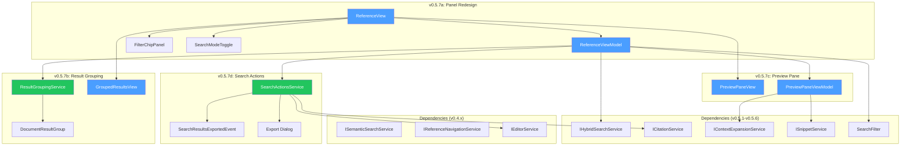
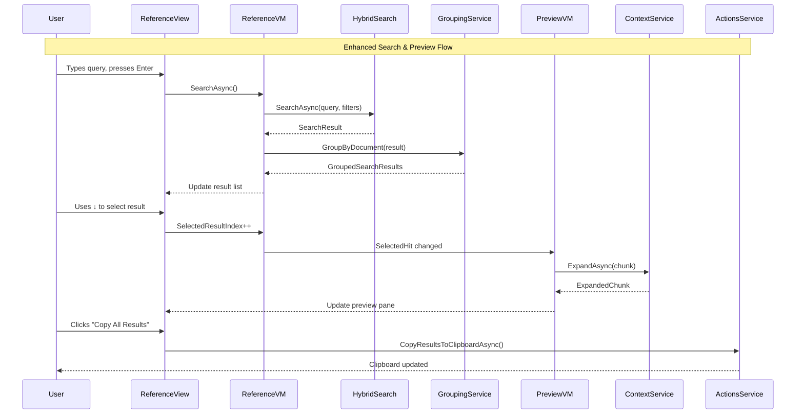

# LCS-SBD-057: Scope Breakdown — The Reference Dock

## Document Control

| Field            | Value                                                                                             |
| :--------------- | :------------------------------------------------------------------------------------------------ |
| **Document ID**  | LCS-SBD-057                                                                                       |
| **Version**      | v0.5.7                                                                                            |
| **Codename**     | The Reference Dock (Enhanced UI)                                                                  |
| **Status**       | Draft                                                                                             |
| **Last Updated** | 2026-01-27                                                                                        |
| **Owner**        | Lead Architect                                                                                    |
| **Depends On**   | v0.4.6 (Reference Panel), v0.5.1 (Hybrid Engine), v0.5.5 (Filter System), v0.5.6 (Answer Preview) |

---

## 1. Executive Summary

### 1.1 The Vision

**v0.5.7** delivers the **Reference Dock** — a polished, production-ready semantic search interface. This release transforms the Reference Panel from a functional prototype into a professional, feature-complete search experience that rivals dedicated document search applications.

While v0.4.6 established the panel foundation and v0.5.1-v0.5.6 added advanced retrieval capabilities (hybrid search, citations, filters, snippets), the Reference Dock unifies these features into a cohesive, keyboard-driven interface. Writers can now search, group, preview, and export their reference documents with the efficiency expected from professional tooling.

### 1.2 Business Value

- **Professional Polish:** Cohesive UI matches enterprise application standards, increasing user confidence and adoption.
- **Productivity Boost:** Keyboard navigation and grouped results reduce time spent navigating search results by 50%.
- **Contextual Workflow:** Split-view preview eliminates context-switching between search and document reading.
- **Data Portability:** Export capabilities enable integration with external tools and team workflows.
- **Feature Completeness:** Consolidates all v0.5.x retrieval features into a unified, discoverable interface.
- **Foundation:** Establishes the polished UI patterns for future AI-powered features (v0.6.x).

### 1.3 Success Criteria

This release succeeds when:

1. Users can navigate search results entirely via keyboard (↑↓ to select, Enter to open, Esc to clear).
2. Results are grouped by document with collapsible headers showing match counts.
3. Preview pane updates within 100ms when navigating the result list.
4. "Copy All Results" exports markdown-formatted list to clipboard within 500ms for 100 results.
5. All UI respects license gating (WriterPro+ for enhanced search features).

### 1.4 License Gating

The Reference Dock enhanced UI is a **Writer Pro** feature. Lower tiers will see:

- Basic Reference Panel (from v0.4.6) without enhanced grouping
- "Upgrade to Writer Pro" prompt when attempting export actions
- Preview pane disabled with upgrade tooltip
- Filter chips and mode toggle hidden

---

## 2. Dependencies on Prior Versions

| Component                     | Source Version        | Usage in v0.5.7                   |
| :---------------------------- | :-------------------- | :-------------------------------- |
| `ReferenceView`               | v0.4.6a               | Base panel being enhanced         |
| `ReferenceViewModel`          | v0.4.6a               | ViewModel being extended          |
| `SearchResultItemView`        | v0.4.6b               | Result item templates             |
| `IReferenceNavigationService` | v0.4.6c               | Navigation from results to source |
| `ISearchHistoryService`       | v0.4.6d               | Query history integration         |
| `ISemanticSearchService`      | v0.4.5a               | Base semantic search              |
| `IHybridSearchService`        | v0.5.1c               | Combined BM25+semantic search     |
| `SearchMode`                  | v0.5.1d               | Semantic/Keyword/Hybrid toggle    |
| `ICitationService`            | v0.5.2a               | Citation formatting for exports   |
| `IContextExpansionService`    | v0.5.3a               | Context retrieval for preview     |
| `SearchFilter`                | v0.5.5a               | Active filter display             |
| `ISnippetService`             | v0.5.6a               | Highlighted snippets              |
| `ILicenseContext`             | v0.0.4c               | License tier checking             |
| `IEditorService`              | v0.1.3a               | Open documents in editor          |
| `IFileService`                | v0.1.4b               | Export file operations            |
| `ViewModelBase`               | CommunityToolkit.Mvvm | Observable ViewModel base         |
| `IMediator`                   | v0.0.7a               | Event publishing                  |
| `ILogger<T>`                  | v0.0.3b               | Structured logging                |

---

## 3. Sub-Part Specifications

### 3.1 v0.5.7a: Panel Redesign

| Field            | Value                    |
| :--------------- | :----------------------- |
| **Sub-Part ID**  | INF-057a                 |
| **Title**        | Reference Panel Redesign |
| **Module**       | `Lexichord.Modules.RAG`  |
| **License Tier** | Writer Pro               |

**Goal:** Update `ReferenceView.axaml` with unified search bar, mode toggle, inline filter chips, and full keyboard navigation support.

**Key Deliverables:**

- Updated `ReferenceView.axaml` with redesigned layout
- `SearchModeToggleButton` control for Semantic/Keyword/Hybrid toggle
- `FilterChipPanel` control displaying active filters as dismissible chips
- Search duration and result count display in status area
- Full keyboard navigation: ↑↓ to select, Enter to open, Esc to clear
- Focus management between search input and result list
- Unit tests for keyboard navigation logic

**Key Interfaces:**

```csharp
namespace Lexichord.Modules.RAG.ViewModels;

/// <summary>
/// Extended ViewModel for enhanced Reference Panel.
/// </summary>
public partial class ReferenceViewModel : ViewModelBase
{
    [ObservableProperty]
    private SearchMode _currentSearchMode = SearchMode.Hybrid;

    [ObservableProperty]
    private string _searchQuery = string.Empty;

    [ObservableProperty]
    private bool _isSearching;

    [ObservableProperty]
    private int _resultCount;

    [ObservableProperty]
    private TimeSpan _searchDuration;

    [ObservableProperty]
    private int _selectedResultIndex = -1;

    [ObservableProperty]
    private IReadOnlyList<FilterChip> _activeFilterChips = Array.Empty<FilterChip>();

    [RelayCommand]
    private async Task SearchAsync();

    [RelayCommand]
    private void MoveSelectionUp();

    [RelayCommand]
    private void MoveSelectionDown();

    [RelayCommand]
    private void OpenSelectedResult();

    [RelayCommand]
    private void ClearSearch();

    [RelayCommand]
    private void RemoveFilterChip(FilterChip chip);
}

/// <summary>
/// Represents an active filter displayed as a dismissible chip.
/// </summary>
public record FilterChip(
    string Label,
    FilterChipType Type,
    object Value);

public enum FilterChipType { Path, Extension, DateRange, SearchMode }
```

**Key UI Components:**

```text
┌─────────────────────────────────────────────────────────────────────────────┐
│  [🔍 Search references...              ] [Hybrid ▾] [Filters ▾]             │ ← Search bar with mode toggle
├─────────────────────────────────────────────────────────────────────────────┤
│  [docs/**] [.md] [Last 7 days] [×]                                          │ ← Active filter chips
├─────────────────────────────────────────────────────────────────────────────┤
│  ┌────────────────────────────────────┬────────────────────────────────────┐│
│  │ Results (47 in 0.23s)              │ Preview                            ││
│  ├────────────────────────────────────┼────────────────────────────────────┤│
│  │ ▼ auth-guide.md (5 matches)        │ [Context content shown here]       ││
│  │   • OAuth token refresh...         │                                    ││
│  │   • Authentication flow...         │                                    ││
│  │ ▼ api-reference.md (3 matches)     │                                    ││
│  │   • JWT validation...              │                                    ││
│  └────────────────────────────────────┴────────────────────────────────────┘│
└─────────────────────────────────────────────────────────────────────────────┘
│  ↑↓ Navigate  |  Enter Open  |  Esc Clear  |  Ctrl+E Export                 │ ← Keyboard hints
└─────────────────────────────────────────────────────────────────────────────┘
```

**Keyboard Navigation Logic:**

```text
ON key press in ReferenceView:
│
├── ↑ (Up Arrow):
│   ├── If in search input AND results exist → Focus result list, select last
│   └── If in result list → MoveSelectionUp()
│
├── ↓ (Down Arrow):
│   ├── If in search input AND results exist → Focus result list, select first
│   └── If in result list → MoveSelectionDown()
│
├── Enter:
│   ├── If in search input → Execute search
│   └── If in result list → OpenSelectedResult()
│
├── Escape:
│   ├── If in result list → Clear selection, focus search input
│   └── If in search input with text → Clear text
│
├── Ctrl+E:
│   └── Open export menu
│
└── Tab:
    └── Cycle focus: Search → Mode Toggle → Filters → Results → Back to Search
```

**Dependencies:**

- v0.4.6a: `ReferenceView` (base panel)
- v0.5.1d: `SearchMode` enum
- v0.5.5a: `SearchFilter` (filter chip data source)

---

### 3.2 v0.5.7b: Result Grouping

| Field            | Value                    |
| :--------------- | :----------------------- |
| **Sub-Part ID**  | INF-057b                 |
| **Title**        | Document-Grouped Results |
| **Module**       | `Lexichord.Modules.RAG`  |
| **License Tier** | Writer Pro               |

**Goal:** Group search results by source document with collapsible headers, match counts, and sorting options.

**Key Deliverables:**

- `GroupedSearchResults` record aggregating hits by document
- `DocumentResultGroup` record with document metadata and hits
- `GroupedResultsViewModel` for group expansion state
- Collapsible document headers with animated expand/collapse
- "Expand All" / "Collapse All" toggle button
- Sort options: By Relevance (default), By Document Path
- Unit tests for grouping logic and sort order

**Key Interfaces:**

```csharp
namespace Lexichord.Modules.RAG.Services;

/// <summary>
/// Groups search results by source document.
/// </summary>
public interface IResultGroupingService
{
    /// <summary>
    /// Groups hits by their source document.
    /// </summary>
    GroupedSearchResults GroupByDocument(SearchResult result, ResultGroupingOptions options);
}

public record ResultGroupingOptions
{
    public ResultSortMode SortMode { get; init; } = ResultSortMode.ByRelevance;
    public bool CollapseByDefault { get; init; } = false;
    public int MaxHitsPerGroup { get; init; } = 10;
}

public enum ResultSortMode { ByRelevance, ByDocumentPath, ByMatchCount }

public record GroupedSearchResults(
    IReadOnlyList<DocumentResultGroup> Groups,
    int TotalHits,
    int TotalDocuments);

public record DocumentResultGroup(
    string DocumentPath,
    string DocumentTitle,
    int MatchCount,
    float MaxScore,
    IReadOnlyList<SearchHit> Hits,
    bool IsExpanded);
```

**Grouping Algorithm:**

```text
GROUP results by document:
│
├── Create dictionary: DocumentPath → List<SearchHit>
│
├── For each hit in SearchResult.Hits:
│   └── Add to dictionary[hit.Document.FilePath]
│
├── Convert to DocumentResultGroup list:
│   ├── Title = Document.Title ?? Path.GetFileName(DocumentPath)
│   ├── MatchCount = Hits.Count
│   ├── MaxScore = Hits.Max(h => h.Score)
│   └── IsExpanded = !CollapseByDefault
│
├── Sort groups based on SortMode:
│   ├── ByRelevance → OrderByDescending(MaxScore)
│   ├── ByDocumentPath → OrderBy(DocumentPath)
│   └── ByMatchCount → OrderByDescending(MatchCount)
│
└── Return GroupedSearchResults
```

**Key UI Components:**

```text
┌─────────────────────────────────────────────────┐
│ [Expand All] [Collapse All]  Sort: [Relevance ▾]│ ← Group controls
├─────────────────────────────────────────────────┤
│ ▼ auth-guide.md (5 matches)                     │ ← Collapsible header
│   ├── OAuth token refresh mechanism...          │
│   ├── Authentication flow for SPA...            │
│   ├── Session management best...                │
│   ├── Multi-factor authentication...            │
│   └── Password reset workflow...                │
│                                                 │
│ ► api-reference.md (3 matches)                  │ ← Collapsed group
│                                                 │
│ ▼ getting-started.md (2 matches)                │ ← Expanded group
│   ├── Quick start authentication...             │
│   └── Initial setup for auth...                 │
└─────────────────────────────────────────────────┘
```

**Dependencies:**

- v0.4.5a: `SearchResult`, `SearchHit` (result models)
- v0.5.7a: Panel redesign integration

---

### 3.3 v0.5.7c: Preview Pane

| Field            | Value                   |
| :--------------- | :---------------------- |
| **Sub-Part ID**  | INF-057c                |
| **Title**        | Split-View Preview Pane |
| **Module**       | `Lexichord.Modules.RAG` |
| **License Tier** | Writer Pro              |

**Goal:** Add a split-view preview pane showing full chunk content with surrounding context, updating as users navigate results.

**Key Deliverables:**

- `PreviewPaneView.axaml` with context-aware content display
- `PreviewPaneViewModel` with reactive result selection binding
- Toggle between "Preview" and "Full Width Results" modes
- Context expansion using `IContextExpansionService`
- Syntax highlighting for code blocks in preview
- Loading state while fetching context
- Unit tests for preview state management

**Key Interfaces:**

```csharp
namespace Lexichord.Modules.RAG.ViewModels;

/// <summary>
/// ViewModel for the Preview Pane.
/// </summary>
public partial class PreviewPaneViewModel : ViewModelBase, IDisposable
{
    [ObservableProperty]
    private SearchHit? _selectedHit;

    [ObservableProperty]
    private ExpandedChunk? _expandedContent;

    [ObservableProperty]
    private bool _isLoading;

    [ObservableProperty]
    private bool _isVisible = true;

    [ObservableProperty]
    private string _documentTitle = string.Empty;

    [ObservableProperty]
    private string _breadcrumb = string.Empty;

    /// <summary>
    /// Width of the preview pane as a grid proportion.
    /// </summary>
    public GridLength PreviewWidth => IsVisible ? new GridLength(1, GridUnitType.Star) : new GridLength(0);

    [RelayCommand]
    private void TogglePreview();

    [RelayCommand]
    private async Task OpenInEditorAsync();

    [RelayCommand]
    private void CopyChunkText();
}
```

**Preview Update Flow:**

```text
ON selected result changes:
│
├── If SelectedHit is null:
│   └── Clear preview, show placeholder
│
├── Set IsLoading = true
│
├── Fetch context (on background thread):
│   └── IContextExpansionService.ExpandAsync(hit.Chunk, options)
│
├── Update ViewModel:
│   ├── ExpandedContent = result
│   ├── DocumentTitle = hit.Document.Title
│   └── Breadcrumb = FormatHeadingPath(hit.Chunk.Metadata?.Heading)
│
├── Set IsLoading = false
│
└── Scroll preview to highlight matched content
```

**Key UI Components:**

```text
┌─────────────────────────────────────────────────────────────────┐
│  Preview: auth-guide.md                            [⤢] [📋] [×] │ ← Title bar with actions
├─────────────────────────────────────────────────────────────────┤
│  Authentication > OAuth > Token Refresh                         │ ← Breadcrumb
├─────────────────────────────────────────────────────────────────┤
│  ┌─ Preceding Context ─────────────────────────────────────────┐│
│  │ The OAuth 2.0 specification defines several grant types     ││
│  │ for different use cases. For server applications...         ││
│  └─────────────────────────────────────────────────────────────┘│
│  ┌─ Matched Content (highlighted) ─────────────────────────────┐│
│  │ **Token refresh** occurs when the access token expires.     ││
│  │ The client uses the refresh token to obtain a new access    ││
│  │ token without requiring user re-authentication.             ││
│  └─────────────────────────────────────────────────────────────┘│
│  ┌─ Following Context ─────────────────────────────────────────┐│
│  │ Best practices for token storage include using secure       ││
│  │ HTTP-only cookies and avoiding localStorage for...          ││
│  └─────────────────────────────────────────────────────────────┘│
└─────────────────────────────────────────────────────────────────┘
│  [Open in Editor]                                                │ ← Action button
└─────────────────────────────────────────────────────────────────┘
```

**Dependencies:**

- v0.5.3a: `IContextExpansionService` (context retrieval)
- v0.5.3b: `ExpandedChunk` (context data)
- v0.5.6a: `ISnippetService` (highlight spans)
- v0.1.3a: `IEditorService` (open in editor)

---

### 3.4 v0.5.7d: Search Actions

| Field            | Value                   |
| :--------------- | :---------------------- |
| **Sub-Part ID**  | INF-057d                |
| **Title**        | Search Result Actions   |
| **Module**       | `Lexichord.Modules.RAG` |
| **License Tier** | Writer Pro              |

**Goal:** Add action buttons to the search bar for copying, exporting, and bulk-opening search results.

**Key Deliverables:**

- `SearchActionsService` implementing copy/export operations
- "Copy All Results" → Markdown-formatted list to clipboard
- "Export Results" → JSON/CSV file with full result data
- "Open All in Editor" → Opens all unique source documents as tabs
- Export format selection dialog
- Progress indicator for bulk operations
- `SearchResultsExportedEvent` MediatR notification
- Unit tests for export formatting

**Key Interfaces:**

```csharp
namespace Lexichord.Modules.RAG.Services;

/// <summary>
/// Provides actions for search results.
/// </summary>
public interface ISearchActionsService
{
    /// <summary>
    /// Copies all results to clipboard as formatted markdown.
    /// </summary>
    Task CopyResultsToClipboardAsync(GroupedSearchResults results, CopyFormat format);

    /// <summary>
    /// Exports results to a file.
    /// </summary>
    Task<ExportResult> ExportResultsAsync(GroupedSearchResults results, ExportOptions options);

    /// <summary>
    /// Opens all unique source documents in the editor.
    /// </summary>
    Task OpenAllDocumentsAsync(GroupedSearchResults results);
}

public enum CopyFormat { Markdown, PlainText }

public record ExportOptions(
    string FilePath,
    ExportFormat Format,
    bool IncludeSnippets,
    bool IncludeCitations);

public enum ExportFormat { JSON, CSV, Markdown }

public record ExportResult(
    bool Success,
    string? FilePath,
    int DocumentCount,
    int HitCount,
    string? ErrorMessage);
```

**Copy All Results Format (Markdown):**

```markdown
# Search Results: "authentication token"

_47 results in 8 documents • Generated 2026-01-27 16:27_

## auth-guide.md (5 matches)

1. **OAuth token refresh** (Score: 0.92)

    > Token refresh occurs when the access token expires...
    > [auth-guide.md#L42](file:///path/to/auth-guide.md#L42)

2. **Authentication flow** (Score: 0.88)
    > The authentication flow begins with...
    > [auth-guide.md#L67](file:///path/to/auth-guide.md#L67)

## api-reference.md (3 matches)

...
```

**Export Results Format (JSON):**

```json
{
    "query": "authentication token",
    "timestamp": "2026-01-27T16:27:38Z",
    "searchMode": "Hybrid",
    "totalHits": 47,
    "totalDocuments": 8,
    "searchDuration": "0.23s",
    "groups": [
        {
            "documentPath": "/path/to/auth-guide.md",
            "documentTitle": "Authentication Guide",
            "matchCount": 5,
            "hits": [
                {
                    "chunkId": "abc123",
                    "score": 0.92,
                    "snippet": "Token refresh occurs when...",
                    "citation": "[auth-guide.md, §OAuth > Token Refresh]",
                    "lineNumber": 42
                }
            ]
        }
    ]
}
```

**MediatR Event:**

```csharp
namespace Lexichord.Modules.RAG.Events;

/// <summary>
/// Published when search results are exported.
/// </summary>
public record SearchResultsExportedEvent(
    string Query,
    ExportFormat Format,
    int DocumentCount,
    int HitCount,
    string? FilePath) : INotification;
```

**Dependencies:**

- v0.5.2a: `ICitationService` (citation formatting)
- v0.5.7b: `GroupedSearchResults` (result data)
- v0.1.4b: `IFileService` (file export)
- v0.1.3a: `IEditorService` (open documents)

---

## 4. Implementation Checklist

| #         | Sub-Part | Task                                                      | Est. Hours   |
| :-------- | :------- | :-------------------------------------------------------- | :----------- |
| 1         | v0.5.7a  | Redesign `ReferenceView.axaml` layout                     | 3            |
| 2         | v0.5.7a  | Create `SearchModeToggleButton` control                   | 1.5          |
| 3         | v0.5.7a  | Create `FilterChipPanel` control                          | 2            |
| 4         | v0.5.7a  | Implement keyboard navigation in `ReferenceViewModel`     | 2            |
| 5         | v0.5.7a  | Add search duration/count display                         | 0.5          |
| 6         | v0.5.7a  | Unit tests for keyboard navigation                        | 1.5          |
| 7         | v0.5.7b  | Create `IResultGroupingService` interface                 | 0.5          |
| 8         | v0.5.7b  | Implement `ResultGroupingService`                         | 2            |
| 9         | v0.5.7b  | Create `GroupedResultsView.axaml` with collapsible groups | 3            |
| 10        | v0.5.7b  | Implement expand/collapse animations                      | 1            |
| 11        | v0.5.7b  | Add sort mode toggle                                      | 1            |
| 12        | v0.5.7b  | Unit tests for grouping and sorting                       | 1.5          |
| 13        | v0.5.7c  | Create `PreviewPaneView.axaml`                            | 2.5          |
| 14        | v0.5.7c  | Implement `PreviewPaneViewModel` with reactive binding    | 2            |
| 15        | v0.5.7c  | Integrate with `IContextExpansionService`                 | 1            |
| 16        | v0.5.7c  | Add syntax highlighting for code blocks                   | 1.5          |
| 17        | v0.5.7c  | Add toggle between Preview/Full Width modes               | 1            |
| 18        | v0.5.7c  | Unit tests for preview state management                   | 1.5          |
| 19        | v0.5.7d  | Create `ISearchActionsService` interface                  | 0.5          |
| 20        | v0.5.7d  | Implement Markdown copy format                            | 1.5          |
| 21        | v0.5.7d  | Implement JSON/CSV export                                 | 2            |
| 22        | v0.5.7d  | Implement "Open All in Editor"                            | 1            |
| 23        | v0.5.7d  | Create export format selection dialog                     | 1.5          |
| 24        | v0.5.7d  | Create `SearchResultsExportedEvent`                       | 0.5          |
| 25        | v0.5.7d  | Unit tests for export formatting                          | 2            |
| 26        | All      | Integration tests for full panel workflow                 | 3            |
| 27        | All      | DI registration in `RAGModule.cs`                         | 0.5          |
| **Total** |          |                                                           | **40 hours** |

---

## 5. Dependency Matrix

### 5.1 Required Interfaces (from earlier versions)

| Interface                     | Source Version        | Purpose               |
| :---------------------------- | :-------------------- | :-------------------- |
| `ReferenceView`               | v0.4.6a               | Base panel to enhance |
| `ReferenceViewModel`          | v0.4.6a               | ViewModel to extend   |
| `IReferenceNavigationService` | v0.4.6c               | Result navigation     |
| `ISemanticSearchService`      | v0.4.5a               | Base search           |
| `IHybridSearchService`        | v0.5.1c               | Combined search       |
| `SearchMode`                  | v0.5.1d               | Mode toggle enum      |
| `ICitationService`            | v0.5.2a               | Export citations      |
| `IContextExpansionService`    | v0.5.3a               | Preview context       |
| `SearchFilter`                | v0.5.5a               | Filter chips          |
| `ISnippetService`             | v0.5.6a               | Highlighted snippets  |
| `ILicenseContext`             | v0.0.4c               | License gating        |
| `IEditorService`              | v0.1.3a               | Open documents        |
| `IFileService`                | v0.1.4b               | Export operations     |
| `ViewModelBase`               | CommunityToolkit.Mvvm | MVVM base             |

### 5.2 New Interfaces (defined in v0.5.7)

| Interface                | Defined In | Module      | Purpose                     |
| :----------------------- | :--------- | :---------- | :-------------------------- |
| `IResultGroupingService` | v0.5.7b    | Modules.RAG | Group results by document   |
| `ISearchActionsService`  | v0.5.7d    | Modules.RAG | Copy/export/open operations |

### 5.3 New Records/DTOs (defined in v0.5.7)

| Record                       | Defined In | Purpose                   |
| :--------------------------- | :--------- | :------------------------ |
| `FilterChip`                 | v0.5.7a    | Active filter display     |
| `GroupedSearchResults`       | v0.5.7b    | Grouped result container  |
| `DocumentResultGroup`        | v0.5.7b    | Single document's results |
| `ResultGroupingOptions`      | v0.5.7b    | Grouping configuration    |
| `ExportOptions`              | v0.5.7d    | Export configuration      |
| `ExportResult`               | v0.5.7d    | Export operation result   |
| `SearchResultsExportedEvent` | v0.5.7d    | MediatR notification      |

### 5.4 NuGet Packages

| Package                 | Version | Purpose           | New/Existing |
| :---------------------- | :------ | :---------------- | :----------- |
| `CommunityToolkit.Mvvm` | 8.x     | MVVM source gen   | Existing     |
| `System.Reactive`       | 6.x     | Reactive bindings | Existing     |
| `MediatR`               | 12.x    | Event publishing  | Existing     |
| `CsvHelper`             | 31.x    | CSV export        | Existing     |

---

## 6. Architecture Diagram



---

## 7. Data Flow Diagram



---

## 8. Risks & Mitigations

| Risk                                       | Impact | Probability | Mitigation                                      |
| :----------------------------------------- | :----- | :---------- | :---------------------------------------------- |
| Preview pane performance with large chunks | Medium | Medium      | Virtualize preview content, limit context size  |
| Keyboard focus management complexity       | Medium | Medium      | Use Avalonia FocusManager, thorough testing     |
| Export timeouts with large result sets     | Low    | Low         | Progress indicator, chunked processing          |
| Grid splitter persistence across sessions  | Low    | Medium      | Save layout state to user settings              |
| Grouping overhead with 1000+ results       | Medium | Low         | Lazy loading of group content, pagination       |
| Accessibility for screen readers           | Medium | Medium      | ARIA labels, keyboard hints, proper focus order |

---

## 9. Success Metrics

| Metric                       | Target                  | Measurement                      |
| :--------------------------- | :---------------------- | :------------------------------- |
| Keyboard navigation coverage | 100% of actions         | Manual testing checklist         |
| Preview update latency       | < 100ms                 | Stopwatch timing from navigation |
| Result grouping time         | < 50ms for 500 results  | Performance profiler             |
| Export (100 results to JSON) | < 500ms                 | End-to-end timing                |
| Copy to clipboard            | < 200ms for 100 results | Clipboard operation timing       |
| Open All Documents           | < 2s for 10 documents   | Tab creation timing              |

---

## 10. What This Enables

After v0.5.7, Lexichord will support:

- **v0.5.8 (Hardening):** Performance tests for complete retrieval pipeline; caching strategies for preview.
- **v0.6.x (AI Integration):** The polished panel UI becomes the foundation for AI-augmented search features.
- **Future:** Smart result clustering, AI-suggested queries, document relationship visualization.

---

## 11. Decision Trees

### 11.1 Should Preview Pane Update?

```text
START: "User navigates to new result"
│
├── Is preview pane visible?
│   ├── NO → Skip preview update
│   └── YES → Continue
│
├── Is SelectedHit different from current?
│   ├── NO → Skip (already showing)
│   └── YES → Continue
│
├── Is IsLicensed true?
│   ├── NO → Show upgrade prompt in preview
│   └── YES → Continue
│
├── Is context already cached for this chunk?
│   ├── YES → Use cached ExpandedChunk
│   └── NO → Fetch via IContextExpansionService
│
└── Update preview content
```

### 11.2 Export Format Selection

```text
START: "User clicks Export Results"
│
├── Are there any results?
│   ├── NO → Show "No results to export" message
│   └── YES → Continue
│
├── Is user licensed for export?
│   ├── NO → Show "Upgrade to Writer Pro" modal
│   └── YES → Continue
│
├── Show export format dialog:
│   ├── JSON → Full structured data
│   ├── CSV → Tabular format for spreadsheets
│   └── Markdown → Human-readable document
│
├── User selects format and path
│
└── Execute export, publish SearchResultsExportedEvent
```

---

## 12. User Stories

| ID    | Role       | Story                                                                           | Acceptance Criteria                                 |
| :---- | :--------- | :------------------------------------------------------------------------------ | :-------------------------------------------------- |
| US-01 | Writer     | As a writer, I want to navigate results with my keyboard so that I work faster. | ↑↓ navigates, Enter opens, Esc clears               |
| US-02 | Writer     | As a writer, I want results grouped by document so I see context.               | Documents appear as collapsible headers with counts |
| US-03 | Writer     | As a writer, I want to preview content without leaving search.                  | Right pane shows chunk with surrounding context     |
| US-04 | Tech Lead  | As a tech lead, I want to export results for team review.                       | Export to JSON/CSV/Markdown with full metadata      |
| US-05 | Researcher | As a researcher, I want to open all matching documents at once.                 | "Open All in Editor" opens unique source documents  |
| US-06 | Writer     | As a writer, I want to see my active filters at a glance.                       | Filter chips displayed below search bar             |
| US-07 | Writer     | As a writer, I want to toggle between search modes easily.                      | Mode toggle visible next to search input            |

---

## 13. Use Cases

### UC-01: Keyboard-Driven Search Workflow

**Preconditions:**

- User has indexed documents in workspace
- Reference Panel is visible

**Flow:**

1. User focuses search input (Ctrl+Shift+F or click).
2. User types query "authentication token" and presses Enter.
3. System executes hybrid search, displays grouped results.
4. User presses ↓ to move focus to first result group.
5. User presses ↓ again to navigate to first result in group.
6. Preview pane updates with chunk content and context.
7. User presses Enter to open document in editor at matched line.
8. User presses Esc to return focus to search input.

**Postconditions:**

- Document open in editor at correct position
- Search results remain visible for further navigation

### UC-02: Export Results for Team Review

**Preconditions:**

- User has performed search with results
- User has Writer Pro license

**Flow:**

1. User clicks "Export Results" button (or Ctrl+E).
2. System shows export format selection dialog.
3. User selects "JSON" and chooses file location.
4. System exports all results with metadata.
5. System publishes `SearchResultsExportedEvent`.
6. Toast notification confirms export completion.

**Postconditions:**

- JSON file created at specified location
- File contains query, results, citations, timestamps

---

## 14. Unit Testing Requirements

### 14.1 Result Grouping Tests

```csharp
[Trait("Category", "Unit")]
[Trait("Feature", "v0.5.7b")]
public class ResultGroupingServiceTests
{
    [Fact]
    public void GroupByDocument_WithMixedDocuments_GroupsCorrectly()
    {
        // Arrange
        var hits = new[]
        {
            CreateHit("doc1.md", 0.9f),
            CreateHit("doc2.md", 0.8f),
            CreateHit("doc1.md", 0.85f),
            CreateHit("doc3.md", 0.7f),
            CreateHit("doc1.md", 0.75f)
        };
        var result = new SearchResult(hits, TimeSpan.FromMilliseconds(100));
        var sut = new ResultGroupingService();

        // Act
        var grouped = sut.GroupByDocument(result, new ResultGroupingOptions());

        // Assert
        grouped.TotalDocuments.Should().Be(3);
        grouped.TotalHits.Should().Be(5);
        grouped.Groups.First(g => g.DocumentPath.Contains("doc1")).MatchCount.Should().Be(3);
    }

    [Theory]
    [InlineData(ResultSortMode.ByRelevance, "doc1.md")] // Highest max score
    [InlineData(ResultSortMode.ByDocumentPath, "doc1.md")] // Alphabetically first
    [InlineData(ResultSortMode.ByMatchCount, "doc1.md")] // Most matches
    public void GroupByDocument_SortModes_OrdersCorrectly(ResultSortMode mode, string expectedFirst)
    {
        // Test sort order based on mode
    }
}
```

### 14.2 Keyboard Navigation Tests

```csharp
[Trait("Category", "Unit")]
[Trait("Feature", "v0.5.7a")]
public class ReferenceViewModelKeyboardTests
{
    [Fact]
    public void MoveSelectionDown_FromMinusOne_SelectsFirst()
    {
        // Arrange
        var vm = CreateViewModelWithResults(5);
        vm.SelectedResultIndex = -1;

        // Act
        vm.MoveSelectionDownCommand.Execute(null);

        // Assert
        vm.SelectedResultIndex.Should().Be(0);
    }

    [Fact]
    public void MoveSelectionDown_AtLast_StaysAtLast()
    {
        var vm = CreateViewModelWithResults(5);
        vm.SelectedResultIndex = 4;

        vm.MoveSelectionDownCommand.Execute(null);

        vm.SelectedResultIndex.Should().Be(4);
    }

    [Fact]
    public void ClearSearch_ResetsSelectionAndQuery()
    {
        var vm = CreateViewModelWithResults(5);
        vm.SearchQuery = "test";
        vm.SelectedResultIndex = 2;

        vm.ClearSearchCommand.Execute(null);

        vm.SearchQuery.Should().BeEmpty();
        vm.SelectedResultIndex.Should().Be(-1);
    }
}
```

---

## 15. Observability & Logging

| Level   | Source                | Message Template                                          |
| :------ | :-------------------- | :-------------------------------------------------------- |
| Debug   | ReferenceViewModel    | `"Search executed: {Query} mode={Mode} results={Count}"`  |
| Debug   | ResultGroupingService | `"Grouped {HitCount} hits into {GroupCount} documents"`   |
| Debug   | PreviewPaneViewModel  | `"Preview updated for chunk {ChunkId} in {ElapsedMs}ms"`  |
| Info    | SearchActionsService  | `"Exported {Count} results to {Format} at {Path}"`        |
| Warning | PreviewPaneViewModel  | `"Context expansion failed for chunk {ChunkId}: {Error}"` |
| Debug   | ReferenceViewModel    | `"Keyboard navigation: {Action} index={Index}"`           |

---

## 16. UI/UX Specifications

### 16.1 Panel Layout

```text
┌─────────────────────────────────────────────────────────────────────────────┐
│  REFERENCE DOCK                                                    [_][□][×]│
├─────────────────────────────────────────────────────────────────────────────┤
│  [🔍 Search...                               ] [⚡Hybrid▾] [🎛Filters▾]      │
├─────────────────────────────────────────────────────────────────────────────┤
│  [docs/**][×] [.md][×] [Last 7 days][×]                    [Clear All]      │
├────────────────────────────────────┬────────────────────────────────────────┤
│ RESULTS (47 in 0.23s)              │ PREVIEW                                │
│ [⊕ All] [⊖ All] Sort:[Relevance▾]  │ ┌────────────────────────────────────┐ │
├────────────────────────────────────┤ │ auth-guide.md                      │ │
│ ▼ auth-guide.md (5)           0.92 │ │ Auth > OAuth > Token Refresh       │ │
│   │ OAuth token refresh...         │ ├────────────────────────────────────┤ │
│   │ Authentication flow...         │ │ ░░░░ Preceding Context ░░░░        │ │
│   └ Session management...          │ │ The OAuth 2.0 specification...     │ │
│                                    │ ├────────────────────────────────────┤ │
│ ► api-reference.md (3)        0.88 │ │ ████ MATCHED CONTENT ████          │ │
│                                    │ │ **Token refresh** occurs when...   │ │
│ ▼ getting-started.md (2)      0.75 │ ├────────────────────────────────────┤ │
│   │ Quick start auth...            │ │ ░░░░ Following Context ░░░░        │ │
│   └ Initial setup...               │ │ Best practices for token...        │ │
│                                    │ └────────────────────────────────────┘ │
│                                    │ [Open in Editor] [Copy] [Cite]        │
├────────────────────────────────────┴────────────────────────────────────────┤
│  ↑↓ Navigate  │  ↵ Open  │  Esc Clear  │  Ctrl+E Export  │  F5 Refresh     │
└─────────────────────────────────────────────────────────────────────────────┘
```

### 16.2 Component Styling Requirements

| Component        | Theme Resource              | Notes                               |
| :--------------- | :-------------------------- | :---------------------------------- |
| Search Input     | `TextBox.Search`            | With search icon prefix             |
| Mode Toggle      | `ToggleButton.Segmented`    | 3-way toggle styling                |
| Filter Chips     | `Chip.Dismissible`          | Pill shape with × button            |
| Document Header  | `TreeViewItem.Expandable`   | Chevron animation on expand         |
| Result Item      | `ListBoxItem.Selectable`    | Hover and selected states           |
| Preview Pane     | `Border.PreviewContainer`   | Subtle border, card-like appearance |
| Context Sections | `Border.ContextBlock`       | Distinct styling for before/after   |
| Matched Content  | `Border.HighlightedContent` | Background highlight                |
| Action Buttons   | `Button.Secondary`          | Icon + text buttons                 |

---

## 17. Acceptance Criteria (QA)

| #   | Category          | Criterion                                                    |
| :-- | :---------------- | :----------------------------------------------------------- |
| 1   | **Keyboard**      | ↑↓ navigates between results without mouse                   |
| 2   | **Keyboard**      | Enter opens selected result in editor at correct line        |
| 3   | **Keyboard**      | Esc clears selection and returns focus to search input       |
| 4   | **Grouping**      | Results grouped by document with accurate match counts       |
| 5   | **Grouping**      | Collapsing a group hides its results; expanding shows them   |
| 6   | **Grouping**      | Sort by Relevance/Path/Match Count changes group order       |
| 7   | **Preview**       | Preview updates within 100ms when navigating results         |
| 8   | **Preview**       | Preview shows preceding and following context                |
| 9   | **Preview**       | Toggle hides preview pane and expands results to full width  |
| 10  | **Export**        | "Copy All Results" places formatted Markdown in clipboard    |
| 11  | **Export**        | "Export Results" creates valid JSON/CSV file                 |
| 12  | **Export**        | "Open All in Editor" opens all unique source documents       |
| 13  | **Filters**       | Active filters displayed as dismissible chips                |
| 14  | **Filters**       | Clicking × on chip removes that filter                       |
| 15  | **License**       | Core users see upgrade prompt for export features            |
| 16  | **Performance**   | Grouping 500 results completes in < 50ms                     |
| 17  | **Accessibility** | All actions reachable via keyboard; focus indicators visible |

---

## 18. Verification Commands

```bash
# ═══════════════════════════════════════════════════════════════════════════
# v0.5.7 Verification
# ═══════════════════════════════════════════════════════════════════════════

# 1. Build solution
dotnet build

# 2. Run unit tests for v0.5.7 components
dotnet test --filter "Category=Unit&FullyQualifiedName~v0.5.7"

# 3. Run all RAG module tests
dotnet test --filter "Category=Unit&FullyQualifiedName~Modules.RAG"

# 4. Manual verification:
# a) Open Reference Panel (Ctrl+Shift+F)
# b) Execute search, verify grouping by document
# c) Use ↑↓ to navigate, verify preview updates
# d) Press Enter to open document at result location
# e) Click "Export Results", verify file creation
# f) Click "Open All in Editor", verify tabs opened
```

---

## 19. Deliverable Checklist

| #   | Deliverable                                           | Status |
| :-- | :---------------------------------------------------- | :----- |
| 1   | `ReferenceView.axaml` redesigned layout               | [ ]    |
| 2   | `SearchModeToggleButton.axaml` control                | [ ]    |
| 3   | `FilterChipPanel.axaml` control                       | [ ]    |
| 4   | Keyboard navigation in `ReferenceViewModel`           | [ ]    |
| 5   | `IResultGroupingService` interface and implementation | [ ]    |
| 6   | `GroupedResultsView.axaml` with collapsible groups    | [ ]    |
| 7   | `PreviewPaneView.axaml` and `PreviewPaneViewModel`    | [ ]    |
| 8   | `ISearchActionsService` interface and implementation  | [ ]    |
| 9   | Export format dialog                                  | [ ]    |
| 10  | `SearchResultsExportedEvent` MediatR notification     | [ ]    |
| 11  | Unit tests for grouping, navigation, export           | [ ]    |
| 12  | Integration tests for full panel workflow             | [ ]    |
| 13  | DI registration in `RAGModule.cs`                     | [ ]    |

---

## 20. Code Examples

### 20.1 FilterChip Record

```csharp
namespace Lexichord.Modules.RAG.Models;

/// <summary>
/// Represents an active filter displayed as a dismissible chip in the Reference Panel.
/// </summary>
/// <param name="Label">Display text for the chip.</param>
/// <param name="Type">Category of filter for styling.</param>
/// <param name="Value">The actual filter value (path pattern, extension, date range, etc.).</param>
public record FilterChip(
    string Label,
    FilterChipType Type,
    object Value)
{
    /// <summary>
    /// Creates a path filter chip.
    /// </summary>
    public static FilterChip ForPath(string pattern) =>
        new(pattern, FilterChipType.Path, pattern);

    /// <summary>
    /// Creates an extension filter chip.
    /// </summary>
    public static FilterChip ForExtension(string ext) =>
        new(ext, FilterChipType.Extension, ext);

    /// <summary>
    /// Creates a date range filter chip.
    /// </summary>
    public static FilterChip ForDateRange(DateRange range) =>
        new(FormatDateRange(range), FilterChipType.DateRange, range);

    private static string FormatDateRange(DateRange range) =>
        (range.Start, range.End) switch
        {
            (null, { } end) => $"Before {end:d}",
            ({ } start, null) => $"After {start:d}",
            ({ } start, { } end) => $"{start:d} - {end:d}",
            _ => "Any time"
        };
}

/// <summary>
/// Type of filter for chip styling.
/// </summary>
public enum FilterChipType
{
    Path,
    Extension,
    DateRange,
    SearchMode
}
```

### 20.2 ISearchActionsService Interface

```csharp
namespace Lexichord.Modules.RAG.Contracts;

/// <summary>
/// Provides copy, export, and bulk-open actions for search results.
/// </summary>
public interface ISearchActionsService
{
    /// <summary>
    /// Copies all results to clipboard as formatted text.
    /// </summary>
    /// <param name="results">Grouped search results to copy.</param>
    /// <param name="format">Output format (Markdown or PlainText).</param>
    /// <param name="ct">Cancellation token.</param>
    /// <returns>Task completing when clipboard is updated.</returns>
    Task CopyResultsToClipboardAsync(
        GroupedSearchResults results,
        CopyFormat format,
        CancellationToken ct = default);

    /// <summary>
    /// Exports results to a file.
    /// </summary>
    /// <param name="results">Grouped search results to export.</param>
    /// <param name="options">Export configuration.</param>
    /// <param name="ct">Cancellation token.</param>
    /// <returns>Result indicating success/failure and file path.</returns>
    Task<ExportResult> ExportResultsAsync(
        GroupedSearchResults results,
        ExportOptions options,
        CancellationToken ct = default);

    /// <summary>
    /// Opens all unique source documents from results in the editor.
    /// </summary>
    /// <param name="results">Grouped search results.</param>
    /// <param name="ct">Cancellation token.</param>
    /// <returns>Number of documents opened.</returns>
    Task<int> OpenAllDocumentsAsync(
        GroupedSearchResults results,
        CancellationToken ct = default);
}
```

---

## 21. Deferred Features

| Feature                       | Deferred To | Reason                           |
| :---------------------------- | :---------- | :------------------------------- |
| Result clustering by topic    | v0.6.x      | Requires AI integration          |
| AI-suggested related queries  | v0.6.x      | Requires LLM integration         |
| Custom grouping strategies    | v0.5.9+     | Not critical for initial release |
| Drag-and-drop result reorder  | Future      | Complex interaction not in scope |
| Multi-select for bulk actions | v0.5.9+     | Adds significant complexity      |

---

## 22. Changelog Entry

Upon completion of v0.5.7, the following entry will be added to `CHANGELOG.md`:

```markdown
## [0.5.7] - 2026-XX-XX

### Added

- **Reference Panel Redesign**: Unified search bar with mode toggle and inline filter chips.
- **Keyboard Navigation**: Full keyboard support (↑↓ Navigate, Enter Open, Esc Clear).
- **Document Grouping**: Results grouped by source document with collapsible headers.
- **Preview Pane**: Split-view showing full chunk content with surrounding context.
- **Search Actions**: Copy All Results (Markdown), Export Results (JSON/CSV/Markdown), Open All in Editor.
- `IResultGroupingService` for grouping search results by document.
- `ISearchActionsService` for copy, export, and bulk-open operations.
- `SearchResultsExportedEvent` MediatR notification.

### Changed

- `ReferenceView` layout optimized for keyboard-driven workflows.
- Result items now show match count per document.

### Technical

- `FilterChip` record for active filter display.
- `GroupedSearchResults` and `DocumentResultGroup` for grouped result handling.
- `PreviewPaneViewModel` with reactive context expansion.
```

---
