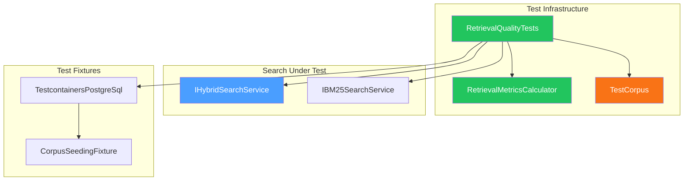
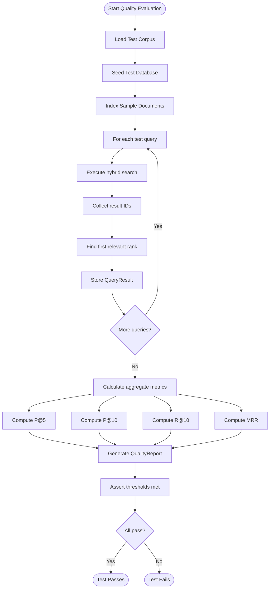

# LCS-DES-058a: Retrieval Quality Tests

## 1. Metadata

| Field               | Value                                       |
| :------------------ | :------------------------------------------ |
| **Document ID**     | LCS-DES-058a                                |
| **Feature ID**      | RAG-058a                                    |
| **Feature Name**    | Retrieval Quality Test Suite                |
| **Parent Document** | [LCS-DES-058-INDEX](./LCS-DES-058-INDEX.md) |
| **Target Version**  | v0.5.8a                                     |
| **Status**          | Draft                                       |
| **Last Updated**    | 2026-01-27                                  |

---

## 2. Executive Summary

### 2.1 Purpose

Create a curated test corpus with gold-standard expected results and automated quality metrics (Precision@K, Recall@K, MRR) to systematically measure and regress-test retrieval accuracy.

### 2.2 Scope

| In Scope                              | Out of Scope                   |
| :------------------------------------ | :----------------------------- |
| Create 50-query test corpus           | Production query analytics     |
| Implement quality metrics calculator  | Real-time quality monitoring   |
| Automated CI quality regression tests | User-facing quality dashboards |
| Baseline documentation                | A/B testing infrastructure     |

### 2.3 Key Deliverables

- 50 curated test queries with relevance judgments
- 20+ representative sample documents
- `IRetrievalMetricsCalculator` interface and implementation
- `RetrievalQualityTests` xUnit test class
- CI pipeline integration for automatic regression detection
- Baseline quality metrics documentation

---

## 3. Architecture

### 3.1 Component Diagram



### 3.2 File Structure

```text
tests/
└── Lexichord.Modules.RAG.Tests/
    ├── Corpus/
    │   ├── test-queries.json          # 50 queries with metadata
    │   ├── relevance-judgments.json   # Gold standard rankings
    │   └── test-documents/            # Sample documents
    │       ├── authentication-guide.md
    │       ├── api-reference.md
    │       ├── deployment-guide.md
    │       ├── database-schema.md
    │       ├── performance-tuning.md
    │       └── ... (15+ more documents)
    ├── Fixtures/
    │   ├── CorpusSeedingFixture.cs
    │   └── QualityTestFixture.cs
    ├── Quality/
    │   ├── IRetrievalMetricsCalculator.cs
    │   ├── RetrievalMetricsCalculator.cs
    │   └── RetrievalQualityTests.cs
    └── Models/
        ├── TestQuery.cs
        ├── RelevanceJudgment.cs
        └── QueryResult.cs
```

---

## 4. Data Contract

### 4.1 Test Corpus Schema

#### TestQuery Record

```csharp
namespace Lexichord.Modules.RAG.Tests.Models;

/// <summary>
/// Represents a single test query with expected results.
/// </summary>
/// <param name="Id">Unique query identifier.</param>
/// <param name="Query">The natural language query string.</param>
/// <param name="Category">Query category for analysis (e.g., "factual", "conceptual").</param>
/// <param name="Difficulty">Difficulty level: easy, medium, hard.</param>
/// <param name="Description">Human-readable description of query intent.</param>
public record TestQuery(
    string Id,
    string Query,
    string Category,
    string Difficulty,
    string Description);
```

#### RelevanceJudgment Record

```csharp
namespace Lexichord.Modules.RAG.Tests.Models;

/// <summary>
/// Associates queries with relevant document chunks.
/// </summary>
/// <param name="QueryId">Reference to TestQuery.Id.</param>
/// <param name="RelevantChunkIds">Ordered list of relevant chunk IDs (most relevant first).</param>
/// <param name="PrimaryRelevant">The single most relevant chunk ID.</param>
public record RelevanceJudgment(
    string QueryId,
    IReadOnlyList<Guid> RelevantChunkIds,
    Guid PrimaryRelevant);
```

#### QueryResult Record

```csharp
namespace Lexichord.Modules.RAG.Tests.Models;

/// <summary>
/// Result container for a single evaluated query.
/// </summary>
/// <param name="QueryId">Reference to TestQuery.Id.</param>
/// <param name="Query">The query string that was executed.</param>
/// <param name="RetrievedIds">IDs of chunks returned by search, in rank order.</param>
/// <param name="RelevantIds">IDs of chunks marked as relevant in ground truth.</param>
/// <param name="FirstRelevantRank">1-based rank of first relevant result (0 if none).</param>
/// <param name="Duration">Time taken to execute the search.</param>
public record QueryResult(
    string QueryId,
    string Query,
    IReadOnlyList<Guid> RetrievedIds,
    IReadOnlySet<Guid> RelevantIds,
    int FirstRelevantRank,
    TimeSpan Duration);
```

### 4.2 Interface: IRetrievalMetricsCalculator

```csharp
namespace Lexichord.Modules.RAG.Tests.Quality;

/// <summary>
/// Calculates standard information retrieval quality metrics.
/// </summary>
/// <remarks>
/// Implements Precision@K, Recall@K, and Mean Reciprocal Rank (MRR) as
/// defined in standard IR evaluation literature.
/// </remarks>
public interface IRetrievalMetricsCalculator
{
    /// <summary>
    /// Calculates Precision@K: the proportion of relevant results in top K.
    /// </summary>
    /// <param name="results">Retrieved result IDs in rank order.</param>
    /// <param name="relevant">Set of IDs marked as relevant.</param>
    /// <param name="k">Number of top results to consider.</param>
    /// <returns>Precision value between 0.0 and 1.0.</returns>
    /// <exception cref="ArgumentOutOfRangeException">If k is not positive.</exception>
    double PrecisionAtK(IReadOnlyList<Guid> results, IReadOnlySet<Guid> relevant, int k);

    /// <summary>
    /// Calculates Recall@K: the proportion of relevant items found in top K.
    /// </summary>
    /// <param name="results">Retrieved result IDs in rank order.</param>
    /// <param name="relevant">Set of IDs marked as relevant.</param>
    /// <param name="k">Number of top results to consider.</param>
    /// <returns>Recall value between 0.0 and 1.0.</returns>
    /// <exception cref="ArgumentOutOfRangeException">If k is not positive.</exception>
    double RecallAtK(IReadOnlyList<Guid> results, IReadOnlySet<Guid> relevant, int k);

    /// <summary>
    /// Calculates F1 Score at K: harmonic mean of Precision@K and Recall@K.
    /// </summary>
    /// <param name="results">Retrieved result IDs in rank order.</param>
    /// <param name="relevant">Set of IDs marked as relevant.</param>
    /// <param name="k">Number of top results to consider.</param>
    /// <returns>F1 value between 0.0 and 1.0.</returns>
    double F1AtK(IReadOnlyList<Guid> results, IReadOnlySet<Guid> relevant, int k);

    /// <summary>
    /// Calculates Mean Reciprocal Rank (MRR) across multiple queries.
    /// </summary>
    /// <param name="queryResults">Results for each evaluated query.</param>
    /// <returns>MRR value between 0.0 and 1.0.</returns>
    /// <remarks>
    /// MRR = (1/N) × Σ(1/rank_i) where rank_i is the rank of the first relevant result.
    /// </remarks>
    double MeanReciprocalRank(IReadOnlyList<QueryResult> queryResults);

    /// <summary>
    /// Calculates Normalized Discounted Cumulative Gain at K.
    /// </summary>
    /// <param name="results">Retrieved result IDs in rank order.</param>
    /// <param name="relevanceScores">Mapping of chunk ID to relevance score (0-3).</param>
    /// <param name="k">Number of top results to consider.</param>
    /// <returns>NDCG value between 0.0 and 1.0.</returns>
    double NdcgAtK(
        IReadOnlyList<Guid> results,
        IReadOnlyDictionary<Guid, int> relevanceScores,
        int k);

    /// <summary>
    /// Generates a comprehensive quality report for a set of queries.
    /// </summary>
    /// <param name="queryResults">Results for each evaluated query.</param>
    /// <returns>Aggregate metrics and per-query breakdown.</returns>
    QualityReport GenerateReport(IReadOnlyList<QueryResult> queryResults);
}

/// <summary>
/// Comprehensive retrieval quality report.
/// </summary>
/// <param name="TotalQueries">Number of queries evaluated.</param>
/// <param name="AveragePrecisionAt5">Average P@5 across all queries.</param>
/// <param name="AveragePrecisionAt10">Average P@10 across all queries.</param>
/// <param name="AverageRecallAt10">Average R@10 across all queries.</param>
/// <param name="Mrr">Mean Reciprocal Rank.</param>
/// <param name="QueriesWithNoRelevant">Count of queries where no relevant results were found.</param>
/// <param name="ByCategory">Metrics broken down by query category.</param>
/// <param name="ByDifficulty">Metrics broken down by difficulty level.</param>
public record QualityReport(
    int TotalQueries,
    double AveragePrecisionAt5,
    double AveragePrecisionAt10,
    double AverageRecallAt10,
    double Mrr,
    int QueriesWithNoRelevant,
    IReadOnlyDictionary<string, CategoryMetrics> ByCategory,
    IReadOnlyDictionary<string, CategoryMetrics> ByDifficulty);

/// <summary>
/// Metrics for a specific category or difficulty level.
/// </summary>
public record CategoryMetrics(
    int QueryCount,
    double PrecisionAt5,
    double RecallAt10,
    double Mrr);
```

---

## 5. Implementation Logic

### 5.1 RetrievalMetricsCalculator Implementation

```csharp
namespace Lexichord.Modules.RAG.Tests.Quality;

/// <summary>
/// Implements standard information retrieval quality metrics.
/// </summary>
public sealed class RetrievalMetricsCalculator : IRetrievalMetricsCalculator
{
    /// <inheritdoc />
    public double PrecisionAtK(
        IReadOnlyList<Guid> results,
        IReadOnlySet<Guid> relevant,
        int k)
    {
        ArgumentOutOfRangeException.ThrowIfNegativeOrZero(k);

        if (results.Count == 0 || relevant.Count == 0)
            return 0.0;

        var topK = results.Take(k);
        var relevantInTopK = topK.Count(id => relevant.Contains(id));

        return (double)relevantInTopK / k;
    }

    /// <inheritdoc />
    public double RecallAtK(
        IReadOnlyList<Guid> results,
        IReadOnlySet<Guid> relevant,
        int k)
    {
        ArgumentOutOfRangeException.ThrowIfNegativeOrZero(k);

        if (results.Count == 0 || relevant.Count == 0)
            return 0.0;

        var topK = results.Take(k);
        var relevantInTopK = topK.Count(id => relevant.Contains(id));

        return (double)relevantInTopK / relevant.Count;
    }

    /// <inheritdoc />
    public double F1AtK(
        IReadOnlyList<Guid> results,
        IReadOnlySet<Guid> relevant,
        int k)
    {
        var precision = PrecisionAtK(results, relevant, k);
        var recall = RecallAtK(results, relevant, k);

        if (precision + recall == 0)
            return 0.0;

        return 2 * (precision * recall) / (precision + recall);
    }

    /// <inheritdoc />
    public double MeanReciprocalRank(IReadOnlyList<QueryResult> queryResults)
    {
        if (queryResults.Count == 0)
            return 0.0;

        var reciprocalRanks = queryResults
            .Select(qr => qr.FirstRelevantRank > 0
                ? 1.0 / qr.FirstRelevantRank
                : 0.0);

        return reciprocalRanks.Average();
    }

    /// <inheritdoc />
    public double NdcgAtK(
        IReadOnlyList<Guid> results,
        IReadOnlyDictionary<Guid, int> relevanceScores,
        int k)
    {
        var dcg = CalculateDcg(results.Take(k), relevanceScores);
        var idealRanking = relevanceScores
            .OrderByDescending(kv => kv.Value)
            .Select(kv => kv.Key)
            .Take(k)
            .ToList();
        var idcg = CalculateDcg(idealRanking, relevanceScores);

        return idcg > 0 ? dcg / idcg : 0.0;
    }

    private static double CalculateDcg(
        IEnumerable<Guid> ranking,
        IReadOnlyDictionary<Guid, int> relevanceScores)
    {
        return ranking
            .Select((id, index) =>
            {
                var relevance = relevanceScores.GetValueOrDefault(id, 0);
                var position = index + 1; // 1-based
                return relevance / Math.Log2(position + 1);
            })
            .Sum();
    }

    /// <inheritdoc />
    public QualityReport GenerateReport(IReadOnlyList<QueryResult> queryResults)
    {
        // Implementation generates comprehensive breakdown
        // by category, difficulty, and overall metrics
        // ...
    }
}
```

### 5.2 Algorithm Flow: Quality Evaluation



### 5.3 Decision Tree: Relevance Classification

```text
START: "Is this chunk relevant to the query?"
│
├── Does chunk contain exact query terms?
│   ├── YES → Potentially relevant, continue
│   └── NO → Check semantic relevance
│
├── Does chunk answer the query's intent?
│   ├── YES → Strong relevance (score 3)
│   ├── PARTIALLY → Moderate relevance (score 2)
│   └── NO → Weak/marginal relevance (score 1 or 0)
│
├── Is chunk from the expected document type?
│   ├── YES → Boost relevance score
│   └── NO → Consider score as-is
│
└── Final relevance score: 0 (not relevant) to 3 (highly relevant)
```

---

## 6. Test Corpus Details

### 6.1 Query Categories

| Category     | Count  | Description                             |
| :----------- | :----- | :-------------------------------------- |
| Factual      | 15     | Questions with specific factual answers |
| Conceptual   | 12     | Questions about concepts or principles  |
| Procedural   | 10     | "How to" questions about processes      |
| Comparative  | 8      | Questions comparing two or more items   |
| Troubleshoot | 5      | Debugging or problem-solving queries    |
| **Total**    | **50** |                                         |

### 6.2 Difficulty Levels

| Level  | Count | Characteristics                        |
| :----- | :---- | :------------------------------------- |
| Easy   | 20    | Exact keyword matches expected         |
| Medium | 20    | Semantic understanding required        |
| Hard   | 10    | Multi-hop reasoning or sparse keywords |

### 6.3 Sample Queries

```json
{
    "queries": [
        {
            "id": "Q001",
            "query": "How do I configure OAuth authentication?",
            "category": "procedural",
            "difficulty": "easy",
            "description": "User wants step-by-step OAuth setup instructions"
        },
        {
            "id": "Q015",
            "query": "What is the difference between chunking strategies?",
            "category": "comparative",
            "difficulty": "medium",
            "description": "User comparing fixed-size vs paragraph vs markdown header chunking"
        },
        {
            "id": "Q042",
            "query": "Why might search results be inaccurate after re-indexing?",
            "category": "troubleshoot",
            "difficulty": "hard",
            "description": "Requires understanding cache invalidation and stale embeddings"
        }
    ]
}
```

---

## 7. CI Pipeline Integration

### 7.1 GitHub Actions Workflow

```yaml
# .github/workflows/quality-tests.yml
name: Retrieval Quality Tests

on:
    push:
        paths:
            - "src/Lexichord.Modules.RAG/**"
    pull_request:
        paths:
            - "src/Lexichord.Modules.RAG/**"

jobs:
    quality-tests:
        runs-on: ubuntu-latest
        services:
            postgres:
                image: pgvector/pgvector:pg16
                env:
                    POSTGRES_PASSWORD: test
                ports:
                    - 5432:5432

        steps:
            - uses: actions/checkout@v4

            - name: Setup .NET
              uses: actions/setup-dotnet@v4
              with:
                  dotnet-version: "9.0.x"

            - name: Run Quality Tests
              run: |
                  dotnet test tests/Lexichord.Modules.RAG.Tests \
                    --filter "Category=Quality" \
                    --logger "trx;LogFileName=quality-results.trx"

            - name: Upload Results
              uses: actions/upload-artifact@v4
              with:
                  name: quality-results
                  path: "**/quality-results.trx"

            - name: Check Thresholds
              run: |
                  # Parse results and fail if below thresholds
                  # MRR < 0.70, P@5 < 0.70
```

---

## 8. UI/UX Specifications

**N/A** — This sub-part is test infrastructure with no user-facing UI components.

---

## 9. Observability & Logging

| Level   | Source                | Message Template                                                 |
| :------ | :-------------------- | :--------------------------------------------------------------- |
| Info    | RetrievalQualityTests | `"Starting quality evaluation with {QueryCount} queries"`        |
| Debug   | RetrievalQualityTests | `"Query {QueryId}: retrieved {Count} results in {Duration}ms"`   |
| Info    | RetrievalQualityTests | `"Quality metrics: P@5={P5:F3}, P@10={P10:F3}, MRR={Mrr:F3}"`    |
| Warning | RetrievalQualityTests | `"Query {QueryId} returned no relevant results"`                 |
| Error   | RetrievalQualityTests | `"Quality threshold not met: {Metric}={Value:F3} < {Threshold}"` |

---

## 10. Security & Safety

### 10.1 Test Data Security

| Consideration          | Mitigation                                  |
| :--------------------- | :------------------------------------------ |
| No production data     | Corpus uses synthetic sample documents      |
| No PII in test queries | All queries are generic technical questions |
| Isolated test database | Testcontainers creates ephemeral DB         |

### 10.2 Resource Limits

| Resource         | Limit        | Rationale                      |
| :--------------- | :----------- | :----------------------------- |
| Test DB size     | < 1GB        | Sufficient for 50K test chunks |
| Query timeout    | 30 seconds   | Prevent runaway tests          |
| Parallel queries | 4 concurrent | Avoid overwhelming test DB     |

---

## 11. Acceptance Criteria

| #   | Category    | Criterion                                              |
| :-- | :---------- | :----------------------------------------------------- |
| 1   | **Corpus**  | Test corpus contains exactly 50 queries                |
| 2   | **Corpus**  | Each query has at least 2 relevant chunks in judgments |
| 3   | **Corpus**  | Documents represent diverse technical content types    |
| 4   | **Metrics** | P@K correctly calculates precision for k=5, 10         |
| 5   | **Metrics** | R@K correctly calculates recall for k=5, 10            |
| 6   | **Metrics** | MRR correctly computes mean reciprocal rank            |
| 7   | **Quality** | MRR ≥ 0.70 on test corpus (minimum threshold)          |
| 8   | **Quality** | P@5 ≥ 0.70 on test corpus (minimum threshold)          |
| 9   | **CI**      | Quality tests run automatically on RAG module changes  |
| 10  | **CI**      | Build fails if quality metrics fall below thresholds   |

---

## 12. Unit Tests

### 12.1 RetrievalMetricsCalculator Tests

```csharp
namespace Lexichord.Modules.RAG.Tests.Quality;

[Trait("Category", "Unit")]
[Trait("Feature", "v0.5.8a")]
public class RetrievalMetricsCalculatorTests
{
    private readonly RetrievalMetricsCalculator _sut = new();

    #region Precision@K Tests

    [Fact]
    public void PrecisionAtK_AllRelevant_Returns1()
    {
        // Arrange
        var results = CreateGuids(5);
        var relevant = results.ToHashSet();

        // Act
        var precision = _sut.PrecisionAtK(results, relevant, 5);

        // Assert
        precision.Should().Be(1.0);
    }

    [Fact]
    public void PrecisionAtK_NoneRelevant_Returns0()
    {
        // Arrange
        var results = CreateGuids(5);
        var relevant = CreateGuids(3).ToHashSet();

        // Act
        var precision = _sut.PrecisionAtK(results, relevant, 5);

        // Assert
        precision.Should().Be(0.0);
    }

    [Theory]
    [InlineData(1, 5, 0.2)]   // 1 relevant in top 5
    [InlineData(3, 5, 0.6)]   // 3 relevant in top 5
    [InlineData(2, 10, 0.2)]  // 2 relevant in top 10
    public void PrecisionAtK_PartiallyRelevant_CalculatesCorrectly(
        int relevantCount, int k, double expected)
    {
        // Arrange
        var results = CreateGuids(10);
        var relevant = results.Take(relevantCount).ToHashSet();

        // Act
        var precision = _sut.PrecisionAtK(results, relevant, k);

        // Assert
        precision.Should().BeApproximately(expected, 0.001);
    }

    [Fact]
    public void PrecisionAtK_ZeroK_ThrowsArgumentOutOfRange()
    {
        var results = CreateGuids(5);
        var relevant = results.ToHashSet();

        var act = () => _sut.PrecisionAtK(results, relevant, 0);

        act.Should().Throw<ArgumentOutOfRangeException>();
    }

    #endregion

    #region Recall@K Tests

    [Fact]
    public void RecallAtK_AllRelevantFound_Returns1()
    {
        // Arrange
        var relevant = CreateGuids(3).ToHashSet();
        var results = relevant.Concat(CreateGuids(7)).ToList();

        // Act
        var recall = _sut.RecallAtK(results, relevant, 10);

        // Assert
        recall.Should().Be(1.0);
    }

    [Fact]
    public void RecallAtK_HalfRelevantFound_ReturnsProportion()
    {
        // Arrange
        var allRelevant = CreateGuids(4);
        var relevant = allRelevant.ToHashSet();
        var results = allRelevant.Take(2).Concat(CreateGuids(8)).ToList();

        // Act
        var recall = _sut.RecallAtK(results, relevant, 10);

        // Assert
        recall.Should().BeApproximately(0.5, 0.001);
    }

    #endregion

    #region MRR Tests

    [Fact]
    public void MRR_FirstResultRelevant_Returns1()
    {
        // Arrange
        var queryResults = new List<QueryResult>
        {
            new("Q1", "test", CreateGuids(10), CreateGuids(3).ToHashSet(), 1, TimeSpan.Zero)
        };

        // Act
        var mrr = _sut.MeanReciprocalRank(queryResults);

        // Assert
        mrr.Should().Be(1.0);
    }

    [Fact]
    public void MRR_NoRelevantFound_Returns0()
    {
        // Arrange
        var queryResults = new List<QueryResult>
        {
            new("Q1", "test", CreateGuids(10), CreateGuids(3).ToHashSet(), 0, TimeSpan.Zero)
        };

        // Act
        var mrr = _sut.MeanReciprocalRank(queryResults);

        // Assert
        mrr.Should().Be(0.0);
    }

    [Fact]
    public void MRR_MultipleQueries_CalculatesAverage()
    {
        // Arrange: First relevant at positions 1, 2, 5 → RR = 1, 0.5, 0.2
        var queryResults = new List<QueryResult>
        {
            new("Q1", "test1", CreateGuids(10), CreateGuids(1).ToHashSet(), 1, TimeSpan.Zero),
            new("Q2", "test2", CreateGuids(10), CreateGuids(1).ToHashSet(), 2, TimeSpan.Zero),
            new("Q3", "test3", CreateGuids(10), CreateGuids(1).ToHashSet(), 5, TimeSpan.Zero)
        };

        // Act
        var mrr = _sut.MeanReciprocalRank(queryResults);

        // Assert: (1 + 0.5 + 0.2) / 3 = 0.567
        mrr.Should().BeApproximately(0.567, 0.001);
    }

    #endregion

    #region Edge Cases

    [Fact]
    public void PrecisionAtK_EmptyResults_Returns0()
    {
        var precision = _sut.PrecisionAtK([], CreateGuids(5).ToHashSet(), 5);
        precision.Should().Be(0.0);
    }

    [Fact]
    public void RecallAtK_EmptyRelevant_Returns0()
    {
        var recall = _sut.RecallAtK(CreateGuids(10), new HashSet<Guid>(), 10);
        recall.Should().Be(0.0);
    }

    [Fact]
    public void MRR_EmptyQueryResults_Returns0()
    {
        var mrr = _sut.MeanReciprocalRank([]);
        mrr.Should().Be(0.0);
    }

    #endregion

    private static List<Guid> CreateGuids(int count) =>
        Enumerable.Range(0, count).Select(_ => Guid.NewGuid()).ToList();
}
```

### 12.2 Integration Test: Full Quality Evaluation

```csharp
[Trait("Category", "Integration")]
[Trait("Feature", "v0.5.8a")]
public class RetrievalQualityIntegrationTests : IClassFixture<QualityTestFixture>
{
    private readonly QualityTestFixture _fixture;
    private readonly IRetrievalMetricsCalculator _metrics = new RetrievalMetricsCalculator();

    public RetrievalQualityIntegrationTests(QualityTestFixture fixture)
    {
        _fixture = fixture;
    }

    [Fact]
    public async Task HybridSearch_MeetsQualityThresholds()
    {
        // Arrange
        var corpus = await _fixture.LoadTestCorpusAsync();
        var queryResults = new List<QueryResult>();

        // Act: Execute all test queries
        foreach (var query in corpus.Queries)
        {
            var result = await _fixture.SearchService.SearchAsync(
                query.Query,
                new SearchOptions { TopK = 10 });

            var judgment = corpus.Judgments[query.Id];
            var firstRelevantRank = FindFirstRelevantRank(
                result.Hits.Select(h => h.ChunkId).ToList(),
                judgment.RelevantChunkIds.ToHashSet());

            queryResults.Add(new QueryResult(
                query.Id,
                query.Query,
                result.Hits.Select(h => h.ChunkId).ToList(),
                judgment.RelevantChunkIds.ToHashSet(),
                firstRelevantRank,
                result.Duration));
        }

        // Calculate metrics
        var report = _metrics.GenerateReport(queryResults);

        // Assert thresholds
        report.Mrr.Should().BeGreaterOrEqualTo(0.70, "MRR must be >= 0.70");
        report.AveragePrecisionAt5.Should().BeGreaterOrEqualTo(0.70, "P@5 must be >= 0.70");
        report.AverageRecallAt10.Should().BeGreaterOrEqualTo(0.75, "R@10 must be >= 0.75");
    }
}
```

---

## 13. Verification Commands

```bash
# ═══════════════════════════════════════════════════════════════════════════
# v0.5.8a Verification
# ═══════════════════════════════════════════════════════════════════════════

# 1. Verify test corpus exists and is valid
cat tests/Lexichord.Modules.RAG.Tests/Corpus/test-queries.json | jq '.queries | length'
# Expected: 50

# 2. Run unit tests for metrics calculator
dotnet test tests/Lexichord.Modules.RAG.Tests \
    --filter "FullyQualifiedName~RetrievalMetricsCalculatorTests"

# 3. Run full quality evaluation (requires Docker)
dotnet test tests/Lexichord.Modules.RAG.Tests \
    --filter "Category=Quality" \
    --logger "console;verbosity=detailed"

# 4. Verify interface exists
grep -r "IRetrievalMetricsCalculator" tests/Lexichord.Modules.RAG.Tests/

# 5. Count queries by category
cat tests/Lexichord.Modules.RAG.Tests/Corpus/test-queries.json | \
    jq '.queries | group_by(.category) | map({category: .[0].category, count: length})'
```

---

## 14. Deliverable Checklist

| #   | Deliverable                                   | Status |
| :-- | :-------------------------------------------- | :----- |
| 1   | `IRetrievalMetricsCalculator` interface       | [ ]    |
| 2   | `RetrievalMetricsCalculator` implementation   | [ ]    |
| 3   | `TestQuery` record                            | [ ]    |
| 4   | `RelevanceJudgment` record                    | [ ]    |
| 5   | `QueryResult` record                          | [ ]    |
| 6   | `QualityReport` record                        | [ ]    |
| 7   | `test-queries.json` with 50 queries           | [ ]    |
| 8   | `relevance-judgments.json` with gold standard | [ ]    |
| 9   | 20+ sample documents in `test-documents/`     | [ ]    |
| 10  | `CorpusSeedingFixture` for test setup         | [ ]    |
| 11  | `RetrievalQualityTests` xUnit class           | [ ]    |
| 12  | Unit tests for all metrics calculations       | [ ]    |
| 13  | CI workflow for quality regression            | [ ]    |
| 14  | Baseline metrics documentation                | [ ]    |

---

## 15. Related Documents

| Document                                    | Relationship                         |
| :------------------------------------------ | :----------------------------------- |
| [LCS-SBD-058](./LCS-SBD-058.md)             | Parent scope breakdown               |
| [LCS-DES-058-INDEX](./LCS-DES-058-INDEX.md) | Index document                       |
| [LCS-DES-058b](./LCS-DES-058b.md)           | Performance tests (related testing)  |
| [LCS-DES-051c](../v0.5.1/LCS-DES-051c.md)   | Hybrid search (component under test) |

---

## Document History

| Version | Date       | Author         | Changes       |
| :------ | :--------- | :------------- | :------------ |
| 1.0     | 2026-01-27 | Lead Architect | Initial draft |
