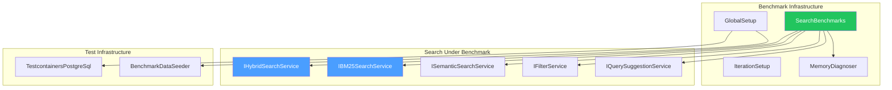

# LCS-DES-058b: Search Performance Tests

## 1. Metadata

| Field               | Value                                       |
| :------------------ | :------------------------------------------ |
| **Document ID**     | LCS-DES-058b                                |
| **Feature ID**      | RAG-058b                                    |
| **Feature Name**    | Performance Benchmark Suite                 |
| **Parent Document** | [LCS-DES-058-INDEX](./LCS-DES-058-INDEX.md) |
| **Target Version**  | v0.5.8b                                     |
| **Status**          | Draft                                       |
| **Last Updated**    | 2026-01-27                                  |

---

## 2. Executive Summary

### 2.1 Purpose

Establish performance baselines for all search operations using BenchmarkDotNet, ensuring latency targets are met under realistic load conditions and enabling automatic regression detection.

### 2.2 Scope

| In Scope                                      | Out of Scope                        |
| :-------------------------------------------- | :---------------------------------- |
| BenchmarkDotNet project for search operations | Load testing (concurrent users)     |
| Baseline measurements for all search modes    | Distributed performance testing     |
| Memory allocation profiling                   | Real-time production monitoring     |
| CI integration for regression detection       | APM integration (Datadog, etc.)     |
| Baseline documentation                        | Micro-benchmarks for sub-components |

### 2.3 Key Deliverables

- `Lexichord.Modules.RAG.Benchmarks` project
- `SearchBenchmarks` class with parameterized corpus sizes
- Baseline measurements documentation
- Memory allocation profiling
- CI integration for performance regression alerts
- Performance budget configuration

---

## 3. Architecture

### 3.1 Component Diagram



### 3.2 Project Structure

```text
tests/
└── Lexichord.Modules.RAG.Benchmarks/
    ├── Lexichord.Modules.RAG.Benchmarks.csproj
    ├── Program.cs
    ├── Benchmarks/
    │   ├── SearchBenchmarks.cs
    │   ├── CacheBenchmarks.cs
    │   └── IndexingBenchmarks.cs
    ├── Setup/
    │   ├── BenchmarkDataSeeder.cs
    │   └── BenchmarkConfig.cs
    ├── Data/
    │   └── sample-queries.json
    └── Results/
        └── .gitkeep
```

---

## 4. Data Contract

### 4.1 Benchmark Configuration

```csharp
namespace Lexichord.Modules.RAG.Benchmarks;

/// <summary>
/// BenchmarkDotNet configuration for search performance testing.
/// </summary>
public class BenchmarkConfig : ManualConfig
{
    public BenchmarkConfig()
    {
        // Use shorter warmup and fewer iterations for CI
        var ciMode = Environment.GetEnvironmentVariable("CI") == "true";

        AddJob(Job.Default
            .WithWarmupCount(ciMode ? 2 : 5)
            .WithIterationCount(ciMode ? 5 : 20)
            .WithUnrollFactor(1));

        AddDiagnoser(MemoryDiagnoser.Default);
        AddColumn(RankColumn.Arabic);
        AddColumn(StatisticColumn.P95);
        AddColumn(StatisticColumn.Max);

        AddExporter(JsonExporter.Full);
        AddExporter(MarkdownExporter.GitHub);

        WithOptions(ConfigOptions.JoinSummary);
    }
}
```

### 4.2 Performance Targets Record

```csharp
namespace Lexichord.Modules.RAG.Benchmarks;

/// <summary>
/// Defines performance targets for regression detection.
/// </summary>
public record PerformanceTargets
{
    /// <summary>
    /// Maximum acceptable P95 latency for hybrid search (50K chunks).
    /// </summary>
    public TimeSpan HybridSearchP95 { get; init; } = TimeSpan.FromMilliseconds(300);

    /// <summary>
    /// Maximum acceptable P95 latency for BM25 search (50K chunks).
    /// </summary>
    public TimeSpan Bm25SearchP95 { get; init; } = TimeSpan.FromMilliseconds(100);

    /// <summary>
    /// Maximum acceptable P95 latency for semantic search (50K chunks).
    /// </summary>
    public TimeSpan SemanticSearchP95 { get; init; } = TimeSpan.FromMilliseconds(250);

    /// <summary>
    /// Maximum acceptable P95 latency for filter application.
    /// </summary>
    public TimeSpan FilterApplicationP95 { get; init; } = TimeSpan.FromMilliseconds(50);

    /// <summary>
    /// Maximum acceptable P95 latency for query suggestions.
    /// </summary>
    public TimeSpan QuerySuggestionP95 { get; init; } = TimeSpan.FromMilliseconds(50);

    /// <summary>
    /// Maximum allowed memory allocation per search operation.
    /// </summary>
    public long MaxMemoryPerSearch { get; init; } = 5 * 1024 * 1024; // 5 MB
}
```

### 4.3 Benchmark Result Record

```csharp
namespace Lexichord.Modules.RAG.Benchmarks;

/// <summary>
/// Captured benchmark result for comparison and alerting.
/// </summary>
public record BenchmarkResult(
    string OperationName,
    int CorpusSize,
    TimeSpan Mean,
    TimeSpan Median,
    TimeSpan P95,
    TimeSpan Max,
    long AllocatedBytes,
    int Gen0Collections,
    int Gen1Collections,
    int Gen2Collections);
```

---

## 5. Implementation Logic

### 5.1 SearchBenchmarks Class

```csharp
namespace Lexichord.Modules.RAG.Benchmarks;

/// <summary>
/// BenchmarkDotNet benchmark suite for search operations.
/// </summary>
/// <remarks>
/// Benchmarks are parameterized by corpus size to measure scaling behavior.
/// Uses Testcontainers for realistic PostgreSQL + pgvector environment.
/// </remarks>
[Config(typeof(BenchmarkConfig))]
[MemoryDiagnoser]
[RankColumn]
public class SearchBenchmarks
{
    private IServiceProvider _services = null!;
    private IHybridSearchService _hybridSearch = null!;
    private IBM25SearchService _bm25Search = null!;
    private ISemanticSearchService _semanticSearch = null!;
    private IFilterService _filterService = null!;
    private IQuerySuggestionService _suggestionService = null!;

    private PostgreSqlContainer _postgres = null!;
    private string[] _testQueries = null!;

    /// <summary>
    /// Corpus sizes to benchmark. Larger sizes test scaling.
    /// </summary>
    [Params(1_000, 10_000, 50_000)]
    public int ChunkCount { get; set; }

    [GlobalSetup]
    public async Task GlobalSetup()
    {
        // Start PostgreSQL with pgvector
        _postgres = new PostgreSqlBuilder()
            .WithImage("pgvector/pgvector:pg16")
            .Build();
        await _postgres.StartAsync();

        // Configure services
        var services = new ServiceCollection();
        ConfigureServices(services, _postgres.GetConnectionString());
        _services = services.BuildServiceProvider();

        // Seed test data
        var seeder = _services.GetRequiredService<BenchmarkDataSeeder>();
        await seeder.SeedAsync(ChunkCount);

        // Resolve services
        _hybridSearch = _services.GetRequiredService<IHybridSearchService>();
        _bm25Search = _services.GetRequiredService<IBM25SearchService>();
        _semanticSearch = _services.GetRequiredService<ISemanticSearchService>();
        _filterService = _services.GetRequiredService<IFilterService>();
        _suggestionService = _services.GetRequiredService<IQuerySuggestionService>();

        // Load test queries
        _testQueries = await LoadTestQueriesAsync();
    }

    [GlobalCleanup]
    public async Task GlobalCleanup()
    {
        await _postgres.DisposeAsync();
    }

    /// <summary>
    /// Baseline benchmark for hybrid (BM25 + semantic) search.
    /// Target: &lt; 300ms for 50K chunks.
    /// </summary>
    [Benchmark(Baseline = true)]
    public async Task<SearchResult> HybridSearch()
    {
        var query = GetRandomQuery();
        return await _hybridSearch.SearchAsync(
            query,
            new SearchOptions { TopK = 10 });
    }

    /// <summary>
    /// Benchmark for BM25-only keyword search.
    /// Target: &lt; 100ms for 50K chunks.
    /// </summary>
    [Benchmark]
    public async Task<IReadOnlyList<BM25Hit>> BM25Search()
    {
        var query = GetRandomQuery();
        return await _bm25Search.SearchAsync(query, topK: 10);
    }

    /// <summary>
    /// Benchmark for semantic (vector) search only.
    /// Target: &lt; 250ms for 50K chunks.
    /// </summary>
    [Benchmark]
    public async Task<SearchResult> SemanticSearchOnly()
    {
        var query = GetRandomQuery();
        return await _semanticSearch.SearchAsync(
            query,
            new SearchOptions { TopK = 10 });
    }

    /// <summary>
    /// Benchmark for applying filters to search results.
    /// Target: &lt; 50ms overhead.
    /// </summary>
    [Benchmark]
    public async Task<SearchResult> FilteredSearch()
    {
        var query = GetRandomQuery();
        var filter = new SearchFilter
        {
            DocumentTypes = ["markdown"],
            ModifiedAfter = DateTime.UtcNow.AddMonths(-6)
        };

        return await _hybridSearch.SearchAsync(
            query,
            new SearchOptions { TopK = 10, Filter = filter });
    }

    /// <summary>
    /// Benchmark for query autocomplete suggestions.
    /// Target: &lt; 50ms.
    /// </summary>
    [Benchmark]
    public async Task<IReadOnlyList<string>> QuerySuggestions()
    {
        // Partial query for autocomplete
        var partialQuery = "auth";
        return await _suggestionService.GetSuggestionsAsync(partialQuery, limit: 5);
    }

    /// <summary>
    /// Benchmark for context expansion (retrieving surrounding chunks).
    /// Target: &lt; 50ms per chunk.
    /// </summary>
    [Benchmark]
    public async Task<ExpandedContext> ContextExpansion()
    {
        var chunkId = await GetRandomChunkIdAsync();
        return await _services
            .GetRequiredService<IContextExpansionService>()
            .ExpandAsync(chunkId, windowSize: 2);
    }

    private string GetRandomQuery() =>
        _testQueries[Random.Shared.Next(_testQueries.Length)];

    private async Task<Guid> GetRandomChunkIdAsync()
    {
        // Implementation returns a random chunk ID from the corpus
        throw new NotImplementedException();
    }

    private async Task<string[]> LoadTestQueriesAsync()
    {
        var json = await File.ReadAllTextAsync("Data/sample-queries.json");
        return JsonSerializer.Deserialize<string[]>(json)!;
    }

    private static void ConfigureServices(
        IServiceCollection services,
        string connectionString)
    {
        // Configure DI for benchmark environment
        services.AddSingleton<IDbConnectionFactory>(
            new NpgsqlConnectionFactory(connectionString));

        // Add RAG module services
        services.AddRAGModule();
        services.AddSingleton<BenchmarkDataSeeder>();
    }
}
```

### 5.2 BenchmarkDataSeeder

```csharp
namespace Lexichord.Modules.RAG.Benchmarks.Setup;

/// <summary>
/// Seeds the benchmark database with a configurable number of chunks.
/// </summary>
public sealed class BenchmarkDataSeeder(
    IDbConnectionFactory connectionFactory,
    IEmbeddingService embeddingService,
    ILogger<BenchmarkDataSeeder> logger)
{
    /// <summary>
    /// Seeds the database with the specified number of chunks.
    /// </summary>
    /// <param name="chunkCount">Target number of chunks to create.</param>
    public async Task SeedAsync(int chunkCount)
    {
        logger.LogInformation("Seeding benchmark database with {ChunkCount} chunks", chunkCount);

        await using var connection = await connectionFactory.CreateConnectionAsync();

        // Run migrations
        await RunMigrationsAsync(connection);

        // Calculate document distribution
        var avgChunksPerDoc = 50;
        var documentCount = chunkCount / avgChunksPerDoc;

        // Insert documents
        var documents = GenerateDocuments(documentCount);
        await InsertDocumentsAsync(connection, documents);

        // Generate and insert chunks with embeddings
        var chunks = await GenerateChunksWithEmbeddingsAsync(documents, chunkCount);
        await InsertChunksAsync(connection, chunks);

        logger.LogInformation(
            "Seeding complete: {DocCount} documents, {ChunkCount} chunks",
            documentCount,
            chunks.Count);
    }

    private async Task<List<BenchmarkChunk>> GenerateChunksWithEmbeddingsAsync(
        IReadOnlyList<BenchmarkDocument> documents,
        int targetChunkCount)
    {
        var chunks = new List<BenchmarkChunk>(targetChunkCount);
        var chunksPerDocument = targetChunkCount / documents.Count;

        foreach (var doc in documents)
        {
            for (var i = 0; i < chunksPerDocument; i++)
            {
                var content = GenerateSyntheticContent(doc.Type, i);
                var embedding = await embeddingService.GenerateAsync(content);

                chunks.Add(new BenchmarkChunk(
                    Id: Guid.NewGuid(),
                    DocumentId: doc.Id,
                    Content: content,
                    Embedding: embedding,
                    ChunkIndex: i));
            }
        }

        return chunks;
    }

    private static string GenerateSyntheticContent(string docType, int index)
    {
        // Generate realistic-looking technical content for benchmarking
        var templates = docType switch
        {
            "api" => ApiContentTemplates,
            "guide" => GuideContentTemplates,
            "reference" => ReferenceContentTemplates,
            _ => GeneralContentTemplates
        };

        return templates[index % templates.Length]
            .Replace("{index}", index.ToString());
    }

    private static readonly string[] ApiContentTemplates =
    [
        "The {index} endpoint accepts POST requests with JSON body containing...",
        "Authentication is handled via Bearer tokens. To authenticate...",
        // More templates...
    ];

    private static readonly string[] GuideContentTemplates =
    [
        "Step {index}: Configure the service by setting the following options...",
        "In this section, we will cover the setup process for...",
        // More templates...
    ];
}
```

### 5.3 Algorithm Flow: Benchmark Execution

```mermaid
flowchart TD
    START([Start Benchmark Run]) --> CONFIG[Load BenchmarkConfig]
    CONFIG --> PARAMS[Iterate over ChunkCount params]

    PARAMS --> SETUP[GlobalSetup]
    SETUP --> |For each param| TC[Start Testcontainers PostgreSQL]
    TC --> MIGRATE[Run FluentMigrator migrations]
    MIGRATE --> SEED[Seed {ChunkCount} chunks]
    SEED --> RESOLVE[Resolve search services]

    RESOLVE --> WARMUP[Warmup iterations]
    WARMUP --> MEASURE[Measurement iterations]

    subgraph "Per Benchmark Method"
        MEASURE --> HYBRID[HybridSearch]
        MEASURE --> BM25[BM25Search]
        MEASURE --> SEMANTIC[SemanticSearchOnly]
        MEASURE --> FILTERED[FilteredSearch]
        MEASURE --> SUGGEST[QuerySuggestions]
    end

    HYBRID --> COLLECT[Collect timing & memory]
    BM25 --> COLLECT
    SEMANTIC --> COLLECT
    FILTERED --> COLLECT
    SUGGEST --> COLLECT

    COLLECT --> STATS[Calculate statistics]
    STATS --> |Mean, Median, P95, Max| CLEANUP[GlobalCleanup]
    CLEANUP --> STOP[Stop PostgreSQL container]

    STOP --> MORE{More params?}
    MORE -->|Yes| PARAMS
    MORE -->|No| EXPORT[Export results]

    EXPORT --> JSON[results.json]
    EXPORT --> MD[results.md]
    EXPORT --> CONSOLE[Console summary]

    JSON --> COMPARE[Compare with baselines]
    COMPARE --> ALERT{P95 > threshold?}
    ALERT -->|Yes| FAIL([Regression detected])
    ALERT -->|No| SUCCESS([Benchmarks pass])
```

---

## 6. Performance Baselines

### 6.1 Target Baselines

| Operation         | Corpus Size | Mean Target | P95 Target | Max Target |
| :---------------- | :---------- | :---------- | :--------- | :--------- |
| Hybrid Search     | 1K chunks   | < 50ms      | < 80ms     | < 150ms    |
| Hybrid Search     | 10K chunks  | < 100ms     | < 150ms    | < 250ms    |
| Hybrid Search     | 50K chunks  | < 200ms     | < 300ms    | < 500ms    |
| BM25 Search       | 1K chunks   | < 10ms      | < 20ms     | < 50ms     |
| BM25 Search       | 10K chunks  | < 30ms      | < 50ms     | < 80ms     |
| BM25 Search       | 50K chunks  | < 60ms      | < 100ms    | < 150ms    |
| Semantic Search   | 1K chunks   | < 40ms      | < 60ms     | < 100ms    |
| Semantic Search   | 10K chunks  | < 80ms      | < 120ms    | < 200ms    |
| Semantic Search   | 50K chunks  | < 150ms     | < 250ms    | < 400ms    |
| Filtered Search   | 50K chunks  | < 210ms     | < 320ms    | < 520ms    |
| Query Suggestions | 10K terms   | < 20ms      | < 50ms     | < 100ms    |

### 6.2 Memory Baselines

| Operation       | Max Allocation | Notes                                 |
| :-------------- | :------------- | :------------------------------------ |
| Single query    | < 5 MB         | Transient allocations per request     |
| Result set (50) | < 2 MB         | DTOs and ViewModel materialization    |
| Cache entry     | < 10 KB        | Per embedding (1536 floats × 4 bytes) |
| Suggestions     | < 500 KB       | Trie traversal allocations            |

---

## 7. CI Pipeline Integration

### 7.1 GitHub Actions Workflow

```yaml
# .github/workflows/performance-tests.yml
name: Performance Benchmarks

on:
    push:
        branches: [main]
        paths:
            - "src/Lexichord.Modules.RAG/**"
    pull_request:
        paths:
            - "src/Lexichord.Modules.RAG/**"
    schedule:
        - cron: "0 4 * * 1" # Weekly Monday 4am

env:
    CI: true

jobs:
    benchmarks:
        runs-on: ubuntu-latest
        timeout-minutes: 30

        steps:
            - uses: actions/checkout@v4

            - name: Setup .NET
              uses: actions/setup-dotnet@v4
              with:
                  dotnet-version: "9.0.x"

            - name: Run Benchmarks
              run: |
                  dotnet run --project tests/Lexichord.Modules.RAG.Benchmarks \
                    --configuration Release \
                    -- --filter "*" --exporters json md

            - name: Upload Results
              uses: actions/upload-artifact@v4
              with:
                  name: benchmark-results
                  path: |
                      BenchmarkDotNet.Artifacts/results/*.json
                      BenchmarkDotNet.Artifacts/results/*.md

            - name: Check Regressions
              run: |
                  python scripts/check-performance-regression.py \
                    --baseline baselines/performance-baseline.json \
                    --current BenchmarkDotNet.Artifacts/results/SearchBenchmarks-report.json \
                    --threshold 10
```

### 7.2 Regression Detection Script

```python
#!/usr/bin/env python3
"""Check for performance regressions in benchmark results."""

import argparse
import json
import sys

def check_regressions(baseline_path, current_path, threshold_pct):
    """Compare current results against baseline, fail if regression detected."""

    with open(baseline_path) as f:
        baseline = json.load(f)

    with open(current_path) as f:
        current = json.load(f)

    regressions = []

    for benchmark in current['Benchmarks']:
        name = benchmark['MethodTitle']
        params = benchmark.get('Parameters', '')
        key = f"{name}_{params}"

        baseline_entry = find_baseline(baseline, name, params)
        if not baseline_entry:
            print(f"⚠️  No baseline for {key}")
            continue

        baseline_p95 = baseline_entry['Statistics']['P95']
        current_p95 = benchmark['Statistics']['P95']

        change_pct = ((current_p95 - baseline_p95) / baseline_p95) * 100

        if change_pct > threshold_pct:
            regressions.append({
                'benchmark': key,
                'baseline_p95': baseline_p95,
                'current_p95': current_p95,
                'change_pct': change_pct
            })
            print(f"❌ {key}: {baseline_p95:.2f}ms → {current_p95:.2f}ms (+{change_pct:.1f}%)")
        else:
            print(f"✓ {key}: {baseline_p95:.2f}ms → {current_p95:.2f}ms ({change_pct:+.1f}%)")

    if regressions:
        print(f"\n🚨 {len(regressions)} regression(s) detected!")
        sys.exit(1)

    print("\n✅ No regressions detected")
    sys.exit(0)
```

---

## 8. UI/UX Specifications

**N/A** — This sub-part is benchmark infrastructure with no user-facing UI components.

---

## 9. Observability & Logging

| Level   | Source              | Message Template                                                |
| :------ | :------------------ | :-------------------------------------------------------------- |
| Info    | BenchmarkDataSeeder | `"Seeding benchmark database with {ChunkCount} chunks"`         |
| Info    | BenchmarkDataSeeder | `"Seeding complete: {DocCount} documents, {ChunkCount} chunks"` |
| Debug   | SearchBenchmarks    | `"Executing {Benchmark} with {ChunkCount} chunks"`              |
| Info    | CI Script           | `"Benchmark {Name}: {P95}ms (threshold: {Threshold}ms)"`        |
| Warning | CI Script           | `"Regression detected in {Benchmark}: +{Percent}%"`             |

---

## 10. Security & Safety

### 10.1 Benchmark Environment Isolation

| Consideration        | Mitigation                                  |
| :------------------- | :------------------------------------------ |
| No production access | Benchmarks use Testcontainers only          |
| Synthetic data only  | Generated content, no real documents        |
| Resource limits      | Container memory/CPU limits prevent runaway |

### 10.2 CI Safety

| Consideration           | Mitigation                             |
| :---------------------- | :------------------------------------- |
| Long-running benchmarks | 30-minute timeout in CI                |
| Flaky benchmarks        | 10% regression threshold for alerts    |
| Disk usage              | Ephemeral containers, cleaned up after |

---

## 11. Acceptance Criteria

| #   | Category        | Criterion                                                  |
| :-- | :-------------- | :--------------------------------------------------------- |
| 1   | **Project**     | BenchmarkDotNet project compiles and runs                  |
| 2   | **Benchmarks**  | HybridSearch benchmark executes for all corpus sizes       |
| 3   | **Benchmarks**  | BM25Search benchmark executes for all corpus sizes         |
| 4   | **Benchmarks**  | SemanticSearchOnly benchmark executes for all corpus sizes |
| 5   | **Benchmarks**  | FilteredSearch benchmark executes                          |
| 6   | **Benchmarks**  | QuerySuggestions benchmark executes                        |
| 7   | **Performance** | HybridSearch P95 < 300ms for 50K chunks                    |
| 8   | **Performance** | BM25Search P95 < 100ms for 50K chunks                      |
| 9   | **Memory**      | Search operations allocate < 5MB per query                 |
| 10  | **CI**          | Benchmarks run in GitHub Actions                           |
| 11  | **CI**          | Regression detection script identifies > 10% slowdowns     |
| 12  | **Output**      | Results exported to JSON and Markdown                      |

---

## 12. Unit Tests

Benchmarks are not unit-tested in the traditional sense, but the infrastructure is:

### 12.1 BenchmarkDataSeeder Tests

```csharp
namespace Lexichord.Modules.RAG.Benchmarks.Tests;

[Trait("Category", "Unit")]
[Trait("Feature", "v0.5.8b")]
public class BenchmarkDataSeederTests
{
    [Fact]
    public void GenerateSyntheticContent_ReturnsNonEmptyString()
    {
        var content = BenchmarkDataSeeder.GenerateSyntheticContent("api", 0);

        content.Should().NotBeNullOrEmpty();
        content.Length.Should().BeGreaterThan(50);
    }

    [Theory]
    [InlineData("api")]
    [InlineData("guide")]
    [InlineData("reference")]
    public void GenerateSyntheticContent_HandlesDocumentTypes(string docType)
    {
        var content = BenchmarkDataSeeder.GenerateSyntheticContent(docType, 0);

        content.Should().NotBeNullOrEmpty();
    }

    [Fact]
    public void GenerateDocuments_CreatesCorrectCount()
    {
        var documents = BenchmarkDataSeeder.GenerateDocuments(10);

        documents.Should().HaveCount(10);
        documents.Should().OnlyContain(d => d.Id != Guid.Empty);
    }
}
```

### 12.2 Regression Detection Script Tests

```python
# tests/test_check_regression.py
import pytest
from scripts.check_performance_regression import check_regressions

def test_no_regression_when_within_threshold():
    baseline = {'Benchmarks': [{'MethodTitle': 'HybridSearch', 'Statistics': {'P95': 100}}]}
    current = {'Benchmarks': [{'MethodTitle': 'HybridSearch', 'Statistics': {'P95': 105}}]}

    # 5% change should pass with 10% threshold
    result = check_regressions(baseline, current, threshold_pct=10)
    assert result is True

def test_regression_detected_when_above_threshold():
    baseline = {'Benchmarks': [{'MethodTitle': 'HybridSearch', 'Statistics': {'P95': 100}}]}
    current = {'Benchmarks': [{'MethodTitle': 'HybridSearch', 'Statistics': {'P95': 115}}]}

    # 15% change should fail with 10% threshold
    with pytest.raises(SystemExit):
        check_regressions(baseline, current, threshold_pct=10)
```

---

## 13. Verification Commands

```bash
# ═══════════════════════════════════════════════════════════════════════════
# v0.5.8b Verification
# ═══════════════════════════════════════════════════════════════════════════

# 1. Verify benchmark project compiles
dotnet build tests/Lexichord.Modules.RAG.Benchmarks \
    --configuration Release

# 2. Run benchmarks (requires Docker for PostgreSQL)
dotnet run --project tests/Lexichord.Modules.RAG.Benchmarks \
    --configuration Release \
    -- --filter "*HybridSearch*" --warmupCount 1 --iterationCount 3

# 3. Run full benchmark suite
dotnet run --project tests/Lexichord.Modules.RAG.Benchmarks \
    --configuration Release \
    -- --filter "*" --exporters json md

# 4. List available benchmarks
dotnet run --project tests/Lexichord.Modules.RAG.Benchmarks \
    --configuration Release \
    -- --list flat

# 5. Verify results output
ls -la BenchmarkDotNet.Artifacts/results/

# 6. Check regression script
python scripts/check-performance-regression.py --help

# 7. Verify baselines exist
cat baselines/performance-baseline.json | jq '.Benchmarks | length'
```

---

## 14. Deliverable Checklist

| #   | Deliverable                                         | Status |
| :-- | :-------------------------------------------------- | :----- |
| 1   | `Lexichord.Modules.RAG.Benchmarks.csproj`           | [ ]    |
| 2   | `BenchmarkConfig` class                             | [ ]    |
| 3   | `SearchBenchmarks` class with all benchmark methods | [ ]    |
| 4   | `BenchmarkDataSeeder` for test data generation      | [ ]    |
| 5   | `sample-queries.json` test data                     | [ ]    |
| 6   | HybridSearch benchmark                              | [ ]    |
| 7   | BM25Search benchmark                                | [ ]    |
| 8   | SemanticSearchOnly benchmark                        | [ ]    |
| 9   | FilteredSearch benchmark                            | [ ]    |
| 10  | QuerySuggestions benchmark                          | [ ]    |
| 11  | Memory diagnostics enabled                          | [ ]    |
| 12  | JSON and Markdown exporters configured              | [ ]    |
| 13  | CI workflow for benchmark execution                 | [ ]    |
| 14  | `check-performance-regression.py` script            | [ ]    |
| 15  | Baseline performance documentation                  | [ ]    |

---

## 15. Related Documents

| Document                                    | Relationship                              |
| :------------------------------------------ | :---------------------------------------- |
| [LCS-SBD-058](./LCS-SBD-058.md)             | Parent scope breakdown                    |
| [LCS-DES-058-INDEX](./LCS-DES-058-INDEX.md) | Index document                            |
| [LCS-DES-058a](./LCS-DES-058a.md)           | Quality tests (complementary testing)     |
| [LCS-DES-051c](../v0.5.1/LCS-DES-051c.md)   | Hybrid search (component under benchmark) |

---

## Document History

| Version | Date       | Author         | Changes       |
| :------ | :--------- | :------------- | :------------ |
| 1.0     | 2026-01-27 | Lead Architect | Initial draft |
