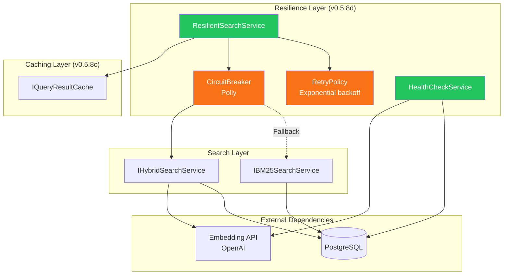
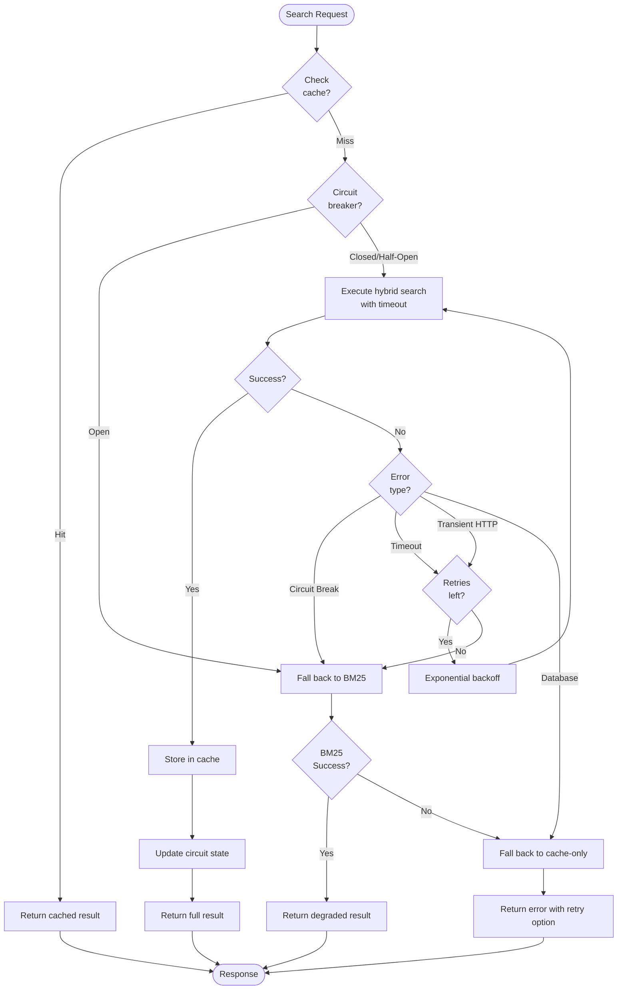

# LCS-DES-058d: Error Resilience

## 1. Metadata

| Field               | Value                                       |
| :------------------ | :------------------------------------------ |
| **Document ID**     | LCS-DES-058d                                |
| **Feature ID**      | RAG-058d                                    |
| **Feature Name**    | Graceful Degradation & Error Handling       |
| **Parent Document** | [LCS-DES-058-INDEX](./LCS-DES-058-INDEX.md) |
| **Target Version**  | v0.5.8d                                     |
| **Status**          | Draft                                       |
| **Last Updated**    | 2026-01-27                                  |

---

## 2. Executive Summary

### 2.1 Purpose

Implement graceful degradation that maintains system usability when external dependencies (embedding API, database) are unavailable, ensuring users always have access to some level of search functionality.

### 2.2 Scope

| In Scope                                | Out of Scope                            |
| :-------------------------------------- | :-------------------------------------- |
| Resilient search service decorator      | Service mesh/sidecar patterns           |
| Circuit breaker for embedding API       | Auto-scaling based on errors            |
| Automatic fallback to BM25-only search  | Multi-region failover                   |
| Retry policies with exponential backoff | Error analytics dashboard               |
| User-friendly error messages            | Automated recovery procedures           |
| Health check endpoint                   | Alerting integrations (PagerDuty, etc.) |

### 2.3 Key Deliverables

- `IResilientSearchService` interface and `ResilientSearchService` implementation
- Polly resilience pipeline configuration
- Circuit breaker for embedding API failures
- Health check status endpoint
- User-facing degraded mode indicator
- Error dialog with retry action
- Unit tests for all resilience scenarios

---

## 3. Architecture

### 3.1 Component Diagram



### 3.2 Degradation Modes

| Mode             | Trigger                   | Capability                 | User Impact                   |
| :--------------- | :------------------------ | :------------------------- | :---------------------------- |
| **Full**         | All systems healthy       | Hybrid semantic + keyword  | Best search experience        |
| **Keyword-Only** | Embedding API unavailable | BM25 keyword search only   | Less accurate, but functional |
| **Cached-Only**  | Database unavailable      | Return cached results only | Limited to previous queries   |
| **Unavailable**  | All dependencies down     | No search functionality    | Error message with retry      |

---

## 4. Data Contract

### 4.1 Interface: IResilientSearchService

```csharp
namespace Lexichord.Modules.RAG.Resilience;

/// <summary>
/// Provides resilient search with automatic fallback to degraded modes.
/// </summary>
/// <remarks>
/// <para>Wraps the hybrid search service with Polly resilience policies.</para>
/// <para>Automatically falls back to BM25-only search when embedding API fails.</para>
/// <para>Provides health status for monitoring and user feedback.</para>
/// </remarks>
public interface IResilientSearchService
{
    /// <summary>
    /// Executes search with automatic fallback on failures.
    /// </summary>
    /// <param name="query">Search query string.</param>
    /// <param name="options">Search configuration options.</param>
    /// <param name="ct">Cancellation token.</param>
    /// <returns>Search result with degradation metadata.</returns>
    Task<ResilientSearchResult> SearchAsync(
        string query,
        SearchOptions options,
        CancellationToken ct = default);

    /// <summary>
    /// Gets the current health status of search dependencies.
    /// </summary>
    /// <returns>Health status snapshot.</returns>
    SearchHealthStatus GetHealthStatus();

    /// <summary>
    /// Resets the circuit breaker, allowing retry of previously failed operations.
    /// </summary>
    /// <remarks>
    /// Called when user explicitly requests retry or health check detects recovery.
    /// </remarks>
    void ResetCircuitBreaker();
}
```

### 4.2 Records

```csharp
namespace Lexichord.Modules.RAG.Resilience;

/// <summary>
/// Search result with degradation and cache metadata.
/// </summary>
/// <param name="Result">The search result.</param>
/// <param name="ActualMode">The search mode that was actually used.</param>
/// <param name="IsDegraded">True if running in a degraded mode.</param>
/// <param name="DegradationReason">Human-readable reason for degradation, if applicable.</param>
/// <param name="IsFromCache">True if result came from cache.</param>
/// <param name="HealthStatus">Current health status snapshot.</param>
public record ResilientSearchResult(
    SearchResult Result,
    SearchMode ActualMode,
    bool IsDegraded,
    string? DegradationReason,
    bool IsFromCache,
    SearchHealthStatus HealthStatus);

/// <summary>
/// Health status of search service dependencies.
/// </summary>
/// <param name="EmbeddingApiAvailable">True if embedding API is responding.</param>
/// <param name="DatabaseAvailable">True if PostgreSQL is accessible.</param>
/// <param name="CacheAvailable">True if cache is operational.</param>
/// <param name="CircuitBreakerState">Current state of the circuit breaker.</param>
/// <param name="LastHealthCheck">Timestamp of last health verification.</param>
/// <param name="CurrentMode">Current effective search mode.</param>
public record SearchHealthStatus(
    bool EmbeddingApiAvailable,
    bool DatabaseAvailable,
    bool CacheAvailable,
    CircuitBreakerState CircuitBreakerState,
    DateTimeOffset LastHealthCheck,
    DegradedSearchMode CurrentMode);

/// <summary>
/// Search modes for degraded operation.
/// </summary>
public enum DegradedSearchMode
{
    /// <summary>Full hybrid search available.</summary>
    Full,

    /// <summary>BM25 keyword search only (embedding API unavailable).</summary>
    KeywordOnly,

    /// <summary>Cached results only (database unavailable).</summary>
    CachedOnly,

    /// <summary>Search completely unavailable.</summary>
    Unavailable
}

/// <summary>
/// Circuit breaker state enumeration.
/// </summary>
public enum CircuitBreakerState
{
    /// <summary>Circuit is closed, allowing all requests.</summary>
    Closed,

    /// <summary>Circuit is open, rejecting all requests.</summary>
    Open,

    /// <summary>Circuit is half-open, allowing limited test requests.</summary>
    HalfOpen
}

/// <summary>
/// Configuration for resilience policies.
/// </summary>
public record ResilienceOptions
{
    /// <summary>Number of failures before opening circuit. Default: 5.</summary>
    public int CircuitBreakerFailureThreshold { get; init; } = 5;

    /// <summary>Duration circuit stays open before allowing test request. Default: 60s.</summary>
    public TimeSpan CircuitBreakerBreakDuration { get; init; } = TimeSpan.FromSeconds(60);

    /// <summary>Number of successes in half-open to close circuit. Default: 3.</summary>
    public int CircuitBreakerSuccessThreshold { get; init; } = 3;

    /// <summary>Initial delay for retry. Default: 500ms.</summary>
    public TimeSpan RetryInitialDelay { get; init; } = TimeSpan.FromMilliseconds(500);

    /// <summary>Maximum delay between retries. Default: 8s.</summary>
    public TimeSpan RetryMaxDelay { get; init; } = TimeSpan.FromSeconds(8);

    /// <summary>Maximum number of retry attempts. Default: 3.</summary>
    public int RetryMaxAttempts { get; init; } = 3;

    /// <summary>Timeout for individual search operations. Default: 30s.</summary>
    public TimeSpan OperationTimeout { get; init; } = TimeSpan.FromSeconds(30);
}
```

---

## 5. Implementation Logic

### 5.1 ResilientSearchService Implementation

```csharp
namespace Lexichord.Modules.RAG.Resilience;

/// <summary>
/// Decorates search services with resilience policies and automatic fallback.
/// </summary>
public sealed class ResilientSearchService : IResilientSearchService
{
    private readonly IHybridSearchService _hybridSearch;
    private readonly IBM25SearchService _bm25Search;
    private readonly IQueryResultCache _queryCache;
    private readonly ResiliencePipeline<SearchResult> _resiliencePipeline;
    private readonly ILogger<ResilientSearchService> _logger;
    private readonly TimeProvider _timeProvider;
    private readonly ResilienceOptions _options;

    private CircuitBreakerState _circuitState = CircuitBreakerState.Closed;
    private DateTimeOffset _lastHealthCheck;
    private bool _embeddingApiHealthy = true;
    private bool _databaseHealthy = true;

    public ResilientSearchService(
        IHybridSearchService hybridSearch,
        IBM25SearchService bm25Search,
        IQueryResultCache queryCache,
        ResiliencePipeline<SearchResult> resiliencePipeline,
        IOptions<ResilienceOptions> options,
        ILogger<ResilientSearchService> logger,
        TimeProvider? timeProvider = null)
    {
        _hybridSearch = hybridSearch;
        _bm25Search = bm25Search;
        _queryCache = queryCache;
        _resiliencePipeline = resiliencePipeline;
        _options = options.Value;
        _logger = logger;
        _timeProvider = timeProvider ?? TimeProvider.System;
    }

    /// <inheritdoc />
    public async Task<ResilientSearchResult> SearchAsync(
        string query,
        SearchOptions options,
        CancellationToken ct = default)
    {
        var queryHash = CacheKeyGenerator.GenerateQueryHash(query, options, options.Filter);

        // Try cache first
        if (_queryCache.TryGet(queryHash, options.Filter, out var cached))
        {
            _logger.LogDebug("Returning cached result for query: {QueryHash}", queryHash);
            return CreateResult(cached!, SearchMode.Hybrid, isDegraded: false, isFromCache: true);
        }

        // Check circuit breaker state
        if (_circuitState == CircuitBreakerState.Open)
        {
            _logger.LogWarning("Circuit breaker open, using BM25 fallback");
            return await FallbackToBM25Async(query, options, ct);
        }

        try
        {
            // Attempt hybrid search with resilience pipeline
            var result = await _resiliencePipeline.ExecuteAsync(
                async token =>
                {
                    var searchResult = await _hybridSearch.SearchAsync(query, options, token);
                    return searchResult;
                },
                ct);

            // Cache successful result
            _queryCache.Set(queryHash, options.Filter, result);
            OnSuccess();

            return CreateResult(result, SearchMode.Hybrid, isDegraded: false, isFromCache: false);
        }
        catch (BrokenCircuitException ex)
        {
            _logger.LogWarning(ex, "Circuit breaker triggered");
            _circuitState = CircuitBreakerState.Open;
            return await FallbackToBM25Async(query, options, ct);
        }
        catch (TimeoutRejectedException ex)
        {
            _logger.LogWarning(ex, "Search timed out, falling back to BM25");
            return await FallbackToBM25Async(query, options, ct);
        }
        catch (HttpRequestException ex) when (IsTransient(ex))
        {
            _logger.LogWarning(ex, "Transient HTTP error, falling back to BM25");
            OnFailure();
            return await FallbackToBM25Async(query, options, ct);
        }
        catch (NpgsqlException ex)
        {
            _logger.LogError(ex, "Database error during search");
            _databaseHealthy = false;
            return await FallbackToCacheOnlyAsync(queryHash, options);
        }
    }

    private async Task<ResilientSearchResult> FallbackToBM25Async(
        string query,
        SearchOptions options,
        CancellationToken ct)
    {
        try
        {
            var bm25Hits = await _bm25Search.SearchAsync(query, options.TopK, ct);
            var result = ConvertToSearchResult(bm25Hits);

            _embeddingApiHealthy = false;

            return CreateResult(
                result,
                SearchMode.Keyword,
                isDegraded: true,
                isFromCache: false,
                degradationReason: "Semantic search temporarily unavailable. Using keyword search.");
        }
        catch (NpgsqlException ex)
        {
            _logger.LogError(ex, "Database also unavailable during BM25 fallback");
            _databaseHealthy = false;
            return CreateUnavailableResult();
        }
    }

    private Task<ResilientSearchResult> FallbackToCacheOnlyAsync(
        string queryHash,
        SearchOptions options)
    {
        // Try to return any cached result even if not exact match
        // This is a last-resort fallback
        var result = CreateUnavailableResult(
            "Search is offline. Please check your connection.");
        return Task.FromResult(result);
    }

    /// <inheritdoc />
    public SearchHealthStatus GetHealthStatus()
    {
        _lastHealthCheck = _timeProvider.GetUtcNow();

        var currentMode = (_embeddingApiHealthy, _databaseHealthy) switch
        {
            (true, true) => DegradedSearchMode.Full,
            (false, true) => DegradedSearchMode.KeywordOnly,
            (true, false) => DegradedSearchMode.CachedOnly,
            (false, false) => DegradedSearchMode.Unavailable
        };

        return new SearchHealthStatus(
            EmbeddingApiAvailable: _embeddingApiHealthy,
            DatabaseAvailable: _databaseHealthy,
            CacheAvailable: true,
            CircuitBreakerState: _circuitState,
            LastHealthCheck: _lastHealthCheck,
            CurrentMode: currentMode);
    }

    /// <inheritdoc />
    public void ResetCircuitBreaker()
    {
        _circuitState = CircuitBreakerState.Closed;
        _embeddingApiHealthy = true;
        _databaseHealthy = true;
        _logger.LogInformation("Circuit breaker reset by user request");
    }

    private void OnSuccess()
    {
        _embeddingApiHealthy = true;
        if (_circuitState == CircuitBreakerState.HalfOpen)
        {
            _circuitState = CircuitBreakerState.Closed;
            _logger.LogInformation("Circuit breaker closed after successful request");
        }
    }

    private void OnFailure()
    {
        // Note: Actual failure counting is handled by Polly pipeline
        // This is for local state tracking
    }

    private static bool IsTransient(HttpRequestException ex)
    {
        // 429 Too Many Requests, 503 Service Unavailable, timeouts
        return ex.StatusCode is
            HttpStatusCode.TooManyRequests or
            HttpStatusCode.ServiceUnavailable or
            HttpStatusCode.GatewayTimeout or
            HttpStatusCode.RequestTimeout;
    }

    private ResilientSearchResult CreateResult(
        SearchResult result,
        SearchMode mode,
        bool isDegraded,
        bool isFromCache,
        string? degradationReason = null)
    {
        return new ResilientSearchResult(
            Result: result,
            ActualMode: mode,
            IsDegraded: isDegraded,
            DegradationReason: degradationReason,
            IsFromCache: isFromCache,
            HealthStatus: GetHealthStatus());
    }

    private ResilientSearchResult CreateUnavailableResult(string? reason = null)
    {
        return new ResilientSearchResult(
            Result: new SearchResult([], TimeSpan.Zero),
            ActualMode: SearchMode.Hybrid,
            IsDegraded: true,
            DegradationReason: reason ?? "Search is currently unavailable.",
            IsFromCache: false,
            HealthStatus: GetHealthStatus());
    }

    private static SearchResult ConvertToSearchResult(IReadOnlyList<BM25Hit> bm25Hits)
    {
        var hits = bm25Hits.Select(h => new SearchHit(
            h.ChunkId,
            h.DocumentId,
            h.Content,
            h.Score)).ToList();

        return new SearchResult(hits, TimeSpan.Zero);
    }
}
```

### 5.2 Polly Resilience Pipeline Configuration

```csharp
namespace Lexichord.Modules.RAG.Resilience;

/// <summary>
/// Configures Polly resilience pipelines for search operations.
/// </summary>
public static class ResiliencePipelineBuilder
{
    public static ResiliencePipeline<SearchResult> Build(
        ResilienceOptions options,
        ILogger logger)
    {
        var pipeline = new ResiliencePipelineBuilder<SearchResult>()
            // Timeout for individual operations
            .AddTimeout(new TimeoutStrategyOptions
            {
                Timeout = options.OperationTimeout,
                OnTimeout = args =>
                {
                    logger.LogWarning(
                        "Search operation timed out after {Timeout}",
                        args.Timeout);
                    return default;
                }
            })

            // Retry with exponential backoff
            .AddRetry(new RetryStrategyOptions<SearchResult>
            {
                MaxRetryAttempts = options.RetryMaxAttempts,
                Delay = options.RetryInitialDelay,
                MaxDelay = options.RetryMaxDelay,
                BackoffType = DelayBackoffType.Exponential,
                UseJitter = true,
                ShouldHandle = new PredicateBuilder<SearchResult>()
                    .Handle<HttpRequestException>(ex => IsTransient(ex))
                    .Handle<TimeoutException>(),
                OnRetry = args =>
                {
                    logger.LogWarning(
                        "Retry attempt {Attempt} after {Delay}ms: {Exception}",
                        args.AttemptNumber,
                        args.RetryDelay.TotalMilliseconds,
                        args.Outcome.Exception?.Message);
                    return default;
                }
            })

            // Circuit breaker
            .AddCircuitBreaker(new CircuitBreakerStrategyOptions<SearchResult>
            {
                FailureRatio = 0.5,
                SamplingDuration = TimeSpan.FromSeconds(30),
                MinimumThroughput = options.CircuitBreakerFailureThreshold,
                BreakDuration = options.CircuitBreakerBreakDuration,
                ShouldHandle = new PredicateBuilder<SearchResult>()
                    .Handle<HttpRequestException>()
                    .Handle<TimeoutException>(),
                OnOpened = args =>
                {
                    logger.LogWarning(
                        "Circuit breaker opened for {Duration}",
                        args.BreakDuration);
                    return default;
                },
                OnClosed = args =>
                {
                    logger.LogInformation("Circuit breaker closed");
                    return default;
                },
                OnHalfOpened = args =>
                {
                    logger.LogInformation("Circuit breaker half-opened for test request");
                    return default;
                }
            })
            .Build();

        return pipeline;
    }

    private static bool IsTransient(HttpRequestException ex)
    {
        return ex.StatusCode is
            HttpStatusCode.TooManyRequests or
            HttpStatusCode.ServiceUnavailable or
            HttpStatusCode.GatewayTimeout or
            HttpStatusCode.RequestTimeout;
    }
}
```

### 5.3 Algorithm Flow: Resilient Search



### 5.4 Decision Tree: Fallback Selection

```text
START: "Which fallback to use?"
│
├── Is embedding API available (circuit closed)?
│   ├── YES → Use hybrid search
│   └── NO → Continue to fallback
│
├── Is database available?
│   ├── YES → Use BM25 keyword search
│   │   └── Display "Limited search mode" indicator
│   └── NO → Continue to cache fallback
│
├── Is cached result available?
│   ├── YES → Return cached result
│   │   └── Display "Offline mode" indicator
│   └── NO → Return error
│
└── Display error dialog with "Try Again" button
```

---

## 6. UI/UX Specifications

### 6.1 Degraded Mode Indicator

When search is in degraded mode, display an inline banner:

```text
┌─────────────────────────────────────────────────────────────┐
│  🔍 Search Results                                     [ⓘ]  │
├─────────────────────────────────────────────────────────────┤
│  ┌─────────────────────────────────────────────────────┐    │
│  │ ⚠️ Limited Search Mode                              │    │
│  │    Semantic search temporarily unavailable.         │    │
│  │    Results may be less accurate.             [×]    │    │
│  └─────────────────────────────────────────────────────┘    │
│                                                             │
│  Result 1: [Title]                                          │
│  ...                                                        │
└─────────────────────────────────────────────────────────────┘
```

### 6.2 Offline Mode Indicator

```text
┌─────────────────────────────────────────────────────────────┐
│  🔍 Search Results (Offline)                          [ⓘ]  │
├─────────────────────────────────────────────────────────────┤
│  ┌─────────────────────────────────────────────────────┐    │
│  │ 📴 Offline Mode                                     │    │
│  │    Showing cached results from earlier session.     │    │
│  │    Connect to the internet for full search.  [×]    │    │
│  └─────────────────────────────────────────────────────┘    │
│                                                             │
│  Result 1: [Cached Title] 📌                                │
│  ...                                                        │
└─────────────────────────────────────────────────────────────┘
```

### 6.3 Error Dialog with Retry

```text
┌─────────────────────────────────────────────────────────────┐
│  Search Unavailable                                    [x]  │
├─────────────────────────────────────────────────────────────┤
│                                                             │
│  ⚠️ Search is currently unavailable.                        │
│                                                             │
│  Please check your internet connection and try again.       │
│                                                             │
│  ─────────────────────────────────────────────────────────  │
│  Error: Connection timed out after 30 seconds               │
│                                                             │
│                              [Show Details]  [Try Again]    │
└─────────────────────────────────────────────────────────────┘
```

### 6.4 Status Bar Health Indicator

In the application status bar, show a small health indicator:

| State       | Icon | Tooltip                                 |
| :---------- | :--- | :-------------------------------------- |
| Healthy     | 🟢   | "Search: All systems operational"       |
| Degraded    | 🟡   | "Search: Limited mode (keyword only)"   |
| Offline     | 🔴   | "Search: Offline (cached results only)" |
| Unavailable | ⚫   | "Search: Unavailable - click to retry"  |

---

## 7. Configuration

### 7.1 appsettings.json

```json
{
    "Lexichord": {
        "RAG": {
            "Resilience": {
                "CircuitBreakerFailureThreshold": 5,
                "CircuitBreakerBreakDurationSeconds": 60,
                "CircuitBreakerSuccessThreshold": 3,
                "RetryInitialDelayMs": 500,
                "RetryMaxDelayMs": 8000,
                "RetryMaxAttempts": 3,
                "OperationTimeoutSeconds": 30
            }
        }
    }
}
```

### 7.2 DI Registration

```csharp
public static class ResilienceServiceExtensions
{
    public static IServiceCollection AddRAGResilience(
        this IServiceCollection services,
        IConfiguration configuration)
    {
        services.Configure<ResilienceOptions>(
            configuration.GetSection("Lexichord:RAG:Resilience"));

        services.AddSingleton(sp =>
        {
            var options = sp.GetRequiredService<IOptions<ResilienceOptions>>().Value;
            var logger = sp.GetRequiredService<ILogger<ResilientSearchService>>();
            return ResiliencePipelineBuilder.Build(options, logger);
        });

        services.AddSingleton<IResilientSearchService, ResilientSearchService>();

        return services;
    }
}
```

---

## 8. Observability & Logging

| Level   | Source                 | Message Template                                         |
| :------ | :--------------------- | :------------------------------------------------------- |
| Debug   | ResilientSearchService | `"Returning cached result for query: {QueryHash}"`       |
| Warning | ResilientSearchService | `"Circuit breaker open, using BM25 fallback"`            |
| Warning | ResilientSearchService | `"Transient HTTP error, falling back to BM25"`           |
| Warning | ResilientSearchService | `"Search timed out, falling back to BM25"`               |
| Error   | ResilientSearchService | `"Database error during search: {Error}"`                |
| Info    | ResilientSearchService | `"Circuit breaker reset by user request"`                |
| Warning | ResiliencePipeline     | `"Search operation timed out after {Timeout}"`           |
| Warning | ResiliencePipeline     | `"Retry attempt {Attempt} after {Delay}ms: {Exception}"` |
| Warning | ResiliencePipeline     | `"Circuit breaker opened for {Duration}"`                |
| Info    | ResiliencePipeline     | `"Circuit breaker closed"`                               |
| Info    | ResiliencePipeline     | `"Circuit breaker half-opened for test request"`         |

---

## 9. Security & Safety

### 9.1 Error Message Safety

| Consideration      | Mitigation                             |
| :----------------- | :------------------------------------- |
| Stack traces in UI | Only show sanitized messages to users  |
| API key exposure   | Never log or display API credentials   |
| Detailed errors    | Log full details, show summary to user |

### 9.2 Retry Safety

| Consideration       | Mitigation                                |
| :------------------ | :---------------------------------------- |
| Retry amplification | Circuit breaker limits cascading failures |
| Cost runaway        | Max retries capped at 3                   |
| Infinite loops      | Total timeout limits retry duration       |

---

## 10. Acceptance Criteria

| #   | Category     | Criterion                                              |
| :-- | :----------- | :----------------------------------------------------- |
| 1   | **Fallback** | BM25 fallback activates when embedding API unavailable |
| 2   | **Fallback** | Cache fallback activates when database unavailable     |
| 3   | **Circuit**  | Circuit opens after 5 consecutive failures             |
| 4   | **Circuit**  | Circuit closes after 3 successes in half-open state    |
| 5   | **Circuit**  | Circuit stays open for 60 seconds before half-open     |
| 6   | **Retry**    | Retries use exponential backoff with jitter            |
| 7   | **Retry**    | Maximum 3 retry attempts before fallback               |
| 8   | **UI**       | Degraded mode indicator displays when in fallback      |
| 9   | **UI**       | Offline indicator displays when database unavailable   |
| 10  | **UI**       | Error dialog shows retry button when search fails      |
| 11  | **UI**       | Status bar shows health indicator                      |
| 12  | **Health**   | Health status reflects current dependency states       |
| 13  | **Reset**    | Manual reset clears circuit breaker state              |

---

## 11. Unit Tests

### 11.1 ResilientSearchService Tests

```csharp
namespace Lexichord.Modules.RAG.Tests.Resilience;

[Trait("Category", "Unit")]
[Trait("Feature", "v0.5.8d")]
public class ResilientSearchServiceTests
{
    private readonly Mock<IHybridSearchService> _hybridSearchMock;
    private readonly Mock<IBM25SearchService> _bm25SearchMock;
    private readonly Mock<IQueryResultCache> _cacheMock;
    private readonly ResilientSearchService _sut;

    public ResilientSearchServiceTests()
    {
        _hybridSearchMock = new Mock<IHybridSearchService>();
        _bm25SearchMock = new Mock<IBM25SearchService>();
        _cacheMock = new Mock<IQueryResultCache>();

        var options = Options.Create(new ResilienceOptions());
        var logger = NullLogger<ResilientSearchService>.Instance;
        var pipeline = ResiliencePipelineBuilder.Build(options.Value, logger);

        _sut = new ResilientSearchService(
            _hybridSearchMock.Object,
            _bm25SearchMock.Object,
            _cacheMock.Object,
            pipeline,
            options,
            logger);
    }

    [Fact]
    public async Task SearchAsync_WhenCacheHit_ReturnsCachedResult()
    {
        // Arrange
        var cachedResult = CreateTestResult();
        _cacheMock
            .Setup(c => c.TryGet(It.IsAny<string>(), It.IsAny<SearchFilter?>(), out cachedResult))
            .Returns(true);

        // Act
        var result = await _sut.SearchAsync("test", new SearchOptions());

        // Assert
        result.IsFromCache.Should().BeTrue();
        result.IsDegraded.Should().BeFalse();
        _hybridSearchMock.Verify(h => h.SearchAsync(It.IsAny<string>(), It.IsAny<SearchOptions>(), It.IsAny<CancellationToken>()), Times.Never);
    }

    [Fact]
    public async Task SearchAsync_WhenHybridSucceeds_ReturnsFullResult()
    {
        // Arrange
        SearchResult? nullResult = null;
        _cacheMock
            .Setup(c => c.TryGet(It.IsAny<string>(), It.IsAny<SearchFilter?>(), out nullResult))
            .Returns(false);

        _hybridSearchMock
            .Setup(h => h.SearchAsync(It.IsAny<string>(), It.IsAny<SearchOptions>(), It.IsAny<CancellationToken>()))
            .ReturnsAsync(CreateTestResult());

        // Act
        var result = await _sut.SearchAsync("test", new SearchOptions());

        // Assert
        result.IsFromCache.Should().BeFalse();
        result.IsDegraded.Should().BeFalse();
        result.ActualMode.Should().Be(SearchMode.Hybrid);
    }

    [Fact]
    public async Task SearchAsync_WhenHybridFails_FallsBackToBM25()
    {
        // Arrange
        SearchResult? nullResult = null;
        _cacheMock
            .Setup(c => c.TryGet(It.IsAny<string>(), It.IsAny<SearchFilter?>(), out nullResult))
            .Returns(false);

        _hybridSearchMock
            .Setup(h => h.SearchAsync(It.IsAny<string>(), It.IsAny<SearchOptions>(), It.IsAny<CancellationToken>()))
            .ThrowsAsync(new HttpRequestException("API unavailable", null, HttpStatusCode.ServiceUnavailable));

        _bm25SearchMock
            .Setup(b => b.SearchAsync(It.IsAny<string>(), It.IsAny<int>(), It.IsAny<CancellationToken>()))
            .ReturnsAsync(new List<BM25Hit> { CreateBM25Hit() });

        // Act
        var result = await _sut.SearchAsync("test", new SearchOptions());

        // Assert
        result.IsDegraded.Should().BeTrue();
        result.ActualMode.Should().Be(SearchMode.Keyword);
        result.DegradationReason.Should().Contain("keyword search");
    }

    [Fact]
    public async Task SearchAsync_WhenCircuitOpen_ImmediatelyFallsBack()
    {
        // Arrange - Trigger circuit breaker by failing multiple times
        SearchResult? nullResult = null;
        _cacheMock
            .Setup(c => c.TryGet(It.IsAny<string>(), It.IsAny<SearchFilter?>(), out nullResult))
            .Returns(false);

        _hybridSearchMock
            .Setup(h => h.SearchAsync(It.IsAny<string>(), It.IsAny<SearchOptions>(), It.IsAny<CancellationToken>()))
            .ThrowsAsync(new HttpRequestException("API down"));

        _bm25SearchMock
            .Setup(b => b.SearchAsync(It.IsAny<string>(), It.IsAny<int>(), It.IsAny<CancellationToken>()))
            .ReturnsAsync(new List<BM25Hit> { CreateBM25Hit() });

        // Trigger failures to open circuit
        for (var i = 0; i < 10; i++)
        {
            try { await _sut.SearchAsync("test", new SearchOptions()); }
            catch { }
        }

        _hybridSearchMock.Invocations.Clear();

        // Act
        var result = await _sut.SearchAsync("test", new SearchOptions());

        // Assert - Should skip hybrid and go straight to BM25
        result.IsDegraded.Should().BeTrue();
        result.HealthStatus.CircuitBreakerState.Should().Be(CircuitBreakerState.Open);
    }

    [Fact]
    public void GetHealthStatus_ReturnsCurrentState()
    {
        // Act
        var status = _sut.GetHealthStatus();

        // Assert
        status.EmbeddingApiAvailable.Should().BeTrue();
        status.DatabaseAvailable.Should().BeTrue();
        status.CurrentMode.Should().Be(DegradedSearchMode.Full);
    }

    [Fact]
    public void ResetCircuitBreaker_ResetsState()
    {
        // Arrange - Assume circuit is open
        // (would require triggering failures first)

        // Act
        _sut.ResetCircuitBreaker();

        // Assert
        var status = _sut.GetHealthStatus();
        status.CircuitBreakerState.Should().Be(CircuitBreakerState.Closed);
    }

    private static SearchResult CreateTestResult() =>
        new(new List<SearchHit>
        {
            new(Guid.NewGuid(), Guid.NewGuid(), "test content", 0.9)
        }, TimeSpan.FromMilliseconds(100));

    private static BM25Hit CreateBM25Hit() =>
        new(Guid.NewGuid(), Guid.NewGuid(), "test content", 0.8);
}
```

### 11.2 ResiliencePipelineBuilder Tests

```csharp
[Trait("Category", "Unit")]
[Trait("Feature", "v0.5.8d")]
public class ResiliencePipelineBuilderTests
{
    [Fact]
    public void Build_CreatesValidPipeline()
    {
        // Arrange
        var options = new ResilienceOptions();
        var logger = NullLogger<ResilientSearchService>.Instance;

        // Act
        var pipeline = ResiliencePipelineBuilder.Build(options, logger);

        // Assert
        pipeline.Should().NotBeNull();
    }

    [Fact]
    public async Task Pipeline_RetriesOnTransientError()
    {
        // Arrange
        var options = new ResilienceOptions
        {
            RetryMaxAttempts = 2,
            RetryInitialDelay = TimeSpan.FromMilliseconds(10)
        };
        var logger = NullLogger<ResilientSearchService>.Instance;
        var pipeline = ResiliencePipelineBuilder.Build(options, logger);

        var callCount = 0;

        // Act
        await Assert.ThrowsAsync<HttpRequestException>(async () =>
        {
            await pipeline.ExecuteAsync(async _ =>
            {
                callCount++;
                await Task.Delay(1);
                throw new HttpRequestException("transient", null, HttpStatusCode.ServiceUnavailable);
            });
        });

        // Assert - Should attempt 1 + 2 retries = 3 calls
        callCount.Should().Be(3);
    }
}
```

---

## 12. Verification Commands

```bash
# ═══════════════════════════════════════════════════════════════════════════
# v0.5.8d Verification
# ═══════════════════════════════════════════════════════════════════════════

# 1. Verify interface exists
grep -r "IResilientSearchService" src/Lexichord.Modules.RAG/

# 2. Verify implementation exists
grep -r "ResilientSearchService" src/Lexichord.Modules.RAG/

# 3. Run unit tests
dotnet test tests/Lexichord.Modules.RAG.Tests \
    --filter "FullyQualifiedName~ResilientSearchServiceTests"

# 4. Verify Polly pipeline configuration
grep -r "ResiliencePipelineBuilder" src/Lexichord.Modules.RAG/

# 5. Verify configuration section
grep -A 10 "Resilience" src/Lexichord.Host/appsettings.json

# 6. Verify DI registration
grep -r "AddRAGResilience" src/Lexichord.Modules.RAG/

# 7. Manual verification:
# a) Disconnect internet, verify BM25 fallback activates
# b) Reconnect internet, verify normal search resumes
# c) Verify degraded mode indicator appears during fallback
# d) Click retry button, verify search attempts again
```

---

## 13. Deliverable Checklist

| #   | Deliverable                              | Status |
| :-- | :--------------------------------------- | :----- |
| 1   | `IResilientSearchService` interface      | [ ]    |
| 2   | `ResilientSearchService` implementation  | [ ]    |
| 3   | `ResilientSearchResult` record           | [ ]    |
| 4   | `SearchHealthStatus` record              | [ ]    |
| 5   | `DegradedSearchMode` enum                | [ ]    |
| 6   | `CircuitBreakerState` enum               | [ ]    |
| 7   | `ResilienceOptions` record               | [ ]    |
| 8   | `ResiliencePipelineBuilder` class        | [ ]    |
| 9   | Polly retry policy configuration         | [ ]    |
| 10  | Polly circuit breaker configuration      | [ ]    |
| 11  | Configuration in appsettings.json        | [ ]    |
| 12  | DI registration extension method         | [ ]    |
| 13  | Degraded mode indicator (XAML)           | [ ]    |
| 14  | Offline mode indicator (XAML)            | [ ]    |
| 15  | Error dialog with retry (XAML)           | [ ]    |
| 16  | Status bar health indicator (XAML)       | [ ]    |
| 17  | Unit tests for ResilientSearchService    | [ ]    |
| 18  | Unit tests for ResiliencePipelineBuilder | [ ]    |

---

## 14. Related Documents

| Document                                    | Relationship                           |
| :------------------------------------------ | :------------------------------------- |
| [LCS-SBD-058](./LCS-SBD-058.md)             | Parent scope breakdown                 |
| [LCS-DES-058-INDEX](./LCS-DES-058-INDEX.md) | Index document                         |
| [LCS-DES-058c](./LCS-DES-058c.md)           | Caching (used for cache-only fallback) |
| [LCS-DES-051b](../v0.5.1/LCS-DES-051b.md)   | BM25 search (fallback target)          |
| [LCS-DES-051c](../v0.5.1/LCS-DES-051c.md)   | Hybrid search (primary target)         |

---

## Document History

| Version | Date       | Author         | Changes       |
| :------ | :--------- | :------------- | :------------ |
| 1.0     | 2026-01-27 | Lead Architect | Initial draft |
