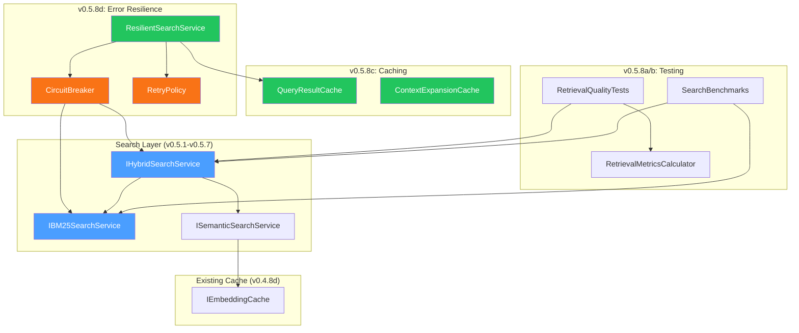
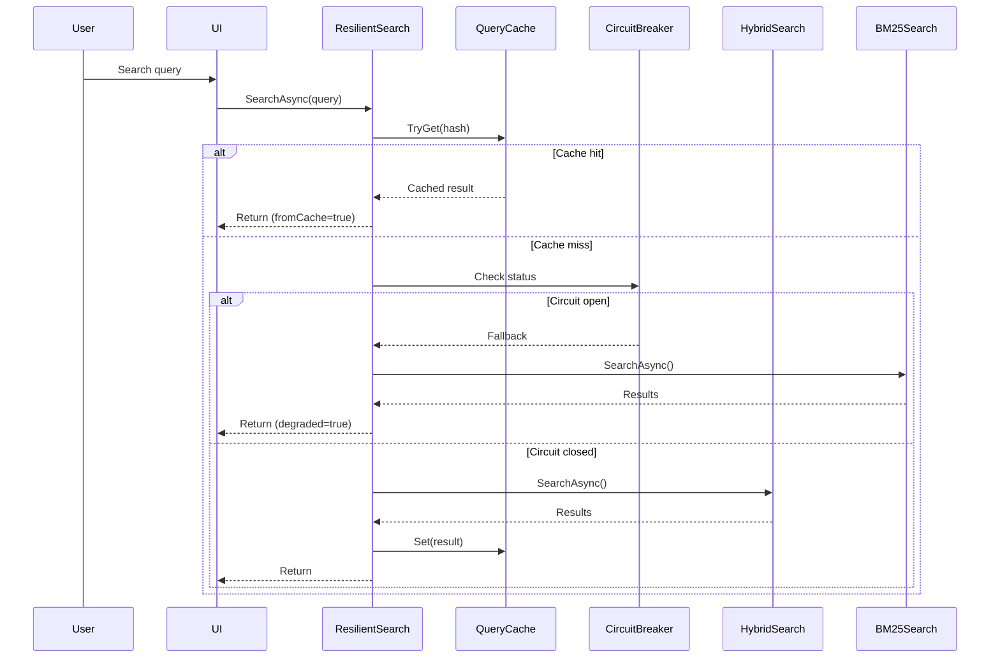

# LCS-DES-058: Design Specification Index — The Hardening

## Document Control

| Field                | Value                                 |
| :------------------- | :------------------------------------ |
| **Document ID**      | LCS-DES-058-INDEX                     |
| **Feature ID**       | RAG-058                               |
| **Feature Name**     | The Hardening (Quality & Performance) |
| **Target Version**   | v0.5.8                                |
| **Module Scope**     | Lexichord.Modules.RAG                 |
| **Swimlane**         | Memory                                |
| **License Tier**     | Core (infrastructure)                 |
| **Feature Gate Key** | N/A (infrastructure, always enabled)  |
| **Status**           | Draft                                 |
| **Last Updated**     | 2026-01-27                            |

---

## 1. Executive Summary

**v0.5.8** delivers the **Hardening** — comprehensive testing, performance optimization, and error resilience for the retrieval system. This release ensures that the RAG capabilities built in v0.5.1-v0.5.7 are production-ready, performant under load, and gracefully degrade when dependencies fail.

### 1.1 The Problem

The v0.5.x retrieval features (hybrid search, citations, context expansion, filters, snippets, and the reference dock) are feature-complete but lack:

- **Quality assurance:** No systematic measurement of retrieval accuracy (precision, recall, MRR).
- **Performance baselines:** Unknown latency characteristics under realistic workloads.
- **Caching optimization:** Repeated queries hit external APIs unnecessarily.
- **Error resilience:** Single points of failure (embedding API, database) can crash the entire search experience.

### 1.2 The Solution

Implement a hardening layer comprising:

1. **Quality Tests:** Curated corpus with gold-standard relevance judgments for automated regression testing.
2. **Performance Benchmarks:** BenchmarkDotNet suite with documented baselines.
3. **Multi-Layer Caching:** Query result cache + context expansion cache + embedding cache integration.
4. **Resilient Search:** Polly-based retries, circuit breakers, and automatic fallback to BM25.

### 1.3 Business Value

| Value                    | Description                                            |
| :----------------------- | :----------------------------------------------------- |
| **Enterprise Ready**     | Production-grade reliability for demanding deployments |
| **Cost Optimization**    | 50%+ reduction in embedding API calls via caching      |
| **User Experience**      | Consistent search availability even during outages     |
| **Developer Confidence** | Comprehensive test suite enables safe refactoring      |
| **Foundation**           | Prepares platform for Phase 4 agent integration        |

---

## 2. Related Documents

### 2.1 Scope Breakdown Document

The detailed scope breakdown for v0.5.8, including all sub-parts, implementation checklists, user stories, and acceptance criteria:

| Document                            | Description                     |
| :---------------------------------- | :------------------------------ |
| **[LCS-SBD-058](./LCS-SBD-058.md)** | Scope Breakdown — The Hardening |

### 2.2 Sub-Part Design Specifications

Each sub-part has its own detailed design specification following the LDS-01 template:

| Sub-Part | Document                              | Title                    | Description                         |
| :------- | :------------------------------------ | :----------------------- | :---------------------------------- |
| v0.5.8a  | **[LCS-DES-058a](./LCS-DES-058a.md)** | Retrieval Quality Tests  | Test corpus and quality metrics     |
| v0.5.8b  | **[LCS-DES-058b](./LCS-DES-058b.md)** | Search Performance Tests | BenchmarkDotNet suite and baselines |
| v0.5.8c  | **[LCS-DES-058c](./LCS-DES-058c.md)** | Caching Strategy         | Multi-layer cache with invalidation |
| v0.5.8d  | **[LCS-DES-058d](./LCS-DES-058d.md)** | Error Resilience         | Fallback logic and circuit breakers |

---

## 3. Architecture Overview

### 3.1 Component Diagram

### 3.2 Data Flow

---

## 4. Dependencies

### 4.1 Upstream Dependencies (Required)

| Interface                  | Source Version | Purpose                   |
| :------------------------- | :------------- | :------------------------ |
| `IHybridSearchService`     | v0.5.1c        | Primary search target     |
| `IBM25SearchService`       | v0.5.1b        | Fallback search           |
| `ISemanticSearchService`   | v0.4.5a        | Semantic component        |
| `IEmbeddingService`        | v0.4.4a        | Embedding generation      |
| `IEmbeddingCache`          | v0.4.8d        | Existing embedding cache  |
| `IChunkRepository`         | v0.4.1c        | Cache invalidation source |
| `IContextExpansionService` | v0.5.3a        | Context cache target      |
| `IConfiguration`           | v0.0.3d        | Configuration             |
| `ILogger<T>`               | v0.0.3b        | Logging                   |
| `Polly`                    | v0.0.5d        | Resilience policies       |

### 4.2 NuGet Packages

| Package                               | Version | Purpose                   |
| :------------------------------------ | :------ | :------------------------ |
| `BenchmarkDotNet`                     | 0.14.x  | Performance benchmarks    |
| `Testcontainers.PostgreSql`           | 3.x     | Integration test database |
| `Polly`                               | 8.5.x   | Resilience policies       |
| `Microsoft.Extensions.Caching.Memory` | 9.0.x   | In-memory caching         |

### 4.3 Downstream Consumers (Future)

| Version | Feature        | Consumes                              |
| :------ | :------------- | :------------------------------------ |
| v0.6.0  | LLM Gateway    | Reliable RAG context for agents       |
| v0.7.0  | Agent Registry | Trusted retrieval for recommendations |

---

## 5. License Gating Strategy

The Hardening is **infrastructure** and does not introduce new user-facing license gates.

### 5.1 Behavior by License Tier

| Tier       | Quality Tests | Caching | Resilience | Performance Metrics |
| :--------- | :------------ | :------ | :--------- | :------------------ |
| Core       | N/A (dev)     | ✓       | ✓          | N/A (dev)           |
| Writer Pro | N/A (dev)     | ✓       | ✓          | N/A (dev)           |
| Teams      | N/A (dev)     | ✓       | ✓          | N/A (dev)           |
| Enterprise | N/A (dev)     | ✓       | ✓          | ✓ (diagnostics)     |

---

## 6. Quality Metrics

### 6.1 Information Retrieval Metrics

| Metric      | Formula                                 | Target |
| :---------- | :-------------------------------------- | :----- |
| Precision@K | Relevant ∩ Retrieved@K / K              | ≥ 0.80 |
| Recall@K    | Relevant ∩ Retrieved@K / Total Relevant | ≥ 0.85 |
| MRR         | 1/N × Σ(1/rank of first relevant)       | ≥ 0.75 |

### 6.2 Performance Metrics

| Operation          | Target (P95) | Maximum |
| :----------------- | :----------- | :------ |
| Hybrid Search      | < 200ms      | < 300ms |
| BM25 Search        | < 50ms       | < 100ms |
| Semantic Search    | < 150ms      | < 250ms |
| Cache Hit Response | < 10ms       | < 20ms  |

---

## 7. Key Interfaces Summary

| Interface                     | Defined In | Purpose                        |
| :---------------------------- | :--------- | :----------------------------- |
| `IRetrievalMetricsCalculator` | v0.5.8a    | Quality metrics calculation    |
| `IQueryResultCache`           | v0.5.8c    | Query result caching           |
| `IResilientSearchService`     | v0.5.8d    | Resilient search with fallback |

| Record/DTO              | Defined In | Purpose                             |
| :---------------------- | :--------- | :---------------------------------- |
| `QueryResult`           | v0.5.8a    | Quality test result container       |
| `CacheStatistics`       | v0.5.8c    | Cache monitoring metrics            |
| `QueryCacheOptions`     | v0.5.8c    | Cache configuration                 |
| `ResilientSearchResult` | v0.5.8d    | Search result with degradation info |
| `SearchHealthStatus`    | v0.5.8d    | Dependency health snapshot          |

---

## 8. Implementation Checklist Summary

| Sub-Part  | Tasks                    | Est. Hours     |
| :-------- | :----------------------- | :------------- |
| v0.5.8a   | Retrieval Quality Tests  | 17             |
| v0.5.8b   | Search Performance Tests | 8              |
| v0.5.8c   | Caching Strategy         | 10.5           |
| v0.5.8d   | Error Resilience         | 10             |
| **Total** |                          | **45.5 hours** |

See [LCS-SBD-058](./LCS-SBD-058.md) Section 4 for the detailed task breakdown.

---

## 9. Success Criteria Summary

| Category        | Criterion                | Target  |
| :-------------- | :----------------------- | :------ |
| **Quality**     | MRR                      | ≥ 0.75  |
| **Quality**     | Precision@5              | ≥ 0.80  |
| **Performance** | Hybrid search P95        | < 300ms |
| **Performance** | BM25 search P95          | < 100ms |
| **Caching**     | Query cache hit rate     | ≥ 30%   |
| **Caching**     | Embedding cache hit rate | ≥ 50%   |
| **Resilience**  | Fallback success rate    | ≥ 95%   |
| **Coverage**    | RAG module coverage      | ≥ 80%   |

See [LCS-SBD-058](./LCS-SBD-058.md) Section 9 for full success metrics.

---

## 10. Test Coverage Summary

| Sub-Part | Unit Tests                             | Integration Tests        |
| :------- | :------------------------------------- | :----------------------- |
| v0.5.8a  | Metrics calculation, edge cases        | Full corpus evaluation   |
| v0.5.8b  | N/A (benchmarks)                       | Performance regression   |
| v0.5.8c  | Cache operations, TTL, LRU eviction    | Invalidation on re-index |
| v0.5.8d  | Fallback logic, circuit breaker states | End-to-end degradation   |

See individual design specs for detailed test scenarios.

---

## 11. What This Enables

| Version | Feature          | Uses From v0.5.8                       |
| :------ | :--------------- | :------------------------------------- |
| v0.6.0  | LLM Gateway      | Reliable RAG context for agent prompts |
| v0.6.1  | Prompt Templates | Confident context injection            |
| v0.7.0  | Agent Registry   | Trusted retrieval for suggestions      |
| v0.9.x  | Enterprise       | Distributed cache foundation           |

---

## Document History

| Version | Date       | Author         | Changes       |
| :------ | :--------- | :------------- | :------------ |
| 1.0     | 2026-01-27 | Lead Architect | Initial draft |
