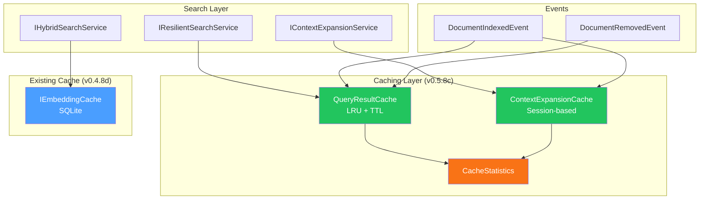
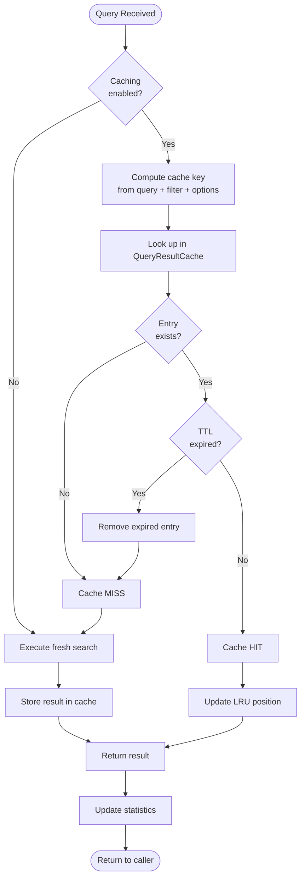
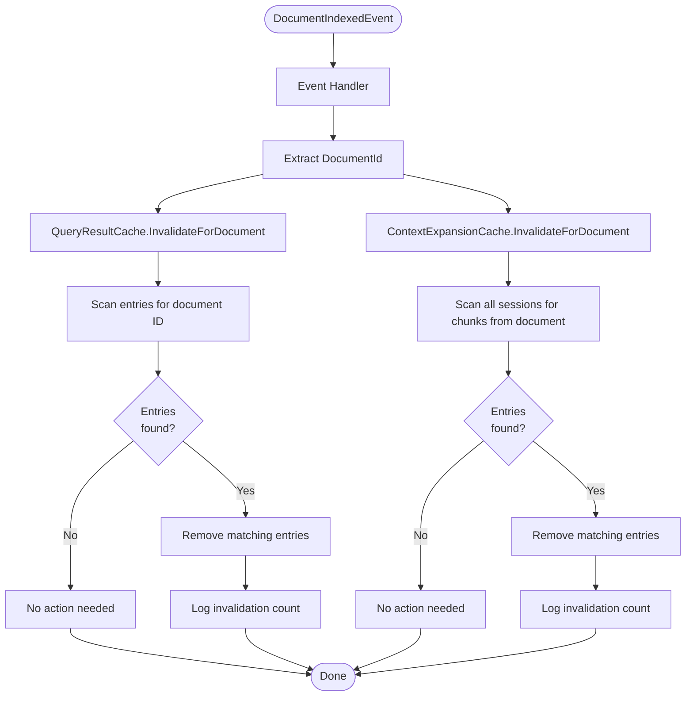

# LCS-DES-058c: Caching Strategy

## 1. Metadata

| Field               | Value                                       |
| :------------------ | :------------------------------------------ |
| **Document ID**     | LCS-DES-058c                                |
| **Feature ID**      | RAG-058c                                    |
| **Feature Name**    | Multi-Layer Caching System                  |
| **Parent Document** | [LCS-DES-058-INDEX](./LCS-DES-058-INDEX.md) |
| **Target Version**  | v0.5.8c                                     |
| **Status**          | Draft                                       |
| **Last Updated**    | 2026-01-27                                  |

---

## 2. Executive Summary

### 2.1 Purpose

Implement intelligent multi-layer caching at the query result and context expansion levels to reduce latency and external API costs without sacrificing data freshness.

### 2.2 Scope

| In Scope                                | Out of Scope                 |
| :-------------------------------------- | :--------------------------- |
| Query result cache (LRU + TTL)          | Distributed caching (Redis)  |
| Context expansion cache (session-based) | Cross-session cache sharing  |
| Cache invalidation on document changes  | Manual cache management UI   |
| Cache statistics and monitoring         | Cache warming strategies     |
| Configuration for sizes and TTLs        | Predictive cache prefetching |

### 2.3 Key Deliverables

- `IQueryResultCache` interface and `QueryResultCache` implementation
- `IContextExpansionCache` interface and `ContextExpansionCache` implementation
- Cache invalidation integration with document indexing events
- `CacheStatistics` record for monitoring
- Configuration via `appsettings.json`
- Unit tests for all cache operations

---

## 3. Architecture

### 3.1 Component Diagram



### 3.2 Cache Layers

| Layer              | Scope       | Lifetime         | Storage       | Eviction    |
| :----------------- | :---------- | :--------------- | :------------ | :---------- |
| Query Result Cache | Global      | 5 min TTL        | In-memory     | LRU + TTL   |
| Context Expansion  | Per-session | Session lifetime | In-memory     | Session end |
| Embedding Cache    | Global      | 30 day TTL       | SQLite (disk) | LRU + TTL   |

---

## 4. Data Contract

### 4.1 Interface: IQueryResultCache

```csharp
namespace Lexichord.Modules.RAG.Caching;

/// <summary>
/// Caches search query results to avoid repeated expensive operations.
/// </summary>
/// <remarks>
/// <para>Implements LRU eviction with configurable TTL per entry.</para>
/// <para>Cache keys are computed from query text, filters, and search options.</para>
/// <para>Automatically invalidates entries when source documents change.</para>
/// </remarks>
public interface IQueryResultCache
{
    /// <summary>
    /// Attempts to retrieve cached results for a query.
    /// </summary>
    /// <param name="queryHash">Hash of query + filter + options.</param>
    /// <param name="filter">Applied search filter (for validation).</param>
    /// <param name="result">Cached result if found; null otherwise.</param>
    /// <returns>True if valid cached result exists; false otherwise.</returns>
    bool TryGet(string queryHash, SearchFilter? filter, out SearchResult? result);

    /// <summary>
    /// Stores search results in the cache.
    /// </summary>
    /// <param name="queryHash">Hash of query + filter + options.</param>
    /// <param name="filter">Applied search filter.</param>
    /// <param name="result">Search result to cache.</param>
    /// <param name="ttl">Optional custom TTL; null uses default.</param>
    void Set(
        string queryHash,
        SearchFilter? filter,
        SearchResult result,
        TimeSpan? ttl = null);

    /// <summary>
    /// Invalidates cache entries that may be affected by document changes.
    /// </summary>
    /// <param name="documentId">ID of the changed document.</param>
    /// <remarks>
    /// This performs conservative invalidation: any entry whose results
    /// include chunks from the specified document will be invalidated.
    /// </remarks>
    void InvalidateForDocument(Guid documentId);

    /// <summary>
    /// Clears the entire cache.
    /// </summary>
    void Clear();

    /// <summary>
    /// Gets current cache statistics for monitoring.
    /// </summary>
    CacheStatistics GetStatistics();
}
```

### 4.2 Interface: IContextExpansionCache

```csharp
namespace Lexichord.Modules.RAG.Caching;

/// <summary>
/// Caches expanded context for chunks within a session.
/// </summary>
/// <remarks>
/// Session-scoped cache that persists expanded context until the user
/// closes the document or the session ends. Automatically invalidated
/// when the source document is modified.
/// </remarks>
public interface IContextExpansionCache
{
    /// <summary>
    /// Attempts to retrieve cached expanded context for a chunk.
    /// </summary>
    /// <param name="sessionId">Current session identifier.</param>
    /// <param name="chunkId">Chunk to retrieve context for.</param>
    /// <param name="context">Cached context if found; null otherwise.</param>
    /// <returns>True if cached context exists; false otherwise.</returns>
    bool TryGet(Guid sessionId, Guid chunkId, out ExpandedContext? context);

    /// <summary>
    /// Stores expanded context for a chunk.
    /// </summary>
    /// <param name="sessionId">Current session identifier.</param>
    /// <param name="chunkId">Chunk to cache context for.</param>
    /// <param name="context">Expanded context to cache.</param>
    void Set(Guid sessionId, Guid chunkId, ExpandedContext context);

    /// <summary>
    /// Clears all cached context for a session.
    /// </summary>
    /// <param name="sessionId">Session to clear.</param>
    void ClearSession(Guid sessionId);

    /// <summary>
    /// Invalidates cached context for a document across all sessions.
    /// </summary>
    /// <param name="documentId">Document whose context should be invalidated.</param>
    void InvalidateForDocument(Guid documentId);
}
```

### 4.3 Records

```csharp
namespace Lexichord.Modules.RAG.Caching;

/// <summary>
/// Cache statistics for monitoring and diagnostics.
/// </summary>
/// <param name="TotalEntries">Current number of cached entries.</param>
/// <param name="MaxEntries">Maximum allowed entries.</param>
/// <param name="HitCount">Total cache hits since start.</param>
/// <param name="MissCount">Total cache misses since start.</param>
/// <param name="HitRate">Hit rate as decimal (0.0 to 1.0).</param>
/// <param name="InvalidationCount">Entries invalidated since start.</param>
/// <param name="EvictionCount">Entries evicted due to LRU since start.</param>
/// <param name="TotalBytesUsed">Approximate memory usage.</param>
public record CacheStatistics(
    int TotalEntries,
    int MaxEntries,
    long HitCount,
    long MissCount,
    double HitRate,
    long InvalidationCount,
    long EvictionCount,
    long TotalBytesUsed);

/// <summary>
/// Configuration options for the query result cache.
/// </summary>
public record QueryCacheOptions
{
    /// <summary>Maximum number of cached entries. Default: 100.</summary>
    public int MaxEntries { get; init; } = 100;

    /// <summary>Default TTL for cached entries. Default: 5 minutes.</summary>
    public TimeSpan DefaultTtl { get; init; } = TimeSpan.FromMinutes(5);

    /// <summary>Enable statistics tracking. Default: true.</summary>
    public bool EnableStatistics { get; init; } = true;

    /// <summary>Interval for logging cache statistics. Default: 5 minutes.</summary>
    public TimeSpan StatisticsLogInterval { get; init; } = TimeSpan.FromMinutes(5);
}

/// <summary>
/// Configuration options for the context expansion cache.
/// </summary>
public record ContextCacheOptions
{
    /// <summary>Maximum entries per session. Default: 200.</summary>
    public int MaxEntriesPerSession { get; init; } = 200;

    /// <summary>Session inactivity timeout before cleanup. Default: 30 minutes.</summary>
    public TimeSpan SessionTimeout { get; init; } = TimeSpan.FromMinutes(30);
}

/// <summary>
/// Internal cache entry wrapper with metadata.
/// </summary>
internal record CacheEntry<T>(
    T Value,
    DateTimeOffset CreatedAt,
    DateTimeOffset ExpiresAt,
    IReadOnlySet<Guid> AffectedDocumentIds);
```

---

## 5. Implementation Logic

### 5.1 QueryResultCache Implementation

```csharp
namespace Lexichord.Modules.RAG.Caching;

/// <summary>
/// In-memory cache for search results with LRU eviction and TTL expiration.
/// </summary>
/// <remarks>
/// <para>Thread-safe implementation using ReaderWriterLockSlim.</para>
/// <para>Uses a combination of Dictionary for O(1) lookup and LinkedList for LRU ordering.</para>
/// </remarks>
public sealed class QueryResultCache : IQueryResultCache, IDisposable
{
    private readonly Dictionary<string, LinkedListNode<CacheItem>> _cache = new();
    private readonly LinkedList<CacheItem> _lruList = new();
    private readonly ReaderWriterLockSlim _lock = new();
    private readonly QueryCacheOptions _options;
    private readonly ILogger<QueryResultCache> _logger;
    private readonly TimeProvider _timeProvider;

    private long _hitCount;
    private long _missCount;
    private long _invalidationCount;
    private long _evictionCount;

    public QueryResultCache(
        IOptions<QueryCacheOptions> options,
        ILogger<QueryResultCache> logger,
        TimeProvider? timeProvider = null)
    {
        _options = options.Value;
        _logger = logger;
        _timeProvider = timeProvider ?? TimeProvider.System;
    }

    /// <inheritdoc />
    public bool TryGet(string queryHash, SearchFilter? filter, out SearchResult? result)
    {
        _lock.EnterReadLock();
        try
        {
            if (!_cache.TryGetValue(queryHash, out var node))
            {
                Interlocked.Increment(ref _missCount);
                result = null;
                return false;
            }

            var entry = node.Value;

            // Check TTL expiration
            if (_timeProvider.GetUtcNow() > entry.ExpiresAt)
            {
                Interlocked.Increment(ref _missCount);
                result = null;
                // Schedule async cleanup (don't block the read)
                _ = Task.Run(() => RemoveExpiredEntry(queryHash));
                return false;
            }

            // Move to front of LRU list (requires upgrade to write lock)
            // Deferred to avoid blocking reads
            Interlocked.Increment(ref _hitCount);
            result = entry.Result;

            _logger.LogDebug("Cache hit for query hash: {QueryHash}", queryHash);
            return true;
        }
        finally
        {
            _lock.ExitReadLock();
        }
    }

    /// <inheritdoc />
    public void Set(
        string queryHash,
        SearchFilter? filter,
        SearchResult result,
        TimeSpan? ttl = null)
    {
        var effectiveTtl = ttl ?? _options.DefaultTtl;
        var now = _timeProvider.GetUtcNow();
        var expiresAt = now.Add(effectiveTtl);

        // Extract document IDs from results for invalidation tracking
        var documentIds = result.Hits
            .Select(h => h.DocumentId)
            .ToHashSet();

        var entry = new CacheItem(
            queryHash,
            result,
            now,
            expiresAt,
            documentIds);

        _lock.EnterWriteLock();
        try
        {
            // Remove existing entry if present
            if (_cache.TryGetValue(queryHash, out var existingNode))
            {
                _lruList.Remove(existingNode);
            }

            // Add new entry at front of LRU list
            var newNode = _lruList.AddFirst(entry);
            _cache[queryHash] = newNode;

            // Evict if over capacity
            while (_cache.Count > _options.MaxEntries)
            {
                EvictLruEntry();
            }

            _logger.LogDebug(
                "Cached query result: {QueryHash}, expires at {ExpiresAt}",
                queryHash,
                expiresAt);
        }
        finally
        {
            _lock.ExitWriteLock();
        }
    }

    /// <inheritdoc />
    public void InvalidateForDocument(Guid documentId)
    {
        _lock.EnterWriteLock();
        try
        {
            var keysToRemove = _cache
                .Where(kvp => kvp.Value.Value.AffectedDocumentIds.Contains(documentId))
                .Select(kvp => kvp.Key)
                .ToList();

            foreach (var key in keysToRemove)
            {
                if (_cache.TryGetValue(key, out var node))
                {
                    _lruList.Remove(node);
                    _cache.Remove(key);
                    Interlocked.Increment(ref _invalidationCount);
                }
            }

            if (keysToRemove.Count > 0)
            {
                _logger.LogInformation(
                    "Invalidated {Count} cache entries for document {DocumentId}",
                    keysToRemove.Count,
                    documentId);
            }
        }
        finally
        {
            _lock.ExitWriteLock();
        }
    }

    /// <inheritdoc />
    public void Clear()
    {
        _lock.EnterWriteLock();
        try
        {
            _cache.Clear();
            _lruList.Clear();
            _logger.LogInformation("Query result cache cleared");
        }
        finally
        {
            _lock.ExitWriteLock();
        }
    }

    /// <inheritdoc />
    public CacheStatistics GetStatistics()
    {
        _lock.EnterReadLock();
        try
        {
            var hitCount = Interlocked.Read(ref _hitCount);
            var missCount = Interlocked.Read(ref _missCount);
            var total = hitCount + missCount;
            var hitRate = total > 0 ? (double)hitCount / total : 0.0;

            // Approximate memory usage
            var estimatedBytes = _cache.Values.Sum(n =>
                EstimateEntrySize(n.Value));

            return new CacheStatistics(
                TotalEntries: _cache.Count,
                MaxEntries: _options.MaxEntries,
                HitCount: hitCount,
                MissCount: missCount,
                HitRate: hitRate,
                InvalidationCount: Interlocked.Read(ref _invalidationCount),
                EvictionCount: Interlocked.Read(ref _evictionCount),
                TotalBytesUsed: estimatedBytes);
        }
        finally
        {
            _lock.ExitReadLock();
        }
    }

    private void EvictLruEntry()
    {
        // Called under write lock
        var lastNode = _lruList.Last;
        if (lastNode == null) return;

        _lruList.RemoveLast();
        _cache.Remove(lastNode.Value.QueryHash);
        Interlocked.Increment(ref _evictionCount);

        _logger.LogDebug("Evicted LRU entry: {QueryHash}", lastNode.Value.QueryHash);
    }

    private void RemoveExpiredEntry(string queryHash)
    {
        _lock.EnterWriteLock();
        try
        {
            if (_cache.TryGetValue(queryHash, out var node) &&
                _timeProvider.GetUtcNow() > node.Value.ExpiresAt)
            {
                _lruList.Remove(node);
                _cache.Remove(queryHash);
            }
        }
        finally
        {
            _lock.ExitWriteLock();
        }
    }

    private static long EstimateEntrySize(CacheItem entry)
    {
        // Rough estimate: query hash + result hits + metadata
        return 100 + (entry.Result.Hits.Count * 500);
    }

    public void Dispose()
    {
        _lock.Dispose();
    }

    private sealed record CacheItem(
        string QueryHash,
        SearchResult Result,
        DateTimeOffset CreatedAt,
        DateTimeOffset ExpiresAt,
        IReadOnlySet<Guid> AffectedDocumentIds);
}
```

### 5.2 Cache Key Generation

```csharp
namespace Lexichord.Modules.RAG.Caching;

/// <summary>
/// Generates deterministic cache keys from query parameters.
/// </summary>
public static class CacheKeyGenerator
{
    /// <summary>
    /// Generates a hash key for a query and its options.
    /// </summary>
    public static string GenerateQueryHash(
        string query,
        SearchOptions options,
        SearchFilter? filter)
    {
        using var sha = SHA256.Create();

        var builder = new StringBuilder();
        builder.Append(query.ToLowerInvariant().Trim());
        builder.Append('|');
        builder.Append(options.TopK);
        builder.Append('|');
        builder.Append(options.MinScore);
        builder.Append('|');
        builder.Append(options.SearchMode);

        if (filter != null)
        {
            builder.Append('|');
            builder.Append(string.Join(",", filter.DocumentTypes ?? []));
            builder.Append('|');
            builder.Append(filter.ModifiedAfter?.Ticks ?? 0);
            builder.Append('|');
            builder.Append(filter.ModifiedBefore?.Ticks ?? 0);
        }

        var bytes = Encoding.UTF8.GetBytes(builder.ToString());
        var hash = sha.ComputeHash(bytes);
        return Convert.ToHexString(hash);
    }
}
```

### 5.3 Algorithm Flow: Cache Lookup Decision



### 5.4 Cache Invalidation Flow



### 5.5 Decision Tree: Eviction Policy

```text
START: "Should this cache entry be evicted?"
│
├── Is entry expired (past TTL)?
│   ├── YES → EVICT (TTL expiration)
│   └── NO → Continue
│
├── Is cache at max capacity?
│   ├── NO → Do not evict
│   └── YES → Continue
│
├── Is this the least-recently-used entry?
│   ├── YES → EVICT (LRU policy)
│   └── NO → Check next oldest entry
│
└── Note: Entries are evicted in LRU order until under capacity
```

---

## 6. Event Handlers

### 6.1 Cache Invalidation Event Handler

```csharp
namespace Lexichord.Modules.RAG.Caching;

/// <summary>
/// Handles document change events for cache invalidation.
/// </summary>
public sealed class CacheInvalidationHandler(
    IQueryResultCache queryCache,
    IContextExpansionCache contextCache,
    ILogger<CacheInvalidationHandler> logger)
    : INotificationHandler<DocumentIndexedEvent>,
      INotificationHandler<DocumentRemovedFromIndexEvent>
{
    public Task Handle(DocumentIndexedEvent notification, CancellationToken ct)
    {
        logger.LogDebug(
            "Invalidating caches for re-indexed document: {DocumentId}",
            notification.DocumentId);

        queryCache.InvalidateForDocument(notification.DocumentId);
        contextCache.InvalidateForDocument(notification.DocumentId);

        return Task.CompletedTask;
    }

    public Task Handle(DocumentRemovedFromIndexEvent notification, CancellationToken ct)
    {
        logger.LogDebug(
            "Invalidating caches for removed document: {DocumentId}",
            notification.DocumentId);

        queryCache.InvalidateForDocument(notification.DocumentId);
        contextCache.InvalidateForDocument(notification.DocumentId);

        return Task.CompletedTask;
    }
}
```

---

## 7. Configuration

### 7.1 appsettings.json

```json
{
    "Lexichord": {
        "RAG": {
            "QueryCache": {
                "MaxEntries": 100,
                "DefaultTtlMinutes": 5,
                "EnableStatistics": true,
                "StatisticsLogIntervalMinutes": 5
            },
            "ContextCache": {
                "MaxEntriesPerSession": 200,
                "SessionTimeoutMinutes": 30
            }
        }
    }
}
```

### 7.2 DI Registration

```csharp
public static class CachingServiceExtensions
{
    public static IServiceCollection AddRAGCaching(
        this IServiceCollection services,
        IConfiguration configuration)
    {
        services.Configure<QueryCacheOptions>(
            configuration.GetSection("Lexichord:RAG:QueryCache"));
        services.Configure<ContextCacheOptions>(
            configuration.GetSection("Lexichord:RAG:ContextCache"));

        services.AddSingleton<IQueryResultCache, QueryResultCache>();
        services.AddSingleton<IContextExpansionCache, ContextExpansionCache>();
        services.AddTransient<CacheInvalidationHandler>();

        return services;
    }
}
```

---

## 8. UI/UX Specifications

### 8.1 Diagnostics View (Enterprise Only)

Cache statistics are exposed in the diagnostics panel for Enterprise users:

```text
┌─────────────────────────────────────────────────────────────┐
│  🗄️ Cache Statistics                                        │
├─────────────────────────────────────────────────────────────┤
│                                                             │
│  Query Result Cache                                         │
│  ├─ Entries:      45 / 100                                  │
│  ├─ Hit Rate:     67.3%                                     │
│  ├─ Hits:         1,234                                     │
│  ├─ Misses:       598                                       │
│  ├─ Evictions:    23                                        │
│  └─ Invalidations: 8                                        │
│                                                             │
│  Embedding Cache                                            │
│  ├─ Entries:      2,456                                     │
│  ├─ Hit Rate:     54.2%                                     │
│  └─ Size:         24.5 MB                                   │
│                                                             │
│                                        [Clear Cache]        │
└─────────────────────────────────────────────────────────────┘
```

---

## 9. Observability & Logging

| Level | Source            | Message Template                                                |
| :---- | :---------------- | :-------------------------------------------------------------- |
| Debug | QueryResultCache  | `"Cache hit for query hash: {QueryHash}"`                       |
| Debug | QueryResultCache  | `"Cached query result: {QueryHash}, expires at {ExpiresAt}"`    |
| Debug | QueryResultCache  | `"Evicted LRU entry: {QueryHash}"`                              |
| Info  | QueryResultCache  | `"Invalidated {Count} cache entries for document {DocId}"`      |
| Info  | QueryResultCache  | `"Query result cache cleared"`                                  |
| Info  | CacheStatistics   | `"Cache stats: {HitRate:P1} hit rate, {Entries}/{Max} entries"` |
| Debug | ContextCache      | `"Context cache hit for chunk: {ChunkId}"`                      |
| Info  | ContextCache      | `"Cleared context cache for session: {SessionId}"`              |
| Debug | CacheInvalidation | `"Invalidating caches for document: {DocumentId}"`              |

---

## 10. Security & Safety

### 10.1 Memory Safety

| Consideration         | Mitigation                                  |
| :-------------------- | :------------------------------------------ |
| Memory exhaustion     | MaxEntries limit, LRU eviction              |
| Stale data exposure   | TTL expiration, event-based invalidation    |
| Cross-session leakage | Session-scoped context cache with isolation |

### 10.2 Thread Safety

| Component             | Strategy                                   |
| :-------------------- | :----------------------------------------- |
| QueryResultCache      | ReaderWriterLockSlim for concurrent access |
| ContextExpansionCache | ConcurrentDictionary per session           |
| Statistics counters   | Interlocked for atomic updates             |

---

## 11. Acceptance Criteria

| #   | Category          | Criterion                                          |
| :-- | :---------------- | :------------------------------------------------- |
| 1   | **Cache**         | TryGet returns cached result for same query hash   |
| 2   | **Cache**         | Cached result expires after TTL                    |
| 3   | **Cache**         | LRU eviction removes oldest entry when at capacity |
| 4   | **Invalidation**  | Document re-index triggers cache invalidation      |
| 5   | **Invalidation**  | Document removal triggers cache invalidation       |
| 6   | **Statistics**    | Hit/miss counts accurately tracked                 |
| 7   | **Statistics**    | Hit rate calculation correct                       |
| 8   | **Performance**   | Cache hit returns in < 1ms                         |
| 9   | **Performance**   | Cache set completes in < 5ms                       |
| 10  | **Context**       | Context cache isolated per session                 |
| 11  | **Context**       | Session clear removes all session entries          |
| 12  | **Configuration** | Options loaded from appsettings.json               |

---

## 12. Unit Tests

### 12.1 QueryResultCache Tests

```csharp
namespace Lexichord.Modules.RAG.Tests.Caching;

[Trait("Category", "Unit")]
[Trait("Feature", "v0.5.8c")]
public class QueryResultCacheTests
{
    private readonly FakeTimeProvider _timeProvider = new();
    private readonly QueryResultCache _sut;

    public QueryResultCacheTests()
    {
        var options = Options.Create(new QueryCacheOptions
        {
            MaxEntries = 10,
            DefaultTtl = TimeSpan.FromMinutes(5)
        });
        var logger = NullLogger<QueryResultCache>.Instance;
        _sut = new QueryResultCache(options, logger, _timeProvider);
    }

    [Fact]
    public void TryGet_AfterSet_ReturnsCachedResult()
    {
        // Arrange
        var result = CreateTestResult();
        _sut.Set("hash123", null, result);

        // Act
        var found = _sut.TryGet("hash123", null, out var cached);

        // Assert
        found.Should().BeTrue();
        cached.Should().BeSameAs(result);
    }

    [Fact]
    public void TryGet_BeforeSet_ReturnsFalse()
    {
        // Act
        var found = _sut.TryGet("nonexistent", null, out var cached);

        // Assert
        found.Should().BeFalse();
        cached.Should().BeNull();
    }

    [Fact]
    public void TryGet_AfterTtlExpires_ReturnsFalse()
    {
        // Arrange
        var result = CreateTestResult();
        _sut.Set("hash123", null, result, TimeSpan.FromMinutes(5));

        // Act - Advance time past TTL
        _timeProvider.Advance(TimeSpan.FromMinutes(6));
        var found = _sut.TryGet("hash123", null, out _);

        // Assert
        found.Should().BeFalse();
    }

    [Fact]
    public void Set_AtCapacity_EvictsLruEntry()
    {
        // Arrange - Fill cache to capacity
        for (var i = 0; i < 10; i++)
        {
            _sut.Set($"hash{i}", null, CreateTestResult());
        }

        // Act - Add one more
        _sut.Set("hash_new", null, CreateTestResult());

        // Assert - First entry should be evicted
        _sut.TryGet("hash0", null, out _).Should().BeFalse();
        _sut.TryGet("hash_new", null, out _).Should().BeTrue();
    }

    [Fact]
    public void InvalidateForDocument_RemovesAffectedEntries()
    {
        // Arrange
        var docId = Guid.NewGuid();
        var result = CreateTestResult(docId);
        _sut.Set("hash123", null, result);

        // Act
        _sut.InvalidateForDocument(docId);

        // Assert
        _sut.TryGet("hash123", null, out _).Should().BeFalse();
    }

    [Fact]
    public void InvalidateForDocument_KeepsUnaffectedEntries()
    {
        // Arrange
        var docId1 = Guid.NewGuid();
        var docId2 = Guid.NewGuid();
        _sut.Set("hash1", null, CreateTestResult(docId1));
        _sut.Set("hash2", null, CreateTestResult(docId2));

        // Act
        _sut.InvalidateForDocument(docId1);

        // Assert
        _sut.TryGet("hash1", null, out _).Should().BeFalse();
        _sut.TryGet("hash2", null, out _).Should().BeTrue();
    }

    [Fact]
    public void Clear_RemovesAllEntries()
    {
        // Arrange
        _sut.Set("hash1", null, CreateTestResult());
        _sut.Set("hash2", null, CreateTestResult());

        // Act
        _sut.Clear();

        // Assert
        _sut.GetStatistics().TotalEntries.Should().Be(0);
    }

    [Fact]
    public void GetStatistics_ReturnsAccurateCounts()
    {
        // Arrange
        _sut.Set("hash1", null, CreateTestResult());
        _sut.TryGet("hash1", null, out _); // Hit
        _sut.TryGet("hash2", null, out _); // Miss

        // Act
        var stats = _sut.GetStatistics();

        // Assert
        stats.TotalEntries.Should().Be(1);
        stats.HitCount.Should().Be(1);
        stats.MissCount.Should().Be(1);
        stats.HitRate.Should().BeApproximately(0.5, 0.001);
    }

    private static SearchResult CreateTestResult(Guid? documentId = null)
    {
        var hits = new List<SearchHit>
        {
            new(
                Guid.NewGuid(),
                documentId ?? Guid.NewGuid(),
                "content",
                0.95)
        };
        return new SearchResult(hits, TimeSpan.FromMilliseconds(100));
    }
}
```

### 12.2 CacheKeyGenerator Tests

```csharp
[Trait("Category", "Unit")]
[Trait("Feature", "v0.5.8c")]
public class CacheKeyGeneratorTests
{
    [Fact]
    public void GenerateQueryHash_SameInputs_ReturnsSameHash()
    {
        var options = new SearchOptions { TopK = 10, MinScore = 0.7 };

        var hash1 = CacheKeyGenerator.GenerateQueryHash("test query", options, null);
        var hash2 = CacheKeyGenerator.GenerateQueryHash("test query", options, null);

        hash1.Should().Be(hash2);
    }

    [Fact]
    public void GenerateQueryHash_DifferentQueries_ReturnsDifferentHashes()
    {
        var options = new SearchOptions { TopK = 10 };

        var hash1 = CacheKeyGenerator.GenerateQueryHash("query one", options, null);
        var hash2 = CacheKeyGenerator.GenerateQueryHash("query two", options, null);

        hash1.Should().NotBe(hash2);
    }

    [Fact]
    public void GenerateQueryHash_IgnoresCasing()
    {
        var options = new SearchOptions { TopK = 10 };

        var hash1 = CacheKeyGenerator.GenerateQueryHash("Test Query", options, null);
        var hash2 = CacheKeyGenerator.GenerateQueryHash("test query", options, null);

        hash1.Should().Be(hash2);
    }

    [Fact]
    public void GenerateQueryHash_IncludesFilter()
    {
        var options = new SearchOptions { TopK = 10 };
        var filter = new SearchFilter { DocumentTypes = ["markdown"] };

        var hash1 = CacheKeyGenerator.GenerateQueryHash("query", options, null);
        var hash2 = CacheKeyGenerator.GenerateQueryHash("query", options, filter);

        hash1.Should().NotBe(hash2);
    }
}
```

---

## 13. Verification Commands

```bash
# ═══════════════════════════════════════════════════════════════════════════
# v0.5.8c Verification
# ═══════════════════════════════════════════════════════════════════════════

# 1. Verify interface exists
grep -r "IQueryResultCache" src/Lexichord.Modules.RAG/

# 2. Verify implementation exists
grep -r "QueryResultCache" src/Lexichord.Modules.RAG/

# 3. Run unit tests
dotnet test tests/Lexichord.Modules.RAG.Tests \
    --filter "FullyQualifiedName~QueryResultCacheTests"

# 4. Verify configuration section
grep -A 10 "QueryCache" src/Lexichord.Host/appsettings.json

# 5. Verify event handler registration
grep -r "CacheInvalidationHandler" src/Lexichord.Modules.RAG/

# 6. Verify DI registration
grep -r "AddRAGCaching" src/Lexichord.Modules.RAG/

# 7. Manual verification:
# a) Execute search, note latency
# b) Execute same search again, verify much faster (< 10ms)
# c) Re-index a document, execute original search, verify cache miss
```

---

## 14. Deliverable Checklist

| #   | Deliverable                                      | Status |
| :-- | :----------------------------------------------- | :----- |
| 1   | `IQueryResultCache` interface                    | [ ]    |
| 2   | `QueryResultCache` implementation with LRU + TTL | [ ]    |
| 3   | `IContextExpansionCache` interface               | [ ]    |
| 4   | `ContextExpansionCache` implementation           | [ ]    |
| 5   | `CacheStatistics` record                         | [ ]    |
| 6   | `QueryCacheOptions` record                       | [ ]    |
| 7   | `ContextCacheOptions` record                     | [ ]    |
| 8   | `CacheKeyGenerator` static class                 | [ ]    |
| 9   | `CacheInvalidationHandler` event handler         | [ ]    |
| 10  | Configuration in appsettings.json                | [ ]    |
| 11  | DI registration extension method                 | [ ]    |
| 12  | Unit tests for QueryResultCache                  | [ ]    |
| 13  | Unit tests for ContextExpansionCache             | [ ]    |
| 14  | Unit tests for CacheKeyGenerator                 | [ ]    |

---

## 15. Related Documents

| Document                                    | Relationship                       |
| :------------------------------------------ | :--------------------------------- |
| [LCS-SBD-058](./LCS-SBD-058.md)             | Parent scope breakdown             |
| [LCS-DES-058-INDEX](./LCS-DES-058-INDEX.md) | Index document                     |
| [LCS-DES-058d](./LCS-DES-058d.md)           | Error resilience (consumes cache)  |
| [LCS-DES-048d](../v0.4.8/LCS-DES-048d.md)   | Embedding cache (prior cache work) |

---

## Document History

| Version | Date       | Author         | Changes       |
| :------ | :--------- | :------------- | :------------ |
| 1.0     | 2026-01-27 | Lead Architect | Initial draft |
