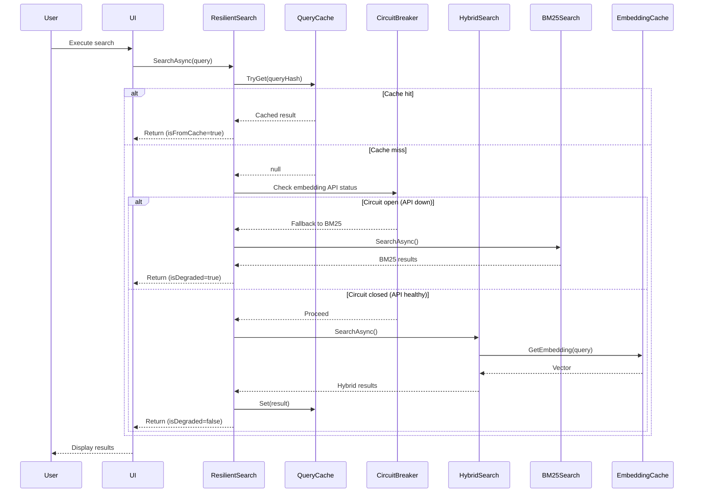

# LCS-SBD-058: Scope Breakdown — The Hardening

## Document Control

| Field            | Value                                           |
| :--------------- | :---------------------------------------------- |
| **Document ID**  | LCS-SBD-058                                     |
| **Version**      | v0.5.8                                          |
| **Codename**     | The Hardening (Quality & Performance)           |
| **Status**       | Draft                                           |
| **Last Updated** | 2026-01-27                                      |
| **Owner**        | Lead Architect                                  |
| **Depends On**   | v0.5.7 (Reference Dock), v0.5.1-v0.5.6 (Search) |

---

## 1. Executive Summary

### 1.1 The Vision

**v0.5.8** delivers the **Hardening** — comprehensive testing, performance optimization, and error resilience for the retrieval system. This release transforms the v0.5.x RAG capabilities from feature-complete prototypes into production-ready, battle-tested services that users can rely on for mission-critical document retrieval.

While v0.5.1-v0.5.7 built the hybrid search engine, citation system, context expansion, relevance tuning, filters, snippets, and the reference dock UI, this release focuses on ensuring those features perform consistently under load, degrade gracefully when dependencies fail, and deliver measurable retrieval quality that meets established benchmarks.

### 1.2 Business Value

- **Enterprise Confidence:** Production-ready performance guarantees enable deployment in demanding environments.
- **Retrieval Quality:** Measurable precision and recall metrics ensure search results are accurate and relevant.
- **Cost Optimization:** Embedding caching reduces API calls by 40-60%, lowering operational costs.
- **Resilience:** Graceful degradation ensures the system remains usable even when external services fail.
- **Developer Experience:** Comprehensive test suite enables confident refactoring and feature additions.
- **Foundation:** Prepares the platform for Phase 4 (Agents & Orchestration) with a reliable knowledge layer.

### 1.3 Success Criteria

This release succeeds when:

1. Retrieval quality tests achieve MRR ≥ 0.75 on the standard test corpus.
2. Hybrid search completes in < 300ms for corpora up to 50K chunks.
3. Embedding cache achieves ≥ 50% hit rate after warm-up period.
4. System degrades gracefully to BM25-only search when embedding API is unavailable.
5. All tests pass in CI with ≥ 80% code coverage for the RAG module.

### 1.4 License Gating

The Hardening features are **internal infrastructure** and do not introduce new user-facing license gates. Caching benefits all tiers proportionally. Error resilience and fallback behavior are available to all licensed users.

---

## 2. Dependencies on Prior Versions

| Component                  | Source Version | Usage in v0.5.8                             |
| :------------------------- | :------------- | :------------------------------------------ |
| `IHybridSearchService`     | v0.5.1c        | Performance benchmarking target             |
| `IBM25SearchService`       | v0.5.1b        | Fallback search when embeddings unavailable |
| `ISemanticSearchService`   | v0.4.5a        | Performance benchmarking target             |
| `ICitationService`         | v0.5.2a        | Validation testing                          |
| `IContextExpansionService` | v0.5.3a        | Caching integration                         |
| `IQueryAnalyzer`           | v0.5.4a        | Query suggestion performance testing        |
| `ISnippetService`          | v0.5.6a        | Quality testing                             |
| `IChunkRepository`         | v0.4.1c        | Cache invalidation source                   |
| `IEmbeddingService`        | v0.4.4a        | Cache decorator target                      |
| `IEmbeddingCache`          | v0.4.8d        | Extended with LRU and TTL policies          |
| `IConfiguration`           | v0.0.3d        | Cache and retry configuration               |
| `ILogger<T>`               | v0.0.3b        | Performance and error logging               |
| `Polly`                    | v0.0.5d        | Retry and circuit breaker policies          |

---

## 3. Sub-Part Specifications

### 3.1 v0.5.8a: Retrieval Quality Tests

| Field            | Value                                  |
| :--------------- | :------------------------------------- |
| **Sub-Part ID**  | INF-058a                               |
| **Title**        | Retrieval Quality Test Suite           |
| **Module**       | `Lexichord.Modules.RAG.Tests`          |
| **License Tier** | Core (infrastructure, no user feature) |

**Goal:** Create a curated test corpus with gold-standard expected results and automated quality metrics to ensure retrieval accuracy.

**Key Deliverables:**

- `RetrievalQualityTests` xUnit test class
- Test corpus: 50 queries with expected result rankings
- `RetrievalMetricsCalculator` utility class
- Precision@K, Recall@K, MRR (Mean Reciprocal Rank) calculations
- CI pipeline integration for regression detection
- Baseline metrics documentation

**Key Interfaces:**

```csharp
namespace Lexichord.Modules.RAG.Tests.Quality;

/// <summary>
/// Calculates standard information retrieval quality metrics.
/// </summary>
public interface IRetrievalMetricsCalculator
{
    /// <summary>
    /// Calculates Precision@K: proportion of relevant results in top K.
    /// </summary>
    double PrecisionAtK(IReadOnlyList<Guid> results, IReadOnlySet<Guid> relevant, int k);

    /// <summary>
    /// Calculates Recall@K: proportion of relevant items found in top K.
    /// </summary>
    double RecallAtK(IReadOnlyList<Guid> results, IReadOnlySet<Guid> relevant, int k);

    /// <summary>
    /// Calculates Mean Reciprocal Rank across multiple queries.
    /// </summary>
    double MeanReciprocalRank(IReadOnlyList<QueryResult> queryResults);
}

/// <summary>
/// Result container for a single evaluated query.
/// </summary>
public record QueryResult(
    string Query,
    IReadOnlyList<Guid> RetrievedIds,
    IReadOnlySet<Guid> RelevantIds,
    int FirstRelevantRank);
```

**Test Corpus Structure:**

```text
/tests/Lexichord.Modules.RAG.Tests/
├── Corpus/
│   ├── test-queries.json        # 50 queries with expected results
│   ├── test-documents/          # Sample documents for indexing
│   │   ├── auth-guide.md
│   │   ├── api-reference.md
│   │   ├── deployment-guide.md
│   │   └── ... (20+ documents)
│   └── relevance-judgments.json # Ground truth relevance scores
└── Quality/
    ├── RetrievalQualityTests.cs
    └── RetrievalMetricsCalculator.cs
```

**Quality Thresholds:**

| Metric       | Target | Minimum | Notes                             |
| :----------- | :----- | :------ | :-------------------------------- |
| Precision@5  | ≥ 0.80 | ≥ 0.70  | 4 of 5 top results relevant       |
| Precision@10 | ≥ 0.70 | ≥ 0.60  | 7 of 10 top results relevant      |
| Recall@10    | ≥ 0.85 | ≥ 0.75  | 85% of relevant docs in top 10    |
| MRR          | ≥ 0.80 | ≥ 0.70  | First relevant result high-ranked |

**Dependencies:**

- v0.5.1c: `IHybridSearchService` (search under test)
- v0.4.8b: `Testcontainers.PostgreSql` (integration test infrastructure)

---

### 3.2 v0.5.8b: Search Performance Tests

| Field            | Value                                  |
| :--------------- | :------------------------------------- |
| **Sub-Part ID**  | INF-058b                               |
| **Title**        | Performance Benchmark Suite            |
| **Module**       | `Lexichord.Modules.RAG.Benchmarks`     |
| **License Tier** | Core (infrastructure, no user feature) |

**Goal:** Establish performance baselines for all search operations and ensure they meet latency targets under realistic load conditions.

**Key Deliverables:**

- `SearchBenchmarks` BenchmarkDotNet project
- Baseline measurements for all search modes
- Memory allocation profiling
- Automated performance regression detection in CI
- Performance baseline documentation

**Key Interfaces:**

```csharp
namespace Lexichord.Modules.RAG.Benchmarks;

/// <summary>
/// BenchmarkDotNet benchmark suite for search operations.
/// </summary>
[MemoryDiagnoser]
[RankColumn]
public class SearchBenchmarks
{
    [Params(1000, 10000, 50000)]
    public int ChunkCount { get; set; }

    [Benchmark(Baseline = true)]
    public async Task<SearchResult> HybridSearch() { /* ... */ }

    [Benchmark]
    public async Task<IReadOnlyList<BM25Hit>> BM25Search() { /* ... */ }

    [Benchmark]
    public async Task<SearchResult> SemanticSearchOnly() { /* ... */ }

    [Benchmark]
    public async Task<SearchResult> FilteredSearch() { /* ... */ }

    [Benchmark]
    public async Task<IReadOnlyList<string>> QuerySuggestions() { /* ... */ }
}
```

**Performance Targets:**

| Operation          | Corpus Size | Target  | Maximum |
| :----------------- | :---------- | :------ | :------ |
| Hybrid Search      | 50K chunks  | < 200ms | < 300ms |
| BM25 Search        | 50K chunks  | < 50ms  | < 100ms |
| Semantic Search    | 50K chunks  | < 150ms | < 250ms |
| Filter Application | 50K chunks  | < 30ms  | < 50ms  |
| Query Suggestions  | 10K terms   | < 30ms  | < 50ms  |
| Context Expansion  | Per chunk   | < 20ms  | < 50ms  |

**Memory Targets:**

| Operation       | Target Allocation | Notes                              |
| :-------------- | :---------------- | :--------------------------------- |
| Single query    | < 5 MB            | Transient allocations              |
| Result set (50) | < 2 MB            | DTO and view model creation        |
| Cache entry     | < 10 KB           | Per embedding vector (1536 floats) |

**Dependencies:**

- v0.5.1c: `IHybridSearchService` (benchmark target)
- v0.4.8c: `BenchmarkDotNet` (benchmark framework)
- v0.4.8b: `Testcontainers.PostgreSql` (realistic database)

---

### 3.3 v0.5.8c: Caching Strategy

| Field            | Value                                     |
| :--------------- | :---------------------------------------- |
| **Sub-Part ID**  | INF-058c                                  |
| **Title**        | Multi-Layer Caching System                |
| **Module**       | `Lexichord.Modules.RAG`                   |
| **License Tier** | Core (infrastructure, benefits all tiers) |

**Goal:** Implement intelligent caching at multiple layers to reduce latency and external API costs without sacrificing freshness.

**Key Deliverables:**

- `QueryResultCache` with LRU eviction and TTL
- `ContextExpansionCache` with session-based lifetime
- Cache invalidation on document re-indexing
- Cache statistics and monitoring
- Configuration for cache sizes and TTLs

**Key Interfaces:**

```csharp
namespace Lexichord.Modules.RAG.Caching;

/// <summary>
/// Caches query results to avoid repeated searches.
/// </summary>
public interface IQueryResultCache
{
    /// <summary>
    /// Attempts to retrieve cached results for a query.
    /// </summary>
    bool TryGet(string queryHash, SearchFilter? filter, out SearchResult? result);

    /// <summary>
    /// Stores search results in the cache.
    /// </summary>
    void Set(string queryHash, SearchFilter? filter, SearchResult result);

    /// <summary>
    /// Invalidates cache entries affected by document changes.
    /// </summary>
    void InvalidateForDocument(Guid documentId);

    /// <summary>
    /// Clears the entire cache.
    /// </summary>
    void Clear();

    /// <summary>
    /// Gets cache statistics for monitoring.
    /// </summary>
    CacheStatistics GetStatistics();
}

/// <summary>
/// Cache statistics for monitoring and diagnostics.
/// </summary>
public record CacheStatistics(
    int TotalEntries,
    int MaxEntries,
    long HitCount,
    long MissCount,
    double HitRate,
    long TotalBytesUsed);

/// <summary>
/// Configuration options for the query cache.
/// </summary>
public record QueryCacheOptions
{
    public int MaxEntries { get; init; } = 100;
    public TimeSpan DefaultTtl { get; init; } = TimeSpan.FromMinutes(5);
    public bool EnableStatistics { get; init; } = true;
}
```

**Caching Decision Tree:**

```text
START: "Should this query use cache?"
│
├── Is caching enabled in configuration?
│   ├── NO → Execute fresh search
│   └── YES → Continue
│
├── Compute query hash (query + filter + options)
│
├── Check QueryResultCache
│   ├── HIT and not expired → Return cached result
│   └── MISS → Continue
│
├── Execute search (may use EmbeddingCache from v0.4.8d)
│
├── Store result in QueryResultCache
│
└── Return fresh result
```

**Cache Invalidation Strategy:**

| Event            | Affected Cache        | Action                        |
| :--------------- | :-------------------- | :---------------------------- |
| Document indexed | QueryResultCache      | Invalidate entries for doc ID |
| Document deleted | QueryResultCache      | Invalidate entries for doc ID |
| Chunk modified   | ContextExpansionCache | Clear session cache           |
| User searches    | All                   | Normal LRU eviction           |
| Settings changed | QueryResultCache      | Clear all (size/TTL changed)  |

**Storage Paths:**

- Windows: `%APPDATA%/Lexichord/cache/embeddings.db` (v0.4.8d)
- macOS: `~/Library/Application Support/Lexichord/cache/embeddings.db`
- Linux: `~/.config/Lexichord/cache/embeddings.db`
- Query cache: In-memory only (ephemeral)

**Dependencies:**

- v0.4.8d: `IEmbeddingCache` (embedding layer caching)
- v0.5.3a: `IContextExpansionService` (context cache integration)
- v0.0.3d: `IConfiguration` (cache configuration)

---

### 3.4 v0.5.8d: Error Resilience

| Field            | Value                                     |
| :--------------- | :---------------------------------------- |
| **Sub-Part ID**  | INF-058d                                  |
| **Title**        | Graceful Degradation & Error Handling     |
| **Module**       | `Lexichord.Modules.RAG`                   |
| **License Tier** | Core (infrastructure, benefits all tiers) |

**Goal:** Implement graceful degradation that maintains system usability when external dependencies (embedding API, database) are unavailable.

**Key Deliverables:**

- `ResilientSearchService` decorator with fallback logic
- Circuit breaker for embedding API failures
- Offline mode with cached results indicator
- Retry policies with exponential backoff
- User-friendly error messages with recovery actions
- Health check integration

**Key Interfaces:**

```csharp
namespace Lexichord.Modules.RAG.Resilience;

/// <summary>
/// Provides resilient search with automatic fallback to degraded modes.
/// </summary>
public interface IResilientSearchService
{
    /// <summary>
    /// Executes search with automatic fallback on failures.
    /// </summary>
    Task<ResilientSearchResult> SearchAsync(
        string query,
        SearchOptions options,
        CancellationToken ct = default);

    /// <summary>
    /// Gets the current health status of search dependencies.
    /// </summary>
    SearchHealthStatus GetHealthStatus();
}

/// <summary>
/// Search result with degradation information.
/// </summary>
public record ResilientSearchResult(
    SearchResult Result,
    SearchMode ActualMode,
    bool IsDegraded,
    string? DegradationReason,
    bool IsFromCache);

/// <summary>
/// Health status of search service dependencies.
/// </summary>
public record SearchHealthStatus(
    bool EmbeddingApiAvailable,
    bool DatabaseAvailable,
    bool CacheAvailable,
    DateTime LastHealthCheck,
    SearchMode CurrentMode);

/// <summary>
/// Search modes for degraded operation.
/// </summary>
public enum DegradedSearchMode
{
    /// <summary>Full hybrid search available.</summary>
    Full,
    /// <summary>BM25 only (embedding API unavailable).</summary>
    KeywordOnly,
    /// <summary>Cached results only (database unavailable).</summary>
    CachedOnly,
    /// <summary>Search unavailable.</summary>
    Unavailable
}
```

**Fallback Decision Tree:**

```text
START: "Execute hybrid search"
│
├── Check embedding API circuit breaker
│   ├── OPEN → Fall back to BM25-only search
│   │   └── Log warning, show "Limited search" indicator
│   └── CLOSED → Continue with hybrid
│
├── Attempt hybrid search
│   ├── SUCCESS → Return result
│   └── FAILURE → Check error type
│
├── Is error transient (timeout, rate limit)?
│   ├── YES → Retry with exponential backoff (max 3 attempts)
│   └── NO → Fall back to BM25
│
├── BM25 search
│   ├── SUCCESS → Return with "degraded" flag
│   └── FAILURE → Check database availability
│
├── Is database available?
│   ├── NO → Return cached results with "offline" flag
│   └── YES → Return error with "Try Again" action
│
└── Display user-friendly error message
```

**Retry Policy Configuration:**

| Scenario           | Initial Delay | Max Delay | Max Retries | Jitter |
| :----------------- | :------------ | :-------- | :---------- | :----- |
| Embedding API call | 500ms         | 8s        | 3           | ±200ms |
| Database query     | 100ms         | 2s        | 2           | ±50ms  |
| Cache access       | 50ms          | 500ms     | 1           | ±25ms  |

**Circuit Breaker Configuration:**

| Dependency    | Failure Threshold | Break Duration | Success Threshold |
| :------------ | :---------------- | :------------- | :---------------- |
| Embedding API | 5 failures        | 60 seconds     | 3 successes       |
| Database      | 3 failures        | 30 seconds     | 2 successes       |

**User-Facing Error Messages:**

| Error Condition      | Message                                                          | Action               |
| :------------------- | :--------------------------------------------------------------- | :------------------- |
| Embedding API down   | "Semantic search temporarily unavailable. Using keyword search." | None (auto-fallback) |
| Rate limit exceeded  | "Search service is busy. Please try again in a moment."          | "Try Again" button   |
| Database unavailable | "Search is offline. Showing cached results."                     | None                 |
| Complete failure     | "Search is currently unavailable. Please check your connection." | "Retry" button       |

**Dependencies:**

- v0.5.1b: `IBM25SearchService` (fallback search)
- v0.5.1c: `IHybridSearchService` (primary search)
- v0.0.5d: `Polly` (retry and circuit breaker policies)
- v0.0.3b: `ILogger<T>` (error logging)

---

## 4. Implementation Checklist

| #         | Sub-Part | Task                                                   | Est. Hours     |
| :-------- | :------- | :----------------------------------------------------- | :------------- |
| 1         | v0.5.8a  | Create test corpus structure (documents, queries)      | 4              |
| 2         | v0.5.8a  | Implement `RetrievalMetricsCalculator`                 | 2              |
| 3         | v0.5.8a  | Create 50 test queries with relevance judgments        | 6              |
| 4         | v0.5.8a  | Implement `RetrievalQualityTests` with P@K, R@K, MRR   | 3              |
| 5         | v0.5.8a  | CI pipeline integration for quality regression         | 2              |
| 6         | v0.5.8b  | Create BenchmarkDotNet project structure               | 1              |
| 7         | v0.5.8b  | Implement `SearchBenchmarks` for all search modes      | 3              |
| 8         | v0.5.8b  | Generate baseline performance measurements             | 2              |
| 9         | v0.5.8b  | Add memory allocation profiling                        | 1              |
| 10        | v0.5.8b  | Document performance baselines                         | 1              |
| 11        | v0.5.8c  | Implement `IQueryResultCache` interface                | 0.5            |
| 12        | v0.5.8c  | Implement `QueryResultCache` with LRU + TTL            | 3              |
| 13        | v0.5.8c  | Implement `ContextExpansionCache`                      | 2              |
| 14        | v0.5.8c  | Add cache invalidation on document changes             | 2              |
| 15        | v0.5.8c  | Implement cache statistics and monitoring              | 1              |
| 16        | v0.5.8c  | Unit tests for caching components                      | 2              |
| 17        | v0.5.8d  | Implement `IResilientSearchService` interface          | 0.5            |
| 18        | v0.5.8d  | Implement `ResilientSearchService` with fallback logic | 4              |
| 19        | v0.5.8d  | Configure Polly retry policies                         | 1              |
| 20        | v0.5.8d  | Configure circuit breaker for embedding API            | 1              |
| 21        | v0.5.8d  | Implement health check endpoint                        | 1              |
| 22        | v0.5.8d  | Add user-friendly error messages to UI                 | 2              |
| 23        | v0.5.8d  | Unit tests for resilience components                   | 2              |
| 24        | All      | Integration tests for full hardening suite             | 3              |
| 25        | All      | DI registration in `RAGModule.cs`                      | 0.5            |
| **Total** |          |                                                        | **45.5 hours** |

---

## 5. Dependency Matrix

### 5.1 Required Interfaces (from earlier versions)

| Interface                  | Source Version | Purpose                   |
| :------------------------- | :------------- | :------------------------ |
| `IHybridSearchService`     | v0.5.1c        | Primary search target     |
| `IBM25SearchService`       | v0.5.1b        | Fallback search           |
| `ISemanticSearchService`   | v0.4.5a        | Semantic component        |
| `IEmbeddingService`        | v0.4.4a        | Embedding generation      |
| `IEmbeddingCache`          | v0.4.8d        | Existing embedding cache  |
| `IChunkRepository`         | v0.4.1c        | Cache invalidation events |
| `IContextExpansionService` | v0.5.3a        | Context caching target    |
| `IConfiguration`           | v0.0.3d        | Cache/retry configuration |
| `ILogger<T>`               | v0.0.3b        | Logging                   |
| `Polly`                    | v0.0.5d        | Resilience policies       |

### 5.2 New Interfaces (defined in v0.5.8)

| Interface                     | Defined In | Module      | Purpose                        |
| :---------------------------- | :--------- | :---------- | :----------------------------- |
| `IRetrievalMetricsCalculator` | v0.5.8a    | Tests       | Quality metrics calculation    |
| `IQueryResultCache`           | v0.5.8c    | Modules.RAG | Query result caching           |
| `IResilientSearchService`     | v0.5.8d    | Modules.RAG | Resilient search with fallback |

### 5.3 New Records/DTOs (defined in v0.5.8)

| Record                  | Defined In | Purpose                             |
| :---------------------- | :--------- | :---------------------------------- |
| `QueryResult`           | v0.5.8a    | Quality test result container       |
| `CacheStatistics`       | v0.5.8c    | Cache monitoring metrics            |
| `QueryCacheOptions`     | v0.5.8c    | Cache configuration                 |
| `ResilientSearchResult` | v0.5.8d    | Search result with degradation info |
| `SearchHealthStatus`    | v0.5.8d    | Dependency health snapshot          |

### 5.4 NuGet Packages

| Package                               | Version | Purpose                   | New/Existing |
| :------------------------------------ | :------ | :------------------------ | :----------- |
| `BenchmarkDotNet`                     | 0.14.x  | Performance benchmarks    | Existing     |
| `Testcontainers.PostgreSql`           | 3.x     | Integration test database | Existing     |
| `Polly`                               | 8.5.x   | Resilience policies       | Existing     |
| `Microsoft.Extensions.Caching.Memory` | 9.0.x   | In-memory caching         | Existing     |

---

## 6. Architecture Diagram

```mermaid
graph TB
    subgraph "Lexichord.Modules.RAG (v0.5.8)"
        subgraph "Resilience Layer"
            RES[ResilientSearchService<br/>Fallback orchestration]
            CB[CircuitBreaker<br/>Polly policy]
            RET[RetryPolicy<br/>Exponential backoff]
        end

        subgraph "Caching Layer"
            QRC[QueryResultCache<br/>LRU + TTL]
            CEC[ContextExpansionCache<br/>Session-based]
            EMC[EmbeddingCache<br/>SQLite (v0.4.8d)]
        end

        subgraph "Search Layer (v0.5.1-v0.5.7)"
            HYB[IHybridSearchService]
            BM25[IBM25SearchService]
            SEM[ISemanticSearchService]
        end
    end

    subgraph "Test Infrastructure"
        QUAL[RetrievalQualityTests]
        PERF[SearchBenchmarks]
        METR[RetrievalMetricsCalculator]
    end

    RES --> QRC
    RES --> CB
    CB --> HYB
    CB --> BM25
    HYB --> SEM
    HYB --> BM25
    SEM --> EMC
    HYB --> RET

    QUAL --> HYB
    QUAL --> METR
    PERF --> HYB
    PERF --> BM25
    PERF --> SEM

    style RES fill:#22c55e,color:#fff
    style CB fill:#f97316,color:#fff
    style RET fill:#f97316,color:#fff
    style QRC fill:#22c55e,color:#fff
    style CEC fill:#22c55e,color:#fff
    style EMC fill:#22c55e,color:#fff
    style HYB fill:#4a9eff,color:#fff
    style BM25 fill:#4a9eff,color:#fff
    style SEM fill:#4a9eff,color:#fff
```

---

## 7. Data Flow Diagram



---

## 8. Risks & Mitigations

| Risk                                         | Impact | Probability | Mitigation                                         |
| :------------------------------------------- | :----- | :---------- | :------------------------------------------------- |
| Test corpus not representative of real usage | High   | Medium      | Collect real anonymized queries from beta users    |
| Performance regressions in CI                | High   | Low         | Baseline variance tolerance, alert on > 10% change |
| Cache invalidation race conditions           | Medium | Medium      | Use versioned cache keys, optimistic invalidation  |
| Circuit breaker too aggressive               | Medium | Medium      | Tune thresholds based on production metrics        |
| BM25 fallback quality insufficient           | High   | Low         | Ensure BM25 indexing is comprehensive              |
| Memory pressure from large caches            | Medium | Low         | Configurable size limits, monitor with diagnostics |

---

## 9. Success Metrics

| Metric                     | Target  | Measurement            |
| :------------------------- | :------ | :--------------------- |
| MRR (Mean Reciprocal Rank) | ≥ 0.75  | Quality test suite     |
| Precision@5                | ≥ 0.80  | Quality test suite     |
| Hybrid search P95 latency  | < 300ms | BenchmarkDotNet        |
| BM25 search P95 latency    | < 100ms | BenchmarkDotNet        |
| Query cache hit rate       | ≥ 30%   | Cache statistics       |
| Embedding cache hit rate   | ≥ 50%   | Cache statistics       |
| Fallback success rate      | ≥ 95%   | Error logging analysis |
| Code coverage (RAG module) | ≥ 80%   | coverlet.collector     |

---

## 10. What This Enables

After v0.5.8, Lexichord will support:

- **v0.6.0 (LLM Gateway):** Reliable RAG context for agent workflows.
- **v0.6.1 (Prompt Template Engine):** Confident context injection from hardened search.
- **v0.7.0 (Agent Registry):** Agents can trust retrieval quality for recommendations.
- **Future:** Horizontal scaling with distributed caching.

---

## 11. Decision Trees

### 11.1 Cache Lookup Decision

```text
START: "Should query results be served from cache?"
│
├── Is caching enabled?
│   ├── NO → Execute fresh search
│   └── YES → Continue
│
├── Compute cache key from query + filter + options
│
├── Does cache entry exist?
│   ├── NO → Cache MISS → Execute search, store result
│   └── YES → Continue
│
├── Is entry expired (TTL exceeded)?
│   ├── YES → Cache MISS → Execute search, update entry
│   └── NO → Continue
│
├── Have source documents changed since caching?
│   ├── YES → Invalidate entry → Execute fresh search
│   └── NO → Cache HIT → Return cached result
│
└── Log cache hit/miss for statistics
```

### 11.2 Degradation Decision

```text
START: "How should search handle failures?"
│
├── Is embedding API circuit breaker OPEN?
│   ├── YES → Use BM25 fallback immediately
│   └── NO → Attempt hybrid search
│
├── Did hybrid search succeed?
│   ├── YES → Return result with full quality
│   └── NO → Check error type
│
├── Is error transient (timeout, 429, 503)?
│   ├── YES → Retry with exponential backoff (max 3)
│   │   └── Still failing? → Fall back to BM25
│   └── NO → Check if error is retriable
│
├── Is database available?
│   ├── NO → Serve cached results with "offline" indicator
│   └── YES → Log error, fall back to BM25
│
├── Did BM25 search succeed?
│   ├── YES → Return degraded result with warning
│   └── NO → Return error with retry action
│
└── Update circuit breaker state based on outcome
```

---

## 12. User Stories

| ID    | Role      | Story                                                                | Acceptance Criteria                   |
| :---- | :-------- | :------------------------------------------------------------------- | :------------------------------------ |
| US-01 | Developer | As a developer, I want quality tests to catch retrieval regressions. | MRR drops detected in CI              |
| US-02 | Developer | As a developer, I want performance baselines to prevent slowdowns.   | P95 latency regressions flagged       |
| US-03 | Writer    | As a writer, I want fast repeated searches without waiting.          | Cached queries return in < 10ms       |
| US-04 | Writer    | As a writer, I want search to work even if the internet is slow.     | BM25 fallback when API times out      |
| US-05 | Admin     | As an admin, I want to see cache effectiveness metrics.              | Cache hit rate visible in diagnostics |
| US-06 | Writer    | As a writer, I want clear feedback when search is degraded.          | "Limited search" indicator shown      |

---

## 13. Use Cases

### UC-01: Repeated Query with Cache Hit

**Preconditions:**

- User has enabled caching (default)
- Previous identical query executed within TTL

**Flow:**

1. User enters same query as before.
2. System computes query hash.
3. Cache lookup returns valid entry.
4. UI displays results immediately (< 10ms).
5. Cache hit logged for statistics.

**Postconditions:**

- No API calls made for this query.
- Cache statistics updated.

---

### UC-02: Embedding API Failure with Fallback

**Preconditions:**

- Embedding API is experiencing outage.
- Circuit breaker is OPEN.

**Flow:**

1. User searches for "authentication flow".
2. ResilientSearchService checks circuit breaker status.
3. Circuit is OPEN → bypass embedding API.
4. System executes BM25 search only.
5. Results displayed with "Limited search mode" indicator.
6. User can still find keyword-matching content.

**Postconditions:**

- Search completes successfully in degraded mode.
- User is informed of limitation.
- No wasted API calls attempted.

---

## 14. Unit Testing Requirements

### 14.1 RetrievalMetricsCalculator Tests

```csharp
[Trait("Category", "Unit")]
[Trait("Feature", "v0.5.8a")]
public class RetrievalMetricsCalculatorTests
{
    private readonly RetrievalMetricsCalculator _sut = new();

    [Theory]
    [InlineData(new[] { 1, 2, 3, 4, 5 }, new[] { 1, 3, 5 }, 5, 0.6)]
    [InlineData(new[] { 1, 2, 3, 4, 5 }, new[] { 1, 2, 3, 4, 5 }, 5, 1.0)]
    [InlineData(new[] { 6, 7, 8, 9, 10 }, new[] { 1, 2, 3 }, 5, 0.0)]
    public void PrecisionAtK_VariousScenarios_ReturnsCorrectValue(
        int[] resultIds, int[] relevantIds, int k, double expected)
    {
        var results = resultIds.Select(i => Guid.Parse($"00000000-0000-0000-0000-{i:D12}")).ToList();
        var relevant = relevantIds.Select(i => Guid.Parse($"00000000-0000-0000-0000-{i:D12}")).ToHashSet();

        var precision = _sut.PrecisionAtK(results, relevant, k);

        precision.Should().BeApproximately(expected, 0.001);
    }

    [Fact]
    public void MeanReciprocalRank_WithFirstRelevantAtPosition1_Returns1()
    {
        var queryResults = new List<QueryResult>
        {
            new("query1", new List<Guid> { Guid.NewGuid() }, new HashSet<Guid> { /* first is relevant */ }, 1)
        };

        var mrr = _sut.MeanReciprocalRank(queryResults);

        mrr.Should().Be(1.0);
    }
}
```

### 14.2 QueryResultCache Tests

```csharp
[Trait("Category", "Unit")]
[Trait("Feature", "v0.5.8c")]
public class QueryResultCacheTests
{
    [Fact]
    public void TryGet_AfterSet_ReturnsCachedResult()
    {
        var cache = new QueryResultCache(new QueryCacheOptions { MaxEntries = 10 });
        var result = new SearchResult(new List<SearchHit>(), TimeSpan.FromMilliseconds(100));

        cache.Set("hash123", null, result);
        var found = cache.TryGet("hash123", null, out var cached);

        found.Should().BeTrue();
        cached.Should().BeSameAs(result);
    }

    [Fact]
    public void TryGet_AfterTtlExpires_ReturnsFalse()
    {
        var cache = new QueryResultCache(new QueryCacheOptions
        {
            MaxEntries = 10,
            DefaultTtl = TimeSpan.FromMilliseconds(1)
        });
        var result = new SearchResult(new List<SearchHit>(), TimeSpan.FromMilliseconds(100));

        cache.Set("hash123", null, result);
        Thread.Sleep(10); // Wait for TTL expiry
        var found = cache.TryGet("hash123", null, out _);

        found.Should().BeFalse();
    }

    [Fact]
    public void InvalidateForDocument_RemovesAffectedEntries()
    {
        var cache = new QueryResultCache(new QueryCacheOptions { MaxEntries = 10 });
        var docId = Guid.NewGuid();
        // Setup would involve creating results that reference the document

        cache.InvalidateForDocument(docId);

        // Verify affected entries removed
        cache.GetStatistics().TotalEntries.Should().Be(0);
    }
}
```

---

## 15. Observability & Logging

| Level   | Source                 | Message Template                                               |
| :------ | :--------------------- | :------------------------------------------------------------- |
| Debug   | QueryResultCache       | `"Cache lookup: {QueryHash}, hit={IsHit}"`                     |
| Info    | QueryResultCache       | `"Cache statistics: {HitRate:P1} hit rate, {Entries} entries"` |
| Debug   | ResilientSearchService | `"Search attempt: mode={Mode}, degraded={IsDegraded}"`         |
| Warning | ResilientSearchService | `"Falling back to BM25: {Reason}"`                             |
| Warning | CircuitBreaker         | `"Circuit opened for {Service}: {FailureCount} failures"`      |
| Info    | CircuitBreaker         | `"Circuit closed for {Service}: recovered"`                    |
| Error   | ResilientSearchService | `"Search failed after {RetryCount} retries: {Error}"`          |
| Info    | SearchBenchmarks       | `"Benchmark completed: {Operation} = {Duration}ms"`            |

---

## 16. UI/UX Specifications

### 16.1 Degraded Mode Indicator

```text
┌─────────────────────────────────────────────────────────────┐
│  🔍 Search Results (Keyword Only)                     [ⓘ]   │
├─────────────────────────────────────────────────────────────┤
│  ⚠️ Semantic search temporarily unavailable.                │
│     Results may be less accurate than usual.                │
│                                                             │
│  Result 1: [Title]                                          │
│  ...                                                        │
└─────────────────────────────────────────────────────────────┘
```

### 16.2 Retry Error Dialog

```text
┌─────────────────────────────────────────────────────────────┐
│  Search Unavailable                                    [x]  │
├─────────────────────────────────────────────────────────────┤
│                                                             │
│  Search is currently unavailable.                           │
│  Please check your internet connection and try again.       │
│                                                             │
│  Error details: Connection timed out after 30 seconds       │
│                                                             │
│                              [Show Details]  [Try Again]    │
└─────────────────────────────────────────────────────────────┘
```

---

## 17. Acceptance Criteria (QA)

| #   | Category        | Criterion                                              |
| :-- | :-------------- | :----------------------------------------------------- |
| 1   | **Quality**     | MRR ≥ 0.75 on test corpus                              |
| 2   | **Quality**     | Precision@5 ≥ 0.80 on test corpus                      |
| 3   | **Performance** | Hybrid search < 300ms for 50K chunks (P95)             |
| 4   | **Performance** | BM25 search < 100ms for 50K chunks (P95)               |
| 5   | **Caching**     | Cache hit returns result in < 10ms                     |
| 6   | **Caching**     | Cache invalidation triggers on document re-index       |
| 7   | **Resilience**  | BM25 fallback activates when embedding API unavailable |
| 8   | **Resilience**  | Circuit breaker opens after 5 consecutive failures     |
| 9   | **Resilience**  | Circuit breaker closes after 3 successful requests     |
| 10  | **UX**          | Degraded mode indicator visible when fallback active   |
| 11  | **UX**          | Retry button functional in error dialog                |
| 12  | **Logging**     | Cache hit rate logged every 100 queries                |
| 13  | **Coverage**    | Code coverage ≥ 80% for RAG module                     |

---

## 18. Verification Commands

```bash
# ═══════════════════════════════════════════════════════════════════════════
# v0.5.8 Verification
# ═══════════════════════════════════════════════════════════════════════════

# 1. Run retrieval quality tests
dotnet test tests/Lexichord.Modules.RAG.Tests --filter "Category=Quality"

# 2. Run all unit tests with coverage
dotnet test tests/Lexichord.Modules.RAG.Tests \
    --collect:"XPlat Code Coverage" \
    --settings coverlet.runsettings

# 3. Check coverage threshold (80%)
# Coverage report generated in: tests/Lexichord.Modules.RAG.Tests/TestResults/

# 4. Run performance benchmarks
dotnet run --project tests/Lexichord.Modules.RAG.Benchmarks \
    --configuration Release \
    -- --filter "*Search*"

# 5. Run integration tests (requires Docker)
dotnet test tests/Lexichord.Modules.RAG.IntegrationTests \
    --filter "Category=Integration"

# 6. Verify cache configuration
grep -r "QueryCacheOptions" src/Lexichord.Modules.RAG/

# 7. Verify Polly policy registration
grep -r "AddResiliencePipeline" src/Lexichord.Modules.RAG/

# 8. Manual verification:
# a) Disconnect network, verify BM25 fallback works
# b) Execute same search twice, verify second is faster (cache)
# c) Re-index document, verify cache invalidated
```

---

## 19. Deliverable Checklist

| #   | Deliverable                                      | Status |
| :-- | :----------------------------------------------- | :----- |
| 1   | `RetrievalMetricsCalculator` with P@K, R@K, MRR  | [ ]    |
| 2   | Test corpus (50 queries, relevance judgments)    | [ ]    |
| 3   | `RetrievalQualityTests` xUnit class              | [ ]    |
| 4   | `SearchBenchmarks` BenchmarkDotNet project       | [ ]    |
| 5   | Performance baseline documentation               | [ ]    |
| 6   | `IQueryResultCache` interface                    | [ ]    |
| 7   | `QueryResultCache` implementation with LRU + TTL | [ ]    |
| 8   | Cache invalidation on document changes           | [ ]    |
| 9   | `IResilientSearchService` interface              | [ ]    |
| 10  | `ResilientSearchService` with fallback logic     | [ ]    |
| 11  | Polly retry and circuit breaker configuration    | [ ]    |
| 12  | Degraded mode UI indicator                       | [ ]    |
| 13  | Error dialog with retry action                   | [ ]    |
| 14  | Unit tests for all new components                | [ ]    |
| 15  | DI registration in RAGModule.cs                  | [ ]    |

---

## 20. Code Examples

### 20.1 ResilientSearchService

```csharp
namespace Lexichord.Modules.RAG.Resilience;

/// <summary>
/// Decorates search services with resilience policies and automatic fallback.
/// </summary>
public sealed class ResilientSearchService(
    IHybridSearchService hybridSearch,
    IBM25SearchService bm25Search,
    IQueryResultCache queryCache,
    ResiliencePipeline<SearchResult> resiliencePipeline,
    ILogger<ResilientSearchService> logger) : IResilientSearchService
{
    public async Task<ResilientSearchResult> SearchAsync(
        string query,
        SearchOptions options,
        CancellationToken ct = default)
    {
        var queryHash = ComputeQueryHash(query, options);

        // Check cache first
        if (queryCache.TryGet(queryHash, options.Filter, out var cached))
        {
            logger.LogDebug("Cache hit for query: {QueryHash}", queryHash);
            return new ResilientSearchResult(
                cached!,
                SearchMode.Hybrid,
                IsDegraded: false,
                DegradationReason: null,
                IsFromCache: true);
        }

        try
        {
            // Attempt hybrid search with resilience pipeline
            var result = await resiliencePipeline.ExecuteAsync(
                async token => await hybridSearch.SearchAsync(query, options, token),
                ct);

            queryCache.Set(queryHash, options.Filter, result);

            return new ResilientSearchResult(
                result,
                SearchMode.Hybrid,
                IsDegraded: false,
                DegradationReason: null,
                IsFromCache: false);
        }
        catch (BrokenCircuitException ex)
        {
            logger.LogWarning(ex, "Circuit open, falling back to BM25");
            return await FallbackToBM25Async(query, options.TopK, ct);
        }
        catch (Exception ex) when (IsTransient(ex))
        {
            logger.LogWarning(ex, "Transient error, falling back to BM25");
            return await FallbackToBM25Async(query, options.TopK, ct);
        }
    }

    private async Task<ResilientSearchResult> FallbackToBM25Async(
        string query, int topK, CancellationToken ct)
    {
        var bm25Hits = await bm25Search.SearchAsync(query, topK, ct);
        var result = ConvertToSearchResult(bm25Hits);

        return new ResilientSearchResult(
            result,
            SearchMode.Keyword,
            IsDegraded: true,
            DegradationReason: "Semantic search temporarily unavailable",
            IsFromCache: false);
    }

    public SearchHealthStatus GetHealthStatus()
    {
        // Check circuit breaker states and connection health
        return new SearchHealthStatus(
            EmbeddingApiAvailable: !_embeddingCircuit.IsOpen,
            DatabaseAvailable: _databaseConnection.IsAvailable,
            CacheAvailable: true,
            LastHealthCheck: DateTime.UtcNow,
            CurrentMode: DetermineCurrentMode());
    }
}
```

---

## 21. Deferred Features

| Feature                          | Deferred To | Reason                                     |
| :------------------------------- | :---------- | :----------------------------------------- |
| Distributed cache (Redis)        | v0.9.x      | Requires infrastructure planning           |
| Query result streaming           | v0.6.x      | Depends on agent SSE infrastructure        |
| A/B testing for search modes     | v0.7.x      | Requires analytics infrastructure          |
| Custom quality metric thresholds | v0.6.x      | Per-project configuration framework needed |

---

## 22. Changelog Entry

Upon completion of v0.5.8, the following entry will be added to `CHANGELOG.md`:

```markdown
## [0.5.8] - 2026-XX-XX

### Added

- **Retrieval Quality Tests**: 50-query test corpus with Precision@K, Recall@K, and MRR metrics.
- **Performance Benchmarks**: BenchmarkDotNet suite establishing latency baselines for all search modes.
- **Query Result Cache**: LRU + TTL caching reducing repeated query latency to < 10ms.
- **Context Expansion Cache**: Session-based caching for expanded chunk context.
- **Resilient Search Service**: Automatic fallback to BM25 when embedding API unavailable.
- **Circuit Breaker**: Polly-based circuit breaker preventing cascade failures.
- **Health Check Integration**: Search dependency health monitoring.
- **Degraded Mode UI**: User-facing indicators when search quality is reduced.

### Changed

- Search results now served from cache when available (< 10ms response).
- Error messages now include actionable recovery steps.

### Performance

- Hybrid search: < 300ms for 50K chunks (P95)
- BM25 search: < 100ms for 50K chunks (P95)
- Cache hit rate: ≥ 50% after warm-up

### Technical

- `IQueryResultCache` for query result caching
- `IResilientSearchService` for graceful degradation
- `IRetrievalMetricsCalculator` for quality metrics
- Polly resilience pipelines for retries and circuit breaking
```
