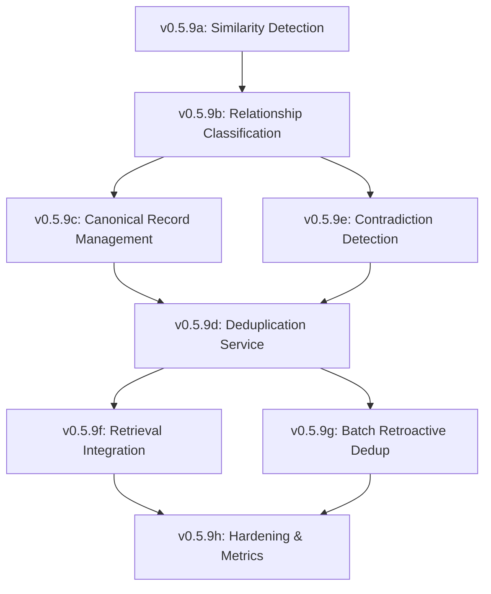

# Lexichord Design Specification Index: v0.5.9 — Semantic Memory Deduplication

**Parent Scope:** [LCS-SCOPE-v0.5.9.md](./LCS-SCOPE-v0.5.9.md)
**Codename:** The Consolidator
**Theme:** Knowledge deduplication and canonical record management
**Status:** Draft
**Last Updated:** 2026-02-03

---

## Overview

This index catalogs all design specifications for the v0.5.9 Semantic Memory Deduplication feature set. Each sub-version addresses a specific component of the deduplication pipeline, from similarity detection through batch processing and observability.

---

## Design Specification Documents

| Sub-Version | Document | Feature Name | Status |
|-------------|----------|--------------|--------|
| v0.5.9a | [LCS-DES-v0.5.9a.md](./LCS-DES-v0.5.9a.md) | Similarity Detection Infrastructure | Complete |
| v0.5.9b | [LCS-DES-v0.5.9b.md](./LCS-DES-v0.5.9b.md) | Relationship Classification | Complete |
| v0.5.9c | [LCS-DES-v0.5.9c.md](./LCS-DES-v0.5.9c.md) | Canonical Record Management | Complete |
| v0.5.9d | [LCS-DES-v0.5.9d.md](./LCS-DES-v0.5.9d.md) | Deduplication Service | Complete |
| v0.5.9e | [LCS-DES-v0.5.9e.md](./LCS-DES-v0.5.9e.md) | Contradiction Detection & Resolution | Complete |
| v0.5.9f | [LCS-DES-v0.5.9f.md](./LCS-DES-v0.5.9f.md) | Retrieval Integration | Complete |
| v0.5.9g | [LCS-DES-v0.5.9g.md](./LCS-DES-v0.5.9g.md) | Batch Retroactive Deduplication | Complete |
| v0.5.9h | [LCS-DES-v0.5.9h.md](./LCS-DES-v0.5.9h.md) | Hardening & Metrics | Draft |

---

## Dependency Graph

---

## Module & License Summary

| Sub-Version | Module Scope | License Tier | Feature Gate Key |
|-------------|--------------|--------------|------------------|
| v0.5.9a | Lexichord.Modules.Rag | Writer Pro | `RAG.Dedup.SimilarityDetection` |
| v0.5.9b | Lexichord.Modules.Rag | Writer Pro | `RAG.Dedup.RelationshipClassifier` |
| v0.5.9c | Lexichord.Modules.Rag | Writer Pro | `RAG.Dedup.CanonicalRecords` |
| v0.5.9d | Lexichord.Modules.Rag | Writer Pro | `RAG.Dedup.Service` |
| v0.5.9e | Lexichord.Modules.Rag | Writer Pro | `RAG.Dedup.ContradictionDetection` |
| v0.5.9f | Lexichord.Modules.Rag | Writer Pro | `RAG.Dedup.RetrievalIntegration` |
| v0.5.9g | Lexichord.Modules.Rag | Teams | `RAG.Dedup.BatchRetroactive` |
| v0.5.9h | Lexichord.Modules.Rag | Writer Pro | `RAG.Dedup.Metrics` |

---

## Schema Changes Summary

All schema changes are consolidated in v0.5.9c (Canonical Record Management):

- `canonical_records` — Links to authoritative chunk
- `chunk_variants` — Tracks merged duplicates
- `chunk_provenance` — Source document tracking

Additional schema in v0.5.9e:

- `contradictions` — Tracks unresolved conflicts

---

## MediatR Events Summary

| Event | Source | Description |
|-------|--------|-------------|
| `ChunkDeduplicatedEvent` | v0.5.9d | Chunk merged into existing canonical |
| `CanonicalRecordCreatedEvent` | v0.5.9c | New canonical record established |
| `ContradictionDetectedEvent` | v0.5.9e | Conflicting information found |
| `ContradictionResolvedEvent` | v0.5.9e | Contradiction manually resolved |
| `BatchDeduplicationCompletedEvent` | v0.5.9g | Retroactive job finished |

---

## Implementation Order

The recommended implementation sequence follows the dependency graph:

1. **Phase 1 (Infrastructure):** v0.5.9a → v0.5.9b
2. **Phase 2 (Core Logic):** v0.5.9c → v0.5.9e → v0.5.9d
3. **Phase 3 (Integration):** v0.5.9f → v0.5.9g
4. **Phase 4 (Hardening):** v0.5.9h

---

## Success Metrics (Overall)

| Metric | Target |
|--------|--------|
| Deduplication Rate | 10-30% of incoming chunks merged |
| Storage Savings | 15-25% reduction in total chunks |
| Retrieval Precision | <5% redundant results |
| False Positive Rate | <1% incorrectly merged |
| Processing Overhead | <50ms per chunk |
