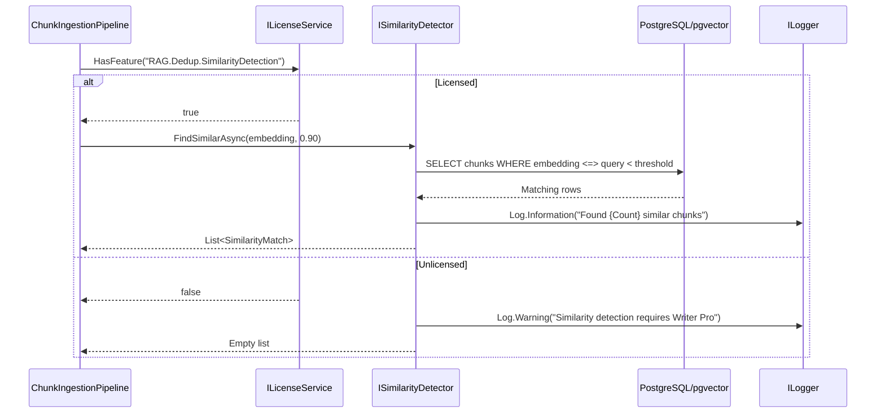

# LDS-01: Feature Design Specification — Similarity Detection Infrastructure

## 1. Metadata & Categorization

| Field | Value | Description |
| :--- | :--- | :--- |
| **Feature ID** | `RAG-DEDUP-01` | Matches the Roadmap ID. |
| **Feature Name** | Similarity Detection Infrastructure | The internal display name. |
| **Target Version** | `v0.5.9a` | The semantic version target. |
| **Module Scope** | `Lexichord.Modules.Rag` | The specific DLL/Project this code lives in. |
| **Swimlane** | Memory | The functional vertical. |
| **License Tier** | Writer Pro | The minimum license required to load this. |
| **Feature Gate Key** | `RAG.Dedup.SimilarityDetection` | The string key used in `ILicenseService`. |
| **Author** | Lexichord Architecture | Primary Architect. |
| **Reviewer** | — | Lead Architect / Peer. |
| **Status** | Draft | Current lifecycle state. |
| **Last Updated** | 2026-02-03 | Date of last modification. |

---

## 2. Executive Summary

### 2.1 The Requirement
As knowledge bases grow, users accumulate semantically equivalent information stated in different words across multiple documents. Without detection infrastructure, the system cannot identify these duplicates, leading to wasted storage, retrieval noise, and context bloat in RAG pipelines.

### 2.2 The Proposed Solution
Implement `ISimilarityDetector`, a service that queries pgvector to find existing chunks similar to a new chunk's embedding. The detector SHALL operate with configurable similarity thresholds and support batch optimization for high-throughput ingestion scenarios.

---

## 3. Architecture & Modular Strategy

### 3.1 Dependencies
*   **Upstream Modules:**
    *   `Lexichord.Host` (Core services, DI container)
    *   `Lexichord.Modules.Rag.Abstractions` (Chunk models, repository interfaces)
*   **NuGet Packages:**
    *   `Npgsql` (PostgreSQL connectivity)
    *   `pgvector` (Vector similarity operations)

### 3.2 Licensing Behavior
*   **Load Behavior:**
    *   [x] **Soft Gate:** The Module loads, but the Service returns empty results for unlicensed users.
*   **Fallback Experience:**
    *   When unlicensed, `FindSimilarAsync` SHALL return an empty list and log a warning. Ingestion continues without deduplication awareness.

---

## 4. Data Contract (The API)

```csharp
namespace Lexichord.Modules.Rag.Deduplication.Abstractions;

/// <summary>
/// Detects semantically similar chunks within the vector store.
/// Used as the first stage of the deduplication pipeline.
/// </summary>
public interface ISimilarityDetector
{
    /// <summary>
    /// Finds existing chunks that are semantically similar to the provided embedding.
    /// </summary>
    /// <param name="embedding">The vector embedding to search against.</param>
    /// <param name="threshold">Minimum cosine similarity score (0.0-1.0). Default: 0.90.</param>
    /// <param name="maxResults">Maximum number of similar chunks to return. Default: 5.</param>
    /// <param name="projectId">Optional project scope filter.</param>
    /// <param name="ct">Cancellation token.</param>
    /// <returns>A ranked list of similarity matches ordered by descending similarity score.</returns>
    /// <exception cref="LicenseException">Thrown if user lacks RAG.Dedup.SimilarityDetection feature.</exception>
    Task<IReadOnlyList<SimilarityMatch>> FindSimilarAsync(
        float[] embedding,
        float threshold = 0.90f,
        int maxResults = 5,
        Guid? projectId = null,
        CancellationToken ct = default);

    /// <summary>
    /// Performs batch similarity detection for multiple embeddings in a single optimized query.
    /// </summary>
    /// <param name="embeddings">Collection of embeddings to search.</param>
    /// <param name="threshold">Minimum cosine similarity score (0.0-1.0). Default: 0.90.</param>
    /// <param name="maxResultsPerEmbedding">Maximum results per embedding. Default: 3.</param>
    /// <param name="projectId">Optional project scope filter.</param>
    /// <param name="ct">Cancellation token.</param>
    /// <returns>Dictionary mapping embedding index to its similarity matches.</returns>
    Task<IReadOnlyDictionary<int, IReadOnlyList<SimilarityMatch>>> FindSimilarBatchAsync(
        IReadOnlyList<float[]> embeddings,
        float threshold = 0.90f,
        int maxResultsPerEmbedding = 3,
        Guid? projectId = null,
        CancellationToken ct = default);
}

/// <summary>
/// Represents a chunk that matches the similarity query.
/// </summary>
/// <param name="ChunkId">The unique identifier of the matched chunk.</param>
/// <param name="SimilarityScore">Cosine similarity score (0.0-1.0).</param>
/// <param name="ContentPreview">First 200 characters of the chunk content for quick inspection.</param>
/// <param name="DocumentId">The source document containing this chunk.</param>
/// <param name="ChunkIndex">The chunk's position within its source document.</param>
public record SimilarityMatch(
    Guid ChunkId,
    float SimilarityScore,
    string ContentPreview,
    Guid? DocumentId = null,
    int? ChunkIndex = null);

/// <summary>
/// Configuration options for the similarity detector.
/// </summary>
public record SimilarityDetectorOptions
{
    /// <summary>
    /// Default similarity threshold for duplicate detection. Default: 0.90.
    /// </summary>
    public float DefaultThreshold { get; init; } = 0.90f;

    /// <summary>
    /// Maximum number of results to return per query. Default: 5.
    /// </summary>
    public int DefaultMaxResults { get; init; } = 5;

    /// <summary>
    /// Maximum batch size for batch queries. Default: 100.
    /// </summary>
    public int MaxBatchSize { get; init; } = 100;

    /// <summary>
    /// Content preview length in characters. Default: 200.
    /// </summary>
    public int ContentPreviewLength { get; init; } = 200;
}
```

---

## 5. Implementation Logic

### 5.1 Flow Diagram (Mermaid)



### 5.2 Key Algorithmic Logic

**Cosine Distance Query:**
The pgvector `<=>` operator computes cosine distance. Similarity = 1 - distance.

```sql
SELECT
    c.id AS chunk_id,
    1 - (c.embedding <=> @query_embedding) AS similarity_score,
    LEFT(c.content, @preview_length) AS content_preview,
    c.document_id,
    c.chunk_index
FROM chunks c
WHERE c.embedding <=> @query_embedding < (1 - @threshold)
  AND (@project_id IS NULL OR c.project_id = @project_id)
ORDER BY c.embedding <=> @query_embedding
LIMIT @max_results;
```

**Batch Optimization Strategy:**
For batch queries, the implementation SHALL use `LATERAL JOIN` to efficiently query multiple embeddings:

```sql
SELECT
    q.idx,
    c.id AS chunk_id,
    1 - (c.embedding <=> q.embedding) AS similarity_score,
    LEFT(c.content, @preview_length) AS content_preview
FROM unnest(@embeddings) WITH ORDINALITY AS q(embedding, idx)
CROSS JOIN LATERAL (
    SELECT id, content, embedding
    FROM chunks
    WHERE embedding <=> q.embedding < (1 - @threshold)
    ORDER BY embedding <=> q.embedding
    LIMIT @max_per_embedding
) c;
```

**Performance Considerations:**
- The existing `chunks_embedding_idx` HNSW index SHALL be leveraged
- Query planner hints may be needed for optimal index usage
- Connection pooling MUST be used for batch operations

---

## 6. Data Persistence (Database)

*   **Migration ID:** None required (uses existing schema)
*   **Module Schema:** `rag`
*   **New Tables / Columns:** None
*   **Vector Storage:** Uses existing `chunks.embedding` column with HNSW index

**Index Verification:**
The implementation SHALL verify the HNSW index exists on startup:
```sql
SELECT indexname FROM pg_indexes
WHERE tablename = 'chunks' AND indexdef LIKE '%hnsw%';
```

---

## 7. UI/UX Specifications

### 7.1 Visual Components
*   **Location:** No direct UI component for v0.5.9a (infrastructure layer)
*   **Admin Panel:** Settings > RAG > Deduplication
    *   Slider: "Similarity Threshold" (0.80 - 0.99, default 0.90)
    *   Checkbox: "Enable similarity detection logging"

### 7.2 Accessibility (A11y)
*   Settings slider MUST have `AutomationProperties.Name="Similarity detection threshold"`
*   Threshold value MUST be announced on change

---

## 8. Observability & Logging

*   **Metric:** `Rag.Dedup.SimilarityQuery.Duration` (Timer)
*   **Metric:** `Rag.Dedup.SimilarityQuery.MatchCount` (Histogram)
*   **Metric:** `Rag.Dedup.SimilarityQuery.BatchSize` (Histogram)

*   **Log (Debug):** `[RAG:DEDUP] Similarity query for embedding dim={Dimension} threshold={Threshold}`
*   **Log (Info):** `[RAG:DEDUP] Found {MatchCount} similar chunks above threshold {Threshold} for chunk ingestion`
*   **Log (Warn):** `[RAG:DEDUP] Similarity detection skipped: feature requires Writer Pro license`
*   **Log (Error):** `[RAG:DEDUP] Similarity query failed after {RetryCount} retries: {ErrorMessage}`

---

## 9. Security & Safety

*   **PII Risk:** Low — Embeddings are vectors, not raw text. Content preview is truncated.
*   **Injection Risk:** None — All parameters are typed (float[], Guid) and not user-supplied strings.
*   **Resource Exhaustion:** Batch size MUST be capped at `MaxBatchSize` (default 100) to prevent DoS via oversized queries.
*   **Data Sovereignty:** All queries remain local to the PostgreSQL instance. No external API calls.

---

## 10. Acceptance Criteria (QA)

1.  **[Functional]** Given a chunk embedding, `FindSimilarAsync` SHALL return chunks with similarity >= threshold, ordered by descending similarity.

2.  **[Functional]** Given a threshold of 0.95, the detector SHALL NOT return chunks with similarity < 0.95.

3.  **[Licensing]** When `ILicenseService.HasFeature("RAG.Dedup.SimilarityDetection")` returns `false`, the method SHALL return an empty list and log a warning.

4.  **[Performance]** Single embedding query SHALL complete in < 50ms for a corpus of 100,000 chunks.

5.  **[Batch]** Batch query of 100 embeddings SHALL complete in < 500ms for a corpus of 100,000 chunks.

6.  **[Edge Case]** When no similar chunks exist above threshold, the method SHALL return an empty list (not null, not exception).

7.  **[Edge Case]** When `maxResults` is 0, the method SHALL throw `ArgumentOutOfRangeException`.

8.  **[Integration]** The detector SHALL integrate with the existing `IChunkRepository` without requiring schema changes.

---

## 11. Test Scenarios

### 11.1 Unit Tests

```gherkin
Scenario: Find similar chunks above threshold
    Given a chunk repository with 5 chunks having embeddings
    And chunk A has similarity 0.92 to the query embedding
    And chunk B has similarity 0.88 to the query embedding
    When FindSimilarAsync is called with threshold 0.90
    Then the result SHALL contain only chunk A
    And the similarity score SHALL be 0.92

Scenario: License check blocks unlicensed users
    Given the user has Core license (no Writer Pro)
    When FindSimilarAsync is called
    Then the result SHALL be an empty list
    And a warning SHALL be logged

Scenario: Batch query returns grouped results
    Given 3 query embeddings
    And each has 2 similar chunks above threshold
    When FindSimilarBatchAsync is called
    Then the result dictionary SHALL have 3 keys
    And each key SHALL map to 2 SimilarityMatch records
```

### 11.2 Integration Tests

```gherkin
Scenario: Similarity detector resolves from DI container
    Given the RAG module is loaded
    When ISimilarityDetector is resolved from IServiceProvider
    Then the service SHALL NOT be null
    And the service SHALL be of type PgVectorSimilarityDetector

Scenario: Query uses HNSW index
    Given 10,000 chunks in the database
    When FindSimilarAsync is called
    Then the query plan SHALL show "Index Scan using chunks_embedding_idx"
```
