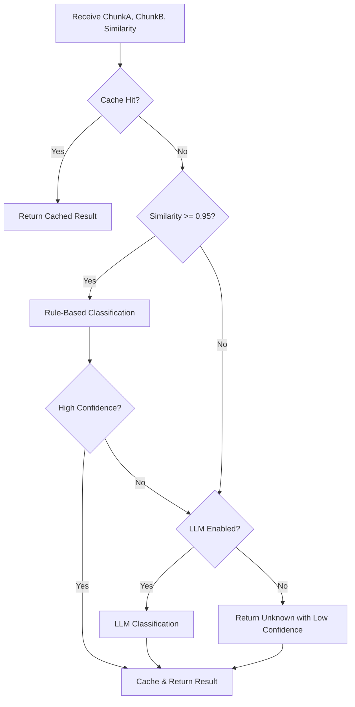

# LDS-01: Feature Design Specification — Relationship Classification

## 1. Metadata & Categorization

| Field | Value | Description |
| :--- | :--- | :--- |
| **Feature ID** | `RAG-DEDUP-02` | Matches the Roadmap ID. |
| **Feature Name** | Relationship Classification | The internal display name. |
| **Target Version** | `v0.5.9b` | The semantic version target. |
| **Module Scope** | `Lexichord.Modules.Rag` | The specific DLL/Project this code lives in. |
| **Swimlane** | Memory | The functional vertical. |
| **License Tier** | Writer Pro | The minimum license required to load this. |
| **Feature Gate Key** | `RAG.Dedup.RelationshipClassifier` | The string key used in `ILicenseService`. |
| **Author** | Lexichord Architecture | Primary Architect. |
| **Reviewer** | — | Lead Architect / Peer. |
| **Status** | Implemented | Current lifecycle state. |
| **Last Updated** | 2026-02-03 | Date of last modification. |

---

## 2. Executive Summary

### 2.1 The Requirement
When two chunks are detected as similar (v0.5.9a), the system cannot blindly merge them. The relationship between chunks varies: they may be true duplicates, complementary information, contradictory statements, or updates to older content. Without classification, the system risks merging unrelated content or missing important contradictions.

### 2.2 The Proposed Solution
Implement `IRelationshipClassifier`, a service that determines the semantic relationship between two similar chunks. The classifier SHALL use a hybrid approach: rule-based fast-path for high-confidence matches (>0.95 similarity) and LLM-based classification for ambiguous cases. Classification results SHALL be cached to minimize redundant LLM calls.

---

## 3. Architecture & Modular Strategy

### 3.1 Dependencies
*   **Upstream Modules:**
    *   `Lexichord.Host` (Core services, DI container)
    *   `Lexichord.Modules.Rag.Abstractions` (Chunk models)
    *   `Lexichord.Modules.Rag.Deduplication` (v0.5.9a - ISimilarityDetector)
*   **NuGet Packages:**
    *   `Microsoft.Extensions.Caching.Memory` (Classification caching)
*   **Optional Dependencies:**
    *   `IChatCompletionService` (For LLM-based classification)

### 3.2 Licensing Behavior
*   **Load Behavior:**
    *   [x] **Soft Gate:** The Module loads, but classification returns `Unknown` for unlicensed users.
*   **Fallback Experience:**
    *   When unlicensed, `ClassifyAsync` SHALL return `RelationshipType.Unknown` with confidence 0.0 and log a warning. The deduplication pipeline SHALL treat unknown relationships conservatively (no auto-merge).

---

## 4. Data Contract (The API)

```csharp
namespace Lexichord.Modules.Rag.Deduplication.Abstractions;

/// <summary>
/// Classifies the semantic relationship between two similar chunks.
/// Determines whether chunks should be merged, linked, or flagged as contradictory.
/// </summary>
public interface IRelationshipClassifier
{
    /// <summary>
    /// Classifies the relationship between two chunks.
    /// </summary>
    /// <param name="chunkA">The first chunk (typically the new/incoming chunk).</param>
    /// <param name="chunkB">The second chunk (typically the existing chunk).</param>
    /// <param name="similarityScore">Pre-computed similarity score from ISimilarityDetector.</param>
    /// <param name="options">Classification options.</param>
    /// <param name="ct">Cancellation token.</param>
    /// <returns>Classification result with relationship type, confidence, and explanation.</returns>
    Task<RelationshipClassification> ClassifyAsync(
        Chunk chunkA,
        Chunk chunkB,
        float similarityScore,
        ClassificationOptions? options = null,
        CancellationToken ct = default);

    /// <summary>
    /// Batch classifies multiple chunk pairs for efficiency.
    /// </summary>
    /// <param name="pairs">Collection of chunk pairs with their similarity scores.</param>
    /// <param name="options">Classification options.</param>
    /// <param name="ct">Cancellation token.</param>
    /// <returns>Classifications indexed by pair position.</returns>
    Task<IReadOnlyList<RelationshipClassification>> ClassifyBatchAsync(
        IReadOnlyList<ChunkPair> pairs,
        ClassificationOptions? options = null,
        CancellationToken ct = default);
}

/// <summary>
/// Represents a pair of chunks to be classified.
/// </summary>
/// <param name="ChunkA">The first chunk.</param>
/// <param name="ChunkB">The second chunk.</param>
/// <param name="SimilarityScore">Pre-computed similarity score.</param>
public record ChunkPair(
    Chunk ChunkA,
    Chunk ChunkB,
    float SimilarityScore);

/// <summary>
/// The result of relationship classification.
/// </summary>
/// <param name="Type">The classified relationship type.</param>
/// <param name="Confidence">Confidence score (0.0-1.0) in the classification.</param>
/// <param name="Explanation">Human-readable explanation of the classification.</param>
/// <param name="ClassificationMethod">Whether rule-based or LLM-based classification was used.</param>
public record RelationshipClassification(
    RelationshipType Type,
    float Confidence,
    string? Explanation,
    ClassificationMethod Method = ClassificationMethod.RuleBased);

/// <summary>
/// Types of semantic relationships between chunks.
/// </summary>
public enum RelationshipType
{
    /// <summary>
    /// Relationship could not be determined (unlicensed or error).
    /// </summary>
    Unknown = 0,

    /// <summary>
    /// Chunks convey the same meaning in different words.
    /// Action: Merge into canonical record.
    /// </summary>
    Equivalent = 1,

    /// <summary>
    /// Chunks contain related information that adds detail to each other.
    /// Action: Link chunks, do not merge.
    /// </summary>
    Complementary = 2,

    /// <summary>
    /// Chunks contain conflicting statements.
    /// Action: Flag for manual resolution.
    /// </summary>
    Contradictory = 3,

    /// <summary>
    /// ChunkA is a newer version of the information in ChunkB.
    /// Action: Replace old with new, archive old.
    /// </summary>
    Superseding = 4,

    /// <summary>
    /// One chunk is a subset of the other's information.
    /// Action: Keep the superset chunk only.
    /// </summary>
    Subset = 5,

    /// <summary>
    /// Chunks are similar but distinct topics.
    /// Action: No merge, no link.
    /// </summary>
    Distinct = 6
}

/// <summary>
/// How the classification was determined.
/// </summary>
public enum ClassificationMethod
{
    /// <summary>
    /// Classification via heuristic rules (fast path).
    /// </summary>
    RuleBased = 0,

    /// <summary>
    /// Classification via LLM analysis.
    /// </summary>
    LlmBased = 1,

    /// <summary>
    /// Classification from cache.
    /// </summary>
    Cached = 2
}

/// <summary>
/// Options controlling classification behavior.
/// </summary>
public record ClassificationOptions
{
    /// <summary>
    /// Similarity threshold above which rule-based classification is used. Default: 0.95.
    /// </summary>
    public float RuleBasedThreshold { get; init; } = 0.95f;

    /// <summary>
    /// Whether to use LLM for ambiguous cases. Default: true.
    /// </summary>
    public bool EnableLlmClassification { get; init; } = true;

    /// <summary>
    /// Whether to cache classification results. Default: true.
    /// </summary>
    public bool EnableCaching { get; init; } = true;

    /// <summary>
    /// Cache duration for classification results. Default: 1 hour.
    /// </summary>
    public TimeSpan CacheDuration { get; init; } = TimeSpan.FromHours(1);

    /// <summary>
    /// Whether to include detailed explanation in results. Default: true.
    /// </summary>
    public bool IncludeExplanation { get; init; } = true;
}
```

---

## 5. Implementation Logic

### 5.1 Flow Diagram (Mermaid)



### 5.2 Key Algorithmic Logic

**Rule-Based Fast Path (>0.95 similarity):**

```csharp
private RelationshipClassification ClassifyByRules(Chunk a, Chunk b, float similarity)
{
    // RULE 1: Near-identical content (>0.98) = Equivalent
    if (similarity >= 0.98f)
    {
        return new RelationshipClassification(
            RelationshipType.Equivalent,
            Confidence: 0.95f,
            Explanation: "Content is nearly identical",
            ClassificationMethod.RuleBased);
    }

    // RULE 2: Check for temporal superseding
    if (a.CreatedAt > b.CreatedAt && similarity >= 0.95f)
    {
        var timeDiff = a.CreatedAt - b.CreatedAt;
        if (timeDiff > TimeSpan.FromDays(7))
        {
            return new RelationshipClassification(
                RelationshipType.Superseding,
                Confidence: 0.80f,
                Explanation: $"Chunk A is {timeDiff.Days} days newer with high similarity",
                ClassificationMethod.RuleBased);
        }
    }

    // RULE 3: Check for subset relationship
    if (IsSubset(a.Content, b.Content))
    {
        return new RelationshipClassification(
            RelationshipType.Subset,
            Confidence: 0.85f,
            Explanation: "Chunk A content is contained within Chunk B",
            ClassificationMethod.RuleBased);
    }

    // RULE 4: Same source document = likely Equivalent or Complementary
    if (a.DocumentId == b.DocumentId)
    {
        return new RelationshipClassification(
            RelationshipType.Complementary,
            Confidence: 0.70f,
            Explanation: "Chunks from same document with high similarity",
            ClassificationMethod.RuleBased);
    }

    // Insufficient confidence for rule-based
    return null; // Fall through to LLM
}
```

**LLM Classification Prompt:**

```csharp
private const string ClassificationPrompt = """
    You are analyzing the relationship between two text chunks from a knowledge base.

    CHUNK A:
    {ChunkAContent}

    CHUNK B:
    {ChunkBContent}

    Similarity Score: {SimilarityScore}

    Classify their relationship as ONE of:
    - EQUIVALENT: Same meaning, different words. Safe to merge.
    - COMPLEMENTARY: Related information that adds detail. Should be linked.
    - CONTRADICTORY: Conflicting statements. Requires human review.
    - SUPERSEDING: Chunk A updates/replaces Chunk B. Keep A, archive B.
    - SUBSET: One contains all information of the other. Keep the larger one.
    - DISTINCT: Similar topic but different facts. Keep both separate.

    Respond in JSON format:
    {
        "type": "<RELATIONSHIP_TYPE>",
        "confidence": <0.0-1.0>,
        "explanation": "<brief explanation>"
    }
    """;
```

**Caching Strategy:**
- Cache key: `SHA256(ChunkA.Id + ChunkB.Id)` (sorted to ensure consistency)
- Cache duration: Configurable, default 1 hour
- Cache invalidation: When either chunk is modified or deleted

---

## 6. Data Persistence (Database)

*   **Migration ID:** None required
*   **Module Schema:** N/A (uses in-memory cache)
*   **New Tables / Columns:** None

**Potential Future Enhancement:**
For enterprise deployments, classification results may be persisted:
```sql
CREATE TABLE classification_cache (
    chunk_a_id UUID NOT NULL,
    chunk_b_id UUID NOT NULL,
    relationship_type TEXT NOT NULL,
    confidence REAL NOT NULL,
    explanation TEXT,
    classified_at TIMESTAMPTZ NOT NULL DEFAULT NOW(),
    PRIMARY KEY (chunk_a_id, chunk_b_id)
);
```

---

## 7. UI/UX Specifications

### 7.1 Visual Components
*   **Location:** No direct UI for v0.5.9b (service layer)
*   **Admin Panel:** Settings > RAG > Deduplication
    *   Slider: "Rule-based threshold" (0.90 - 0.99, default 0.95)
    *   Toggle: "Enable LLM classification for ambiguous cases"
    *   Info text: "LLM classification consumes API tokens"

### 7.2 Accessibility (A11y)
*   Toggle MUST have `AutomationProperties.Name="Enable AI-powered classification"`
*   Info text MUST be associated with toggle via `AutomationProperties.HelpText`

---

## 8. Observability & Logging

*   **Metric:** `Rag.Dedup.Classification.Duration` (Timer, tagged by method)
*   **Metric:** `Rag.Dedup.Classification.CacheHitRate` (Gauge)
*   **Metric:** `Rag.Dedup.Classification.TypeDistribution` (Counter by RelationshipType)
*   **Metric:** `Rag.Dedup.Classification.LlmTokensUsed` (Counter)

*   **Log (Debug):** `[RAG:DEDUP] Classifying relationship between chunks {ChunkAId} and {ChunkBId}, similarity={Similarity}`
*   **Log (Info):** `[RAG:DEDUP] Classified {ChunkAId}<->{ChunkBId} as {RelationshipType} via {Method} (confidence={Confidence})`
*   **Log (Info):** `[RAG:DEDUP] Classification cache hit for chunks {ChunkAId}<->{ChunkBId}`
*   **Log (Warn):** `[RAG:DEDUP] LLM classification failed, falling back to Unknown: {ErrorMessage}`
*   **Log (Warn):** `[RAG:DEDUP] Relationship classification requires Writer Pro license`

---

## 9. Security & Safety

*   **PII Risk:** Medium — Chunk content is sent to LLM for classification. Content preview in logs MUST be truncated.
*   **Injection Risk:** Low — Chunk content is inserted into structured prompts, not executed. However, prompt injection attempts SHALL be logged.
*   **LLM Cost Control:**
    *   Batch classification MUST aggregate similar pairs
    *   Rule-based fast path reduces LLM calls by ~60% for typical workloads
    *   Classification caching prevents redundant LLM calls
*   **Data Sovereignty:** LLM classification sends content to configured AI provider. Users MUST be informed via settings UI.

---

## 10. Acceptance Criteria (QA)

1.  **[Functional]** Given chunks with similarity >= 0.98, the classifier SHALL return `Equivalent` via rule-based method without LLM call.

2.  **[Functional]** Given chunks with similarity between 0.90-0.95, the classifier SHALL use LLM classification when enabled.

3.  **[Functional]** Given contradictory chunks, the classifier SHALL return `Contradictory` with explanation.

4.  **[Caching]** Given a previously classified pair, the second call SHALL return from cache with `Method=Cached`.

5.  **[Licensing]** When user lacks Writer Pro license, `ClassifyAsync` SHALL return `RelationshipType.Unknown` with confidence 0.0.

6.  **[Performance]** Rule-based classification SHALL complete in < 5ms.

7.  **[Fallback]** When LLM service is unavailable, the classifier SHALL fall back to rule-based with reduced confidence.

8.  **[Edge Case]** When chunks are identical (similarity = 1.0), the classifier SHALL return `Equivalent` with confidence 1.0.

---

## 11. Test Scenarios

### 11.1 Unit Tests

```gherkin
Scenario: Near-identical chunks classified as Equivalent
    Given chunk A with content "The quick brown fox jumps over the lazy dog"
    And chunk B with content "The quick brown fox jumps over the lazy dog."
    And similarity score of 0.99
    When ClassifyAsync is called
    Then the result type SHALL be Equivalent
    And the method SHALL be RuleBased
    And confidence SHALL be >= 0.95

Scenario: Temporal superseding detection
    Given chunk A created on 2026-02-01
    And chunk B created on 2026-01-01
    And similarity score of 0.96
    When ClassifyAsync is called
    Then the result type SHALL be Superseding
    And explanation SHALL mention the time difference

Scenario: Cache returns previous classification
    Given chunks A and B were classified as Complementary 10 minutes ago
    When ClassifyAsync is called for the same pair
    Then the result SHALL be Complementary
    And the method SHALL be Cached
    And no LLM call SHALL be made

Scenario: LLM classification for ambiguous similarity
    Given similarity score of 0.91
    And LLM classification is enabled
    When ClassifyAsync is called
    Then the LLM service SHALL be invoked
    And the method SHALL be LlmBased
```

### 11.2 Integration Tests

```gherkin
Scenario: Relationship classifier resolves from DI container
    Given the RAG module is loaded
    When IRelationshipClassifier is resolved from IServiceProvider
    Then the service SHALL NOT be null

Scenario: End-to-end classification with LLM
    Given two chunks with conflicting information
    And LLM service is configured
    When ClassifyAsync is called
    Then the result SHALL be Contradictory
    And explanation SHALL describe the conflict
```
