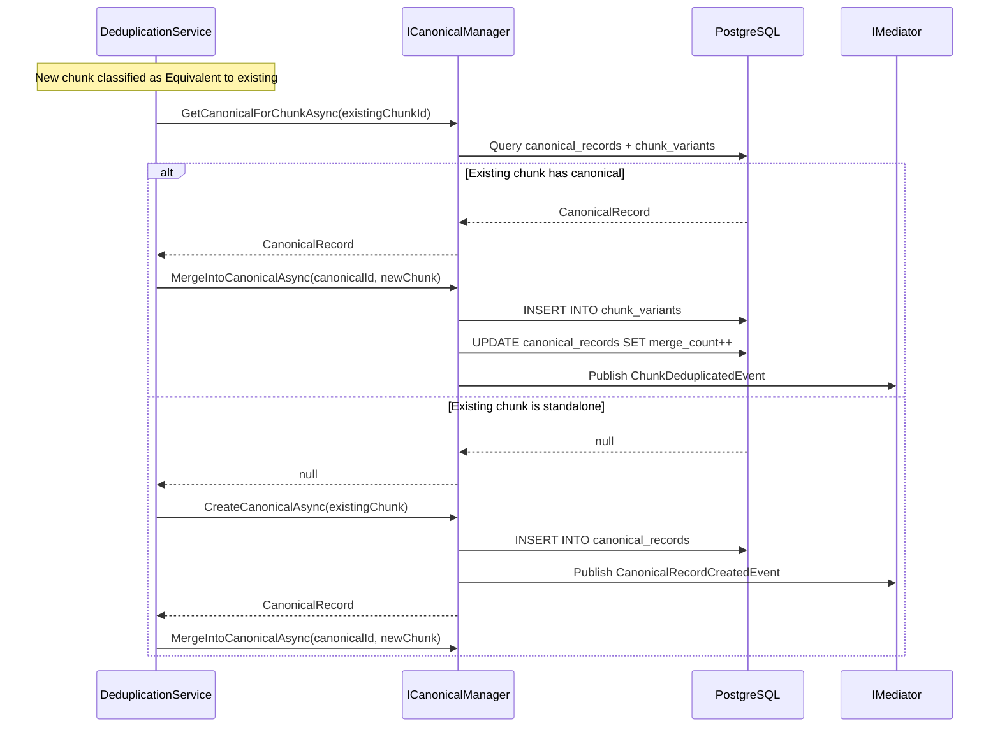

# LDS-01: Feature Design Specification — Canonical Record Management

## 1. Metadata & Categorization

| Field | Value | Description |
| :--- | :--- | :--- |
| **Feature ID** | `RAG-DEDUP-03` | Matches the Roadmap ID. |
| **Feature Name** | Canonical Record Management | The internal display name. |
| **Target Version** | `v0.5.9c` | The semantic version target. |
| **Module Scope** | `Lexichord.Modules.Rag` | The specific DLL/Project this code lives in. |
| **Swimlane** | Memory | The functional vertical. |
| **License Tier** | Writer Pro | The minimum license required to load this. |
| **Feature Gate Key** | `RAG.Dedup.CanonicalRecords` | The string key used in `ILicenseService`. |
| **Author** | Lexichord Architecture | Primary Architect. |
| **Reviewer** | — | Lead Architect / Peer. |
| **Status** | Draft | Current lifecycle state. |
| **Last Updated** | 2026-02-03 | Date of last modification. |

---

## 2. Executive Summary

### 2.1 The Requirement
When the system identifies equivalent chunks, it needs a data structure to represent the canonical (authoritative) version while tracking all merged variants. Without this, deduplication cannot track provenance, the system cannot show users which sources contributed to a fact, and retrieval cannot distinguish canonical from duplicate content.

### 2.2 The Proposed Solution
Implement a canonical record management system with three database tables (`canonical_records`, `chunk_variants`, `chunk_provenance`) and an `ICanonicalManager` service for CRUD operations. Each unique fact SHALL have exactly one canonical record linking to the authoritative chunk, with all merged variants tracked for provenance and potential rollback.

---

## 3. Architecture & Modular Strategy

### 3.1 Dependencies
*   **Upstream Modules:**
    *   `Lexichord.Host` (Core services, DI container)
    *   `Lexichord.Modules.Rag.Abstractions` (Chunk models, IChunkRepository)
    *   `Lexichord.Modules.Rag.Deduplication` (v0.5.9b - IRelationshipClassifier)
*   **NuGet Packages:**
    *   `FluentMigrator` (Schema migrations)
    *   `Dapper` (Efficient data access)

### 3.2 Licensing Behavior
*   **Load Behavior:**
    *   [x] **Soft Gate:** The Module loads, but operations return errors for unlicensed users.
*   **Fallback Experience:**
    *   When unlicensed, `CreateCanonicalAsync` SHALL throw `LicenseRequiredException`. The UI SHALL display "Canonical record management requires Writer Pro" with an upgrade prompt.

---

## 4. Data Contract (The API)

```csharp
namespace Lexichord.Modules.Rag.Deduplication.Abstractions;

/// <summary>
/// Manages canonical records representing unique facts in the knowledge base.
/// Tracks merged variants and provenance information.
/// </summary>
public interface ICanonicalManager
{
    /// <summary>
    /// Creates a new canonical record for a chunk that has no existing equivalent.
    /// </summary>
    /// <param name="chunk">The chunk to establish as canonical.</param>
    /// <param name="ct">Cancellation token.</param>
    /// <returns>The created canonical record.</returns>
    /// <exception cref="LicenseRequiredException">Thrown if user lacks required license.</exception>
    /// <exception cref="DuplicateCanonicalException">Thrown if chunk already has a canonical record.</exception>
    Task<CanonicalRecord> CreateCanonicalAsync(
        Chunk chunk,
        CancellationToken ct = default);

    /// <summary>
    /// Merges a variant chunk into an existing canonical record.
    /// </summary>
    /// <param name="canonicalId">The target canonical record ID.</param>
    /// <param name="variant">The chunk being merged as a variant.</param>
    /// <param name="relationshipType">The classified relationship type.</param>
    /// <param name="similarityScore">The similarity score that triggered the merge.</param>
    /// <param name="ct">Cancellation token.</param>
    /// <exception cref="CanonicalNotFoundException">Thrown if canonical record does not exist.</exception>
    Task MergeIntoCanonicalAsync(
        Guid canonicalId,
        Chunk variant,
        RelationshipType relationshipType,
        float similarityScore,
        CancellationToken ct = default);

    /// <summary>
    /// Retrieves the canonical record for a given chunk, if one exists.
    /// </summary>
    /// <param name="chunkId">The chunk ID to look up.</param>
    /// <param name="ct">Cancellation token.</param>
    /// <returns>The canonical record if the chunk is canonical or a variant; null otherwise.</returns>
    Task<CanonicalRecord?> GetCanonicalForChunkAsync(
        Guid chunkId,
        CancellationToken ct = default);

    /// <summary>
    /// Retrieves all variant chunks merged into a canonical record.
    /// </summary>
    /// <param name="canonicalId">The canonical record ID.</param>
    /// <param name="ct">Cancellation token.</param>
    /// <returns>List of variant chunks with their merge metadata.</returns>
    Task<IReadOnlyList<ChunkVariant>> GetVariantsAsync(
        Guid canonicalId,
        CancellationToken ct = default);

    /// <summary>
    /// Promotes a variant to become the new canonical chunk.
    /// Useful when the variant is determined to be more accurate/complete.
    /// </summary>
    /// <param name="canonicalId">The canonical record ID.</param>
    /// <param name="newCanonicalChunkId">The variant chunk to promote.</param>
    /// <param name="reason">Reason for the promotion.</param>
    /// <param name="ct">Cancellation token.</param>
    Task PromoteVariantAsync(
        Guid canonicalId,
        Guid newCanonicalChunkId,
        string reason,
        CancellationToken ct = default);

    /// <summary>
    /// Removes a variant from a canonical record, restoring it as independent.
    /// </summary>
    /// <param name="variantChunkId">The variant chunk to detach.</param>
    /// <param name="ct">Cancellation token.</param>
    Task DetachVariantAsync(
        Guid variantChunkId,
        CancellationToken ct = default);

    /// <summary>
    /// Records provenance information for a chunk.
    /// </summary>
    /// <param name="chunkId">The chunk ID.</param>
    /// <param name="provenance">The provenance details.</param>
    /// <param name="ct">Cancellation token.</param>
    Task RecordProvenanceAsync(
        Guid chunkId,
        ChunkProvenance provenance,
        CancellationToken ct = default);

    /// <summary>
    /// Retrieves provenance information for a canonical record and its variants.
    /// </summary>
    /// <param name="canonicalId">The canonical record ID.</param>
    /// <param name="ct">Cancellation token.</param>
    /// <returns>Provenance information for the canonical chunk and all variants.</returns>
    Task<IReadOnlyList<ChunkProvenance>> GetProvenanceAsync(
        Guid canonicalId,
        CancellationToken ct = default);
}

/// <summary>
/// Represents a canonical record - the authoritative version of a unique fact.
/// </summary>
public record CanonicalRecord
{
    /// <summary>
    /// Unique identifier of the canonical record.
    /// </summary>
    public Guid Id { get; init; }

    /// <summary>
    /// The chunk designated as the authoritative representation.
    /// </summary>
    public Guid CanonicalChunkId { get; init; }

    /// <summary>
    /// When the canonical record was created.
    /// </summary>
    public DateTimeOffset CreatedAt { get; init; }

    /// <summary>
    /// When the canonical record was last updated (variant added, promoted, etc.).
    /// </summary>
    public DateTimeOffset UpdatedAt { get; init; }

    /// <summary>
    /// Number of variants merged into this canonical (including the original).
    /// </summary>
    public int MergeCount { get; init; }

    /// <summary>
    /// The canonical chunk entity (populated when requested).
    /// </summary>
    public Chunk? CanonicalChunk { get; init; }
}

/// <summary>
/// Represents a chunk variant merged into a canonical record.
/// </summary>
public record ChunkVariant
{
    /// <summary>
    /// Unique identifier of the variant record.
    /// </summary>
    public Guid Id { get; init; }

    /// <summary>
    /// The canonical record this variant belongs to.
    /// </summary>
    public Guid CanonicalRecordId { get; init; }

    /// <summary>
    /// The variant chunk ID.
    /// </summary>
    public Guid VariantChunkId { get; init; }

    /// <summary>
    /// The relationship type that caused the merge.
    /// </summary>
    public RelationshipType RelationshipType { get; init; }

    /// <summary>
    /// Similarity score at time of merge.
    /// </summary>
    public float SimilarityScore { get; init; }

    /// <summary>
    /// When the variant was merged.
    /// </summary>
    public DateTimeOffset MergedAt { get; init; }

    /// <summary>
    /// The variant chunk entity (populated when requested).
    /// </summary>
    public Chunk? Chunk { get; init; }
}

/// <summary>
/// Tracks the origin of a chunk for provenance purposes.
/// </summary>
public record ChunkProvenance
{
    /// <summary>
    /// Unique identifier.
    /// </summary>
    public Guid Id { get; init; }

    /// <summary>
    /// The chunk this provenance describes.
    /// </summary>
    public Guid ChunkId { get; init; }

    /// <summary>
    /// The source document ID (if applicable).
    /// </summary>
    public Guid? SourceDocumentId { get; init; }

    /// <summary>
    /// Location within the source (page number, section, URL fragment).
    /// </summary>
    public string? SourceLocation { get; init; }

    /// <summary>
    /// When the chunk was ingested.
    /// </summary>
    public DateTimeOffset IngestedAt { get; init; }

    /// <summary>
    /// When the information was verified (if applicable).
    /// </summary>
    public DateTimeOffset? VerifiedAt { get; init; }

    /// <summary>
    /// User or process that verified the information.
    /// </summary>
    public string? VerifiedBy { get; init; }
}
```

---

## 5. Implementation Logic

### 5.1 Flow Diagram (Mermaid)



### 5.2 Key Algorithmic Logic

**Canonical Lookup Strategy:**
A chunk can be either the canonical chunk or a variant. The lookup must check both:

```csharp
public async Task<CanonicalRecord?> GetCanonicalForChunkAsync(Guid chunkId, CancellationToken ct)
{
    const string sql = """
        SELECT cr.*, c.content, c.embedding
        FROM canonical_records cr
        JOIN chunks c ON c.id = cr.canonical_chunk_id
        WHERE cr.canonical_chunk_id = @ChunkId

        UNION

        SELECT cr.*, c.content, c.embedding
        FROM canonical_records cr
        JOIN chunk_variants cv ON cv.canonical_record_id = cr.id
        JOIN chunks c ON c.id = cr.canonical_chunk_id
        WHERE cv.variant_chunk_id = @ChunkId
        """;

    return await _connection.QuerySingleOrDefaultAsync<CanonicalRecord>(sql, new { ChunkId = chunkId });
}
```

**Merge Atomicity:**
Merging a variant MUST be atomic to prevent orphaned variants:

```csharp
public async Task MergeIntoCanonicalAsync(
    Guid canonicalId, Chunk variant, RelationshipType type, float similarity, CancellationToken ct)
{
    await using var transaction = await _connection.BeginTransactionAsync(ct);

    try
    {
        // Insert variant record
        await _connection.ExecuteAsync("""
            INSERT INTO chunk_variants (id, canonical_record_id, variant_chunk_id, relationship_type, similarity_score, merged_at)
            VALUES (@Id, @CanonicalId, @VariantChunkId, @RelationshipType, @SimilarityScore, NOW())
            """, new {
                Id = Guid.NewGuid(),
                CanonicalId = canonicalId,
                VariantChunkId = variant.Id,
                RelationshipType = type.ToString(),
                SimilarityScore = similarity
            }, transaction);

        // Update merge count
        await _connection.ExecuteAsync("""
            UPDATE canonical_records
            SET merge_count = merge_count + 1, updated_at = NOW()
            WHERE id = @CanonicalId
            """, new { CanonicalId = canonicalId }, transaction);

        await transaction.CommitAsync(ct);

        // Publish event after commit
        await _mediator.Publish(new ChunkDeduplicatedEvent(canonicalId, variant.Id, type, similarity), ct);
    }
    catch
    {
        await transaction.RollbackAsync(ct);
        throw;
    }
}
```

**Promotion Logic:**
When promoting a variant, the system swaps the canonical chunk reference:

```csharp
public async Task PromoteVariantAsync(Guid canonicalId, Guid newCanonicalChunkId, string reason, CancellationToken ct)
{
    await using var transaction = await _connection.BeginTransactionAsync(ct);

    // Get current canonical chunk
    var current = await _connection.QuerySingleAsync<Guid>(
        "SELECT canonical_chunk_id FROM canonical_records WHERE id = @Id",
        new { Id = canonicalId }, transaction);

    // Move current canonical to variants
    await _connection.ExecuteAsync("""
        INSERT INTO chunk_variants (id, canonical_record_id, variant_chunk_id, relationship_type, similarity_score, merged_at)
        VALUES (@Id, @CanonicalId, @VariantChunkId, 'Demoted', 1.0, NOW())
        """, new { Id = Guid.NewGuid(), CanonicalId = canonicalId, VariantChunkId = current }, transaction);

    // Remove new canonical from variants
    await _connection.ExecuteAsync(
        "DELETE FROM chunk_variants WHERE variant_chunk_id = @ChunkId",
        new { ChunkId = newCanonicalChunkId }, transaction);

    // Update canonical record
    await _connection.ExecuteAsync("""
        UPDATE canonical_records
        SET canonical_chunk_id = @NewChunkId, updated_at = NOW()
        WHERE id = @Id
        """, new { Id = canonicalId, NewChunkId = newCanonicalChunkId }, transaction);

    await transaction.CommitAsync(ct);

    _logger.LogInformation("[RAG:DEDUP] Promoted variant {NewChunkId} to canonical for record {CanonicalId}. Reason: {Reason}",
        newCanonicalChunkId, canonicalId, reason);
}
```

---

## 6. Data Persistence (Database)

*   **Migration ID:** `20260203_1200_AddCanonicalRecordTables`
*   **Module Schema:** `rag`

### Schema Definition

```sql
-- Migration: 20260203_1200_AddCanonicalRecordTables

-- Canonical records table
CREATE TABLE canonical_records (
    id UUID PRIMARY KEY DEFAULT gen_random_uuid(),
    canonical_chunk_id UUID NOT NULL REFERENCES chunks(id) ON DELETE CASCADE,
    created_at TIMESTAMPTZ NOT NULL DEFAULT NOW(),
    updated_at TIMESTAMPTZ NOT NULL DEFAULT NOW(),
    merge_count INTEGER NOT NULL DEFAULT 1,
    CONSTRAINT uq_canonical_chunk UNIQUE (canonical_chunk_id)
);

CREATE INDEX idx_canonical_records_chunk ON canonical_records(canonical_chunk_id);
CREATE INDEX idx_canonical_records_updated ON canonical_records(updated_at DESC);

-- Chunk variants table
CREATE TABLE chunk_variants (
    id UUID PRIMARY KEY DEFAULT gen_random_uuid(),
    canonical_record_id UUID NOT NULL REFERENCES canonical_records(id) ON DELETE CASCADE,
    variant_chunk_id UUID NOT NULL REFERENCES chunks(id) ON DELETE CASCADE,
    relationship_type TEXT NOT NULL,
    similarity_score REAL NOT NULL,
    merged_at TIMESTAMPTZ NOT NULL DEFAULT NOW(),
    CONSTRAINT uq_variant_chunk UNIQUE (variant_chunk_id)
);

CREATE INDEX idx_chunk_variants_canonical ON chunk_variants(canonical_record_id);
CREATE INDEX idx_chunk_variants_variant ON chunk_variants(variant_chunk_id);

-- Chunk provenance table
CREATE TABLE chunk_provenance (
    id UUID PRIMARY KEY DEFAULT gen_random_uuid(),
    chunk_id UUID NOT NULL REFERENCES chunks(id) ON DELETE CASCADE,
    source_document_id UUID REFERENCES documents(id) ON DELETE SET NULL,
    source_location TEXT,
    ingested_at TIMESTAMPTZ NOT NULL DEFAULT NOW(),
    verified_at TIMESTAMPTZ,
    verified_by TEXT
);

CREATE INDEX idx_chunk_provenance_chunk ON chunk_provenance(chunk_id);
CREATE INDEX idx_chunk_provenance_document ON chunk_provenance(source_document_id);

-- Add comment annotations
COMMENT ON TABLE canonical_records IS 'Tracks the authoritative representation of unique facts';
COMMENT ON TABLE chunk_variants IS 'Tracks chunks merged into canonical records as duplicates';
COMMENT ON TABLE chunk_provenance IS 'Tracks the origin and verification of chunk content';
```

### FluentMigrator Implementation

```csharp
[Migration(202602031200)]
public class AddCanonicalRecordTables : Migration
{
    public override void Up()
    {
        Create.Table("canonical_records")
            .WithColumn("id").AsGuid().PrimaryKey().WithDefault(SystemMethods.NewGuid)
            .WithColumn("canonical_chunk_id").AsGuid().NotNullable()
                .ForeignKey("fk_canonical_chunk", "chunks", "id").OnDelete(Rule.Cascade)
            .WithColumn("created_at").AsDateTimeOffset().NotNullable().WithDefault(SystemMethods.CurrentUTCDateTime)
            .WithColumn("updated_at").AsDateTimeOffset().NotNullable().WithDefault(SystemMethods.CurrentUTCDateTime)
            .WithColumn("merge_count").AsInt32().NotNullable().WithDefaultValue(1);

        Create.UniqueConstraint("uq_canonical_chunk")
            .OnTable("canonical_records").Column("canonical_chunk_id");

        Create.Index("idx_canonical_records_chunk")
            .OnTable("canonical_records").OnColumn("canonical_chunk_id");

        Create.Table("chunk_variants")
            .WithColumn("id").AsGuid().PrimaryKey().WithDefault(SystemMethods.NewGuid)
            .WithColumn("canonical_record_id").AsGuid().NotNullable()
                .ForeignKey("fk_variant_canonical", "canonical_records", "id").OnDelete(Rule.Cascade)
            .WithColumn("variant_chunk_id").AsGuid().NotNullable()
                .ForeignKey("fk_variant_chunk", "chunks", "id").OnDelete(Rule.Cascade)
            .WithColumn("relationship_type").AsString(50).NotNullable()
            .WithColumn("similarity_score").AsFloat().NotNullable()
            .WithColumn("merged_at").AsDateTimeOffset().NotNullable().WithDefault(SystemMethods.CurrentUTCDateTime);

        Create.UniqueConstraint("uq_variant_chunk")
            .OnTable("chunk_variants").Column("variant_chunk_id");

        Create.Table("chunk_provenance")
            .WithColumn("id").AsGuid().PrimaryKey().WithDefault(SystemMethods.NewGuid)
            .WithColumn("chunk_id").AsGuid().NotNullable()
                .ForeignKey("fk_provenance_chunk", "chunks", "id").OnDelete(Rule.Cascade)
            .WithColumn("source_document_id").AsGuid().Nullable()
                .ForeignKey("fk_provenance_document", "documents", "id").OnDelete(Rule.SetNull)
            .WithColumn("source_location").AsString(500).Nullable()
            .WithColumn("ingested_at").AsDateTimeOffset().NotNullable().WithDefault(SystemMethods.CurrentUTCDateTime)
            .WithColumn("verified_at").AsDateTimeOffset().Nullable()
            .WithColumn("verified_by").AsString(100).Nullable();
    }

    public override void Down()
    {
        Delete.Table("chunk_provenance");
        Delete.Table("chunk_variants");
        Delete.Table("canonical_records");
    }
}
```

---

## 7. UI/UX Specifications

### 7.1 Visual Components

*   **Location:** Search Results > Chunk Card > "Sources" expansion
*   **Controls:**
    *   Expandable "View Sources" link showing provenance
    *   Badge: "Merged from N sources" when merge_count > 1
    *   "Variants" accordion listing all merged chunks
    *   "Promote" button (admin only) to change canonical chunk

*   **Admin Panel:** Settings > RAG > Canonical Records
    *   Table view of all canonical records
    *   Columns: ID, Content Preview, Merge Count, Created, Updated
    *   Actions: View Variants, Promote Variant, Detach Variant

### 7.2 Accessibility (A11y)

*   "View Sources" link MUST have `role="button"` and `aria-expanded` state
*   Variants list MUST be keyboard navigable
*   "Promote" action MUST have confirmation dialog with focus trap

---

## 8. Observability & Logging

*   **Metric:** `Rag.Dedup.CanonicalRecords.Count` (Gauge)
*   **Metric:** `Rag.Dedup.CanonicalRecords.AverageMergeCount` (Gauge)
*   **Metric:** `Rag.Dedup.Variants.TotalCount` (Gauge)
*   **Metric:** `Rag.Dedup.Operations.Duration` (Timer by operation type)

*   **Log (Info):** `[RAG:DEDUP] Created canonical record {CanonicalId} for chunk {ChunkId}`
*   **Log (Info):** `[RAG:DEDUP] Merged variant {VariantChunkId} into canonical {CanonicalId} (type={RelationshipType}, similarity={Score})`
*   **Log (Info):** `[RAG:DEDUP] Promoted variant {NewChunkId} to canonical for record {CanonicalId}`
*   **Log (Warn):** `[RAG:DEDUP] Attempted to create canonical for chunk {ChunkId} that already has canonical record {ExistingId}`
*   **Log (Error):** `[RAG:DEDUP] Failed to merge variant: {ErrorMessage}`

---

## 9. Security & Safety

*   **PII Risk:** Low — Canonical records contain references (GUIDs), not content directly.
*   **Authorization:** Promote and Detach operations MUST require admin role.
*   **Audit Trail:** All modifications to canonical records SHALL be logged with user ID.
*   **Data Integrity:**
    *   Foreign key constraints prevent orphaned variants
    *   Unique constraints prevent double-canonicalization
    *   Transactions ensure atomic operations

---

## 10. Acceptance Criteria (QA)

1.  **[Functional]** Given a new chunk with no duplicates, `CreateCanonicalAsync` SHALL create a canonical record with merge_count=1.

2.  **[Functional]** Given an equivalent chunk, `MergeIntoCanonicalAsync` SHALL increment merge_count and create a variant record.

3.  **[Functional]** Given a chunk that is a variant, `GetCanonicalForChunkAsync` SHALL return its canonical record.

4.  **[Functional]** Given a canonical record with 3 variants, `GetVariantsAsync` SHALL return all 3 variant records.

5.  **[Promotion]** After `PromoteVariantAsync`, the previous canonical SHALL become a variant and the promoted variant SHALL become canonical.

6.  **[Detach]** After `DetachVariantAsync`, the variant chunk SHALL no longer appear in `GetVariantsAsync` and SHALL NOT have a canonical record.

7.  **[Provenance]** `GetProvenanceAsync` SHALL return provenance for the canonical chunk and all variants.

8.  **[Constraint]** Attempting to create a canonical for a chunk that already has one SHALL throw `DuplicateCanonicalException`.

---

## 11. Test Scenarios

### 11.1 Unit Tests

```gherkin
Scenario: Create canonical record for new chunk
    Given a chunk with ID "chunk-001" exists
    And the chunk has no canonical record
    When CreateCanonicalAsync is called with chunk-001
    Then a canonical record SHALL be created
    And the canonical_chunk_id SHALL be "chunk-001"
    And merge_count SHALL be 1
    And CanonicalRecordCreatedEvent SHALL be published

Scenario: Merge variant into existing canonical
    Given canonical record "canonical-001" exists for chunk "chunk-001"
    And chunk "chunk-002" is classified as Equivalent to chunk-001
    When MergeIntoCanonicalAsync is called
    Then a chunk_variant record SHALL be created
    And the variant_chunk_id SHALL be "chunk-002"
    And the canonical's merge_count SHALL be 2
    And ChunkDeduplicatedEvent SHALL be published

Scenario: Lookup canonical for variant chunk
    Given chunk "chunk-002" is a variant of canonical "canonical-001"
    When GetCanonicalForChunkAsync is called with "chunk-002"
    Then the returned record SHALL be "canonical-001"

Scenario: Promote variant to canonical
    Given canonical "canonical-001" has chunk-001 as canonical
    And chunk-002 is a variant
    When PromoteVariantAsync is called with chunk-002
    Then chunk-002 SHALL become the canonical_chunk_id
    And chunk-001 SHALL become a variant with relationship_type "Demoted"
```

### 11.2 Integration Tests

```gherkin
Scenario: Database migration creates tables correctly
    Given a fresh database
    When migration 20260203_1200_AddCanonicalRecordTables runs
    Then table canonical_records SHALL exist with expected columns
    And table chunk_variants SHALL exist with expected columns
    And table chunk_provenance SHALL exist with expected columns
    And foreign key constraints SHALL be enforced

Scenario: Concurrent merge operations are serialized
    Given canonical "canonical-001" with merge_count=1
    When two MergeIntoCanonicalAsync calls execute concurrently
    Then merge_count SHALL be 3 (not 2)
    And two variant records SHALL exist
```

---

## 12. MediatR Events

```csharp
namespace Lexichord.Modules.Rag.Deduplication.Events;

/// <summary>
/// Published when a new canonical record is created.
/// </summary>
public record CanonicalRecordCreatedEvent(
    Guid CanonicalRecordId,
    Guid ChunkId,
    DateTimeOffset CreatedAt) : INotification;

/// <summary>
/// Published when a chunk is merged as a variant into a canonical record.
/// </summary>
public record ChunkDeduplicatedEvent(
    Guid CanonicalRecordId,
    Guid VariantChunkId,
    RelationshipType RelationshipType,
    float SimilarityScore) : INotification;

/// <summary>
/// Published when a variant is promoted to canonical.
/// </summary>
public record VariantPromotedEvent(
    Guid CanonicalRecordId,
    Guid OldCanonicalChunkId,
    Guid NewCanonicalChunkId,
    string Reason) : INotification;

/// <summary>
/// Published when a variant is detached from its canonical record.
/// </summary>
public record VariantDetachedEvent(
    Guid CanonicalRecordId,
    Guid DetachedChunkId) : INotification;
```
