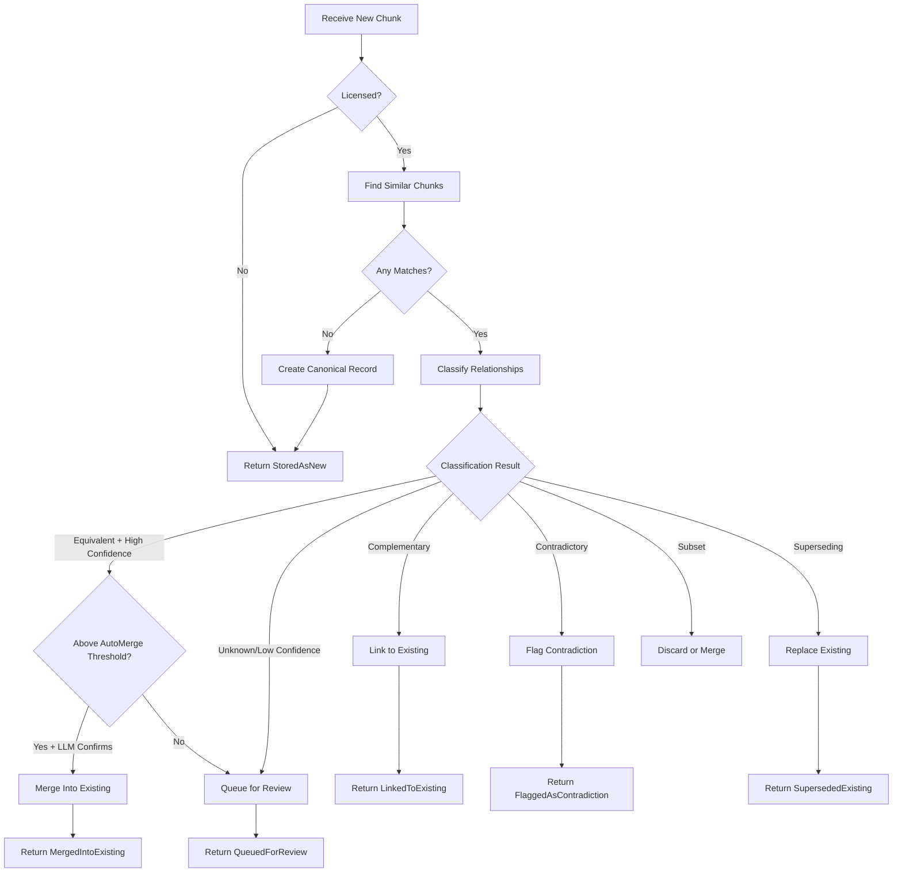

# LDS-01: Feature Design Specification — Deduplication Service

## 1. Metadata & Categorization

| Field | Value | Description |
| :--- | :--- | :--- |
| **Feature ID** | `RAG-DEDUP-04` | Matches the Roadmap ID. |
| **Feature Name** | Deduplication Service | The internal display name. |
| **Target Version** | `v0.5.9d` | The semantic version target. |
| **Module Scope** | `Lexichord.Modules.Rag` | The specific DLL/Project this code lives in. |
| **Swimlane** | Memory | The functional vertical. |
| **License Tier** | Writer Pro | The minimum license required to load this. |
| **Feature Gate Key** | `RAG.Dedup.Service` | The string key used in `ILicenseService`. |
| **Author** | Lexichord Architecture | Primary Architect. |
| **Reviewer** | — | Lead Architect / Peer. |
| **Status** | Draft | Current lifecycle state. |
| **Last Updated** | 2026-02-03 | Date of last modification. |

---

## 2. Executive Summary

### 2.1 The Requirement
The deduplication pipeline has discrete components (similarity detection, relationship classification, canonical management, contradiction detection) that must be orchestrated during chunk ingestion. Without a unified service, each ingestion pathway would need to implement the deduplication logic independently, leading to inconsistent behavior and code duplication.

### 2.2 The Proposed Solution
Implement `IDeduplicationService` as the main orchestrator that coordinates the full deduplication pipeline. The service SHALL integrate with the chunk ingestion pipeline, process incoming chunks against existing content, and return actionable results (stored as new, merged, linked, flagged, or queued for review).

---

## 3. Architecture & Modular Strategy

### 3.1 Dependencies
*   **Upstream Modules:**
    *   `Lexichord.Host` (Core services, DI container)
    *   `Lexichord.Modules.Rag.Abstractions` (Chunk models, IChunkRepository)
    *   `Lexichord.Modules.Rag.Deduplication` (v0.5.9a - ISimilarityDetector)
    *   `Lexichord.Modules.Rag.Deduplication` (v0.5.9b - IRelationshipClassifier)
    *   `Lexichord.Modules.Rag.Deduplication` (v0.5.9c - ICanonicalManager)
    *   `Lexichord.Modules.Rag.Deduplication` (v0.5.9e - IContradictionService)
*   **NuGet Packages:**
    *   `MediatR` (Event publishing)

### 3.2 Licensing Behavior
*   **Load Behavior:**
    *   [x] **Soft Gate:** The Module loads, but deduplication is bypassed for unlicensed users.
*   **Fallback Experience:**
    *   When unlicensed, `ProcessChunkAsync` SHALL return `DeduplicationAction.StoredAsNew` without performing any deduplication checks. Chunks are stored normally as if deduplication were disabled.

---

## 4. Data Contract (The API)

```csharp
namespace Lexichord.Modules.Rag.Deduplication.Abstractions;

/// <summary>
/// Orchestrates the full deduplication pipeline during chunk ingestion.
/// Coordinates similarity detection, relationship classification, and canonical management.
/// </summary>
public interface IDeduplicationService
{
    /// <summary>
    /// Processes a new chunk through the deduplication pipeline.
    /// </summary>
    /// <param name="newChunk">The chunk being ingested.</param>
    /// <param name="options">Deduplication options.</param>
    /// <param name="ct">Cancellation token.</param>
    /// <returns>Result indicating what action was taken.</returns>
    Task<DeduplicationResult> ProcessChunkAsync(
        Chunk newChunk,
        DeduplicationOptions? options = null,
        CancellationToken ct = default);

    /// <summary>
    /// Finds potential duplicate candidates for a chunk without taking action.
    /// Useful for preview/dry-run scenarios.
    /// </summary>
    /// <param name="chunk">The chunk to analyze.</param>
    /// <param name="similarityThreshold">Minimum similarity to consider. Default: 0.85.</param>
    /// <param name="ct">Cancellation token.</param>
    /// <returns>List of duplicate candidates with classification.</returns>
    Task<IReadOnlyList<DuplicateCandidate>> FindDuplicatesAsync(
        Chunk chunk,
        float similarityThreshold = 0.85f,
        CancellationToken ct = default);

    /// <summary>
    /// Processes a manual merge decision from the review queue.
    /// </summary>
    /// <param name="decision">The merge decision.</param>
    /// <param name="ct">Cancellation token.</param>
    Task ProcessManualDecisionAsync(
        ManualMergeDecision decision,
        CancellationToken ct = default);

    /// <summary>
    /// Retrieves chunks pending manual review.
    /// </summary>
    /// <param name="projectId">Optional project filter.</param>
    /// <param name="ct">Cancellation token.</param>
    /// <returns>List of chunks awaiting manual deduplication decision.</returns>
    Task<IReadOnlyList<PendingReview>> GetPendingReviewsAsync(
        Guid? projectId = null,
        CancellationToken ct = default);
}

/// <summary>
/// Result of processing a chunk through the deduplication pipeline.
/// </summary>
/// <param name="CanonicalChunkId">The ID of the canonical chunk (new or existing).</param>
/// <param name="ActionTaken">The deduplication action performed.</param>
/// <param name="MergedFromId">If merged, the ID of the chunk it was merged from.</param>
/// <param name="LinkedChunkIds">IDs of chunks linked but not merged.</param>
/// <param name="ProcessingDuration">Time spent processing.</param>
public record DeduplicationResult(
    Guid CanonicalChunkId,
    DeduplicationAction ActionTaken,
    Guid? MergedFromId = null,
    IReadOnlyList<Guid>? LinkedChunkIds = null,
    TimeSpan? ProcessingDuration = null);

/// <summary>
/// Actions the deduplication service can take.
/// </summary>
public enum DeduplicationAction
{
    /// <summary>
    /// Chunk stored as new content (no duplicates found or dedup disabled).
    /// </summary>
    StoredAsNew = 0,

    /// <summary>
    /// Chunk merged into an existing canonical record.
    /// </summary>
    MergedIntoExisting = 1,

    /// <summary>
    /// Chunk linked to related content but not merged.
    /// </summary>
    LinkedToExisting = 2,

    /// <summary>
    /// Chunk flagged as contradicting existing content.
    /// </summary>
    FlaggedAsContradiction = 3,

    /// <summary>
    /// Chunk queued for manual review due to ambiguous classification.
    /// </summary>
    QueuedForReview = 4,

    /// <summary>
    /// Chunk superseded existing content (existing archived).
    /// </summary>
    SupersededExisting = 5
}

/// <summary>
/// Options controlling deduplication behavior.
/// </summary>
public record DeduplicationOptions
{
    /// <summary>
    /// Similarity threshold for detecting potential duplicates. Default: 0.85.
    /// </summary>
    public float SimilarityThreshold { get; init; } = 0.85f;

    /// <summary>
    /// Threshold above which auto-merge is allowed. Default: 0.95.
    /// </summary>
    public float AutoMergeThreshold { get; init; } = 0.95f;

    /// <summary>
    /// Whether to require LLM confirmation for auto-merge. Default: true.
    /// </summary>
    public bool RequireLlmConfirmation { get; init; } = true;

    /// <summary>
    /// Whether to detect and flag contradictions. Default: true.
    /// </summary>
    public bool EnableContradictionDetection { get; init; } = true;

    /// <summary>
    /// Whether to queue ambiguous cases for manual review. Default: true.
    /// </summary>
    public bool EnableManualReviewQueue { get; init; } = true;

    /// <summary>
    /// Maximum number of similar chunks to consider. Default: 5.
    /// </summary>
    public int MaxCandidates { get; init; } = 5;

    /// <summary>
    /// Project scope for deduplication (null = cross-project). Default: null.
    /// </summary>
    public Guid? ProjectScope { get; init; } = null;
}

/// <summary>
/// A potential duplicate candidate with classification.
/// </summary>
public record DuplicateCandidate(
    Chunk ExistingChunk,
    float SimilarityScore,
    RelationshipClassification Classification,
    Guid? CanonicalRecordId);

/// <summary>
/// A manual decision for a queued review item.
/// </summary>
public record ManualMergeDecision(
    Guid ReviewId,
    ManualDecisionType Decision,
    Guid? TargetCanonicalId,
    string? Notes);

/// <summary>
/// Types of manual decisions.
/// </summary>
public enum ManualDecisionType
{
    /// <summary>
    /// Merge the chunk into the suggested canonical.
    /// </summary>
    Merge = 0,

    /// <summary>
    /// Keep the chunk as distinct/separate.
    /// </summary>
    KeepSeparate = 1,

    /// <summary>
    /// Link the chunks without merging.
    /// </summary>
    Link = 2,

    /// <summary>
    /// Flag as contradiction for resolution.
    /// </summary>
    FlagContradiction = 3,

    /// <summary>
    /// Delete the new chunk as unwanted duplicate.
    /// </summary>
    Delete = 4
}

/// <summary>
/// A chunk pending manual review.
/// </summary>
public record PendingReview(
    Guid ReviewId,
    Chunk NewChunk,
    IReadOnlyList<DuplicateCandidate> Candidates,
    DateTimeOffset QueuedAt,
    string? AutoClassificationReason);
```

---

## 5. Implementation Logic

### 5.1 Flow Diagram (Mermaid)



### 5.2 Key Algorithmic Logic

**Main Processing Pipeline:**

```csharp
public async Task<DeduplicationResult> ProcessChunkAsync(
    Chunk newChunk,
    DeduplicationOptions? options,
    CancellationToken ct)
{
    options ??= new DeduplicationOptions();
    var stopwatch = Stopwatch.StartNew();

    // License check
    if (!await _licenseService.HasFeatureAsync("RAG.Dedup.Service", ct))
    {
        _logger.LogDebug("[RAG:DEDUP] Deduplication bypassed - license required");
        return new DeduplicationResult(newChunk.Id, DeduplicationAction.StoredAsNew);
    }

    // Step 1: Find similar chunks
    var similarChunks = await _similarityDetector.FindSimilarAsync(
        newChunk.Embedding,
        options.SimilarityThreshold,
        options.MaxCandidates,
        options.ProjectScope,
        ct);

    if (similarChunks.Count == 0)
    {
        // No duplicates - create new canonical
        var canonical = await _canonicalManager.CreateCanonicalAsync(newChunk, ct);
        _logger.LogInformation("[RAG:DEDUP] Chunk {ChunkId} stored as new canonical {CanonicalId}",
            newChunk.Id, canonical.Id);
        return new DeduplicationResult(newChunk.Id, DeduplicationAction.StoredAsNew,
            ProcessingDuration: stopwatch.Elapsed);
    }

    // Step 2: Load full chunks and classify relationships
    var candidates = new List<DuplicateCandidate>();
    foreach (var match in similarChunks)
    {
        var existingChunk = await _chunkRepository.GetByIdAsync(match.ChunkId, ct);
        var classification = await _relationshipClassifier.ClassifyAsync(
            newChunk, existingChunk, match.SimilarityScore, ct: ct);
        var canonicalRecord = await _canonicalManager.GetCanonicalForChunkAsync(match.ChunkId, ct);

        candidates.Add(new DuplicateCandidate(
            existingChunk,
            match.SimilarityScore,
            classification,
            canonicalRecord?.Id));
    }

    // Step 3: Determine action based on best candidate
    var bestCandidate = candidates
        .OrderByDescending(c => c.Classification.Confidence)
        .ThenByDescending(c => c.SimilarityScore)
        .First();

    return await ProcessClassificationAsync(newChunk, bestCandidate, candidates, options, stopwatch, ct);
}

private async Task<DeduplicationResult> ProcessClassificationAsync(
    Chunk newChunk,
    DuplicateCandidate best,
    List<DuplicateCandidate> allCandidates,
    DeduplicationOptions options,
    Stopwatch stopwatch,
    CancellationToken ct)
{
    switch (best.Classification.Type)
    {
        case RelationshipType.Equivalent:
            return await HandleEquivalentAsync(newChunk, best, options, stopwatch, ct);

        case RelationshipType.Complementary:
            return await HandleComplementaryAsync(newChunk, best, allCandidates, stopwatch, ct);

        case RelationshipType.Contradictory:
            if (options.EnableContradictionDetection)
            {
                return await HandleContradictoryAsync(newChunk, best, stopwatch, ct);
            }
            goto case RelationshipType.Unknown;

        case RelationshipType.Superseding:
            return await HandleSupersedingAsync(newChunk, best, stopwatch, ct);

        case RelationshipType.Subset:
            return await HandleSubsetAsync(newChunk, best, stopwatch, ct);

        case RelationshipType.Unknown:
        case RelationshipType.Distinct:
        default:
            if (options.EnableManualReviewQueue && best.Classification.Confidence < 0.7f)
            {
                return await QueueForReviewAsync(newChunk, allCandidates, best.Classification.Explanation, stopwatch, ct);
            }
            // Treat as new
            var canonical = await _canonicalManager.CreateCanonicalAsync(newChunk, ct);
            return new DeduplicationResult(newChunk.Id, DeduplicationAction.StoredAsNew,
                ProcessingDuration: stopwatch.Elapsed);
    }
}
```

**Auto-Merge Decision Logic:**

```csharp
private async Task<DeduplicationResult> HandleEquivalentAsync(
    Chunk newChunk,
    DuplicateCandidate candidate,
    DeduplicationOptions options,
    Stopwatch stopwatch,
    CancellationToken ct)
{
    bool shouldAutoMerge = candidate.SimilarityScore >= options.AutoMergeThreshold
        && candidate.Classification.Confidence >= 0.9f;

    if (shouldAutoMerge && options.RequireLlmConfirmation)
    {
        // Double-check with LLM using explicit confirmation prompt
        var confirmation = await _relationshipClassifier.ClassifyAsync(
            newChunk, candidate.ExistingChunk, candidate.SimilarityScore,
            new ClassificationOptions { EnableLlmClassification = true, EnableCaching = false },
            ct);

        shouldAutoMerge = confirmation.Type == RelationshipType.Equivalent
            && confirmation.Confidence >= 0.85f;
    }

    if (shouldAutoMerge)
    {
        // Get or create canonical for existing chunk
        var canonicalId = candidate.CanonicalRecordId
            ?? (await _canonicalManager.CreateCanonicalAsync(candidate.ExistingChunk, ct)).Id;

        // Merge new chunk as variant
        await _canonicalManager.MergeIntoCanonicalAsync(
            canonicalId,
            newChunk,
            RelationshipType.Equivalent,
            candidate.SimilarityScore,
            ct);

        _logger.LogInformation(
            "[RAG:DEDUP] Auto-merged chunk {NewChunkId} into canonical {CanonicalId} (similarity={Score})",
            newChunk.Id, canonicalId, candidate.SimilarityScore);

        return new DeduplicationResult(
            candidate.ExistingChunk.Id,
            DeduplicationAction.MergedIntoExisting,
            MergedFromId: newChunk.Id,
            ProcessingDuration: stopwatch.Elapsed);
    }
    else
    {
        // Queue for manual review
        return await QueueForReviewAsync(newChunk, new[] { candidate },
            "Equivalent but below auto-merge confidence", stopwatch, ct);
    }
}
```

---

## 6. Data Persistence (Database)

*   **Migration ID:** `20260203_1300_AddPendingReviewsTable`
*   **Module Schema:** `rag`

### Schema Definition

```sql
-- Migration: 20260203_1300_AddPendingReviewsTable

CREATE TABLE pending_reviews (
    id UUID PRIMARY KEY DEFAULT gen_random_uuid(),
    new_chunk_id UUID NOT NULL REFERENCES chunks(id) ON DELETE CASCADE,
    project_id UUID REFERENCES projects(id) ON DELETE CASCADE,
    candidates JSONB NOT NULL,
    auto_classification_reason TEXT,
    queued_at TIMESTAMPTZ NOT NULL DEFAULT NOW(),
    reviewed_at TIMESTAMPTZ,
    reviewed_by TEXT,
    decision TEXT,
    decision_notes TEXT
);

CREATE INDEX idx_pending_reviews_project ON pending_reviews(project_id) WHERE reviewed_at IS NULL;
CREATE INDEX idx_pending_reviews_queued ON pending_reviews(queued_at DESC) WHERE reviewed_at IS NULL;

COMMENT ON TABLE pending_reviews IS 'Chunks awaiting manual deduplication decision';
```

---

## 7. UI/UX Specifications

### 7.1 Visual Components

*   **Location:** Admin Panel > RAG > Deduplication > Review Queue
*   **Layout:**
    *   Split view: New chunk on left, candidates on right
    *   Side-by-side diff view for content comparison
    *   Classification badges (Equivalent, Complementary, etc.)
    *   Confidence indicators

*   **Actions:**
    *   "Merge" button → Merges into selected canonical
    *   "Keep Separate" button → Creates new canonical
    *   "Link" button → Links without merging
    *   "Flag Contradiction" button → Opens contradiction workflow
    *   "Delete" button → Removes the new chunk

*   **Bulk Actions:**
    *   "Accept All High-Confidence" → Auto-merges items with confidence > 0.9
    *   "Dismiss All Low-Similarity" → Keeps separate items with similarity < 0.85

### 7.2 Accessibility (A11y)

*   Review queue MUST be keyboard navigable (Tab through items)
*   Decision buttons MUST have `aria-describedby` linking to chunk content
*   Diff view MUST support screen reader line-by-line navigation
*   Focus MUST move to next item after decision

---

## 8. Observability & Logging

*   **Metric:** `Rag.Dedup.Service.ProcessingDuration` (Timer)
*   **Metric:** `Rag.Dedup.Service.ActionDistribution` (Counter by DeduplicationAction)
*   **Metric:** `Rag.Dedup.Service.PendingReviewCount` (Gauge)
*   **Metric:** `Rag.Dedup.Service.AutoMergeRate` (Gauge)

*   **Log (Info):** `[RAG:DEDUP] Processing chunk {ChunkId} for deduplication`
*   **Log (Info):** `[RAG:DEDUP] Found {CandidateCount} similar chunks for {ChunkId}`
*   **Log (Info):** `[RAG:DEDUP] Chunk {ChunkId} action={Action} in {Duration}ms`
*   **Log (Info):** `[RAG:DEDUP] Queued chunk {ChunkId} for manual review: {Reason}`
*   **Log (Debug):** `[RAG:DEDUP] Best candidate for {ChunkId}: {ExistingId} (similarity={Score}, type={Type}, confidence={Confidence})`

---

## 9. Security & Safety

*   **PII Risk:** Medium — Chunk content compared during classification.
*   **Authorization:**
    *   `ProcessChunkAsync` — Writer Pro license
    *   `ProcessManualDecisionAsync` — Admin role required
    *   `GetPendingReviewsAsync` — Admin role required
*   **Audit Trail:** All manual decisions SHALL be logged with reviewer identity.
*   **Rate Limiting:** Batch processing MUST respect configured throughput limits.

---

## 10. Acceptance Criteria (QA)

1.  **[Functional]** Given a new chunk with no similar existing chunks, it SHALL be stored as new with a canonical record.

2.  **[Functional]** Given a chunk equivalent to an existing canonical (>0.95 similarity, high confidence), it SHALL be auto-merged.

3.  **[Functional]** Given a chunk with ambiguous classification (confidence < 0.7), it SHALL be queued for manual review.

4.  **[Functional]** Given a contradictory chunk with contradiction detection enabled, it SHALL be flagged as contradiction.

5.  **[Manual Review]** Admin users SHALL be able to view and process pending reviews.

6.  **[Manual Review]** After processing a manual decision, the review item SHALL be marked as reviewed.

7.  **[Licensing]** When unlicensed, `ProcessChunkAsync` SHALL return `StoredAsNew` without deduplication.

8.  **[Performance]** Processing a single chunk SHALL complete in < 100ms (excluding LLM calls).

---

## 11. Test Scenarios

### 11.1 Unit Tests

```gherkin
Scenario: New chunk with no duplicates creates canonical
    Given no similar chunks exist in the database
    When ProcessChunkAsync is called with a new chunk
    Then DeduplicationAction SHALL be StoredAsNew
    And a canonical record SHALL be created for the chunk

Scenario: Equivalent chunk auto-merges at high similarity
    Given an existing canonical with chunk "existing-001"
    And similarity to new chunk is 0.97
    And relationship classified as Equivalent with confidence 0.95
    When ProcessChunkAsync is called
    Then DeduplicationAction SHALL be MergedIntoExisting
    And MergedFromId SHALL be the new chunk's ID

Scenario: Low confidence queues for review
    Given an existing chunk with similarity 0.88
    And relationship classified as Equivalent with confidence 0.65
    When ProcessChunkAsync is called with EnableManualReviewQueue=true
    Then DeduplicationAction SHALL be QueuedForReview
    And a pending_review record SHALL be created

Scenario: Contradiction detected and flagged
    Given an existing chunk with conflicting information
    And relationship classified as Contradictory
    When ProcessChunkAsync is called with EnableContradictionDetection=true
    Then DeduplicationAction SHALL be FlaggedAsContradiction
    And IContradictionService.FlagContradictionAsync SHALL be called
```

### 11.2 Integration Tests

```gherkin
Scenario: End-to-end deduplication pipeline
    Given chunks are being ingested from a document
    When 3 semantically equivalent paragraphs are processed
    Then 1 canonical record SHALL exist
    And 2 variant records SHALL exist
    And retrieval SHALL return only the canonical

Scenario: Manual review workflow
    Given a chunk is queued for review
    When admin processes with decision=Merge
    Then the chunk SHALL be merged into the canonical
    And the review SHALL be marked as reviewed
    And the pending_reviews count SHALL decrease by 1
```
