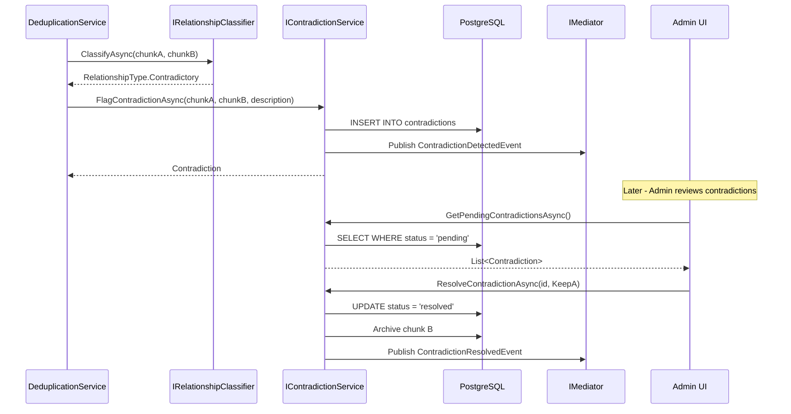

# LDS-01: Feature Design Specification — Contradiction Detection & Resolution

## 1. Metadata & Categorization

| Field | Value | Description |
| :--- | :--- | :--- |
| **Feature ID** | `RAG-DEDUP-05` | Matches the Roadmap ID. |
| **Feature Name** | Contradiction Detection & Resolution | The internal display name. |
| **Target Version** | `v0.5.9e` | The semantic version target. |
| **Module Scope** | `Lexichord.Modules.Rag` | The specific DLL/Project this code lives in. |
| **Swimlane** | Memory | The functional vertical. |
| **License Tier** | Writer Pro | The minimum license required to load this. |
| **Feature Gate Key** | `RAG.Dedup.ContradictionDetection` | The string key used in `ILicenseService`. |
| **Author** | Lexichord Architecture | Primary Architect. |
| **Reviewer** | — | Lead Architect / Peer. |
| **Status** | Implemented | Current lifecycle state. |
| **Last Updated** | 2026-02-03 | Date of last modification. |

---

## 2. Executive Summary

### 2.1 The Requirement
Knowledge bases can contain conflicting information from different sources or time periods. When the relationship classifier detects contradictory statements, the system needs a dedicated workflow to track, notify, and resolve these conflicts. Without this, contradictory information surfaces to users without warning, eroding trust in the knowledge base.

### 2.2 The Proposed Solution
Implement `IContradictionService` to manage the full lifecycle of detected contradictions: flagging, notification, and resolution. Contradictions SHALL be stored in a dedicated table with rich metadata, and an admin UI SHALL provide a resolution workflow with options to keep one version, keep both with disambiguation, or merge into a corrected statement.

---

## 3. Architecture & Modular Strategy

### 3.1 Dependencies
*   **Upstream Modules:**
    *   `Lexichord.Host` (Core services, DI container)
    *   `Lexichord.Modules.Rag.Abstractions` (Chunk models)
    *   `Lexichord.Modules.Rag.Deduplication` (v0.5.9b - IRelationshipClassifier)
    *   `Lexichord.Modules.Rag.Deduplication` (v0.5.9c - ICanonicalManager)
*   **NuGet Packages:**
    *   `MediatR` (Event publishing)
    *   `FluentMigrator` (Schema migrations)

### 3.2 Licensing Behavior
*   **Load Behavior:**
    *   [x] **Soft Gate:** The Module loads, but contradictions are not flagged for unlicensed users.
*   **Fallback Experience:**
    *   When unlicensed, `FlagContradictionAsync` SHALL log a warning and return without creating a contradiction record. Conflicting chunks are stored without flagging.

---

## 4. Data Contract (The API)

```csharp
namespace Lexichord.Modules.Rag.Deduplication.Abstractions;

/// <summary>
/// Manages the detection, tracking, and resolution of contradictory information.
/// </summary>
public interface IContradictionService
{
    /// <summary>
    /// Flags a contradiction between two chunks.
    /// </summary>
    /// <param name="chunkA">The first chunk (typically newer).</param>
    /// <param name="chunkB">The second chunk (typically older/existing).</param>
    /// <param name="description">LLM-generated description of the conflict.</param>
    /// <param name="severity">The assessed severity of the contradiction.</param>
    /// <param name="ct">Cancellation token.</param>
    /// <returns>The created contradiction record.</returns>
    Task<Contradiction> FlagContradictionAsync(
        Chunk chunkA,
        Chunk chunkB,
        string description,
        ContradictionSeverity severity = ContradictionSeverity.Medium,
        CancellationToken ct = default);

    /// <summary>
    /// Retrieves all pending (unresolved) contradictions.
    /// </summary>
    /// <param name="projectId">Optional project filter.</param>
    /// <param name="ct">Cancellation token.</param>
    /// <returns>List of unresolved contradictions.</returns>
    Task<IReadOnlyList<Contradiction>> GetPendingContradictionsAsync(
        Guid? projectId = null,
        CancellationToken ct = default);

    /// <summary>
    /// Retrieves a specific contradiction by ID.
    /// </summary>
    /// <param name="contradictionId">The contradiction ID.</param>
    /// <param name="ct">Cancellation token.</param>
    /// <returns>The contradiction record if found.</returns>
    Task<Contradiction?> GetByIdAsync(
        Guid contradictionId,
        CancellationToken ct = default);

    /// <summary>
    /// Resolves a contradiction with the specified action.
    /// </summary>
    /// <param name="contradictionId">The contradiction to resolve.</param>
    /// <param name="resolution">The resolution details.</param>
    /// <param name="ct">Cancellation token.</param>
    Task ResolveContradictionAsync(
        Guid contradictionId,
        ContradictionResolution resolution,
        CancellationToken ct = default);

    /// <summary>
    /// Gets contradiction statistics for a project or globally.
    /// </summary>
    /// <param name="projectId">Optional project filter.</param>
    /// <param name="ct">Cancellation token.</param>
    /// <returns>Contradiction statistics.</returns>
    Task<ContradictionStats> GetStatsAsync(
        Guid? projectId = null,
        CancellationToken ct = default);

    /// <summary>
    /// Checks if a chunk is involved in any unresolved contradictions.
    /// </summary>
    /// <param name="chunkId">The chunk ID to check.</param>
    /// <param name="ct">Cancellation token.</param>
    /// <returns>List of contradictions involving this chunk.</returns>
    Task<IReadOnlyList<Contradiction>> GetContradictionsForChunkAsync(
        Guid chunkId,
        CancellationToken ct = default);
}

/// <summary>
/// Represents a detected contradiction between two chunks.
/// </summary>
public record Contradiction
{
    /// <summary>
    /// Unique identifier.
    /// </summary>
    public Guid Id { get; init; }

    /// <summary>
    /// The first chunk in the contradiction (typically newer).
    /// </summary>
    public Guid ChunkAId { get; init; }

    /// <summary>
    /// The second chunk in the contradiction (typically existing).
    /// </summary>
    public Guid ChunkBId { get; init; }

    /// <summary>
    /// Human-readable description of what is contradictory.
    /// </summary>
    public string ConflictDescription { get; init; } = string.Empty;

    /// <summary>
    /// Current resolution status.
    /// </summary>
    public ContradictionStatus Status { get; init; }

    /// <summary>
    /// Severity assessment.
    /// </summary>
    public ContradictionSeverity Severity { get; init; }

    /// <summary>
    /// Notes added during resolution.
    /// </summary>
    public string? ResolutionNotes { get; init; }

    /// <summary>
    /// The action taken to resolve.
    /// </summary>
    public ResolutionAction? ResolutionAction { get; init; }

    /// <summary>
    /// User who resolved the contradiction.
    /// </summary>
    public string? ResolvedBy { get; init; }

    /// <summary>
    /// When the contradiction was detected.
    /// </summary>
    public DateTimeOffset DetectedAt { get; init; }

    /// <summary>
    /// When the contradiction was resolved (if applicable).
    /// </summary>
    public DateTimeOffset? ResolvedAt { get; init; }

    /// <summary>
    /// The project this contradiction belongs to.
    /// </summary>
    public Guid? ProjectId { get; init; }

    /// <summary>
    /// Chunk A entity (populated when requested).
    /// </summary>
    public Chunk? ChunkA { get; init; }

    /// <summary>
    /// Chunk B entity (populated when requested).
    /// </summary>
    public Chunk? ChunkB { get; init; }
}

/// <summary>
/// Contradiction resolution status.
/// </summary>
public enum ContradictionStatus
{
    /// <summary>
    /// Awaiting review.
    /// </summary>
    Pending = 0,

    /// <summary>
    /// Currently being reviewed.
    /// </summary>
    InReview = 1,

    /// <summary>
    /// Successfully resolved.
    /// </summary>
    Resolved = 2,

    /// <summary>
    /// Dismissed as not a true contradiction.
    /// </summary>
    Dismissed = 3
}

/// <summary>
/// Severity levels for contradictions.
/// </summary>
public enum ContradictionSeverity
{
    /// <summary>
    /// Minor discrepancy unlikely to cause issues.
    /// </summary>
    Low = 0,

    /// <summary>
    /// Noticeable conflict that may confuse users.
    /// </summary>
    Medium = 1,

    /// <summary>
    /// Significant conflict on important facts.
    /// </summary>
    High = 2,

    /// <summary>
    /// Critical conflict that could cause harm if unaddressed.
    /// </summary>
    Critical = 3
}

/// <summary>
/// Resolution details for a contradiction.
/// </summary>
public record ContradictionResolution(
    ResolutionAction Action,
    Guid? PreferredChunkId,
    string Notes,
    string ResolvedBy);

/// <summary>
/// Actions available for resolving contradictions.
/// </summary>
public enum ResolutionAction
{
    /// <summary>
    /// Keep both chunks with disambiguation metadata.
    /// </summary>
    KeepBoth = 0,

    /// <summary>
    /// Keep chunk A, archive chunk B.
    /// </summary>
    KeepA = 1,

    /// <summary>
    /// Keep chunk B, archive chunk A.
    /// </summary>
    KeepB = 2,

    /// <summary>
    /// Archive both chunks (neither is correct).
    /// </summary>
    ArchiveBoth = 3,

    /// <summary>
    /// Merge into a new corrected chunk.
    /// </summary>
    Merge = 4,

    /// <summary>
    /// Dismiss - not actually a contradiction.
    /// </summary>
    Dismiss = 5
}

/// <summary>
/// Statistics about contradictions.
/// </summary>
public record ContradictionStats(
    int TotalCount,
    int PendingCount,
    int ResolvedCount,
    int DismissedCount,
    IReadOnlyDictionary<ContradictionSeverity, int> BySeverity,
    IReadOnlyDictionary<ResolutionAction, int> ByResolutionAction);
```

---

## 5. Implementation Logic

### 5.1 Flow Diagram (Mermaid)



### 5.2 Key Algorithmic Logic

**Flagging Contradictions:**

```csharp
public async Task<Contradiction> FlagContradictionAsync(
    Chunk chunkA,
    Chunk chunkB,
    string description,
    ContradictionSeverity severity,
    CancellationToken ct)
{
    // License check
    if (!await _licenseService.HasFeatureAsync("RAG.Dedup.ContradictionDetection", ct))
    {
        _logger.LogWarning("[RAG:DEDUP] Contradiction detection requires Writer Pro license");
        throw new LicenseRequiredException("RAG.Dedup.ContradictionDetection");
    }

    // Check for existing contradiction between these chunks
    var existing = await _connection.QuerySingleOrDefaultAsync<Guid?>("""
        SELECT id FROM contradictions
        WHERE (chunk_a_id = @ChunkAId AND chunk_b_id = @ChunkBId)
           OR (chunk_a_id = @ChunkBId AND chunk_b_id = @ChunkAId)
        """, new { ChunkAId = chunkA.Id, ChunkBId = chunkB.Id });

    if (existing.HasValue)
    {
        _logger.LogDebug("[RAG:DEDUP] Contradiction already exists between {ChunkA} and {ChunkB}",
            chunkA.Id, chunkB.Id);
        return await GetByIdAsync(existing.Value, ct)
            ?? throw new InvalidOperationException("Contradiction disappeared");
    }

    var contradiction = new Contradiction
    {
        Id = Guid.NewGuid(),
        ChunkAId = chunkA.Id,
        ChunkBId = chunkB.Id,
        ConflictDescription = description,
        Status = ContradictionStatus.Pending,
        Severity = severity,
        DetectedAt = DateTimeOffset.UtcNow,
        ProjectId = chunkA.ProjectId ?? chunkB.ProjectId
    };

    await _connection.ExecuteAsync("""
        INSERT INTO contradictions
            (id, chunk_a_id, chunk_b_id, conflict_description, status, severity, detected_at, project_id)
        VALUES
            (@Id, @ChunkAId, @ChunkBId, @ConflictDescription, @Status, @Severity, @DetectedAt, @ProjectId)
        """, contradiction);

    _logger.LogInformation(
        "[RAG:DEDUP] Flagged contradiction {ContradictionId} between chunks {ChunkA} and {ChunkB}: {Description}",
        contradiction.Id, chunkA.Id, chunkB.Id, description);

    await _mediator.Publish(new ContradictionDetectedEvent(
        contradiction.Id,
        chunkA.Id,
        chunkB.Id,
        description,
        severity), ct);

    return contradiction;
}
```

**Resolution Logic:**

```csharp
public async Task ResolveContradictionAsync(
    Guid contradictionId,
    ContradictionResolution resolution,
    CancellationToken ct)
{
    var contradiction = await GetByIdAsync(contradictionId, ct)
        ?? throw new ContradictionNotFoundException(contradictionId);

    if (contradiction.Status == ContradictionStatus.Resolved)
    {
        throw new InvalidOperationException($"Contradiction {contradictionId} is already resolved");
    }

    await using var transaction = await _connection.BeginTransactionAsync(ct);

    try
    {
        // Update contradiction record
        await _connection.ExecuteAsync("""
            UPDATE contradictions SET
                status = @Status,
                resolution_action = @Action,
                resolution_notes = @Notes,
                resolved_by = @ResolvedBy,
                resolved_at = NOW()
            WHERE id = @Id
            """, new {
                Id = contradictionId,
                Status = resolution.Action == ResolutionAction.Dismiss
                    ? ContradictionStatus.Dismissed
                    : ContradictionStatus.Resolved,
                Action = resolution.Action.ToString(),
                Notes = resolution.Notes,
                ResolvedBy = resolution.ResolvedBy
            }, transaction);

        // Execute resolution action
        switch (resolution.Action)
        {
            case ResolutionAction.KeepA:
                await ArchiveChunkAsync(contradiction.ChunkBId, transaction, ct);
                break;

            case ResolutionAction.KeepB:
                await ArchiveChunkAsync(contradiction.ChunkAId, transaction, ct);
                break;

            case ResolutionAction.ArchiveBoth:
                await ArchiveChunkAsync(contradiction.ChunkAId, transaction, ct);
                await ArchiveChunkAsync(contradiction.ChunkBId, transaction, ct);
                break;

            case ResolutionAction.KeepBoth:
                // Add disambiguation metadata to both chunks
                await AddDisambiguationAsync(contradiction.ChunkAId, contradiction.ChunkBId,
                    resolution.Notes, transaction, ct);
                break;

            case ResolutionAction.Merge:
                // Merge requires external handling - just mark resolved
                if (!resolution.PreferredChunkId.HasValue)
                {
                    throw new InvalidOperationException("Merge resolution requires PreferredChunkId");
                }
                break;

            case ResolutionAction.Dismiss:
                // No action needed - just marking as dismissed
                break;
        }

        await transaction.CommitAsync(ct);

        _logger.LogInformation(
            "[RAG:DEDUP] Resolved contradiction {ContradictionId} with action {Action} by {ResolvedBy}",
            contradictionId, resolution.Action, resolution.ResolvedBy);

        await _mediator.Publish(new ContradictionResolvedEvent(
            contradictionId,
            resolution.Action,
            resolution.ResolvedBy), ct);
    }
    catch
    {
        await transaction.RollbackAsync(ct);
        throw;
    }
}

private async Task ArchiveChunkAsync(Guid chunkId, IDbTransaction transaction, CancellationToken ct)
{
    // Mark chunk as archived (soft delete)
    await _connection.ExecuteAsync("""
        UPDATE chunks SET
            is_archived = true,
            archived_at = NOW(),
            archive_reason = 'Contradiction resolution'
        WHERE id = @ChunkId
        """, new { ChunkId = chunkId }, transaction);

    // Remove from any canonical records
    await _connection.ExecuteAsync("""
        DELETE FROM chunk_variants WHERE variant_chunk_id = @ChunkId
        """, new { ChunkId = chunkId }, transaction);

    await _connection.ExecuteAsync("""
        DELETE FROM canonical_records WHERE canonical_chunk_id = @ChunkId
        """, new { ChunkId = chunkId }, transaction);
}

private async Task AddDisambiguationAsync(
    Guid chunkAId, Guid chunkBId, string notes, IDbTransaction transaction, CancellationToken ct)
{
    // Add metadata indicating these chunks have known contradictions
    var metadata = new { ContradictionNote = notes, DisambiguatedAt = DateTimeOffset.UtcNow };

    await _connection.ExecuteAsync("""
        UPDATE chunks SET
            metadata = COALESCE(metadata, '{}'::jsonb) || @Metadata::jsonb
        WHERE id IN (@ChunkAId, @ChunkBId)
        """, new { ChunkAId = chunkAId, ChunkBId = chunkBId, Metadata = JsonSerializer.Serialize(metadata) },
        transaction);
}
```

---

## 6. Data Persistence (Database)

*   **Migration ID:** `20260203_1400_AddContradictionsTable`
*   **Module Schema:** `rag`

### Schema Definition

```sql
-- Migration: 20260203_1400_AddContradictionsTable

CREATE TABLE contradictions (
    id UUID PRIMARY KEY DEFAULT gen_random_uuid(),
    chunk_a_id UUID NOT NULL REFERENCES chunks(id) ON DELETE CASCADE,
    chunk_b_id UUID NOT NULL REFERENCES chunks(id) ON DELETE CASCADE,
    conflict_description TEXT NOT NULL,
    status TEXT NOT NULL DEFAULT 'pending',
    severity TEXT NOT NULL DEFAULT 'medium',
    resolution_action TEXT,
    resolution_notes TEXT,
    resolved_by TEXT,
    detected_at TIMESTAMPTZ NOT NULL DEFAULT NOW(),
    resolved_at TIMESTAMPTZ,
    project_id UUID REFERENCES projects(id) ON DELETE CASCADE,
    CONSTRAINT chk_different_chunks CHECK (chunk_a_id != chunk_b_id)
);

CREATE INDEX idx_contradictions_status ON contradictions(status) WHERE status = 'pending';
CREATE INDEX idx_contradictions_severity ON contradictions(severity, status);
CREATE INDEX idx_contradictions_chunk_a ON contradictions(chunk_a_id);
CREATE INDEX idx_contradictions_chunk_b ON contradictions(chunk_b_id);
CREATE INDEX idx_contradictions_project ON contradictions(project_id);
CREATE INDEX idx_contradictions_detected ON contradictions(detected_at DESC);

-- Prevent duplicate contradiction records
CREATE UNIQUE INDEX idx_contradictions_unique_pair ON contradictions(
    LEAST(chunk_a_id, chunk_b_id),
    GREATEST(chunk_a_id, chunk_b_id)
) WHERE status = 'pending';

COMMENT ON TABLE contradictions IS 'Tracks conflicting information requiring manual resolution';

-- Add archived column to chunks if not exists
ALTER TABLE chunks ADD COLUMN IF NOT EXISTS is_archived BOOLEAN NOT NULL DEFAULT false;
ALTER TABLE chunks ADD COLUMN IF NOT EXISTS archived_at TIMESTAMPTZ;
ALTER TABLE chunks ADD COLUMN IF NOT EXISTS archive_reason TEXT;

CREATE INDEX idx_chunks_archived ON chunks(is_archived) WHERE is_archived = true;
```

---

## 7. UI/UX Specifications

### 7.1 Visual Components

*   **Location:** Admin Panel > RAG > Contradictions
*   **Dashboard View:**
    *   Summary cards: Total, Pending, By Severity
    *   Table: ID, Description preview, Severity badge, Status, Detected date
    *   Filters: Status, Severity, Project, Date range
    *   Sort: By severity (default), by date

*   **Detail View (Split-pane):**
    *   Left: Chunk A content with source info
    *   Right: Chunk B content with source info
    *   Center: Conflict description highlighted
    *   Diff highlighting for similar/different text
    *   Timeline showing both chunk creation dates

*   **Resolution Actions:**
    *   "Keep Left" button (KeepA)
    *   "Keep Right" button (KeepB)
    *   "Keep Both" button → Opens disambiguation dialog
    *   "Archive Both" button → Requires confirmation
    *   "Dismiss" button → Opens notes dialog
    *   "Merge" button → Opens merge editor

*   **Notifications:**
    *   Badge on "Contradictions" nav item showing pending count
    *   Toast notification when new contradiction detected
    *   Email notification for Critical severity (Enterprise only)

### 7.2 Accessibility (A11y)

*   Severity badges MUST use both color and icon/text
*   Split-pane view MUST support keyboard navigation (Tab switches panes)
*   Resolution confirmation dialogs MUST trap focus
*   Diff highlighting MUST not rely on color alone (use underline/strikethrough)

---

## 8. Observability & Logging

*   **Metric:** `Rag.Dedup.Contradictions.TotalCount` (Gauge)
*   **Metric:** `Rag.Dedup.Contradictions.PendingCount` (Gauge)
*   **Metric:** `Rag.Dedup.Contradictions.DetectionRate` (Counter)
*   **Metric:** `Rag.Dedup.Contradictions.ResolutionRate` (Counter by action)
*   **Metric:** `Rag.Dedup.Contradictions.MeanTimeToResolution` (Timer)

*   **Log (Info):** `[RAG:DEDUP] Flagged contradiction {ContradictionId} between {ChunkA} and {ChunkB}`
*   **Log (Info):** `[RAG:DEDUP] Resolved contradiction {ContradictionId} with {Action} by {User}`
*   **Log (Warn):** `[RAG:DEDUP] Critical contradiction detected: {Description}`
*   **Log (Debug):** `[RAG:DEDUP] Contradiction stats: {Pending} pending, {Resolved} resolved`

*   **Audit Log (Enterprise):**
    *   `User {Id} resolved contradiction {ContradictionId} by keeping chunk {ChunkId}`
    *   `User {Id} dismissed contradiction {ContradictionId} with notes: {Notes}`

---

## 9. Security & Safety

*   **PII Risk:** Medium — Chunk content displayed in resolution UI.
*   **Authorization:**
    *   `GetPendingContradictionsAsync` — Writer Pro license + Admin role
    *   `ResolveContradictionAsync` — Admin role required
    *   Archive actions are audited
*   **Data Integrity:**
    *   Unique index prevents duplicate contradiction records
    *   Check constraint prevents self-contradiction
    *   Foreign keys prevent orphaned records
*   **Audit Trail:** All resolutions logged with user identity and timestamp

---

## 10. Acceptance Criteria (QA)

1.  **[Functional]** Given two contradictory chunks, `FlagContradictionAsync` SHALL create a contradiction record with status=Pending.

2.  **[Functional]** Given an existing contradiction between chunks A and B, calling `FlagContradictionAsync` again SHALL return the existing record.

3.  **[Resolution]** When resolved with `KeepA`, chunk B SHALL be archived and removed from canonicals.

4.  **[Resolution]** When resolved with `KeepBoth`, both chunks SHALL have disambiguation metadata added.

5.  **[Events]** `ContradictionDetectedEvent` SHALL be published when a contradiction is flagged.

6.  **[Events]** `ContradictionResolvedEvent` SHALL be published when a contradiction is resolved.

7.  **[Stats]** `GetStatsAsync` SHALL return accurate counts by status and severity.

8.  **[Query]** `GetContradictionsForChunkAsync` SHALL return all contradictions involving a given chunk.

---

## 11. Test Scenarios

### 11.1 Unit Tests

```gherkin
Scenario: Flag new contradiction
    Given chunk A states "The API uses REST"
    And chunk B states "The API uses GraphQL"
    When FlagContradictionAsync is called
    Then a contradiction record SHALL be created
    And status SHALL be Pending
    And ContradictionDetectedEvent SHALL be published

Scenario: Prevent duplicate contradiction
    Given a contradiction already exists between chunk A and chunk B
    When FlagContradictionAsync is called for B and A (reversed)
    Then the existing contradiction SHALL be returned
    And no new record SHALL be created

Scenario: Resolve by keeping chunk A
    Given a pending contradiction between chunks A and B
    When ResolveContradictionAsync is called with KeepA
    Then status SHALL be Resolved
    And chunk B SHALL be archived
    And ContradictionResolvedEvent SHALL be published

Scenario: Dismiss false positive
    Given a pending contradiction flagged incorrectly
    When ResolveContradictionAsync is called with Dismiss
    Then status SHALL be Dismissed
    And neither chunk SHALL be modified
```

### 11.2 Integration Tests

```gherkin
Scenario: End-to-end contradiction workflow
    Given the deduplication service processes a contradictory chunk
    When the classifier returns Contradictory
    Then a contradiction SHALL be flagged automatically
    And it SHALL appear in GetPendingContradictionsAsync
    And the admin UI SHALL show the new contradiction

Scenario: Archived chunk excluded from search
    Given chunk B is archived due to contradiction resolution
    When a similarity search is performed
    Then chunk B SHALL NOT appear in results
```

---

## 12. MediatR Events

```csharp
namespace Lexichord.Modules.Rag.Deduplication.Events;

/// <summary>
/// Published when a contradiction is detected between two chunks.
/// </summary>
public record ContradictionDetectedEvent(
    Guid ContradictionId,
    Guid ChunkAId,
    Guid ChunkBId,
    string Description,
    ContradictionSeverity Severity) : INotification;

/// <summary>
/// Published when a contradiction is resolved.
/// </summary>
public record ContradictionResolvedEvent(
    Guid ContradictionId,
    ResolutionAction Action,
    string ResolvedBy) : INotification;
```
