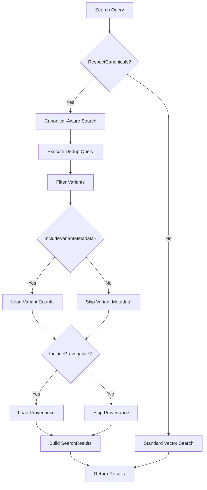

# LDS-01: Feature Design Specification — Retrieval Integration

## 1. Metadata & Categorization

| Field | Value | Description |
| :--- | :--- | :--- |
| **Feature ID** | `RAG-DEDUP-06` | Matches the Roadmap ID. |
| **Feature Name** | Retrieval Integration | The internal display name. |
| **Target Version** | `v0.5.9f` | The semantic version target. |
| **Module Scope** | `Lexichord.Modules.Rag` | The specific DLL/Project this code lives in. |
| **Swimlane** | Memory | The functional vertical. |
| **License Tier** | Writer Pro | The minimum license required to load this. |
| **Feature Gate Key** | `RAG.Dedup.RetrievalIntegration` | The string key used in `ILicenseService`. |
| **Author** | Lexichord Architecture | Primary Architect. |
| **Reviewer** | — | Lead Architect / Peer. |
| **Status** | Complete | Current lifecycle state. |
| **Last Updated** | 2026-02-04 | Date of last modification. |

---

## 2. Executive Summary

### 2.1 The Requirement
With canonical records and variant tracking in place, the retrieval system must be updated to respect the deduplication layer. Without integration, search results will continue returning duplicate chunks (variants) alongside their canonicals, defeating the purpose of deduplication and cluttering context windows in RAG pipelines.

### 2.2 The Proposed Solution
Modify `IChunkRepository.SearchSimilarAsync` to return only canonical chunks by default, filtering out variants. The search results SHALL include metadata about variant count and provenance for UI display. An option SHALL allow advanced users to include variants when needed for audit or research purposes.

---

## 3. Architecture & Modular Strategy

### 3.1 Dependencies
*   **Upstream Modules:**
    *   `Lexichord.Host` (Core services, DI container)
    *   `Lexichord.Modules.Rag.Abstractions` (IChunkRepository, SearchOptions)
    *   `Lexichord.Modules.Rag.Deduplication` (v0.5.9c - ICanonicalManager)
*   **NuGet Packages:**
    *   `Npgsql` (PostgreSQL connectivity)
    *   `pgvector` (Vector similarity)

### 3.2 Licensing Behavior
*   **Load Behavior:**
    *   [x] **Soft Gate:** When unlicensed, retrieval ignores canonical filtering (behaves as pre-dedup).
*   **Fallback Experience:**
    *   When unlicensed, `SearchSimilarAsync` returns results without deduplication filtering. This may return duplicate content but maintains backward compatibility.

---

## 4. Data Contract (The API)

```csharp
namespace Lexichord.Modules.Rag.Abstractions;

/// <summary>
/// Extended search options supporting deduplication-aware retrieval.
/// </summary>
public record SearchOptions
{
    // Existing properties...

    /// <summary>
    /// Whether to respect canonical records and filter out variants. Default: true.
    /// </summary>
    public bool RespectCanonicals { get; init; } = true;

    /// <summary>
    /// Whether to include variant information in results. Default: false.
    /// </summary>
    public bool IncludeVariantMetadata { get; init; } = false;

    /// <summary>
    /// Whether to include archived chunks in results. Default: false.
    /// </summary>
    public bool IncludeArchived { get; init; } = false;

    /// <summary>
    /// Whether to include provenance information in results. Default: false.
    /// </summary>
    public bool IncludeProvenance { get; init; } = false;
}

/// <summary>
/// Extended search result with deduplication metadata.
/// </summary>
public record SearchResult
{
    /// <summary>
    /// The matched chunk.
    /// </summary>
    public Chunk Chunk { get; init; } = null!;

    /// <summary>
    /// Similarity score (0.0-1.0).
    /// </summary>
    public float SimilarityScore { get; init; }

    /// <summary>
    /// The canonical record ID if this chunk is canonical or a variant.
    /// </summary>
    public Guid? CanonicalRecordId { get; init; }

    /// <summary>
    /// Number of variants merged into this canonical.
    /// </summary>
    public int VariantCount { get; init; }

    /// <summary>
    /// Whether this chunk has unresolved contradictions.
    /// </summary>
    public bool HasContradictions { get; init; }

    /// <summary>
    /// Provenance information (if requested).
    /// </summary>
    public IReadOnlyList<ChunkProvenance>? Provenance { get; init; }
}

/// <summary>
/// Deduplication-aware chunk repository interface extension.
/// </summary>
public interface IChunkRepository
{
    // Existing methods...

    /// <summary>
    /// Searches for similar chunks with deduplication awareness.
    /// </summary>
    /// <param name="embedding">Query embedding.</param>
    /// <param name="options">Search options including deduplication settings.</param>
    /// <param name="ct">Cancellation token.</param>
    /// <returns>Deduplicated search results with metadata.</returns>
    Task<IReadOnlyList<SearchResult>> SearchSimilarAsync(
        float[] embedding,
        SearchOptions options,
        CancellationToken ct = default);
}
```

---

## 5. Implementation Logic

### 5.1 Flow Diagram (Mermaid)



### 5.2 Key Algorithmic Logic

**Canonical-Aware Search Query:**

```sql
-- Core deduplication-aware search query
WITH ranked_chunks AS (
    SELECT
        c.id,
        c.content,
        c.embedding,
        c.document_id,
        c.project_id,
        c.created_at,
        c.metadata,
        1 - (c.embedding <=> @query_embedding) AS similarity_score,
        -- Determine canonical status
        COALESCE(cr.id, cr2.id) AS canonical_record_id,
        cr.canonical_chunk_id IS NOT NULL AS is_canonical,
        cv.canonical_record_id IS NOT NULL AS is_variant
    FROM chunks c
    -- Join to check if chunk is a canonical
    LEFT JOIN canonical_records cr ON cr.canonical_chunk_id = c.id
    -- Join to check if chunk is a variant
    LEFT JOIN chunk_variants cv ON cv.variant_chunk_id = c.id
    -- Join to get canonical record if chunk is a variant
    LEFT JOIN canonical_records cr2 ON cr2.id = cv.canonical_record_id
    WHERE
        c.embedding <=> @query_embedding < (1 - @threshold)
        AND c.is_archived = false  -- Exclude archived unless requested
        AND (@project_id IS NULL OR c.project_id = @project_id)
)
SELECT DISTINCT ON (COALESCE(canonical_record_id, id))
    id,
    content,
    embedding,
    document_id,
    project_id,
    created_at,
    metadata,
    similarity_score,
    canonical_record_id,
    is_canonical,
    is_variant
FROM ranked_chunks
WHERE
    -- Keep canonicals and standalone chunks, exclude variants
    (is_canonical = true OR (is_canonical = false AND is_variant = false))
ORDER BY
    COALESCE(canonical_record_id, id),
    similarity_score DESC
LIMIT @max_results;
```

**Implementation:**

```csharp
public async Task<IReadOnlyList<SearchResult>> SearchSimilarAsync(
    float[] embedding,
    SearchOptions options,
    CancellationToken ct)
{
    // Check if deduplication filtering is licensed and requested
    bool useCanonicalFiltering = options.RespectCanonicals
        && await _licenseService.HasFeatureAsync("RAG.Dedup.RetrievalIntegration", ct);

    string query = useCanonicalFiltering
        ? BuildCanonicalAwareQuery(options)
        : BuildStandardQuery(options);

    var parameters = new
    {
        query_embedding = embedding,
        threshold = options.SimilarityThreshold,
        max_results = options.MaxResults,
        project_id = options.ProjectId,
        include_archived = options.IncludeArchived
    };

    var rawResults = await _connection.QueryAsync<ChunkRow>(query, parameters);

    var results = new List<SearchResult>();
    foreach (var row in rawResults)
    {
        var result = new SearchResult
        {
            Chunk = MapToChunk(row),
            SimilarityScore = row.similarity_score,
            CanonicalRecordId = row.canonical_record_id,
            HasContradictions = await HasUnresolvedContradictionsAsync(row.id, ct)
        };

        if (options.IncludeVariantMetadata && row.canonical_record_id.HasValue)
        {
            result = result with
            {
                VariantCount = await GetVariantCountAsync(row.canonical_record_id.Value, ct)
            };
        }

        if (options.IncludeProvenance)
        {
            result = result with
            {
                Provenance = await GetProvenanceAsync(row.id, row.canonical_record_id, ct)
            };
        }

        results.Add(result);
    }

    _logger.LogInformation(
        "[RAG:SEARCH] Returned {ResultCount} results (canonical-aware={UseCanonical})",
        results.Count, useCanonicalFiltering);

    return results;
}

private string BuildCanonicalAwareQuery(SearchOptions options)
{
    return """
        WITH ranked_chunks AS (
            SELECT
                c.id,
                c.content,
                c.embedding,
                c.document_id,
                c.project_id,
                c.chunk_index,
                c.created_at,
                c.metadata,
                1 - (c.embedding <=> @query_embedding) AS similarity_score,
                COALESCE(cr.id, cr2.id) AS canonical_record_id,
                cr.canonical_chunk_id IS NOT NULL AS is_canonical,
                cv.canonical_record_id IS NOT NULL AS is_variant
            FROM chunks c
            LEFT JOIN canonical_records cr ON cr.canonical_chunk_id = c.id
            LEFT JOIN chunk_variants cv ON cv.variant_chunk_id = c.id
            LEFT JOIN canonical_records cr2 ON cr2.id = cv.canonical_record_id
            WHERE
                c.embedding <=> @query_embedding < (1 - @threshold)
                AND (c.is_archived = false OR @include_archived = true)
                AND (@project_id IS NULL OR c.project_id = @project_id)
        )
        SELECT DISTINCT ON (COALESCE(canonical_record_id, id))
            id, content, embedding, document_id, project_id, chunk_index,
            created_at, metadata, similarity_score, canonical_record_id,
            is_canonical, is_variant
        FROM ranked_chunks
        WHERE is_canonical = true OR (is_canonical = false AND is_variant = false)
        ORDER BY COALESCE(canonical_record_id, id), similarity_score DESC
        LIMIT @max_results
        """;
}

private async Task<int> GetVariantCountAsync(Guid canonicalRecordId, CancellationToken ct)
{
    return await _connection.QuerySingleAsync<int>("""
        SELECT merge_count FROM canonical_records WHERE id = @Id
        """, new { Id = canonicalRecordId });
}

private async Task<bool> HasUnresolvedContradictionsAsync(Guid chunkId, CancellationToken ct)
{
    return await _connection.QuerySingleAsync<bool>("""
        SELECT EXISTS(
            SELECT 1 FROM contradictions
            WHERE (chunk_a_id = @ChunkId OR chunk_b_id = @ChunkId)
              AND status = 'pending'
        )
        """, new { ChunkId = chunkId });
}
```

---

## 6. Data Persistence (Database)

*   **Migration ID:** None required (uses existing schema)
*   **Module Schema:** `rag`

### Index Optimization

```sql
-- Add composite index for canonical-aware queries
CREATE INDEX idx_chunks_canonical_search ON chunks(project_id, is_archived)
    INCLUDE (embedding)
    WHERE is_archived = false;

-- Ensure covering index on canonical_records
CREATE INDEX idx_canonical_records_covering ON canonical_records(canonical_chunk_id)
    INCLUDE (id, merge_count);

-- Ensure covering index on chunk_variants
CREATE INDEX idx_chunk_variants_covering ON chunk_variants(variant_chunk_id)
    INCLUDE (canonical_record_id);
```

---

## 7. UI/UX Specifications

### 7.1 Visual Components

*   **Search Results:**
    *   Standard result card layout maintained
    *   New: "Merged from N sources" badge when VariantCount > 1
    *   New: Warning icon when HasContradictions = true
    *   New: "View Sources" expansion showing provenance

*   **Source Expansion:**
    *   Collapsible section below each result
    *   List of source documents with timestamps
    *   "View Variants" link for advanced users

*   **Search Options (Settings/Advanced):**
    *   Toggle: "Show deduplicated results" (default: on)
    *   Toggle: "Include archived content" (default: off)
    *   Toggle: "Show provenance details" (default: off)

### 7.2 Accessibility (A11y)

*   "Merged from N sources" badge MUST have `aria-label` with full text
*   Contradiction warning MUST have descriptive tooltip accessible via keyboard
*   Source expansion MUST use `aria-expanded` and `aria-controls`

---

## 8. Observability & Logging

*   **Metric:** `Rag.Search.Duration` (Timer, tagged by canonical_aware)
*   **Metric:** `Rag.Search.ResultCount` (Histogram)
*   **Metric:** `Rag.Search.VariantsFiltered` (Counter)
*   **Metric:** `Rag.Search.CanonicalHitRate` (Gauge)

*   **Log (Debug):** `[RAG:SEARCH] Query embedding dim={Dim}, threshold={Threshold}, canonical_aware={Flag}`
*   **Log (Info):** `[RAG:SEARCH] Returned {ResultCount} results, filtered {FilteredCount} variants`
*   **Log (Warn):** `[RAG:SEARCH] Result {ChunkId} has {ContradictionCount} unresolved contradictions`

---

## 9. Security & Safety

*   **PII Risk:** Low — Search results contain same data as before, just deduplicated.
*   **Performance Risk:**
    *   Canonical-aware queries have slight overhead (~5-10ms)
    *   Covered by indices
    *   Fallback to standard query if performance degrades
*   **Data Integrity:** Results always reference valid chunks (FK constraints)

---

## 10. Acceptance Criteria (QA)

1.  **[Functional]** Given 3 equivalent chunks merged into 1 canonical, a search SHALL return only the canonical chunk.

2.  **[Functional]** Given `RespectCanonicals=false`, all matching chunks SHALL be returned including variants.

3.  **[Functional]** Given `IncludeVariantMetadata=true`, results SHALL include accurate VariantCount.

4.  **[Functional]** Given `IncludeProvenance=true`, results SHALL include provenance for the canonical and its variants.

5.  **[Contradictions]** Results with unresolved contradictions SHALL have `HasContradictions=true`.

6.  **[Archived]** Archived chunks SHALL NOT appear in results unless `IncludeArchived=true`.

7.  **[Performance]** Canonical-aware search SHALL complete within 20% of standard search time.

8.  **[Licensing]** When unlicensed, search SHALL behave as if `RespectCanonicals=false`.

---

## 11. Test Scenarios

### 11.1 Unit Tests

```gherkin
Scenario: Search returns only canonical chunks
    Given canonical record C1 with canonical chunk "chunk-001"
    And variants "chunk-002" and "chunk-003" merged into C1
    And all three chunks match the search query
    When SearchSimilarAsync is called with RespectCanonicals=true
    Then only "chunk-001" SHALL be in results
    And VariantCount SHALL be 3

Scenario: Search includes variants when requested
    Given canonical record with chunk-001 and variants
    When SearchSimilarAsync is called with RespectCanonicals=false
    Then all matching chunks SHALL be returned
    And results SHALL NOT be deduplicated

Scenario: Standalone chunks returned normally
    Given chunk "standalone-001" with no canonical record
    When SearchSimilarAsync is called
    Then "standalone-001" SHALL appear in results
    And CanonicalRecordId SHALL be null

Scenario: Archived chunks excluded by default
    Given chunk "archived-001" is archived
    When SearchSimilarAsync is called with IncludeArchived=false
    Then "archived-001" SHALL NOT be in results

Scenario: Contradiction indicator populated
    Given chunk "chunk-001" has an unresolved contradiction
    When SearchSimilarAsync is called
    Then the result for "chunk-001" SHALL have HasContradictions=true
```

### 11.2 Integration Tests

```gherkin
Scenario: End-to-end deduplicated search
    Given a project with 100 chunks
    And 30 chunks have been deduplicated into 10 canonicals
    When a search query is executed
    Then the result count SHALL be <= 80 (70 standalone + 10 canonicals)
    And no variant chunks SHALL appear in results

Scenario: Performance comparison
    Given 10,000 chunks with 20% deduplication rate
    When canonical-aware search is executed
    Then execution time SHALL be < 1.2x standard search time
```

---

## 12. UI Component Specifications

### 12.1 Search Result Card Enhancement

```tsx
// Pseudo-code for result card component
interface SearchResultCardProps {
    result: SearchResult;
    onExpandSources: () => void;
}

function SearchResultCard({ result, onExpandSources }: SearchResultCardProps) {
    return (
        <Card>
            <CardHeader>
                <ContentPreview text={result.chunk.content} />
                {result.variantCount > 1 && (
                    <Badge
                        aria-label={`Merged from ${result.variantCount} sources`}
                        variant="info"
                    >
                        <MergeIcon /> {result.variantCount} sources
                    </Badge>
                )}
                {result.hasContradictions && (
                    <WarningIcon
                        aria-label="Has unresolved contradictions"
                        tooltip="This information has conflicting sources"
                    />
                )}
            </CardHeader>
            <CardFooter>
                <SimilarityScore value={result.similarityScore} />
                <Button
                    onClick={onExpandSources}
                    aria-expanded={isExpanded}
                    aria-controls={`sources-${result.chunk.id}`}
                >
                    View Sources
                </Button>
            </CardFooter>
            {isExpanded && (
                <ProvenancePanel
                    id={`sources-${result.chunk.id}`}
                    provenance={result.provenance}
                />
            )}
        </Card>
    );
}
```
