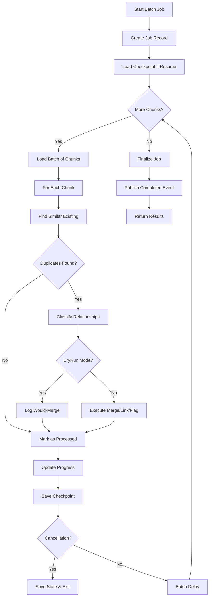

# LDS-01: Feature Design Specification — Batch Retroactive Deduplication

## 1. Metadata & Categorization

| Field | Value | Description |
| :--- | :--- | :--- |
| **Feature ID** | `RAG-DEDUP-07` | Matches the Roadmap ID. |
| **Feature Name** | Batch Retroactive Deduplication | The internal display name. |
| **Target Version** | `v0.5.9g` | The semantic version target. |
| **Module Scope** | `Lexichord.Modules.Rag` | The specific DLL/Project this code lives in. |
| **Swimlane** | Memory | The functional vertical. |
| **License Tier** | Teams | The minimum license required to load this. |
| **Feature Gate Key** | `RAG.Dedup.BatchRetroactive` | The string key used in `ILicenseService`. |
| **Author** | Lexichord Architecture | Primary Architect. |
| **Reviewer** | — | Lead Architect / Peer. |
| **Status** | Draft | Current lifecycle state. |
| **Last Updated** | 2026-02-03 | Date of last modification. |

---

## 2. Executive Summary

### 2.1 The Requirement
The deduplication pipeline processes new chunks at ingestion time, but existing knowledge bases may contain years of accumulated duplicate content. Without a batch processing capability, users cannot benefit from deduplication for their historical data, and storage waste persists until documents are re-ingested.

### 2.2 The Proposed Solution
Implement `IBatchDeduplicationJob` as a background job that systematically processes existing chunks to identify and merge duplicates. The job SHALL support progress tracking, resumability after interruption, dry-run mode for preview, and comprehensive statistics. The job SHALL be throttled to avoid impacting normal operations.

---

## 3. Architecture & Modular Strategy

### 3.1 Dependencies
*   **Upstream Modules:**
    *   `Lexichord.Host` (Core services, DI container, background job infrastructure)
    *   `Lexichord.Modules.Rag.Abstractions` (IChunkRepository)
    *   `Lexichord.Modules.Rag.Deduplication` (v0.5.9a-e - Full dedup pipeline)
*   **NuGet Packages:**
    *   `Hangfire` or `Quartz.NET` (Background job scheduling)
    *   `MediatR` (Event publishing)

### 3.2 Licensing Behavior
*   **Load Behavior:**
    *   [x] **Hard Gate:** The batch job feature is completely hidden for non-Teams users.
*   **Fallback Experience:**
    *   When user lacks Teams license, the "Run Batch Deduplication" button SHALL NOT appear in the UI. API calls to `ExecuteAsync` SHALL throw `LicenseRequiredException`.

---

## 4. Data Contract (The API)

```csharp
namespace Lexichord.Modules.Rag.Deduplication.Abstractions;

/// <summary>
/// Executes batch deduplication on existing chunks.
/// Processes historical data to identify and merge duplicates retroactively.
/// </summary>
public interface IBatchDeduplicationJob
{
    /// <summary>
    /// Executes the batch deduplication job.
    /// </summary>
    /// <param name="options">Configuration for the batch job.</param>
    /// <param name="progress">Optional progress reporter.</param>
    /// <param name="ct">Cancellation token for graceful shutdown.</param>
    /// <returns>Summary of the batch operation.</returns>
    /// <exception cref="LicenseRequiredException">Thrown if user lacks Teams license.</exception>
    Task<BatchDeduplicationResult> ExecuteAsync(
        BatchDeduplicationOptions options,
        IProgress<BatchProgress>? progress = null,
        CancellationToken ct = default);

    /// <summary>
    /// Gets the status of a running or completed batch job.
    /// </summary>
    /// <param name="jobId">The job identifier.</param>
    /// <param name="ct">Cancellation token.</param>
    /// <returns>Job status or null if not found.</returns>
    Task<BatchJobStatus?> GetStatusAsync(
        Guid jobId,
        CancellationToken ct = default);

    /// <summary>
    /// Cancels a running batch job.
    /// </summary>
    /// <param name="jobId">The job identifier.</param>
    /// <param name="ct">Cancellation token.</param>
    Task CancelAsync(
        Guid jobId,
        CancellationToken ct = default);

    /// <summary>
    /// Resumes a previously interrupted batch job.
    /// </summary>
    /// <param name="jobId">The job identifier to resume.</param>
    /// <param name="progress">Optional progress reporter.</param>
    /// <param name="ct">Cancellation token.</param>
    /// <returns>Summary of the resumed operation.</returns>
    Task<BatchDeduplicationResult> ResumeAsync(
        Guid jobId,
        IProgress<BatchProgress>? progress = null,
        CancellationToken ct = default);

    /// <summary>
    /// Lists all batch jobs with optional filtering.
    /// </summary>
    /// <param name="filter">Filter criteria.</param>
    /// <param name="ct">Cancellation token.</param>
    /// <returns>List of batch job records.</returns>
    Task<IReadOnlyList<BatchJobRecord>> ListJobsAsync(
        BatchJobFilter? filter = null,
        CancellationToken ct = default);
}

/// <summary>
/// Options for batch deduplication execution.
/// </summary>
public record BatchDeduplicationOptions
{
    /// <summary>
    /// Optional project scope. Null processes all projects.
    /// </summary>
    public Guid? ProjectId { get; init; } = null;

    /// <summary>
    /// Whether to run in dry-run mode (no actual changes). Default: false.
    /// </summary>
    public bool DryRun { get; init; } = false;

    /// <summary>
    /// Similarity threshold for duplicate detection. Default: 0.90.
    /// </summary>
    public float SimilarityThreshold { get; init; } = 0.90f;

    /// <summary>
    /// Number of chunks to process per batch. Default: 100.
    /// </summary>
    public int BatchSize { get; init; } = 100;

    /// <summary>
    /// Delay between batches in milliseconds. Default: 100ms.
    /// </summary>
    public int BatchDelayMs { get; init; } = 100;

    /// <summary>
    /// Maximum chunks to process (for testing). 0 = unlimited.
    /// </summary>
    public int MaxChunks { get; init; } = 0;

    /// <summary>
    /// Whether to require LLM confirmation for merges. Default: true.
    /// </summary>
    public bool RequireLlmConfirmation { get; init; } = true;

    /// <summary>
    /// Whether to detect and flag contradictions. Default: true.
    /// </summary>
    public bool EnableContradictionDetection { get; init; } = true;

    /// <summary>
    /// Job priority (lower = higher priority). Default: 10.
    /// </summary>
    public int Priority { get; init; } = 10;

    /// <summary>
    /// Optional label for the job. Default: auto-generated.
    /// </summary>
    public string? Label { get; init; }
}

/// <summary>
/// Result of a batch deduplication run.
/// </summary>
public record BatchDeduplicationResult(
    Guid JobId,
    BatchJobState FinalState,
    int ChunksProcessed,
    int DuplicatesFound,
    int MergedCount,
    int LinkedCount,
    int ContradictionsFound,
    int QueuedForReview,
    int ErrorCount,
    TimeSpan Duration,
    long StorageSavedBytes,
    string? ErrorMessage = null);

/// <summary>
/// Progress update during batch processing.
/// </summary>
public record BatchProgress(
    Guid JobId,
    int ChunksProcessed,
    int TotalChunks,
    int DuplicatesFound,
    int MergedCount,
    float PercentComplete,
    TimeSpan Elapsed,
    TimeSpan? EstimatedRemaining,
    string CurrentOperation);

/// <summary>
/// Status of a batch job.
/// </summary>
public record BatchJobStatus(
    Guid JobId,
    BatchJobState State,
    BatchDeduplicationOptions Options,
    int ChunksProcessed,
    int TotalChunks,
    int DuplicatesFound,
    int MergedCount,
    DateTimeOffset StartedAt,
    DateTimeOffset? CompletedAt,
    string? LastCheckpoint,
    string? ErrorMessage);

/// <summary>
/// Batch job states.
/// </summary>
public enum BatchJobState
{
    /// <summary>
    /// Job is queued but not yet started.
    /// </summary>
    Pending = 0,

    /// <summary>
    /// Job is currently running.
    /// </summary>
    Running = 1,

    /// <summary>
    /// Job was paused and can be resumed.
    /// </summary>
    Paused = 2,

    /// <summary>
    /// Job completed successfully.
    /// </summary>
    Completed = 3,

    /// <summary>
    /// Job was cancelled by user.
    /// </summary>
    Cancelled = 4,

    /// <summary>
    /// Job failed with an error.
    /// </summary>
    Failed = 5
}

/// <summary>
/// Filter criteria for listing batch jobs.
/// </summary>
public record BatchJobFilter(
    Guid? ProjectId = null,
    BatchJobState? State = null,
    DateTimeOffset? StartedAfter = null,
    DateTimeOffset? StartedBefore = null,
    int Limit = 50);

/// <summary>
/// Record of a batch job for listing.
/// </summary>
public record BatchJobRecord(
    Guid JobId,
    BatchJobState State,
    Guid? ProjectId,
    string? Label,
    int ChunksProcessed,
    int MergedCount,
    DateTimeOffset StartedAt,
    DateTimeOffset? CompletedAt,
    TimeSpan? Duration);
```

---

## 5. Implementation Logic

### 5.1 Flow Diagram (Mermaid)



### 5.2 Key Algorithmic Logic

**Main Batch Processing Loop:**

```csharp
public async Task<BatchDeduplicationResult> ExecuteAsync(
    BatchDeduplicationOptions options,
    IProgress<BatchProgress>? progress,
    CancellationToken ct)
{
    // License check
    if (!await _licenseService.HasFeatureAsync("RAG.Dedup.BatchRetroactive", ct))
    {
        throw new LicenseRequiredException("RAG.Dedup.BatchRetroactive", "Teams");
    }

    var jobId = Guid.NewGuid();
    var stopwatch = Stopwatch.StartNew();
    var stats = new BatchStats();

    // Create job record
    var job = await CreateJobRecordAsync(jobId, options, ct);

    try
    {
        // Get total chunk count for progress
        var totalChunks = await GetChunkCountAsync(options.ProjectId, ct);
        var processedIds = new HashSet<Guid>();
        var lastCheckpoint = (string?)null;

        _logger.LogInformation(
            "[RAG:DEDUP:BATCH] Starting batch job {JobId} for {TotalChunks} chunks (DryRun={DryRun})",
            jobId, totalChunks, options.DryRun);

        await UpdateJobStateAsync(jobId, BatchJobState.Running, ct);

        // Process in batches
        while (true)
        {
            ct.ThrowIfCancellationRequested();

            // Load next batch of unprocessed chunks
            var batch = await LoadNextBatchAsync(
                options.ProjectId,
                processedIds,
                lastCheckpoint,
                options.BatchSize,
                ct);

            if (batch.Count == 0)
                break;

            if (options.MaxChunks > 0 && stats.ChunksProcessed >= options.MaxChunks)
                break;

            // Process each chunk in batch
            foreach (var chunk in batch)
            {
                ct.ThrowIfCancellationRequested();

                var result = await ProcessChunkForBatchAsync(chunk, options, ct);
                stats.Record(result);
                processedIds.Add(chunk.Id);

                // Update progress
                progress?.Report(new BatchProgress(
                    jobId,
                    stats.ChunksProcessed,
                    totalChunks,
                    stats.DuplicatesFound,
                    stats.MergedCount,
                    (float)stats.ChunksProcessed / totalChunks * 100,
                    stopwatch.Elapsed,
                    EstimateRemaining(stats, totalChunks, stopwatch.Elapsed),
                    $"Processing chunk {chunk.Id}"));
            }

            // Save checkpoint
            lastCheckpoint = batch.Last().Id.ToString();
            await SaveCheckpointAsync(jobId, lastCheckpoint, stats, ct);

            // Throttle to avoid overwhelming the system
            await Task.Delay(options.BatchDelayMs, ct);
        }

        // Finalize
        var result = new BatchDeduplicationResult(
            jobId,
            BatchJobState.Completed,
            stats.ChunksProcessed,
            stats.DuplicatesFound,
            stats.MergedCount,
            stats.LinkedCount,
            stats.ContradictionsFound,
            stats.QueuedForReview,
            stats.ErrorCount,
            stopwatch.Elapsed,
            stats.StorageSavedBytes);

        await FinalizeJobAsync(jobId, result, ct);

        _logger.LogInformation(
            "[RAG:DEDUP:BATCH] Completed job {JobId}: {Processed} processed, {Merged} merged, {Duration}",
            jobId, stats.ChunksProcessed, stats.MergedCount, stopwatch.Elapsed);

        await _mediator.Publish(new BatchDeduplicationCompletedEvent(result), ct);

        return result;
    }
    catch (OperationCanceledException)
    {
        await UpdateJobStateAsync(jobId, BatchJobState.Cancelled, ct: CancellationToken.None);
        throw;
    }
    catch (Exception ex)
    {
        _logger.LogError(ex, "[RAG:DEDUP:BATCH] Job {JobId} failed: {Message}", jobId, ex.Message);
        await FailJobAsync(jobId, ex.Message, CancellationToken.None);
        throw;
    }
}

private async Task<BatchChunkResult> ProcessChunkForBatchAsync(
    Chunk chunk,
    BatchDeduplicationOptions options,
    CancellationToken ct)
{
    try
    {
        // Skip if chunk already has a canonical or is a variant
        var existingCanonical = await _canonicalManager.GetCanonicalForChunkAsync(chunk.Id, ct);
        if (existingCanonical != null)
        {
            return BatchChunkResult.AlreadyProcessed;
        }

        // Find similar chunks (excluding self)
        var similar = await _similarityDetector.FindSimilarAsync(
            chunk.Embedding,
            options.SimilarityThreshold,
            maxResults: 10,
            options.ProjectId,
            ct);

        // Filter out self
        similar = similar.Where(s => s.ChunkId != chunk.Id).ToList();

        if (similar.Count == 0)
        {
            return BatchChunkResult.NoDuplicates;
        }

        // Find best match that already has a canonical
        var bestMatch = similar
            .OrderByDescending(s => s.SimilarityScore)
            .FirstOrDefault();

        if (bestMatch == null)
        {
            return BatchChunkResult.NoDuplicates;
        }

        // Classify relationship
        var existingChunk = await _chunkRepository.GetByIdAsync(bestMatch.ChunkId, ct);
        var classification = await _relationshipClassifier.ClassifyAsync(
            chunk, existingChunk, bestMatch.SimilarityScore, ct: ct);

        if (options.DryRun)
        {
            _logger.LogDebug(
                "[RAG:DEDUP:BATCH] DryRun: Would {Action} chunk {ChunkId} -> {ExistingId} (type={Type})",
                classification.Type == RelationshipType.Equivalent ? "merge" : "link",
                chunk.Id, existingChunk.Id, classification.Type);

            return new BatchChunkResult(
                DuplicateFound: true,
                WouldMerge: classification.Type == RelationshipType.Equivalent,
                WouldLink: classification.Type == RelationshipType.Complementary,
                WouldFlagContradiction: classification.Type == RelationshipType.Contradictory);
        }

        // Execute deduplication
        var dedupResult = await _deduplicationService.ProcessChunkAsync(
            chunk,
            new DeduplicationOptions
            {
                SimilarityThreshold = options.SimilarityThreshold,
                RequireLlmConfirmation = options.RequireLlmConfirmation,
                EnableContradictionDetection = options.EnableContradictionDetection,
                EnableManualReviewQueue = true
            },
            ct);

        return BatchChunkResult.FromDeduplicationResult(dedupResult);
    }
    catch (Exception ex)
    {
        _logger.LogWarning(ex, "[RAG:DEDUP:BATCH] Error processing chunk {ChunkId}: {Message}",
            chunk.Id, ex.Message);
        return BatchChunkResult.Error(ex.Message);
    }
}
```

**Resume Logic:**

```csharp
public async Task<BatchDeduplicationResult> ResumeAsync(
    Guid jobId,
    IProgress<BatchProgress>? progress,
    CancellationToken ct)
{
    var job = await GetJobRecordAsync(jobId, ct)
        ?? throw new JobNotFoundException(jobId);

    if (job.State != BatchJobState.Paused && job.State != BatchJobState.Cancelled)
    {
        throw new InvalidOperationException($"Cannot resume job in state {job.State}");
    }

    _logger.LogInformation(
        "[RAG:DEDUP:BATCH] Resuming job {JobId} from checkpoint {Checkpoint}",
        jobId, job.LastCheckpoint);

    // Restore checkpoint and continue
    var options = job.Options with { }; // Clone
    // Continue from where we left off using the checkpoint
    return await ExecuteWithCheckpointAsync(jobId, job.LastCheckpoint, options, progress, ct);
}
```

---

## 6. Data Persistence (Database)

*   **Migration ID:** `20260203_1500_AddBatchDeduplicationTables`
*   **Module Schema:** `rag`

### Schema Definition

```sql
-- Migration: 20260203_1500_AddBatchDeduplicationTables

CREATE TABLE batch_dedup_jobs (
    id UUID PRIMARY KEY DEFAULT gen_random_uuid(),
    project_id UUID REFERENCES projects(id) ON DELETE CASCADE,
    state TEXT NOT NULL DEFAULT 'pending',
    options JSONB NOT NULL,
    label TEXT,

    -- Progress tracking
    chunks_processed INTEGER NOT NULL DEFAULT 0,
    total_chunks INTEGER NOT NULL DEFAULT 0,
    duplicates_found INTEGER NOT NULL DEFAULT 0,
    merged_count INTEGER NOT NULL DEFAULT 0,
    linked_count INTEGER NOT NULL DEFAULT 0,
    contradictions_found INTEGER NOT NULL DEFAULT 0,
    queued_for_review INTEGER NOT NULL DEFAULT 0,
    error_count INTEGER NOT NULL DEFAULT 0,
    storage_saved_bytes BIGINT NOT NULL DEFAULT 0,

    -- Checkpoint for resume
    last_checkpoint TEXT,
    checkpoint_data JSONB,

    -- Timestamps
    created_at TIMESTAMPTZ NOT NULL DEFAULT NOW(),
    started_at TIMESTAMPTZ,
    completed_at TIMESTAMPTZ,
    cancelled_at TIMESTAMPTZ,

    -- Error tracking
    error_message TEXT,

    -- Audit
    created_by TEXT,
    priority INTEGER NOT NULL DEFAULT 10
);

CREATE INDEX idx_batch_jobs_state ON batch_dedup_jobs(state);
CREATE INDEX idx_batch_jobs_project ON batch_dedup_jobs(project_id);
CREATE INDEX idx_batch_jobs_created ON batch_dedup_jobs(created_at DESC);

COMMENT ON TABLE batch_dedup_jobs IS 'Tracks batch deduplication job execution and progress';

-- Table to track which chunks have been processed in a job
CREATE TABLE batch_dedup_processed (
    job_id UUID NOT NULL REFERENCES batch_dedup_jobs(id) ON DELETE CASCADE,
    chunk_id UUID NOT NULL REFERENCES chunks(id) ON DELETE CASCADE,
    processed_at TIMESTAMPTZ NOT NULL DEFAULT NOW(),
    result TEXT NOT NULL,
    PRIMARY KEY (job_id, chunk_id)
);

CREATE INDEX idx_batch_processed_job ON batch_dedup_processed(job_id);
```

---

## 7. UI/UX Specifications

### 7.1 Visual Components

*   **Location:** Admin Panel > RAG > Deduplication > Batch Jobs

*   **Dashboard:**
    *   Active job card with live progress bar
    *   Statistics summary (processed, merged, storage saved)
    *   Job history table

*   **New Job Dialog:**
    *   Project selector (or "All Projects")
    *   Similarity threshold slider (0.85-0.99)
    *   Dry-run toggle with explanation
    *   LLM confirmation toggle
    *   "Start Job" / "Start Dry Run" buttons

*   **Progress View:**
    *   Real-time progress bar with percentage
    *   Live counters: Processed, Duplicates, Merged
    *   Estimated time remaining
    *   Current operation text
    *   "Pause" / "Cancel" buttons

*   **Results View:**
    *   Summary statistics with before/after comparison
    *   Storage savings visualization
    *   Error log if any
    *   "Download Report" button (CSV/JSON)

### 7.2 Accessibility (A11y)

*   Progress bar MUST have `aria-valuenow`, `aria-valuemin`, `aria-valuemax`
*   Live counters MUST use `aria-live="polite"`
*   Cancel confirmation MUST trap focus
*   Job history table MUST be keyboard navigable

---

## 8. Observability & Logging

*   **Metric:** `Rag.Dedup.Batch.JobsStarted` (Counter)
*   **Metric:** `Rag.Dedup.Batch.JobsCompleted` (Counter)
*   **Metric:** `Rag.Dedup.Batch.ChunksProcessed` (Counter)
*   **Metric:** `Rag.Dedup.Batch.MergeRate` (Gauge)
*   **Metric:** `Rag.Dedup.Batch.ProcessingRate` (Gauge, chunks/second)
*   **Metric:** `Rag.Dedup.Batch.StorageSaved` (Counter, bytes)
*   **Metric:** `Rag.Dedup.Batch.Duration` (Timer)

*   **Log (Info):** `[RAG:DEDUP:BATCH] Starting job {JobId} for {ProjectId} with {TotalChunks} chunks`
*   **Log (Info):** `[RAG:DEDUP:BATCH] Job {JobId} progress: {Processed}/{Total} ({Percent}%)`
*   **Log (Info):** `[RAG:DEDUP:BATCH] Job {JobId} completed: {Merged} merged, {StorageSaved} bytes saved`
*   **Log (Warn):** `[RAG:DEDUP:BATCH] Job {JobId} chunk {ChunkId} error: {Message}`
*   **Log (Error):** `[RAG:DEDUP:BATCH] Job {JobId} failed: {ErrorMessage}`

---

## 9. Security & Safety

*   **PII Risk:** Medium — Batch processing accesses all chunk content.
*   **Authorization:**
    *   Teams license required
    *   Admin role required to start jobs
    *   Read access to view job status
*   **Resource Protection:**
    *   Configurable batch delay prevents CPU/DB saturation
    *   Priority system allows throttling during peak hours
    *   Automatic pause if system load exceeds threshold
*   **Data Safety:**
    *   Dry-run mode for validation
    *   Checkpoint-based resume prevents data loss
    *   All merges logged for audit

---

## 10. Acceptance Criteria (QA)

1.  **[Functional]** Given 1000 chunks with 20% duplicates, the batch job SHALL identify and merge ~200 chunks.

2.  **[Dry Run]** In dry-run mode, no chunks SHALL be modified and "would merge" statistics SHALL be reported.

3.  **[Resume]** After cancellation, `ResumeAsync` SHALL continue from the last checkpoint without reprocessing.

4.  **[Progress]** Progress updates SHALL be reported at least every batch (default: 100 chunks).

5.  **[Throttling]** With BatchDelayMs=100, processing rate SHALL not exceed ~1000 chunks/second.

6.  **[Licensing]** Non-Teams users SHALL NOT be able to start batch jobs.

7.  **[Error Handling]** Individual chunk errors SHALL NOT abort the entire job.

8.  **[Statistics]** `StorageSavedBytes` SHALL accurately reflect space freed by merged chunks.

---

## 11. Test Scenarios

### 11.1 Unit Tests

```gherkin
Scenario: Batch job processes all chunks
    Given a project with 500 chunks
    And 100 chunks are duplicates
    When ExecuteAsync is called with DryRun=false
    Then ChunksProcessed SHALL be 500
    And DuplicatesFound SHALL be approximately 100
    And MergedCount SHALL be > 0

Scenario: Dry run makes no changes
    Given a project with 100 chunks
    And 20 chunks are duplicates
    When ExecuteAsync is called with DryRun=true
    Then DuplicatesFound SHALL be approximately 20
    And MergedCount SHALL be 0
    And no canonical records SHALL be created

Scenario: Job can be resumed after cancellation
    Given a batch job processing 1000 chunks
    And the job is cancelled at 500 chunks
    When ResumeAsync is called
    Then processing SHALL continue from chunk 501
    And ChunksProcessed SHALL eventually be 1000

Scenario: License check blocks non-Teams users
    Given a user with Writer Pro license
    When ExecuteAsync is called
    Then LicenseRequiredException SHALL be thrown
    And message SHALL mention "Teams" license
```

### 11.2 Integration Tests

```gherkin
Scenario: End-to-end batch deduplication
    Given a knowledge base with 10,000 chunks accumulated over 2 years
    And estimated 25% duplicate content
    When batch deduplication is executed
    Then approximately 2,500 chunks SHALL be merged
    And storage savings SHALL be > 0
    And search results SHALL no longer return duplicates

Scenario: Batch job survives application restart
    Given a running batch job at 50% completion
    When the application restarts
    And ResumeAsync is called
    Then the job SHALL continue from the checkpoint
    And final results SHALL be complete
```

---

## 12. MediatR Events

```csharp
namespace Lexichord.Modules.Rag.Deduplication.Events;

/// <summary>
/// Published when a batch deduplication job completes.
/// </summary>
public record BatchDeduplicationCompletedEvent(
    BatchDeduplicationResult Result) : INotification;

/// <summary>
/// Published when a batch job is cancelled.
/// </summary>
public record BatchDeduplicationCancelledEvent(
    Guid JobId,
    int ChunksProcessed,
    string CancelledBy) : INotification;

/// <summary>
/// Published periodically during batch processing for monitoring.
/// </summary>
public record BatchDeduplicationProgressEvent(
    Guid JobId,
    int ChunksProcessed,
    int TotalChunks,
    float PercentComplete) : INotification;
```
