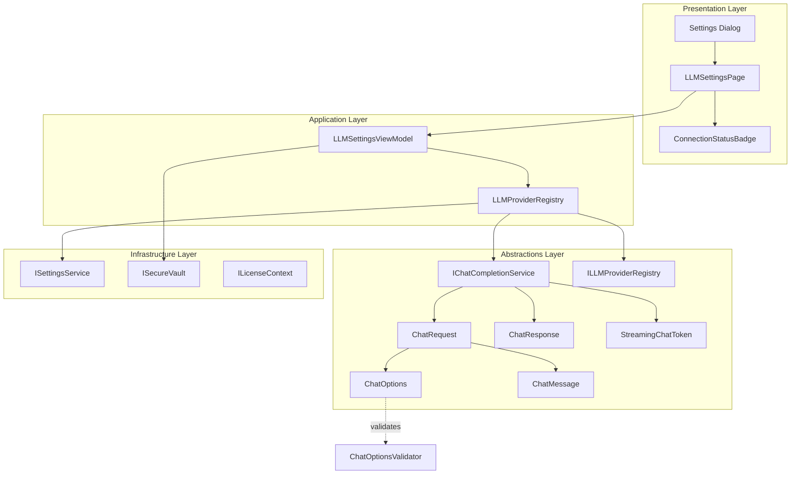
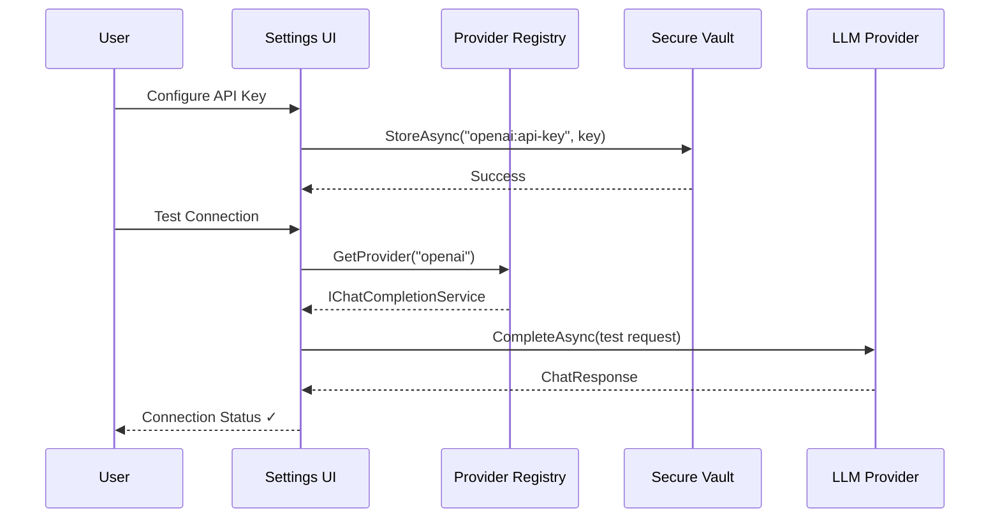
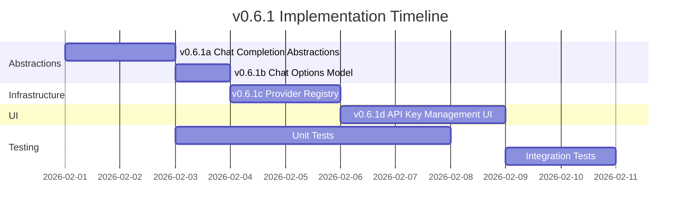

# LCS-DES-061: Design Specification Index — The Gateway

## Document Control

| Field            | Value                                         |
| :--------------- | :-------------------------------------------- |
| **Document ID**  | LCS-DES-061-INDEX                             |
| **Version**      | v0.6.1                                        |
| **Status**       | Draft                                         |
| **Created**      | 2026-01-28                                    |
| **Author**       | Documentation Agent                           |
| **Related Docs** | [LCS-SBD-061](LCS-SBD-061.md), roadmap-v0.6.x |

---

## 1. Executive Summary

### 1.1 The Problem

Lexichord requires integration with Large Language Models (LLMs) to provide AI-assisted writing capabilities. Different LLM providers (OpenAI, Anthropic, local models via Ollama) have distinct APIs, authentication mechanisms, and feature sets. Without a unified abstraction layer, the codebase would become tightly coupled to specific providers, making it difficult to:

- Switch between providers based on cost, availability, or compliance requirements
- Add new providers without modifying existing code
- Manage API credentials securely across providers
- Provide a consistent user experience regardless of the underlying provider

### 1.2 The Solution

**v0.6.1 "The Gateway"** introduces a provider-agnostic LLM abstraction layer consisting of four integrated components:

| Sub-Part | Component                    | Purpose                                      |
| :------- | :--------------------------- | :------------------------------------------- |
| v0.6.1a  | Chat Completion Abstractions | Core interfaces for LLM communication        |
| v0.6.1b  | Chat Options Model           | Configuration with validation and defaults   |
| v0.6.1c  | Provider Registry            | Dynamic provider selection and management    |
| v0.6.1d  | API Key Management UI        | User-facing configuration in Settings dialog |

---

## 2. Related Documents

### 2.1 Design Specifications

| Document ID    | Title                        | Status |
| :------------- | :--------------------------- | :----- |
| [LCS-DES-061a] | Chat Completion Abstractions | Draft  |
| [LCS-DES-061b] | Chat Options Model           | Draft  |
| [LCS-DES-061c] | Provider Registry            | Draft  |
| [LCS-DES-061d] | API Key Management UI        | Draft  |

### 2.2 Upstream Dependencies

| Document ID  | Title            | Relevance                         |
| :----------- | :--------------- | :-------------------------------- |
| LCS-DES-006a | Secure Vault     | API key storage mechanism         |
| LCS-DES-016a | Settings Service | Default provider persistence      |
| LCS-DES-004c | License Context  | Feature gating by tier            |
| LCS-DES-044c | Token Counter    | Tiktoken integration for counting |

### 2.3 Downstream Dependents

| Version | Feature             | Dependency                          |
| :------ | :------------------ | :---------------------------------- |
| v0.6.2  | OpenAI Provider     | Implements `IChatCompletionService` |
| v0.6.3  | Anthropic Provider  | Implements `IChatCompletionService` |
| v0.6.4  | Prompt Templates    | Uses `ChatRequest`, `ChatMessage`   |
| v0.6.5+ | Agent Orchestration | Uses `ILLMProviderRegistry`         |

---

## 3. Architecture Overview

### 3.1 Component Diagram



### 3.2 Data Flow



---

## 4. Dependencies

### 4.1 Interface Dependencies

| Interface          | Version | Module       | Usage                           |
| :----------------- | :------ | :----------- | :------------------------------ |
| `ISecureVault`     | v0.0.6a | Abstractions | Secure API key storage          |
| `VaultStatus`      | v0.0.6a | Abstractions | Vault availability checking     |
| `ISettingsService` | v0.1.6a | Abstractions | Default provider persistence    |
| `ISettingsPage`    | v0.1.6a | Abstractions | Settings dialog integration     |
| `ILicenseContext`  | v0.0.4c | Abstractions | License tier validation         |
| `LicenseTier`      | v0.0.4c | Abstractions | WriterPro/Teams/Enterprise enum |
| `ILogger<T>`       | v0.0.3b | MS.Logging   | Structured logging              |
| `IConfiguration`   | v0.0.3d | MS.Config    | Configuration access            |
| `ITokenCounter`    | v0.4.4c | Abstractions | Token counting for requests     |

### 4.2 NuGet Dependencies

| Package                   | Version | Purpose                      |
| :------------------------ | :------ | :--------------------------- |
| `System.Text.Json`        | 9.x     | API response serialization   |
| `FluentValidation`        | 11.9.x  | ChatOptions validation       |
| `Polly`                   | 8.5.x   | Retry policies for API calls |
| `Microsoft.ML.Tokenizers` | 0.22.x  | Token counting (existing)    |

---

## 5. License Gating Strategy

### 5.1 Feature Matrix

| Feature                     | Core | WriterPro | Teams | Enterprise |
| :-------------------------- | :--- | :-------- | :---- | :--------- |
| View provider configuration | ✓    | ✓         | ✓     | ✓          |
| Configure single provider   | ✗    | ✓         | ✓     | ✓          |
| Basic chat completion       | ✗    | ✓         | ✓     | ✓          |
| Streaming responses         | ✗    | ✗         | ✓     | ✓          |
| Multiple providers          | ✗    | ✗         | ✓     | ✓          |
| Custom model selection      | ✗    | ✗         | ✗     | ✓          |

### 5.2 Gating Implementation

```csharp
// Feature keys for v0.6.1
public static class FeatureKeys
{
    public const string BasicChat = "Features.LLM.BasicChat";
    public const string StreamingChat = "Features.LLM.Streaming";
    public const string MultipleProviders = "Features.LLM.MultiProvider";
    public const string CustomModels = "Features.LLM.CustomModels";
}
```

### 5.3 UI Behavior by Tier

| Tier       | Settings Page Behavior                                  |
| :--------- | :------------------------------------------------------ |
| Core       | Provider panel visible but disabled with upgrade prompt |
| WriterPro  | Single provider configurable, streaming toggle hidden   |
| Teams      | All providers configurable, streaming enabled           |
| Enterprise | Full configuration including custom model input         |

---

## 6. Security Considerations

### 6.1 API Key Storage

- All API keys stored via `ISecureVault` using OS-native keychain
- Keys use provider-prefixed naming: `{provider}:api-key`
- Keys never logged or serialized to disk outside vault
- Memory cleared after vault operations

### 6.2 Key Naming Convention

| Provider  | Vault Key           |
| :-------- | :------------------ |
| OpenAI    | `openai:api-key`    |
| Anthropic | `anthropic:api-key` |
| Ollama    | `ollama:api-key`    |

### 6.3 Logging Considerations

- API keys must be masked in all log output
- Request/response bodies may contain PII (future v0.6.6 scrubbing)
- Token counts and latency metrics are safe to log

---

## 7. Error Handling Strategy

### 7.1 Exception Hierarchy

```
ChatCompletionException (base)
├── ProviderNotConfiguredException
├── AuthenticationException
├── RateLimitException
├── ModelNotAvailableException
├── TokenLimitExceededException
└── ProviderUnavailableException
```

### 7.2 Retry Policies

| Exception Type               | Retry Strategy                        |
| :--------------------------- | :------------------------------------ |
| RateLimitException           | Exponential backoff, max 3 attempts   |
| ProviderUnavailableException | Exponential backoff, max 5 attempts   |
| AuthenticationException      | No retry, surface to user immediately |
| TokenLimitExceededException  | No retry, reduce request size         |

---

## 8. Configuration Schema

```json
{
    "LLM": {
        "DefaultProvider": "openai",
        "Providers": {
            "OpenAI": {
                "BaseUrl": "https://api.openai.com/v1",
                "DefaultModel": "gpt-4o-mini",
                "MaxRetries": 3,
                "TimeoutSeconds": 30
            },
            "Anthropic": {
                "BaseUrl": "https://api.anthropic.com/v1",
                "DefaultModel": "claude-3-haiku-20240307",
                "MaxRetries": 3,
                "TimeoutSeconds": 30
            }
        },
        "Defaults": {
            "Temperature": 0.7,
            "MaxTokens": 2048,
            "TopP": 1.0
        }
    }
}
```

---

## 9. Implementation Order



---

## 10. Version History

| Version | Date       | Author              | Changes       |
| :------ | :--------- | :------------------ | :------------ |
| 0.1     | 2026-01-28 | Documentation Agent | Initial draft |
