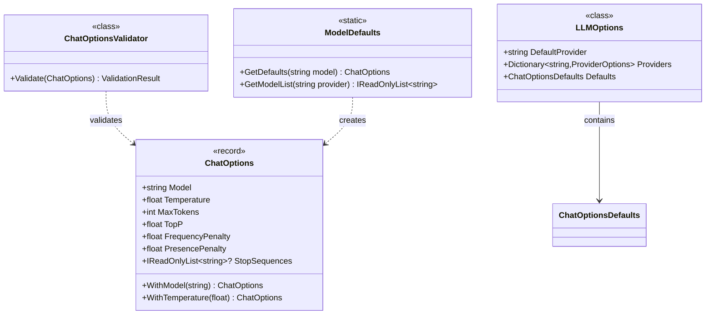
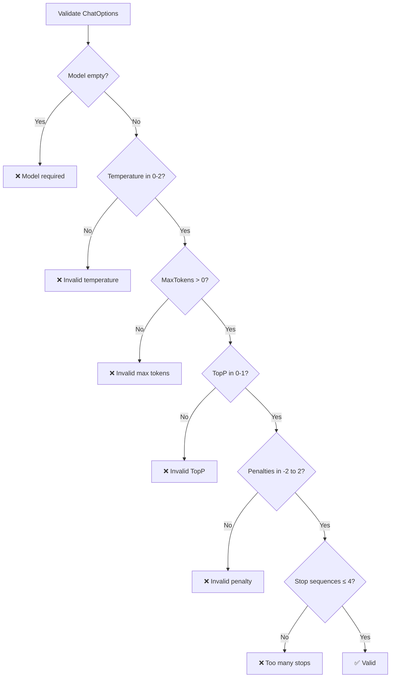
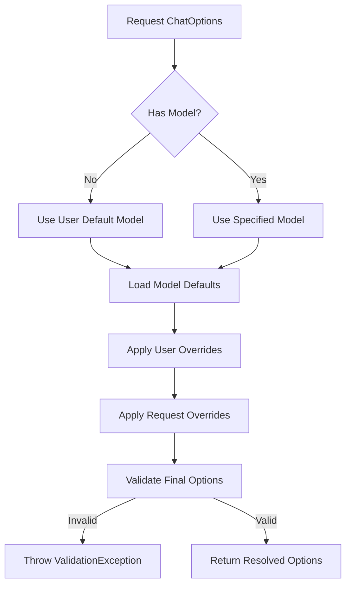

# LCS-DES-061b: Design Specification — Chat Options Model

## 1. Metadata & Categorization

| Field           | Value                                     |
| :-------------- | :---------------------------------------- |
| **Document ID** | LCS-DES-061b                              |
| **Version**     | v0.6.1b                                   |
| **Status**      | Draft                                     |
| **Category**    | Abstraction                               |
| **Module**      | Lexichord.Abstractions                    |
| **Created**     | 2026-01-28                                |
| **Author**      | Documentation Agent                       |
| **Parent**      | [LCS-DES-061-INDEX](LCS-DES-061-INDEX.md) |

---

## 2. Executive Summary

### 2.1 The Requirement

LLM API calls require configurable parameters that control model behavior. These parameters must be:

- Validated before sending to providers
- Defaulted intelligently based on provider and model
- Persistable for user preferences
- Bindable to configuration files

### 2.2 The Solution

Define `ChatOptions` as an immutable record with sensible defaults, accompanied by a FluentValidation validator and model-specific default configurations loaded from `appsettings.json`.

---

## 3. Architecture

### 3.1 Component Placement

```
Lexichord.Abstractions/
└── Contracts/
    └── LLM/
        ├── ChatOptions.cs
        └── ChatOptionsValidator.cs

Lexichord.Modules.LLM/
└── Configuration/
    ├── ModelDefaults.cs
    └── LLMOptions.cs
```

### 3.2 Class Diagram



---

## 4. Data Contract (The API)

### 4.1 ChatOptions Record

```csharp
namespace Lexichord.Abstractions.Contracts.LLM;

/// <summary>
/// Configuration options for LLM chat completion requests.
/// </summary>
/// <param name="Model">The model identifier (e.g., "gpt-4o-mini").</param>
/// <param name="Temperature">Randomness control (0.0-2.0).</param>
/// <param name="MaxTokens">Maximum tokens in the response.</param>
/// <param name="TopP">Nucleus sampling threshold (0.0-1.0).</param>
/// <param name="FrequencyPenalty">Penalize frequent tokens (-2.0 to 2.0).</param>
/// <param name="PresencePenalty">Penalize repeated topics (-2.0 to 2.0).</param>
/// <param name="StopSequences">Sequences that stop generation.</param>
public record ChatOptions(
    string Model = "gpt-4o-mini",
    float Temperature = 0.7f,
    int MaxTokens = 2048,
    float TopP = 1.0f,
    float FrequencyPenalty = 0.0f,
    float PresencePenalty = 0.0f,
    IReadOnlyList<string>? StopSequences = null
)
{
    /// <summary>
    /// Creates options with a different model.
    /// </summary>
    public ChatOptions WithModel(string model) => this with { Model = model };

    /// <summary>
    /// Creates options with a different temperature.
    /// </summary>
    public ChatOptions WithTemperature(float temperature) => this with { Temperature = temperature };

    /// <summary>
    /// Creates options with a different max tokens limit.
    /// </summary>
    public ChatOptions WithMaxTokens(int maxTokens) => this with { MaxTokens = maxTokens };

    /// <summary>
    /// Creates options optimized for creative writing.
    /// </summary>
    public static ChatOptions Creative => new(
        Temperature: 1.2f,
        TopP: 0.95f,
        FrequencyPenalty: 0.5f,
        PresencePenalty: 0.5f
    );

    /// <summary>
    /// Creates options optimized for factual/precise responses.
    /// </summary>
    public static ChatOptions Precise => new(
        Temperature: 0.3f,
        TopP: 0.9f,
        FrequencyPenalty: 0.0f,
        PresencePenalty: 0.0f
    );
}
```

### 4.2 ChatOptionsValidator

```csharp
namespace Lexichord.Abstractions.Contracts.LLM;

using FluentValidation;

/// <summary>
/// Validates ChatOptions parameters against provider constraints.
/// </summary>
public class ChatOptionsValidator : AbstractValidator<ChatOptions>
{
    public ChatOptionsValidator()
    {
        RuleFor(x => x.Model)
            .NotEmpty()
            .WithMessage("Model must be specified.");

        RuleFor(x => x.Temperature)
            .InclusiveBetween(0.0f, 2.0f)
            .WithMessage("Temperature must be between 0.0 and 2.0.");

        RuleFor(x => x.MaxTokens)
            .GreaterThan(0)
            .WithMessage("MaxTokens must be greater than 0.");

        RuleFor(x => x.TopP)
            .InclusiveBetween(0.0f, 1.0f)
            .WithMessage("TopP must be between 0.0 and 1.0.");

        RuleFor(x => x.FrequencyPenalty)
            .InclusiveBetween(-2.0f, 2.0f)
            .WithMessage("FrequencyPenalty must be between -2.0 and 2.0.");

        RuleFor(x => x.PresencePenalty)
            .InclusiveBetween(-2.0f, 2.0f)
            .WithMessage("PresencePenalty must be between -2.0 and 2.0.");

        RuleFor(x => x.StopSequences)
            .Must(s => s == null || s.Count <= 4)
            .WithMessage("Maximum 4 stop sequences allowed.");
    }
}
```

---

## 5. Model Defaults

### 5.1 ModelDefaults Static Class

```csharp
namespace Lexichord.Modules.LLM.Configuration;

/// <summary>
/// Provides model-specific default configurations.
/// </summary>
public static class ModelDefaults
{
    private static readonly Dictionary<string, ChatOptions> _defaults = new()
    {
        // OpenAI Models
        ["gpt-4o"] = new ChatOptions(Model: "gpt-4o", MaxTokens: 4096),
        ["gpt-4o-mini"] = new ChatOptions(Model: "gpt-4o-mini", MaxTokens: 4096),
        ["gpt-4-turbo"] = new ChatOptions(Model: "gpt-4-turbo", MaxTokens: 4096),
        ["gpt-3.5-turbo"] = new ChatOptions(Model: "gpt-3.5-turbo", MaxTokens: 4096),

        // Anthropic Models
        ["claude-3-opus-20240229"] = new ChatOptions(Model: "claude-3-opus-20240229", MaxTokens: 4096),
        ["claude-3-sonnet-20240229"] = new ChatOptions(Model: "claude-3-sonnet-20240229", MaxTokens: 4096),
        ["claude-3-haiku-20240307"] = new ChatOptions(Model: "claude-3-haiku-20240307", MaxTokens: 4096),
    };

    private static readonly Dictionary<string, IReadOnlyList<string>> _providerModels = new()
    {
        ["openai"] = new[] { "gpt-4o", "gpt-4o-mini", "gpt-4-turbo", "gpt-3.5-turbo" },
        ["anthropic"] = new[] { "claude-3-opus-20240229", "claude-3-sonnet-20240229", "claude-3-haiku-20240307" },
    };

    /// <summary>
    /// Gets default options for a specific model.
    /// </summary>
    public static ChatOptions GetDefaults(string model)
        => _defaults.TryGetValue(model, out var defaults)
            ? defaults
            : new ChatOptions(Model: model);

    /// <summary>
    /// Gets available models for a provider.
    /// </summary>
    public static IReadOnlyList<string> GetModelList(string provider)
        => _providerModels.TryGetValue(provider.ToLowerInvariant(), out var models)
            ? models
            : Array.Empty<string>();
}
```

### 5.2 LLMOptions Configuration Class

```csharp
namespace Lexichord.Modules.LLM.Configuration;

/// <summary>
/// Configuration options for the LLM module, bindable to appsettings.json.
/// </summary>
public class LLMOptions
{
    public const string SectionName = "LLM";

    /// <summary>
    /// Default provider name (e.g., "openai").
    /// </summary>
    public string DefaultProvider { get; set; } = "openai";

    /// <summary>
    /// Per-provider configuration.
    /// </summary>
    public Dictionary<string, ProviderOptions> Providers { get; set; } = new();

    /// <summary>
    /// Default chat options used when not specified.
    /// </summary>
    public ChatOptionsDefaults Defaults { get; set; } = new();
}

public class ProviderOptions
{
    public string BaseUrl { get; set; } = string.Empty;
    public string DefaultModel { get; set; } = string.Empty;
    public int MaxRetries { get; set; } = 3;
    public int TimeoutSeconds { get; set; } = 30;
}

public class ChatOptionsDefaults
{
    public float Temperature { get; set; } = 0.7f;
    public int MaxTokens { get; set; } = 2048;
    public float TopP { get; set; } = 1.0f;
}
```

---

## 6. Configuration Binding

### 6.1 appsettings.json Schema

```json
{
    "LLM": {
        "DefaultProvider": "openai",
        "Providers": {
            "OpenAI": {
                "BaseUrl": "https://api.openai.com/v1",
                "DefaultModel": "gpt-4o-mini",
                "MaxRetries": 3,
                "TimeoutSeconds": 30
            },
            "Anthropic": {
                "BaseUrl": "https://api.anthropic.com/v1",
                "DefaultModel": "claude-3-haiku-20240307",
                "MaxRetries": 3,
                "TimeoutSeconds": 30
            }
        },
        "Defaults": {
            "Temperature": 0.7,
            "MaxTokens": 2048,
            "TopP": 1.0
        }
    }
}
```

### 6.2 DI Registration

```csharp
public static class LLMServiceExtensions
{
    public static IServiceCollection AddLLMOptions(
        this IServiceCollection services,
        IConfiguration configuration)
    {
        services.Configure<LLMOptions>(configuration.GetSection(LLMOptions.SectionName));
        services.AddSingleton<IValidator<ChatOptions>, ChatOptionsValidator>();
        return services;
    }
}
```

---

## 7. Validation Decision Tree



---

## 8. Testing Strategy

### 8.1 Unit Tests

| Test Case                                | Validation                           |
| :--------------------------------------- | :----------------------------------- |
| `ChatOptions_DefaultValues`              | All defaults are within valid ranges |
| `ChatOptions_WithModel_ReturnsNew`       | Immutability preserved               |
| `ChatOptions_Creative_ValidPreset`       | Preset passes validation             |
| `ChatOptions_Precise_ValidPreset`        | Preset passes validation             |
| `Validator_Temperature_RejectsNegative`  | Returns error for Temperature = -0.1 |
| `Validator_Temperature_Rejects2_1`       | Returns error for Temperature = 2.1  |
| `Validator_MaxTokens_RejectsZero`        | Returns error for MaxTokens = 0      |
| `Validator_StopSequences_Max4`           | Returns error for 5 stop sequences   |
| `ModelDefaults_KnownModel_ReturnsConfig` | Returns correct defaults for gpt-4o  |
| `ModelDefaults_UnknownModel_ReturnsBase` | Returns default ChatOptions          |

### 8.2 Test Fixtures

```csharp
public static class ChatOptionsTestFixtures
{
    public static ChatOptions Valid => new();

    public static ChatOptions InvalidTemperature => new(Temperature: 3.0f);

    public static ChatOptions InvalidMaxTokens => new(MaxTokens: 0);

    public static ChatOptions TooManyStops => new(
        StopSequences: new[] { "a", "b", "c", "d", "e" }
    );
}
```

---

## 9. Acceptance Criteria

### 9.1 Functional Criteria

| ID    | Criterion                                              | Verification       |
| :---- | :----------------------------------------------------- | :----------------- |
| AC-01 | `ChatOptions` record compiles with default values      | Build succeeds     |
| AC-02 | `With*` methods return new instances                   | Immutability tests |
| AC-03 | Validator rejects out-of-range Temperature             | Unit tests pass    |
| AC-04 | Validator rejects non-positive MaxTokens               | Unit tests pass    |
| AC-05 | Validator rejects more than 4 stop sequences           | Unit tests pass    |
| AC-06 | `ModelDefaults` returns configuration for known models | Unit tests pass    |
| AC-07 | `LLMOptions` binds correctly from appsettings.json     | Integration test   |

### 9.2 Non-Functional Criteria

| ID    | Criterion                          | Target  |
| :---- | :--------------------------------- | :------ |
| NF-01 | Validation time                    | < 100μs |
| NF-02 | Configuration binding startup time | < 10ms  |

---

## 10. Model Resolution Pipeline

### 10.1 Resolution Order

When resolving the effective `ChatOptions` for a request, the system applies a layered resolution:



### 10.2 ChatOptionsResolver Service

```csharp
namespace Lexichord.Modules.LLM.Configuration;

/// <summary>
/// Resolves ChatOptions by merging defaults, user preferences, and request overrides.
/// </summary>
public class ChatOptionsResolver
{
    private readonly IOptions<LLMOptions> _options;
    private readonly ISettingsService _settings;
    private readonly IValidator<ChatOptions> _validator;
    private readonly ILogger<ChatOptionsResolver> _logger;

    private const string UserTemperatureKey = "LLM.User.Temperature";
    private const string UserMaxTokensKey = "LLM.User.MaxTokens";

    public ChatOptionsResolver(
        IOptions<LLMOptions> options,
        ISettingsService settings,
        IValidator<ChatOptions> validator,
        ILogger<ChatOptionsResolver> logger)
    {
        _options = options;
        _settings = settings;
        _validator = validator;
        _logger = logger;
    }

    /// <summary>
    /// Resolves the final ChatOptions by applying the resolution pipeline.
    /// </summary>
    /// <param name="requestOptions">Options provided with the request.</param>
    /// <param name="providerName">Target provider for model-specific defaults.</param>
    /// <returns>Fully resolved and validated ChatOptions.</returns>
    public ChatOptions Resolve(ChatOptions? requestOptions, string providerName)
    {
        _logger.LogDebug("Resolving ChatOptions for provider {Provider}", providerName);

        // Step 1: Determine base model
        var model = requestOptions?.Model
            ?? GetUserDefaultModel(providerName)
            ?? GetProviderDefaultModel(providerName);

        _logger.LogDebug("Resolved model: {Model}", model);

        // Step 2: Load model-specific defaults
        var modelDefaults = ModelDefaults.GetDefaults(model);

        // Step 3: Apply user preferences
        var userOptions = ApplyUserPreferences(modelDefaults);

        // Step 4: Apply request overrides
        var finalOptions = MergeOptions(userOptions, requestOptions);

        // Step 5: Validate
        var result = _validator.Validate(finalOptions);
        if (!result.IsValid)
        {
            _logger.LogWarning("ChatOptions validation failed: {Errors}",
                string.Join(", ", result.Errors.Select(e => e.ErrorMessage)));
            throw new ChatOptionsValidationException(result.Errors);
        }

        _logger.LogDebug("Resolved ChatOptions: Model={Model}, Temp={Temp}, MaxTokens={MaxTokens}",
            finalOptions.Model, finalOptions.Temperature, finalOptions.MaxTokens);

        return finalOptions;
    }

    private string GetUserDefaultModel(string provider)
    {
        return _settings.Get<string>($"LLM.User.{provider}.DefaultModel");
    }

    private string GetProviderDefaultModel(string provider)
    {
        var providerConfig = _options.Value.Providers
            .FirstOrDefault(p => p.Key.Equals(provider, StringComparison.OrdinalIgnoreCase));

        return providerConfig.Value?.DefaultModel ?? "gpt-4o-mini";
    }

    private ChatOptions ApplyUserPreferences(ChatOptions baseOptions)
    {
        var userTemp = _settings.Get<float?>(UserTemperatureKey);
        var userMaxTokens = _settings.Get<int?>(UserMaxTokensKey);

        var result = baseOptions;

        if (userTemp.HasValue)
            result = result with { Temperature = userTemp.Value };

        if (userMaxTokens.HasValue)
            result = result with { MaxTokens = userMaxTokens.Value };

        return result;
    }

    private static ChatOptions MergeOptions(ChatOptions baseOptions, ChatOptions? overrides)
    {
        if (overrides is null) return baseOptions;

        return baseOptions with
        {
            Model = overrides.Model != "gpt-4o-mini" ? overrides.Model : baseOptions.Model,
            Temperature = overrides.Temperature != 0.7f ? overrides.Temperature : baseOptions.Temperature,
            MaxTokens = overrides.MaxTokens != 2048 ? overrides.MaxTokens : baseOptions.MaxTokens,
            TopP = overrides.TopP != 1.0f ? overrides.TopP : baseOptions.TopP,
            FrequencyPenalty = overrides.FrequencyPenalty != 0.0f ? overrides.FrequencyPenalty : baseOptions.FrequencyPenalty,
            PresencePenalty = overrides.PresencePenalty != 0.0f ? overrides.PresencePenalty : baseOptions.PresencePenalty,
            StopSequences = overrides.StopSequences ?? baseOptions.StopSequences
        };
    }
}
```

---

## 11. Dynamic Model Discovery

### 11.1 Provider Model Lists

Providers can dynamically report available models:

```csharp
namespace Lexichord.Abstractions.Contracts.LLM;

/// <summary>
/// Provides model discovery capabilities.
/// </summary>
public interface IModelProvider
{
    /// <summary>
    /// Gets the list of available models from the provider.
    /// </summary>
    /// <param name="ct">Cancellation token.</param>
    /// <returns>List of model information.</returns>
    Task<IReadOnlyList<ModelInfo>> GetAvailableModelsAsync(CancellationToken ct = default);
}

/// <summary>
/// Information about an available model.
/// </summary>
/// <param name="Id">Model identifier (e.g., "gpt-4o").</param>
/// <param name="DisplayName">Human-readable name.</param>
/// <param name="ContextWindow">Maximum context tokens.</param>
/// <param name="MaxOutputTokens">Maximum response tokens.</param>
/// <param name="SupportsVision">Whether the model accepts images.</param>
/// <param name="SupportsTools">Whether function calling is supported.</param>
public record ModelInfo(
    string Id,
    string DisplayName,
    int ContextWindow,
    int MaxOutputTokens,
    bool SupportsVision = false,
    bool SupportsTools = false
);
```

### 11.2 Model Registry

```csharp
namespace Lexichord.Modules.LLM.Configuration;

/// <summary>
/// Caches and provides access to available models across all providers.
/// </summary>
public class ModelRegistry
{
    private readonly ILLMProviderRegistry _providerRegistry;
    private readonly ILogger<ModelRegistry> _logger;
    private readonly ConcurrentDictionary<string, IReadOnlyList<ModelInfo>> _cache = new();
    private readonly SemaphoreSlim _lock = new(1, 1);

    public ModelRegistry(
        ILLMProviderRegistry providerRegistry,
        ILogger<ModelRegistry> logger)
    {
        _providerRegistry = providerRegistry;
        _logger = logger;
    }

    /// <summary>
    /// Gets available models for a provider, with caching.
    /// </summary>
    public async Task<IReadOnlyList<ModelInfo>> GetModelsAsync(
        string providerName,
        bool forceRefresh = false,
        CancellationToken ct = default)
    {
        if (!forceRefresh && _cache.TryGetValue(providerName, out var cached))
        {
            return cached;
        }

        await _lock.WaitAsync(ct);
        try
        {
            // Double-check after acquiring lock
            if (!forceRefresh && _cache.TryGetValue(providerName, out cached))
            {
                return cached;
            }

            _logger.LogInformation("Fetching models for {Provider}", providerName);

            var provider = _providerRegistry.GetProvider(providerName);
            if (provider is IModelProvider modelProvider)
            {
                var models = await modelProvider.GetAvailableModelsAsync(ct);
                _cache[providerName] = models;
                _logger.LogInformation("Cached {Count} models for {Provider}",
                    models.Count, providerName);
                return models;
            }

            // Fall back to static list
            var staticModels = ModelDefaults.GetModelList(providerName)
                .Select(m => new ModelInfo(m, m, 128000, 4096))
                .ToList();

            _cache[providerName] = staticModels;
            return staticModels;
        }
        finally
        {
            _lock.Release();
        }
    }

    /// <summary>
    /// Gets information for a specific model.
    /// </summary>
    public async Task<ModelInfo?> GetModelInfoAsync(
        string modelId,
        CancellationToken ct = default)
    {
        foreach (var provider in _providerRegistry.AvailableProviders)
        {
            var models = await GetModelsAsync(provider.Name, ct: ct);
            var model = models.FirstOrDefault(m => m.Id == modelId);
            if (model is not null) return model;
        }

        return null;
    }
}
```

---

## 12. Context Window Management

### 12.1 Token Estimation

Estimate token usage before sending requests:

```csharp
namespace Lexichord.Modules.LLM.Configuration;

/// <summary>
/// Estimates token usage for ChatOptions planning.
/// </summary>
public class TokenEstimator
{
    private readonly ITokenCounter _tokenCounter;
    private readonly ModelRegistry _modelRegistry;
    private readonly ILogger<TokenEstimator> _logger;

    // Per-message overhead in tokens
    private const int MessageOverhead = 4; // <|start|>role<|end|>content
    private const int RequestOverhead = 3; // <|start|>assistant

    public TokenEstimator(
        ITokenCounter tokenCounter,
        ModelRegistry modelRegistry,
        ILogger<TokenEstimator> logger)
    {
        _tokenCounter = tokenCounter;
        _modelRegistry = modelRegistry;
        _logger = logger;
    }

    /// <summary>
    /// Estimates total tokens for a request.
    /// </summary>
    public async Task<TokenEstimate> EstimateAsync(
        ChatRequest request,
        CancellationToken ct = default)
    {
        var promptTokens = 0;

        foreach (var message in request.Messages)
        {
            promptTokens += _tokenCounter.CountTokens(message.Content);
            promptTokens += MessageOverhead;

            if (message.Name is not null)
            {
                promptTokens += _tokenCounter.CountTokens(message.Name);
            }
        }

        promptTokens += RequestOverhead;

        var modelInfo = await _modelRegistry.GetModelInfoAsync(request.Options.Model, ct);
        var contextWindow = modelInfo?.ContextWindow ?? 128000;
        var maxOutput = modelInfo?.MaxOutputTokens ?? 4096;

        var availableForResponse = Math.Min(
            request.Options.MaxTokens,
            Math.Min(maxOutput, contextWindow - promptTokens)
        );

        _logger.LogDebug(
            "Token estimate: Prompt={Prompt}, Available={Available}, Context={Context}",
            promptTokens, availableForResponse, contextWindow);

        return new TokenEstimate(
            EstimatedPromptTokens: promptTokens,
            AvailableResponseTokens: Math.Max(0, availableForResponse),
            ContextWindow: contextWindow,
            WouldExceedContext: promptTokens >= contextWindow
        );
    }
}

/// <summary>
/// Token usage estimates for a request.
/// </summary>
public record TokenEstimate(
    int EstimatedPromptTokens,
    int AvailableResponseTokens,
    int ContextWindow,
    bool WouldExceedContext
);
```

### 12.2 Automatic MaxTokens Adjustment

```csharp
/// <summary>
/// Extension for ChatOptions to handle context limits.
/// </summary>
public static class ChatOptionsContextExtensions
{
    /// <summary>
    /// Adjusts MaxTokens to fit within the context window.
    /// </summary>
    /// <param name="options">Original options.</param>
    /// <param name="estimate">Token estimation.</param>
    /// <returns>Adjusted options.</returns>
    public static ChatOptions AdjustForContext(
        this ChatOptions options,
        TokenEstimate estimate)
    {
        if (estimate.WouldExceedContext)
        {
            throw new ContextWindowExceededException(
                estimate.EstimatedPromptTokens,
                estimate.ContextWindow);
        }

        if (options.MaxTokens > estimate.AvailableResponseTokens)
        {
            return options with { MaxTokens = estimate.AvailableResponseTokens };
        }

        return options;
    }
}

/// <summary>
/// Thrown when the request would exceed the model's context window.
/// </summary>
public class ContextWindowExceededException : ChatCompletionException
{
    public int RequestedTokens { get; }
    public int ContextWindow { get; }

    public ContextWindowExceededException(int requested, int contextWindow)
        : base("context",
            $"Request ({requested} tokens) exceeds model context window ({contextWindow} tokens)")
    {
        RequestedTokens = requested;
        ContextWindow = contextWindow;
    }
}
```

---

## 13. Use Case Presets

### 13.1 Extended Preset Library

````csharp
namespace Lexichord.Abstractions.Contracts.LLM;

public partial record ChatOptions
{
    /// <summary>
    /// Preset for creative writing with high variability.
    /// </summary>
    public static ChatOptions Creative => new(
        Temperature: 1.2f,
        TopP: 0.95f,
        FrequencyPenalty: 0.5f,
        PresencePenalty: 0.5f
    );

    /// <summary>
    /// Preset for factual/precise responses with low variability.
    /// </summary>
    public static ChatOptions Precise => new(
        Temperature: 0.3f,
        TopP: 0.9f,
        FrequencyPenalty: 0.0f,
        PresencePenalty: 0.0f
    );

    /// <summary>
    /// Preset for code generation with deterministic output.
    /// </summary>
    public static ChatOptions CodeGeneration => new(
        Temperature: 0.0f,
        TopP: 1.0f,
        FrequencyPenalty: 0.0f,
        PresencePenalty: 0.0f,
        StopSequences: new[] { "```", "---" }
    );

    /// <summary>
    /// Preset for balanced conversational responses.
    /// </summary>
    public static ChatOptions Conversational => new(
        Temperature: 0.7f,
        TopP: 0.9f,
        FrequencyPenalty: 0.3f,
        PresencePenalty: 0.3f
    );

    /// <summary>
    /// Preset for summarization tasks.
    /// </summary>
    public static ChatOptions Summarization => new(
        Temperature: 0.5f,
        MaxTokens: 1024,
        TopP: 0.85f,
        FrequencyPenalty: 0.0f,
        PresencePenalty: 0.0f
    );

    /// <summary>
    /// Preset for editing and revision tasks.
    /// </summary>
    public static ChatOptions Editing => new(
        Temperature: 0.4f,
        TopP: 0.9f,
        FrequencyPenalty: 0.2f,
        PresencePenalty: 0.1f
    );

    /// <summary>
    /// Preset for brainstorming with maximum creativity.
    /// </summary>
    public static ChatOptions Brainstorming => new(
        Temperature: 1.5f,
        TopP: 0.98f,
        FrequencyPenalty: 0.8f,
        PresencePenalty: 0.8f
    );
}
````

### 13.2 Preset Selection Matrix

| Use Case         | Temp | TopP | FreqPen | PresPen | Recommended Model           |
| :--------------- | :--- | :--- | :------ | :------ | :-------------------------- |
| Creative Writing | 1.2  | 0.95 | 0.5     | 0.5     | gpt-4o, claude-3-opus       |
| Technical Docs   | 0.3  | 0.9  | 0.0     | 0.0     | gpt-4o, claude-3-sonnet     |
| Code Generation  | 0.0  | 1.0  | 0.0     | 0.0     | gpt-4o, claude-3-opus       |
| Conversation     | 0.7  | 0.9  | 0.3     | 0.3     | gpt-4o-mini, claude-3-haiku |
| Summarization    | 0.5  | 0.85 | 0.0     | 0.0     | gpt-4o-mini                 |
| Editing          | 0.4  | 0.9  | 0.2     | 0.1     | gpt-4o, claude-3-sonnet     |
| Brainstorming    | 1.5  | 0.98 | 0.8     | 0.8     | gpt-4o, claude-3-opus       |

---

## 14. Provider-Specific Parameter Mapping

### 14.1 OpenAI Parameter Mapping

```csharp
namespace Lexichord.Modules.LLM.Providers.OpenAI;

internal static class OpenAIParameterMapper
{
    public static JsonObject ToRequestBody(ChatRequest request)
    {
        var body = new JsonObject
        {
            ["model"] = request.Options.Model,
            ["messages"] = MapMessages(request.Messages),
            ["temperature"] = request.Options.Temperature,
            ["max_tokens"] = request.Options.MaxTokens,
            ["top_p"] = request.Options.TopP,
            ["frequency_penalty"] = request.Options.FrequencyPenalty,
            ["presence_penalty"] = request.Options.PresencePenalty
        };

        if (request.Options.StopSequences?.Count > 0)
        {
            body["stop"] = new JsonArray(
                request.Options.StopSequences.Select(s => JsonValue.Create(s)).ToArray()
            );
        }

        return body;
    }

    private static JsonArray MapMessages(IReadOnlyList<ChatMessage> messages)
    {
        var array = new JsonArray();

        foreach (var msg in messages)
        {
            var item = new JsonObject
            {
                ["role"] = msg.Role.ToProviderString("openai"),
                ["content"] = msg.Content
            };

            if (msg.Name is not null)
            {
                item["name"] = msg.Name;
            }

            array.Add(item);
        }

        return array;
    }
}
```

### 14.2 Anthropic Parameter Mapping

```csharp
namespace Lexichord.Modules.LLM.Providers.Anthropic;

internal static class AnthropicParameterMapper
{
    public static JsonObject ToRequestBody(ChatRequest request)
    {
        // Anthropic uses different parameter names and ranges
        var body = new JsonObject
        {
            ["model"] = request.Options.Model,
            ["messages"] = MapMessages(request.Messages),
            ["max_tokens"] = request.Options.MaxTokens,
            ["temperature"] = ClampTemperature(request.Options.Temperature),
            ["top_p"] = request.Options.TopP
        };

        // Anthropic uses "stop_sequences" instead of "stop"
        if (request.Options.StopSequences?.Count > 0)
        {
            body["stop_sequences"] = new JsonArray(
                request.Options.StopSequences.Select(s => JsonValue.Create(s)).ToArray()
            );
        }

        // Extract system message (Anthropic handles it separately)
        var systemMessage = request.Messages
            .FirstOrDefault(m => m.Role == ChatRole.System);

        if (systemMessage is not null)
        {
            body["system"] = systemMessage.Content;
        }

        return body;
    }

    // Anthropic's temperature range is 0-1 (not 0-2)
    private static float ClampTemperature(float temp) => Math.Clamp(temp / 2.0f, 0f, 1f);

    private static JsonArray MapMessages(IReadOnlyList<ChatMessage> messages)
    {
        var array = new JsonArray();

        foreach (var msg in messages.Where(m => m.Role != ChatRole.System))
        {
            array.Add(new JsonObject
            {
                ["role"] = msg.Role.ToProviderString("anthropic"),
                ["content"] = msg.Content
            });
        }

        return array;
    }
}
```

---

## 15. Advanced Validation Scenarios

### 15.1 Provider-Aware Validation

```csharp
namespace Lexichord.Modules.LLM.Validation;

/// <summary>
/// Provider-specific validation rules.
/// </summary>
public class ProviderAwareChatOptionsValidator : AbstractValidator<ChatOptions>
{
    private readonly string _providerName;
    private readonly ModelRegistry _modelRegistry;

    public ProviderAwareChatOptionsValidator(
        string providerName,
        ModelRegistry modelRegistry)
    {
        _providerName = providerName;
        _modelRegistry = modelRegistry;

        // Base rules
        Include(new ChatOptionsValidator());

        // Provider-specific rules
        if (providerName.Equals("anthropic", StringComparison.OrdinalIgnoreCase))
        {
            RuleFor(x => x.Temperature)
                .LessThanOrEqualTo(1.0f)
                .WithMessage("Anthropic temperature must be between 0.0 and 1.0 (mapped from 0-2).");
        }

        RuleFor(x => x.Model)
            .MustAsync(async (model, ct) => await IsModelAvailableAsync(model, ct))
            .WithMessage(x => $"Model '{x.Model}' is not available for provider '{_providerName}'.");
    }

    private async Task<bool> IsModelAvailableAsync(string model, CancellationToken ct)
    {
        var models = await _modelRegistry.GetModelsAsync(_providerName, ct: ct);
        return models.Any(m => m.Id.Equals(model, StringComparison.OrdinalIgnoreCase));
    }
}
```

### 15.2 Validation Error Experience

```csharp
/// <summary>
/// Exception containing detailed validation errors.
/// </summary>
public class ChatOptionsValidationException : Exception
{
    public IReadOnlyList<ValidationError> Errors { get; }

    public ChatOptionsValidationException(IEnumerable<ValidationFailure> failures)
        : base(FormatMessage(failures))
    {
        Errors = failures
            .Select(f => new ValidationError(f.PropertyName, f.ErrorMessage, f.AttemptedValue))
            .ToList();
    }

    private static string FormatMessage(IEnumerable<ValidationFailure> failures)
    {
        var messages = failures.Select(f => $"  • {f.PropertyName}: {f.ErrorMessage}");
        return $"ChatOptions validation failed:\n{string.Join("\n", messages)}";
    }
}

public record ValidationError(
    string Property,
    string Message,
    object? AttemptedValue
);
```

---

## 16. Logging & Telemetry

### 16.1 Structured Logging Events

```csharp
internal static partial class LLMLogEvents
{
    [LoggerMessage(
        EventId = 1001,
        Level = LogLevel.Debug,
        Message = "Resolving ChatOptions for provider {Provider}")]
    public static partial void ResolvingOptions(ILogger logger, string provider);

    [LoggerMessage(
        EventId = 1002,
        Level = LogLevel.Debug,
        Message = "Resolved model: {Model} (source: {Source})")]
    public static partial void ResolvedModel(ILogger logger, string model, string source);

    [LoggerMessage(
        EventId = 1003,
        Level = LogLevel.Warning,
        Message = "ChatOptions validation failed for {Provider}: {Errors}")]
    public static partial void ValidationFailed(ILogger logger, string provider, string errors);

    [LoggerMessage(
        EventId = 1004,
        Level = LogLevel.Information,
        Message = "Final ChatOptions: Model={Model}, Temp={Temperature}, MaxTokens={MaxTokens}")]
    public static partial void FinalOptions(
        ILogger logger, string model, float temperature, int maxTokens);
}
```

---

## 17. Performance Benchmarks

### 17.1 Baseline Metrics

| Operation                     | Target  | Status |
| :---------------------------- | :------ | :----- |
| ChatOptions creation          | < 500ns | ⏳     |
| ChatOptions.With\* mutation   | < 200ns | ⏳     |
| Validation (FluentValidation) | < 50μs  | ⏳     |
| Provider-aware validation     | < 100μs | ⏳     |
| Options resolution pipeline   | < 500μs | ⏳     |
| Token estimation              | < 1ms   | ⏳     |

### 17.2 Benchmark Suite

```csharp
[MemoryDiagnoser]
public class ChatOptionsBenchmarks
{
    private readonly ChatOptions _options = new();
    private readonly ChatOptionsValidator _validator = new();

    [Benchmark]
    public ChatOptions CreateOptions() => new();

    [Benchmark]
    public ChatOptions WithTemperature() => _options.WithTemperature(0.5f);

    [Benchmark]
    public ChatOptions WithMultipleMutations() =>
        _options
            .WithModel("gpt-4o")
            .WithTemperature(0.8f)
            .WithMaxTokens(4096);

    [Benchmark]
    public ValidationResult Validate() => _validator.Validate(_options);

    [Benchmark]
    public ChatOptions GetPreset() => ChatOptions.Creative;
}
```

---

## 18. Migration Guide

### 18.1 From Hardcoded Parameters

**Before:**

```csharp
var request = new {
    model = "gpt-4",
    temperature = 0.7,
    max_tokens = 2000
};
```

**After:**

```csharp
var options = new ChatOptions(Model: "gpt-4", MaxTokens: 2000);
// or use presets
var options = ChatOptions.Conversational.WithModel("gpt-4");
```

### 18.2 From Provider-Specific Config

**Before:**

```csharp
// OpenAI-specific configuration scattered in code
var openAiConfig = new OpenAIConfiguration
{
    Model = "gpt-4",
    Temperature = 0.7,
    MaxTokens = 2000
};
```

**After:**

```csharp
// Provider-agnostic, validated, with presets
var options = ChatOptions.Conversational
    .WithModel("gpt-4")
    .WithMaxTokens(2000);

// Works across any provider
await openAiProvider.CompleteAsync(request with { Options = options });
await anthropicProvider.CompleteAsync(request with { Options = options });
```

---

## 19. Version History

| Version | Date       | Author              | Changes                                                         |
| :------ | :--------- | :------------------ | :-------------------------------------------------------------- |
| 0.1     | 2026-01-28 | Documentation Agent | Initial draft                                                   |
| 0.2     | 2026-01-28 | Documentation Agent | Added resolution, discovery, token estimation, presets, logging |
