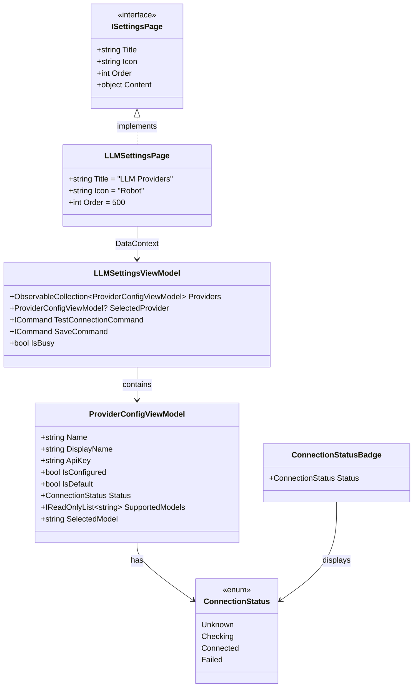
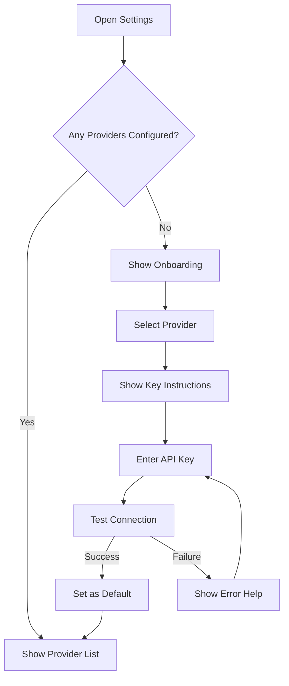

# LCS-DES-061d: Design Specification — API Key Management UI

## 1. Metadata & Categorization

| Field           | Value                                     |
| :-------------- | :---------------------------------------- |
| **Document ID** | LCS-DES-061d                              |
| **Version**     | v0.6.1d                                   |
| **Status**      | Draft                                     |
| **Category**    | Presentation                              |
| **Module**      | Lexichord.Modules.LLM                     |
| **Created**     | 2026-01-28                                |
| **Author**      | Documentation Agent                       |
| **Parent**      | [LCS-DES-061-INDEX](LCS-DES-061-INDEX.md) |

---

## 2. Executive Summary

### 2.1 The Requirement

Users must be able to:

- View available LLM providers
- Enter and update API keys securely
- Test provider connections before use
- Select a default provider
- See current configuration status at a glance

### 2.2 The Solution

Extend the Settings dialog (v0.1.6a) with an "LLM Providers" settings page. The page integrates with `ISecureVault` for secure key storage and `ILLMProviderRegistry` for provider management.

---

## 3. Architecture

### 3.1 Component Placement

```
Lexichord.Modules.LLM/
└── Presentation/
    ├── Views/
    │   ├── LLMSettingsPage.axaml
    │   ├── LLMSettingsPage.axaml.cs
    │   ├── ProviderConfigPanel.axaml
    │   └── ConnectionStatusBadge.axaml
    └── ViewModels/
        ├── LLMSettingsViewModel.cs
        └── ProviderConfigViewModel.cs
```

### 3.2 Class Diagram



---

## 4. Data Contract (The API)

### 4.1 ConnectionStatus Enum

```csharp
namespace Lexichord.Modules.LLM.Presentation;

/// <summary>
/// Represents the connection status of an LLM provider.
/// </summary>
public enum ConnectionStatus
{
    /// <summary>
    /// Status has not been checked.
    /// </summary>
    Unknown,

    /// <summary>
    /// Connection test is in progress.
    /// </summary>
    Checking,

    /// <summary>
    /// Successfully connected to provider.
    /// </summary>
    Connected,

    /// <summary>
    /// Connection test failed.
    /// </summary>
    Failed
}
```

### 4.2 ProviderConfigViewModel

```csharp
namespace Lexichord.Modules.LLM.Presentation.ViewModels;

/// <summary>
/// ViewModel for a single LLM provider configuration.
/// </summary>
public partial class ProviderConfigViewModel : ViewModelBase
{
    private readonly ISecureVault _vault;
    private readonly ILLMProviderRegistry _registry;
    private readonly string _apiKeyVaultName;

    [ObservableProperty]
    private string _name = string.Empty;

    [ObservableProperty]
    private string _displayName = string.Empty;

    [ObservableProperty]
    private string _apiKey = string.Empty;

    [ObservableProperty]
    private bool _isConfigured;

    [ObservableProperty]
    private bool _isDefault;

    [ObservableProperty]
    private ConnectionStatus _status = ConnectionStatus.Unknown;

    [ObservableProperty]
    private string? _statusMessage;

    [ObservableProperty]
    private IReadOnlyList<string> _supportedModels = Array.Empty<string>();

    [ObservableProperty]
    private string _selectedModel = string.Empty;

    public ProviderConfigViewModel(
        LLMProviderInfo info,
        ISecureVault vault,
        ILLMProviderRegistry registry)
    {
        _vault = vault;
        _registry = registry;
        _apiKeyVaultName = $"{info.Name.ToLowerInvariant()}:api-key";

        Name = info.Name;
        DisplayName = info.DisplayName;
        IsConfigured = info.IsConfigured;
        SupportedModels = info.SupportedModels;

        if (SupportedModels.Count > 0)
        {
            SelectedModel = SupportedModels[0];
        }
    }

    /// <summary>
    /// Loads the API key from secure vault (masked display).
    /// </summary>
    public async Task LoadApiKeyAsync()
    {
        var key = await _vault.GetSecretAsync(_apiKeyVaultName);
        if (!string.IsNullOrEmpty(key))
        {
            // Show masked version for display
            ApiKey = MaskApiKey(key);
            IsConfigured = true;
        }
    }

    /// <summary>
    /// Saves the API key to secure vault.
    /// </summary>
    public async Task SaveApiKeyAsync(string newKey)
    {
        if (string.IsNullOrWhiteSpace(newKey))
        {
            await _vault.DeleteSecretAsync(_apiKeyVaultName);
            IsConfigured = false;
        }
        else
        {
            await _vault.StoreSecretAsync(_apiKeyVaultName, newKey);
            ApiKey = MaskApiKey(newKey);
            IsConfigured = true;
        }

        Status = ConnectionStatus.Unknown;
    }

    private static string MaskApiKey(string key)
    {
        if (key.Length <= 8) return new string('•', key.Length);
        return $"{key[..4]}{"•".PadRight(key.Length - 8, '•')}{key[^4..]}";
    }
}
```

### 4.3 LLMSettingsViewModel

```csharp
namespace Lexichord.Modules.LLM.Presentation.ViewModels;

/// <summary>
/// ViewModel for the LLM Settings page.
/// </summary>
public partial class LLMSettingsViewModel : ViewModelBase
{
    private readonly ILLMProviderRegistry _registry;
    private readonly ISecureVault _vault;
    private readonly ILogger<LLMSettingsViewModel> _logger;

    [ObservableProperty]
    private ObservableCollection<ProviderConfigViewModel> _providers = new();

    [ObservableProperty]
    private ProviderConfigViewModel? _selectedProvider;

    [ObservableProperty]
    private bool _isBusy;

    [ObservableProperty]
    private string? _errorMessage;

    public LLMSettingsViewModel(
        ILLMProviderRegistry registry,
        ISecureVault vault,
        ILogger<LLMSettingsViewModel> logger)
    {
        _registry = registry;
        _vault = vault;
        _logger = logger;

        LoadProviders();
    }

    private void LoadProviders()
    {
        Providers.Clear();

        foreach (var info in _registry.AvailableProviders)
        {
            var vm = new ProviderConfigViewModel(info, _vault, _registry);
            Providers.Add(vm);
        }

        if (Providers.Count > 0)
        {
            SelectedProvider = Providers[0];
        }
    }

    [RelayCommand]
    private async Task TestConnectionAsync()
    {
        if (SelectedProvider is null) return;

        IsBusy = true;
        SelectedProvider.Status = ConnectionStatus.Checking;
        SelectedProvider.StatusMessage = "Testing connection...";

        try
        {
            var provider = _registry.GetProvider(SelectedProvider.Name);
            var request = ChatRequest.FromUserMessage("Hello",
                new ChatOptions(MaxTokens: 5));

            var response = await provider.CompleteAsync(request);

            SelectedProvider.Status = ConnectionStatus.Connected;
            SelectedProvider.StatusMessage = $"Connected! Response in {response.Duration.TotalMilliseconds:F0}ms";

            _logger.LogInformation(
                "Connection test successful for {Provider}",
                SelectedProvider.Name);
        }
        catch (AuthenticationException)
        {
            SelectedProvider.Status = ConnectionStatus.Failed;
            SelectedProvider.StatusMessage = "Invalid API key";
            _logger.LogWarning("Connection test failed: invalid API key");
        }
        catch (Exception ex)
        {
            SelectedProvider.Status = ConnectionStatus.Failed;
            SelectedProvider.StatusMessage = $"Error: {ex.Message}";
            _logger.LogError(ex, "Connection test failed for {Provider}",
                SelectedProvider.Name);
        }
        finally
        {
            IsBusy = false;
        }
    }

    [RelayCommand]
    private async Task SaveApiKeyAsync(string newKey)
    {
        if (SelectedProvider is null) return;

        IsBusy = true;

        try
        {
            await SelectedProvider.SaveApiKeyAsync(newKey);
            _logger.LogInformation("API key saved for {Provider}",
                SelectedProvider.Name);
        }
        catch (Exception ex)
        {
            ErrorMessage = $"Failed to save API key: {ex.Message}";
            _logger.LogError(ex, "Failed to save API key");
        }
        finally
        {
            IsBusy = false;
        }
    }

    [RelayCommand]
    private void SetAsDefault()
    {
        if (SelectedProvider is null) return;

        _registry.SetDefaultProvider(SelectedProvider.Name);

        foreach (var provider in Providers)
        {
            provider.IsDefault = provider.Name == SelectedProvider.Name;
        }

        _logger.LogInformation("Default provider set to {Provider}",
            SelectedProvider.Name);
    }
}
```

---

## 5. UI/UX Design

### 5.1 Page Layout

```
┌─────────────────────────────────────────────────────────────────┐
│ LLM Providers                                                    │
├─────────────────────────────────────────────────────────────────┤
│                                                                  │
│  ┌─────────────────┐  ┌────────────────────────────────────────┐│
│  │ Providers       │  │ OpenAI Configuration                   ││
│  │                 │  │                                        ││
│  │ ● OpenAI    ✓   │  │ API Key                                ││
│  │   Anthropic     │  │ ┌────────────────────────────────────┐ ││
│  │   Ollama        │  │ │ sk-••••••••••••••••••••••••abcd    │ ││
│  │                 │  │ └────────────────────────────────────┘ ││
│  │                 │  │                                        ││
│  │                 │  │ Default Model                          ││
│  │                 │  │ ┌────────────────────────────────────┐ ││
│  │                 │  │ │ gpt-4o-mini                    ▼  │ ││
│  │                 │  │ └────────────────────────────────────┘ ││
│  │                 │  │                                        ││
│  │                 │  │ ┌─────────────────┐  ┌───────────────┐ ││
│  │                 │  │ │ Test Connection │  │ Set as Default│ ││
│  │                 │  │ └─────────────────┘  └───────────────┘ ││
│  │                 │  │                                        ││
│  │                 │  │ Status: ● Connected (150ms)            ││
│  │                 │  │                                        ││
│  └─────────────────┘  └────────────────────────────────────────┘│
│                                                                  │
└─────────────────────────────────────────────────────────────────┘
```

### 5.2 ConnectionStatusBadge States

| State     | Color | Icon              | Text       |
| :-------- | :---- | :---------------- | :--------- |
| Unknown   | Gray  | QuestionCircle    | Not tested |
| Checking  | Blue  | Spinner           | Testing... |
| Connected | Green | CheckCircle       | Connected  |
| Failed    | Red   | ExclamationCircle | Failed     |

### 5.3 AXAML Implementation

```xml
<!-- LLMSettingsPage.axaml -->
<UserControl xmlns="https://github.com/avaloniaui"
             xmlns:x="http://schemas.microsoft.com/winfx/2006/xaml"
             xmlns:vm="using:Lexichord.Modules.LLM.Presentation.ViewModels"
             x:Class="Lexichord.Modules.LLM.Presentation.Views.LLMSettingsPage"
             x:DataType="vm:LLMSettingsViewModel">

    <Grid ColumnDefinitions="200,*" Margin="16">
        <!-- Provider List -->
        <Border Grid.Column="0"
                Background="{DynamicResource SurfaceBrush}"
                CornerRadius="8"
                Margin="0,0,16,0">
            <ListBox ItemsSource="{Binding Providers}"
                     SelectedItem="{Binding SelectedProvider}">
                <ListBox.ItemTemplate>
                    <DataTemplate x:DataType="vm:ProviderConfigViewModel">
                        <StackPanel Orientation="Horizontal" Spacing="8">
                            <Ellipse Width="8" Height="8"
                                     Fill="{Binding IsConfigured,
                                            Converter={StaticResource ConfiguredToBrushConverter}}"/>
                            <TextBlock Text="{Binding DisplayName}"/>
                            <TextBlock Text="★"
                                       IsVisible="{Binding IsDefault}"
                                       Foreground="{DynamicResource AccentBrush}"/>
                        </StackPanel>
                    </DataTemplate>
                </ListBox.ItemTemplate>
            </ListBox>
        </Border>

        <!-- Configuration Panel -->
        <Border Grid.Column="1"
                Background="{DynamicResource SurfaceBrush}"
                CornerRadius="8"
                Padding="16">
            <StackPanel Spacing="16"
                        DataContext="{Binding SelectedProvider}"
                        IsEnabled="{Binding $parent[UserControl].DataContext.IsBusy,
                                    Converter={x:Static BoolConverters.Not}}">

                <TextBlock Text="{Binding DisplayName}"
                           Classes="h2"/>

                <!-- API Key Input -->
                <StackPanel Spacing="4">
                    <TextBlock Text="API Key"/>
                    <TextBox Text="{Binding ApiKey}"
                             PasswordChar="•"
                             Watermark="Enter API key..."
                             Classes="monospace"/>
                </StackPanel>

                <!-- Model Selection -->
                <StackPanel Spacing="4">
                    <TextBlock Text="Default Model"/>
                    <ComboBox ItemsSource="{Binding SupportedModels}"
                              SelectedItem="{Binding SelectedModel}"/>
                </StackPanel>

                <!-- Actions -->
                <StackPanel Orientation="Horizontal" Spacing="8">
                    <Button Content="Test Connection"
                            Command="{Binding $parent[UserControl].DataContext.TestConnectionCommand}"/>
                    <Button Content="Set as Default"
                            Command="{Binding $parent[UserControl].DataContext.SetAsDefaultCommand}"
                            IsEnabled="{Binding IsConfigured}"/>
                </StackPanel>

                <!-- Status -->
                <local:ConnectionStatusBadge Status="{Binding Status}"
                                              Message="{Binding StatusMessage}"/>

            </StackPanel>
        </Border>
    </Grid>
</UserControl>
```

---

## 6. Secure Storage Integration

### 6.1 Vault Key Naming

| Provider  | Vault Key           |
| :-------- | :------------------ |
| OpenAI    | `openai:api-key`    |
| Anthropic | `anthropic:api-key` |
| Ollama    | `ollama:api-key`    |

### 6.2 Security Considerations

- API keys never displayed in full (masked after load)
- Keys stored via `ISecureVault` → OS Keychain
- No logging of key values
- Memory cleared after vault operations
- Input field uses `PasswordChar` for entry

---

## 7. Testing Strategy

### 7.1 Unit Tests

| Test Case                                    | Validation                   |
| :------------------------------------------- | :--------------------------- |
| `ProviderConfigVM_MaskApiKey_CorrectFormat`  | First/last 4 chars visible   |
| `ProviderConfigVM_SaveKey_UpdatesConfigured` | IsConfigured set to true     |
| `SettingsVM_LoadProviders_PopulatesList`     | All providers loaded         |
| `SettingsVM_TestConnection_UpdatesStatus`    | Status cycles through states |
| `SettingsVM_SetDefault_UpdatesFlags`         | Only one IsDefault true      |

### 7.2 Integration Tests

| Test Case                                  | Validation                       |
| :----------------------------------------- | :------------------------------- |
| `VaultIntegration_SaveLoad_RoundTrip`      | Key retrieved matches saved      |
| `ConnectionTest_ValidKey_ReturnsConnected` | Real API call succeeds           |
| `ConnectionTest_InvalidKey_ReturnsFailed`  | Authentication exception handled |

### 7.3 UI Automation Tests

| Test Case                             | Validation              |
| :------------------------------------ | :---------------------- |
| `SelectProvider_ShowsConfiguration`   | Config panel updates    |
| `EnterKey_TestConnection_ShowsStatus` | Badge updates correctly |
| `SetDefault_ShowsStar`                | Star indicator visible  |

---

## 8. Acceptance Criteria

### 8.1 Functional Criteria

| ID    | Criterion                                | Verification        |
| :---- | :--------------------------------------- | :------------------ |
| AC-01 | Settings page appears in Settings dialog | Manual verification |
| AC-02 | All registered providers shown in list   | Unit test           |
| AC-03 | API key input masked during entry        | Manual verification |
| AC-04 | API key stored securely in vault         | Integration test    |
| AC-05 | Test Connection shows real-time status   | Integration test    |
| AC-06 | Set as Default persists preference       | Integration test    |
| AC-07 | Status badge reflects connection state   | Unit test           |

### 8.2 Non-Functional Criteria

| ID    | Criterion               | Target  |
| :---- | :---------------------- | :------ |
| NF-01 | Page load time          | < 200ms |
| NF-02 | Connection test timeout | < 30s   |
| NF-03 | Key save operation time | < 500ms |

---

## 9. Security Deep Dive

### 9.1 Secure Input Handling

```csharp
namespace Lexichord.Modules.LLM.Presentation.Controls;

/// <summary>
/// Secure text input that clears memory on dispose.
/// </summary>
public class SecureTextBox : TextBox, IDisposable
{
    private SecureString? _secureValue;
    private bool _disposed;

    /// <summary>
    /// Gets the value as a SecureString.
    /// </summary>
    public SecureString? SecureValue => _secureValue;

    protected override void OnTextChanged(EventArgs e)
    {
        base.OnTextChanged(e);

        // Update secure string
        _secureValue?.Dispose();
        _secureValue = new SecureString();

        foreach (var c in Text ?? string.Empty)
        {
            _secureValue.AppendChar(c);
        }

        _secureValue.MakeReadOnly();
    }

    public void Dispose()
    {
        if (_disposed) return;

        // Clear the text
        Text = new string('\0', Text?.Length ?? 0);
        Text = string.Empty;

        // Dispose secure string
        _secureValue?.Dispose();
        _secureValue = null;

        _disposed = true;
    }
}
```

### 9.2 Key Validation Before Storage

```csharp
/// <summary>
/// Validates API key format before saving.
/// </summary>
public static class ApiKeyValidator
{
    private static readonly Dictionary<string, Regex> KeyPatterns = new()
    {
        ["openai"] = new Regex(@"^sk-[a-zA-Z0-9]{32,}$", RegexOptions.Compiled),
        ["anthropic"] = new Regex(@"^sk-ant-[a-zA-Z0-9-]{32,}$", RegexOptions.Compiled),
        ["azure-openai"] = new Regex(@"^[a-f0-9]{32}$", RegexOptions.Compiled)
    };

    public static ValidationResult Validate(string provider, string key)
    {
        if (string.IsNullOrWhiteSpace(key))
        {
            return ValidationResult.Invalid("API key cannot be empty");
        }

        if (KeyPatterns.TryGetValue(provider.ToLowerInvariant(), out var pattern))
        {
            if (!pattern.IsMatch(key))
            {
                return ValidationResult.Invalid(
                    $"API key format invalid for {provider}. " +
                    "Please check your key and try again.");
            }
        }

        return ValidationResult.Valid();
    }
}

public record ValidationResult(bool IsValid, string? ErrorMessage)
{
    public static ValidationResult Valid() => new(true, null);
    public static ValidationResult Invalid(string error) => new(false, error);
}
```

### 9.3 Audit Logging

```csharp
/// <summary>
/// Logs API key management events (without the keys themselves).
/// </summary>
public class ApiKeyAuditLogger
{
    private readonly ILogger<ApiKeyAuditLogger> _logger;

    public void LogKeyAdded(string provider, string userId)
    {
        _logger.LogInformation(
            "API key added for provider {Provider} by user {UserId}",
            provider, userId);
    }

    public void LogKeyUpdated(string provider, string userId)
    {
        _logger.LogInformation(
            "API key updated for provider {Provider} by user {UserId}",
            provider, userId);
    }

    public void LogKeyRemoved(string provider, string userId)
    {
        _logger.LogWarning(
            "API key removed for provider {Provider} by user {UserId}",
            provider, userId);
    }

    public void LogConnectionTestAttempt(string provider, bool success)
    {
        if (success)
        {
            _logger.LogInformation(
                "Connection test successful for {Provider}", provider);
        }
        else
        {
            _logger.LogWarning(
                "Connection test failed for {Provider}", provider);
        }
    }
}
```

---

## 10. Accessibility Features

### 10.1 Screen Reader Support

```xml
<!-- Accessibility-enhanced provider list -->
<ListBox ItemsSource="{Binding Providers}"
         SelectedItem="{Binding SelectedProvider}"
         AutomationProperties.Name="LLM Provider List"
         AutomationProperties.HelpText="Select a provider to configure">
    <ListBox.ItemTemplate>
        <DataTemplate x:DataType="vm:ProviderConfigViewModel">
            <StackPanel Orientation="Horizontal" Spacing="8"
                        AutomationProperties.Name="{Binding DisplayName}"
                        AutomationProperties.HelpText="{Binding AccessibilityDescription}">
                <!-- Visual indicators -->
            </StackPanel>
        </DataTemplate>
    </ListBox.ItemTemplate>
</ListBox>
```

### 10.2 Keyboard Navigation

| Key           | Action                   |
| :------------ | :----------------------- |
| Tab           | Move to next control     |
| Shift+Tab     | Move to previous control |
| Enter         | Activate focused button  |
| Space         | Toggle checkbox/activate |
| Arrow Up/Down | Navigate provider list   |
| F5            | Test connection shortcut |
| Ctrl+S        | Save API key             |

### 10.3 Accessibility ViewModel Extensions

```csharp
public partial class ProviderConfigViewModel
{
    /// <summary>
    /// Gets a description for screen readers.
    /// </summary>
    public string AccessibilityDescription =>
        $"{DisplayName} provider. " +
        $"{(IsConfigured ? "Configured" : "Not configured")}. " +
        $"{(IsDefault ? "Default provider." : "")} " +
        $"Status: {Status}.";
}
```

---

## 11. Animations & Transitions

### 11.1 Status Badge Animations

```csharp
/// <summary>
/// Animated status badge transitions.
/// </summary>
public class AnimatedStatusBadge : UserControl
{
    private static readonly Animation FadeInAnimation = new()
    {
        Duration = TimeSpan.FromMilliseconds(200),
        FillMode = FillMode.Forward,
        Children =
        {
            new KeyFrame
            {
                Setters = { new Setter(OpacityProperty, 0.0) },
                Cue = new Cue(0.0)
            },
            new KeyFrame
            {
                Setters = { new Setter(OpacityProperty, 1.0) },
                Cue = new Cue(1.0)
            }
        }
    };

    private static readonly Animation PulseAnimation = new()
    {
        Duration = TimeSpan.FromMilliseconds(1000),
        IterationCount = IterationCount.Infinite,
        PlaybackDirection = PlaybackDirection.Alternate,
        Children =
        {
            new KeyFrame
            {
                Setters = { new Setter(OpacityProperty, 0.6) },
                Cue = new Cue(0.0)
            },
            new KeyFrame
            {
                Setters = { new Setter(OpacityProperty, 1.0) },
                Cue = new Cue(1.0)
            }
        }
    };

    protected override void OnPropertyChanged(AvaloniaPropertyChangedEventArgs e)
    {
        base.OnPropertyChanged(e);

        if (e.Property.Name == nameof(Status))
        {
            _ = FadeInAnimation.RunAsync(this);

            if (Status == ConnectionStatus.Checking)
            {
                _ = PulseAnimation.RunAsync(StatusIcon);
            }
        }
    }
}
```

### 11.2 Provider Selection Transition

```xml
<Style Selector="ListBoxItem:selected">
    <Setter Property="Transitions">
        <Transitions>
            <BrushTransition Property="Background" Duration="0:0:0.15"/>
        </Transitions>
    </Setter>
</Style>
```

---

## 12. Error Handling UX

### 12.1 Error Message Component

```csharp
namespace Lexichord.Modules.LLM.Presentation.Controls;

/// <summary>
/// Error banner with dismissible functionality.
/// </summary>
public partial class ErrorBanner : UserControl
{
    public static readonly StyledProperty<string?> MessageProperty =
        AvaloniaProperty.Register<ErrorBanner, string?>(nameof(Message));

    public static readonly StyledProperty<ErrorSeverity> SeverityProperty =
        AvaloniaProperty.Register<ErrorBanner, ErrorSeverity>(
            nameof(Severity), ErrorSeverity.Error);

    public string? Message
    {
        get => GetValue(MessageProperty);
        set => SetValue(MessageProperty, value);
    }

    public ErrorSeverity Severity
    {
        get => GetValue(SeverityProperty);
        set => SetValue(SeverityProperty, value);
    }

    public ICommand DismissCommand { get; }

    public ErrorBanner()
    {
        DismissCommand = ReactiveCommand.Create(() => Message = null);
    }
}

public enum ErrorSeverity
{
    Info,
    Warning,
    Error
}
```

### 12.2 Error Display Patterns

| Error Type         | Display Method          | Duration    |
| :----------------- | :---------------------- | :---------- |
| Validation error   | Inline below field      | Until fixed |
| Connection failure | Status badge + message  | Persistent  |
| Network timeout    | Toast notification      | 5 seconds   |
| Permission denied  | Full-width banner       | Dismissible |
| Rate limited       | Inline with retry timer | Until retry |

### 12.3 User-Friendly Error Messages

```csharp
public static class ErrorMessageMapper
{
    public static string ToUserFriendly(Exception ex, string provider)
    {
        return ex switch
        {
            HttpRequestException { StatusCode: HttpStatusCode.Unauthorized } =>
                $"The API key for {provider} is invalid. Please check and try again.",

            HttpRequestException { StatusCode: HttpStatusCode.TooManyRequests } =>
                $"Rate limited by {provider}. Please wait a moment and try again.",

            HttpRequestException { StatusCode: HttpStatusCode.ServiceUnavailable } =>
                $"{provider} is currently unavailable. Please try again later.",

            TaskCanceledException =>
                $"Connection to {provider} timed out. Check your network connection.",

            SocketException =>
                "Network error. Please check your internet connection.",

            _ => $"An error occurred: {ex.Message}"
        };
    }
}
```

---

## 13. Provider Onboarding Flow

### 13.1 First-Time Setup Wizard



### 13.2 Onboarding Panel Component

```xml
<!-- OnboardingPanel.axaml -->
<Border Classes="onboarding-panel">
    <StackPanel Spacing="16" HorizontalAlignment="Center">
        <PathIcon Data="{StaticResource RobotIcon}"
                  Width="64" Height="64"/>

        <TextBlock Text="Connect an AI Provider"
                   Classes="h2" TextAlignment="Center"/>

        <TextBlock Text="To use AI features, connect at least one LLM provider."
                   TextWrapping="Wrap" TextAlignment="Center"
                   MaxWidth="400"/>

        <ItemsControl ItemsSource="{Binding ProviderOptions}">
            <ItemsControl.ItemTemplate>
                <DataTemplate>
                    <Button Content="{Binding DisplayName}"
                            Command="{Binding $parent.DataContext.SelectProviderCommand}"
                            CommandParameter="{Binding Name}"
                            Classes="provider-option"/>
                </DataTemplate>
            </ItemsControl.ItemTemplate>
        </ItemsControl>

        <TextBlock Text="Need an API key? Click a provider for instructions."
                   Opacity="0.6" FontSize="12"/>
    </StackPanel>
</Border>
```

### 13.3 Provider-Specific Instructions

```csharp
public static class ProviderInstructions
{
    public static ProviderSetupInfo GetInstructions(string provider) => provider switch
    {
        "openai" => new ProviderSetupInfo(
            Title: "OpenAI Setup",
            Steps: new[]
            {
                "Go to platform.openai.com/api-keys",
                "Click 'Create new secret key'",
                "Copy the key (starts with 'sk-')",
                "Paste it below"
            },
            DocsUrl: "https://platform.openai.com/docs/quickstart",
            KeyFormat: "sk-..."
        ),

        "anthropic" => new ProviderSetupInfo(
            Title: "Anthropic Setup",
            Steps: new[]
            {
                "Go to console.anthropic.com/settings/keys",
                "Click 'Create Key'",
                "Copy the key (starts with 'sk-ant-')",
                "Paste it below"
            },
            DocsUrl: "https://docs.anthropic.com/en/api/getting-started",
            KeyFormat: "sk-ant-..."
        ),

        _ => ProviderSetupInfo.Default
    };
}

public record ProviderSetupInfo(
    string Title,
    string[] Steps,
    string DocsUrl,
    string KeyFormat
)
{
    public static ProviderSetupInfo Default => new(
        "Provider Setup",
        new[] { "Obtain an API key from your provider", "Paste it below" },
        "",
        "API Key"
    );
}
```

---

## 14. Key Rotation & Management

### 14.1 Key Rotation UI

```csharp
public partial class ProviderConfigViewModel
{
    [ObservableProperty]
    private DateTime? _keyLastRotated;

    [ObservableProperty]
    private bool _showRotationWarning;

    /// <summary>
    /// Days since last key rotation.
    /// </summary>
    public int? DaysSinceRotation => KeyLastRotated.HasValue
        ? (int)(DateTime.UtcNow - KeyLastRotated.Value).TotalDays
        : null;

    /// <summary>
    /// Checks if key rotation is recommended (90+ days).
    /// </summary>
    public void CheckRotationStatus()
    {
        ShowRotationWarning = DaysSinceRotation > 90;
    }

    /// <summary>
    /// Updates the key and records rotation timestamp.
    /// </summary>
    [RelayCommand]
    private async Task RotateKeyAsync(string newKey)
    {
        await SaveApiKeyAsync(newKey);
        KeyLastRotated = DateTime.UtcNow;
        ShowRotationWarning = false;

        // Store rotation timestamp
        await _settings.SetAsync($"{Name}:key-rotated", KeyLastRotated.Value);
    }
}
```

### 14.2 Key Deletion Confirmation

```csharp
[RelayCommand]
private async Task DeleteApiKeyAsync()
{
    var confirmed = await _dialogService.ConfirmAsync(
        title: "Delete API Key",
        message: $"Are you sure you want to delete the API key for {DisplayName}? " +
                 "You will need to re-enter it to use this provider.",
        confirmText: "Delete",
        cancelText: "Cancel",
        isDestructive: true
    );

    if (confirmed)
    {
        await _vault.DeleteSecretAsync(_apiKeyVaultName);
        ApiKey = string.Empty;
        IsConfigured = false;
        Status = ConnectionStatus.Unknown;

        _auditLogger.LogKeyRemoved(Name, _userId);
    }
}
```

---

## 15. Performance Optimization

### 15.1 Lazy Loading Providers

```csharp
public class LLMSettingsViewModel
{
    private bool _providersLoaded;

    public async Task EnsureProvidersLoadedAsync()
    {
        if (_providersLoaded) return;

        await LoadProvidersAsync();
        _providersLoaded = true;
    }

    private async Task LoadProvidersAsync()
    {
        IsBusy = true;

        try
        {
            var providers = _registry.AvailableProviders;

            // Load API key presence in parallel
            var loadTasks = providers.Select(async info =>
            {
                var vm = new ProviderConfigViewModel(info, _vault, _registry);
                await vm.LoadApiKeyAsync();
                return vm;
            });

            var vms = await Task.WhenAll(loadTasks);

            foreach (var vm in vms)
            {
                Providers.Add(vm);
            }
        }
        finally
        {
            IsBusy = false;
        }
    }
}
```

### 15.2 Debounced Key Input

```csharp
/// <summary>
/// Debounces API key input to avoid excessive validation.
/// </summary>
public class DebouncedApiKeyInput
{
    private CancellationTokenSource? _debounceTokenSource;
    private readonly TimeSpan _debounceDelay = TimeSpan.FromMilliseconds(500);

    public async Task HandleKeyInputAsync(string input, Func<string, Task> onValidate)
    {
        _debounceTokenSource?.Cancel();
        _debounceTokenSource = new CancellationTokenSource();

        try
        {
            await Task.Delay(_debounceDelay, _debounceTokenSource.Token);
            await onValidate(input);
        }
        catch (OperationCanceledException)
        {
            // Debounced - new input received
        }
    }
}
```

---

## 16. Migration & Upgrade Patterns

### 16.1 Settings Migration

```csharp
/// <summary>
/// Migrates API keys from legacy storage to ISecureVault.
/// </summary>
public class ApiKeyMigrator
{
    private readonly ISecureVault _vault;
    private readonly IConfiguration _legacyConfig;
    private readonly ILogger<ApiKeyMigrator> _logger;

    public async Task MigrateFromLegacyAsync()
    {
        var providers = new[] { "openai", "anthropic" };

        foreach (var provider in providers)
        {
            var legacyKey = $"LLM:{provider}:ApiKey";
            var legacyValue = _legacyConfig[legacyKey];

            if (!string.IsNullOrEmpty(legacyValue))
            {
                var vaultKey = $"{provider}:api-key";

                // Check if already migrated
                if (!await _vault.ExistsAsync(vaultKey))
                {
                    await _vault.StoreSecretAsync(vaultKey, legacyValue);
                    _logger.LogInformation(
                        "Migrated API key for {Provider} to secure vault", provider);
                }
            }
        }
    }
}
```

---

## 17. Version History

| Version | Date       | Author              | Changes                                                 |
| :------ | :--------- | :------------------ | :------------------------------------------------------ |
| 0.1     | 2026-01-28 | Documentation Agent | Initial draft                                           |
| 0.2     | 2026-01-28 | Documentation Agent | Added security, accessibility, onboarding, key rotation |
