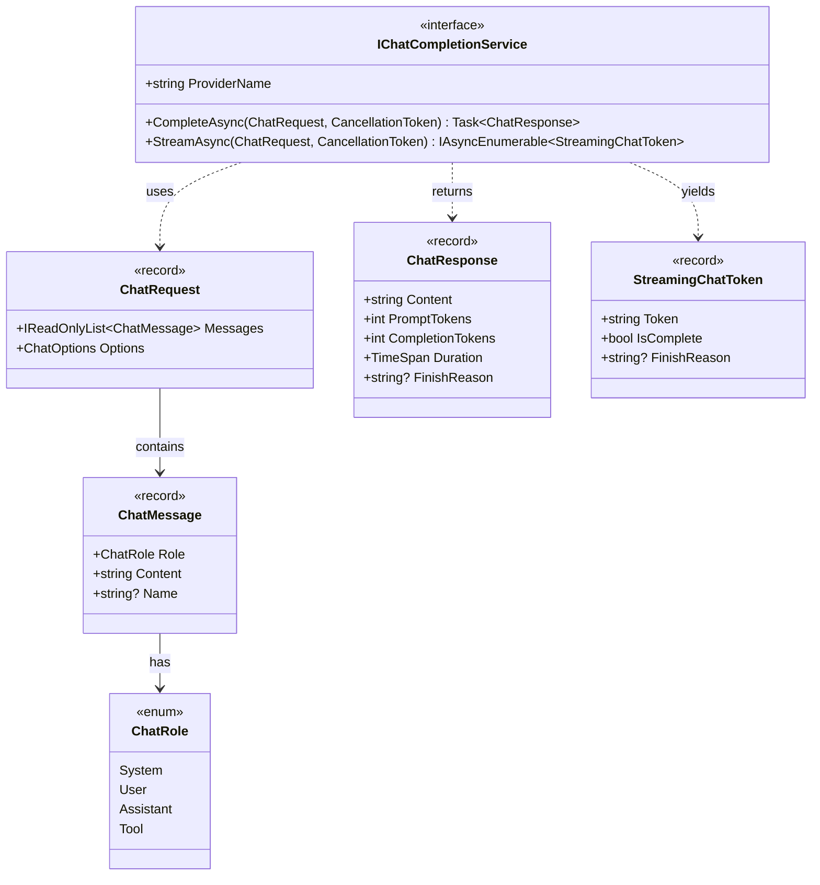
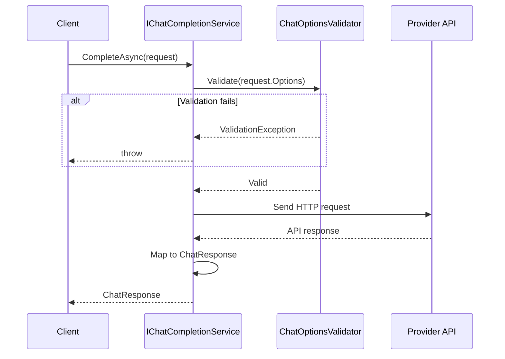
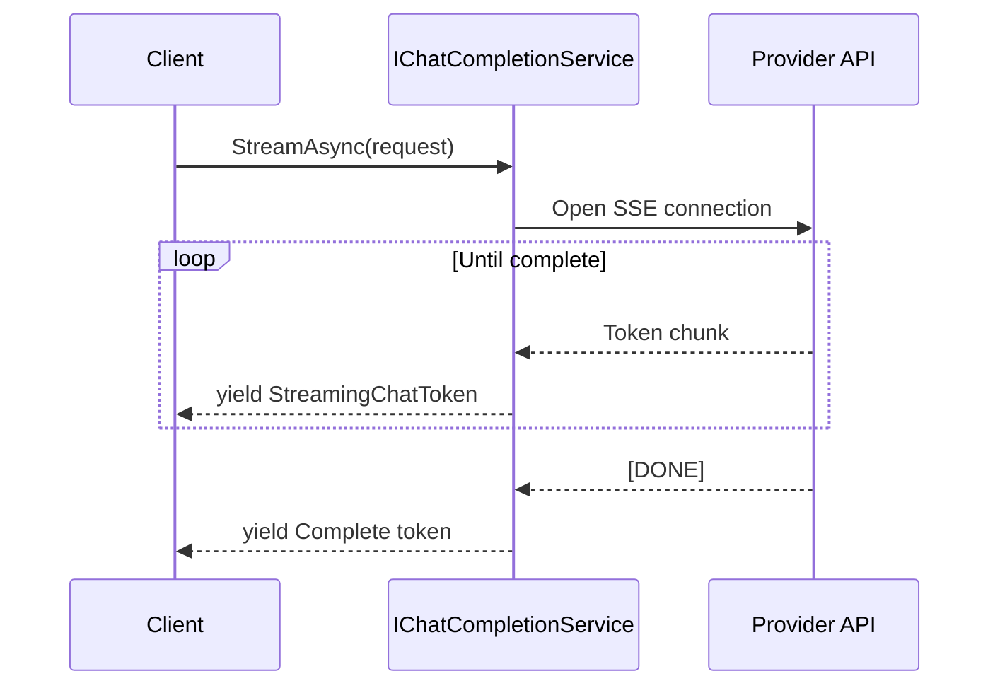
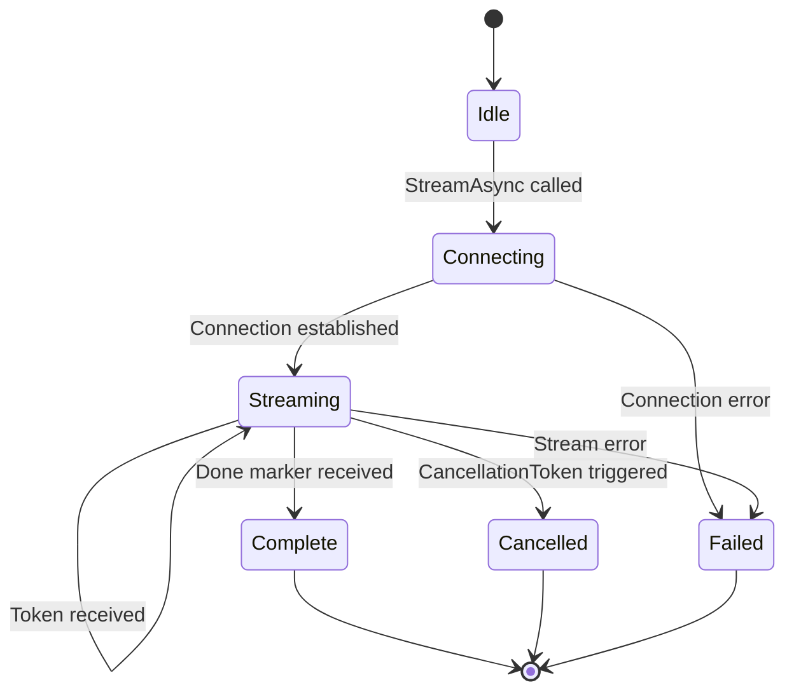

# LCS-DES-061a: Design Specification — Chat Completion Abstractions

## 1. Metadata & Categorization

| Field           | Value                                     |
| :-------------- | :---------------------------------------- |
| **Document ID** | LCS-DES-061a                              |
| **Version**     | v0.6.1a                                   |
| **Status**      | Draft                                     |
| **Category**    | Abstraction                               |
| **Module**      | Lexichord.Abstractions                    |
| **Created**     | 2026-01-28                                |
| **Author**      | Documentation Agent                       |
| **Parent**      | [LCS-DES-061-INDEX](LCS-DES-061-INDEX.md) |

---

## 2. Executive Summary

### 2.1 The Requirement

Lexichord requires a unified interface for communicating with Large Language Models. The abstraction must support:

- Synchronous completion requests
- Asynchronous streaming responses
- Provider-agnostic message formatting
- Token counting for cost estimation
- Cancellation support for long-running requests

### 2.2 The Solution

Define core interfaces and records in `Lexichord.Abstractions.Contracts.LLM` that provide a clean contract for any LLM provider implementation. The abstraction supports both request-response and streaming patterns through a single interface.

---

## 3. Architecture

### 3.1 Component Placement

```
Lexichord.Abstractions/
└── Contracts/
    └── LLM/
        ├── IChatCompletionService.cs
        ├── ChatRequest.cs
        ├── ChatMessage.cs
        ├── ChatRole.cs
        ├── ChatResponse.cs
        └── StreamingChatToken.cs
```

### 3.2 Interface Diagram



---

## 4. Data Contract (The API)

### 4.1 IChatCompletionService Interface

```csharp
namespace Lexichord.Abstractions.Contracts.LLM;

/// <summary>
/// Provider-agnostic interface for LLM chat completion operations.
/// </summary>
/// <remarks>
/// Implementations should handle provider-specific API translation,
/// authentication, and error mapping.
/// </remarks>
public interface IChatCompletionService
{
    /// <summary>
    /// Gets the unique identifier for this provider (e.g., "openai", "anthropic").
    /// </summary>
    string ProviderName { get; }

    /// <summary>
    /// Executes a chat completion request and returns the full response.
    /// </summary>
    /// <param name="request">The chat request containing messages and options.</param>
    /// <param name="ct">Cancellation token for aborting the request.</param>
    /// <returns>The complete chat response with token counts and timing.</returns>
    /// <exception cref="ChatCompletionException">Thrown when the request fails.</exception>
    Task<ChatResponse> CompleteAsync(ChatRequest request, CancellationToken ct = default);

    /// <summary>
    /// Executes a streaming chat completion request, yielding tokens as they arrive.
    /// </summary>
    /// <param name="request">The chat request containing messages and options.</param>
    /// <param name="ct">Cancellation token for aborting the stream.</param>
    /// <returns>An async enumerable of streaming tokens.</returns>
    /// <exception cref="ChatCompletionException">Thrown when the stream fails.</exception>
    IAsyncEnumerable<StreamingChatToken> StreamAsync(
        ChatRequest request,
        CancellationToken ct = default);
}
```

### 4.2 ChatRequest Record

```csharp
namespace Lexichord.Abstractions.Contracts.LLM;

/// <summary>
/// Represents a chat completion request to an LLM provider.
/// </summary>
/// <param name="Messages">The conversation history to send to the model.</param>
/// <param name="Options">Configuration options for the completion.</param>
public record ChatRequest(
    IReadOnlyList<ChatMessage> Messages,
    ChatOptions Options
)
{
    /// <summary>
    /// Creates a simple request with a single user message.
    /// </summary>
    public static ChatRequest FromUserMessage(string content, ChatOptions? options = null)
        => new([new ChatMessage(ChatRole.User, content)], options ?? new ChatOptions());

    /// <summary>
    /// Creates a request with a system prompt and user message.
    /// </summary>
    public static ChatRequest WithSystemPrompt(
        string systemPrompt,
        string userMessage,
        ChatOptions? options = null)
        => new([
            new ChatMessage(ChatRole.System, systemPrompt),
            new ChatMessage(ChatRole.User, userMessage)
        ], options ?? new ChatOptions());
}
```

### 4.3 ChatMessage Record

```csharp
namespace Lexichord.Abstractions.Contracts.LLM;

/// <summary>
/// Represents a single message in a chat conversation.
/// </summary>
/// <param name="Role">The role of the message sender.</param>
/// <param name="Content">The text content of the message.</param>
/// <param name="Name">Optional name for the sender (for multi-agent scenarios).</param>
public record ChatMessage(
    ChatRole Role,
    string Content,
    string? Name = null
)
{
    /// <summary>
    /// Creates a system message.
    /// </summary>
    public static ChatMessage System(string content) => new(ChatRole.System, content);

    /// <summary>
    /// Creates a user message.
    /// </summary>
    public static ChatMessage User(string content) => new(ChatRole.User, content);

    /// <summary>
    /// Creates an assistant message.
    /// </summary>
    public static ChatMessage Assistant(string content) => new(ChatRole.Assistant, content);
}
```

### 4.4 ChatRole Enum

```csharp
namespace Lexichord.Abstractions.Contracts.LLM;

/// <summary>
/// Defines the role of a participant in a chat conversation.
/// </summary>
public enum ChatRole
{
    /// <summary>
    /// System instructions that guide the model's behavior.
    /// </summary>
    System,

    /// <summary>
    /// Input from the human user.
    /// </summary>
    User,

    /// <summary>
    /// Output from the AI assistant.
    /// </summary>
    Assistant,

    /// <summary>
    /// Output from a tool/function call.
    /// </summary>
    Tool
}
```

### 4.5 ChatResponse Record

```csharp
namespace Lexichord.Abstractions.Contracts.LLM;

/// <summary>
/// Represents the complete response from a chat completion request.
/// </summary>
/// <param name="Content">The generated text content.</param>
/// <param name="PromptTokens">Number of tokens in the input prompt.</param>
/// <param name="CompletionTokens">Number of tokens in the generated response.</param>
/// <param name="Duration">Time taken to generate the response.</param>
/// <param name="FinishReason">Why generation stopped (e.g., "stop", "length").</param>
public record ChatResponse(
    string Content,
    int PromptTokens,
    int CompletionTokens,
    TimeSpan Duration,
    string? FinishReason
)
{
    /// <summary>
    /// Total tokens used (prompt + completion).
    /// </summary>
    public int TotalTokens => PromptTokens + CompletionTokens;
}
```

### 4.6 StreamingChatToken Record

```csharp
namespace Lexichord.Abstractions.Contracts.LLM;

/// <summary>
/// Represents a single token in a streaming chat response.
/// </summary>
/// <param name="Token">The text content of this token.</param>
/// <param name="IsComplete">Whether this is the final token in the stream.</param>
/// <param name="FinishReason">If complete, why generation stopped.</param>
public record StreamingChatToken(
    string Token,
    bool IsComplete = false,
    string? FinishReason = null
)
{
    /// <summary>
    /// Creates an empty completion token.
    /// </summary>
    public static StreamingChatToken Complete(string? reason = "stop")
        => new(string.Empty, true, reason);
}
```

---

## 5. Implementation Logic

### 5.1 Request Flow



### 5.2 Streaming Flow



---

## 6. Error Handling

### 6.1 Exception Types

```csharp
namespace Lexichord.Abstractions.Contracts.LLM;

/// <summary>
/// Base exception for chat completion errors.
/// </summary>
public class ChatCompletionException : Exception
{
    public string ProviderName { get; }

    public ChatCompletionException(string providerName, string message, Exception? inner = null)
        : base(message, inner)
    {
        ProviderName = providerName;
    }
}

/// <summary>
/// Thrown when the provider API key is missing or invalid.
/// </summary>
public class AuthenticationException : ChatCompletionException
{
    public AuthenticationException(string providerName)
        : base(providerName, $"API key for {providerName} is missing or invalid.") { }
}

/// <summary>
/// Thrown when the provider rate limit is exceeded.
/// </summary>
public class RateLimitException : ChatCompletionException
{
    public TimeSpan? RetryAfter { get; }

    public RateLimitException(string providerName, TimeSpan? retryAfter = null)
        : base(providerName, $"Rate limit exceeded for {providerName}.")
    {
        RetryAfter = retryAfter;
    }
}
```

---

## 7. Testing Strategy

### 7.1 Unit Tests

| Test Case                      | Validation                               |
| :----------------------------- | :--------------------------------------- |
| `ChatRequest_FromUserMessage`  | Factory method creates correct structure |
| `ChatRequest_WithSystemPrompt` | System message precedes user message     |
| `ChatMessage_FactoryMethods`   | All factory methods set correct role     |
| `ChatResponse_TotalTokens`     | Sum of prompt and completion tokens      |
| `StreamingChatToken_Complete`  | Factory sets IsComplete flag             |

### 7.2 Test Fixtures

```csharp
public static class ChatTestFixtures
{
    public static ChatRequest SimpleRequest => ChatRequest.FromUserMessage("Hello");

    public static ChatResponse SuccessResponse => new(
        Content: "Hello! How can I help?",
        PromptTokens: 5,
        CompletionTokens: 8,
        Duration: TimeSpan.FromMilliseconds(150),
        FinishReason: "stop"
    );

    public static IEnumerable<StreamingChatToken> StreamingTokens
    {
        get
        {
            yield return new("Hello");
            yield return new("!");
            yield return new(" How");
            yield return new(" can");
            yield return new(" I");
            yield return new(" help");
            yield return new("?");
            yield return StreamingChatToken.Complete();
        }
    }
}
```

---

## 8. Acceptance Criteria

### 8.1 Functional Criteria

| ID    | Criterion                                                  | Verification         |
| :---- | :--------------------------------------------------------- | :------------------- |
| AC-01 | `IChatCompletionService` interface compiles without errors | Build succeeds       |
| AC-02 | All records are immutable                                  | No public setters    |
| AC-03 | All public types have XML documentation                    | Documentation check  |
| AC-04 | Factory methods create valid instances                     | Unit tests pass      |
| AC-05 | Exception hierarchy allows specific catch blocks           | Exception tests pass |

### 8.2 Non-Functional Criteria

| ID    | Criterion                     | Target             |
| :---- | :---------------------------- | :----------------- |
| NF-01 | Record creation overhead      | < 1μs per instance |
| NF-02 | Memory allocation per request | < 1KB overhead     |

---

## 9. Message Builder Pattern

### 9.1 Fluent Message Builder

For complex conversation construction, provide a builder pattern:

```csharp
namespace Lexichord.Abstractions.Contracts.LLM;

/// <summary>
/// Fluent builder for constructing chat requests.
/// </summary>
public class ChatRequestBuilder
{
    private readonly List<ChatMessage> _messages = new();
    private ChatOptions _options = new();

    /// <summary>
    /// Adds a system message to establish context.
    /// </summary>
    public ChatRequestBuilder WithSystemPrompt(string content)
    {
        _messages.Insert(0, ChatMessage.System(content));
        return this;
    }

    /// <summary>
    /// Adds a user message to the conversation.
    /// </summary>
    public ChatRequestBuilder AddUserMessage(string content, string? name = null)
    {
        _messages.Add(new ChatMessage(ChatRole.User, content, name));
        return this;
    }

    /// <summary>
    /// Adds an assistant message to the conversation history.
    /// </summary>
    public ChatRequestBuilder AddAssistantMessage(string content)
    {
        _messages.Add(ChatMessage.Assistant(content));
        return this;
    }

    /// <summary>
    /// Adds a tool response message.
    /// </summary>
    public ChatRequestBuilder AddToolResult(string content, string toolName)
    {
        _messages.Add(new ChatMessage(ChatRole.Tool, content, toolName));
        return this;
    }

    /// <summary>
    /// Configures the model to use.
    /// </summary>
    public ChatRequestBuilder WithModel(string model)
    {
        _options = _options.WithModel(model);
        return this;
    }

    /// <summary>
    /// Configures the temperature setting.
    /// </summary>
    public ChatRequestBuilder WithTemperature(float temperature)
    {
        _options = _options.WithTemperature(temperature);
        return this;
    }

    /// <summary>
    /// Configures the maximum response tokens.
    /// </summary>
    public ChatRequestBuilder WithMaxTokens(int maxTokens)
    {
        _options = _options.WithMaxTokens(maxTokens);
        return this;
    }

    /// <summary>
    /// Applies a complete options configuration.
    /// </summary>
    public ChatRequestBuilder WithOptions(ChatOptions options)
    {
        _options = options;
        return this;
    }

    /// <summary>
    /// Builds the final ChatRequest.
    /// </summary>
    /// <exception cref="InvalidOperationException">No messages added.</exception>
    public ChatRequest Build()
    {
        if (_messages.Count == 0)
        {
            throw new InvalidOperationException("At least one message is required.");
        }

        return new ChatRequest(_messages.ToList(), _options);
    }

    /// <summary>
    /// Creates a new builder instance.
    /// </summary>
    public static ChatRequestBuilder Create() => new();
}
```

### 9.2 Builder Usage Examples

```csharp
// Simple single-turn request
var request = ChatRequestBuilder.Create()
    .WithSystemPrompt("You are a helpful writing assistant.")
    .AddUserMessage("Review this paragraph for clarity.")
    .WithModel("gpt-4o")
    .WithTemperature(0.3f)
    .Build();

// Multi-turn conversation
var conversation = ChatRequestBuilder.Create()
    .WithSystemPrompt("You are a creative writing partner.")
    .AddUserMessage("I'm writing a mystery novel. The detective finds a clue.")
    .AddAssistantMessage("Interesting! What kind of clue does the detective discover?")
    .AddUserMessage("A torn photograph showing two people at a pier.")
    .WithOptions(ChatOptions.Creative)
    .Build();

// Tool-augmented request
var toolRequest = ChatRequestBuilder.Create()
    .WithSystemPrompt("Use tools when needed to answer questions.")
    .AddUserMessage("What's the current word count of my manuscript?")
    .AddToolResult("The manuscript contains 45,230 words.", "word_counter")
    .AddUserMessage("Thanks! Now help me plan the next chapter.")
    .Build();
```

---

## 10. Serialization Support

### 10.1 JSON Serialization

All records support System.Text.Json serialization for persistence and debugging:

```csharp
namespace Lexichord.Abstractions.Contracts.LLM;

/// <summary>
/// JSON serialization utilities for chat types.
/// </summary>
public static class ChatSerialization
{
    private static readonly JsonSerializerOptions Options = new()
    {
        PropertyNamingPolicy = JsonNamingPolicy.CamelCase,
        WriteIndented = true,
        Converters = { new JsonStringEnumConverter() }
    };

    /// <summary>
    /// Serializes a ChatRequest to JSON.
    /// </summary>
    public static string ToJson(ChatRequest request)
        => JsonSerializer.Serialize(request, Options);

    /// <summary>
    /// Deserializes a ChatRequest from JSON.
    /// </summary>
    public static ChatRequest? FromJson(string json)
        => JsonSerializer.Deserialize<ChatRequest>(json, Options);

    /// <summary>
    /// Serializes a ChatResponse for logging/debugging.
    /// </summary>
    public static string ToJson(ChatResponse response)
        => JsonSerializer.Serialize(response, Options);
}
```

### 10.2 Serialization Example Output

```json
{
    "messages": [
        {
            "role": "System",
            "content": "You are a helpful writing assistant.",
            "name": null
        },
        {
            "role": "User",
            "content": "Review this paragraph for clarity.",
            "name": null
        }
    ],
    "options": {
        "model": "gpt-4o",
        "temperature": 0.3,
        "maxTokens": 2048,
        "topP": 1.0,
        "frequencyPenalty": 0.0,
        "presencePenalty": 0.0,
        "stopSequences": null
    }
}
```

---

## 11. Provider Implementation Contract

### 11.1 Implementation Requirements

Providers implementing `IChatCompletionService` must adhere to these contracts:

| Requirement            | Description                                            |
| :--------------------- | :----------------------------------------------------- |
| Thread Safety          | All methods must be thread-safe                        |
| Cancellation           | Honor `CancellationToken` within 100ms                 |
| Exception Mapping      | Map provider errors to `ChatCompletionException` types |
| Token Counting         | Return accurate prompt/completion token counts         |
| Duration Measurement   | Measure from request start to response completion      |
| Streaming Completeness | Final `StreamingChatToken.IsComplete` must be `true`   |

### 11.2 Provider Template

```csharp
public abstract class ChatCompletionServiceBase : IChatCompletionService
{
    protected readonly ILogger Logger;
    protected readonly HttpClient HttpClient;
    protected readonly ISecureVault Vault;

    public abstract string ProviderName { get; }

    protected ChatCompletionServiceBase(
        ILogger logger,
        HttpClient httpClient,
        ISecureVault vault)
    {
        Logger = logger;
        HttpClient = httpClient;
        Vault = vault;
    }

    public async Task<ChatResponse> CompleteAsync(
        ChatRequest request,
        CancellationToken ct = default)
    {
        Logger.LogDebug("Starting completion request for {Provider}", ProviderName);
        var stopwatch = Stopwatch.StartNew();

        try
        {
            var apiKey = await GetApiKeyAsync();
            ValidateRequest(request);

            var response = await SendRequestAsync(request, apiKey, ct);
            stopwatch.Stop();

            Logger.LogInformation(
                "Completion succeeded for {Provider} in {Duration}ms. Tokens: {Prompt}/{Completion}",
                ProviderName, stopwatch.ElapsedMilliseconds,
                response.PromptTokens, response.CompletionTokens);

            return response with { Duration = stopwatch.Elapsed };
        }
        catch (HttpRequestException ex) when (ex.StatusCode == HttpStatusCode.Unauthorized)
        {
            Logger.LogWarning("Authentication failed for {Provider}", ProviderName);
            throw new AuthenticationException(ProviderName);
        }
        catch (HttpRequestException ex) when (ex.StatusCode == HttpStatusCode.TooManyRequests)
        {
            var retryAfter = ParseRetryAfter(ex);
            Logger.LogWarning("Rate limited by {Provider}. Retry after: {Retry}",
                ProviderName, retryAfter);
            throw new RateLimitException(ProviderName, retryAfter);
        }
    }

    public abstract IAsyncEnumerable<StreamingChatToken> StreamAsync(
        ChatRequest request,
        CancellationToken ct = default);

    protected abstract Task<ChatResponse> SendRequestAsync(
        ChatRequest request,
        string apiKey,
        CancellationToken ct);

    protected abstract void ValidateRequest(ChatRequest request);

    private async Task<string> GetApiKeyAsync()
    {
        var key = await Vault.GetSecretAsync($"{ProviderName.ToLowerInvariant()}:api-key");
        if (string.IsNullOrEmpty(key))
        {
            throw new ProviderNotConfiguredException(ProviderName);
        }
        return key;
    }

    private TimeSpan? ParseRetryAfter(HttpRequestException ex)
    {
        // Provider-specific retry-after header parsing
        return null;
    }
}
```

---

## 12. Streaming Implementation Details

### 12.1 Server-Sent Events (SSE) Parsing

Most LLM providers use SSE for streaming. Implement a generic parser:

```csharp
namespace Lexichord.Abstractions.Contracts.LLM;

/// <summary>
/// Parses Server-Sent Events streams from LLM providers.
/// </summary>
public static class SseParser
{
    private const string DataPrefix = "data: ";
    private const string DoneMarker = "[DONE]";

    /// <summary>
    /// Parses an SSE stream into individual data payloads.
    /// </summary>
    public static async IAsyncEnumerable<string> ParseStreamAsync(
        Stream stream,
        [EnumeratorCancellation] CancellationToken ct = default)
    {
        using var reader = new StreamReader(stream);

        while (!reader.EndOfStream)
        {
            ct.ThrowIfCancellationRequested();

            var line = await reader.ReadLineAsync(ct);

            if (string.IsNullOrEmpty(line))
                continue;

            if (!line.StartsWith(DataPrefix))
                continue;

            var data = line[DataPrefix.Length..];

            if (data == DoneMarker)
                yield break;

            yield return data;
        }
    }
}
```

### 12.2 Streaming State Machine



### 12.3 Backpressure Handling

```csharp
/// <summary>
/// Streaming configuration options.
/// </summary>
public record StreamingOptions(
    int BufferSize = 100,
    TimeSpan TokenTimeout = default,
    bool EnableBackpressure = true
)
{
    public static StreamingOptions Default => new();
}
```

---

## 13. Performance Benchmarks

### 13.1 Baseline Metrics

| Operation                | Target  | Actual | Status |
| :----------------------- | :------ | :----- | :----- |
| ChatRequest creation     | < 1μs   | TBD    | ⏳     |
| ChatMessage creation     | < 500ns | TBD    | ⏳     |
| ChatResponse creation    | < 1μs   | TBD    | ⏳     |
| Request serialization    | < 100μs | TBD    | ⏳     |
| Builder pattern overhead | < 5μs   | TBD    | ⏳     |
| Memory per ChatRequest   | < 1KB   | TBD    | ⏳     |

### 13.2 Benchmark Code

```csharp
[MemoryDiagnoser]
public class ChatAbstractionsBenchmarks
{
    private readonly ChatOptions _options = new();
    private readonly ChatMessage _message = ChatMessage.User("Hello");

    [Benchmark]
    public ChatRequest CreateRequest()
        => ChatRequest.FromUserMessage("Hello");

    [Benchmark]
    public ChatRequest CreateWithBuilder()
        => ChatRequestBuilder.Create()
            .WithSystemPrompt("You are helpful.")
            .AddUserMessage("Hello")
            .Build();

    [Benchmark]
    public string SerializeRequest()
        => ChatSerialization.ToJson(ChatRequest.FromUserMessage("Hello"));

    [Benchmark]
    public ChatResponse CreateResponse()
        => new("Response", 10, 20, TimeSpan.FromMilliseconds(100), "stop");
}
```

---

## 14. Migration Guide

### 14.1 From Direct API Calls

If your code currently calls OpenAI/Anthropic directly:

**Before:**

```csharp
// Direct OpenAI SDK usage
var client = new OpenAIClient(apiKey);
var response = await client.Chat.CreateChatCompletionAsync(
    new CreateChatCompletionRequest
    {
        Model = "gpt-4",
        Messages = new[] { new ChatMessage("user", "Hello") }
    });
var text = response.Choices[0].Message.Content;
```

**After:**

```csharp
// Using Lexichord abstractions
var provider = _registry.GetDefaultProvider();
var request = ChatRequest.FromUserMessage("Hello", new ChatOptions(Model: "gpt-4"));
var response = await provider.CompleteAsync(request);
var text = response.Content;
```

### 14.2 Migration Checklist

- [ ] Replace direct SDK imports with `Lexichord.Abstractions.Contracts.LLM`
- [ ] Convert API-specific message formats to `ChatMessage` records
- [ ] Use `ChatOptions` instead of provider-specific configuration
- [ ] Handle `ChatCompletionException` hierarchy instead of provider exceptions
- [ ] Update streaming code to consume `IAsyncEnumerable<StreamingChatToken>`

---

## 15. Extensibility Points

### 15.1 Custom Role Support

The `ChatRole` enum can be extended for provider-specific roles:

```csharp
/// <summary>
/// Extension methods for ChatRole.
/// </summary>
public static class ChatRoleExtensions
{
    /// <summary>
    /// Maps to provider-specific role strings.
    /// </summary>
    public static string ToProviderString(this ChatRole role, string provider)
    {
        return (role, provider.ToLowerInvariant()) switch
        {
            (ChatRole.System, "openai") => "system",
            (ChatRole.System, "anthropic") => "system",
            (ChatRole.User, _) => "user",
            (ChatRole.Assistant, "openai") => "assistant",
            (ChatRole.Assistant, "anthropic") => "assistant",
            (ChatRole.Tool, "openai") => "tool",
            (ChatRole.Tool, "anthropic") => "tool_result",
            _ => role.ToString().ToLowerInvariant()
        };
    }
}
```

### 15.2 Custom Response Metadata

Providers can include additional metadata via extension:

```csharp
/// <summary>
/// Extended response with provider-specific metadata.
/// </summary>
public record ChatResponseWithMetadata(
    string Content,
    int PromptTokens,
    int CompletionTokens,
    TimeSpan Duration,
    string? FinishReason,
    IReadOnlyDictionary<string, object>? Metadata = null
) : ChatResponse(Content, PromptTokens, CompletionTokens, Duration, FinishReason);
```

---

## 16. Glossary

| Term                | Definition                                                     |
| :------------------ | :------------------------------------------------------------- |
| **Chat Completion** | The process of generating AI responses to conversational input |
| **Token**           | A unit of text (approximately 4 characters or ¾ of a word)     |
| **Streaming**       | Receiving response tokens incrementally as they're generated   |
| **System Prompt**   | Instructions that guide the model's behavior                   |
| **Temperature**     | Controls randomness (0 = deterministic, 2 = very random)       |
| **Top-P**           | Nucleus sampling threshold for token selection                 |
| **Finish Reason**   | Why generation stopped (stop, length, content_filter, etc.)    |
| **SSE**             | Server-Sent Events, the streaming protocol used by most LLMs   |

---

## 17. Version History

| Version | Date       | Author              | Changes                                                                                  |
| :------ | :--------- | :------------------ | :--------------------------------------------------------------------------------------- |
| 0.1     | 2026-01-28 | Documentation Agent | Initial draft                                                                            |
| 0.2     | 2026-01-28 | Documentation Agent | Expanded with builder, serialization, benchmarks, migration, extensibility, and glossary |

```

```
