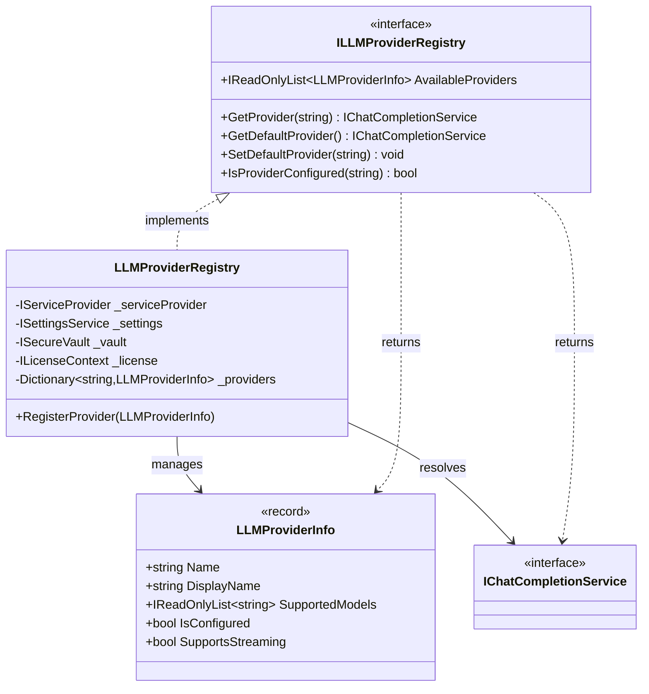
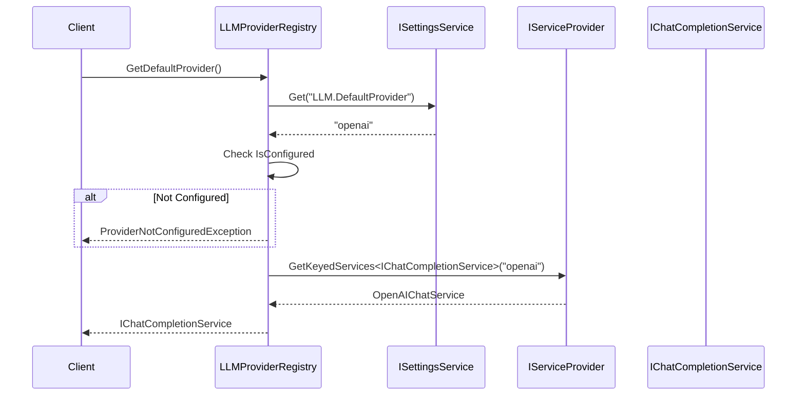
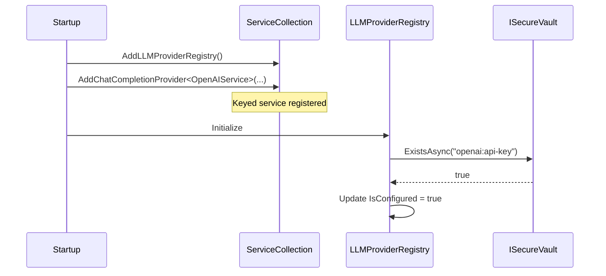
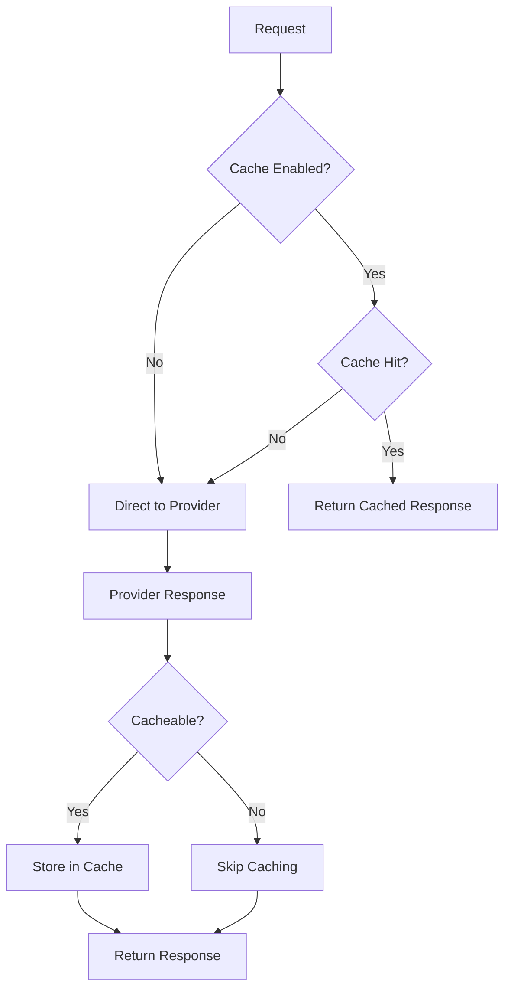

# LCS-DES-061c: Design Specification — Provider Registry

## 1. Metadata & Categorization

| Field           | Value                                     |
| :-------------- | :---------------------------------------- |
| **Document ID** | LCS-DES-061c                              |
| **Version**     | v0.6.1c                                   |
| **Status**      | Draft                                     |
| **Category**    | Infrastructure                            |
| **Module**      | Lexichord.Modules.LLM                     |
| **Created**     | 2026-01-28                                |
| **Author**      | Documentation Agent                       |
| **Parent**      | [LCS-DES-061-INDEX](LCS-DES-061-INDEX.md) |

---

## 2. Executive Summary

### 2.1 The Requirement

Lexichord must manage multiple LLM providers dynamically:

- Register providers at application startup
- Select providers by name for specific operations
- Maintain a user-configurable default provider
- Report provider availability and configuration status
- Support license-gated access to multiple providers

### 2.2 The Solution

Implement `ILLMProviderRegistry` with a DI-based provider registration pattern. Providers are registered with named service registrations, and the default provider preference is persisted via `ISettingsService`.

---

## 3. Architecture

### 3.1 Component Placement

```
Lexichord.Abstractions/
└── Contracts/
    └── LLM/
        ├── ILLMProviderRegistry.cs
        └── LLMProviderInfo.cs

Lexichord.Modules.LLM/
└── Infrastructure/
    ├── LLMProviderRegistry.cs
    └── Extensions/
        └── LLMProviderServiceExtensions.cs
```

### 3.2 Class Diagram



---

## 4. Data Contract (The API)

### 4.1 ILLMProviderRegistry Interface

```csharp
namespace Lexichord.Abstractions.Contracts.LLM;

/// <summary>
/// Registry for managing LLM provider instances and selection.
/// </summary>
public interface ILLMProviderRegistry
{
    /// <summary>
    /// Gets information about all available providers.
    /// </summary>
    IReadOnlyList<LLMProviderInfo> AvailableProviders { get; }

    /// <summary>
    /// Gets a provider by its unique name.
    /// </summary>
    /// <param name="providerName">The provider name (e.g., "openai").</param>
    /// <returns>The chat completion service for the provider.</returns>
    /// <exception cref="ProviderNotFoundException">Provider not registered.</exception>
    /// <exception cref="ProviderNotConfiguredException">API key not set.</exception>
    IChatCompletionService GetProvider(string providerName);

    /// <summary>
    /// Gets the user's default provider.
    /// </summary>
    /// <returns>The default provider's chat completion service.</returns>
    /// <exception cref="ProviderNotConfiguredException">No default configured.</exception>
    IChatCompletionService GetDefaultProvider();

    /// <summary>
    /// Sets the default provider for chat operations.
    /// </summary>
    /// <param name="providerName">The provider name to set as default.</param>
    /// <exception cref="ProviderNotFoundException">Provider not registered.</exception>
    void SetDefaultProvider(string providerName);

    /// <summary>
    /// Checks if a provider has valid API key configuration.
    /// </summary>
    bool IsProviderConfigured(string providerName);
}
```

### 4.2 LLMProviderInfo Record

```csharp
namespace Lexichord.Abstractions.Contracts.LLM;

/// <summary>
/// Metadata about an LLM provider.
/// </summary>
/// <param name="Name">Unique provider identifier (e.g., "openai").</param>
/// <param name="DisplayName">User-facing name (e.g., "OpenAI").</param>
/// <param name="SupportedModels">List of available models.</param>
/// <param name="IsConfigured">Whether API key is present.</param>
/// <param name="SupportsStreaming">Whether streaming is supported.</param>
public record LLMProviderInfo(
    string Name,
    string DisplayName,
    IReadOnlyList<string> SupportedModels,
    bool IsConfigured,
    bool SupportsStreaming
)
{
    /// <summary>
    /// Creates info for an unconfigured provider.
    /// </summary>
    public static LLMProviderInfo Unconfigured(string name, string displayName)
        => new(name, displayName, Array.Empty<string>(), false, false);
}
```

### 4.3 Exception Types

```csharp
namespace Lexichord.Abstractions.Contracts.LLM;

/// <summary>
/// Thrown when a requested provider is not registered.
/// </summary>
public class ProviderNotFoundException : Exception
{
    public string ProviderName { get; }

    public ProviderNotFoundException(string providerName)
        : base($"LLM provider '{providerName}' is not registered.")
    {
        ProviderName = providerName;
    }
}

/// <summary>
/// Thrown when a provider lacks required configuration.
/// </summary>
public class ProviderNotConfiguredException : ChatCompletionException
{
    public ProviderNotConfiguredException(string providerName)
        : base(providerName, $"Provider '{providerName}' is not configured. Please add API key in Settings.") { }
}
```

---

## 5. Implementation Logic

### 5.1 LLMProviderRegistry Implementation

```csharp
namespace Lexichord.Modules.LLM.Infrastructure;

/// <summary>
/// Default implementation of the LLM provider registry.
/// </summary>
public class LLMProviderRegistry : ILLMProviderRegistry
{
    private const string DefaultProviderKey = "LLM.DefaultProvider";

    private readonly IServiceProvider _serviceProvider;
    private readonly ISettingsService _settings;
    private readonly ISecureVault _vault;
    private readonly ILicenseContext _license;
    private readonly ILogger<LLMProviderRegistry> _logger;
    private readonly Dictionary<string, LLMProviderInfo> _providers = new();

    public LLMProviderRegistry(
        IServiceProvider serviceProvider,
        ISettingsService settings,
        ISecureVault vault,
        ILicenseContext license,
        ILogger<LLMProviderRegistry> logger)
    {
        _serviceProvider = serviceProvider;
        _settings = settings;
        _vault = vault;
        _license = license;
        _logger = logger;
    }

    public IReadOnlyList<LLMProviderInfo> AvailableProviders
        => _providers.Values.ToList();

    public IChatCompletionService GetProvider(string providerName)
    {
        _logger.LogDebug("Resolving provider: {Provider}", providerName);

        if (!_providers.TryGetValue(providerName.ToLowerInvariant(), out var info))
        {
            _logger.LogWarning("Provider not found: {Provider}", providerName);
            throw new ProviderNotFoundException(providerName);
        }

        if (!info.IsConfigured)
        {
            _logger.LogWarning("Provider not configured: {Provider}", providerName);
            throw new ProviderNotConfiguredException(providerName);
        }

        // Resolve named service from DI
        var services = _serviceProvider.GetKeyedServices<IChatCompletionService>(providerName);
        var service = services.FirstOrDefault();

        if (service is null)
        {
            throw new ProviderNotFoundException(providerName);
        }

        _logger.LogDebug("Resolved provider: {Provider}", providerName);
        return service;
    }

    public IChatCompletionService GetDefaultProvider()
    {
        var defaultProvider = _settings.Get<string>(DefaultProviderKey);

        if (string.IsNullOrEmpty(defaultProvider))
        {
            // Fall back to first configured provider
            var configured = _providers.Values.FirstOrDefault(p => p.IsConfigured);
            if (configured is null)
            {
                throw new ProviderNotConfiguredException("No providers configured");
            }
            defaultProvider = configured.Name;
        }

        return GetProvider(defaultProvider);
    }

    public void SetDefaultProvider(string providerName)
    {
        if (!_providers.ContainsKey(providerName.ToLowerInvariant()))
        {
            throw new ProviderNotFoundException(providerName);
        }

        _settings.Set(DefaultProviderKey, providerName);
        _logger.LogInformation("Default provider set to: {Provider}", providerName);
    }

    public bool IsProviderConfigured(string providerName)
    {
        return _providers.TryGetValue(providerName.ToLowerInvariant(), out var info)
               && info.IsConfigured;
    }

    internal void RegisterProvider(LLMProviderInfo info)
    {
        var key = info.Name.ToLowerInvariant();
        _providers[key] = info;
        _logger.LogInformation("Registered LLM provider: {Name} ({Display})",
            info.Name, info.DisplayName);
    }

    internal async Task RefreshConfigurationStatusAsync()
    {
        foreach (var (key, info) in _providers)
        {
            var apiKeyName = $"{key}:api-key";
            var hasKey = await _vault.ExistsAsync(apiKeyName);

            if (hasKey != info.IsConfigured)
            {
                _providers[key] = info with { IsConfigured = hasKey };
            }
        }
    }
}
```

### 5.2 DI Registration Extensions

```csharp
namespace Lexichord.Modules.LLM.Extensions;

public static class LLMProviderServiceExtensions
{
    /// <summary>
    /// Registers the LLM provider registry and core services.
    /// </summary>
    public static IServiceCollection AddLLMProviderRegistry(
        this IServiceCollection services)
    {
        services.AddSingleton<LLMProviderRegistry>();
        services.AddSingleton<ILLMProviderRegistry>(sp => sp.GetRequiredService<LLMProviderRegistry>());

        return services;
    }

    /// <summary>
    /// Registers a chat completion provider with keyed service registration.
    /// </summary>
    public static IServiceCollection AddChatCompletionProvider<TProvider>(
        this IServiceCollection services,
        string providerName,
        string displayName,
        IReadOnlyList<string> supportedModels,
        bool supportsStreaming = true)
        where TProvider : class, IChatCompletionService
    {
        // Register keyed service
        services.AddKeyedSingleton<IChatCompletionService, TProvider>(providerName);

        // Register provider info during startup
        services.AddSingleton<IConfigureOptions<LLMProviderRegistry>>(sp =>
        {
            return new ConfigureNamedOptions<LLMProviderRegistry>(null, registry =>
            {
                registry.RegisterProvider(new LLMProviderInfo(
                    providerName,
                    displayName,
                    supportedModels,
                    IsConfigured: false, // Updated at runtime
                    supportsStreaming
                ));
            });
        });

        return services;
    }
}
```

---

## 6. Sequence Diagrams

### 6.1 Provider Resolution Flow



### 6.2 Provider Registration Flow



---

## 7. License Integration

### 7.1 Feature Gating

```csharp
public IChatCompletionService GetProvider(string providerName)
{
    // Check multi-provider license
    if (_providers.Values.Count(p => p.IsConfigured) > 1)
    {
        if (!_license.HasFeature(FeatureKeys.MultipleProviders))
        {
            _logger.LogWarning("Multi-provider access denied. Current tier: {Tier}",
                _license.CurrentTier);
            throw new FeatureNotLicensedException(FeatureKeys.MultipleProviders);
        }
    }

    // ... rest of implementation
}
```

---

## 8. Testing Strategy

### 8.1 Unit Tests

| Test Case                                    | Validation                     |
| :------------------------------------------- | :----------------------------- |
| `GetProvider_UnknownName_Throws`             | ProviderNotFoundException      |
| `GetProvider_NotConfigured_Throws`           | ProviderNotConfiguredException |
| `GetProvider_Configured_ReturnsService`      | Returns correct service        |
| `GetDefaultProvider_NoneSet_FirstConfigured` | Falls back correctly           |
| `SetDefaultProvider_Unknown_Throws`          | ProviderNotFoundException      |
| `SetDefaultProvider_Valid_Persists`          | Settings updated               |
| `AvailableProviders_ReturnsAll`              | Returns all registered         |
| `IsProviderConfigured_ReturnsCorrect`        | Accurate status                |

### 8.2 Integration Tests

| Test Case                             | Validation                        |
| :------------------------------------ | :-------------------------------- |
| `DIResolution_KeyedService_Works`     | Correct service resolved by name  |
| `ConfigurationRefresh_UpdatesStatus`  | IsConfigured reflects vault state |
| `SettingsPersistence_SurvivesRestart` | Default provider persisted        |

---

## 9. Acceptance Criteria

### 9.1 Functional Criteria

| ID    | Criterion                                                 | Verification     |
| :---- | :-------------------------------------------------------- | :--------------- |
| AC-01 | `GetProvider` returns correct service for registered name | Unit tests pass  |
| AC-02 | `GetProvider` throws for unknown provider                 | Unit tests pass  |
| AC-03 | `GetDefaultProvider` uses settings preference             | Unit tests pass  |
| AC-04 | `SetDefaultProvider` persists via ISettingsService        | Integration test |
| AC-05 | `AvailableProviders` includes all registered providers    | Unit tests pass  |
| AC-06 | `IsConfigured` reflects vault API key presence            | Integration test |

---

## 10. Provider Health Monitoring

### 10.1 Health Check Interface

```csharp
namespace Lexichord.Abstractions.Contracts.LLM;

/// <summary>
/// Health check capabilities for LLM providers.
/// </summary>
public interface IProviderHealthCheck
{
    /// <summary>
    /// Gets the current health status of the provider.
    /// </summary>
    Task<ProviderHealthStatus> GetHealthAsync(CancellationToken ct = default);

    /// <summary>
    /// Performs a lightweight connectivity test.
    /// </summary>
    Task<bool> PingAsync(CancellationToken ct = default);
}

/// <summary>
/// Health status of a provider.
/// </summary>
public record ProviderHealthStatus(
    bool IsHealthy,
    TimeSpan? ResponseTime,
    string? Message,
    DateTime CheckedAt
)
{
    public static ProviderHealthStatus Healthy(TimeSpan responseTime)
        => new(true, responseTime, null, DateTime.UtcNow);

    public static ProviderHealthStatus Unhealthy(string message)
        => new(false, null, message, DateTime.UtcNow);
}
```

### 10.2 Background Health Monitor

```csharp
namespace Lexichord.Modules.LLM.Infrastructure;

/// <summary>
/// Background service monitoring provider health.
/// </summary>
public class ProviderHealthMonitor : BackgroundService
{
    private readonly ILLMProviderRegistry _registry;
    private readonly ILogger<ProviderHealthMonitor> _logger;
    private readonly TimeSpan _checkInterval = TimeSpan.FromMinutes(5);
    private readonly ConcurrentDictionary<string, ProviderHealthStatus> _healthCache = new();

    public ProviderHealthMonitor(
        ILLMProviderRegistry registry,
        ILogger<ProviderHealthMonitor> logger)
    {
        _registry = registry;
        _logger = logger;
    }

    public ProviderHealthStatus? GetCachedHealth(string providerName)
        => _healthCache.GetValueOrDefault(providerName.ToLowerInvariant());

    protected override async Task ExecuteAsync(CancellationToken stoppingToken)
    {
        _logger.LogInformation("Provider health monitor started");

        while (!stoppingToken.IsCancellationRequested)
        {
            await CheckAllProvidersAsync(stoppingToken);
            await Task.Delay(_checkInterval, stoppingToken);
        }
    }

    private async Task CheckAllProvidersAsync(CancellationToken ct)
    {
        foreach (var provider in _registry.AvailableProviders.Where(p => p.IsConfigured))
        {
            try
            {
                var service = _registry.GetProvider(provider.Name);

                if (service is IProviderHealthCheck healthCheck)
                {
                    var sw = Stopwatch.StartNew();
                    var isHealthy = await healthCheck.PingAsync(ct);
                    sw.Stop();

                    var status = isHealthy
                        ? ProviderHealthStatus.Healthy(sw.Elapsed)
                        : ProviderHealthStatus.Unhealthy("Ping failed");

                    _healthCache[provider.Name.ToLowerInvariant()] = status;

                    _logger.LogDebug(
                        "Health check for {Provider}: {Status} ({ResponseTime}ms)",
                        provider.Name,
                        isHealthy ? "Healthy" : "Unhealthy",
                        sw.ElapsedMilliseconds);
                }
            }
            catch (Exception ex)
            {
                _healthCache[provider.Name.ToLowerInvariant()] =
                    ProviderHealthStatus.Unhealthy(ex.Message);

                _logger.LogWarning(ex, "Health check failed for {Provider}", provider.Name);
            }
        }
    }
}
```

---

## 11. Provider Hot-Swap Support

### 11.1 Dynamic Provider Switching

```csharp
namespace Lexichord.Modules.LLM.Infrastructure;

/// <summary>
/// Supports runtime provider switching without restart.
/// </summary>
public interface IProviderSwitcher
{
    /// <summary>
    /// Switches to a new provider, optionally transferring context.
    /// </summary>
    /// <param name="newProviderName">Target provider name.</param>
    /// <param name="preserveContext">If true, system prompts are preserved.</param>
    /// <returns>The new provider service.</returns>
    Task<IChatCompletionService> SwitchProviderAsync(
        string newProviderName,
        bool preserveContext = true);

    /// <summary>
    /// Event raised when provider is switched.
    /// </summary>
    event EventHandler<ProviderSwitchedEventArgs>? ProviderSwitched;
}

public class ProviderSwitchedEventArgs : EventArgs
{
    public required string OldProvider { get; init; }
    public required string NewProvider { get; init; }
    public required bool ContextPreserved { get; init; }
}
```

### 11.2 Implementation

```csharp
public class ProviderSwitcher : IProviderSwitcher
{
    private readonly ILLMProviderRegistry _registry;
    private readonly ISettingsService _settings;
    private readonly ILogger<ProviderSwitcher> _logger;

    public event EventHandler<ProviderSwitchedEventArgs>? ProviderSwitched;

    private string _currentProvider = string.Empty;

    public ProviderSwitcher(
        ILLMProviderRegistry registry,
        ISettingsService settings,
        ILogger<ProviderSwitcher> logger)
    {
        _registry = registry;
        _settings = settings;
        _logger = logger;
    }

    public async Task<IChatCompletionService> SwitchProviderAsync(
        string newProviderName,
        bool preserveContext = true)
    {
        var oldProvider = _currentProvider;

        _logger.LogInformation(
            "Switching provider from {Old} to {New}, preserve context: {Preserve}",
            oldProvider, newProviderName, preserveContext);

        // Validate new provider exists and is configured
        if (!_registry.IsProviderConfigured(newProviderName))
        {
            throw new ProviderNotConfiguredException(newProviderName);
        }

        // Update settings
        _registry.SetDefaultProvider(newProviderName);
        _currentProvider = newProviderName;

        // Resolve new service
        var newService = _registry.GetProvider(newProviderName);

        // Raise event
        ProviderSwitched?.Invoke(this, new ProviderSwitchedEventArgs
        {
            OldProvider = oldProvider,
            NewProvider = newProviderName,
            ContextPreserved = preserveContext
        });

        return newService;
    }
}
```

---

## 12. Extended Provider Metadata

### 12.1 Rich Provider Information

```csharp
namespace Lexichord.Abstractions.Contracts.LLM;

/// <summary>
/// Extended metadata for an LLM provider.
/// </summary>
public record LLMProviderInfoExtended : LLMProviderInfo
{
    /// <summary>
    /// API base URL for the provider.
    /// </summary>
    public string? BaseUrl { get; init; }

    /// <summary>
    /// Provider documentation URL.
    /// </summary>
    public string? DocumentationUrl { get; init; }

    /// <summary>
    /// Provider pricing page URL.
    /// </summary>
    public string? PricingUrl { get; init; }

    /// <summary>
    /// Maximum requests per minute (rate limit).
    /// </summary>
    public int? RateLimitRpm { get; init; }

    /// <summary>
    /// Maximum tokens per minute.
    /// </summary>
    public int? RateLimitTpm { get; init; }

    /// <summary>
    /// Capabilities flags.
    /// </summary>
    public ProviderCapabilities Capabilities { get; init; }

    public LLMProviderInfoExtended(
        string Name,
        string DisplayName,
        IReadOnlyList<string> SupportedModels,
        bool IsConfigured,
        bool SupportsStreaming)
        : base(Name, DisplayName, SupportedModels, IsConfigured, SupportsStreaming)
    {
        Capabilities = ProviderCapabilities.None;
    }
}

/// <summary>
/// Provider capability flags.
/// </summary>
[Flags]
public enum ProviderCapabilities
{
    None = 0,
    Streaming = 1 << 0,
    Vision = 1 << 1,
    FunctionCalling = 1 << 2,
    JsonMode = 1 << 3,
    Embeddings = 1 << 4,
    ImageGeneration = 1 << 5,
    AudioTranscription = 1 << 6,
    TextToSpeech = 1 << 7
}
```

### 12.2 Provider Discovery

```csharp
/// <summary>
/// Discovers and reports provider capabilities.
/// </summary>
public static class ProviderCapabilityDetector
{
    public static ProviderCapabilities Detect(IChatCompletionService service)
    {
        var caps = ProviderCapabilities.None;

        var serviceType = service.GetType();

        // Check for streaming support
        if (serviceType.GetMethod("StreamAsync") is not null)
            caps |= ProviderCapabilities.Streaming;

        // Check for interface implementations
        if (service is IVisionCapable)
            caps |= ProviderCapabilities.Vision;

        if (service is IFunctionCallingCapable)
            caps |= ProviderCapabilities.FunctionCalling;

        if (service is IEmbeddingProvider)
            caps |= ProviderCapabilities.Embeddings;

        return caps;
    }
}
```

---

## 13. Provider Response Caching

### 13.1 Cache Strategy



### 13.2 Semantic Cache Implementation

```csharp
namespace Lexichord.Modules.LLM.Caching;

/// <summary>
/// Caches LLM responses for repeated queries.
/// </summary>
public class ResponseCache
{
    private readonly IMemoryCache _cache;
    private readonly IOptions<LLMCacheOptions> _options;
    private readonly ILogger<ResponseCache> _logger;

    public ResponseCache(
        IMemoryCache cache,
        IOptions<LLMCacheOptions> options,
        ILogger<ResponseCache> logger)
    {
        _cache = cache;
        _options = options;
        _logger = logger;
    }

    /// <summary>
    /// Gets or creates a cached response.
    /// </summary>
    public async Task<ChatResponse?> GetOrCreateAsync(
        ChatRequest request,
        Func<Task<ChatResponse>> factory,
        CancellationToken ct = default)
    {
        if (!_options.Value.EnableCaching)
        {
            return await factory();
        }

        // Only cache deterministic requests (temperature = 0)
        if (request.Options.Temperature > 0.01f)
        {
            return await factory();
        }

        var cacheKey = GenerateCacheKey(request);

        if (_cache.TryGetValue(cacheKey, out ChatResponse? cached))
        {
            _logger.LogDebug("Cache hit for request {Key}", cacheKey[..16]);
            return cached;
        }

        var response = await factory();

        var cacheOptions = new MemoryCacheEntryOptions
        {
            AbsoluteExpirationRelativeToNow = _options.Value.CacheDuration,
            Size = response.Content.Length
        };

        _cache.Set(cacheKey, response, cacheOptions);
        _logger.LogDebug("Cached response for key {Key}", cacheKey[..16]);

        return response;
    }

    private static string GenerateCacheKey(ChatRequest request)
    {
        var hasher = SHA256.Create();
        var combined = $"{request.Options.Model}:{request.Options.Temperature}:" +
                      string.Join("|", request.Messages.Select(m => $"{m.Role}:{m.Content}"));

        var hash = hasher.ComputeHash(Encoding.UTF8.GetBytes(combined));
        return Convert.ToHexString(hash);
    }
}

public class LLMCacheOptions
{
    public bool EnableCaching { get; set; } = false;
    public TimeSpan CacheDuration { get; set; } = TimeSpan.FromHours(1);
    public long MaxCacheSize { get; set; } = 100 * 1024 * 1024; // 100MB
}
```

---

## 14. Observability & Metrics

### 14.1 Metrics Collection

```csharp
namespace Lexichord.Modules.LLM.Diagnostics;

/// <summary>
/// Collects metrics for LLM provider operations.
/// </summary>
public class LLMMetrics
{
    private static readonly Meter s_meter = new("Lexichord.LLM");

    private static readonly Counter<long> s_requestsTotal = s_meter.CreateCounter<long>(
        "llm.requests.total",
        description: "Total number of LLM requests");

    private static readonly Counter<long> s_tokensTotal = s_meter.CreateCounter<long>(
        "llm.tokens.total",
        description: "Total tokens processed");

    private static readonly Histogram<double> s_requestDuration = s_meter.CreateHistogram<double>(
        "llm.request.duration",
        unit: "ms",
        description: "Request duration in milliseconds");

    private static readonly Counter<long> s_errorsTotal = s_meter.CreateCounter<long>(
        "llm.errors.total",
        description: "Total number of errors");

    public void RecordRequest(string provider, string model, TimeSpan duration)
    {
        s_requestsTotal.Add(1,
            new KeyValuePair<string, object?>("provider", provider),
            new KeyValuePair<string, object?>("model", model));

        s_requestDuration.Record(duration.TotalMilliseconds,
            new KeyValuePair<string, object?>("provider", provider),
            new KeyValuePair<string, object?>("model", model));
    }

    public void RecordTokens(string provider, int promptTokens, int completionTokens)
    {
        s_tokensTotal.Add(promptTokens,
            new KeyValuePair<string, object?>("provider", provider),
            new KeyValuePair<string, object?>("type", "prompt"));

        s_tokensTotal.Add(completionTokens,
            new KeyValuePair<string, object?>("provider", provider),
            new KeyValuePair<string, object?>("type", "completion"));
    }

    public void RecordError(string provider, string errorType)
    {
        s_errorsTotal.Add(1,
            new KeyValuePair<string, object?>("provider", provider),
            new KeyValuePair<string, object?>("error_type", errorType));
    }
}
```

### 14.2 Diagnostic Activity Source

```csharp
/// <summary>
/// Distributed tracing for LLM operations.
/// </summary>
public static class LLMActivitySource
{
    public static readonly ActivitySource Source = new("Lexichord.LLM", "1.0.0");

    public static Activity? StartRequest(string provider, string model)
    {
        var activity = Source.StartActivity("llm.chat.completion", ActivityKind.Client);

        activity?.SetTag("llm.provider", provider);
        activity?.SetTag("llm.model", model);
        activity?.SetTag("llm.operation", "chat.completion");

        return activity;
    }

    public static void RecordResponse(Activity? activity, ChatResponse response)
    {
        activity?.SetTag("llm.prompt_tokens", response.PromptTokens);
        activity?.SetTag("llm.completion_tokens", response.CompletionTokens);
        activity?.SetTag("llm.finish_reason", response.FinishReason ?? "unknown");
        activity?.SetStatus(ActivityStatusCode.Ok);
    }

    public static void RecordError(Activity? activity, Exception ex)
    {
        activity?.SetStatus(ActivityStatusCode.Error, ex.Message);
        activity?.RecordException(ex);
    }
}
```

---

## 15. Retry & Resilience Patterns

### 15.1 Polly Integration

```csharp
namespace Lexichord.Modules.LLM.Resilience;

/// <summary>
/// Resilience policies for LLM provider calls.
/// </summary>
public static class LLMResiliencePolicies
{
    public static IAsyncPolicy<ChatResponse> GetDefaultPolicy(ILogger logger)
    {
        var retryPolicy = Policy<ChatResponse>
            .Handle<HttpRequestException>()
            .Or<TaskCanceledException>()
            .Or<RateLimitExceededException>()
            .WaitAndRetryAsync(
                retryCount: 3,
                sleepDurationProvider: attempt => TimeSpan.FromSeconds(Math.Pow(2, attempt)),
                onRetry: (outcome, delay, attempt, context) =>
                {
                    logger.LogWarning(
                        "Retry {Attempt} after {Delay}s due to: {Exception}",
                        attempt, delay.TotalSeconds, outcome.Exception?.Message);
                });

        var circuitBreaker = Policy<ChatResponse>
            .Handle<HttpRequestException>()
            .CircuitBreakerAsync(
                handledEventsAllowedBeforeBreaking: 5,
                durationOfBreak: TimeSpan.FromMinutes(1),
                onBreak: (outcome, duration) =>
                {
                    logger.LogError(
                        "Circuit breaker opened for {Duration}s: {Reason}",
                        duration.TotalSeconds, outcome.Exception?.Message);
                },
                onReset: () => logger.LogInformation("Circuit breaker reset"));

        var timeout = Policy.TimeoutAsync<ChatResponse>(
            TimeSpan.FromMinutes(2),
            TimeoutStrategy.Optimistic);

        return Policy.WrapAsync(retryPolicy, circuitBreaker, timeout);
    }
}
```

### 15.2 Fallback Provider Chain

```csharp
/// <summary>
/// Implements provider fallback chain.
/// </summary>
public class FallbackProviderChain
{
    private readonly ILLMProviderRegistry _registry;
    private readonly ILogger<FallbackProviderChain> _logger;
    private readonly IReadOnlyList<string> _providerOrder;

    public FallbackProviderChain(
        ILLMProviderRegistry registry,
        IOptions<LLMFallbackOptions> options,
        ILogger<FallbackProviderChain> logger)
    {
        _registry = registry;
        _logger = logger;
        _providerOrder = options.Value.FallbackOrder;
    }

    public async Task<ChatResponse> CompleteWithFallbackAsync(
        ChatRequest request,
        CancellationToken ct = default)
    {
        Exception? lastException = null;

        foreach (var providerName in _providerOrder)
        {
            if (!_registry.IsProviderConfigured(providerName))
                continue;

            try
            {
                var provider = _registry.GetProvider(providerName);

                _logger.LogDebug("Attempting completion with {Provider}", providerName);

                return await provider.CompleteAsync(request, ct);
            }
            catch (Exception ex) when (ex is not OperationCanceledException)
            {
                _logger.LogWarning(ex,
                    "Provider {Provider} failed, trying next in chain", providerName);
                lastException = ex;
            }
        }

        throw new AggregateException(
            "All providers in fallback chain failed",
            lastException ?? new InvalidOperationException("No providers available"));
    }
}
```

---

## 16. Configuration Reference

### 16.1 appsettings.json Schema

```json
{
    "LLM": {
        "DefaultProvider": "openai",
        "EnableCaching": false,
        "CacheDurationMinutes": 60,
        "Fallback": {
            "Enabled": true,
            "Order": ["openai", "anthropic", "azure-openai"]
        },
        "HealthCheck": {
            "Enabled": true,
            "IntervalMinutes": 5
        },
        "Providers": {
            "openai": {
                "DisplayName": "OpenAI",
                "BaseUrl": "https://api.openai.com/v1",
                "DefaultModel": "gpt-4o-mini",
                "RateLimitRpm": 500,
                "RateLimitTpm": 100000
            },
            "anthropic": {
                "DisplayName": "Anthropic",
                "BaseUrl": "https://api.anthropic.com/v1",
                "DefaultModel": "claude-3-haiku-20240307"
            },
            "azure-openai": {
                "DisplayName": "Azure OpenAI",
                "BaseUrl": "${AZURE_OPENAI_ENDPOINT}",
                "DefaultModel": "gpt-4o"
            }
        }
    }
}
```

---

## 17. Migration Guide

### 17.1 From Direct API Calls

**Before:**

```csharp
var httpClient = new HttpClient();
httpClient.DefaultRequestHeaders.Add("Authorization", $"Bearer {apiKey}");
var response = await httpClient.PostAsync("https://api.openai.com/v1/chat/completions", content);
```

**After:**

```csharp
var provider = _registry.GetDefaultProvider();
var response = await provider.CompleteAsync(request);
```

### 17.2 From Static Provider Selection

**Before:**

```csharp
if (useOpenAI)
    return new OpenAIService(apiKey);
else
    return new AnthropicService(apiKey);
```

**After:**

```csharp
var provider = _registry.GetProvider(providerName);
```

---

## 18. Performance Benchmarks

### 18.1 Registry Operations

| Operation                      | Target  | Status |
| :----------------------------- | :------ | :----- |
| GetProvider (cached)           | < 100ns | ⏳     |
| GetDefaultProvider             | < 200ns | ⏳     |
| SetDefaultProvider             | < 1ms   | ⏳     |
| AvailableProviders enumeration | < 500ns | ⏳     |
| IsProviderConfigured           | < 50ns  | ⏳     |
| Health check (per provider)    | < 500ms | ⏳     |

### 18.2 Benchmark Code

```csharp
[MemoryDiagnoser]
public class ProviderRegistryBenchmarks
{
    private readonly LLMProviderRegistry _registry;

    public ProviderRegistryBenchmarks()
    {
        // Setup with mock services
    }

    [Benchmark]
    public IChatCompletionService GetProvider()
        => _registry.GetProvider("openai");

    [Benchmark]
    public bool IsConfigured()
        => _registry.IsProviderConfigured("openai");

    [Benchmark]
    public IReadOnlyList<LLMProviderInfo> ListProviders()
        => _registry.AvailableProviders;
}
```

---

## 19. Version History

| Version | Date       | Author              | Changes                                              |
| :------ | :--------- | :------------------ | :--------------------------------------------------- |
| 0.1     | 2026-01-28 | Documentation Agent | Initial draft                                        |
| 0.2     | 2026-01-28 | Documentation Agent | Added health, hot-swap, caching, metrics, resilience |
